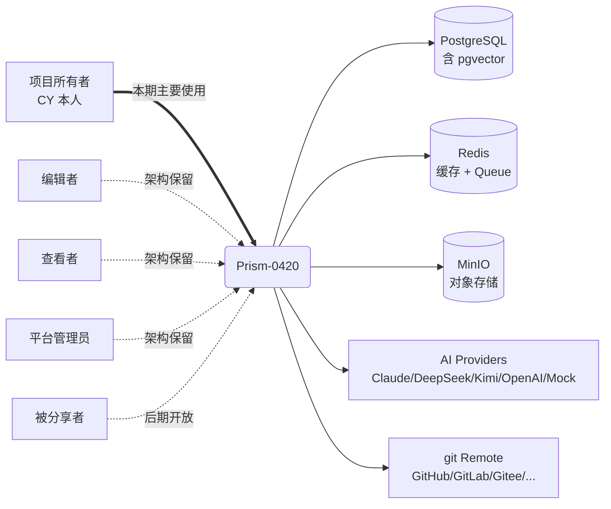

# 02 - 系统边界图（Context Diagram）

> 不画细节，只画"系统和外界谁交互"。

**状态**：accepted
**定稿日期**：2026-04-20

---

## 文档目的

明确系统的**外部用户**和**外部依赖**。

---

## Q1：系统的外部用户（5 角色）

| 角色 | 本期状态 | 备注 |
|------|---------|------|
| **项目所有者**（CY 本人） | ✅ 本期主要使用 | 唯一活跃用户 |
| **编辑者** | 🔵 架构保留 | 多人协作场景，后期启用 |
| **查看者** | 🔵 架构保留 | 多人协作场景，后期启用 |
| **平台管理员** | 🔵 架构保留 | 通过运维后台使用 |
| **被分享者** | 🔵 后期开放 | 同事，受限查看竞品/测试点 |

> 按 C（完整 fork），所有角色架构层面本期就要设计完整。

---

## Q2：系统依赖的外部服务（5 类）

| 依赖 | 用途 | 备注 |
|------|------|------|
| **PostgreSQL**（含 pgvector） | 主数据 + 向量存储 | 沿用 Prism |
| **Redis** | 缓存（AI 调用结果）+ Redis Queue（异步任务） | 新增（Prism 没用） |
| **MinIO** | 对象存储（zip / 文件上传） | 新增（Prism 用本地文件系统） |
| **AI Providers** | Claude / DeepSeek / Kimi / OpenAI（含 Embedding）/ Mock | 沿用 Prism 全部 |
| **git Remote** | git clone 远程仓库（GitHub / GitLab / Gitee 等） | 新增（Prism 设计了但未实现） |

**第三方登录**（GitHub / Google OAuth）：标注未来扩展，本期不在边界图。

---

## Q3：Mermaid 系统边界图

**图例**：
- 粗实线 ==> 当前唯一活跃使用
- 细实线 --> 系统使用外部依赖
- 虚线 -.-> 架构保留 / 后期启用

---

## 完成度判定

- [x] 所有外部用户都列出（5 角色）
- [x] 所有外部依赖都列出（5 类）
- [x] Mermaid 图能渲染
- [x] AI 完整性质疑通过：无遗漏的外部依赖
