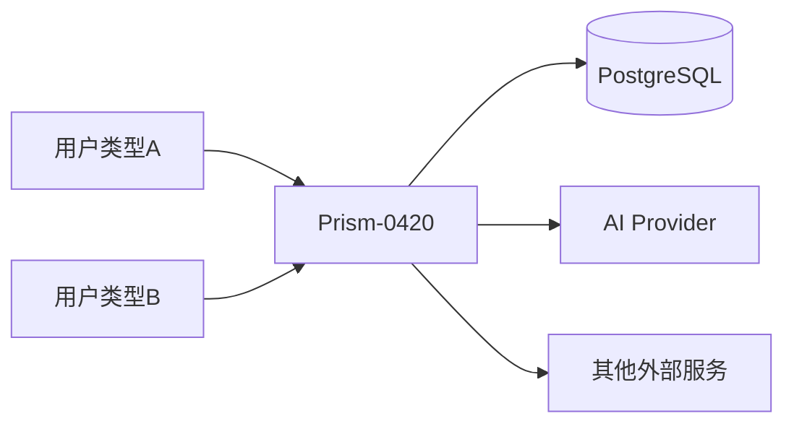

# 02 - 系统边界图（Context Diagram）

> 不画细节，只画"系统和外界谁交互"。

## 文档目的

明确系统的**外部用户**和**外部依赖**。

---

## Q1：系统的外部用户有哪些？

> [CY 列出]

```
[在此填写]
```

---

## Q2：系统依赖哪些外部服务？

> [CY 列出]
> 提示：数据库、AI Provider、对象存储、第三方 API、邮件服务、SSO 等。

```
[在此填写]
```

---

## Q3：用 Mermaid 画出来

> [CY 填写]



---

## 完成度判定

- [ ] 所有外部用户都列出
- [ ] 所有外部依赖都列出
- [ ] Mermaid 图能渲染
- [ ] AI 完整性质疑通过：没有遗漏的外部依赖
