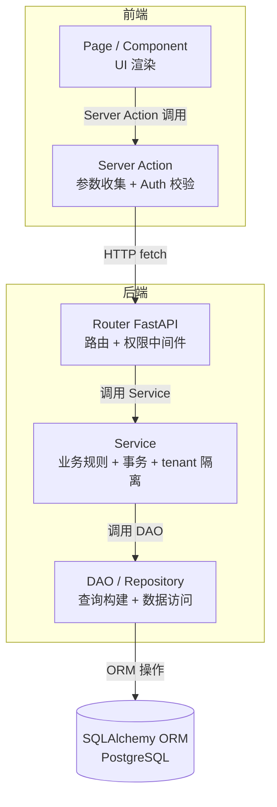

# 04 - 分层架构

**状态**：accepted
**定稿日期**：2026-04-20
**v2 修订**：2026-05-07（新增 Q7 横切层定义，对齐原则 6——M02 sprint 启动暴露分层架构原 Q1-Q6 仅覆盖纵向分层，缺横切 vs 业务模块层归属判定；详见 [`../audit/time-dimension-blindspot-2026-05-07.md`](../audit/time-dimension-blindspot-2026-05-07.md)）

---

## Q1：分几层？

**5 层**（1 个前端分层 + 2 个跨端中间 + 2 个后端分层）

```
Page / Component（前端表现层）
      ↓
Server Action（前端接口层：参数收集 + 认证 + 调 API）
      ↓ HTTP
Router（FastAPI 接口层：路由 + 权限中间件 + 校验）
      ↓
Service（业务层：业务规则 + 事务 + tenant 隔离）
      ↓
DAO / Repository（数据层：查询构建 + 数据访问）
      ↓
SQLAlchemy ORM → PostgreSQL
```

**为什么 5 层**（不是 4 或 6）：
- **不是 4 层**：Next.js 必须有 Server Action（框架要求），不能省
- **不是 6 层**：prism-0420 业务是 CRUD 为主，不需要 Domain 层（过度设计，YAGNI）

---

## Q2：每层职责和禁止行为

| 层 | 职责 | 禁止行为 |
|----|------|---------|
| **Page / Component** | UI 渲染 + 用户交互 | 禁止直接调 API（必须经 Server Action） |
| **Server Action** | 参数收集 + Auth.js session 校验 + 调 FastAPI | **禁止放业务逻辑**（防止 Prism 老坑） |
| **Router（FastAPI）** | 请求路由 + 权限中间件 + Pydantic 校验 | 禁止放业务逻辑、禁止直查 DB |
| **Service** | 业务规则 + 事务管理 + tenant 隔离 + 二次权限检查 | 禁止直接拼 SQL、禁止跳过 DAO |
| **DAO / Repository** | 查询构建 + 数据访问 | **禁止业务判断** |

---

## Q3：Mermaid 分层图



---

## Q4：权限中间件位置（三层纵深防御）

### 三层防御模型

| 层 | 检查内容 | 实现 | 何时触发 |
|----|---------|------|---------|
| **Server Action** | Auth.js session 校验（登录了吗） | Auth.js middleware / `getServerSession()` | 每次 Server Action 调用前 |
| **Router（粗粒度）** | 用户对资源的基础权限 | FastAPI `Depends(check_project_access(project_id, role))` | 每次 HTTP 请求进 Router |
| **Service（细粒度）** | 业务一致性：目标数据是否真的属于用户权限范围 | 方法内 `_check_access(user_id, entity)` | 每次 Service 方法调用（含异步路径）|

**为什么三层都要**：
- **Server Action 层**：前端请求的第一道门，快速拦截未登录请求（避免穿透到 FastAPI）
- **Router 层**：HTTP 层拦截明显越权，减少业务层负担
- **Service 层**：业务一致性兜底 + 覆盖异步路径（Queue 消费者不经过 Router）

**真实例子：异步路径的权限绕过**
- AI 任务异步执行：用户提交 → Queue → worker 后台消费
- Worker 调 Service 不经过 HTTP Router
- 如果只有 Router 权限，worker 可以拿任何用户的数据 = 安全洞
- Service 层必须做权限检查——这是异步场景的唯一防线

---

## Q5：事务边界（Service 层）

**一个 Service 方法 = 一个事务单元**

```python
class FeatureService:
    def create(self, user_id, project_id, name):
        with self.db.transaction():
            feature = self.feature_dao.create(project_id, name)
            self.dimension_dao.create_defaults(feature.id)
            self.activity_dao.log(user_id, "create_feature", feature.id)
            return feature
        # 任一步失败全回滚
```

**不放 DAO 层**：每个 DAO 方法独立事务 = 跨 DAO 操作丢失原子性
**不放 Router 层**：分层污染 + 异步路径没事务

---

## Q6：AI 任务 tenant 隔离

**方案**：Queue payload 带 `user_id` + `project_id`

```python
# 生产者
queue.enqueue({
    "task_type": "ai_import",
    "user_id": 123,
    "project_id": 456,
    "file_path": "s3://..."
})

# 消费者
def handle_ai_import(payload):
    ai_service.import_file(
        payload["user_id"], payload["project_id"], payload["file_path"]
    )
```

**防御措施（实现时加）**：
- 统一 Task 基类强制 `user_id` + `project_id` 字段（类似 Pydantic）
- Queue 消费者入口做 payload 校验
- Service 层权限检查作为第二道防线（纵深防御）

---

## Q7：横切层定义（2026-05-07 加，对齐原则 6）

> **背景**：Q1-Q6 是**纵向**分层（业务流程从前端到 DB）。原则 6 引入**横向**归属判定——某 helper / service / 配置归横切层（多模块复用）还是业务模块层（仅当前模块用）。两者正交。

### 横切层文件位置清单

横切关注必须建在以下横切层目录之一，禁止挂在业务模块名下：

| 横切层 | 路径 | 范畴 | 实例（已落地）|
|------|----|----|----|
| **认证 / 鉴权** | `api/auth/` | JWT 编解码 / require_user Depends / internal token / refresh token / tenant filter / 加密 helper（AES-256-GCM） | `dependencies.py` / `jwt_utils.py` / `internal.py` / `password.py` / `tenant_filter.py` + 待建 `crypto.py` |
| **错误处理** | `api/errors/` | AppError 基类 / ErrorCode 枚举 / 全局错误中间件 | `codes.py` / `exceptions.py` / `middleware.py` |
| **横切 service** | `api/services/<horizontal>.py` | activity_log / 限流 / 链路追踪 / metrics / 加密 service / queue scaffold | `activity_log_service.py`（M15 own）+ 待建 `crypto.py` 等 |
| **数据库基础** | `api/models/base.py` | Base 类 / TimestampMixin / ImmutableMixin / SoftDeleteMixin | 已落地（M01 sprint） |
| **Queue scaffold** | `api/queue/` | TaskPayload 基类（强制 user_id + project_id）/ 重试 / 死信 | 待建（M17 前置 mini-sprint，闸门 2.6） |
| **HTTP 中间件** | `api/middleware/` | X-Request-ID / 链路追踪 / metrics 上报 / 限流 | 部分已落地（X-Request-ID） |
| **CI/CD** | `.github/workflows/` | 构建 / 测试 / 部署 / matrix 多版本 | 占位（Phase 2.3 §8.0 补完） |
| **配置** | `api/config.py` / `api/settings.py` | env 读取 / pydantic-settings / 跨模块共享配置 | 已落地（pydantic-settings）|

### 业务模块层定义

业务模块层 = `api/{models,dao,services,routers,schemas}/` 下**以模块名命名的文件**：

- ✅ 合法：`api/services/project_service.py`（M02）/ `api/dao/node_dao.py`（M03）/ `api/routers/auth.py`（M01）等
- ❌ 反模式：`api/services/m02/crypto.py`（横切关注挂在 M02 名下）/ `api/dao/m02/audit_log_dao.py`（activity_log 横切归 M15，不该挂 M02）

### 判定流程

design 期对每个 helper / service / 配置回答：

1. 是否多模块复用？（>=2 个业务模块预期会用）
2. 是否属于横切 ADR 范畴？（ADR-002 Queue 消费者权限 / ADR-003 跨模块读 / ADR-004 Auth 横切 / ADR-005 团队扩展等）
3. 是否是工程基础设施？（加密 / 限流 / 链路追踪 / metrics / 等）

**任一是 → 横切层** | **全否 → 业务模块层** | **不确定 → 默认横切**（YAGNI 反向，原则 6）

### Owner 归属

横切层文件可以有 **owner 模块**（在文件 frontmatter 或 docstring 标注），表示"由该模块 sprint 期内建并维护"——但**位置仍在横切层**：

- `api/services/activity_log_service.py` —— owner = M15（R10-2）
- `api/auth/tenant_filter.py` —— owner = M02 / M20（注入 concrete impl）
- `api/auth/crypto.py` —— owner = 05-security-baseline（横切 ADR 范畴，未来可挂 ADR-006 加密横切）

owner 模块负责 helper 的实装 + 测试 + 演进决策；其他模块只读消费。

---

## 完成度判定

- [x] 分层理由明确（为什么 5 层）
- [x] 每层职责和禁止行为明确
- [x] Mermaid 图能渲染
- [x] 权限位置回应 reviewer B3（纵深防御覆盖异步路径）
- [x] 事务边界回应 reviewer M1
- [x] Tenant 隔离方案明确（payload 带字段）
- [x] AI 完整性质疑通过

## 关联参考

- 每个决策的原理和真实例子：`/root/cy/ai-quality-engineering/02-技术/架构设计/工程师必懂架构决策-分层权限事务隔离.md`
