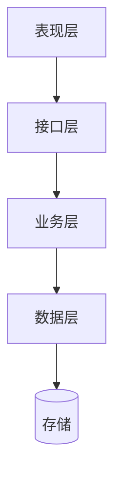

# 04 - 分层架构

> 明确每层的**职责边界**——什么能放、什么不能放。

---

## Q1：分几层？每层的职责是什么？

> [CY 填写]

Prism 现有分层（参考）：
- 表现层（Page/Component）
- 接口层（Server Action / API Route）
- 业务层（Service）
- 数据层（DAO / ORM）
- 存储（PostgreSQL）

```
[CY 列出本项目的分层]
```

---

## Q2：用 Mermaid 画出来

> [CY 填写]



---

## Q3：每层的"禁止行为"

> 列出每层"不能做什么"——这才是分层架构的意义。

| 层 | 职责 | 禁止行为 |
|----|------|---------|
| 表现层 | | |
| 接口层 | | 例：禁止放业务逻辑 |
| 业务层 | | 例：禁止直接拼 SQL |
| 数据层 | | 例：禁止业务判断 |

---

## 完成度判定

- [ ] 每层的"职责"和"禁止行为"都填写
- [ ] CY 能解释"为什么这一层不能做 X"
- [ ] AI 完整性质疑通过
