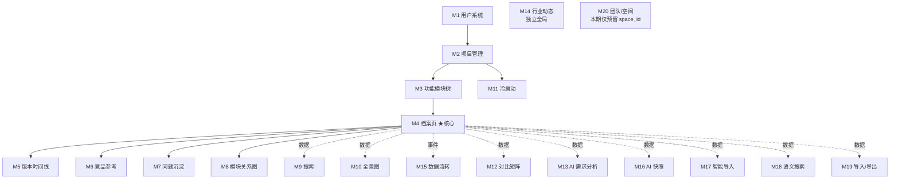

# 07 - 模块能力总览图纸

**用途**：作为 A 档 → C 档过渡的能力地图——

- **C 档 pilot 选型**：看哪个 M 覆盖哪些"唯一能力"，选最有训练价值的模块先 pilot
- **C 档批量填模板**：每个模块设计前回查本图，确认 4 维 / 状态机 / 幂等 / Queue 等字段是否需填实质内容
- **能力复用识别**：例如 4 个 AI 模块（M13/M16/M17/M18）共用 LLM 客户端封装，需统一抽象

---

## 置信度标注

| 标记 | 含义 | 来源 |
|------|------|------|
| ✅ | 已实证 | 来自 `05-module-catalog.md` 4 维表 + 各模块 accepted 设计文档对照（2026-05-05 verification log）|
| — | 显式 N/A | 不涉及（如全局数据无 tenant） |

> 原 🟡 推断项已于 2026-05-05 全部对照 M01-M20 accepted 设计 verify 落实。原 ❓ 低置信项已按 §六补漏决策处理。

---

## 一、能力矩阵（M × 能力）

| M | 名称 | Tenant | 事务 | 异步 | 并发 | 状态机 | activity_log | 幂等 | AI | 文件上传 | 主前端形态 |
|---|------|--------|------|------|------|--------|-------------|------|-----|----------|---------|
| M1 | 用户系统 | — 全局 | ❌ | ❌ | ❌ | ✅ UserStatus | ✅ 登录登出 | ❌ R11-1 显式无 | ❌ | ❌ | 表单 |
| M2 | 项目管理 | ✅ | ✅ 创建/邀请多表 | ❌ | ❌ | ✅ ProjectStatus | ✅ | ❌ G2 显式无（依赖 UNIQUE）| ❌ | ❌ | 列表+表单 |
| M3 | 功能模块树 | ✅ | ❌ | ❌ | ❌ | ❌ | ✅ | ❌ | ❌ | ❌ | 树 |
| **M4** | **功能项档案页** | ✅ | ✅ 维度+版本+log | ❌ | **✅ 乐观锁** | ❌ 用 deleted_at 软删 | ✅ | ❌ | ❌ | ❌ | 编辑器 |
| M5 | 版本时间线 | ✅ | ❌ | ❌ | ❌ | ❌ | ✅ 写转写读：仅消费 | ❌ | ❌ | ❌ | 时间线 |
| M6 | 竞品参考 | ✅ | ❌ | ❌ | ❌ | ❌ | ✅ | ❌ | ❌ | ❌ | 卡片+表单 |
| M7 | 问题沉淀 | ✅ | ❌ | ❌ | ❌ | ✅ IssueStatus | ✅ | ❌ | ❌ | ❌ | 列表 |
| M8 | 模块关系图 | ✅ | ✅ 建关联多表 | ❌ | ❌ | ❌ | ✅ | ❌ | ❌ | ❌ | 图（React Flow）|
| M9 | 搜索 | ✅ IN 过滤 | ❌ 只读 | ❌ | ❌ | ❌ | ❌ 只读 | ❌ | ❌ | ❌ | 列表 |
| M10 | 项目全景图 | ✅ | ❌ 只读 | ❌ | ❌ | ❌ | ❌ 只读 | ❌ | ❌ | ❌ | 树+完整度 |
| M11 | 冷启动支持 | ✅ | ✅ CSV 入库 | ❌ | ❌ | ❌ | ✅ | ❌ G2/G6 显式无 | ❌ | ✅ CSV | 表单+引导 |
| M12 | 对比矩阵 | ✅ | ✅ 写快照 | ❌ | ❌ | ❌ | ✅ | ❌ | ❌ | ❌ | 矩阵 |
| **M13** | **需求分析 AI** | ✅ | ✅ 写多维度 | **🌊 SSE 唯一** | ❌ | ❌ Q6 ack 不触发 | ✅ | ❌ Q6 ack 多次 save 多条历史 | ✅ | ❌ | 流式输出 |
| M14 | 行业动态 | — 全局 | ❌ | ❌ | ❌ | ❌ | ❌ 全局 | ❌ | ❌ 本期人工录入 | ❌ | 信息流 |
| M15 | 数据流转 | ✅ | ❌ 只读 | ❌ | ❌ | ❌ | 横切表 owner（消费 + 维护 schema）| ❌ | ❌ | ❌ | 时间流 |
| **M16** | **AI 生成快照** | ✅ | ✅ 写快照 | **🪷 后台唯一** | ❌ | ✅ pending/running/done | ✅ | ✅ find_idempotent + advisory lock | ✅ | ❌ | 卡片 |
| **M17** | **AI 智能导入** | ✅ | ✅ 批量多表 | **🗂️ Queue** | ❌ | ✅ pending/running/done | ✅ | ✅ key=(user_id,project_id,source_hash) 7 天复用 | ✅ | ✅ zip | 文件上传+进度 |
| M18 | 语义搜索 | ✅ | ✅ 写 embedding | 🗂️ Queue（嵌入）| ❌ | ✅ EmbeddingTaskStatus | ❌ 只读查询（写嵌入是横切）| ❌ | ✅ 嵌入 | ❌ | 列表 |
| M19 | 导入/导出 | ✅ | ❌ | ❌ | ❌ | ❌ | ✅ | ❌ 显式无 | ❌ | ✅ 导入文件 | 文件下载 |
| M20 | 团队/空间 | ✅ | ✅ 成员/迁移 | ❌ | ❌ | ❌ 用 role 枚举（owner/admin/member）| ✅ | ❌ | ❌ | ❌ | 仅数据模型预留 |

---

## 二、能力反向索引（pilot 决策核心）

| 能力 | 命中模块 | 唯一性 | pilot 价值 |
|------|---------|--------|-----------|
| **乐观锁（并发编辑）** | **M4** | 🔴 唯一 | 极高——模板"version + ConflictError"字段只能在这里实战 |
| **流式异步（SSE）** | **M13** | 🔴 唯一 | 高——AI 流式独有交互模式 |
| **后台异步（fire-and-forget）** | **M16** | 🔴 唯一 | 中——比 Queue 简单，可由 M17 类比覆盖 |
| **Queue 异步 + 持久化** | M17, M18 | 🟠 2 个 | 极高——Queue payload tenant 必走这条 |
| **批量多表事务** | M11, M17 | 🟠 2 个 | 高——M17 最复杂（zip→拆→映射→入库） |
| **AI 调用** | M13, M16, M17, M18 | 🟢 4 个 | 中——AI 客户端封装可复用 |
| **多表事务** | M2, M4, M8, M11, M12, M13, M16, M17, M18, M20 | 🟢 10 个 | 通用基线 |
| **状态机**（实证后修正）| M1, M2, M7, M16, M17, M18 | 🟢 6 个 | 通用基线（M4/M13/M20 用 soft-delete/历史表/role 替代）|
| **idempotency_key**（实证后大幅收敛）| M16, M17 | 🟠 2 个 | 高——M17 是唯一全套幂等示范（key+7d 窗口）|
| **文件上传**（新增列 §六.A2）| M11, M17, M19 | 🟠 3 个 | 高——提示必抽统一上传服务抽象（multipart / size limit / virus scan / 大文件分片）|
| **全局数据（无 tenant）** | M1, M14 | 🟠 2 个 | 中——DAO 层"豁免显式声明"路径 |
| **复杂前端可视化** | M8（图）/ M10（树）/ M12（矩阵）/ M15（时间流） | 🟠 4 种形态 | 视 D 档（前端详设）需要 |

---

## 三、依赖关系图（实现顺序参考）

**实现顺序结论**：
- **底层基线（必按序）**：M1 → M2 → M3 → M4
- **M4 之后并行**：M5-M8（同级扩展）/ M9-M10-M15（只读视图）/ M11（独立入口）
- **AI 类（依赖 M4 数据）**：M12 / M13 / M16 / M17 / M18
- **导出 / 扩展**：M19 / M20

---

## 四、Pilot 候选三路线对照

| 路线 | 实战覆盖能力数 | 唯一能力命中 | 缺口 | 推荐度 |
|-----|--------------|-------------|------|-------|
| **A: M4 单 pilot** | 5（Tenant/事务/并发/状态机/log）| **并发（唯一）** | 异步、AI、idempotency、Queue payload、文件上传 | ⭐⭐⭐ |
| **B: M17 单 pilot** | 8（Tenant/事务/Queue/状态机/log/幂等/AI/文件上传）| **Queue 异步 + 完整幂等** | 并发 | ⭐⭐⭐⭐ |
| **C: M4 + M17 双 pilot** | 11+ | **并发 + Queue + 幂等 三唯一** | 流式 SSE（M13）、后台异步（M16）| ⭐⭐⭐⭐⭐ |

**当前推荐**：路线 C（M4 + M17 双 pilot 串行）——M4 单 pilot 缺的"异步 / Queue / AI / idempotency / 文件上传"5 项都是模板必须字段，纸面写不如实战检验，模板会更扎实。

---

## 五、Verification Log（2026-05-05 校验落实）

> 原 🟡 推断项与 ❓ 低置信项的 ground truth 来源 = M01-M20 各 accepted 设计文档。

### 5.1 状态机字段（推断 1）

| M | 原推断 | 实证结果 | 来源 |
|---|---|---|---|
| M01 | 🟡 账号状态 | ✅ `status: Mapped[UserStatus]` | M01 §3 schema |
| M02 | 🟡 项目状态 | ✅ `status: Mapped[ProjectStatus]` | M02 §3 schema |
| M04 | 🟡 项目项状态 | ❌ 无 status 字段，删除走 `deleted_at` 软删 | M04 §3 |
| M07 | 🟡 问题状态 | ✅ `status` 配 `IssueStatus` 枚举 | M07 §3 |
| M13 | 🟡 任务状态 | ❌ Q6 ack：save 多次 = 多条历史，不引状态机 | M13 §11 |
| M16 | 🟡 快照状态 | ✅ `status default="pending"` | M16 §3 |
| M17 | 🟡 任务状态 | ✅ `status default="pending"`（jobs 表）| M17 §3 |
| M18 | 🟡 嵌入状态 | ✅ `status: Mapped[EmbeddingTaskStatus]` | M18 §3（audit m1）|
| M20 | 🟡 成员状态 | ❌ 用 `role` 枚举（owner/admin/member）替代状态机 | M20 §3 + ADR-005 Q9 |

### 5.2 activity_log（推断 2）

M3 / M5 / M6 / M11 / M19 — 全 ✅（各模块 §10 均有 ActionType 写入逻辑；M5 是消费方而非写入方，原标 ❌ 改为"消费"）。

### 5.3 idempotency_key（推断 3）

| M | 原推断 | 实证结果 | 来源 |
|---|---|---|---|
| M01 注册 | 🟡 | ❌ 显式无（R11-1）| M01 §11 |
| M02 删除/邀请 | 🟡 | ❌ 显式无（G2 统一规则，依赖 UNIQUE 约束）| M02 §11 |
| M11 重导 | 🟡 | ❌ G2/G6 决策 | M11 §11 |
| M13 重新生成 | 🟡 | ❌ Q6 ack 不触发 | M13 §11 |
| M16 重生成 | 🟡 | ✅ find_idempotent + PG advisory lock | M16 §11 + audit B1 |
| M17 重传 | 🟡 | ✅ key=(user_id, project_id, source_hash) 7 天复用 | M17 §11 + Q6 ack |
| M19 重导 | 🟡 | ❌ 显式无 | M19 §11 |

**结论**：原推断 7 个全幂等过度乐观；真实命中 = 仅 M16 + M17。这两个是 idempotency 模板的标杆 pilot。

### 5.4 M14 AI 推送源（推断 4）

✅ **本期**：人工录入 + admin 编辑；`source_type` 枚举预留 RSS / 第三方 API；本期不实装 arq Queue 抓取任务。

> 来源：M14 §1 灰区 1（CY 2026-04-21 ack）。未来切自动抓取需补 arq 任务设计。

---

## 六、能力维度补漏候选（决策）

| 候选列 | 决策 | 理由 |
|---|---|---|
| **WebSocket 长连接** | ❌ 不加 | 本期 M01 不引入 WS（ADR-004 P6 预留 Q4）；M13 用 SSE / M16 后台 / M17 Queue 均不需要 WS。M20 协作场景未实施。新增列会污染矩阵 |
| **文件上传** | ✅ **加列** | M11/M17/M19 共 3 个模块命中，提示必抽统一上传服务抽象（multipart parser / size limit / virus scan / 大文件分片），加列让 pilot 选型直接看到 |
| **外部 API 调用** | ❌ 不加 | 仅 M14 涉及且本期人工录入不调外部，加列只为 1 个未启用模块过度设计 |
| **缓存策略（Redis）** | ❌ 本期不加 | M9 搜索 / M10 全景 / M12 对比矩阵的缓存需求未实测；留 Phase 2.3 §8.0 上线前观测 P95 后再决；现在加列是无依据的预填 |

---

## 完成度判定

- [x] 20 个模块能力矩阵全列
- [x] 能力反向索引（pilot 决策直接可用）
- [x] 依赖关系 mermaid 图
- [x] 三路线 pilot 对照
- [x] 🟡 推断项全部 verify 落实（§五 verification log，2026-05-05）
- [x] 能力维度补漏候选决策（§六：加文件上传 / 砍 WS+外部API+缓存）
- [x] status 转 accepted（2026-05-05）

---

## 关联参考

- 数据来源：`design/00-architecture/05-module-catalog.md`（4 维表）
- 4 维原理：`design/00-architecture/06-design-principles.md`（原则 5 + 约束清单）
- 分层架构：`design/00-architecture/04-layer-architecture.md`（5 层 + 三层权限）
- 多人架构 4 维讲解：`/root/cy/ai-quality-engineering/02-技术/架构设计/工程师必懂架构决策-分层权限事务隔离.md`
