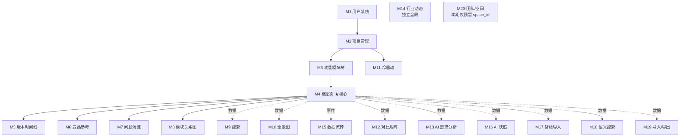

# 07 - 模块能力总览图纸

**用途**：作为 A 档 → C 档过渡的能力地图——

- **C 档 pilot 选型**：看哪个 M 覆盖哪些"唯一能力"，选最有训练价值的模块先 pilot
- **C 档批量填模板**：每个模块设计前回查本图，确认 4 维 / 状态机 / 幂等 / Queue 等字段是否需填实质内容
- **能力复用识别**：例如 4 个 AI 模块（M13/M16/M17/M18）共用 LLM 客户端封装，需统一抽象

---

## 置信度标注

| 标记 | 含义 | 来源 |
|------|------|------|
| ✅ | 高置信 | 来自 `05-module-catalog.md` 4 维表（accepted） |
| 🟡 | 中置信 | 基于 PRD + 业务推断，**待 CY 校验** |
| ❓ | 低置信 | PRD 未明确，pilot 时再定 |
| — | 显式 N/A | 不涉及（如全局数据无 tenant） |

---

## 一、能力矩阵（M × 能力）

| M | 名称 | Tenant | 事务 | 异步 | 并发 | 状态机 | activity_log | 幂等 | AI | 主前端形态 |
|---|------|--------|------|------|------|--------|-------------|------|-----|---------|
| M1 | 用户系统 | — 全局 | ❌ | ❌ | ❌ | 🟡 账号状态 | 🟡 登录登出 | 🟡 注册 | ❌ | 表单 |
| M2 | 项目管理 | ✅ | ✅ 创建/邀请多表 | ❌ | ❌ | 🟡 项目状态 | 🟡 | 🟡 删除/邀请 | ❌ | 列表+表单 |
| M3 | 功能模块树 | ✅ | ❌ | ❌ | ❌ | ❌ | 🟡 | ❌ | ❌ | 树 |
| **M4** | **功能项档案页** | ✅ | ✅ 维度+版本+log | ❌ | **✅ 乐观锁** | 🟡 项目项状态 | 🟡 | ❌ | ❌ | 编辑器 |
| M5 | 版本时间线 | ✅ | ❌ | ❌ | ❌ | ❌ | ❌ 只读 | ❌ | ❌ | 时间线 |
| M6 | 竞品参考 | ✅ | ❌ | ❌ | ❌ | ❌ | 🟡 | ❌ | ❌ | 卡片+表单 |
| M7 | 问题沉淀 | ✅ | ❌ | ❌ | ❌ | 🟡 问题状态 | 🟡 | ❌ | ❌ | 列表 |
| M8 | 模块关系图 | ✅ | ✅ 建关联多表 | ❌ | ❌ | ❌ | 🟡 | ❌ | ❌ | 图（React Flow）|
| M9 | 搜索 | ✅ IN 过滤 | ❌ 只读 | ❌ | ❌ | ❌ | ❌ 只读 | ❌ | ❌ | 列表 |
| M10 | 项目全景图 | ✅ | ❌ 只读 | ❌ | ❌ | ❌ | ❌ 只读 | ❌ | ❌ | 树+完整度 |
| M11 | 冷启动支持 | ✅ | ✅ CSV 入库 | ❌ | ❌ | ❌ | 🟡 | 🟡 重导 | ❌ | 表单+引导 |
| M12 | 对比矩阵 | ✅ | ✅ 写快照 | ❌ | ❌ | ❌ | 🟡 | ❌ | ❌ | 矩阵 |
| **M13** | **需求分析 AI** | ✅ | ✅ 写多维度 | **🌊 SSE 唯一** | ❌ | 🟡 任务状态 | 🟡 | 🟡 重新生成 | ✅ | 流式输出 |
| M14 | 行业动态 | — 全局 | ❌ | ❌ | ❌ | ❌ | ❌ 全局 | ❌ | ❓ 推送源 | 信息流 |
| M15 | 数据流转 | ✅ | ❌ 只读 | ❌ | ❌ | ❌ | 消费 log | ❌ | ❌ | 时间流 |
| **M16** | **AI 生成快照** | ✅ | ✅ 写快照 | **🪷 后台唯一** | ❌ | 🟡 快照状态 | 🟡 | 🟡 重生成 | ✅ | 卡片 |
| **M17** | **AI 智能导入** | ✅ | ✅ 批量多表 | **🗂️ Queue** | ❌ | 🟡 任务状态 | 🟡 | 🟡 重传 | ✅ | 文件上传+进度 |
| M18 | 语义搜索 | ✅ | ✅ 写 embedding | 🗂️ Queue（嵌入）| ❌ | 🟡 嵌入状态 | ❌ 只读查询 | ❌ | ✅ 嵌入 | 列表 |
| M19 | 导入/导出 | ✅ | ❌ | ❌ | ❌ | ❌ | 🟡 | 🟡 重导 | ❌ | 文件下载 |
| M20 | 团队/空间 | ✅ | ✅ 成员/迁移 | ❌ | ❌ | 🟡 成员状态 | 🟡 | ❌ | ❌ | 仅数据模型预留 |

---

## 二、能力反向索引（pilot 决策核心）

| 能力 | 命中模块 | 唯一性 | pilot 价值 |
|------|---------|--------|-----------|
| **乐观锁（并发编辑）** | **M4** | 🔴 唯一 | 极高——模板"version + ConflictError"字段只能在这里实战 |
| **流式异步（SSE）** | **M13** | 🔴 唯一 | 高——AI 流式独有交互模式 |
| **后台异步（fire-and-forget）** | **M16** | 🔴 唯一 | 中——比 Queue 简单，可由 M17 类比覆盖 |
| **Queue 异步 + 持久化** | M17, M18 | 🟠 2 个 | 极高——Queue payload tenant 必走这条 |
| **批量多表事务** | M11, M17 | 🟠 2 个 | 高——M17 最复杂（zip→拆→映射→入库） |
| **AI 调用** | M13, M16, M17, M18 | 🟢 4 个 | 中——AI 客户端封装可复用 |
| **多表事务** | M2, M4, M8, M11, M12, M13, M16, M17, M18, M20 | 🟢 10 个 | 通用基线 |
| **状态机** | M1, M2, M4, M7, M13, M16, M17, M18, M20 | 🟢 9 个 | 通用基线 |
| **idempotency_key** | M1, M2, M11, M13, M16, M17, M19 | 🟢 7 个 | 中——多发于"敏感操作"模块 |
| **全局数据（无 tenant）** | M1, M14 | 🟠 2 个 | 中——DAO 层"豁免显式声明"路径 |
| **复杂前端可视化** | M8（图）/ M10（树）/ M12（矩阵）/ M15（时间流） | 🟠 4 种形态 | 视 D 档（前端详设）需要 |

---

## 三、依赖关系图（实现顺序参考）

**实现顺序结论**：
- **底层基线（必按序）**：M1 → M2 → M3 → M4
- **M4 之后并行**：M5-M8（同级扩展）/ M9-M10-M15（只读视图）/ M11（独立入口）
- **AI 类（依赖 M4 数据）**：M12 / M13 / M16 / M17 / M18
- **导出 / 扩展**：M19 / M20

---

## 四、Pilot 候选三路线对照

| 路线 | 实战覆盖能力数 | 唯一能力命中 | 缺口 | 推荐度 |
|-----|--------------|-------------|------|-------|
| **A: M4 单 pilot** | 5（Tenant/事务/并发/状态机/log）| **并发（唯一）** | 异步、AI、idempotency、Queue payload | ⭐⭐⭐ |
| **B: M17 单 pilot** | 7（Tenant/事务/Queue/状态机/log/幂等/AI）| **Queue 异步** | 并发 | ⭐⭐⭐ |
| **C: M4 + M17 双 pilot** | 10+ | **并发 + Queue 双唯一** | 流式 SSE（M13）、后台异步（M16）| ⭐⭐⭐⭐ |

**当前推荐**：路线 C（M4 + M17 双 pilot 串行）——M4 单 pilot 缺的"异步 / Queue / AI / idempotency"4 项都是模板必须字段，纸面写不如实战检验，模板会更扎实。

---

## 五、待 CY 校验清单（解 draft 进 accepted 的前置）

### 🟡 推断项（请逐项确认）

1. **状态机**：M1 / M2 / M4 / M7 / M13 / M16 / M17 / M18 / M20 是否真有显式状态字段？
2. **activity_log**：M3 / M5 / M6 / M11 / M19 是否需要写日志？我按"任何变更操作都写"推断
3. **idempotency_key**：M1 注册 / M2 删除 / M11 重导 / M13/M16 重新生成 / M17 重传 / M19 重导——是否都需要幂等？
4. **AI 推送源**（M14）：行业动态数据来源是 LLM 推送 / 人工录入 / 第三方 API？

### ❓ 能力维度补漏候选（要不要加列）

- **WebSocket 长连接**（独立于 SSE）——本期是否需要？
- **文件上传**（M11 / M17 / M19 都涉及）——是否独立成列以提示统一文件服务抽象
- **外部 API 调用**（M14 行业动态推送源）——是否需要专门的"对外集成"能力列
- **缓存策略**（Redis）——M9 搜索 / M10 全景 / M12 对比矩阵 是否有缓存需求

---

## 完成度判定

- [x] 20 个模块能力矩阵全列
- [x] 能力反向索引（pilot 决策直接可用）
- [x] 依赖关系 mermaid 图
- [x] 三路线 pilot 对照
- [ ] 🟡 推断项 CY 校验通过 → status 转 accepted
- [ ] 能力维度补漏候选 CY 决策

---

## 关联参考

- 数据来源：`design/00-architecture/05-module-catalog.md`（4 维表）
- 4 维原理：`design/00-architecture/06-design-principles.md`（原则 5 + 约束清单）
- 分层架构：`design/00-architecture/04-layer-architecture.md`（5 层 + 三层权限）
- 多人架构 4 维讲解：`/root/cy/ai-quality-engineering/02-技术/架构设计/工程师必懂架构决策-分层权限事务隔离.md`
