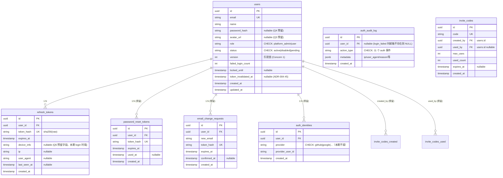
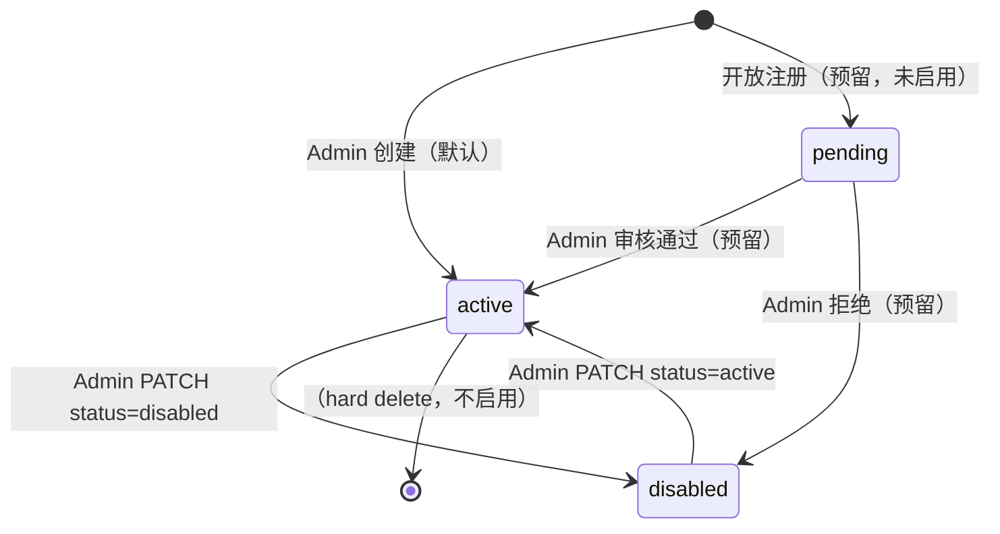

# M01 用户账号 - 详细设计

> **Auth Pilot 模块**——本文档同时验证 C 档模板对"横切源头模块"的可复用性，并沉淀 [`ADR-004 Auth 横切范式`](../../adr/ADR-004-auth-cross-cutting.md)。
>
> **本期落地策略**：实现最简（照 Prism `/root/prism/api/services/auth.py` + `routers/auth.py` 的成熟选型跑通），schema/架构按"都支持设计"预留扩展口——未来加开放注册 / 忘密 / OAuth / Session 管理 / Profile 全量字段 / 角色扩展，不做破坏性迁移。
>
> **与其他 pilot 的定位差异**：
> - M04（同步 pilot）：有主表 + 业务 CRUD 的同步交互范本
> - M17（异步 pilot）：Queue + WebSocket + TaskPayload 的异步范本
> - **M01（auth pilot）**：横切凭据路径 + 鉴权源头 + 预留扩展口的范本

---

## 1. 职责边界（in scope / out of scope）

### In scope（M01 负责）

PRD/US 对应：F1 用户账号（参 `/root/prism/docs/product/feature-list-and-user-stories.md` F1 AC1-AC13；shadow 项目复用需求、简化实现）。

| 能力 | 描述 | 对应 Prism AC |
|------|------|--------------|
| **登录** | 邮箱+密码 → Access JWT + Refresh Token | AC1, AC2, AC5, AC6, AC10 |
| **登出** | 撤销 refresh token | AC9 |
| **续杯** | Refresh token → 新 Access JWT | AC7, AC8 |
| **当前用户** | `GET /auth/me` | AC4 |
| **Profile 修改**（本期最简）| PATCH /auth/me 支持 `name` + `password` | AC4 扩展 |
| **失败锁** | 连续 5 次失败密码 → 锁 15min | AC10（安全） |
| **账号禁用触发失效** | admin 置 status=disabled → 所有 session 立即失效 | AC12 |
| **Admin 创建用户** | POST `/auth/users`（platform_admin 权限） | AC1, AC11 |
| **Admin 用户列表** | GET `/auth/users` | AC11 |
| **Admin 改 role/status** | PATCH `/auth/users/{id}` | AC11 |
| **Bootstrap 首 admin** | env seed + CLI `python -m api.cli create-admin` | 部署必需 |
| **Internal token 路径** | HMAC 服务间调用 Next.js Server Action → FastAPI | ADR-004 P2 |
| **凭据→User 解析（源头）** | `AuthService.resolve_from_bearer/internal/refresh` | ADR-004 P1/P2/P3 |
| **Require_user Depends** | 所有业务路由的唯一合并鉴权入口 | ADR-004 #2 |

### Out of scope（明确不做，扩展预留见 §3 附录）

| 不做的事 | 归属模块 / 未来实装方案 |
|---------|----------------------|
| 开放自助注册（`POST /auth/register`）| 本模块未来扩展（Q1=B/C/D） |
| 忘记密码 / 密码重置邮件链路 | 本模块未来扩展（Q2=B/C），schema 预留 `password_reset_tokens` |
| 邀请码注册 | 本模块未来扩展（Q1=C），schema 预留 `invite_codes` |
| OAuth / SSO 登录 | 本模块未来扩展（Q4），schema 预留 `auth_identities` |
| 修改 email（带二次验证）| 本模块未来扩展（Q3=B），schema 预留 `email_change_requests` |
| 头像上传 / 文件存储 | 本模块 `users.avatar_url` 字段建出但 PATCH 不开放；文件存储归附件模块（未来 M20 外） |
| Session 管理页（多设备列表 + 撤销）| 本模块未来扩展（Q5=B/C），`refresh_tokens` 扩 4 字段已建出 |
| 项目级角色（owner/admin/editor/viewer）| M02 项目管理自己定义 `project_members.role` |
| Activity_log 表的 schema / 迁移 | M15（R10-2：横切表归 M15 own）|

### 边界灰区（显式说明）

- **M01 拥有 `users.role` 全局角色**（platform_admin / user），不碰项目内角色
- **M01 不写项目级 activity_log 的 project_id 字段**——M01 的 activity_log 事件 `project_id = NULL`（M15 schema 需支持 NULL，见 §10）
- **M01 本身无 tenant**：users 是跨项目实体，不加 project_id；§9 DAO 豁免清单列为"全局表不做 tenant 过滤"
- **登录/登出 端点本身不走 `require_user`**——它们**产出**凭据而非**消费**凭据；§8 明确声明豁免

---

## 2. 依赖模块图

```mermaid
flowchart LR
  ENV[环境变量<br/>JWT_SECRET<br/>INTERNAL_TOKEN<br/>BOOTSTRAP_ADMIN_*]

  ENV --> M01
  M01[M01 用户账号<br/>★ auth pilot]

  M01 -.user_id.-> M02[M02 项目]
  M01 -.user_id.-> M03[M03 模块树]
  M01 -.user_id.-> M04[M04 档案页]
  M01 -.user_id.-> M05[M05-M20 所有模块]
  M01 -.user_id.-> M15[M15 activity_log<br/>横切]
  M01 -.require_user-.-> ROUTERS[所有路由]
  M01 -.TaskPayload.user_id-.-> QUEUE[Queue 异步模块<br/>M13/M16/M17/M18]
```

**M01 无前置模块依赖**（除环境变量 + DB 基础设施）。M01 是全系统用户身份源头。

**M01 被依赖的契约**：
- `require_user` FastAPI Depends —— 所有业务路由
- `AuthService.resolve_from_*` —— 服务间调用 / Queue 消费者入口鉴权
- `User` SQLAlchemy 模型 —— 其他模块 `ForeignKey("users.id")` 引用（`created_by` / `updated_by` / `user_id` 列）
- `hash_password / verify_password` —— CLI bootstrap / seed 脚本复用

---

## 3. 数据模型（SQLAlchemy + Alembic）

### 本期实装表清单

| 表 | 本期状态 | 说明 |
|----|---------|------|
| `users` | ✅ 实装 | 主表，含 Q3 扩展字段 `avatar_url`（nullable）+ `version` 乐观锁字段（Concern 1）|
| `refresh_tokens` | ✅ 实装 + Q5 扩展字段 | 含 `device_info / ip / user_agent / last_seen_at` 预建 |
| `auth_audit_log` | ✅ 实装 | M01 独立审计日志表（Concern 2+3 联动决策：M01 auth 事件不进 M15 activity_log 横切表，避免 M15 UI 被登录流水淹没 + 免去 M15 project_id NULL 回改） |
| `password_reset_tokens` | ✅ 建表预留 | 无路由消费；Alembic 迁移建出表 |
| `invite_codes` | ✅ 建表预留 | 无路由消费 |
| `auth_identities` | ✅ 建表预留 | 无路由消费；`users.password_hash` 配合改 nullable |
| `email_change_requests` | ✅ 建表预留 | 无路由消费 |

**本期全部建表**（含预留四表）的理由（CY 2026-04-24 ack "都创建出来"）：
1. 一次 Alembic 迁移比未来 6 次迁移干净
2. 预留表对"都支持设计"的对齐度最高，未来扩展只加路由不动 schema
3. 空表对 DB 无负担（空索引 + 约束）；对代码复杂度无影响（model 定义 + 不引用 = 零业务影响）

**反向约束**：预留表的 SQLAlchemy model 必须存在（否则 Alembic autogenerate 下次会删表）；但 Service/Router 层不得 import 这些 model（由 CI 静态扫描守）——防止"已建了就随手用"的设计漂移。

### ER 图



### SQLAlchemy models

```python
# api/models/user.py
from sqlalchemy.orm import Mapped, mapped_column, relationship
from sqlalchemy import ForeignKey, Integer, String, Text, CheckConstraint, UniqueConstraint, DateTime
from sqlalchemy.dialects.postgresql import UUID, INET, JSONB
from datetime import datetime
from uuid import UUID as PyUUID, uuid4
from enum import Enum
from typing import Optional
from .base import Base, TimestampMixin


class UserRole(str, Enum):
    PLATFORM_ADMIN = "platform_admin"
    USER = "user"


class UserStatus(str, Enum):
    ACTIVE = "active"
    DISABLED = "disabled"
    PENDING = "pending"  # 预留（Q1 开放注册扩展时使用；本期创建默认 active）


class User(Base, TimestampMixin):
    __tablename__ = "users"
    __table_args__ = (
        UniqueConstraint("email", name="uq_users_email"),
        CheckConstraint(
            "role IN ('platform_admin', 'user')",
            name="ck_users_role",
        ),
        CheckConstraint(
            "status IN ('active', 'disabled', 'pending')",
            name="ck_users_status",
        ),
    )

    id: Mapped[PyUUID] = mapped_column(UUID(as_uuid=True), primary_key=True, default=uuid4)
    # M1 审计决策：全部文本列改用 String(N) + CheckConstraint（与 4 模块 pilot 统一）
    email: Mapped[str] = mapped_column(String(320), nullable=False, index=True)  # RFC 5321 max
    name: Mapped[str] = mapped_column(String(255), nullable=False)
    # Q4 预留：OAuth 用户 password_hash 可为 null。本期 Service 层仍强制非空校验
    password_hash: Mapped[Optional[str]] = mapped_column(String(128), nullable=True)  # bcrypt hash 固定 60 字符 + 余量
    # Q3 预留：avatar_url 建出但本期 PATCH 不开放
    avatar_url: Mapped[Optional[str]] = mapped_column(String(1024), nullable=True)  # URL 或对象存储 key
    role: Mapped[UserRole] = mapped_column(String(32), nullable=False, default=UserRole.USER.value)
    status: Mapped[UserStatus] = mapped_column(String(32), nullable=False, default=UserStatus.ACTIVE.value)
    failed_login_count: Mapped[int] = mapped_column(Integer, nullable=False, default=0)
    locked_until: Mapped[Optional[datetime]] = mapped_column(DateTime(timezone=True), nullable=True)
    # ADR-004 #5：所有失效事件统一更新此字段；access token iat 比较
    token_invalidated_at: Mapped[Optional[datetime]] = mapped_column(DateTime(timezone=True), nullable=True)
    # Concern 1：乐观锁，防止 admin 并发改 role/status 产生逻辑矛盾账号
    # 所有 PATCH /auth/users/{id} 和 PATCH /auth/me（修改字段）必须传 expected_version
    # UPDATE ... WHERE id=? AND version=expected，rows=0 → VersionConflictError
    version: Mapped[int] = mapped_column(Integer, nullable=False, default=1)

    refresh_tokens = relationship("RefreshToken", back_populates="user", cascade="all, delete-orphan")


class AuthAuditLog(Base):
    """
    M01 独立审计日志表（Concern 2+3 联动决策）。

    为什么不进 M15 activity_log：
    - login/refresh 是高频事件（预估 50+/用户/天），塞进 M15 会把业务时间线变成登录流水
    - M01 事件无 project_id（系统级），混入 activity_log 会让 M15 schema 放宽 NOT NULL 约束
    - 分表后 M15 只记业务事件（project/node/dimension 等），M01 只记 auth 事件，职责清晰

    与 M15 的协作：
    - 未来若有"项目级用户事件"（如"alice 被加入 project X"），由 M02 project_members 写 M15 activity_log
    - 本表事件全部与项目无关，纯账号维度
    """
    __tablename__ = "auth_audit_log"
    __table_args__ = (
        CheckConstraint(
            "action_type IN ("
            "'user.login_success', 'user.login_failed', 'user.locked', "
            "'user.logout', 'user.refresh_token', 'user.profile_update', "
            "'user.password_change', 'user.admin_create', "
            "'user.admin_update_role', 'user.admin_update_status', "
            "'user.all_tokens_revoked'"
            ")",
            name="ck_auth_audit_action_type",
        ),
    )

    id: Mapped[PyUUID] = mapped_column(UUID(as_uuid=True), primary_key=True, default=uuid4)
    # nullable：登录失败时若 email 不存在，user_id 为 NULL（metadata 存 email 字符串）
    user_id: Mapped[Optional[PyUUID]] = mapped_column(UUID(as_uuid=True), ForeignKey("users.id", ondelete="SET NULL"), nullable=True, index=True)
    action_type: Mapped[str] = mapped_column(String(64), nullable=False, index=True)
    # jsonb 不限结构：ip / user_agent / reason / old_role / new_role / target_id 等按事件类型填
    metadata_: Mapped[dict] = mapped_column("metadata", JSONB, nullable=False, default=dict)
    created_at: Mapped[datetime] = mapped_column(DateTime(timezone=True), nullable=False, index=True)


class RefreshToken(Base):
    __tablename__ = "refresh_tokens"
    __table_args__ = (
        UniqueConstraint("token_hash", name="uq_refresh_token_hash"),
    )

    id: Mapped[PyUUID] = mapped_column(UUID(as_uuid=True), primary_key=True, default=uuid4)
    user_id: Mapped[PyUUID] = mapped_column(UUID(as_uuid=True), ForeignKey("users.id", ondelete="CASCADE"), nullable=False, index=True)
    token_hash: Mapped[str] = mapped_column(String(128), nullable=False)  # sha256 hex = 64 字符 + 余量
    expires_at: Mapped[datetime] = mapped_column(DateTime(timezone=True), nullable=False, index=True)
    # Q5 预留字段：本期 login 时就填，未来加 Session 管理页免迁移
    device_info: Mapped[Optional[str]] = mapped_column(String(512), nullable=True)
    ip: Mapped[Optional[str]] = mapped_column(INET, nullable=True)
    user_agent: Mapped[Optional[str]] = mapped_column(String(512), nullable=True)
    last_seen_at: Mapped[Optional[datetime]] = mapped_column(DateTime(timezone=True), nullable=True)
    created_at: Mapped[datetime] = mapped_column(DateTime(timezone=True), nullable=False)

    user = relationship("User", back_populates="refresh_tokens")


# ─── 预留表（本期建表，不引用）────────

class PasswordResetToken(Base):
    """Q2 预留：忘密链路。本期 CI 守护禁止 import。"""
    __tablename__ = "password_reset_tokens"
    __table_args__ = (UniqueConstraint("token_hash", name="uq_pwd_reset_hash"),)

    id: Mapped[PyUUID] = mapped_column(UUID(as_uuid=True), primary_key=True, default=uuid4)
    user_id: Mapped[PyUUID] = mapped_column(UUID(as_uuid=True), ForeignKey("users.id", ondelete="CASCADE"), nullable=False, index=True)
    token_hash: Mapped[str] = mapped_column(String(128), nullable=False)
    expires_at: Mapped[datetime] = mapped_column(DateTime(timezone=True), nullable=False)
    used_at: Mapped[Optional[datetime]] = mapped_column(DateTime(timezone=True), nullable=True)
    created_at: Mapped[datetime] = mapped_column(DateTime(timezone=True), nullable=False)


class InviteCode(Base):
    """Q1 预留：邀请码注册。本期 CI 守护禁止 import。"""
    __tablename__ = "invite_codes"
    __table_args__ = (UniqueConstraint("code", name="uq_invite_code"),)

    id: Mapped[PyUUID] = mapped_column(UUID(as_uuid=True), primary_key=True, default=uuid4)
    code: Mapped[str] = mapped_column(String(64), nullable=False)
    created_by: Mapped[PyUUID] = mapped_column(UUID(as_uuid=True), ForeignKey("users.id"), nullable=False)
    used_by: Mapped[Optional[PyUUID]] = mapped_column(UUID(as_uuid=True), ForeignKey("users.id"), nullable=True)
    max_uses: Mapped[int] = mapped_column(Integer, nullable=False, default=1)
    used_count: Mapped[int] = mapped_column(Integer, nullable=False, default=0)
    expires_at: Mapped[Optional[datetime]] = mapped_column(DateTime(timezone=True), nullable=True)
    created_at: Mapped[datetime] = mapped_column(DateTime(timezone=True), nullable=False)


class AuthIdentity(Base):
    """Q4 预留：OAuth 身份绑定。本期 CI 守护禁止 import。"""
    __tablename__ = "auth_identities"
    __table_args__ = (
        UniqueConstraint("provider", "provider_user_id", name="uq_identity_provider_user"),
        CheckConstraint(
            "provider IN ('github', 'google')",  # 未来扩展时添加
            name="ck_identity_provider",
        ),
    )

    id: Mapped[PyUUID] = mapped_column(UUID(as_uuid=True), primary_key=True, default=uuid4)
    user_id: Mapped[PyUUID] = mapped_column(UUID(as_uuid=True), ForeignKey("users.id", ondelete="CASCADE"), nullable=False, index=True)
    provider: Mapped[str] = mapped_column(String(32), nullable=False)
    provider_user_id: Mapped[str] = mapped_column(String(255), nullable=False)
    created_at: Mapped[datetime] = mapped_column(DateTime(timezone=True), nullable=False)


class EmailChangeRequest(Base):
    """Q3-B 预留：换 email 二次验证。本期 CI 守护禁止 import。"""
    __tablename__ = "email_change_requests"
    __table_args__ = (UniqueConstraint("token_hash", name="uq_email_change_hash"),)

    id: Mapped[PyUUID] = mapped_column(UUID(as_uuid=True), primary_key=True, default=uuid4)
    user_id: Mapped[PyUUID] = mapped_column(UUID(as_uuid=True), ForeignKey("users.id", ondelete="CASCADE"), nullable=False, index=True)
    new_email: Mapped[str] = mapped_column(String(320), nullable=False)
    token_hash: Mapped[str] = mapped_column(String(128), nullable=False)
    expires_at: Mapped[datetime] = mapped_column(DateTime(timezone=True), nullable=False)
    confirmed_at: Mapped[Optional[datetime]] = mapped_column(DateTime(timezone=True), nullable=True)
    created_at: Mapped[datetime] = mapped_column(DateTime(timezone=True), nullable=False)
```

### R3 合规自查

| 规则 | 合规点 |
|------|-------|
| **R3-1** SQLAlchemy class 代码块 | ✅ 全部 7 个表均含完整 class（含 auth_audit_log）|
| **R3-2** 状态字段三重防护（`users.role` / `users.status` / `auth_identities.provider`）| ✅ `Mapped[Enum]` 注解 + `Text` 列类型 + `CheckConstraint` 显式值（统一选 String + CheckConstraint，和 4 模块一致） |
| **R3-3** tenant 字段冗余 | ✅ N/A——M01 无 tenant（users 跨项目全局），§9 豁免清单列 |
| **R3-4** 核心决策改回成本 | ✅ 见下方"候选 B 改回成本"块 |
| **R3-5** 纯读聚合模块规范 | ✅ N/A——M01 是主表源头，非聚合读模块 |

### 候选 B 改回成本（R3-4）

**决策 1：password_hash 改 nullable**（Q4 预留）

若未来改回 "强制非空"（完全禁用 OAuth）：
- Alembic 迁移步：1 步 `ALTER COLUMN password_hash SET NOT NULL`
- 前提：所有 OAuth 用户先补回 password_hash 或删除（数据清洗）
- 受影响模块：M01 本身 + 任何调 `hash_password` 的脚本
- 数据迁移不可逆性：若已有 OAuth-only 用户，要么给随机密码要么删账号（**不可逆**）
- 评估：本期 OAuth 未启用时改回零成本；启用后改回高成本

**决策 2：预留 4 表本期建出**（vs 仅设计稿草案）

若未来"不再预留，删表"：
- Alembic 迁移步：1 步 `DROP TABLE` × 4（可接受）
- 受影响模块：无（本期无 Service/Router 引用）
- 数据不可逆：无数据（本期不写入）
- 评估：改回成本低，保留成本更低（空表无负担）

**决策 3：refresh_tokens 扩 4 字段本期建出 + login 时填**

若未来"去掉这 4 字段"：
- Alembic 迁移步：1 步 `ALTER TABLE DROP COLUMN` × 4
- 数据不可逆：device_info/ip/user_agent/last_seen_at 内容丢失（无业务影响——本期无路由读）
- 评估：改回成本低

**决策 4：users.version 乐观锁字段（Concern 1）**

若未来"移除 version，改 LAST WRITE WINS"：
- Alembic 迁移步：1 步 DROP COLUMN
- 受影响模块：所有 PATCH /auth/users 和 PATCH /auth/me 要删 `expected_version` 入参 + 前端相应去除；约 1 小时工作量
- 数据不可逆：无（version 是计数器无业务语义）
- 评估：改回成本极低；反之若本期不加、未来补上则所有历史 user 记录 version=1 初始化 + 前端配合改，成本更高——本期加更划算

**决策 5：auth_audit_log 独立表（Concern 2+3）**

若未来"合并回 activity_log"：
- Alembic 迁移：① M15 activity_log project_id 放宽 NOT NULL + 扩 11 action_type CheckConstraint + 扩 target_type=user ② 数据迁移 auth_audit_log → activity_log（SELECT INSERT）③ DROP TABLE auth_audit_log ④ M01 代码改写
- 受影响模块：M15 schema + M01 Service 层
- 数据迁移可逆性：可全量迁移（字段对齐后 INSERT），不丢数据
- 评估：改回成本中（0.5-1 天）；反之若本期进 activity_log、未来拆出来则要拆数据 + M15 回改更多次，成本更高

### Alembic 迁移要点

- 初始迁移创建 6 表（users / refresh_tokens / 4 预留表）
- `users` seed：启动钩子检测 users 空时按 env 建首个 admin（见 §6 bootstrap）
- 索引：
  - `users(email)` unique
  - `refresh_tokens(user_id)` + `refresh_tokens(expires_at)`（清理过期）
  - `password_reset_tokens(expires_at)` / `email_change_requests(expires_at)`（清理过期）
- 无触发器 / 无 view
- CheckConstraint 字符串值与 Python Enum 手动同步（PG TYPE 迁移不引入，和 4 模块 pilot 统一）

### 附录：扩展实装时的增量迁移步骤（非本期范围）

| 扩展 | Alembic 增量步骤 | 预计成本 |
|------|---------------|---------|
| Q1 开放注册 | 新 endpoint + `users.status='pending'` 走审核流；无 schema 变更 | 1-2 天 |
| Q1 邀请码 | `invite_codes` 表已建 → 加 Service + 2 endpoint | 1-2 天 |
| Q2 忘密 | `password_reset_tokens` 已建 → 加 Service + 2 endpoint + SMTP provider | 2-3 天 |
| Q3 avatar 上传 | `users.avatar_url` 已建 → 需附件存储（M20 外）| 2-3 天（含附件模块）|
| Q3 换 email | `email_change_requests` 已建 → 加 Service + 2 endpoint + SMTP（共享 Q2）| 1-2 天 |
| Q4 OAuth | `auth_identities` 已建；`users.password_hash` 已 nullable → 加 Service + 1 provider client + 回调端点 | 3-5 天 |
| Q5 Session 管理页 | refresh_tokens 4 字段已填 → 加 GET /auth/sessions + DELETE /auth/sessions/{id} | 1 天 |
| Q6 角色扩展 | 改 CheckConstraint（Alembic 1 步） + 路由 Depends 粒度 | 0.5-1 天 |

---

## 4. 状态机

### `users.status` 状态机（有状态）



**说明**：
- `active` 可登录 / 可续杯 / 路由 Depends 放行
- `disabled` 无法登录、续杯即撤销、已登录 session 触发 `token_invalidated_at` 立即失效
- `pending` 本期**不使用**（Q1 未启用），预留值；若出现 pending 用户，Service 层一律拒绝登录（返回"账号待审核"错误）

### 禁止转换清单（R4-2，N = 终态数 + 1；本模块视 `disabled` 为实际终态 + 预留 hard-delete 终态，N ≥ 3，列 4 条）

| 禁止转换 | 原因 | ErrorCode |
|---------|------|-----------|
| `disabled → pending` | 业务无此流程：禁用的账号要么恢复 active 要么 hard delete（本期不启用）| `INVALID_STATUS_TRANSITION` |
| `pending → disabled` | 拒审等价于硬删除（本期 pending 未启用 → 硬拒）| `INVALID_STATUS_TRANSITION` |
| `disabled → [*] hard delete` | 本期无 hard delete 端点；禁用账号保留历史以维持 activity_log / auth_audit_log FK 完整性 | `INVALID_STATUS_TRANSITION` |
| `pending → [*] hard delete` | 同上（pending 仍持有其他模块 FK 引用的可能）| `INVALID_STATUS_TRANSITION` |

**说明**：`active → active` / `disabled → disabled` 等自回不是状态转换（PATCH 时 version 仍 +1 但 status 不变）——在 Service 层视为合法但无变更，不计入 R4-2 禁止转换。

### `refresh_tokens` 无状态（R4-1 显式声明）

refresh_tokens 本期无 `status` 字段，语义通过"存在 + expires_at"表达：
- 记录存在 + expires_at > now → 有效
- 记录存在 + expires_at ≤ now → 过期（下次访问时删除）
- 记录不存在（hard delete） → 无效

**未来 Q5 B/C 扩展时**：可能新增 `revoked_at` 软撤销字段——届时算状态机扩展，不在本期。

### 其他预留表无状态机

- `invite_codes`：通过 `used_count / max_uses / expires_at` 计算"可用"，无显式 status
- `password_reset_tokens` / `email_change_requests`：通过 `used_at / confirmed_at / expires_at` 表达"已用/未用"，无状态字段

---

## 5. 多人架构 4 维必答

| 维度 | 答案 | 实现细节 |
|------|------|---------|
| **Tenant 隔离** | ❌ N/A（M01 是 tenant-源头 而非 tenant-消费者）| users 表跨项目全局，不挂 `project_id`；Service 层无 project_id 参数；**但**：PATCH/POST `/auth/users` 需校验 `require_admin`（全局权限） |
| **多表事务** | ✅ 必须 | 以下操作需 Service 层 `with db.begin():` 包（DAO 不自 commit，R-X3 精神）：① Login 成功（写 refresh_tokens + 清 failed_login_count + 写 auth_audit_log `user.login_success`）② Admin 禁用账号（写 users + 撤销所有 refresh_tokens + 写 `admin_update_status` + `all_tokens_revoked`）③ 用户改密码（写 users + 更新 token_invalidated_at + 撤销所有 refresh_tokens + 写 `password_change` + `all_tokens_revoked`） |
| **事务 vs fire-and-forget 的 audit 写入边界**（B2 审计决策）| ✅ 明示 | **业务成功路径**的 auth_audit_log 写入**必须在事务内**（与业务变更原子性保证："日志说 X 改了但 users 没改"不存在）。**失败路径**（`user.login_failed` / `user.locked`）在 Service 独立 `with db.begin():` 外部事务中写（业务未进入变更事务），失败也必留痕。**禁止** fire-and-forget（即使失败路径也要成功写入日志，不能吞异常）|
| **异步处理** | ❌ N/A（本期）| M01 全同步；未来 Q2 忘密/Q3 换 email 扩展时引入邮件发送 Queue 任务（按 ADR-002 建 TaskPayload） |
| **并发控制** | ✅ 乐观锁（Concern 1 决策）| `users.version` 字段；所有 PATCH 端点（`PATCH /auth/me` 和 `PATCH /auth/users/{id}`）要求传 `expected_version`；UPDATE `WHERE id=? AND version=expected`，rows=0 → `VERSION_CONFLICT` 409（前端 toast"已被他人修改，请刷新"）；**防 disabled-admin 矛盾账号场景**：admin A 置 status=disabled 与 admin B 置 role=platform_admin 并发 → 后到的会 409 |
| **状态转换竞态分析** | ✅ R5-2 | 有 role + status 两维状态字段，并发修改需乐观锁防矛盾组合（如 disabled 的 platform_admin）；Service 层 PATCH 操作先读 version 再 UPDATE WHERE version=expected；rows=0 时抛 VersionConflictError 让客户端重新获取最新状态 |
| **乐观锁 ABA 缺口**（M4 审计决策）| 🟡 接受限制 | 乐观锁经典局限：admin A 改 role → version 6；admin B 读到 version 6；admin A 回退 role → version 7；admin B 用 expected_version=6 已不匹配会 409——实际不产生 ABA。但若 A 两次操作 version 最终回到 6（版本号回绕，本期 version 单调递增不回绕，故 ABA 在本实现**不会发生**）。审计兜底：`auth_audit_log.old_role/new_role` 对账可回溯所有 role 变更链 |

### 约束清单逐项检查（呼应 06-design-principles 5 项清单）

| 清单项 | M01 是否触发 | 实现 |
|-------|-------------|------|
| 1. activity_log | ✅ 触发 | §10 列 10 种事件（登录/登出/失败锁/创建/禁用/改角色/改密码/禁用连锁撤销 token 等） |
| 2. 乐观锁 version | ✅ 触发 | `users.version`（Concern 1 决策，见上行"并发控制"） |
| 3. Queue payload tenant | ❌ 本期不触发 | 无 Queue 任务；未来邮件发送异步化时按 ADR-002 |
| 4. idempotency_key | ✅ 显式声明无（§11） | Login 不幂等（每次发新 token）；改密码不幂等（每次改）；唯一约束 `users.email` 自然防重 |
| 5. DAO tenant 过滤 | ❌ 豁免（§9） | users 表全局，不做 tenant 过滤；refresh_tokens 按 user_id 过滤（非 tenant） |

---

## 6. 分层职责表

| 层 | 文件 | 职责 |
|----|------|------|
| **Page** | `web/src/app/login/page.tsx`<br>`web/src/app/settings/profile/page.tsx`<br>`web/src/app/admin/users/page.tsx` | 登录页 / 个人资料页 / 管理员用户列表页；调 Server Action |
| **Component** | `web/src/components/auth/login-form.tsx`<br>`web/src/components/auth/profile-form.tsx`<br>`web/src/components/admin/user-list-table.tsx` | 表单 / 列表渲染 |
| **Server Action** | `web/src/actions/auth.ts` | session（Next.js cookie）管理；zod 入参校验；通过 Internal Token 调 FastAPI（ADR-004 P2）|
| **Router** | `api/routers/auth.py` | `/auth/login`（无 require_user）、`/auth/refresh`、`/auth/logout`、`/auth/me`、`PATCH /auth/me`、`POST /auth/users`、`GET /auth/users`、`PATCH /auth/users/{id}`；提供 `require_user` / `require_admin` Depends |
| **Service** | `api/services/auth_service.py` | ADR-004 的 `resolve_from_bearer/internal/refresh`；login / logout / refresh / profile / admin_create / admin_update / revoke_all_user_tokens；事务包裹 |
| **DAO** | `api/dao/user_dao.py` | `get_by_email` / `get_by_id` / `list_all` / `create` / `update` |
| **Model** | `api/models/user.py` | 6 个 SQLAlchemy class |
| **Schema** | `api/schemas/auth.py` | Pydantic 请求/响应模型 |
| **CLI** | `api/cli.py` | `python -m api.cli create-admin`（Q7 bootstrap） |
| **Startup hook** | `api/main.py` | env seed 首 admin（Q7 bootstrap，检测 users 空时）|

### 对外契约（被跨模块调用的 Service 签名）

M01 Service 层对其他模块的唯一契约是 `require_user` Depends（返回 User 对象）；M01 **不提供** `delete_by_xxx` / `batch_create_in_transaction` 等跨模块被调方法——users 是业务源头不是被消费实体。

**不适用 R-X3**（外部 db session 约束）——无跨模块 Service 调用场景。

---

## 7. API 契约（Pydantic + OpenAPI）

### Endpoints

| 方法 | 路径 | 用途 | 鉴权（ADR-004）| Pydantic 入参 | 出参 |
|------|------|------|---------------|--------------|------|
| POST | `/auth/login` | 邮箱+密码登录 | 🚫 豁免（产出凭据） | `LoginRequest` | `TokenResponse` |
| POST | `/auth/refresh` | 续杯 access token | P3（refresh token）| `RefreshRequest` | `RefreshResponse` |
| POST | `/auth/logout` | 撤销 refresh token | P3（refresh token）| `RefreshRequest` | `{status: "ok"}` |
| GET | `/auth/me` | 当前用户 | P1 或 P2 | — | `UserProfile` |
| PATCH | `/auth/me` | 改 name / password | P1 或 P2 | `UpdateProfileRequest` | `UserProfile` |
| GET | `/auth/users` | Admin 列表 | P1+P2 + admin | — | `UserListResponse` |
| POST | `/auth/users` | Admin 创建 | P1+P2 + admin | `CreateUserRequest` | `CreateUserResponse` |
| PATCH | `/auth/users/{user_id}` | Admin 改 role/status | P1+P2 + admin | `UpdateUserRequest` | `UserProfile` |

### Pydantic schema 草案

```python
# api/schemas/auth.py
from pydantic import BaseModel, ConfigDict, Field, EmailStr
from typing import Literal, Optional
from uuid import UUID
from datetime import datetime


class LoginRequest(BaseModel):
    email: EmailStr = Field(..., min_length=1)
    password: str = Field(..., min_length=1)


class UserProfile(BaseModel):
    id: UUID
    email: EmailStr
    name: str
    role: Literal["platform_admin", "user"]
    status: Literal["active", "disabled", "pending"]
    avatar_url: Optional[str] = None   # Q3 预留
    version: int                        # Concern 1：乐观锁；前端 PATCH 时回传


class TokenResponse(BaseModel):
    access_token: str
    refresh_token: str
    token_type: Literal["bearer"] = "bearer"
    user: UserProfile


class RefreshRequest(BaseModel):
    refresh_token: str


class RefreshResponse(BaseModel):
    access_token: str
    token_type: Literal["bearer"] = "bearer"


class UpdateProfileRequest(BaseModel):
    """本期仅支持 name + password；Q3 扩展字段（email/avatar_url）在 Pydantic 中标注未启用。"""
    model_config = ConfigDict(extra="forbid")

    expected_version: int               # Concern 1：必传，否则 422
    name: Optional[str] = Field(None, min_length=1, max_length=255)
    # 改密码需验旧密码
    old_password: Optional[str] = None
    new_password: Optional[str] = Field(None, min_length=8, max_length=128)

    # Q3 预留字段（本期 Router 拒绝 422）
    # email: Optional[EmailStr] = None
    # avatar_url: Optional[str] = None


class CreateUserRequest(BaseModel):
    email: EmailStr
    name: str = Field(..., min_length=1, max_length=255)
    password: str = Field(..., min_length=8, max_length=128)
    role: Literal["platform_admin", "user"] = "user"


class CreateUserResponse(BaseModel):
    id: UUID
    email: EmailStr
    name: str
    role: Literal["platform_admin", "user"]


class UpdateUserRequest(BaseModel):
    model_config = ConfigDict(extra="forbid")

    expected_version: int               # Concern 1：必传
    role: Optional[Literal["platform_admin", "user"]] = None
    status: Optional[Literal["active", "disabled", "pending"]] = None


class UserListItem(UserProfile):
    created_at: datetime


class UserListResponse(BaseModel):
    users: list[UserListItem]
    total: int
```

### R7 合规自查

| 规则 | 合规点 |
|------|-------|
| **R7-1** 强类型 | ✅ 无裸 `dict`；所有字段具体类型 |
| **R7-2** 枚举用 Literal | ✅ `role` / `status` / `token_type` 全 `Literal[...]` |
| **R7-3** Queue payload 限定 | N/A（M01 无 Queue） |

---

## 8. 权限三层防御点（ADR-004 P1-P4 路径声明）

**M01 作为鉴权源头模块**，§8 表格比普通模块多一行"凭据产出/消费路径"显式声明。

| 层 | 检查 | 实现 |
|----|------|------|
| **Server Action** | Next.js session cookie 有效性 | `getServerSession()`；失败返回 401；携 `X-Internal-Token + X-User-Id` 调 FastAPI（ADR-004 P2） |
| **Router** | 凭据映射到 User + role 粒度 | 业务路由：`Depends(require_user)`（**P1 Bearer 优先 + P2 internal token + HMAC 签名兜底**，B1 审计决策，详见 [ADR-004 §3](../../adr/ADR-004-auth-cross-cutting.md#3-internal-token-威胁模型--签名协议)）；admin 路由：`Depends(require_admin)` 叠加 |
| **Service** | 业务规则层的深度校验 | Login：`status == disabled` 拒 403；Refresh：验 `token_invalidated_at`；PATCH /auth/users：防止 admin 改自己 role=user（自降权）|

### 凭据路径声明（ADR-004 核心）

本模块**产出**和**消费**的凭据路径：

| 路径 | M01 角色 | 涉及端点 |
|------|---------|---------|
| **P1** Bearer JWT（**优先**，B1 决策）| 产出（/login 发放）+ 消费（require_user 校验） | /login 产出；/me、/users、/auth/users/{id} 消费 |
| **P2** Internal token + HMAC 签名（兜底，B1 决策）| 仅消费 | require_user 识别；Next.js Server Action 调用路径；**所有请求必须带** X-Internal-Token + X-User-Id + X-Internal-Timestamp + X-Internal-Signature 四个 header（签名协议详见 ADR-004 §3.2）|
| **P3** Refresh token | 产出（/login 发放）+ 消费（/refresh、/logout） | /login 产出；/refresh 消费 + 换新 access；/logout 消费 + 撤销 |
| **P4** 一次性 token（password_reset / email_change / invite） | **本期不产出不消费**——预留 schema | 未来扩展 |

**异步路径声明（R8-1）**：M01 本期无异步路径（无 Queue / SSE / 后台任务）。

**Queue 消费者侧声明（R8-2）**：N/A（M01 无 Queue）。未来邮件发送 Queue 启用时按 ADR-002 建 TaskPayload 子类。

**WebSocket 每命令重校声明（R8-3）**：N/A（M01 无 WebSocket）。

### 登录/登出 端点豁免 require_user 的显式说明

- `POST /auth/login`：**无 Depends(require_user)**——它**产出**凭据，请求时用户尚无凭据
  - Service 层兜底：`authenticate_user` 内部处理 failed_login_count / locked_until
  - ⚠️ **rate limit 本期未实装**（M5/M6 审计决策）：应用层无保护，攻击面为"暴力遍历邮箱 + 密码"（账号锁 15min 提供最后一道防线）。**部署前必须前置**：Nginx `limit_req zone=login burst=10 nodelay;` 或 app 层 slowapi（5 req/min per IP）。**检查**：§15 checklist 含"部署前 rate limit 配置"强制项
- `POST /auth/refresh`：**无 Depends(require_user)**——用 P3 路径（refresh_token）独立校验
  - Service 层校验：token_hash 存在 + 未过期 + user.status != disabled + user.token_invalidated_at < refresh 发放时刻（ADR-004 #5）
  - ⚠️ **rate limit 本期未实装**：refresh 每次写 1 行 auth_audit_log，持续调用会膨胀表。部署前置：Nginx 限速 + auth_audit_log 按日/周归档
- `POST /auth/logout`：**无 Depends(require_user)**——撤销 refresh_token 自身即可；即使 refresh_token 无效也返回 200（防刺探）
  - **响应体**必须统一：`{"status": "ok"}`——不因 token 是否命中而变化，不在 response 中透露"该 token 之前是否存在"

### 防越权检查（Service 层深度）

- **admin PATCH /auth/users/{id}**：若 `id == current_user.id` 且 `req.role != "platform_admin"`，拒绝（防 admin 自降权把系统变"无 admin"）
- **admin PATCH /auth/users/{id}**：若 `req.status == "disabled"` 且是最后一个 active platform_admin，拒绝（保底）
- **admin DELETE（未启用）**：本期不支持 hard delete，仅支持 disabled（保留历史 activity_log 的 user_id FK）

---

## 9. DAO tenant 过滤策略

### M01 tenant 豁免（源头模块，非消费者）

M01 管理的表 **全部豁免 tenant 过滤**，理由：

| 表 | 豁免理由 |
|----|---------|
| `users` | 全局实体，无 `project_id`；跨项目共享 |
| `refresh_tokens` | 按 `user_id` 过滤（非 tenant 概念）；refresh_token 不分项目 |
| `password_reset_tokens` | 按 `user_id` 过滤（非 tenant） |
| `invite_codes` | 按 `created_by` 过滤（非 tenant）—— 未来扩展时考虑引入 project_id 或 space_id |
| `auth_identities` | 按 `user_id` 过滤（非 tenant） |
| `email_change_requests` | 按 `user_id` 过滤（非 tenant） |

**豁免声明**（按 README §9 要求）：M01 所有 DAO 方法**不加** `project_id` 入参；取而代之 admin-only 端点的权限通过 §8 `require_admin` 守护。

### DAO 草案

**R-X3 精神适用声明（B2 审计决策）**：本模块所有 DAO 方法**接受外部 `db: Session`**，**不在 DAO 内部 `db.commit()` / `db.begin()`**。事务由 Service 层 `with db.begin():` 统一发起。这与 Prism 现状的 `services/auth.py:62` 在 Service 内 `db.commit()` 的写法**显式不同**——M01 作为 shadow pilot 确立正确范式，其他 pilot 模块（M04 / M17）已遵守，M01 补齐。

```python
# api/dao/user_dao.py
from sqlalchemy.orm import Session
from api.models.user import User, RefreshToken
from uuid import UUID

class UserDAO:
    def get_by_email(self, db: Session, email: str) -> User | None:
        return db.query(User).filter(User.email == email).first()

    def get_by_id(self, db: Session, user_id: UUID) -> User | None:
        return db.query(User).filter(User.id == user_id).first()

    def list_all(self, db: Session) -> list[User]:
        return db.query(User).order_by(User.created_at.desc()).all()

    def create(self, db: Session, **fields) -> User:
        user = User(**fields)
        db.add(user)
        db.flush()
        return user

    def update(self, db: Session, user_id: UUID, **fields) -> User | None:
        user = self.get_by_id(db, user_id)
        if not user:
            return None
        for k, v in fields.items():
            setattr(user, k, v)
        return user

    def count_active_admins(self, db: Session) -> int:
        """保底：防止禁用最后一个 platform_admin。"""
        return db.query(User).filter(
            User.role == "platform_admin",
            User.status == "active",
        ).count()


class RefreshTokenDAO:
    """所有方法遵守 R-X3 精神：接受外部 db，不自 commit / 不 begin。"""

    def get_by_hash(self, db: Session, token_hash: str) -> RefreshToken | None:
        return db.query(RefreshToken).filter(RefreshToken.token_hash == token_hash).first()

    def create(self, db: Session, user_id: UUID, token_hash: str, expires_at, device_info=None, ip=None, user_agent=None) -> RefreshToken:
        rt = RefreshToken(
            user_id=user_id, token_hash=token_hash, expires_at=expires_at,
            device_info=device_info, ip=ip, user_agent=user_agent,
            last_seen_at=None, created_at=...,
        )
        db.add(rt)
        db.flush()  # 获取 id，但不 commit
        return rt

    def revoke_one(self, db: Session, token_hash: str) -> int:
        """返回删除行数；不自 commit。"""
        return db.query(RefreshToken).filter(RefreshToken.token_hash == token_hash).delete()

    def revoke_all_for_user(self, db: Session, user_id: UUID) -> int:
        """返回删除行数；不自 commit。Service 层用 with db.begin() 包裹（参 §5 事务清单）。"""
        return db.query(RefreshToken).filter(RefreshToken.user_id == user_id).delete()

    def list_by_user(self, db: Session, user_id: UUID) -> list[RefreshToken]:
        """用于 revoke_all_for_user 前读取条数写入 auth_audit_log.metadata.revoked_count。"""
        return db.query(RefreshToken).filter(RefreshToken.user_id == user_id).all()

    def touch_last_seen(self, db: Session, token_hash: str) -> None:
        """每次 refresh 时更新 last_seen_at（Q5 预留字段的本期小用途）。不自 commit。"""
        ...
```

### 防绕过纪律 + CI 守护脚本（m4 审计决策）

- Router 层**禁止**绕过 DAO 直查 `db.query(User)`——CI 静态扫描守（`routers/` 下禁 `from api.models.user import`，M01 router 自身豁免）
- 预留表的 model（`PasswordResetToken` / `InviteCode` / `AuthIdentity` / `EmailChangeRequest`）的 import 在 `services/` / `routers/` 下**全面禁止**——CI grep 守；未来实装时一并解除

**CI 脚本示例**（合入 `scripts/ci-lint.sh` 或 pre-commit hook）：

```bash
# 1. 预留 model 禁引用守护
FORBIDDEN_IMPORTS="PasswordResetToken|InviteCode|AuthIdentity|EmailChangeRequest"
if grep -rE "from api\.models\.user import .*($FORBIDDEN_IMPORTS)" api/services/ api/routers/; then
  echo "ERROR: 预留 model 被引用——本期应 CI 阻断"
  exit 1
fi

# 2. Router 禁直查业务 model（M01 router 自身豁免）
if grep -rE "from api\.models\.user import (User|RefreshToken)" api/routers/ \
  | grep -v "api/routers/auth.py"; then
  echo "ERROR: Router 层禁跨 DAO 直查 user/refresh_token"
  exit 1
fi

# 3. AppError 子类与 ErrorCode 数量一致守护（M3 + NI-02 审计决策）
# 只数 ErrorCode 枚举值（忽略基类 ErrorCode = str, Enum 定义行）
ERROR_CODES=$(grep -cE "^\s+[A-Z][A-Z_]+ = \"[A-Z_]+\"$" api/errors/codes.py)
# 只数继承自其他 Error 子类的定义，排除基类 AppError / ValidationError / NotFoundError
APP_ERRORS=$(grep -cE "^class [A-Z][A-Za-z]*Error\(([A-Z][A-Za-z]*Error)\):" api/errors/exceptions.py)
if [ "$ERROR_CODES" -ne "$APP_ERRORS" ]; then
  echo "ERROR: ErrorCode($ERROR_CODES) 与 AppError 子类($APP_ERRORS) 数量不一致（R13-1）"
  exit 1
fi
# NI-02 增强：若未来 AppError 基类结构变化（如出现 mixin），需同步更新此 grep 正则
```

---

## 10. auth_audit_log 事件清单（Concern 2+3 决策：独立表，不进 M15 activity_log）

### 决策说明

**M01 auth 事件**（登录/登出/刷新/密码变更等）**全部写入 `auth_audit_log` 独立表**，不进 M15 `activity_log` 横切表。

**理由**：
1. **M15 UI 干净性**：login/refresh 等是高频事件（预估 50+/用户/天），进 activity_log 会把 M15 业务时间线变成登录流水屏
2. **M15 schema 简单性**：M01 事件无 project_id（系统级），混入 activity_log 会让 M15 放宽 NOT NULL 约束带来 DAO 分支复杂度
3. **职责清晰**：M15 记"项目内业务事件"，auth_audit_log 记"账号维度事件"，查询语义明确

**与 M15 的分工约定**：
- 纯账号事件（login / logout / refresh / password_change / admin_create / admin_update_role / admin_update_status / all_tokens_revoked / profile_update / locked / login_failed）→ **auth_audit_log**
- 项目级用户事件（如"alice 被加入 project X"）→ 由 M02 project_members 写 **M15 activity_log**（target_type=project_member）
- M01 本身**不调用** M15 的 activity log 接口

### 事件表

所有事件写入 `auth_audit_log` 表（schema 见 §3）：

| action_type | user_id | metadata 字段 | 触发点 |
|-------------|---------|--------------|-------|
| `user.login_success` | 登录用户 id | `{ip, user_agent}` | /auth/login 成功 |
| `user.login_failed` | 若 email 存在则 user_id，否则 NULL | `{email, reason, ip, failed_count}` | /auth/login 失败路径 |
| `user.locked` | 被锁用户 id | `{ip, locked_until}` | failed_login_count 达到 5 时 |
| `user.logout` | 登出用户 id | `{ip}` | /auth/logout |
| `user.refresh_token` | 用户 id | `{ip}` | /auth/refresh 成功 |
| `user.profile_update` | 用户 id | `{changed_fields: [...]}` | PATCH /auth/me（非密码）|
| `user.password_change` | 用户 id | `{triggered_by: "self"/"admin_reset"}` | PATCH /auth/me（改密码）|
| `user.admin_create` | 新建 user_id | `{role, created_by: admin_id}` | POST /auth/users |
| `user.admin_update_role` | target user_id | `{old_role, new_role, admin_id}` | PATCH /auth/users/{id} role 改动 |
| `user.admin_update_status` | target user_id | `{old_status, new_status, admin_id}` | PATCH /auth/users/{id} status 改动 |
| `user.all_tokens_revoked` | 用户 id | `{reason: "password_change"/"admin_disable"/"admin_force_logout", revoked_count: N}` | ADR-004 #5 失效事件触发 |

### R10 合规

- **R10-1 批量操作独立事件**：不适用——本表所有事件粒度已经是"单用户+单操作"，无"N 个业务实体被影响"的批量场景。`user.all_tokens_revoked` 写 1 条（metadata 含被撤销数）类比 M12 snapshot_items 汇总豁免
- **R10-2 action_type 回写 M15**：**不适用**——M01 事件不进 activity_log，M15 schema 无需扩 action_type/target_type。M15 README §10 R10-2 的 "横切表由 M15 own" 原则本期对 M01 不适用（M01 own 自己的 auth_audit_log）

### 实现位置

Service 层 `auth_service.py`，每个业务方法调 `AuthAuditService.log(action_type, user_id, metadata)`（M01 内部 service，不依赖 M15）。`user.login_failed` / `user.locked` 在 authenticate_user 失败路径内部独立写（不放业务事务，失败路径也要留痕）。

### 查询能力（给 admin 看）

本期不出 UI，但提供 SQL 参考：
- "过去 24h 失败登录次数 TOP 10 IP"：`SELECT metadata->>'ip', COUNT(*) FROM auth_audit_log WHERE action_type='user.login_failed' AND created_at > now() - interval '24 hours' GROUP BY 1 ORDER BY 2 DESC LIMIT 10`
- "某用户最近 login 轨迹"：`SELECT * FROM auth_audit_log WHERE user_id=? AND action_type IN ('user.login_success','user.logout') ORDER BY created_at DESC LIMIT 20`

未来 Q5 Session 管理页扩展时，以上查询可复用。

### 未来批量端点的 R10-1 前瞻声明（m2 审计决策）

本期无批量 admin 端点。若未来加"批量禁用 N 个用户"/"批量改 role"等列表页批量操作，**必须遵守 R10-1**——每 target_id 写独立 `user.admin_update_status` / `user.admin_update_role` 事件，不得汇总为 1 条"批量操作 N 个用户"事件。UI 刷屏问题由前端分组折叠解决，不牺牲审计可追溯性。

### 与 M15 的跨表查询预案（m5 审计决策）

3-5 月后若出现"查某用户全系统操作（auth + 业务）"的高频场景，两表 UNION 会有性能/排序挑战。预案（本期不实装）：

**候选 A：Postgres 视图 `user_activity_union`**
```sql
CREATE VIEW user_activity_union AS
  SELECT id, user_id, action_type, metadata, created_at, 'auth' AS source
    FROM auth_audit_log
  UNION ALL
  SELECT id, user_id, action_type, metadata, created_at, 'activity' AS source
    FROM activity_log;
```
查询：`SELECT * FROM user_activity_union WHERE user_id=? ORDER BY created_at DESC LIMIT 50`；PG 会用各表的 (user_id, created_at) 复合索引（两表都要建）。

**候选 B：物化视图 + 定时刷新**
仅在数据量达到 UNION ALL 慢查询级别（预估 100 万行+）考虑，本期不需要。

**候选 C：合并回 activity_log**
即 Concern 2+3 的反向决策（§3 改回成本决策 5），代价 0.5-1 天。

**触发阈值**：auth_audit_log 单月行数 > 10 万 **或** "查某用户全系统操作"成为 M15 UI 的需求时。

### README §10 R10-2 例外回写 TODO（m3 审计决策）

M01 accepted 后，回写 `design/02-modules/README.md` §10 R10-2 增加例外条目：

> **R10-2 例外**（M01 auth pilot 沉淀）：**横切专用审计表**（当前仅 `auth_audit_log`，未来可能的 `security_audit_log` 等）**由归属模块自身 own**，不强制归 M15。适用条件：① 该表仅服务单一模块的审计职责 ② 事件高频（100+/用户/天级别）进 M15 会淹没业务时间线 ③ 事件无 project_id 归属（系统级）。采用此例外的模块 §10 必须显式引用本例外。

---

## 11. idempotency_key 适用操作清单

### 决策：M01 无 idempotency_key 操作

显式声明（按 R11-1）：**M01 不使用 `idempotency_key` 字段 / 表 / 机制**。

**理由**：
- **Login**：每次登录本应发新 token（若幂等返回旧 token 反而破坏 refresh_token 轮换安全）
- **Register / admin_create**：`users.email` UNIQUE 约束自然防重，重复请求返回 409
- **Password change**：每次改密码本应触发"所有 session 失效"事件，幂等化反而延迟失效感知
- **Refresh**：每次 refresh 本应换新 access token；若幂等返回旧 token 违反 JWT 有效期语义
- **Logout**：天然幂等（撤销已不存在的 refresh_token 也返回 200）

### R11-2 project_id 参与声明

N/A——M01 所有操作无 idempotency_key，不涉及 project_id 计算。

### Refresh/Logout 幂等性 + 部署前置 rate limit（M5 审计决策）

- **/auth/refresh 幂等性**：每次调用都产出新 access token（按 JWT 语义），**不是幂等端点**。同一 refresh_token 连续调用 N 次 → N 个 access token + N 行 `user.refresh_token` auth_audit_log。
- **/auth/logout 幂等性**：天然幂等（撤销不存在的 refresh_token 也返回 200）。
- **部署前置约束**（重要）：/auth/refresh 和 /auth/login **本期 app 层无 rate limit**，容量风险：攻击者持被盗 refresh_token 无限 /refresh 可膨胀 auth_audit_log 表。**部署前必须在 Nginx / slowapi 接入限速**：
  - `/auth/login`：5 req/min per IP
  - `/auth/refresh`：20 req/min per IP（允许 access token 过期后正常续杯，但阻止自动化扫描）
  - `/auth/logout`：10 req/min per IP

---

## 12. Queue payload schema

**N/A**——M01 本期无异步处理，不投递 Queue 任务。

显式声明（按 README §12 同步模板要求）：**M01 不投递 Queue 任务**。

**未来扩展**（不在本期）：
- Q2 忘密邮件发送：按 ADR-002 建 `SendPasswordResetEmailPayload(TaskPayload)`
- Q3 换 email 验证邮件：按 ADR-002 建 `SendEmailChangeConfirmationPayload(TaskPayload)`
- 两者共享邮件 provider 接口（待 Q2/Q3 扩展时另起 ADR 或扩展 ADR-002）

---

## 13. ErrorCode 新增清单

### 新增 ErrorCode（`api/errors/codes.py`）

```python
class ErrorCode(str, Enum):
    # ... 已有 ...

    # M01 auth errors
    UNAUTHENTICATED = "UNAUTHENTICATED"           # 401
    INVALID_CREDENTIALS = "INVALID_CREDENTIALS"   # 401 登录邮箱/密码错误（不暴露具体原因）
    ACCOUNT_DISABLED = "ACCOUNT_DISABLED"         # 403
    ACCOUNT_LOCKED = "ACCOUNT_LOCKED"             # 423
    ACCOUNT_PENDING = "ACCOUNT_PENDING"           # 403（Q1 预留）
    INVALID_REFRESH_TOKEN = "INVALID_REFRESH_TOKEN"  # 401
    REFRESH_TOKEN_EXPIRED = "REFRESH_TOKEN_EXPIRED"  # 401
    OLD_PASSWORD_MISMATCH = "OLD_PASSWORD_MISMATCH"  # 400 改密码时旧密码错
    PASSWORD_TOO_WEAK = "PASSWORD_TOO_WEAK"       # 422
    EMAIL_ALREADY_EXISTS = "EMAIL_ALREADY_EXISTS" # 409
    USER_NOT_FOUND = "USER_NOT_FOUND"             # 404
    PERMISSION_DENIED = "PERMISSION_DENIED"       # 403（require_admin 失败）
    SELF_DOWNGRADE_FORBIDDEN = "SELF_DOWNGRADE_FORBIDDEN"  # 400 admin 改自己 role
    LAST_ADMIN_PROTECTED = "LAST_ADMIN_PROTECTED" # 400 禁用最后一个 admin
    INVALID_STATUS_TRANSITION = "INVALID_STATUS_TRANSITION"  # 400
    VERSION_CONFLICT = "VERSION_CONFLICT"         # 409 Concern 1：乐观锁失败
    REGISTRATION_DISABLED = "REGISTRATION_DISABLED"  # 403 Q1 预留（本期开放注册未启用时的稳定错误码）
```

### 新增 AppError 子类（`api/errors/exceptions.py`）

每个 ErrorCode 对应 1 个 AppError 子类（R13-1）：

```python
class UnauthenticatedError(AppError):
    code = ErrorCode.UNAUTHENTICATED
    http_status = 401
    message = "未登录"


class InvalidCredentialsError(AppError):
    code = ErrorCode.INVALID_CREDENTIALS
    http_status = 401
    message = "邮箱或密码错误"


class AccountDisabledError(AppError):
    code = ErrorCode.ACCOUNT_DISABLED
    http_status = 403
    message = "账号已被禁用，请联系管理员"


class AccountLockedError(AppError):
    code = ErrorCode.ACCOUNT_LOCKED
    http_status = 423
    message = "账号已被锁定，请稍后重试"


class AccountPendingError(AppError):
    code = ErrorCode.ACCOUNT_PENDING
    http_status = 403
    message = "账号待管理员审核"


class InvalidRefreshTokenError(AppError):
    code = ErrorCode.INVALID_REFRESH_TOKEN
    http_status = 401
    message = "无效的刷新令牌"


class RefreshTokenExpiredError(AppError):
    code = ErrorCode.REFRESH_TOKEN_EXPIRED
    http_status = 401
    message = "刷新令牌已过期，请重新登录"


class OldPasswordMismatchError(ValidationError):
    code = ErrorCode.OLD_PASSWORD_MISMATCH
    http_status = 400
    message = "旧密码错误"


class PasswordTooWeakError(ValidationError):
    code = ErrorCode.PASSWORD_TOO_WEAK
    http_status = 422
    message = "密码强度不足（至少 8 字符）"


class EmailAlreadyExistsError(AppError):
    code = ErrorCode.EMAIL_ALREADY_EXISTS
    http_status = 409
    message = "该邮箱已被注册"


class UserNotFoundError(NotFoundError):
    code = ErrorCode.USER_NOT_FOUND
    message = "用户不存在"


class PermissionDeniedError(AppError):
    code = ErrorCode.PERMISSION_DENIED
    http_status = 403
    message = "权限不足"


class SelfDowngradeForbiddenError(AppError):
    code = ErrorCode.SELF_DOWNGRADE_FORBIDDEN
    http_status = 400
    message = "不能修改自己的角色"


class LastAdminProtectedError(AppError):
    code = ErrorCode.LAST_ADMIN_PROTECTED
    http_status = 400
    message = "不能禁用系统最后一个管理员"


class InvalidStatusTransitionError(AppError):
    code = ErrorCode.INVALID_STATUS_TRANSITION
    http_status = 400
    message = "非法的账号状态转换"


class VersionConflictError(AppError):
    """Concern 1 乐观锁冲突：UPDATE ... WHERE version=expected 影响 0 行"""
    code = ErrorCode.VERSION_CONFLICT
    http_status = 409
    message = "数据已被他人修改，请刷新后重试"


class RegistrationDisabledError(AppError):
    code = ErrorCode.REGISTRATION_DISABLED
    http_status = 403
    message = "当前未开放自助注册，请联系管理员创建账号"
```

### R13 合规自查

| 规则 | 合规 |
|------|-----|
| **R13-1** 每个 ErrorCode 对应 AppError 子类 | ✅ 17/17 |
| **R13-2** 跨模块 wrap | N/A——M01 是源头，不包装其他模块错误 |

### 复用已有

- `ValidationError` / `NotFoundError` / `AppError` 基类（规约 7 已定）

### 前端 ErrorCode 同步

按规约 7.5——OpenAPI 自动生成 + `openapi-typescript` 生成前端类型；CI diff 校验。

---

## 14. 测试场景

详见独立文件：[`tests.md`](./tests.md)

主文档只列大纲：
- **Golden path**：登录 / 续杯 / /me / 改密码 / 登出 / admin 创建 / admin 改 role/status / bootstrap
- **边界**：空 email / 超长 name / 弱密码 / email 格式不合法 / role/status 非法枚举值
- **并发**：同一邮箱并发注册（UNIQUE 防重）/ 同一用户并发 PATCH / 登录时并发 refresh
- **Tenant**：N/A（M01 无 tenant）
- **权限**：viewer 调 admin 端点 / 普通 user 试图 PATCH 别人 / admin 自降权 / 禁用最后 admin
- **ADR-004 凭据路径**：P1 valid/expired/forged JWT / P2 有效/伪造 internal token / P3 valid/expired/revoked refresh / 混合凭据（P1+P2 同时发送）
- **错误处理**：数据库不可用 503 / JWT_SECRET 未设 / INTERNAL_TOKEN < 16 字符启动阻断
- **Token 失效事件（ADR-004 #5）**：admin 禁用 → 立即失效 / 改密码 → 立即失效 / token_invalidated_at 早于 JWT iat → 拒绝
- **Bootstrap（Q7）**：env seed 首启创建 admin / 二次启动不重复创建 / CLI create-admin 命令
- **预留表 schema 存在性**：6 张表建表 + CHECK + UNIQUE 约束；CI 静态扫描禁止业务代码引用预留 model

---

## 15. 完成度判定 checklist

定稿前必须全部勾过：

- [x] 节 1：职责边界 in/out scope 完整（含 9 项扩展预留显式列出）
- [x] 节 2：依赖图覆盖所有下游（M01 是源头，无上游模块）
- [x] 节 3：数据模型 ER 图 + Alembic 要点 + SQLAlchemy class 完整（7 个 model，含 AuthAuditLog）+ R3-2 三重防护（role/status/provider/auth_audit.action_type）+ R3-4 候选 B 改回成本块（5 条，含 version 字段 + auth_audit_log 表）
- [x] 节 4：状态机决策已定（users.status 有 mermaid 状态图 + 禁止转换 3 条 + refresh_tokens 无状态显式声明）
- [x] 节 5：4 维必答 + 5 项清单逐项标注 + R5-2 状态转换竞态分析行
- [x] 节 6：分层职责表完整（每层文件路径明确 + CLI + startup hook 特殊层）
- [x] 节 7：所有 API endpoint + Pydantic schema 列全 + R7-1/R7-2 合规
- [x] 节 8：权限三层防御 + ADR-004 凭据路径声明（P1/P2/P3 产出消费 + P4 预留）+ 异步路径声明 N/A + 登录端点豁免显式说明
- [x] 节 9：DAO tenant 豁免显式声明（源头模块）+ DAO 草案
- [x] 节 10：auth_audit_log 11 种事件（独立表，Concern 2+3）+ R10-1 批量豁免说明 + R10-2 不适用声明（不回写 M15）
- [x] 节 11：idempotency 无（显式声明 + 5 理由）
- [x] 节 12：Queue 显式 N/A + 未来扩展说明
- [x] 节 13：ErrorCode 新增 17 个 + AppError 子类 17 个（含 VERSION_CONFLICT）（R13-1 1:1 对应）
- [x] 节 14：tests.md 测试场景写完（独立文件）
- [x] 节 15：本 checklist 全勾过
- [ ] **🔴 第一轮 reviewer audit（完整性）通过**
- [ ] **🔴 第二轮 reviewer audit（边界场景）通过**——重点审 §8 ADR-004 路径声明 + §11 idempotency 幂等场景完备性 + §5 version 乐观锁冲突回退语义 + §10 auth_audit_log 与 M15 activity_log 职责分工是否清晰
- [ ] **🔴 第三轮 reviewer audit（演进 / pilot 可复用性）通过**——重点审"本期最简 + schema 都支持"模式是否可被其他横切源头模块复用
- [ ] CY 全文复审通过 → status 转 accepted
- [ ] ADR-004 status 转 accepted（本模块 accepted 后同步）
- ✅ **M15 schema 无需改动**（Concern 2+3 分表决策后移除）

### 部署前置 TODO（非 Phase 1 阻塞项，Phase 2 实装阶段必须完成）

- [ ] Nginx / slowapi rate limit 配置：login 5/min / refresh 20/min / logout 10/min per IP
- [ ] `INTERNAL_TOKEN` 启动期 config validator（prod ≥ 32 字节阻断 / dev ≥ 16 字节 warning）
- [ ] `INTERNAL_TOKEN` 季度轮换机制（secrets manager 接入）
- [ ] `JWT_SECRET` 启动期 config validator
- [ ] CI 守护脚本合入（见 §9 末 3 条 grep）
- [ ] M01 accepted 后回写 README §10 R10-2 例外（见 §10 末）

### 复审 TODO（6 个月后触发）

- [ ] **2026-10-24 或更晚**：预留 4 表（password_reset_tokens / invite_codes / auth_identities / email_change_requests）若仍未实装，评估是否 DROP（Alembic 1 步）避免 schema 腐化（m6 审计决策）

---

## CY 决策记录（2026-04-24）

| # | 节 | 决策点 | 决定 |
|---|----|-------|------|
| Q1 | 1/3 | 注册策略 | **A admin-only**（实现最简），schema 预留 `status=pending` + `invite_codes` 表 |
| Q2 | 1/3 | 忘记密码 | **A 不做**（实现最简），schema 建 `password_reset_tokens` 表 |
| Q3 | 7 | Profile 字段 | **A 最简**（仅 name + password），schema 建 `users.avatar_url` + `email_change_requests` 表 |
| Q4 | 3 | OAuth | **A 实现不做 + B schema 预留**：`users.password_hash` 改 nullable + `auth_identities` 表建出 |
| Q5 | 3 | Session 管理页 | **A 无 endpoint + B schema 预留字段**：refresh_tokens 扩 4 字段 + login 时填 |
| Q6 | 3 | 角色体系 | **A 照搬 Prism**：`platform_admin` / `user` |
| Q7 | 6 | Bootstrap | **A + C 组合**：env seed + `python -m api.cli create-admin` 两条路都实装 |
| B1 | 3 | refresh_tokens 4 字段现在建+填 | **YES** |
| B2 | 3 | password_hash 改 nullable | **YES** |
| B3 | 3 | avatar_url 字段现在建 | **YES** |
| B4 | 3 | 4 张预留表现在建表 | **YES**（都创建出来） |
| C1 | 3/5/7/13 | users.version 乐观锁 | **做**——两人 admin 并发改同一用户会产生 disabled-admin 矛盾账号，悄无声息 |
| C2 | 10 | M01 事件归属 | **分表 auth_audit_log**（Concern 2+3 联动）——避免 M15 UI 登录流水屏 + 免去 activity_log project_id NULL 回改 |
| C3 | 10 | M15 回写 11 action_type | **不需要**——M01 不写 activity_log |
| C4 | 8/13 | admin 两重保护（自降权/最后 admin）| **做**——Prism 踩过的坑，0-admin 要 SSH 改 DB 恢复 |

### Audit 后决策（2026-04-24 独立 reviewer 三轮 audit）

| # | 触发 audit finding | CY 拍板 | 落地位置 |
|---|-------------------|--------|---------|
| B1 | Internal token 泄露即全域 root | **A 加签名**——HMAC(ts + method + path + user_id + body_hash)，5min 窗口，P1 优先 P2 兜底 | ADR-004 §2 代码重写 + §3 威胁模型 + 签名协议 + 部署约束 |
| B2 | 改密码事务 audit 写入时机未定 + DAO 自 commit | **直接修** | §5 事务清单补 audit 事务内外边界 + §9 DAO R-X3 精神声明 + 代码注释 |
| M1 | 列类型 Text vs 声称 String(N) 不一致 | **改 String(N)**——pilot 一致性优先 | §3 所有文本列改 String(N) |
| M2 | §4 禁止转换 3 条含 active→active 自回 | **重列 4 条**去掉自回补 hard delete 禁止 | §4 禁止转换表 |
| M3 | R13-1 17↔17 无 CI 守护 | **加 CI grep** | §9 末 CI 脚本第 3 条 |
| M4 | 乐观锁 ABA 未讨论 | **显式声明实现不回绕** + 审计兜底 | §5 并发控制末新行 |
| M5 | /refresh 无 rate limit 未显式标记 | **加部署前置 TODO** | §11 末 + §15 部署 TODO |
| M6 | /login 无 rate limit 同上 | 同上 | 同上 |
| M7 | ADR-004 P6 WebSocket 接口未预留 | **加预留接口注释** | ADR-004 §1 代码块末 |
| m2 | admin 批量端点 R10-1 前瞻缺 | **加前瞻声明** | §10 新段 |
| m3 | README §10 R10-2 例外未回写 | **加回写 TODO** | §10 新段 + §15 部署 TODO |
| m4 | CI grep 命令缺实现 | **加脚本示例** | §9 末 CI 脚本 |
| m5 | 跨表查询预案缺 | **加预案 3 候选** | §10 新段 |
| m6 | 预留 4 表长期腐化风险 | **加 6 月复审 TODO** | §15 复审 TODO |
| m1 / m7 / m8 | tests.md frontmatter / 批量乐观锁策略 / MVCC 可见性 | **本轮不修**——m1 是模板继承问题待 README 统一决定；m7 性能问题本期数据量不触发；m8 MVCC 在 PG 14+ repeatable read 下受 session 事务边界自动处理 | 留待下轮或 Phase 2 |

### Verify 后决策（2026-04-24 独立 verify agent 发现）

| # | Verify finding | CY 拍板 | 落地位置 |
|---|---------------|--------|---------|
| NI-01 | 签名材料 path 不含 query string → 攻击者可改 query 重放（Major）| **修**——签名材料 path 改为 path_with_query | ADR-004 §3.2 签名材料定义 + resolve_from_internal 代码 + §1 接口签名 + require_user 调用点 + 00-design.md §9 CI grep / tests.md A19b/A19c/A19d |
| NI-02 | §9 AppError 计数 grep 易误数基类（Minor）| **修**——正则加继承 `Error` 后缀约束 | 00-design.md §9 CI 脚本第 3 条 |
| NI-04 | tests.md A9 只验 P1 优先未验 P2 兜底（Minor）| **修**——新增 A9b（P2 兜底）+ A9c（双失败）| tests.md §7 |
| NI-03 | auth_audit_log metadata 无 JSON schema（Minor）| **留观察**——等 M15 分析脚本或实装时统一 schema 化，本期 JSONB 无约束可接受 | — |

---

## 关联参考

- 上游设计：
  - [`../../adr/ADR-001-shadow-prism.md`](../../adr/ADR-001-shadow-prism.md)（shadow 定位、架构预设）
  - [`../../adr/ADR-002-queue-consumer-tenant-permission.md`](../../adr/ADR-002-queue-consumer-tenant-permission.md)（Queue 路径 P7，与 M01 互补）
  - [`../../adr/ADR-003-cross-module-read-strategy.md`](../../adr/ADR-003-cross-module-read-strategy.md)（跨模块读策略）
  - [`../../adr/ADR-004-auth-cross-cutting.md`](../../adr/ADR-004-auth-cross-cutting.md)（本模块沉淀的 auth 横切范式）
  - [`../README.md`](../README.md) §8 R8-1/R8-2/R8-3（权限三层规则）
- Prism 对照参考（实现最简的根据）：
  - `/root/prism/api/services/auth.py`（185 行，本模块对齐 bcrypt 12r / JWT 15min / refresh 7d / 5 次失败锁 15min / HMAC internal token）
  - `/root/prism/api/routers/auth.py`（211 行，本模块对齐 require_user / require_admin / 7 端点）
  - `/root/prism/api/schemas/auth.py`（63 行）
  - `/root/prism/api/models/tables.py:29-43`（User model 对照）
- 工程规约：
  - `design/01-engineering/01-engineering-spec.md` 规约 1 / 5 / 7 / 11 / 12
- pilot 范本对照：
  - [`../M04-feature-archive/00-design.md`](../M04-feature-archive/00-design.md)（同步业务 pilot，对比）
  - [`../M17-ai-import/00-design.md`](../M17-ai-import/00-design.md)（异步 Queue pilot，对比）
