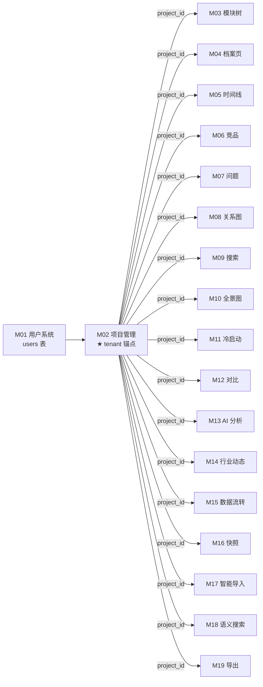
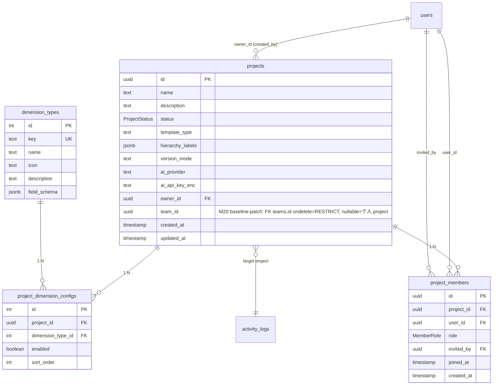
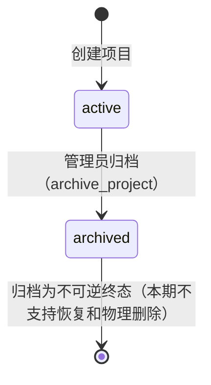

# M02 项目管理 - 详细设计

> **CY 2026-04-21 已批量 ack 8 组决策，业务 ⚠️ 已清零。详见节 15 CY 决策记录表。**

---

## 1. 业务说明 + 职责边界

### 业务说明

M02 是系统的 **tenant 锚点**——所有业务数据都以 project 为隔离边界，M03-M20 全部通过 `project_id` 引用 M02。

对应 PRD F2（`design/00-architecture/01-PRD.md` Q3）和以下用户故事：

- **US-A1.1**：项目管理员创建项目并选择模板，系统自动配维度和层级标签
- **US-A1.2**：项目管理员修改维度的启用/禁用和排序
- **US-A1.3**：修改层级标签名称（如"产品线→模块→功能项"）
- **US-A1.4**：为项目配置 AI Provider（Claude/Codex/Kimi）
- **US-A2.1**：邀请同事加入项目并分配角色（editor/viewer）
- **US-A2.3**：删除项目需要二次确认，防止误删
- **US-C2.1**：查看者看到的编辑按钮是置灰/隐藏的

### In scope（M02 负责）

- **项目 CRUD**：创建 / 读取 / 更新名称与描述 / 归档（软删除）
- **模板初始化**：创建项目时按模板类型预设 `hierarchy_labels` 和初始维度配置
- **维度配置管理**：管理员配置 `project_dimension_configs`（启用/禁用/排序）
- **层级标签管理**：管理员修改 `hierarchy_labels` JSONB 字段
- **AI Provider 配置**：为项目配置 provider + 加密存储 API Key
- **成员管理**：邀请成员（写 `project_members`）/ 变更角色 / 移除成员
- **项目归档**：管理员归档项目（active → archived，不物理删除）

### Out of scope（其他模块负责）

| 不做的事 | 归属模块 |
|---------|---------|
| 用户注册 / 登录 / 鉴权 | M01 |
| 模块树节点 CRUD | M03 |
| 维度记录录入 / 编辑 | M04 |
| 数据流转可视化（活动日志展示页面） | M15 |
| 团队管理 | M20（已 draft 2026-04-26，三轮 audit + 4 批修复 verify v1-v4 全 PASS；本字段已升级 space_id → team_id + 启用 FK） |
| CSV 批量导入功能项 | M11 |

### 边界灰区（显式说明）

- **`dimension_types` 字典**：全局维度类型注册表（全局 catalog），由 M02 管理——维度类型的新增/改名在此。但"哪些维度对这个项目启用"在 `project_dimension_configs`，也归 M02。
- **项目删除 vs 归档**：本设计采用归档（active → archived）软删除语义，不物理删除——**归档为不可逆终态**（G2 决策：归档=软删除不可逆）。物理删除涉及级联所有子模块数据，风险过高。
- **邀请流程**：直接写入 `project_members`（被邀请人下次登录即可看到）；**无邀请链接/邮件通知**（本期）。

---

## 2. 依赖模块图



**前置依赖**：M01（users 表）必须先实现。

**依赖契约**：
- M01 提供：`current_user`（含 `user_id` / `platform_role`）
- M02 对下游提供：`projects(project_id)` / `project_members(project_id, user_id, role)` / `project_dimension_configs(project_id)` / `dimension_types`

---

## 3. 数据模型

### ER 图



### SQLAlchemy models

```python
# api/models/project.py
from enum import Enum as PyEnum
from sqlalchemy.orm import Mapped, mapped_column, relationship
from sqlalchemy import ForeignKey, CheckConstraint, UniqueConstraint, Index, String, text
from sqlalchemy.dialects.postgresql import UUID, JSONB
from datetime import datetime
from uuid import UUID as PyUUID, uuid4
from typing import Any
from .base import Base, TimestampMixin


class ProjectStatus(str, PyEnum):
    active = "active"
    archived = "archived"


class MemberRole(str, PyEnum):
    owner = "owner"
    editor = "editor"
    viewer = "viewer"


class Project(Base, TimestampMixin):
    __tablename__ = "projects"
    __table_args__ = (
        CheckConstraint("name != ''", name="ck_project_name_not_empty"),
        # G1 三重防护：CheckConstraint 枚举值显式列出（R3-2）
        CheckConstraint("status IN ('active','archived')", name="ck_project_status"),
        # G3-a/b：同 owner 下 active 项目名唯一（PG 部分唯一索引，归档后释放名字）
        Index(
            "uq_project_owner_name_active",
            "owner_id",
            "name",
            unique=True,
            postgresql_where=text("status = 'active'"),
        ),
        # M18 baseline-patch（2026-04-26）：search 路由按 project 取 RRF 调优参数
        CheckConstraint("rrf_k > 0 AND rrf_k <= 200", name="ck_project_rrf_k_range"),
        CheckConstraint(
            "similarity_threshold >= 0.0 AND similarity_threshold <= 1.0",
            name="ck_project_similarity_threshold_range",
        ),
    )

    id: Mapped[PyUUID] = mapped_column(UUID(as_uuid=True), primary_key=True, default=uuid4)
    name: Mapped[str] = mapped_column(String(200), nullable=False)
    description: Mapped[str | None] = mapped_column(String(2000), nullable=True)
    status: Mapped[ProjectStatus] = mapped_column(
        String(20), nullable=False, default=ProjectStatus.active
    )
    template_type: Mapped[str] = mapped_column(String(50), nullable=False, default="custom")
    hierarchy_labels: Mapped[list[str]] = mapped_column(
        JSONB, nullable=False, default=lambda: ["层级1", "层级2", "层级3"]
    )
    version_mode: Mapped[str] = mapped_column(
        String(20), nullable=False, default="release"
    )
    ai_provider: Mapped[str | None] = mapped_column(String(50), nullable=True)
    ai_api_key_enc: Mapped[str | None] = mapped_column(String(1000), nullable=True)  # AES-256-GCM
    owner_id: Mapped[PyUUID] = mapped_column(
        UUID(as_uuid=True), ForeignKey("users.id"), nullable=False, index=True
    )
    # M20 baseline-patch（2026-04-26）：space_id RENAME team_id + 启用 FK ondelete=RESTRICT
    # （ADR-001 §预设 3 整段 superseded by ADR-005；个人 project 语义保留 nullable=True）
    team_id: Mapped[PyUUID | None] = mapped_column(
        UUID(as_uuid=True),
        ForeignKey("teams.id", ondelete="RESTRICT"),  # Q8 强制前置迁出
        nullable=True,
        index=True,
    )

    # M18 baseline-patch（2026-04-26）：M18 SearchService.hybrid_search 入口调 ProjectService.get_search_config 取
    # rrf_k：RRF 融合 k 值（默认 60，业界推荐起点；范围 1-200）
    # similarity_threshold：语义召回最低 cosine 相似度阈值（默认 0.3；< 阈值不参与 RRF 融合）
    # 权限模型（CY 决策 2，2026-04-25）：仅 admin 可改（viewer 无入口），复用现有 assertProjectRole(project_id, "admin")
    rrf_k: Mapped[int] = mapped_column(nullable=False, default=60)
    similarity_threshold: Mapped[float] = mapped_column(nullable=False, default=0.3)

    members = relationship("ProjectMember", back_populates="project", cascade="all, delete-orphan")
    dimension_configs = relationship("ProjectDimensionConfig", back_populates="project", cascade="all, delete-orphan")


class ProjectMember(Base):
    __tablename__ = "project_members"
    __table_args__ = (
        UniqueConstraint("project_id", "user_id", name="uq_project_member"),
        # G1 三重防护：role 枚举 CheckConstraint（R3-2）
        CheckConstraint("role IN ('owner','editor','viewer')", name="ck_member_role"),
    )

    id: Mapped[PyUUID] = mapped_column(UUID(as_uuid=True), primary_key=True, default=uuid4)
    project_id: Mapped[PyUUID] = mapped_column(
        UUID(as_uuid=True), ForeignKey("projects.id", ondelete="CASCADE"), nullable=False, index=True
    )
    user_id: Mapped[PyUUID] = mapped_column(
        UUID(as_uuid=True), ForeignKey("users.id", ondelete="CASCADE"), nullable=False, index=True
    )
    role: Mapped[MemberRole] = mapped_column(
        String(20), nullable=False, default=MemberRole.viewer
    )
    invited_by: Mapped[PyUUID | None] = mapped_column(
        UUID(as_uuid=True), ForeignKey("users.id"), nullable=True
    )
    joined_at: Mapped[datetime] = mapped_column(nullable=False, default=datetime.utcnow)
    created_at: Mapped[datetime] = mapped_column(nullable=False, default=datetime.utcnow)

    project = relationship("Project", back_populates="members")


class ProjectDimensionConfig(Base):
    __tablename__ = "project_dimension_configs"
    __table_args__ = (
        UniqueConstraint("project_id", "dimension_type_id", name="uq_proj_dim_config"),
    )

    id: Mapped[int] = mapped_column(primary_key=True, autoincrement=True)
    project_id: Mapped[PyUUID] = mapped_column(
        UUID(as_uuid=True), ForeignKey("projects.id", ondelete="CASCADE"), nullable=False, index=True
    )
    dimension_type_id: Mapped[int] = mapped_column(
        ForeignKey("dimension_types.id"), nullable=False
    )
    enabled: Mapped[bool] = mapped_column(nullable=False, default=True)
    sort_order: Mapped[int] = mapped_column(nullable=False, default=0)

    project = relationship("Project", back_populates="dimension_configs")


class DimensionType(Base):
    __tablename__ = "dimension_types"

    id: Mapped[int] = mapped_column(primary_key=True, autoincrement=True)
    key: Mapped[str] = mapped_column(String(100), nullable=False, unique=True)
    name: Mapped[str] = mapped_column(String(200), nullable=False)
    icon: Mapped[str] = mapped_column(String(100), nullable=False, default="FileText")
    description: Mapped[str | None] = mapped_column(String(500), nullable=True)
    field_schema: Mapped[dict[str, Any] | None] = mapped_column(JSONB, nullable=True)
```

### Alembic 要点

- `projects` 索引：`(owner_id)` / `(status)` / `(team_id)`（M20 baseline-patch 2026-04-26：space_id → team_id + 启用 FK）
- `project_members` 唯一约束：`UNIQUE(project_id, user_id)`
- `project_dimension_configs` 唯一约束：`UNIQUE(project_id, dimension_type_id)`
- `projects.status` CHECK：`status IN ('active', 'archived')`（G1 三重防护 R3-2 合规：String(20) + CheckConstraint + Mapped[ProjectStatus]）
- `project_members.role` CHECK：`role IN ('owner', 'editor', 'viewer')`（G1 三重防护合规：String(20) + CheckConstraint + Mapped[MemberRole]）
- **G3 同名项目禁止**：PG 部分唯一索引——`CREATE UNIQUE INDEX uq_project_owner_name_active ON projects(owner_id, name) WHERE status='active'`（仅对 active 项目唯一，归档后释放名字）
- `projects.ai_api_key_enc` 长度留 1000 bytes（AES-GCM 加密后 base64）
- **M18 baseline-patch（2026-04-26）**：projects 表加 2 列 `rrf_k INT NOT NULL DEFAULT 60` + `similarity_threshold REAL NOT NULL DEFAULT 0.3` + 2 个 CHECK 约束（rrf_k 范围 1-200 / similarity_threshold 范围 0.0-1.0）；纯加字段带默认值，已有数据不受影响
- **M20 baseline-patch（2026-04-26）**：`space_id → team_id` 字段重命名 + 启用 FK ondelete=RESTRICT。Alembic 2 步：① `ALTER TABLE projects RENAME COLUMN space_id TO team_id`；② `ALTER TABLE projects ADD CONSTRAINT fk_projects_team FOREIGN KEY (team_id) REFERENCES teams(id) ON DELETE RESTRICT`。详见 [`../baseline-patch-m20.md`](../baseline-patch-m20.md) §M02 章节。
- **M20 baseline-patch（2026-04-26）F2.3 archived×team 互锁修复**：M02 新增 ErrorCode `PROJECT_ARCHIVED`（422，detail: `{project_id, status}`），用于 `POST /api/projects/{pid}/move-team` 入口拒绝 archived project 加入 team。已注册到本模块 §13 ErrorCode 表。

---

### 3.X 实施期处理（R-X5 baseline-patch 时序契约，2026-05-07 加）

> M02 design §3 含 3 处 baseline-patch 反向时序引用（M20 在 M02 之后实施 / M18 在 M02 之后实施）。按 [`../README.md` R-X5 主标准 Q1+Q2](../README.md#横切) 推导退化路径 + 结构性约束动作 + 子选项实证清单。

#### A1 — `team_id` FK to `teams` 表（M20 baseline-patch）

- **退化路径**：**C 留中间态**
- **主标准推导**：Q1 否（teams 表 M20 期才存在）+ Q2 callee（schema 形态保留，M02 不主动写 teams）
- **理由**：M02 sprint 期写 `team_id` UUID nullable 列但**不启用 FK constraint**；M20 sprint 期 `ALTER ADD CONSTRAINT FK ondelete=RESTRICT`
- **alembic 步骤数**：M02 sprint 1 步（CREATE TABLE projects 含 team_id UUID nullable 无 FK）+ M20 sprint 1 步（ALTER ADD CONSTRAINT）
- **触发回写**：M20 sprint 启动时本段更新为"FK 已启用 + commit hash"
- **🟢 M02 sprint 实证落地**（2026-05-07，commits c6b97d6 子片1 + a42dc81 子片2 + 10f2f54 子片3 + c9b0618 子片4）：schema 已落 (UUID nullable 无 FK)；C 路径子选项实证决=**DAO 完全允许** (登记 `design/audit/m02-pilot-template-validation.md` R-X5 子选项 1)
- **C 路径必登记 — 测试盲区**：M02-M19 sprint 期下游模块（M03/M04/M06/M07 等）测不了"team_id 非空"路径（团队 project 上的功能），仅能测 `team_id=None` 的个人 project；M20 sprint 期补回归
- **C 路径必登记 — M20 回写 checklist**：① data migration 清理（若 M02-M20 期间有不合法 team_id 写入，先 SET NULL 或修正）② ALTER ADD CONSTRAINT FK ③ 团队 project 回归测试（覆盖下游 M03-M19 跨 team 路径）④ 回写本段 status="已落地"
- **🟡 子选项待 M02 sprint 实证**：中间态期间 `team_id` 写入策略（API 不暴露 / Schema 暴露但 service 拒绝 / DAO 完全允许）—— sprint 写代码时按 R-X5 子选项立规红线 case-by-case，登记到 `design/audit/m02-pilot-template-validation.md`

#### A2 — `rrf_k` + `similarity_threshold` + `get_search_config` 方法（M18 baseline-patch）

- **退化路径**：**A 现在建**
- **主标准推导**：Q1 是（纯加列默认值齐 + 自表 check 约束 + 方法签名空实现，无外部依赖）
- **理由**：M02 sprint 期 schema 加 2 列 + 2 check + ProjectService.get_search_config 方法实装；M02-M18 期 ~3-4 周无 caller 但功能完备
- **alembic 步骤数**：1 步成形（M02 CREATE TABLE 含 2 列 + check）
- **触发回写**：M18 sprint 启动时本段更新为"M18 SearchService.hybrid_search 已接入 + commit hash"
- **🟢 M02 sprint 实证落地**（2026-05-07，commit 10f2f54 子片3）：schema 加 rrf_k+similarity_threshold + 2 CHECK；ProjectService.get_search_config 实装 + test 覆盖 default 路径；A 路径子选项实证决=**M02 own raw types** (SearchConfig dataclass 在 `api/schemas/project_schema.py`)
- **A 路径必声明**：unit test 仅覆盖 `get_search_config` default 路径返回（rrf_k=60 / similarity_threshold=0.3）；生产路径（M18 hybrid_search 调）回归测试推迟到 M18 sprint 期补
- **🟡 子选项待 M02 sprint 实证**：`SearchConfig` 类型定义放哪（M02 own raw types / 共享 horizontal `api/schemas/shared.py`）—— 受分层依赖方向约束（M02 不能 import M18），sprint 写代码时实证

#### A3 — `PROJECT_ARCHIVED` ErrorCode + `POST /api/projects/{pid}/move-team` endpoint（M20 baseline-patch F2.3）

A3 拆 2 项独立处理：

##### A3.1 — ErrorCode `PROJECT_ARCHIVED` + `ProjectArchivedError` 子类

- **退化路径**：**A 现在建**
- **主标准推导**：Q1 是（enum 死定义 + AppError 子类 R13-1 配齐即可，无外部依赖）
- **理由**：M02 sprint 期 ErrorCode 入 codes.py + AppError 子类入 exceptions.py；R13-1 守护 22→23 parity 通过
- **alembic 步骤数**：0
- **触发回写**：M20 sprint move-team endpoint 实装时建 raise caller + 加 raise 测试，回写本段
- **🟢 M02 sprint 实证落地**（2026-05-07，commit 10f2f54 子片3）：ProjectArchivedError 子类入 exceptions.py + ErrorCode PROJECT_ARCHIVED 入 codes.py；R13-1 22+12=34 parity 通过；R13-1 子选项实证决=**code 注释** (ProjectArchivedError docstring 标记未实装期, 不入 ci-lint.sh 附加规则)
- **A 路径必声明**：M02 sprint 期 `ProjectArchivedError` 无 raise caller；ci-lint.sh R13-1 仅查 parity 不查 caller，不阻塞但留**未实装期 ErrorCode**——本子段即声明位置
- **🟡 子选项待 M02 sprint 实证**：标记位置（code 注释 / design §13 表加列 / ci-lint.sh 加附加规则）—— sprint 写代码时实证

##### A3.2 — `POST /api/projects/{pid}/move-team` endpoint

- **退化路径**：**B 推迟**
- **主标准推导**：Q1 否（依赖 teams 表）+ Q2 caller（POST 主动写 teams 关联）
- **理由**：M02 sprint 期 router 不实装 move-team；scaffold 留 TODO 注释（S2 4 字段强制模板）；M20 sprint 期建路由 + 接通 `ProjectArchivedError` raise
- **alembic 步骤数**：0
- **触发回写**：M20 sprint move-team router 实装时回写本段 + design §7 endpoint 表对应行标"已落地 + commit hash"
- **🟢 M02 sprint 实证落地**（2026-05-07，commit c9b0618 子片4）：scaffold TODO 注释 4 字段已落 `api/routers/project_router.py:16-23`；test `test_b_path_move_team_endpoint_not_registered` 实证 FastAPI 返 404；B 路径子选项实证决=**不实装 router → OpenAPI 不含**
- **B 路径必动作 — TODO 注释 4 字段**：

  ```python
  # api/routers/project_router.py
  # ① 决策内容：M02 sprint 期 move-team endpoint 不实装
  # ② 简化理由：依赖 teams 表（M20 own），M02 期主动写 teams 不可行（B caller）
  # ③ 由 M20 sprint 扩齐到完整路由：POST /api/projects/{pid}/move-team
  #    含 require_user + check_project_access(role=owner) + ProjectArchivedError raise
  # ④ 触发回写动作：M20 sprint add 路由实装 + raise ProjectArchivedError caller +
  #    回写 M02 design §7 endpoint 表对应行 + 本段 status="已落地"
  ```

- **🟡 子选项待 M02 sprint 实证**：OpenAPI 契约层处理（router 不实装 OpenAPI 不含 vs 占位 router 返回 501 stub OpenAPI 含）—— sprint 写代码时按 FastAPI 实际行为决定

### 3.Y 启动数据声明（R3-6 细化版，2026-05-07 加；含 dimension_types 3 子项）

> M02 own `dimension_types` 全局字典表（design §1 边界灰区）。按 [`../README.md` R3-6 启动数据声明（3 子项分类）](../README.md#§3-数据模型) 拆 R3-6-A / R3-6-B / R3-6-C：

#### R3-6-A 启动期硬性 seed
- **本模块无 R3-6-A 子项**——M02 不需要"系统启动必须存在"的字典数据；空 dimension_types 表不阻塞 M02 自身功能（项目创建可不用任何 dimension type）

#### R3-6-B 测试兜底 placeholder
- **必种数据清单**：`dimension_types` 表至少 1 条 `default` 类型（`key='default'` / `name='默认维度'` / `icon='FileText'` / `field_schema=null`），作为下游 M03/M04/M07 sprint 测试 fixture 兜底——避免空字典导致 dimension_record 等依赖测试无法跑
- **责任 sprint**：**M02 own**（不允许推迟到 M03/M04 sprint，否则下游测试跑不起来）
- **触发时机**：alembic data migration（CREATE TABLE 后 INSERT 默认行；与 schema migration 同 revision）

#### R3-6-C 业务字典清单（非 R3-6 范畴，运行期 admin 创建）
- **运行期入口声明**：`POST /api/admin/dimension-types`（M02 §7 endpoint 表已含 / 待 admin UI 实装时补 endpoint）/ Server Action `web/src/actions/dimensionType.ts`
- **权限层级**：`platform_admin` only（CY 决策：维度类型注册表是平台级 catalog，不该项目 owner 独自决定；与 `dimension_types` design §1 "全局维度类型注册表" 一致）
- **典型业务清单（产品决策示例，不写死在 design）**：feature / competitor / issue / version / risk / requirement / etc——由 admin 在 M02 sprint 落地后通过运行期 endpoint 创建；具体清单不属 design 期决策

### 3.Z early adopter 触发（accepted-minimal 之外能力，C1 AES helper）

> M02 design §3 ai_api_key_enc 字段需 AES-256-GCM 加解密 helper。按 [`../../01-engineering/05-security-baseline.md §7`](../../01-engineering/05-security-baseline.md#7-accepted-minimal-状态的-early-adopter-触发条款2026-05-07-时间维度盲区沉淀2026-05-07-后续-d4-推演修订) 流程登记：

- **能力**：AES-256-GCM 加解密 service（M02 写 `ai_api_key_enc` / M13 读解密走 prompt context / 未来 M16/M17 cron secret 加密复用）
- **来源 spec**：05-security-baseline §4 数据加密
- **判断前置 — Helper 类型**：**横切**（多模块复用，符合 §7 判断前置 4 项中 "多模块复用" + "横切 ADR 范畴" 两项）
- **退化路径**：**§7.1 B' 部分提前**
- **本 sprint 实装边界**：
  - helper 建在横切层 `api/auth/crypto.py`（**禁止挂业务模块名下**，原则 6 + R-X6）
  - 实装 `encrypt(plaintext: str) -> str` / `decrypt(ciphertext: str) -> str` 两方法（AES-256-GCM + base64）
  - 密钥读 env `ENCRYPTION_KEY`（settings.py 加 1 字段）
  - 单元测试覆盖：encrypt/decrypt 往返 / 错密钥 raise / 错 ciphertext raise
- **回写动作**：05-security-baseline §4 数据加密表加最小段（"AES-256-GCM helper 在 `api/auth/crypto.py`，密钥从 env `ENCRYPTION_KEY` 读"~5-10 行）；§8.0 必补清单保留"密钥轮转 / HSM / 多密钥 fallback"
- **回写 commit hash**：commit `10f2f54` 子片3 (api/auth/crypto.py + 14 test PASS + design 05-security-baseline §4.1 最小段已回写)

---

## 4. 状态机

### projects.status（有状态实体）



**决策（G2 + G7-M02-R1-02）**：归档为不可逆终态（archived = 软删除不可逆），不支持恢复。

**归档不级联子模块状态**（P5 audit F-2 显式声明）：M02 archive 仅改 `projects.status='archived'`，**不级联**任何子模块的状态机：

- M07 `issues.status` 保持原值（open / in_progress / resolved / closed 都不变）——归档项目下的未关闭 issue 仍是 open
- M05 `version_records.is_current` 保持原值——不重置 current 标记
- M03 `nodes` / M04 `dimension_records` / M06 `competitors` 等无状态机的子表保持原数据

**设计意图**：归档 = "只读历史快照"，子模块数据冻结在归档当刻的状态供回溯；恢复需求未启用，故无需级联。

**实施约束**：
- M02 archive 不调任何子模块 service 的状态变更方法
- 子模块 service 在写入前读 `projects.status` 做防御（如 M03 NodeService.create 拒 archived project）；防御依据是 §3 部分唯一索引 `WHERE status='active'` + service 层显式 status 检查
- 跨模块读 archived project 的子表数据 = 合法（归档不删除数据，只是停止写入）

**禁止转换清单**（R4-2：N = 终态数 + 1 = 2，每条格式：状态A → 状态B：原因 + ErrorCode）：

| 禁止转换 | 原因 + ErrorCode |
|---------|----------------|
| `archived → active`（归档恢复）| 归档为不可逆终态，不支持恢复；抛 `PROJECT_ALREADY_ARCHIVED`（409） |
| `archived → archived`（重复归档）| 已是终态，操作无意义；抛 `PROJECT_ALREADY_ARCHIVED`（409） |
| 任何状态 → 物理删除 | 本期不支持物理删除，保留软删除语义；抛 `PROJECT_DELETE_NOT_SUPPORTED`（422） |

### project_members.role（角色变更）

`project_members.role` 是枚举字段，非状态机——角色变更是直接 UPDATE，无单向状态流转。

显式声明（R4-1）：`project_members` 无状态机；`project_dimension_configs` 无状态机（只有 enabled boolean）。

---

## 5. 多人架构 4 维必答

| 维度 | 答案 | 实现细节 |
|------|------|---------|
| **Tenant 隔离** | ✅ projects 本身即 tenant 锚点 | `projects.id` 就是 tenant ID；`project_members` 通过 `project_id` 关联；DAO 过滤见节 9 |
| **多表事务** | ✅ 创建项目 + 邀请成员 | 创建项目事务：① INSERT projects ② INSERT project_members（owner）③ INSERT project_dimension_configs（模板默认维度）④ log activity；邀请成员事务：① INSERT project_members ② log activity |
| **异步处理** | ❌ N/A | M02 全同步——项目管理是即时操作，无 Queue、无流式 |
| **并发控制** | ❌ N/A | M02 不涉及多人并发编辑同一字段（同一项目配置只有 owner/admin 改）；**维度配置并发乐观锁：不需要**（G2 Q4 决策：管理员操作低频） |

### 约束清单（5 项逐项检查）

| 清单项 | M02 是否触发 | 实现 |
|-------|-------------|------|
| 1. activity_log | ✅ 触发 | 节 10 列清单；创建/归档/邀请/角色变更均记录 |
| 2. 乐观锁 version | ❌ 不触发（CY 确认 M02 无并发维度） | projects 无 version 字段 |
| 3. Queue payload tenant | ❌ 不触发（无 Queue） | N/A |
| 4. idempotency_key | ❌ 无幂等（统一规则 G2）| 节 11 |
| 5. DAO tenant 过滤 | ✅ 触发 | 节 9 |

**状态转换竞态分析**（R5-2，因 projects 有状态机）：
- `archive_project` 并发：两个管理员同时归档同一项目 → 第一个成功，第二个因 `WHERE status='active'` 返回 0 行 → 服务端幂等（重复归档返回 `PROJECT_ALREADY_ARCHIVED`，不报错）
- 本设计不引入乐观锁——归档是单向幂等操作，竞态安全。

---

## 6. 分层职责表

| 层 | M02 涉及文件 | 该层职责 |
|----|------------|---------|
| **Page** | `web/src/app/dashboard/page.tsx`（项目列表）<br>`web/src/app/projects/[pid]/settings/page.tsx`（项目设置） | 渲染项目列表 / 设置页；SSR 加载；调 Server Action |
| **Component** | `web/src/components/business/project-card.tsx`<br>`web/src/components/business/member-list.tsx`<br>`web/src/components/business/dimension-config.tsx` | 项目卡片 / 成员列表 / 维度配置 UI |
| **Server Action** | `web/src/actions/project.ts`<br>`web/src/actions/member.ts` | session 校验 / zod 入参校验 / fetch FastAPI |
| **Router** | `api/routers/project_router.py`<br>`api/routers/member_router.py` | 路由定义 / `Depends(check_project_access)` / Pydantic schema |
| **Service** | `api/services/project_service.py`<br>`api/services/member_service.py` | 业务规则 / 事务 / AI Key 加解密 / 写 activity_log。**M18 baseline-patch（2026-04-26）新增**：`get_search_config(db, project_id) -> SearchConfig` 返回 (rrf_k, similarity_threshold) 元组，供 M18 SearchService.hybrid_search 入口调用 |
| **DAO** | `api/dao/project_dao.py`<br>`api/dao/member_dao.py`<br>`api/dao/dimension_config_dao.py` | SQL 构建 + tenant 过滤 |
| **Model** | `api/models/project.py` | SQLAlchemy 模型（schema 真相源）—— Project / ProjectMember / ProjectDimensionConfig / DimensionType |
| **Schema** | `api/schemas/project_schema.py`<br>`api/schemas/member_schema.py` | Pydantic 请求 / 响应 |

**禁止**：
- ❌ Router 直 `db.query(Project)`
- ❌ Service 直 INSERT users（走 M01 UserService）
- ❌ DAO 内判断 `if role == 'owner': ...`（业务逻辑）

---

## 7. API 契约

### Endpoints

| 方法 | 路径 | 用途 | 入参 schema | 出参 schema |
|------|------|------|------------|------------|
| GET | `/api/projects` | 列出当前用户的项目 | — | `ProjectListResponse` |
| POST | `/api/projects` | 创建项目 | `ProjectCreate` | `ProjectResponse` |
| GET | `/api/projects/{project_id}` | 获取项目详情 | — | `ProjectResponse` |
| PUT | `/api/projects/{project_id}` | 更新项目基本信息 | `ProjectUpdate` | `ProjectResponse` |
| POST | `/api/projects/{project_id}/archive` | 归档项目（不可逆）| — | `ProjectResponse` |
| GET | `/api/projects/{project_id}/members` | 列出成员 | — | `MemberListResponse` |
| POST | `/api/projects/{project_id}/members` | 邀请成员 | `MemberInvite` | `MemberResponse` |
| PUT | `/api/projects/{project_id}/members/{user_id}` | 变更成员角色 | `MemberRoleUpdate` | `MemberResponse` |
| DELETE | `/api/projects/{project_id}/members/{user_id}` | 移除成员 | — | 204 |
| GET | `/api/projects/{project_id}/dimension-configs` | 获取维度配置 | — | `DimensionConfigListResponse` |
| PUT | `/api/projects/{project_id}/dimension-configs` | 批量更新维度配置 | `DimensionConfigBatchUpdate` | `DimensionConfigListResponse` |

### Pydantic schema 草案

```python
# api/schemas/project_schema.py
from enum import Enum
from pydantic import BaseModel, Field
from uuid import UUID
from datetime import datetime
from typing import Optional


class ProjectStatusEnum(str, Enum):
    active = "active"
    archived = "archived"


class ProjectCreate(BaseModel):
    name: str = Field(..., min_length=1, max_length=200)
    description: Optional[str] = Field(None, max_length=2000)
    template_type: str = Field("custom", max_length=50)
    hierarchy_labels: list[str] = Field(default_factory=lambda: ["层级1", "层级2", "层级3"])


class ProjectUpdate(BaseModel):
    name: Optional[str] = Field(None, min_length=1, max_length=200)
    description: Optional[str] = Field(None, max_length=2000)
    hierarchy_labels: Optional[list[str]] = None
    version_mode: Optional[str] = None
    ai_provider: Optional[str] = None
    ai_api_key: Optional[str] = None  # 明文传入，Service 加密存储


class ProjectResponse(BaseModel):
    id: UUID
    name: str
    description: Optional[str]
    status: ProjectStatusEnum
    template_type: str
    hierarchy_labels: list[str]
    version_mode: str
    ai_provider: Optional[str]
    owner_id: UUID
    created_at: datetime
    updated_at: datetime
    # 注意：ai_api_key_enc 不返回给前端


class ProjectListResponse(BaseModel):
    items: list[ProjectResponse]
    total: int


# api/schemas/member_schema.py
class MemberRoleEnum(str, Enum):
    owner = "owner"
    editor = "editor"
    viewer = "viewer"


class MemberInvite(BaseModel):
    user_id: UUID
    role: MemberRoleEnum = MemberRoleEnum.viewer


class MemberRoleUpdate(BaseModel):
    role: MemberRoleEnum


class MemberResponse(BaseModel):
    id: UUID
    project_id: UUID
    user_id: UUID
    user_name: str     # join 出来
    user_email: str    # join 出来
    role: MemberRoleEnum
    invited_by: Optional[UUID]
    joined_at: datetime
    created_at: datetime


class MemberListResponse(BaseModel):
    items: list[MemberResponse]


# api/schemas/dimension_config_schema.py
class DimensionConfigItem(BaseModel):
    dimension_type_id: int
    enabled: bool
    sort_order: int


class DimensionConfigBatchUpdate(BaseModel):
    configs: list[DimensionConfigItem]


class DimensionConfigResponse(BaseModel):
    id: int
    project_id: UUID
    dimension_type_id: int
    dimension_type_key: str   # join 出来
    dimension_type_name: str  # join 出来
    enabled: bool
    sort_order: int


class DimensionConfigListResponse(BaseModel):
    items: list[DimensionConfigResponse]
```

---

## 8. 权限三层防御

| 层 | 检查 | 实现 |
|----|------|------|
| **Server Action** | session 是否有效 | `getServerSession()`；无则 401 `UNAUTHENTICATED` |
| **Router（粗粒度）** | 用户是否是该 project 的成员（读）或 owner/editor（写） | `Depends(check_project_access(project_id, role="viewer"))` 用于 GET；`Depends(check_project_access(project_id, role="editor"))` 用于写；成员管理需 `role="owner"` |
| **Service（细粒度）** | owner 才能归档 / 邀请 / 变更角色；不能移除自己（owner）| `project_service._check_owner(user_id, project_id)`；`member_service._check_not_remove_self_owner()` |

**异步路径**：M02 无异步，三层即足够（无需 Queue 消费者侧权限行）。

**特殊权限规则**：
- 只有 `role=owner` 的成员才能归档项目、邀请成员、变更成员角色、修改维度配置
- `role=editor` 可读取项目设置但不能修改成员和维度配置
- `role=viewer` 只读

---

## 9. DAO tenant 过滤策略

### M02 特殊说明

`projects` 表本身就是 tenant 锚点——不需要在 `projects` 查询中过滤 `project_id`，而是通过查询 `project_members` 来确认当前用户有权看哪些项目。

### 主查询模式

```python
# api/dao/project_dao.py

class ProjectDAO:
    def list_by_user(self, db: Session, user_id: UUID) -> list[Project]:
        """只返回当前用户有成员权限的项目（tenant 过滤）"""
        return (
            db.query(Project)
            .join(ProjectMember, ProjectMember.project_id == Project.id)
            .filter(
                ProjectMember.user_id == user_id,         # ← tenant 过滤
                Project.status == ProjectStatus.active,   # 默认只返回激活项目
            )
            .all()
        )

    def get_by_id_for_user(self, db: Session, project_id: UUID, user_id: UUID) -> Project | None:
        """获取项目 + 验证用户是成员（tenant 过滤）"""
        return (
            db.query(Project)
            .join(ProjectMember, ProjectMember.project_id == Project.id)
            .filter(
                Project.id == project_id,
                ProjectMember.user_id == user_id,         # ← tenant 过滤
            )
            .first()
        )


# api/dao/member_dao.py

class MemberDAO:
    def list_by_project(self, db: Session, project_id: UUID) -> list[ProjectMember]:
        """列出项目成员（已通过 Router 层确认调用者是项目成员）"""
        return (
            db.query(ProjectMember)
            .filter(ProjectMember.project_id == project_id)  # ← tenant 过滤
            .all()
        )

    def get_member(self, db: Session, project_id: UUID, user_id: UUID) -> ProjectMember | None:
        return (
            db.query(ProjectMember)
            .filter(
                ProjectMember.project_id == project_id,  # ← tenant 过滤
                ProjectMember.user_id == user_id,
            )
            .first()
        )
```

### 豁免清单

| 豁免查询 | 理由 |
|---------|------|
| `dimension_types` 全表查询 | 全局字典数据，无 tenant 隔离需求（M02 owner 可管理，只读 OK） |
| 创建项目时查询 `users` by `user_id` | 查找被邀请人信息，M01 的全局数据 |

---

## 10. activity_log 事件清单

| action_type | target_type | target_id | metadata |
|-------------|-------------|-----------|----------|
| `create` | `project` | `<project_id>` | `{template_type, name}` |
| `update` | `project` | `<project_id>` | `{changed_fields: [...]}` |
| `archive` | `project` | `<project_id>` | `{previous_status: "active"}` |
| `invite_member` | `project_member` | `<member_id>` | `{project_id, invited_user_id, role}` |
| `update_member_role` | `project_member` | `<member_id>` | `{project_id, user_id, old_role, new_role}` |
| `remove_member` | `project_member` | `<member_id>` | `{project_id, removed_user_id}` |
| `update_dimension_config` | `project_dimension_config` | `<config_id>` | `{project_id, dimension_type_id, old_enabled, new_enabled, old_sort_order, new_sort_order}` |

> **R10-1（batch3 基线补丁）**：批量维度配置更新（PUT `/dimension-configs`）时，每个被修改的 config 写**独立**事件（target_id = config_id），不汇总为单条 project 级事件。
| `update_ai_provider` | `project` | `<project_id>` | `{new_provider}` （不记录 api_key）|

---

## 11. idempotency_key 适用清单

### 决策（G2）：M02 无 idempotency

**邀请成员**：无 idempotency，依赖 DB `UNIQUE(project_id, user_id)` 防重，重复邀请返回 409 `MEMBER_ALREADY_EXISTS`（G2 统一规则）。

其他操作（创建项目、归档、角色变更）：均无 idempotency 需求。

显式声明（R11-1）：**M02 无 idempotency_key 操作**（邀请成员依赖 DB 唯一约束防重）。
显式声明（R11-2）：**project_id 不参与任何 key 计算**（因无 idempotency 操作）。

---

## 12. Queue payload schema

**N/A**——M02 不投递 Queue 任务。

显式声明：**M02 全同步，无异步处理，不投递任何 Queue 任务**。

---

## 13. ErrorCode 新增清单

### 新增 ErrorCode（注册到 `api/errors/codes.py`）

```python
class ErrorCode(str, Enum):
    # ... 已有

    # M02 项目管理
    PROJECT_NOT_FOUND = "project_not_found"
    PROJECT_ALREADY_ARCHIVED = "project_already_archived"
    PROJECT_ALREADY_ACTIVE = "project_already_active"
    PROJECT_DELETE_NOT_SUPPORTED = "project_delete_not_supported"
    PROJECT_NAME_DUPLICATE = "project_name_duplicate"  # G3=B：同 owner 下 active 项目名唯一（部分唯一索引）
    MEMBER_NOT_FOUND = "member_not_found"
    MEMBER_ALREADY_EXISTS = "member_already_exists"
    MEMBER_CANNOT_REMOVE_OWNER = "member_cannot_remove_owner"
    MEMBER_ROLE_INVALID = "member_role_invalid"
    DIMENSION_CONFIG_INVALID = "dimension_config_invalid"  # 维度配置批量更新校验失败
    AI_KEY_ENCRYPT_FAILED = "ai_key_encrypt_failed"        # API Key 加密失败
    # M20 baseline-patch（2026-04-26）F2.3 archived×team 互锁
    PROJECT_ARCHIVED = "project_archived"                  # 422，archived project 拒加入 team
```

### 新增 AppError 子类（`api/errors/exceptions.py`）

```python
class ProjectNotFoundError(NotFoundError):
    code = ErrorCode.PROJECT_NOT_FOUND
    message = "Project not found"

class ProjectAlreadyArchivedError(AppError):
    code = ErrorCode.PROJECT_ALREADY_ARCHIVED
    http_status = 409
    message = "Project is already archived"

class ProjectAlreadyActiveError(AppError):
    code = ErrorCode.PROJECT_ALREADY_ACTIVE
    http_status = 409
    message = "Project is already active"

class ProjectDeleteNotSupportedError(AppError):
    code = ErrorCode.PROJECT_DELETE_NOT_SUPPORTED
    http_status = 422
    message = "Physical project deletion is not supported; use archive instead"

class ProjectNameDuplicateError(AppError):
    code = ErrorCode.PROJECT_NAME_DUPLICATE
    http_status = 409
    message = "Project with this name already exists"

class MemberNotFoundError(NotFoundError):
    code = ErrorCode.MEMBER_NOT_FOUND
    message = "Project member not found"

class MemberAlreadyExistsError(AppError):
    code = ErrorCode.MEMBER_ALREADY_EXISTS
    http_status = 409
    message = "User is already a member of this project"

class MemberCannotRemoveOwnerError(AppError):
    code = ErrorCode.MEMBER_CANNOT_REMOVE_OWNER
    http_status = 422
    message = "Cannot remove the project owner from members"

class MemberRoleInvalidError(AppError):
    code = ErrorCode.MEMBER_ROLE_INVALID
    http_status = 422
    message = "Invalid member role"

class DimensionConfigInvalidError(AppError):
    code = ErrorCode.DIMENSION_CONFIG_INVALID
    http_status = 422
    message = "Invalid dimension configuration"

class AiKeyEncryptFailedError(AppError):
    code = ErrorCode.AI_KEY_ENCRYPT_FAILED
    http_status = 500
    message = "Failed to encrypt AI provider API key"

# M20 baseline-patch（2026-04-26）F2.3
class ProjectArchivedError(AppError):
    code = ErrorCode.PROJECT_ARCHIVED
    http_status = 422
    message = "Archived project cannot be moved to a team"
```

### 复用已有

- `PERMISSION_DENIED` / `UNAUTHENTICATED` / `NOT_FOUND`——复用

---

## 14. 测试场景

详见独立文件：[`tests.md`](./tests.md)

### 14.5 Sprint Review 拆分计划（L2 sprint 级声明，2026-05-07 立）

> 按 [`../../00-phase-gate.md` 闸门 3.4](../../00-phase-gate.md#闸门-34--review-触发粒度规则l1-总则2026-05-07-立) L1 总则要求落本 sprint review 计划。
> M02 sprint 拆 5 子片，按"子片性质 × checklist 命中率"推 2 次 review：

| Review # | 触发时机 | 覆盖子片 | 跑的内容 | 合并/单跑理由 |
|---|---|---|---|---|
| **R1** | 子片 3 完成（service + AES helper 落地） | 子片 1 + 2 + 3 合并 | spec-reviewer + code-quality-reviewer + simplify 三维 | 子片 1 (schema) 单跑 ≥80% SKIP（Prism 特有 22 条仅 Migration 模式 G #24-26 + 架构 4 维 #27-30 命中，6/22≈27%）；子片 2 (DAO) 纯 SQL 翻译 + tenant 过滤命中 1-2 条；service 子片业务逻辑出现后一次性合并跑信号最强 |
| **R2** | 子片 4 完成（11 endpoints + check_project_access） | 子片 4 单跑 | spec + quality + simplify 三维 | endpoint 层是 Prism 契约漂移 (维度 2 #17-20) + 静默吞错 (#21-23) + 权限三层 + tenant 隔离 (#4-5) 等 checklist 高命中区（≥10/22 条命中），单跑保留独立性 |

**子片 5 不单跑**：纯 tests + ci-lint + 4 实证子选项 / PT1-PT3 文档回写，无新业务代码——按触发器例外条款（≥80% SKIP）。

**承接 bypass log #1 配套承诺**：R1 + R2 共 2 次完整三 Agent + simplify，满足 sprint ≥1 次硬承诺。

**L3 实证回写承诺**：sprint 结束时把"实际跑下来 R1/R2 命中 vs SKIP 比例"回写到 `../../audit/m02-pilot-template-validation.md` 新增章节，作为 L3 数据驱动 M03/M04 sprint review 计划——若 R1 合并方案 schema 子片实际 0 finding，下次 M03 schema 子片可同款合并；若 R1 在 schema 部分捞出非 SKIP finding，撤回合并策略改为「schema 子片单跑」。


主文档大纲：
- **golden path**：创建项目 / 邀请成员事务 / 列出项目 / 更新配置 / 归档 / 角色变更
- **边界**：项目名空 / 超长 / hierarchy_labels 格式错误 / AI Key 加密
- **并发**：同时归档同一项目（幂等验证）
- **tenant**：跨项目越权读/写 / 非成员访问
- **权限**：editor 不能邀请成员 / viewer 不能修改配置 / 移除 owner
- **错误处理**：DB 唯一冲突 / 邀请已有成员

---

## 15. 完成度判定 checklist

- [x] 节 1：职责边界 in/out scope 完整，引 US-A1.1/A1.2/A1.3/A1.4/A2.1/A2.3/C2.1
- [x] 节 2：依赖图覆盖所有上下游（M01 依赖 + M03-M20 下游）
- [x] 节 3：数据模型 ER 图 + SQLAlchemy class + Alembic 要点（G1 三重防护合规：String(20)+CheckConstraint+Mapped 注解；G3 部分唯一索引）
- [x] 节 4：状态机（projects 有状态，project_members 无状态机，显式声明）+ 禁止转换 3 条（R4-2 格式：含 ErrorCode）
- [x] 节 5：4 维必答 + 5 项清单（idempotency 已决策：无幂等 G2）+ 状态转换竞态分析
- [x] 节 6：分层职责表（每层文件路径具体）
- [x] 节 7：所有 API endpoint + Pydantic schema（Enum 用 Enum class；restore 接口已移除 G2）
- [x] 节 8：权限三层 + 异步路径声明（无异步）
- [x] 节 9：DAO 主查询模式 + 豁免清单（dimension_types / users 全局查询）
- [x] 节 10：activity_log 事件清单（restore 事件已移除 G2）
- [x] 节 11：idempotency 无（G2 统一决策，显式声明，project_id 不参与）
- [x] 节 12：Queue 显式 N/A
- [x] 节 13：ErrorCode 已决策（PROJECT_NAME_DUPLICATE 保留 G3=B；每条对应 AppError 子类）
- [x] 节 14：tests.md 测试场景（G3 + G7 新增测试用例）
- [x] 节 15：本 checklist
- [ ] **🔴 第一轮 reviewer audit（完整性）通过**
- [ ] **🔴 第二轮 reviewer audit（边界场景）通过**
- [ ] **🔴 第三轮 reviewer audit（演进 / 模板可复用性）通过**
- [ ] CY 全文复审通过 → status 转 accepted

---

## CY 决策记录（2026-04-21 批量 ack）

| # | 组 | 节 | 决策点 | 决定 |
|---|----|----|-------|------|
| Q1 | G2 | 1 | 项目删除语义 | **B 归档为不可逆终态**（软删除不可逆） |
| Q2 | G2 | 1 | 邀请流程 | **A 直接写入**（无邀请链接，本期） |
| Q3 | G2 | 4 | `archived → active` 恢复 | **B 不支持**（归档终态，已移除 restore API） |
| Q4 | G2 | 5 | 维度配置并发乐观锁 | **A 不需要**（管理员操作低频） |
| Q5 | G2 | 11 | 邀请成员 idempotency | **A 无幂等**（统一规则 G2） |
| Q6 | G3 | 3/13 | 同一用户下项目名唯一 | **B=G3 同 owner 下 active 唯一**（PG 部分唯一索引，归档释放名字） |
| Q7 | G1 | 3 | SA Enum 规则 | **B 不改代码**（String(20)+CheckConstraint+Mapped[Enum] 三重防护合规） |
