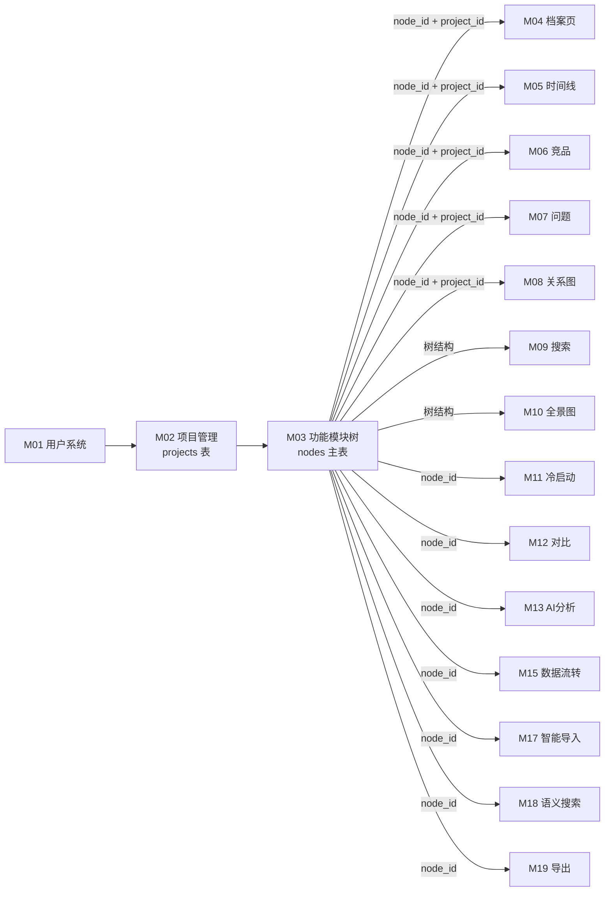
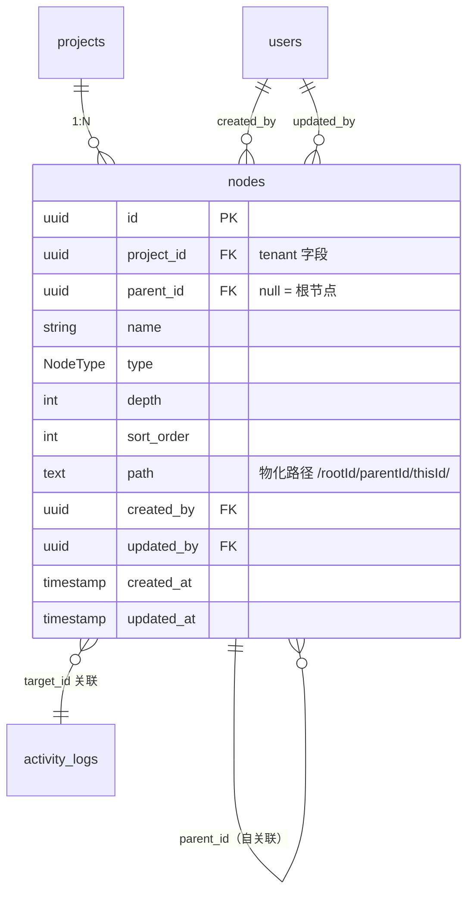

# M03 功能模块树 - 详细设计

> **CY 2026-04-21 已批量 ack 8 组决策，业务 ⚠️ 已清零。详见节 15 CY 决策记录表。**

---

## 1. 业务说明 + 职责边界

### 业务说明

M03 是左侧可配层级的树形导航——`nodes` 表是 M04-M10 等子模块的**结构锚点**，其他模块通过 `(project_id, node_id)` 引用具体功能项。

对应 PRD F3（`design/00-architecture/01-PRD.md` Q3）和以下用户故事：

- **US-B1.1**：编辑者右键添加子节点，输入名称即可创建，录入门槛最低
- **US-B2.1**：编辑者拖拽节点调整同级排序，按重要性或逻辑排列
- 面包屑导航（无独立 US，但路径字段支撑 O(1) 面包屑查询）
- 注：US-C1.1（全景图色块）属于 M10 out-of-scope，M10 消费 M03 数据（G7-M03-R1-08）

### In scope（M03 负责）

- **节点 CRUD**：创建 / 读取 / 更新名称 / 删除（级联删除子树）
- **树形列表**：按 `project_id` 加载完整树（含层级 / 排序 / 路径）
- **拖拽重排**：更新同级节点的 `sort_order`（可能涉及多节点批量更新）
- **面包屑查询**：基于 `path` 物化路径字段 O(1) 解析祖先链
- **节点类型管理**：`folder`（容器节点）/ `file`（叶子节点，可以有 dimension_records）
- **path 字段维护**：创建/移动节点时自动计算并持久化 `path`

### Out of scope（其他模块负责）

| 不做的事 | 归属模块 |
|---------|---------|
| 维度记录的录入/编辑（节点内容） | M04 |
| 层级标签名称管理（如"产品线→模块"） | M02（hierarchy_labels 字段） |
| 维度配置管理 | M02 |
| 模块关系图（节点间的依赖关系可视化） | M08 |
| 全局搜索节点 | M09 |
| 全景图展示 | M10 |
| 版本记录 / 快照 | M05 / M16 |

### 边界灰区（显式说明）

- **节点移动（G5）**：**实现跨父节点移动**——`NodeService.move_subtree(node_id, new_parent_id)`，Service 用路径前缀判断循环引用（`target.path NOT LIKE source.path || '%'`）；子树 path 一条 SQL 批量更新。
- **节点归档 vs 删除（G2）**：**硬删除**（级联删除子树）；**无 archived 状态字段**（状态最小集，G2 决策）；删除前 Service 层调 M04/M06 `delete_by_node_id` + M07 `orphan_by_node_id`（R-X2 防 CASCADE 绕过 activity_log；M07 为 SET NULL 语义所以用 orphan 命名）。
- **`path` 并发写冲突（G5）**：多人同时在同一父节点下创建子节点——采用 last-write-wins（DB INSERT 顺序决定最终 sort_order），不引入乐观锁。

---

## 2. 依赖模块图



**前置依赖**：M01 → M02 → M03。

**依赖契约**：
- M02 提供：`projects(project_id)` 存在 + `current_user` 是项目成员
- M03 对下游提供：`nodes(node_id, project_id)` 存在校验接口 + `NodeService.batch_create_in_transaction()`（M11/M17 批量导入时调用，不直 INSERT nodes）

---

## 3. 数据模型

### ER 图



### SQLAlchemy model

```python
# api/models/node.py
from enum import Enum as PyEnum
from sqlalchemy.orm import Mapped, mapped_column, relationship
from sqlalchemy import ForeignKey, Index, CheckConstraint, String, Integer, Text
from sqlalchemy.dialects.postgresql import UUID
from datetime import datetime
from uuid import UUID as PyUUID, uuid4
from .base import Base, TimestampMixin


class NodeType(str, PyEnum):
    folder = "folder"
    file = "file"


class Node(Base, TimestampMixin):
    __tablename__ = "nodes"
    __table_args__ = (
        Index("ix_nodes_project_parent", "project_id", "parent_id"),
        Index("ix_nodes_project_sort", "project_id", "sort_order"),
        Index("ix_nodes_path", "path"),   # 支持 path LIKE 前缀查询（子树查询）
        CheckConstraint("name != ''", name="ck_node_name_not_empty"),
        CheckConstraint("depth >= 0", name="ck_node_depth_non_negative"),
        CheckConstraint("sort_order >= 0", name="ck_node_sort_order_non_negative"),
        # G1 三重防护：NodeType CheckConstraint（R3-2 合规：String(20)+CheckConstraint+Mapped[NodeType]）
        CheckConstraint("type IN ('folder','file')", name="ck_node_type"),
    )

    id: Mapped[PyUUID] = mapped_column(UUID(as_uuid=True), primary_key=True, default=uuid4)
    project_id: Mapped[PyUUID] = mapped_column(
        UUID(as_uuid=True), ForeignKey("projects.id", ondelete="CASCADE"),
        nullable=False, index=True
    )  # R3-3：tenant 字段冗余在主表
    parent_id: Mapped[PyUUID | None] = mapped_column(
        UUID(as_uuid=True), ForeignKey("nodes.id", ondelete="CASCADE"),
        nullable=True, index=True
    )
    name: Mapped[str] = mapped_column(String(200), nullable=False)
    # M03 sprint A2 reconcile 加 (2026-05-07): M18 get_for_embedding 拼接 name + "\n" + description
    description: Mapped[str | None] = mapped_column(String(2000), nullable=True)
    # M03 sprint A1 范式校准 (M02 R1 已立同款): Mapped[str] + StrEnum.value default + DB CHECK
    # 与 M01 user.py role/status + M02 ProjectStatus/MemberRole 一致
    type: Mapped[str] = mapped_column(
        String(20), nullable=False, default=NodeType.folder.value
    )  # R3-2：状态字段三重防护 (Python StrEnum + Mapped[str] + DB CHECK)
    depth: Mapped[int] = mapped_column(Integer, nullable=False, default=0)
    sort_order: Mapped[int] = mapped_column(Integer, nullable=False, default=0)
    path: Mapped[str] = mapped_column(
        Text, nullable=False, default=""
    )  # 物化路径："/rootId/parentId/thisId/"；G5 决策：path 为 Text（无长度限制，支持无限深度）
    created_by: Mapped[PyUUID | None] = mapped_column(
        UUID(as_uuid=True), ForeignKey("users.id"), nullable=True
    )
    updated_by: Mapped[PyUUID | None] = mapped_column(
        UUID(as_uuid=True), ForeignKey("users.id"), nullable=True
    )

    # 自关联关系
    children = relationship(
        "Node", back_populates="parent",
        cascade="all, delete-orphan",
        foreign_keys="Node.parent_id"
    )
    parent = relationship(
        "Node", back_populates="children",
        remote_side="Node.id",
        foreign_keys="Node.parent_id"
    )
```

### Alembic 要点

- `nodes.path` 索引：`CREATE INDEX ix_nodes_path ON nodes(path text_pattern_ops)` — 支持 `WHERE path LIKE '/rootId/%'` 子树查询
- `nodes.project_id + parent_id` 复合索引：主树查询
- `nodes.parent_id` ON DELETE CASCADE：级联删除子树（DB 层面兜底）
- `nodes.type` CHECK：`type IN ('folder', 'file')`（G1 三重防护 R3-2 合规）
- **path 格式约定**：`"/{id1}/{id2}/{thisId}/"` — 以 `/` 开头和结尾，便于 LIKE 前缀匹配
- **G5 决策**：path 字段为 `Text`（无长度限制，支持无限深度树）；无最大深度限制

### G5 path 计算策略（G7-M03-R2-06，供 M11/M17 batch_create 调用方参考）

**单节点 create**：`(parent.path if parent else "/") + str(new_id) + "/"`（Service 层读父节点 path 计算）

> **R1 P2-05 校准 (2026-05-07)**: parent.path 已含末尾 `/`（如 `/{pid}/`），故公式不再加额外 `/`；
> 根节点 parent=None 时用 `"/"` 作前缀。原字面 `parent.path + '/' + new_id + '/'` 会双 `//`，已校正。

**batch_create（M11/M17 调用 `NodeService.batch_create_in_transaction`）**：
- 拓扑排序后单阶段处理——先按 `parent_id → child` 关系排序，确保父节点先入库拿到 id
- 排序逻辑：将 CSV 节点按层级顺序排列（根节点先，子节点后）
- 入库后每个节点立即计算 path：`parent_already_inserted.path + new_id + '/'`
- 对于同批次父子关系：父节点入库后 id 可知，子节点 path 基于父节点的 id 计算

**move_subtree（G5 跨父移动）**：
```python
# Service 层一条 SQL 更新子树所有 path
UPDATE nodes
SET path = REPLACE(path, old_prefix, new_prefix)
WHERE path LIKE old_prefix || '%'
AND project_id = :project_id
```
- 循环引用检查：`target.path NOT LIKE source.path || '%'`（防止把父节点移到其子节点下）
- Service 在 activity_log 记录 `move` 事件（见 §10）：metadata 含 `moved_nodes_count / elapsed_ms` 等性能指标；不限制子树大小，供未来性能优化

---

## 4. 状态机

### nodes.type（枚举字段，非状态机）

`NodeType`（folder / file）是节点类型分类，不是状态机——不存在 folder → file 的状态转换，类型在创建时确定，**不允许变更**。

### 决策（G2）：nodes 无状态字段

显式声明（R4-1）：`nodes` 表**无状态字段**，`type` 是不可变类型枚举，无状态机。G2 决策：状态最小集——M03 nodes 无 archived 字段（硬删除，删除即删除）。

**禁止转换清单**（R4-1 无状态显式声明，不适用 R4-2 禁止转换条目，但列举操作限制）：

| 禁止操作 | 原因 + ErrorCode |
|---------|----------------|
| 更改 `type` 字段 | NodeType 创建后不可变；抛 `NODE_TYPE_IMMUTABLE`（422） |
| 对已删除节点（不存在 id）执行任何操作 | DAO 返回 None → 抛 `NODE_NOT_FOUND`（404） |

---

## 5. 多人架构 4 维必答

| 维度 | 答案 | 实现细节 |
|------|------|---------|
| **Tenant 隔离** | ✅ project_id | `nodes.project_id` 冗余在主表；DAO 所有查询强制带 `WHERE nodes.project_id = ?`；见节 9 |
| **多表事务** | ✅ 三处事务（G5）| ① 拖拽同级 sort_order 批量更新（`with db.begin()` 包 N 条 UPDATE）；② 跨父 move 子树 path 更新（REPLACE path SQL + depth 更新）；③ 删除节点时先调下游 Service（M04/M06 `delete_by_node_id` + M07 `orphan_by_node_id`）再 DELETE nodes（R-X2） |
| **异步处理** | ❌ N/A | M03 全同步；节点操作是用户即时交互 |
| **并发控制** | ❌ N/A（last-write-wins）| 多人同时在同父节点下创建子节点 → sort_order 以 DB INSERT 顺序决定（last-write-wins）；不引入乐观锁（G2/G5 决策） |

### 约束清单（5 项逐项检查）

| 清单项 | M03 是否触发 | 实现 |
|-------|-------------|------|
| 1. activity_log | ✅ 触发（变更操作）| 节 10 列清单 |
| 2. 乐观锁 version | ❌ 不触发（无并发编辑需求，CY 默认）| N/A |
| 3. Queue payload tenant | ❌ 不触发（无 Queue）| N/A |
| 4. idempotency_key | ❌ 不触发（统一无幂等规则）| 节 11 |
| 5. DAO tenant 过滤 | ✅ 触发 | 节 9 |

**状态转换竞态分析**（R5-2）：M03 无状态机（候选 A），无状态转换竞态问题。若 CY 选择候选 B 引入 archived 状态，则分析同 M02 归档竞态：多人并发归档同一节点 → Service 层幂等处理（`WHERE status='active'` 检查，0 行 = 已归档，返回 `NODE_ALREADY_ARCHIVED`）。

---

## 6. 分层职责表

| 层 | M03 涉及文件 | 该层职责 |
|----|------------|---------|
| **Page** | `web/src/app/projects/[pid]/page.tsx`（项目主页，含左侧树） | 加载项目主页；调 Server Action 拿初始树数据；渲染左侧树组件 |
| **Component** | `web/src/components/business/module-tree.tsx`<br>`web/src/components/business/tree-node.tsx`<br>`web/src/components/business/breadcrumb.tsx` | 树渲染 / 右键菜单 / 拖拽 UI / 面包屑渲染 |
| **Server Action** | `web/src/actions/node.ts` | session 校验 / zod 入参校验 / fetch FastAPI |
| **Router** | `api/routers/node_router.py` | 路由定义 / `Depends(check_project_access)` / Pydantic schema |
| **Service** | `api/services/node_service.py` | 业务规则 / path 字段计算 / 拖拽排序事务 / 写 activity_log<br>**对外契约（R-X3）**：`batch_create_in_transaction(db: Session, project_id, nodes_data)` 供 M11/M17 调用（接受外部 db session，不自开事务；每条 node 写独立 `create` activity_log 事件 R10-1）<br>`delete_node` 内调 M04/M06 `delete_by_node_id(db, ...)` + M07 `orphan_by_node_id(db, ...)` 共享外部 session<br>**M18 baseline-patch（2026-04-26）新增**：① `get_for_embedding(db, node_id, project_id) -> str \| None` 走 ADR-003 规则 1，返回 `name + "\n" + description` 拼接（None = 已删，worker noop）；② `create_node` / `update_node`（仅当 name/description 改）commit 后尾调 `embedding_service.enqueue(target_type="node", target_id=node.id, project_id, user_id, enqueued_by="incremental")`；③ `delete_node` commit 后异步 `embedding_service.enqueue_delete(target_type="node", target_id=node_id, project_id)`，失败 SilentFailure（非 AppError 子类，不被通用 try/except 捕获）+ 写 embedding_failures EMBEDDING_DELETE_FAILED + cleanup cron 兜底（CY 决策 5） |
| **DAO** | `api/dao/node_dao.py` | SQL 构建 + 强制 tenant 过滤 + 子树查询（path LIKE）|
| **Model** | `api/models/node.py` | SQLAlchemy 模型（schema 真相源）—— Node / NodeType |
| **Schema** | `api/schemas/node_schema.py` | Pydantic 请求 / 响应 |

**禁止**：
- ❌ Router 直 `db.query(Node)`
- ❌ M11/M17 直 `INSERT INTO nodes`（必须走 `NodeService.batch_create_in_transaction`）
- ❌ DAO 内计算 `path` 字段（path 计算是业务逻辑，归 Service 层）

---

### 6.X 实施期处理（R-X5 baseline-patch 时序契约，2026-05-07 加）

> M03 §6 含 M18 baseline-patch（`get_for_embedding` + commit 后尾调 `embedding_service.enqueue` + SilentFailure）。M18 在 M03 之后实施，按 [`../README.md` R-X5 主标准 Q1+Q2](../README.md#横切) 推导。

**A4 — `get_for_embedding` + commit 后尾调 enqueue/enqueue_delete（M18 baseline-patch）**

- **退化路径**：**B 推迟**
- **主标准推导**：Q1 否（M03 sprint 期 `embedding_service` 不存在，import 必失败）+ Q2 caller（M03 主动调 M18 own service）
- **理由**：M03 sprint 期 `create_node` / `update_node` / `delete_node` commit 后**不实装** enqueue 调用；scaffold 留 TODO 注释（S2 4 字段强制模板）；M18 sprint 期建 `embedding_service` 后回头接通
- **alembic 步骤数**：0（无 schema 改动）
- **触发回写**：M18 sprint 启动时本段更新为"enqueue 已接通 + commit hash"+ 回归测试覆盖增量 enqueue 路径
- **B 路径必动作 — TODO 注释 4 字段**：

  ```python
  # api/services/node_service.py
  # ① 决策内容：M03 sprint 期 commit 后不调 embedding_service.enqueue
  # ② 简化理由：M18 own embedding_service 在 M03 sprint 期不存在（B caller）
  # ③ 由 M18 sprint 扩齐：create_node / update_node (name/description 改时) commit 后
  #    尾调 embedding_service.enqueue(target_type="node", target_id, project_id, user_id,
  #    enqueued_by="incremental")；delete_node commit 后异步 enqueue_delete +
  #    SilentFailure + embedding_failures EMBEDDING_DELETE_FAILED + cleanup cron 兜底
  # ④ 触发回写动作：M18 sprint add 调用 + 回归测试 + 回写 M03 §6 实施期处理段
  ```

- **A 路径同时含的 `get_for_embedding` 方法**：本子段不推迟——`get_for_embedding(db, node_id, project_id) -> str | None` 是 **M03 own 被动接口**（M18 调，M03 写出方法签名 + 实装拼接 `name + "\n" + description`）。Q1 是（M03 sprint 期可独立实装 + 单元测试覆盖 default 拼接路径）→ **A 现在建**。死代码期 ~M03→M18 sprint，生产路径 M18 sprint 期补回归。
- **status (M03 sprint 末回写, 2026-05-07)**: ✅ 已落地
  - get_for_embedding A 路径: commit `4887f7c` (api/services/node_service.py:104) + 4 单元测试
  - enqueue B 推迟: commit `10f2f54` + `4e48cb9` (scaffold 4 字段注释 ✅)
  - 触发回写动作 (M18 sprint): 本段 status 改 "enqueue 已接通 + commit hash" + 加增量 enqueue 测试

**A5 — `batch_create_in_transaction` 拓扑排序责任 (M03 sprint R1 P-A-03 punt, 2026-05-07 加)**

- **退化路径**: **B 半路径推迟**
- **主标准推导**: Q1 是 (M03 sprint 期可实装最小拓扑 ~15 行) + Q2 callee (M03 own 接口) → 本应 A 现在建
- **理由**: 子片 3 实装"caller 已按层级顺序排好"简化版功能正确（拓扑对正确输入幂等），M11/M17 sprint 期 csv 流通常已层序——此期不重复实装拓扑；caller 未保证拓扑 → `parent_temp_id not in temp_to_real` raise NodeParentNotFoundError，行为可观测
- **alembic 步骤数**: 0
- **触发回写**: M11/M17 sprint 启动时拍"service 加最小拓扑 vs caller 必排序契约"（详见 audit/m03-pilot-template-validation.md R-X5 子选项 2）

**A6 — child_services 分发语义 (M03 sprint R1 P-A-06 reconcile, 2026-05-07 加)**

- **决策**: 每 target_type service 对**全 subtree** 节点都调用一次（对每节点 iterate `_child_services.items()` 全调）
- **理由**: M04/M06/M07 各 service 内部用 node_id 过滤本表数据——多余调用是 noop 不影响正确性（dimension svc 调到 competitor 节点 → 无 dimension_records 关联，noop 返回）
- **替代候选** (未采用): target_type→subtree filter 分发——需要 nodes 表也存 target_type 标记，违反 M03 design §3 R4-1（无业务字段）
- **触发回写**: 若 M04+ sprint 期实测 N×K noop 调用引入显著延迟（>50ms / delete），按 R2-3 注记升级 Protocol 为 batch 形态

---

## 7. API 契约

### Endpoints

| 方法 | 路径 | 用途 | 入参 schema | 出参 schema |
|------|------|------|------------|------------|
| GET | `/api/projects/{project_id}/nodes` | 获取完整树（含层级） | — | `NodeTreeResponse` |
| POST | `/api/projects/{project_id}/nodes` | 创建节点 | `NodeCreate` | `NodeResponse` |
| GET | `/api/projects/{project_id}/nodes/{node_id}` | 获取单节点 | — | `NodeResponse` |
| PUT | `/api/projects/{project_id}/nodes/{node_id}` | 更新节点名称 | `NodeUpdate` | `NodeResponse` |
| DELETE | `/api/projects/{project_id}/nodes/{node_id}` | 删除节点（级联子树） | — | 204 |
| POST | `/api/projects/{project_id}/nodes/reorder` | 拖拽重排同级节点 | `NodeReorder` | `NodeListResponse` |
| POST | `/api/projects/{project_id}/nodes/{node_id}/move` | 跨父移动节点（G5）| `NodeMove` | `NodeResponse` |
| GET | `/api/projects/{project_id}/nodes/{node_id}/breadcrumb` | 面包屑路径 | — | `BreadcrumbResponse` |

### Pydantic schema 草案

```python
# api/schemas/node_schema.py
from enum import Enum
from pydantic import BaseModel, Field
from uuid import UUID
from datetime import datetime
from typing import Optional


class NodeTypeEnum(str, Enum):
    folder = "folder"
    file = "file"


class NodeCreate(BaseModel):
    name: str = Field(..., min_length=1, max_length=200)
    type: NodeTypeEnum = NodeTypeEnum.folder
    parent_id: Optional[UUID] = None  # null = 根节点
    sort_order: Optional[int] = Field(None, ge=0)  # 不传则追加到末尾


class NodeUpdate(BaseModel):
    name: str = Field(..., min_length=1, max_length=200)
    # 注意：type 不可变更；parent_id 本期不支持跨父移动


class NodeResponse(BaseModel):
    id: UUID
    project_id: UUID
    parent_id: Optional[UUID]
    name: str
    type: NodeTypeEnum
    depth: int
    sort_order: int
    path: str
    created_by: Optional[UUID]
    updated_by: Optional[UUID]
    created_at: datetime
    updated_at: datetime


class NodeWithChildrenResponse(NodeResponse):
    children: list["NodeWithChildrenResponse"] = []


class NodeTreeResponse(BaseModel):
    roots: list[NodeWithChildrenResponse]


class NodeListResponse(BaseModel):
    items: list[NodeResponse]


class NodeReorderItem(BaseModel):
    node_id: UUID
    sort_order: int = Field(..., ge=0)


class NodeReorder(BaseModel):
    """批量更新同级节点排序——所有 node_id 必须属于同一 parent_id"""
    parent_id: Optional[UUID]   # null = 根层级
    items: list[NodeReorderItem] = Field(..., min_length=1)


class NodeMove(BaseModel):
    """跨父移动节点（G5）——目标父节点不能是被移动节点的子孙"""
    new_parent_id: Optional[UUID]  # null = 移到根层级


class BreadcrumbItem(BaseModel):
    id: UUID
    name: str
    depth: int


class BreadcrumbResponse(BaseModel):
    items: list[BreadcrumbItem]  # 从根到当前节点顺序
```

---

## 8. 权限三层防御

| 层 | 检查 | 实现 |
|----|------|------|
| **Server Action** | session 是否有效 | `getServerSession()`；无则 401 `UNAUTHENTICATED` |
| **Router（粗粒度）** | 用户是否是该 project 的成员 | `Depends(check_project_access(project_id, role="viewer"))` 用于 GET；`Depends(check_project_access(project_id, role="editor"))` 用于写接口（创建/更新/删除/重排） |
| **Service（细粒度）** | node 是否真的属于该 project | `node_service._check_node_belongs_to_project(node_id, project_id)`；不属于抛 `NodeNotFoundError`（不暴露 forbidden） |

**异步路径**：M03 无异步，三层即足够（无需 Queue 消费者侧权限行）。

**特殊规则**：
- **删除节点（R-X2）**：`NodeService.delete_node(node_id, project_id)` 执行顺序：
  1. 调 `M04.DimensionService.delete_by_node_id(db, node_id, project_id)` — 写 M04 activity_log（真删）
  2. 调 `M06.CompetitorService.delete_by_node_id(db, node_id, project_id)` — 写 M06 activity_log（真删）
  3. 调 `M07.IssueService.orphan_by_node_id(db, node_id, project_id)` — 写 M07 activity_log（**游离而非删除**：SET node_id=NULL，与 FK ON DELETE SET NULL 语义一致）
  4. `DELETE FROM nodes WHERE id = :node_id`（DB CASCADE 兜底删除子树）
  - 理由：DB ON DELETE CASCADE 不触发下游 activity_log；Service 层显式调用才能保证所有变更都有 activity_log 记录（R-X2）
- **move_subtree（G5）**：`NodeService.move_subtree(node_id, new_parent_id)` 实现见 §3 path 计算策略
- `NodeService.batch_create_in_transaction()` 内部调用：调用方（M11/M17）已通过其 Router 层校验，batch_create 内部仍需校验 project_id 合法性

---

## 9. DAO tenant 过滤策略

### 主查询模式

```python
# api/dao/node_dao.py

class NodeDAO:
    def list_by_project(self, db: Session, project_id: UUID) -> list[Node]:
        """获取项目下所有节点（前端构建树形）"""
        return (
            db.query(Node)
            .filter(Node.project_id == project_id)   # ← tenant 过滤
            .order_by(Node.depth, Node.sort_order)
            .all()
        )

    def get_by_id(self, db: Session, node_id: UUID, project_id: UUID) -> Node | None:
        return (
            db.query(Node)
            .filter(
                Node.id == node_id,
                Node.project_id == project_id,        # ← tenant 过滤
            )
            .first()
        )

    def list_children(
        self, db: Session, parent_id: UUID | None, project_id: UUID
    ) -> list[Node]:
        """列出同级子节点（用于拖拽重排范围验证）"""
        return (
            db.query(Node)
            .filter(
                Node.parent_id == parent_id,
                Node.project_id == project_id,        # ← tenant 过滤
            )
            .order_by(Node.sort_order)
            .all()
        )

    def list_subtree(self, db: Session, node_id: UUID, project_id: UUID) -> list[Node]:
        """通过 path LIKE 查询获取子树（含自身）"""
        node = self.get_by_id(db, node_id, project_id)
        if not node:
            return []
        return (
            db.query(Node)
            .filter(
                Node.project_id == project_id,        # ← tenant 过滤
                Node.path.like(f"{node.path}%"),      # path 前缀匹配子树
            )
            .all()
        )
```

### 豁免清单

无——M03 所有查询都在 tenant 边界内（`project_id` 过滤）。

---

## 10. activity_log 事件清单

| action_type | target_type | target_id | metadata |
|-------------|-------------|-----------|----------|
| `create` | `node` | `<node_id>` | `{project_id, parent_id, name, type, depth}` |
| `update` | `node` | `<node_id>` | `{project_id, old_name, new_name}` |
| `delete` | `node` | `<node_id>` | `{project_id, name, type, depth}` |
| `reorder` | `node` | `<node_id>` | `{project_id, parent_id, old_sort_order, new_sort_order}` |
| `move` | `node` | `<node_id>` | `{project_id, old_path, new_path, old_depth, new_depth, triggered_by, root_node_id}` *（注: M03 期实装中 root_node 含 old_path/old_depth, 子节点该字段为 None；M15 sprint 期可选回填，详 R2-5 + P2-06）* |

> **R10-1（batch3 基线补丁）**：
> - **delete_node 子树**：Service 层先 `list_subtree` 获取所有子节点，从叶节点到根节点逐一写独立 `delete` 事件（每条 target_id = node_id）。DB CASCADE 仍作兜底。
> - **reorder**：每个被修改 sort_order 的节点写独立 `reorder` 事件（target_id = node_id）。
> - **move_subtree**：子树中每个节点写独立 `move` 事件（target_id = node_id）；metadata 中 `triggered_by: "move_subtree"` + `root_node_id` 供 M15 UI 折叠分组。
> - **batch_create_in_transaction**（M11/M17 调用）：每条新建 node 写独立 `create` 事件。

---

## 11. idempotency_key 适用清单

### 决策：M03 无 idempotency 需求

**理由**：
- 创建节点：DB 无唯一约束（同名节点合法），重复 POST 会创建重复节点——前端防重（禁用按钮），不在后端做 idempotency
- 更新/删除：天然幂等（重复 DELETE 返回 404，重复 PUT 幂等）
- 重排：批量 UPDATE sort_order，重复请求结果一致

显式声明（R11-1）：**M03 无 idempotency_key 操作**。
显式声明（R11-2）：**project_id 不参与任何 key 计算**（因无 idempotency 操作）。

---

## 12. Queue payload schema

**N/A**——M03 不投递 Queue 任务。

显式声明：**M03 全同步，无异步处理，不投递任何 Queue 任务**。

---

## 13. ErrorCode 新增清单

### 新增 ErrorCode（注册到 `api/errors/codes.py`）

```python
class ErrorCode(str, Enum):
    # ... 已有

    # M03 功能模块树
    NODE_NOT_FOUND = "node_not_found"
    NODE_NAME_EMPTY = "node_name_empty"
    NODE_PARENT_NOT_FOUND = "node_parent_not_found"  # 指定的 parent_id 不存在
    NODE_TYPE_IMMUTABLE = "node_type_immutable"      # 节点类型创建后不可变
    NODE_REORDER_INVALID = "node_reorder_invalid"    # 重排节点不属于同一父节点
    NODE_DELETE_HAS_CHILDREN = "node_delete_has_children"  # 删除有子节点时的级联确认（G2：直接级联，此码不触发，保留备用）
    NODE_MOVE_CYCLE_DETECTED = "node_move_cycle_detected"  # G5：跨父移动检测到循环引用（移到子孙节点）
```

### 新增 AppError 子类（`api/errors/exceptions.py`）

```python
class NodeNotFoundError(NotFoundError):
    code = ErrorCode.NODE_NOT_FOUND
    message = "Node not found"

class NodeNameEmptyError(AppError):
    code = ErrorCode.NODE_NAME_EMPTY
    http_status = 422
    message = "Node name cannot be empty"

class NodeParentNotFoundError(NotFoundError):
    code = ErrorCode.NODE_PARENT_NOT_FOUND
    message = "Parent node not found"

class NodeTypeImmutableError(AppError):
    code = ErrorCode.NODE_TYPE_IMMUTABLE
    http_status = 422
    message = "Node type cannot be changed after creation"

class NodeReorderInvalidError(AppError):
    code = ErrorCode.NODE_REORDER_INVALID
    http_status = 422
    message = "All nodes in reorder request must belong to the same parent"

class NodeDeleteHasChildrenError(AppError):
    code = ErrorCode.NODE_DELETE_HAS_CHILDREN
    http_status = 422
    message = "Cannot delete node with children; delete children first or confirm cascade"

class NodeMoveCycleDetectedError(AppError):
    code = ErrorCode.NODE_MOVE_CYCLE_DETECTED
    http_status = 422
    message = "Cannot move node to its own descendant (cycle detected)"
```

### 决策（G2/G5）

- `NODE_DELETE_HAS_CHILDREN`：G2 决策——直接级联删除，不要求前端确认；此 ErrorCode 保留备用但不触发
- 深度限制：G5 决策——无最大深度限制，`NODE_DEPTH_LIMIT_EXCEEDED` 已移除

### 复用已有

- `PERMISSION_DENIED` / `UNAUTHENTICATED` / `NOT_FOUND`——复用

---

## 14. 测试场景

详见独立文件：[`tests.md`](./tests.md)

主文档大纲：
- **golden path**：创建根节点 / 创建子节点 / 读取树 / 更新名称 / 拖拽重排 / 删除叶子节点 / 面包屑
- **边界**：节点名空 / 超长 / parent_id 不存在 / 删除有子节点的节点 / 更改节点类型（拒绝）
- **并发**：同时在同父下创建（last-write-wins 验证）
- **tenant**：跨项目越权读/写 / DAO 过滤覆盖 / path 不跨项目泄露
- **权限**：viewer 写 / 未登录读 / editor 权限覆盖
- **错误处理**：删除不存在节点 / 重排含非同级节点

### 14.5 Sprint Review 拆分计划（L2 sprint 级声明，2026-05-07 立）

> 按 [`../../00-phase-gate.md` 闸门 3.4](../../00-phase-gate.md#闸门-34--review-触发粒度规则l1-总则2026-05-07-立) L1 总则要求落本 sprint review 计划。
> M03 sprint 拆 5 子片，按 M02 sprint 实证（R1=3 subagent / R2=1 合并 subagent 已足够；详见 `../../audit/m02-pilot-template-validation.md`）推 2 次 review：

| Review # | 触发时机 | 覆盖子片 | 跑的内容 | 合并/单跑理由 |
|---|---|---|---|---|
| **R1** | 子片 3 完成（service + path 计算 + activity_log 落地） | 子片 1 + 2 + 3 合并 | spec-reviewer + code-quality-reviewer + simplify 三维（3 subagent: spec+quality / reuse / quality+efficiency）| M02 实证 R1 schema 子片 ≥80% SKIP 假设部分成立——Spec 维度合并 service 后才能审业务，三维合并跑信号最强；M03 同型（schema + DAO + service 同合并）|
| **R2** | 子片 4 完成（8 endpoints + check_project_access + move/reorder/breadcrumb） | 子片 4 单跑 | spec + quality + simplify 三维（**1 合并 subagent**，M02 实证已足够，节省 subagent 调用）| endpoint 层是 Prism 契约漂移 (维度 2 #17-20) + 静默吞错 (#21-23) + 权限三层 + tenant 隔离 (#4-5) 等 checklist 高命中区，单跑保留独立性 |

**子片 5 不单跑**：纯 tests + ci-lint + 4 实证子选项 / PT1-PT3 文档回写，无新业务代码——按触发器例外条款（≥80% SKIP）。

**承接 bypass log #1 配套承诺**：R1 + R2 共 2 次完整三 Agent + simplify，满足 sprint ≥1 次硬承诺。

**L3 实证回写承诺**：sprint 结束时把"实际跑下来 R1/R2 命中 vs SKIP 比例"+ R-X5 子选项实证（M03 §6.X A4 enqueue 推迟 / get_for_embedding A 现在建 / R1 schema 子片 SKIP 比例 / R2 1 合并 subagent 是否仍足够）回写到新建文件 `../../audit/m03-pilot-template-validation.md`，作为 L3 数据驱动 M04 sprint review 计划。

---

## 15. 完成度判定 checklist

- [x] 节 1：职责边界 in/out scope 完整，引 US-B1.1/B2.1（US-C1.1 改为 M10 out-of-scope，G7）
- [x] 节 2：依赖图覆盖所有上下游（M02 依赖 + M04-M19 下游）
- [x] 节 3：数据模型 ER 图 + SQLAlchemy class（G1 三重防护合规；path=Text 无限深度 G5；G5 path 计算策略；G7-M03-R2-06）
- [x] 节 4：状态机（无状态显式声明 G2；候选 B 草图已删除 G7-M03-R1-06；操作限制 2 条）
- [x] 节 5：4 维必答（多表事务已决策 G5；R5-1 无 ⚠️ 占位）+ 5 项清单
- [x] 节 6：分层职责表（含 move_subtree G5；R-X2 节点删除 Service 层调下游；G7-M03-R2-05）
- [x] 节 7：所有 API endpoint（含 move G5）+ Pydantic schema（含 NodeMove）
- [x] 节 8：权限三层 + 异步路径声明（无异步）
- [x] 节 9：DAO 主查询模式 + 豁免清单（无）
- [x] 节 10：activity_log 事件清单（4 条）
- [x] 节 11：idempotency 无（G2 统一，显式声明）
- [x] 节 12：Queue 显式 N/A
- [x] 节 13：ErrorCode（NODE_DEPTH_LIMIT_EXCEEDED 已移除 G5；NODE_MOVE_CYCLE_DETECTED 新增；每条 AppError 子类）
- [x] 节 14：tests.md 测试场景（G5/G7 新增用例）
- [x] 节 15：本 checklist
- [ ] **🔴 第一轮 reviewer audit（完整性）通过**
- [ ] **🔴 第二轮 reviewer audit（边界场景）通过**
- [ ] **🔴 第三轮 reviewer audit（演进 / 模板可复用性）通过**
- [ ] CY 全文复审通过 → status 转 accepted

---

## CY 决策记录（2026-04-21 批量 ack）

| # | 组 | 节 | 决策点 | 决定 |
|---|----|----|-------|------|
| Q1 | G5 | 1/6/7 | 节点跨父移动 | **B 实现**（move_subtree + 路径前缀循环引用检查） |
| Q2 | G2 | 1/4 | 节点删除语义 | **A 硬删除**（级联子树；R-X2：Service 层先调下游） |
| Q3 | G2 | 1/5 | path 并发写冲突 | **A last-write-wins**（不加锁） |
| Q4 | G2 | 4 | 节点 status 字段 | **A 无状态**（状态最小集；无 archived 字段） |
| Q5 | G5 | 5 | 拖拽排序事务 | **A 需要事务**（批量 UPDATE 包 `with db.begin()`） |
| Q6 | G2 | 13 | 删除有子节点确认 | **A 直接级联**（NODE_DELETE_HAS_CHILDREN 保留备用不触发） |
| Q7 | G5 | 3/13 | 最大树深度 | **A 无限制**（path=Text；NODE_DEPTH_LIMIT_EXCEEDED 已移除） |
| Q8 | G1 | 3 | SA Enum 规则 | **B 不改代码**（String(20)+CheckConstraint+Mapped[NodeType] 三重防护合规） |
