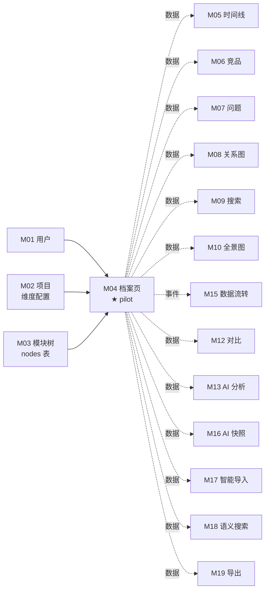
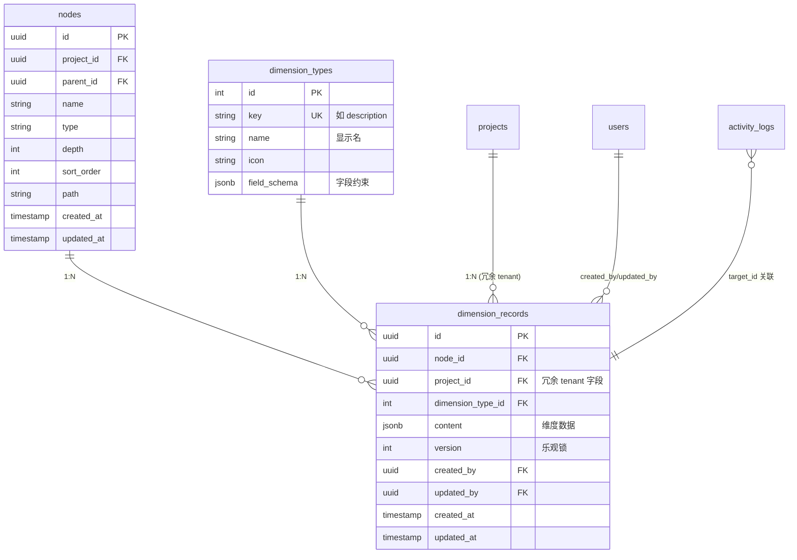

# M04 功能项档案页 - 详细设计

> Pilot 模块——本文档同时验证 C 档"16 字段模板"的可复用性。
> 完成 + audit 后，模板字段定稿，再批量填其他模块。

**协作约定**：
- ✅ 已定稿节：直接采用
- ⚠️ **待 CY 裁决**：给候选 + 我的倾向 + 你裁决
- 🔗 关联到 A/B 档规约的均给链接

---

## 1. 职责边界（in scope / out of scope）

### In scope（M04 负责）

- **维度卡片渲染**：基于项目维度配置 + 该功能项已有维度记录，动态渲染卡片
- **维度内容编辑**：保存 / 更新 / 删除维度记录（多人编辑 → 乐观锁）
- **空卡片直接编辑**：用户点击空维度卡片即进入编辑（无独立"添加"按钮，US-B1.3）
- **维度区块折叠 / 展开**：UI 状态可持久化（US-B2.2）
- **完善度进度条**：实时计算 = 已填维度数 / 项目启用维度数（US-B2.3）
- **维度记录历史**：保留每次更新的 `updated_by` / `updated_at` / `version`（不含完整版本快照——那是 M5）

### Out of scope（其他模块负责）

| 不做的事 | 归属模块 |
|---------|---------|
| 维度类型字典管理（增删改维度） | M02（项目管理） |
| 项目级维度启用 / 排序配置 | M02 |
| 模块树定位 / 节点 CRUD | M03 |
| 版本演进时间线（version_records 增删） | M05 |
| 竞品参考录入 | M06 |
| 问题沉淀（bug / 技术债） | M07 |
| 模块关系图 | M08 |
| AI 需求分析（基于本模块数据） | M13 |
| AI 快照生成 | M16 |
| 维度内容的导入 / 导出 | M19 |

### 边界灰区（显式说明）

- **新建版本快照**（写 `version_records`）：当用户在 M04 编辑维度时，**不自动**创建新版本——版本是 M05 用户主动操作。M04 只更新 `dimension_records`
- **回滚到旧版本**：属于 M05 能力——M04 只展示当前版本

---

## 2. 依赖模块图（M? → M?）



**前置依赖（必须先实现）**：M01 → M02 → M03

**依赖契约（M04 假设上游提供）**：
- M01：`current_user` 可拿到 `user_id`
- M02：`project_dimension_configs(project_id)` 返回启用维度列表 + 排序
- M02：`dimension_types` 字典（提供 field_schema 用于动态表单）
- M03：`nodes(node_id)` 返回节点（含 project_id 用于 tenant 校验）

⚠️ **pilot 期暂以 stub 假设上述契约**——M02 / M03 详细设计时若有出入，回头修订 M04。

---

## 3. 数据模型（SQLAlchemy + Alembic 要点）

### ⚠️ 待 CY 裁决：`dimension_records` 是否冗余 `project_id`

| 候选 | 优 | 劣 |
|------|----|----|
| **A: 不冗余**（按 Prism 现状） | 范式干净；project_id 通过 nodes 反查 | DAO 每次都要 JOIN nodes（性能可控但代码要小心） |
| **B: 冗余 project_id**（推荐） | DAO 层 tenant 过滤 SQL 简单（直接 WHERE project_id=?）；性能更好；批量删除项目时简单 | 写时要保证 project_id 与 node.project_id 一致（trigger 或 service 层） |

**我倾向 B**——A+B 档原则 5 清单 5（DAO 强制 tenant 过滤）下，B 让 DAO 实现成本最低；不一致风险通过 service 层创建时强制赋值 + alembic 迁移加 CHECK 约束兜底。

### ER 图（基于候选 B）



### 表说明

| 表 | 归属模块 | M04 操作 |
|----|---------|---------|
| `nodes` | M03 主 | 只读（拿 project_id 校验、拿 name 展示） |
| `dimension_types` | M02 主 | 只读（拿字段 schema） |
| `project_dimension_configs` | M02 主 | 只读（哪些维度启用、排序） |
| `dimension_records` | **M04 主** | C/U/D（U 含乐观锁） |
| `activity_logs` | 横切 | W（每次 C/U/D 都写） |

### Alembic 要点

- `dimension_records` 唯一约束：`UNIQUE(node_id, dimension_type_id)`（一个节点 + 一个维度类型 = 一条记录）
- `dimension_records.version` 默认 1，更新时 `version + 1`
- 索引：
  - `(node_id, dimension_type_id)` 主查询
  - `(project_id)` tenant 过滤（候选 B）
  - `(updated_by, updated_at)` activity 检索
- CHECK 约束（候选 B 兼容性兜底）：`project_id = (SELECT project_id FROM nodes WHERE id = node_id)` —— PG 14+ 支持，否则用 trigger

---

## 4. 状态机（无状态 / 有状态显式说明）

### ⚠️ 待 CY 裁决：dimension_records 是否需要 status 字段

| 候选 | 状态 | 何时用 | 我的倾向 |
|------|------|--------|---------|
| **A: 无状态** | dimension_records 只有 version 数字，无 status | 当前 PRD 没说"草稿 / 发布"区分 | ⭐ 推荐 |
| **B: 有 draft/published** | 编辑时是 draft，显式发布后变 published | 区分"私人草稿"和"团队可见" | PRD 没说，避免过度设计 |
| **C: 有 active/archived** | 软删除 | 删除维度记录后保留历史 | 可考虑——但 activity_log 已能追溯，软删除收益小 |

**我倾向 A：无状态**——遵循 PRD，不过度设计；硬删除 + activity_log 已满足审计。

### 状态机图（候选 A）

```
本模块 dimension_records 实体无 status 字段，无状态机。
版本号（version）只是乐观锁计数器，不构成状态枚举。
node 实体的 active/archived 状态归属 M03，不在本模块。
```

显式声明（按原则 4）：**M04 无状态实体**——主表 `dimension_records` 不维护状态；并发控制走乐观锁（version 字段）。

---

## 5. 多人架构 4 维必答

按原则 5 + 约束清单逐项答（即使是"不涉及"也显式写）。

| 维度 | 答案 | 实现细节 |
|------|------|---------|
| **Tenant 隔离** | ✅ project_id | DAO 强制 `WHERE dimension_records.project_id = ?`（候选 B 冗余字段）；Service 层创建时校验 `node.project_id == 入参 project_id` |
| **多表事务** | ✅ 必须 | Service 层 `with self.db.transaction():` 包：① upsert dimension_records ② log activity_log；任一失败回滚 |
| **异步处理** | ❌ N/A | M04 全同步——维度编辑是用户即时交互，无后台任务、无 Queue、无流式 |
| **并发控制** | ✅ 乐观锁 | `dimension_records.version` 字段；UPDATE 带 `WHERE version=expected`；rows=0 → `ConflictError`（前端 toast"有人刚改过，请刷新重试"） |

### 约束清单逐项检查（呼应 06-design-principles 的 5 项清单）

| 清单项 | M04 是否触发 | 实现 |
|-------|-------------|------|
| 1. activity_log | ✅ 触发（变更操作）| 节 10 列清单 |
| 2. 乐观锁 version | ✅ 触发（多人编辑）| dimension_records.version |
| 3. Queue payload tenant | ❌ 不触发（无 Queue）| N/A |
| 4. idempotency_key | ⚠️ 待裁决 | 节 11 |
| 5. DAO tenant 过滤 | ✅ 触发 | 节 9 |

---

## 6. 分层职责表（呼应 04-layer-architecture）

| 层 | M04 涉及文件 | 该层职责 |
|----|------------|---------|
| **Page** | `web/src/app/projects/[pid]/nodes/[nid]/page.tsx` | 加载档案页 SSR；调 Server Action 拿初始数据；渲染维度卡片列表 |
| **Component** | `web/src/components/business/dimension-card.tsx`<br>`web/src/components/business/completion-bar.tsx` | 卡片渲染 / 编辑模式切换 / 折叠 / 完善度计算 |
| **Server Action** | `web/src/actions/dimension.ts` | session 校验 / zod 入参校验 / fetch FastAPI |
| **Router** | `api/routers/dimension_router.py` | 路由定义 / `Depends(check_project_access)` / Pydantic schema 入参出参 |
| **Service** | `api/services/dimension_service.py` | 业务规则 / 事务 / tenant 校验 / 写 activity_log |
| **DAO** | `api/dao/dimension_dao.py`<br>（依赖 `node_dao.py` / `activity_dao.py`） | SQL 构建 + 强制 tenant 过滤 + 乐观锁 SQL |
| **Model** | `api/models/dimension_record.py` | SQLAlchemy 模型（schema 真相源） |
| **Schema** | `api/schemas/dimension_schema.py` | Pydantic 请求 / 响应 |

**禁止**（呼应规约 5.4 反例）：
- ❌ Router 直 `db.query(DimensionRecord)`
- ❌ Service 内 `requests.get(...)` 调外部
- ❌ DAO 内 `if record.dimension_type_id == 5: ...` 业务判断

---

## 7. API 契约（Pydantic + OpenAPI 路径表）

### Endpoints

| 方法 | 路径 | 用途 | Pydantic 入参 | 出参 |
|------|------|------|--------------|------|
| GET | `/api/projects/{project_id}/nodes/{node_id}/dimensions` | 拉取节点所有维度 | — | `DimensionListResponse` |
| GET | `/api/projects/{project_id}/nodes/{node_id}/dimensions/{type_id}` | 拉取单维度 | — | `DimensionResponse` |
| POST | `/api/projects/{project_id}/nodes/{node_id}/dimensions` | 创建维度记录 | `DimensionCreate` | `DimensionResponse` |
| PUT | `/api/projects/{project_id}/nodes/{node_id}/dimensions/{type_id}` | 更新维度记录（带乐观锁） | `DimensionUpdate` | `DimensionResponse` |
| DELETE | `/api/projects/{project_id}/nodes/{node_id}/dimensions/{type_id}` | 删除维度记录 | — | 204 |
| GET | `/api/projects/{project_id}/nodes/{node_id}/completion` | 完善度计算 | — | `CompletionResponse` |

### Pydantic schema 草案

```python
# api/schemas/dimension_schema.py

class DimensionContent(BaseModel):
    """根据 dimension_types.field_schema 动态校验内容（Pydantic create_model 运行时构造）"""
    model_config = ConfigDict(extra="forbid")

class DimensionResponse(BaseModel):
    id: UUID
    node_id: UUID
    dimension_type_id: int
    dimension_type_key: str          # join 出来便于前端
    content: dict[str, Any]
    version: int
    updated_by: UUID
    updated_by_name: str             # join 出来
    updated_at: datetime
    created_at: datetime

class DimensionListResponse(BaseModel):
    items: list[DimensionResponse]
    enabled_dimension_types: list[DimensionTypeRef]   # 项目启用的维度（含未填的）

class DimensionCreate(BaseModel):
    dimension_type_id: int
    content: dict[str, Any]          # 由 service 调 dimension_types.field_schema 二次校验

class DimensionUpdate(BaseModel):
    content: dict[str, Any]
    expected_version: int            # ← 乐观锁前端必传

class CompletionResponse(BaseModel):
    enabled_count: int
    filled_count: int
    completion_rate: float           # 0.0 - 1.0
```

⚠️ **待 CY 裁决**：
- `content` 用 `dict[str, Any]` 还是按 `dimension_type_key` 动态生成具体 Pydantic 类？
  - 候选 A：`dict[str, Any]`，service 层用 `dimension_types.field_schema` 跑 jsonschema 校验（更灵活，维度类型可后台配置）
  - 候选 B：每个维度类型一个 Pydantic 类（强类型，但加维度要改代码 + 重新 codegen）
  - 我倾向 A——业务上"维度类型"是配置数据，不是代码

---

## 8. 权限三层防御点（呼应 04-layer-architecture Q4）

| 层 | 检查 | 实现 |
|----|------|------|
| **Server Action** | session 是否有效 | `getServerSession()`；无则 401 |
| **Router** | 用户对 project 是否有 ≥editor 权限 | `Depends(check_project_access(project_id, role="editor"))`<br>读接口允许 viewer，写接口要求 editor |
| **Service** | node 是否真的属于该 project | `_check_node_belongs_to_project(node_id, project_id)`；不属于抛 `NotFoundError`（不暴露 forbidden 信息） |

**异步路径**：M04 无异步，三层即足够（无需补 Queue 消费者侧权限）。

---

## 9. DAO tenant 过滤策略（呼应原则 5 清单 5）

### 主查询模式（候选 B 实现）

```python
# api/dao/dimension_dao.py

class DimensionDAO:
    def list_by_node(
        self, db: Session, node_id: UUID, project_id: UUID
    ) -> list[DimensionRecord]:
        return (
            db.query(DimensionRecord)
            .filter(
                DimensionRecord.node_id == node_id,
                DimensionRecord.project_id == project_id,   # ← tenant 过滤
            )
            .all()
        )

    def get_one(
        self, db: Session, node_id: UUID, project_id: UUID, type_id: int
    ) -> DimensionRecord | None:
        return (
            db.query(DimensionRecord)
            .filter(
                DimensionRecord.node_id == node_id,
                DimensionRecord.project_id == project_id,
                DimensionRecord.dimension_type_id == type_id,
            )
            .first()
        )

    def update_with_version(
        self, db: Session, record_id: UUID, project_id: UUID,
        expected_version: int, **fields
    ) -> int:
        rows = (
            db.query(DimensionRecord)
            .filter(
                DimensionRecord.id == record_id,
                DimensionRecord.project_id == project_id,    # ← tenant 过滤
                DimensionRecord.version == expected_version, # ← 乐观锁
            )
            .update({**fields, "version": DimensionRecord.version + 1})
        )
        return rows  # 0 = 冲突或不存在或越权
```

### 豁免清单

无——M04 所有查询都在 tenant 边界内。

### 防绕过纪律

- 任何新增 DAO 方法**强制带 project_id 入参**（review 阶段拦）
- importlinter 已禁止 router 直查 DAO（规约 5.3）

---

## 10. activity_log 事件清单（呼应清单 1）

### ⚠️ 待 CY 裁决：粒度

| 候选 | 例子 | 优 | 劣 |
|------|------|----|----|
| **A: 操作粒度** | `dimension.update {type_id: 5}` | 简单；表行数少 | 看不出"改了哪个字段" |
| **B: 字段粒度** | `dimension.update {type_id: 5, fields: ["technical_solution"]}` | 审计精细 | 实现复杂；M15 数据流转才是消费方 |
| **C: 操作粒度 + diff metadata** | `dimension.update {type_id: 5, metadata: {old_hash, new_hash}}` | 折中 | metadata 字段已有，扩展性好 |

**我倾向 C**：操作粒度 + metadata 留 hash / size，需要时 M15 / M13 扩展消费。

### 事件清单（候选 C）

| action_type | target_type | target_id | summary | metadata |
|-------------|-------------|-----------|---------|----------|
| `create` | `dimension_record` | `<dim_record_id>` | 创建维度：{type_name} | `{node_id, type_id, content_size}` |
| `update` | `dimension_record` | `<dim_record_id>` | 更新维度：{type_name} | `{node_id, type_id, old_version, new_version}` |
| `delete` | `dimension_record` | `<dim_record_id>` | 删除维度：{type_name} | `{node_id, type_id}` |

### 实现位置

Service 层 `dimension_service.py`，每个 C/U/D 方法事务内调 `self.activity.log(...)`。

---

## 11. idempotency_key 适用操作清单（呼应清单 4）

### ⚠️ 待 CY 裁决

| 候选 | 范围 | 我的倾向 |
|------|------|---------|
| **A: 全无** | M04 无敏感操作；编辑可重复（乐观锁防丢失）；删除支持重复（删除已删的返回 204） | ⭐ 推荐 |
| **B: 仅删除** | 删除维度走 idempotency_key | 收益不大，删除幂等天然成立 |
| **C: 创建也加** | 防止网络重试导致重复创建（特别是空状态点击）| 唯一约束 `(node_id, type_id)` 已防 → 重复创建会被 DB 挡 |

**我倾向 A：M04 无 idempotency 需求**——
- 更新：乐观锁 + 重复请求会因 version 不匹配而失败一次（用户需主动刷新），自然防重
- 创建：DB 唯一约束 `(node_id, type_id)` 防重
- 删除：天然幂等（重复 DELETE 第二次返回 204 也合理）

显式声明（按原则 5 清单 4 要求）：**M04 无 idempotency_key 操作**。

---

## 12. Queue payload schema（异步模块；同步 N/A）

**N/A**——M04 无异步处理，无 Queue 任务。

显式声明（按原则 5 清单 3 要求）：**M04 不投递 Queue 任务**。

---

## 13. ErrorCode 新增清单（呼应规约 7）

### 新增 ErrorCode（注册到 `api/errors/codes.py`）

```python
class ErrorCode(str, Enum):
    # ... 已有

    # 模块（M04）
    DIMENSION_NOT_FOUND = "DIMENSION_NOT_FOUND"
    DIMENSION_TYPE_DISABLED = "DIMENSION_TYPE_DISABLED"  # 项目级配置禁用
    DIMENSION_TYPE_NOT_FOUND = "DIMENSION_TYPE_NOT_FOUND"
    DIMENSION_CONTENT_INVALID = "DIMENSION_CONTENT_INVALID"  # field_schema 校验失败
    DIMENSION_DUPLICATE = "DIMENSION_DUPLICATE"          # (node_id, type_id) 唯一约束
```

### 新增 AppError 子类（`api/errors/exceptions.py`）

```python
class DimensionNotFoundError(NotFoundError):
    code = ErrorCode.DIMENSION_NOT_FOUND
    message = "Dimension record not found"

class DimensionTypeDisabledError(AppError):
    code = ErrorCode.DIMENSION_TYPE_DISABLED
    http_status = 422
    message = "This dimension type is disabled in current project"

class DimensionContentInvalidError(ValidationError):
    code = ErrorCode.DIMENSION_CONTENT_INVALID
    message = "Dimension content does not match field schema"

class DimensionDuplicateError(AppError):
    code = ErrorCode.DIMENSION_DUPLICATE
    http_status = 409
    message = "Dimension record already exists for this node and type"
```

### 复用已有

- `CONFLICT`（乐观锁冲突）—— 规约 7 已定，update 失败时使用
- `PERMISSION_DENIED` / `UNAUTHENTICATED`—— 复用
- `NOT_FOUND`—— `node_id` 找不到时用 `NotFoundError` 父类

### 前端 ErrorCode 同步

按规约 7.5——OpenAPI 自动生成，CI diff 校验。

---

## 14. 测试场景

详见独立文件：[`tests.md`](./tests.md)

主文档只列大纲：
- **golden path**：创建 / 读取 / 更新 / 删除 / 完善度计算
- **边界**：空内容 / 超长 / field_schema 不符 / 维度类型禁用
- **并发**：同 user 双 tab 并发更新 / 不同 user 同维度并发
- **tenant**：跨项目越权读 / 越权写 / DAO 过滤覆盖
- **权限**：viewer 写 / 未登录读 / role downgrade
- **错误处理**：DB 唯一冲突 / 乐观锁冲突 / 节点已删

---

## 15. 完成度判定 checklist

定稿前必须全部勾过：

- [ ] 节 1：职责边界 in/out scope 完整
- [ ] 节 2：依赖图覆盖所有上下游
- [ ] 节 3：数据模型 ER 图 + Alembic 要点完整 + ⚠️ project_id 冗余决策已定
- [ ] 节 4：状态机决策已定（无状态显式声明）
- [ ] 节 5：4 维必答 + 5 项清单逐项标注
- [ ] 节 6：分层职责表完整（每层文件路径明确）
- [ ] 节 7：所有 API endpoint + Pydantic schema 列全 + ⚠️ content 类型决策已定
- [ ] 节 8：权限三层防御 + 异步路径声明
- [ ] 节 9：DAO 主查询模式 + 豁免清单（无）
- [ ] 节 10：activity_log 事件粒度决策已定 + 事件清单
- [ ] 节 11：idempotency 决策已定（A: 无）
- [ ] 节 12：Queue 显式 N/A
- [ ] 节 13：ErrorCode 新增清单 + AppError 类
- [ ] 节 14：tests.md 测试场景写完
- [ ] 节 15：本 checklist 全勾过
- [ ] **🔴 第一轮 reviewer audit（完整性）通过**
- [ ] **🔴 第二轮 reviewer audit（边界场景）通过**
- [ ] **🔴 第三轮 reviewer audit（演进 / 模板可复用性）通过**
- [ ] CY 全文复审通过 → status 转 accepted

---

## 待 CY 裁决项汇总（一次过）

| # | 节 | 决策点 | 候选 | 我的倾向 |
|---|----|-------|------|---------|
| Q1 | 3 | dimension_records 是否冗余 project_id | A 不冗余 / B 冗余 | **B** |
| Q2 | 4 | 是否需要 status 字段 | A 无 / B draft+published / C active+archived | **A** |
| Q3 | 7 | content 类型 | A dict[str,Any] / B 每维度一类 | **A** |
| Q4 | 10 | activity_log 粒度 | A 操作 / B 字段 / C 操作+metadata | **C** |
| Q5 | 11 | idempotency 范围 | A 全无 / B 仅删除 / C 含创建 | **A** |

---

## 关联参考

- 上游设计：
  - `design/00-architecture/04-layer-architecture.md`（5 层 / 三层权限 / 事务边界）
  - `design/00-architecture/05-module-catalog.md`（4 维标注）
  - `design/00-architecture/06-design-principles.md`（原则 5 + 5 项清单）
  - `design/00-architecture/07-capability-matrix.md`（M04 能力定位）
- 工程规约：
  - `design/01-engineering/01-engineering-spec.md` 规约 1 / 5 / 7 / 11 / 12
- Prism 对照参考：
  - `/root/cy/prism/web/src/db/schema.ts`（dimensionRecords / nodes 现状）
  - `/root/cy/prism/docs/product/feature-list-and-user-stories.md`（US-B1.2/B1.3/B2.2/B2.3）
