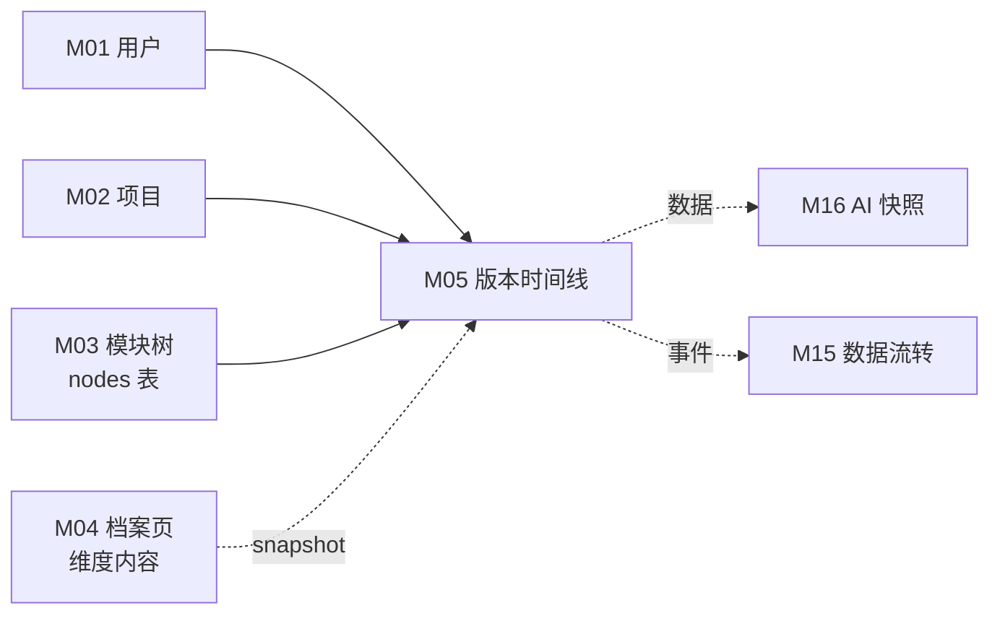
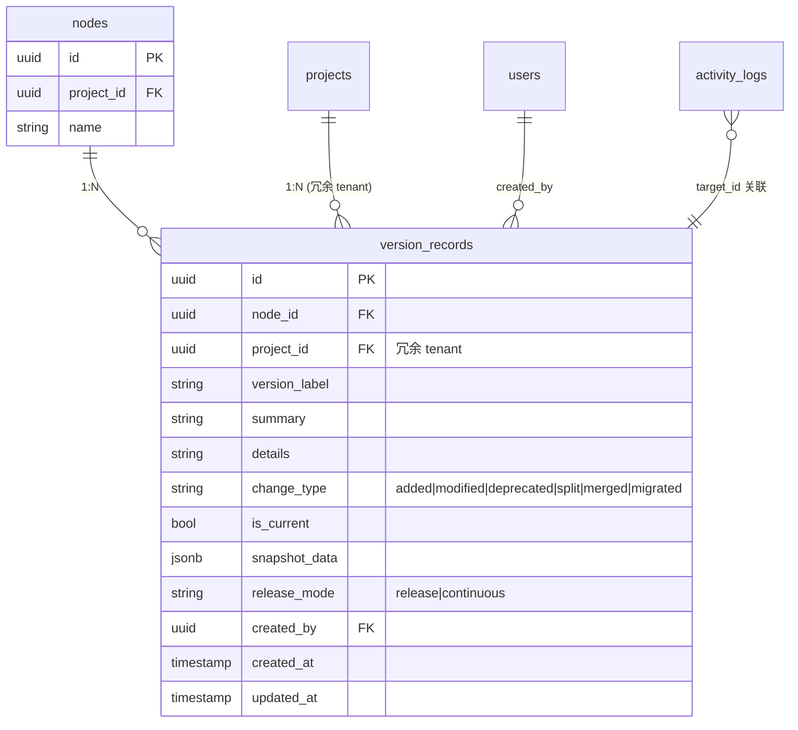

# M05 版本演进时间线 - 详细设计

**协作约定**：
- ✅ 已定稿节：直接采用（来自架构规约 + 4 维标注）
- ⚠️ **待 CY 裁决**：AI 推断，给候选 + 我的倾向 + 你裁决
- 🔗 关联到 A/B 档规约均给链接

---

## 1. 业务说明 + 职责边界

### 业务背景（引自 PRD / US）

根据 PRD Q3 "围绕功能模块组织、能持续沉淀产品理解"，版本时间线是功能项的历史演进视图。

**核心用户故事**：
- **US-B1.5**：作为编辑者，我想为功能项添加版本记录（版本号 + 描述 + 变更类型），这样演进历史可追溯
- **US-C1.4**：作为查看者，我想看到功能项的版本时间线，这样了解这个功能经历了什么变化

**功能在 Prism 中的位置（F5）**：功能项档案页的版本演进历史，记录每次重要变更，供追溯和 AI 快照（M16）使用。

### In scope（M05 负责）

- **版本记录 CRUD**：编辑者手动创建 / 查看 / 更新 / 删除版本记录（US-B1.5）
- **版本时间线渲染**：时间线 UI 展示版本列表，含变更类型标签 + 摘要 + 快照数据预览
- **"当前版本"标记**：同一 node 只能有一个 isCurrent=true 的版本；切换时原 isCurrent 自动取消
- **版本快照数据存储**：创建版本时可携带 `snapshot_data`（当前维度内容快照的 JSON），供 M16 AI 快照读取
- **查看者只读访问**：查看者可读不可写（US-C1.4）

### Out of scope（其他模块负责）

| 不做的事 | 归属模块 |
|---------|---------|
| 维度内容编辑 | M04 |
| 版本回滚（将 snapshot_data 写回维度记录）| M04（回滚触发时通知 M04 覆写）|
| AI 自动生成版本快照描述 | M16 |
| 基于版本历史做需求分析 | M13 |

### 边界灰区（显式说明）

- **snapshot_data 存储**：M05 负责存，M16 负责读并生成自然语言描述。M05 本身不做 AI 解析。
- **"标记当前版本"**：⚠️ 需 CY 裁决是否做"切换当前版本自动更新维度内容"（见节 15）。

---

## 2. 依赖模块图



**前置依赖**：M01 → M02 → M03 → M04（M04 提供 node 上下文；M05 可独立写，但 UI 入口在档案页）

**依赖契约**：
- M01：`current_user`（user_id）
- M03：`nodes(node_id)` 含 project_id（用于 tenant 校验）
- M04：版本记录写入时，可选传入 `snapshot_data`（当前维度内容快照）

---

## 3. 数据模型（SQLAlchemy + Alembic 要点）

### ⚠️ 待 CY 裁决 Q1：version_records 是否冗余 project_id

| 候选 | 优 | 劣 |
|------|----|----|
| **A: 不冗余** | 范式干净 | DAO tenant 过滤必须 JOIN nodes |
| **B: 冗余 project_id**（推荐） | DAO 简单，直接 WHERE project_id=?；批量删除项目时直接过滤 | 写时须保证与 node.project_id 一致（service 层强制赋值） |

**我倾向 B**——与 M04 同样策略，保持 DAO 实现一致性。

### SQLAlchemy 模型

```python
# api/models/version_record.py

class VersionRecord(Base):
    __tablename__ = "version_records"

    id: uuid.UUID = Column(UUID(as_uuid=True), primary_key=True, default=uuid.uuid4)
    node_id: uuid.UUID = Column(UUID(as_uuid=True), ForeignKey("nodes.id", ondelete="CASCADE"), nullable=False)
    project_id: uuid.UUID = Column(UUID(as_uuid=True), ForeignKey("projects.id", ondelete="CASCADE"), nullable=False)  # 冗余 tenant
    version_label: str = Column(Text, nullable=False)           # "v3.9.3" 或 "2026-04-07"
    summary: str = Column(Text, nullable=False)
    details: str = Column(Text, nullable=True)
    change_type: str = Column(Text, nullable=False, default="added")  # added|modified|deprecated|split|merged|migrated
    is_current: bool = Column(Boolean, nullable=False, default=False)
    snapshot_data: dict = Column(JSONB, nullable=True)          # 创建时维度内容快照
    release_mode: str = Column(Text, nullable=False, default="release")  # release|continuous（重命名自 Prism mode 字段）
    created_by: uuid.UUID = Column(UUID(as_uuid=True), ForeignKey("users.id"), nullable=True)
    created_at: datetime = Column(DateTime(timezone=True), nullable=False, default=func.now())
    updated_at: datetime = Column(DateTime(timezone=True), nullable=False, default=func.now(), onupdate=func.now())
```

> ⚠️ **AI 推断，CY 复审必改**：Prism 原字段 `mode` 重命名为 `release_mode` 以更明确语义；`createdBy` 补充（Prism 原无），用于 activity_log；字段名全用 snake_case（SQLAlchemy 规范）。

### ER 图（候选 B）



### Alembic 要点

- 唯一约束：`UNIQUE(node_id, version_label)`（同一节点不能有重名版本）
- 索引：
  - `(node_id, project_id)` 主查询
  - `(project_id)` tenant 过滤
  - `(node_id, is_current)` 快速找当前版本（部分索引 `WHERE is_current = true`）
- `is_current` 切换：Service 层先 UPDATE 旧 isCurrent=false，再 UPDATE 新 isCurrent=true（同一事务内，M05 不需要多表事务，两次 UPDATE 同一表均在 version_records）
- CHECK 约束候选 B 兜底：`project_id = (SELECT project_id FROM nodes WHERE id = node_id)`

---

## 4. 状态机

### ⚠️ 待 CY 裁决 Q2：version_records 是否需要 status 字段

| 候选 | 说明 |
|------|------|
| **A: 无 status（推荐）** | version_records 只有 is_current（布尔）标记"当前版本"，不是状态枚举；PRD 无草稿/发布概念 |
| **B: draft/published** | 允许创建草稿版本后再发布；PRD 未提及，过度设计 |

**我倾向 A**——遵循 PRD US-B1.5，版本记录是手动录入的历史事实，无需草稿态。

### is_current 布尔转换图

```
is_current 不是状态机（只是布尔标记），但存在一个业务约束：

  同一 node 下，任意时刻最多 1 条 is_current = true

  [is_current=false] <--(切换当前版本)--> [is_current=true]
                        （Service 层原子操作：先置 false，再置 true）
```

显式声明（原则 4）：**M05 无 status 枚举实体**。`is_current` 是布尔标记，不构成状态机。

---

## 5. 多人架构 4 维必答

| 维度 | 答案 | 实现细节 |
|------|------|---------|
| **Tenant 隔离** | ✅ project_id | DAO 强制 `WHERE version_records.project_id = ?`（候选 B 冗余字段） |
| **多表事务** | ❌ 不需要 | 版本记录的 CRUD 只涉及 version_records 单表；"切换当前版本"是同表两次 UPDATE，可放单 DB 事务（非多表）；activity_log 写入在 Service 层同方法内调用 |
| **异步处理** | ❌ N/A | 全同步，用户手动录入，无 AI / Queue 处理 |
| **并发控制** | ❌ N/A | 05-module-catalog 标注无并发；版本记录主要是追加写（每次新建版本），不是多人编辑同一记录 |

> ⚠️ **AI 推断，CY 复审必改**：事务标注参考 05-module-catalog（事务=❌），但 is_current 切换需同表两次 UPDATE，Service 层包一个 transaction 即可（不是跨表事务，因此维持❌）。

### 约束清单逐项检查

| 清单项 | M05 是否触发 | 实现 |
|-------|-------------|------|
| 1. activity_log | ✅ 触发（创建/更新/删除版本记录）| 节 10 |
| 2. 乐观锁 version | ❌ 不触发（无并发编辑场景）| N/A |
| 3. Queue payload tenant | ❌ 不触发（无 Queue）| N/A |
| 4. idempotency_key | ⚠️ 待裁决 | 节 11 |
| 5. DAO tenant 过滤 | ✅ 触发 | 节 9 |

---

## 6. 分层职责表

| 层 | M05 涉及文件 | 该层职责 |
|----|------------|---------|
| **Page** | `web/src/app/projects/[pid]/nodes/[nid]/page.tsx`（嵌入档案页）| 版本时间线区块渲染（SSR 初始数据） |
| **Component** | `web/src/components/business/version-timeline.tsx`<br>`web/src/components/business/version-card.tsx` | 时间线渲染 / 新增版本弹窗 / 变更类型标签 |
| **Server Action** | `web/src/actions/version.ts` | session 校验 / 参数校验 / fetch FastAPI |
| **Router** | `api/routers/version_router.py` | 路由定义 / `Depends(check_project_access)` / Pydantic 入参出参 |
| **Service** | `api/services/version_service.py` | 业务规则（is_current 互斥逻辑）/ tenant 校验 / 写 activity_log |
| **DAO** | `api/dao/version_dao.py` | SQL 构建 + 强制 tenant 过滤 |
| **Model** | `api/models/version_record.py` | SQLAlchemy 模型 |
| **Schema** | `api/schemas/version_schema.py` | Pydantic 请求/响应 |

**禁止**：
- ❌ Router 直查 DB
- ❌ Service 绕过 DAO
- ❌ DAO 做业务判断（is_current 互斥逻辑放 Service）

---

## 7. API 契约

### Endpoints

| 方法 | 路径 | 用途 | 入参 | 出参 |
|------|------|------|------|------|
| GET | `/api/projects/{project_id}/nodes/{node_id}/versions` | 拉取节点所有版本（时间线） | — | `VersionListResponse` |
| GET | `/api/projects/{project_id}/nodes/{node_id}/versions/{version_id}` | 拉取单版本详情 | — | `VersionResponse` |
| POST | `/api/projects/{project_id}/nodes/{node_id}/versions` | 创建版本记录 | `VersionCreate` | `VersionResponse` |
| PUT | `/api/projects/{project_id}/nodes/{node_id}/versions/{version_id}` | 更新版本记录（仅元数据，非快照数据）| `VersionUpdate` | `VersionResponse` |
| DELETE | `/api/projects/{project_id}/nodes/{node_id}/versions/{version_id}` | 删除版本记录 | — | 204 |
| POST | `/api/projects/{project_id}/nodes/{node_id}/versions/{version_id}/set-current` | 标记为当前版本 | — | `VersionResponse` |

### Pydantic schema 草案

```python
# api/schemas/version_schema.py

class VersionCreate(BaseModel):
    version_label: str = Field(..., min_length=1, max_length=64)
    summary: str = Field(..., min_length=1, max_length=500)
    details: str | None = None
    change_type: Literal["added", "modified", "deprecated", "split", "merged", "migrated"] = "added"
    release_mode: Literal["release", "continuous"] = "release"
    is_current: bool = False
    snapshot_data: dict[str, Any] | None = None  # 由调用方（前端 / M16）提供

class VersionUpdate(BaseModel):
    summary: str | None = Field(None, max_length=500)
    details: str | None = None
    change_type: Literal["added", "modified", "deprecated", "split", "merged", "migrated"] | None = None
    release_mode: Literal["release", "continuous"] | None = None

class VersionResponse(BaseModel):
    id: UUID
    node_id: UUID
    project_id: UUID
    version_label: str
    summary: str
    details: str | None
    change_type: str
    is_current: bool
    release_mode: str
    snapshot_data: dict[str, Any] | None
    created_by: UUID | None
    created_by_name: str | None  # join 展示
    created_at: datetime
    updated_at: datetime

class VersionListResponse(BaseModel):
    items: list[VersionResponse]
    total: int
```

⚠️ **AI 推断，CY 复审必改**：
- `snapshot_data` 是否允许 PUT 更新？候选 A：不允许（快照是历史事实，不可改）；候选 B：允许（避免数据修复麻烦）。我倾向 A。

---

## 8. 权限三层防御

| 层 | 检查 | 实现 |
|----|------|------|
| **Server Action** | session 是否有效 | `getServerSession()`；无则 401 |
| **Router** | 用户对 project 权限 | GET 允许 viewer；POST/PUT/DELETE 要求 editor；`Depends(check_project_access(project_id, role))` |
| **Service** | node 是否属于该 project | `_check_node_belongs_to_project(node_id, project_id)`；不属于抛 `NotFoundError` |

**M05 无异步路径**，三层即覆盖。

---

## 9. DAO tenant 过滤策略

```python
# api/dao/version_dao.py

class VersionDAO:
    def list_by_node(self, db: Session, node_id: UUID, project_id: UUID) -> list[VersionRecord]:
        return (
            db.query(VersionRecord)
            .filter(
                VersionRecord.node_id == node_id,
                VersionRecord.project_id == project_id,  # ← tenant 过滤
            )
            .order_by(VersionRecord.created_at.desc())
            .all()
        )

    def get_one(self, db: Session, version_id: UUID, project_id: UUID) -> VersionRecord | None:
        return (
            db.query(VersionRecord)
            .filter(
                VersionRecord.id == version_id,
                VersionRecord.project_id == project_id,  # ← tenant 过滤
            )
            .first()
        )

    def clear_current_flag(self, db: Session, node_id: UUID, project_id: UUID) -> None:
        """切换当前版本前先清空旧 isCurrent"""
        db.query(VersionRecord).filter(
            VersionRecord.node_id == node_id,
            VersionRecord.project_id == project_id,
            VersionRecord.is_current == True,
        ).update({"is_current": False})
```

### 豁免清单

无——M05 所有查询均在 project tenant 边界内。

---

## 10. activity_log 事件清单

| action_type | target_type | target_id | summary | metadata |
|-------------|-------------|-----------|---------|----------|
| `create` | `version_record` | `<version_id>` | 创建版本：{version_label} | `{node_id, change_type, is_current}` |
| `update` | `version_record` | `<version_id>` | 更新版本：{version_label} | `{node_id, changed_fields}` |
| `delete` | `version_record` | `<version_id>` | 删除版本：{version_label} | `{node_id, was_current}` |
| `set_current` | `version_record` | `<version_id>` | 标记当前版本：{version_label} | `{node_id, previous_current_id}` |

**实现位置**：`api/services/version_service.py` 每个 C/U/D + set_current 方法内调 `self.activity.log(...)`。

---

## 11. idempotency_key 适用操作

### ⚠️ 待 CY 裁决 Q3：是否需要幂等

| 候选 | 理由 | 我的倾向 |
|------|------|---------|
| **A: 全无（推荐）** | 版本记录唯一约束 `(node_id, version_label)` 天然防重复创建；删除幂等天然成立；更新重试无害 | ⭐ |
| **B: 创建加 idempotency_key** | 防止网络重试导致重复版本记录 | 唯一约束已覆盖 |

**我倾向 A**——`UNIQUE(node_id, version_label)` 已防重；无需额外幂等机制。

显式声明（清单 4）：**M05 无 idempotency_key 操作**。

---

## 12. Queue payload schema

**N/A**——M05 无异步处理，无 Queue 任务。

显式声明（清单 3）：**M05 不投递 Queue 任务**。

---

## 13. ErrorCode 新增清单

```python
# api/errors/codes.py 新增（模块 M05）

class ErrorCode(str, Enum):
    # 模块 M05
    VERSION_NOT_FOUND = "VERSION_NOT_FOUND"
    VERSION_LABEL_DUPLICATE = "VERSION_LABEL_DUPLICATE"       # (node_id, version_label) 唯一约束
    VERSION_SNAPSHOT_INVALID = "VERSION_SNAPSHOT_INVALID"     # snapshot_data 格式校验失败
```

```python
# api/errors/exceptions.py 新增

class VersionNotFoundError(NotFoundError):
    code = ErrorCode.VERSION_NOT_FOUND
    message = "Version record not found"

class VersionLabelDuplicateError(AppError):
    code = ErrorCode.VERSION_LABEL_DUPLICATE
    http_status = 409
    message = "A version with this label already exists for the node"

class VersionSnapshotInvalidError(ValidationError):
    code = ErrorCode.VERSION_SNAPSHOT_INVALID
    http_status = 422
    message = "snapshot_data does not match expected format"
```

**复用已有**：`PERMISSION_DENIED` / `UNAUTHENTICATED` / `NOT_FOUND`

---

## 14. 测试场景大纲

详见 [`tests.md`](./tests.md)

- **golden path**：创建版本 / 读取时间线 / 更新元数据 / 删除 / 标记当前版本
- **边界**：空 summary / 超长 version_label / 重复 label / snapshot_data 格式错误
- **并发**：无并发场景（05-catalog 标注❌）
- **tenant**：跨项目越权读 / 越权写
- **权限**：viewer 写 / 未登录读
- **错误处理**：DB 唯一冲突 / node 不存在 / 删除当前版本

---

## 15. 完成度判定 checklist + ⚠️ 待 CY 裁决项汇总

### Checklist

- [ ] 节 1：职责边界 in/out scope 完整（引 US-B1.5 / US-C1.4）
- [ ] 节 2：依赖图完整
- [ ] 节 3：数据模型 ER 图 + Alembic 要点 + ⚠️ project_id 冗余决策
- [ ] 节 4：is_current 布尔语义明确（无状态机）
- [ ] 节 5：4 维必答 + 5 项清单逐项
- [ ] 节 6：分层文件路径明确
- [ ] 节 7：所有 API endpoint + schema + ⚠️ snapshot_data 可否更新决策
- [ ] 节 8：权限三层
- [ ] 节 9：DAO tenant 过滤 + 豁免清单（无）
- [ ] 节 10：activity_log 4 种事件
- [ ] 节 11：idempotency 显式 N/A
- [ ] 节 12：Queue 显式 N/A
- [ ] 节 13：ErrorCode 3 个新增
- [ ] 节 14：tests.md 完整
- [ ] CY 裁决 3 项全过 → status 转 accepted

### ⚠️ 待 CY 裁决项汇总

| # | 节 | 决策点 | 候选 | 我的倾向 |
|---|----|-------|------|---------|
| Q1 | 3 | version_records 是否冗余 project_id | A 不冗余 / B 冗余 | **B** |
| Q2 | 4 | 是否需要 status 字段 | A 无 / B draft+published | **A** |
| Q3 | 7 | snapshot_data 是否允许 PUT 更新 | A 不允许 / B 允许 | **A** |
| Q4 | 11 | idempotency 范围 | A 全无 / B 创建加 key | **A** |
| Q5 | 1 | "切换当前版本"是否自动写回维度内容 | A 否（只改标记）/ B 是（写回维度快照）| **A**（M04 职责分离） |

> ⚠️ **以上所有判断均为 AI 推断，CY 复审必改**

---

## 关联参考

- 上游：`design/00-architecture/04-layer-architecture.md` / `05-module-catalog.md` / `06-design-principles.md`
- 工程规约：`design/01-engineering/01-engineering-spec.md`
- Prism 对照：`/root/cy/prism/web/src/db/schema.ts`（versionRecords 现状，字段已重命名）
- 业务源：`/root/cy/prism/docs/product/feature-list-and-user-stories.md`（US-B1.5 / US-C1.4）
