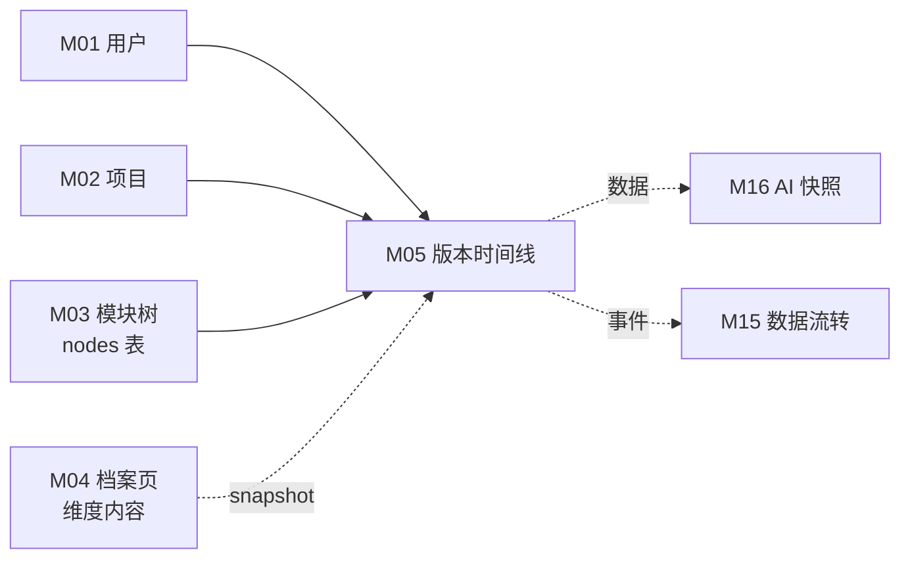
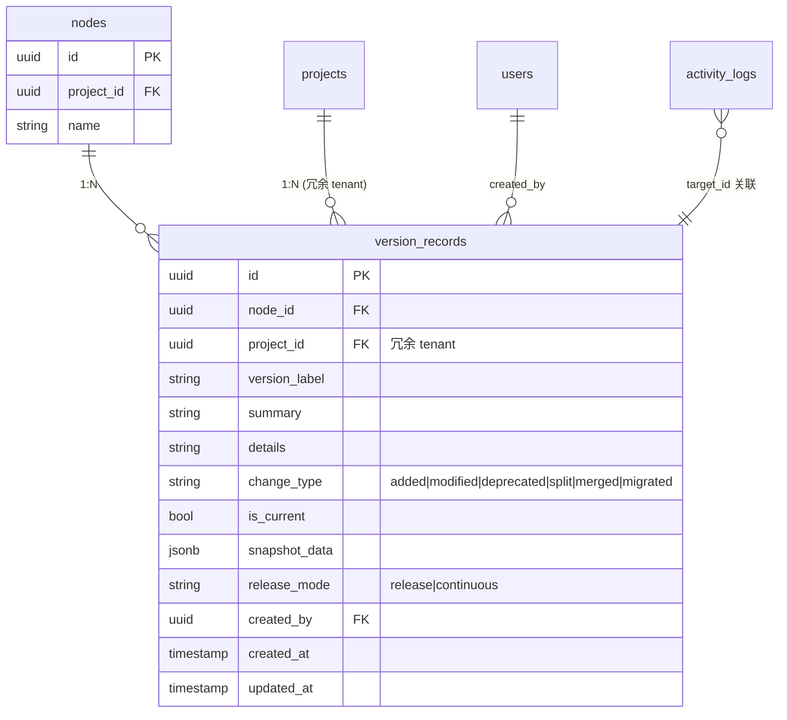

# M05 版本演进时间线 - 详细设计

**协作约定**：
- ✅ 已定稿节：直接采用（来自架构规约 + 4 维标注）
- 🔗 关联到 A/B 档规约均给链接

---

## 1. 业务说明 + 职责边界

### 业务背景（引自 PRD / US）

根据 PRD Q3 "围绕功能模块组织、能持续沉淀产品理解"，版本时间线是功能项的历史演进视图。

**核心用户故事**：
- **US-B1.5**：作为编辑者，我想为功能项添加版本记录（版本号 + 描述 + 变更类型），这样演进历史可追溯
- **US-C1.4**：作为查看者，我想看到功能项的版本时间线，这样了解这个功能经历了什么变化

**功能在 Prism 中的位置（F5）**：功能项档案页的版本演进历史，记录每次重要变更，供追溯和 AI 快照（M16）使用。

### In scope（M05 负责）

- **版本记录 CRUD**：编辑者手动创建 / 查看 / 更新 / 删除版本记录（US-B1.5）
- **版本时间线渲染**：时间线 UI 展示版本列表，含变更类型标签 + 摘要 + 快照数据预览
- **"当前版本"标记**：同一 node 只能有一个 isCurrent=true 的版本；切换时原 isCurrent 自动取消
- **版本快照数据存储**：创建版本时可携带 `snapshot_data`（当前维度内容快照的 JSON），供 M16 AI 快照读取
- **查看者只读访问**：查看者可读不可写（US-C1.4）

### Out of scope（其他模块负责）

| 不做的事 | 归属模块 |
|---------|---------|
| 维度内容编辑 | M04 |
| 版本回滚（将 snapshot_data 写回维度记录）| M04（回滚触发时通知 M04 覆写）|
| AI 自动生成版本快照描述 | M16 |
| 基于版本历史做需求分析 | M13 |

### 边界灰区（显式说明）

- **snapshot_data 存储**：M05 负责存，M16 负责读并生成自然语言描述。M05 本身不做 AI 解析。
- **"切换当前版本"**：决策：仅改标记（`is_current` 布尔），不自动写回维度内容——版本回滚属于 M04 职责（CY 2026-04-21 ack）。

---

## 2. 依赖模块图



**前置依赖**：M01 → M02 → M03 → M04（M04 提供 node 上下文；M05 可独立写，但 UI 入口在档案页）

**依赖契约**：
- M01：`current_user`（user_id）
- M03：`nodes(node_id)` 含 project_id（用于 tenant 校验）
- M04：版本记录写入时，可选传入 `snapshot_data`（当前维度内容快照）

---

## 3. 数据模型（SQLAlchemy + Alembic 要点）

### 决策：`version_records` 冗余 `project_id`（CY 2026-04-21 ack 批量统一冗余）

**理由**：DAO 强制 tenant 过滤策略一致性，直接 `WHERE project_id=?` 无需 JOIN nodes；批量删除项目时简单。
**一致性兜底**：service 层创建时强制 `record.project_id = node.project_id`。

### SQLAlchemy 模型

```python
# api/models/version_record.py
from sqlalchemy.orm import Mapped, mapped_column, relationship
from sqlalchemy import ForeignKey, UniqueConstraint, CheckConstraint, Index, Text, Boolean
from sqlalchemy.dialects.postgresql import UUID, JSONB
from datetime import datetime
from uuid import UUID as PyUUID, uuid4
from typing import Any
from .base import Base, TimestampMixin

class VersionRecord(Base, TimestampMixin):
    __tablename__ = "version_records"
    __table_args__ = (
        UniqueConstraint("node_id", "version_label", name="uq_version_node_label"),
        CheckConstraint(
            "change_type IN ('added', 'modified', 'deprecated', 'split', 'merged', 'migrated')",
            name="ck_version_change_type",
        ),
        CheckConstraint(
            "release_mode IN ('release', 'continuous')",
            name="ck_version_release_mode",
        ),
        Index("ix_version_node_project", "node_id", "project_id"),
        Index("ix_version_project", "project_id"),
        # 部分唯一约束（DB 级并发防护）：同 node 最多 1 条 is_current=true
        # PG 部分唯一索引——SQLAlchemy 用 Index + unique=True + postgresql_where 表达
        Index(
            "uq_version_node_is_current",
            "node_id",
            unique=True,
            postgresql_where=text("is_current = true"),
        ),
    )

    id: Mapped[PyUUID] = mapped_column(UUID(as_uuid=True), primary_key=True, default=uuid4)
    node_id: Mapped[PyUUID] = mapped_column(UUID(as_uuid=True), ForeignKey("nodes.id", ondelete="CASCADE"), nullable=False)
    project_id: Mapped[PyUUID] = mapped_column(UUID(as_uuid=True), ForeignKey("projects.id", ondelete="CASCADE"), nullable=False)  # 冗余 tenant 字段
    version_label: Mapped[str] = mapped_column(Text, nullable=False)           # "v3.9.3" 或 "2026-04-07"
    summary: Mapped[str] = mapped_column(Text, nullable=False)
    details: Mapped[str | None] = mapped_column(Text, nullable=True)
    change_type: Mapped[str] = mapped_column(Text, nullable=False, default="added")  # added|modified|deprecated|split|merged|migrated
    is_current: Mapped[bool] = mapped_column(Boolean, nullable=False, default=False)
    snapshot_data: Mapped[dict[str, Any] | None] = mapped_column(JSONB, nullable=True)  # 创建时维度内容快照
    release_mode: Mapped[str] = mapped_column(Text, nullable=False, default="release")  # release|continuous（重命名自 Prism mode 字段）
    created_by: Mapped[PyUUID | None] = mapped_column(UUID(as_uuid=True), ForeignKey("users.id"), nullable=True)

    node = relationship("Node", back_populates="version_records")
```

### ER 图



### Alembic 要点

- 唯一约束：`UNIQUE(node_id, version_label)`（同一节点不能有重名版本）
- 索引：
  - `(node_id, project_id)` 主查询
  - `(project_id)` tenant 过滤
  - `(node_id, is_current)` 快速找当前版本（部分索引 `WHERE is_current = true`）
- `is_current` 切换：Service 层在**单一事务内**先 UPDATE 旧 `is_current=false`，再 UPDATE 新 `is_current=true`（同表两次 UPDATE，事务包裹保证原子；非跨表事务）
- 防并发窗口：PG 部分唯一索引 `UNIQUE (node_id) WHERE is_current = true` 在 DB 层保证同一 node 最多 1 条 is_current=true（Alembic 迁移中加入）

---

## 4. 状态机

### 决策：仅 `is_current` 布尔，无 `status` 字段（CY 2026-04-21 ack 统一最小集）

**理由**：PRD 未定义"草稿/发布"区分；`is_current` 是布尔标记，不构成状态机；避免过度设计。

### is_current 布尔转换图

```
is_current 不是状态机（只是布尔标记），但存在一个业务约束：

  同一 node 下，任意时刻最多 1 条 is_current = true

  [is_current=false] <--(切换当前版本)--> [is_current=true]
                        （Service 层事务原子操作：先置 false，再置 true）
                        （DB 级防护：部分唯一索引 UNIQUE(node_id) WHERE is_current=true）
```

显式声明（原则 4）：**M05 无 status 枚举实体**。`is_current` 是布尔标记，不构成状态机。

---

## 5. 多人架构 4 维必答

| 维度 | 答案 | 实现细节 |
|------|------|---------|
| **Tenant 隔离** | ✅ project_id | DAO 强制 `WHERE version_records.project_id = ?`（冗余字段） |
| **多表事务** | ❌ 主流程同步无多表事务；`is_current` 切换走单表 UPDATE 原子（同一表不同行的 set true/false）+ 事务包裹保证原子 | Service 层 `with db.begin():` 包裹两次 UPDATE（同表），非跨表事务 |
| **异步处理** | ❌ N/A | 全同步，用户手动录入，无 AI / Queue 处理 |
| **并发控制** | ❌ N/A | 版本记录主要是追加写（每次新建版本），不是多人编辑同一记录；`is_current` 切换由 DB 部分唯一索引在数据库层防护 |

### 约束清单逐项检查

| 清单项 | M05 是否触发 | 实现 |
|-------|-------------|------|
| 1. activity_log | ✅ 触发（创建/更新/删除版本记录）| 节 10 |
| 2. 乐观锁 version | ❌ 不触发（无并发编辑场景）| N/A |
| 3. Queue payload tenant | ❌ 不触发（无 Queue）| N/A |
| 4. idempotency_key | ❌ 不触发（CY ack 无幂等需求）| 节 11 |
| 5. DAO tenant 过滤 | ✅ 触发 | 节 9 |

---

## 6. 分层职责表

| 层 | M05 涉及文件 | 该层职责 |
|----|------------|---------|
| **Page** | `web/src/app/projects/[pid]/nodes/[nid]/page.tsx`（嵌入档案页）| 版本时间线区块渲染（SSR 初始数据） |
| **Component** | `web/src/components/business/version-timeline.tsx`<br>`web/src/components/business/version-card.tsx` | 时间线渲染 / 新增版本弹窗 / 变更类型标签 |
| **Server Action** | `web/src/actions/version.ts` | session 校验 / 参数校验 / fetch FastAPI |
| **Router** | `api/routers/version_router.py` | 路由定义 / `Depends(check_project_access)` / Pydantic 入参出参 |
| **Service** | `api/services/version_service.py` | 业务规则（is_current 互斥逻辑）/ tenant 校验 / 写 activity_log |
| **DAO** | `api/dao/version_dao.py` | SQL 构建 + 强制 tenant 过滤 |
| **Model** | `api/models/version_record.py` | SQLAlchemy 模型 |
| **Schema** | `api/schemas/version_schema.py` | Pydantic 请求/响应 |

**禁止**：
- ❌ Router 直查 DB
- ❌ Service 绕过 DAO
- ❌ DAO 做业务判断（is_current 互斥逻辑放 Service）

### 对外契约（R-X3，M16 pilot 基线补丁补充）

- `VersionService.list_by_node(db: Session, node_id: UUID, project_id: UUID, limit: int = 50) -> list[VersionRecord]`（已有）—— 按 created_at ASC 排序，跨模块只读消费
- `VersionService.count_by_node(db: Session, node_id: UUID, project_id: UUID) -> int`（**M16 pilot 基线补丁追加**）—— 用于 M16 AC1 兜底（≥3 校验）+ M16 幂等 key 一部分
  - 双 tenant 过滤（WHERE project_id = ? AND node_id = ?）
  - 接受外部 db session（R-X3）；不开事务；不写 activity_log
  - 复用现有 `ix_version_records_node_created` 索引（§3）；count(*) 性能验收 < 5ms p95（typical node ≤100 versions）
  - Phase 2 实装位置：`api/services/version_service.py`

---

## 7. API 契约

### Endpoints

| 方法 | 路径 | 用途 | 入参 | 出参 |
|------|------|------|------|------|
| GET | `/api/projects/{project_id}/nodes/{node_id}/versions` | 拉取节点所有版本（时间线） | — | `VersionListResponse` |
| GET | `/api/projects/{project_id}/nodes/{node_id}/versions/{version_id}` | 拉取单版本详情 | — | `VersionResponse` |
| POST | `/api/projects/{project_id}/nodes/{node_id}/versions` | 创建版本记录 | `VersionCreate` | `VersionResponse` |
| PUT | `/api/projects/{project_id}/nodes/{node_id}/versions/{version_id}` | 更新版本记录（仅元数据，非快照数据）| `VersionUpdate` | `VersionResponse` |
| DELETE | `/api/projects/{project_id}/nodes/{node_id}/versions/{version_id}` | 删除版本记录 | — | 204 |
| POST | `/api/projects/{project_id}/nodes/{node_id}/versions/{version_id}/set-current` | 标记为当前版本 | — | `VersionResponse` |

### Pydantic schema 草案

```python
# api/schemas/version_schema.py

class VersionCreate(BaseModel):
    version_label: str = Field(..., min_length=1, max_length=64)
    summary: str = Field(..., min_length=1, max_length=500)
    details: str | None = None
    change_type: Literal["added", "modified", "deprecated", "split", "merged", "migrated"] = "added"
    release_mode: Literal["release", "continuous"] = "release"
    is_current: bool = False
    snapshot_data: dict[str, Any] | None = None  # 由调用方（前端 / M16）提供

class VersionUpdate(BaseModel):
    summary: str | None = Field(None, max_length=500)
    details: str | None = None
    change_type: Literal["added", "modified", "deprecated", "split", "merged", "migrated"] | None = None
    release_mode: Literal["release", "continuous"] | None = None
    # snapshot_data 不允许通过 PUT 更新（快照是历史事实，不可改）
    # Pydantic 无此字段 → 自动拒绝任何传入的 snapshot_data

class VersionResponse(BaseModel):
    id: UUID
    node_id: UUID
    project_id: UUID
    version_label: str
    summary: str
    details: str | None
    change_type: str
    is_current: bool
    release_mode: str
    snapshot_data: dict[str, Any] | None
    created_by: UUID | None
    created_by_name: str | None  # join 展示
    created_at: datetime
    updated_at: datetime

class VersionListResponse(BaseModel):
    items: list[VersionResponse]
    total: int
```

**决策：`snapshot_data` 不允许 PUT 更新**（CY 2026-04-21 ack）——快照是历史事实，`VersionUpdate` schema 无此字段，Pydantic 自动拒绝；Router 层不需要额外拦截。

---

## 8. 权限三层防御

| 层 | 检查 | 实现 |
|----|------|------|
| **Server Action** | session 是否有效 | `getServerSession()`；无则 401 |
| **Router** | 用户对 project 权限 | GET 允许 viewer；POST/PUT/DELETE 要求 editor；`Depends(check_project_access(project_id, role))` |
| **Service** | node 是否属于该 project | `_check_node_belongs_to_project(node_id, project_id)`；不属于抛 `NotFoundError` |

**M05 无异步路径**，三层即覆盖。

---

## 9. DAO tenant 过滤策略

```python
# api/dao/version_dao.py

class VersionDAO:
    def list_by_node(self, db: Session, node_id: UUID, project_id: UUID) -> list[VersionRecord]:
        return (
            db.query(VersionRecord)
            .filter(
                VersionRecord.node_id == node_id,
                VersionRecord.project_id == project_id,  # ← tenant 过滤
            )
            .order_by(VersionRecord.created_at.desc())
            .all()
        )

    def get_one(self, db: Session, version_id: UUID, project_id: UUID) -> VersionRecord | None:
        return (
            db.query(VersionRecord)
            .filter(
                VersionRecord.id == version_id,
                VersionRecord.project_id == project_id,  # ← tenant 过滤
            )
            .first()
        )

    def clear_current_flag(self, db: Session, node_id: UUID, project_id: UUID) -> None:
        """切换当前版本前先清空旧 isCurrent——必须在事务内调用"""
        db.query(VersionRecord).filter(
            VersionRecord.node_id == node_id,
            VersionRecord.project_id == project_id,
            VersionRecord.is_current == True,
        ).update({"is_current": False})
```

**Service 层 set_current 调用模式**（事务包裹 + activity_log 同事务，遵循 M04 pilot 范式）：

```python
# api/services/version_service.py（节选）
def set_current(self, db: Session, version_id: UUID, node_id: UUID, project_id: UUID, user_id: UUID) -> VersionRecord:
    with db.begin():                                          # ← 事务包裹
        self.version_dao.clear_current_flag(db, node_id, project_id)  # 清空旧 current
        record = self.version_dao.get_one(db, version_id, project_id)
        if not record:
            raise VersionNotFoundError()
        record.is_current = True
        # ✅ activity_log 在事务内（与 M04 pilot 一致）——任一失败回滚
        self.activity.log(user_id, "set_current", target_type="version_record", target_id=record.id,
                          metadata={"node_id": str(node_id), "version_label": record.version_label})
    # 部分唯一索引 uq_version_node_is_current 在 commit 时兜底（防并发双 current）
    return record
```

### 豁免清单

无——M05 所有查询均在 project tenant 边界内。

---

## 10. activity_log 事件清单

### 决策：操作粒度 + metadata（CY 2026-04-21 ack 全模块统一）

**理由**：折中方案，metadata 留 hash/size 等扩展点供 M15/M13/M16 后续消费。

| action_type | target_type | target_id | summary | metadata |
|-------------|-------------|-----------|---------|----------|
| `create` | `version_record` | `<version_id>` | 创建版本：{version_label} | `{node_id, change_type, is_current}` |
| `update` | `version_record` | `<version_id>` | 更新版本：{version_label} | `{node_id, changed_fields}` |
| `delete` | `version_record` | `<version_id>` | 删除版本：{version_label} | `{node_id, was_current}` |
| `set_current` | `version_record` | `<version_id>` | 标记当前版本：{version_label} | `{node_id, previous_current_id}` |

**实现位置**：`api/services/version_service.py` 每个 C/U/D + set_current 方法内调 `self.activity.log(...)`。

---

## 11. idempotency_key 适用操作

### 决策：本模块无 idempotency 需求（CY 2026-04-21 ack 全模块统一）

**理由**：CRUD 走乐观锁/DB 唯一约束已防；删除天然幂等。具体：
- 创建：`UNIQUE(node_id, version_label)` 防重复版本标签
- 更新：重试无害
- 删除：天然幂等（重复 DELETE 返回 204）

显式声明（清单 4）：**M05 无 idempotency_key 操作**。

---

## 12. Queue payload schema

**N/A**——M05 无异步处理，无 Queue 任务。

显式声明（清单 3）：**M05 不投递 Queue 任务**。

---

## 13. ErrorCode 新增清单

```python
# api/errors/codes.py 新增（模块 M05）

class ErrorCode(str, Enum):
    # 模块 M05
    VERSION_NOT_FOUND = "VERSION_NOT_FOUND"
    VERSION_LABEL_DUPLICATE = "VERSION_LABEL_DUPLICATE"       # (node_id, version_label) 唯一约束
    VERSION_SNAPSHOT_INVALID = "VERSION_SNAPSHOT_INVALID"     # snapshot_data 格式校验失败
```

```python
# api/errors/exceptions.py 新增

class VersionNotFoundError(NotFoundError):
    code = ErrorCode.VERSION_NOT_FOUND
    message = "Version record not found"

class VersionLabelDuplicateError(AppError):
    code = ErrorCode.VERSION_LABEL_DUPLICATE
    http_status = 409
    message = "A version with this label already exists for the node"

class VersionSnapshotInvalidError(ValidationError):
    code = ErrorCode.VERSION_SNAPSHOT_INVALID
    http_status = 422
    message = "snapshot_data does not match expected format"
```

**复用已有**：`PERMISSION_DENIED` / `UNAUTHENTICATED` / `NOT_FOUND`

---

## 14. 测试场景大纲

详见 [`tests.md`](./tests.md)

- **golden path**：创建版本 / 读取时间线 / 更新元数据 / 删除 / 标记当前版本
- **边界**：空 summary / 超长 version_label / 重复 label / snapshot_data 格式错误
- **并发**：无并发场景（05-catalog 标注❌）
- **tenant**：跨项目越权读 / 越权写
- **权限**：viewer 写 / 未登录读
- **错误处理**：DB 唯一冲突 / node 不存在 / 删除当前版本

---

## 15. 完成度判定 checklist

- [x] 节 1：职责边界 in/out scope 完整（引 US-B1.5 / US-C1.4）
- [x] 节 2：依赖图完整
- [x] 节 3：数据模型 ER 图 + Alembic 要点 + SQLAlchemy class + project_id 冗余（CY ack）
- [x] 节 4：is_current 布尔语义明确（无状态机，CY ack）
- [x] 节 5：4 维必答 + 5 项清单逐项
- [x] 节 6：分层文件路径明确
- [x] 节 7：所有 API endpoint + schema + snapshot_data 不可 PUT 更新（CY ack）
- [x] 节 8：权限三层
- [x] 节 9：DAO tenant 过滤 + 豁免清单（无）
- [x] 节 10：activity_log 操作粒度+metadata（CY ack）+ 4 种事件
- [x] 节 11：idempotency 无（CY ack）
- [x] 节 12：Queue 显式 N/A
- [x] 节 13：ErrorCode 3 个新增
- [x] 节 14：tests.md 测试场景写完
- [x] 节 15：本 checklist 全勾过
- [ ] **🔴 第一轮 reviewer audit（完整性）通过**
- [ ] **🔴 第二轮 reviewer audit（边界场景）通过**
- [ ] **🔴 第三轮 reviewer audit（演进 / 模板可复用性）通过**
- [ ] CY 全文复审通过 → status 转 accepted

> ✅ 三轮 reviewer audit 已完成 2026-04-21（见 audit-report-batch1.md），但发现 10 条问题需 fix + CY 裁决，转 accepted 前还需 CY 复审。

---

## CY 决策记录（2026-04-21 批量统一）

| # | 节 | 决策点 | 决定 |
|---|----|-------|------|
| Q1 | 3 | version_records 是否冗余 project_id | **B 冗余**（统一规则） |
| Q2 | 4 | 是否需要 status 字段 | **A 无状态**（统一最小集，仅 is_current 布尔） |
| Q3 | 7 | snapshot_data 是否允许 PUT 更新 | **A 不允许**（快照是历史事实） |
| Q4 | 11 | idempotency 范围 | **A 无幂等**（统一） |
| Q5 | 1 | "切换当前版本"是否自动写回维度内容 | **A 否**（只改标记，M04 职责分离） |

---

## 关联参考

- 上游：`design/00-architecture/04-layer-architecture.md` / `05-module-catalog.md` / `06-design-principles.md`
- 工程规约：`design/01-engineering/01-engineering-spec.md`
- Prism 对照：`/root/cy/prism/web/src/db/schema.ts`（versionRecords 现状，字段已重命名）
- 业务源：`/root/cy/prism/docs/product/feature-list-and-user-stories.md`（US-B1.5 / US-C1.4）
