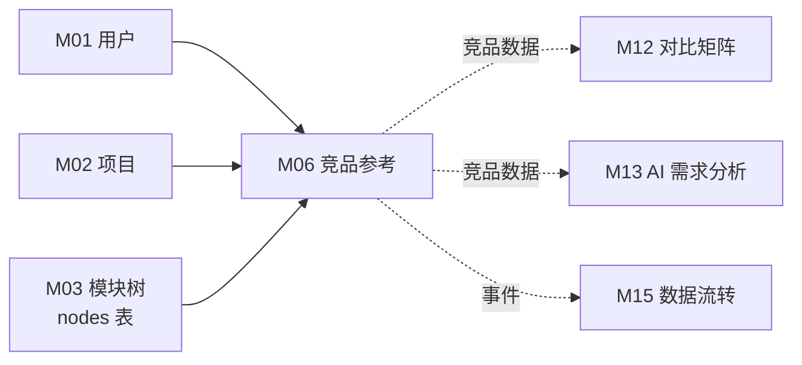
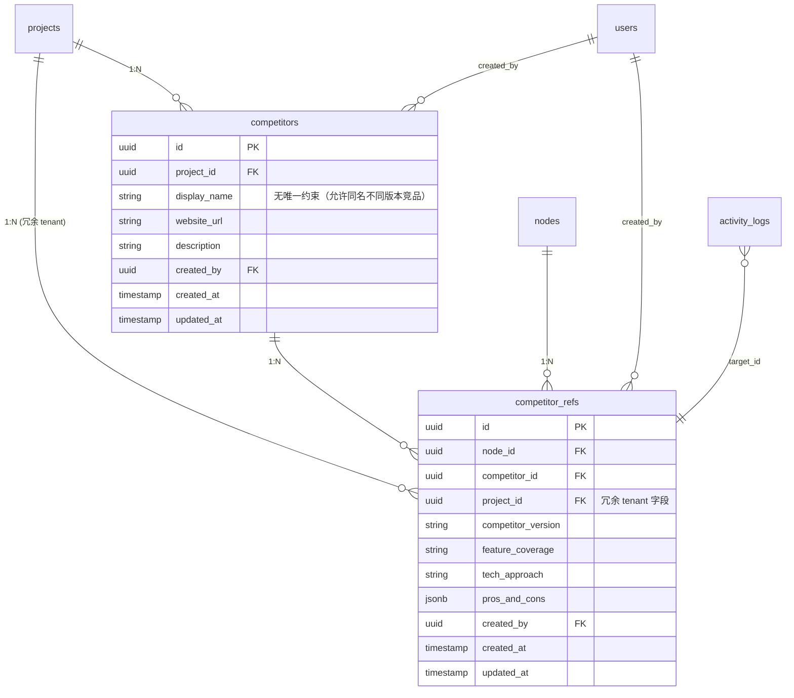

# M06 竞品参考 - 详细设计

**协作约定**：
- ✅ 已定稿节：直接采用（来自架构规约 + 4 维标注）
- 🔗 关联到 A/B 档规约均给链接

---

## 1. 业务说明 + 职责边界

### 业务背景（引自 PRD / US）

根据 PRD Q3"内置产品评价能力"，竞品参考是围绕功能模块的结构化竞品对标能力。

**核心用户故事**：
- **US-B1.4**：作为编辑者，我想为功能项添加竞品参考（竞品名称 / 版本 / 功能覆盖 / 技术方案 / 优劣势），这样竞品信息结构化
- **US-A3.3**（间接）：作为项目管理员，我想选择多个竞品生成对比矩阵——M06 提供竞品数据，M12 消费

**设计背景**：竞品是项目级全局实体（`competitors` 表），确保名称统一、跨功能项复用；功能项级的对标信息在 `competitor_refs` 表（两表设计沿用 Prism 验证过的数据模型，字段名已按 snake_case 规范重命名）。

### In scope（M06 负责）

- **竞品实体 CRUD**（项目级）：在项目维度创建 / 编辑 / 删除竞品全局条目（名称 / 网站 / 描述）
- **功能项竞品对标录入**：在某个功能项下关联竞品 + 填写对标内容（覆盖度 / 技术方案 / 优劣势 / 竞品版本号）
- **功能项竞品参考列表展示**：档案页内竞品参考卡片列表
- **竞品全局列表**：项目设置页展示所有已录入竞品（复用时从列表选择）
- **档案页内联新建竞品并关联对标**：用户无需离开档案页即可新建竞品并同时创建对标记录（CY 2026-04-21 ack）

### Out of scope（其他模块负责）

| 不做的事 | 归属模块 |
|---------|---------|
| 跨功能项竞品对比矩阵（横向对比多个功能项的竞品）| M12 |
| 需求分析中的竞品维度使用 | M13（读 M06 数据） |
| 行业动态关联到竞品 | M14 |

### 边界灰区（显式说明）

- **竞品实体归属**：`competitors` 是"项目级全局"，不是某个功能项私有；竞品管理入口在项目设置页。档案页内可直接创建新竞品并同时创建对标记录（B 入口，Service 层包事务）。

---

## 2. 依赖模块图



**前置依赖**：M01 → M02 → M03（M04 档案页是 M06 UI 入口，但数据层不依赖 M04）

**依赖契约**：
- M01：`current_user`（user_id）
- M02：`project_id`（tenant 根）
- M03：`nodes(node_id)` 含 project_id

---

## 3. 数据模型（SQLAlchemy + Alembic 要点）

### 决策：`competitors.project_id` + `competitor_refs.project_id` 均冗余（CY 2026-04-21 ack 批量统一冗余）

**理由**：DAO 强制 tenant 过滤策略一致性，无需 JOIN；批量删除项目时简单。
**一致性兜底**：service 层创建 competitor_ref 时强制 `ref.project_id = competitor.project_id`。

### SQLAlchemy 模型

```python
# api/models/competitor.py
from sqlalchemy.orm import Mapped, mapped_column, relationship
from sqlalchemy import ForeignKey, UniqueConstraint, Index, Text
from sqlalchemy.dialects.postgresql import UUID, JSONB
from datetime import datetime
from uuid import UUID as PyUUID, uuid4
from typing import Any
from .base import Base, TimestampMixin

class Competitor(Base, TimestampMixin):
    """项目级竞品全局实体（可被多个功能项引用）"""
    __tablename__ = "competitors"
    __table_args__ = (
        Index("ix_competitor_project", "project_id"),
        # intentionally no UNIQUE on display_name：允许有两个同名竞品（版本不同）
    )

    id: Mapped[PyUUID] = mapped_column(UUID(as_uuid=True), primary_key=True, default=uuid4)
    project_id: Mapped[PyUUID] = mapped_column(UUID(as_uuid=True), ForeignKey("projects.id", ondelete="CASCADE"), nullable=False)  # tenant 字段
    display_name: Mapped[str] = mapped_column(Text, nullable=False)            # 竞品名称（重命名自 Prism name）
    website_url: Mapped[str | None] = mapped_column(Text, nullable=True)       # 官网（重命名自 Prism website）
    description: Mapped[str | None] = mapped_column(Text, nullable=True)
    created_by: Mapped[PyUUID | None] = mapped_column(UUID(as_uuid=True), ForeignKey("users.id"), nullable=True)

    refs = relationship("CompetitorRef", back_populates="competitor", cascade="all, delete-orphan")


class CompetitorRef(Base, TimestampMixin):
    """功能项级竞品对标记录（重命名自 Prism competitor_references）"""
    __tablename__ = "competitor_refs"
    __table_args__ = (
        UniqueConstraint("node_id", "competitor_id", name="uq_competitor_ref_node_competitor"),
        Index("ix_competitor_ref_node_project", "node_id", "project_id"),
        Index("ix_competitor_ref_project", "project_id"),
        Index("ix_competitor_ref_competitor", "competitor_id"),
    )

    id: Mapped[PyUUID] = mapped_column(UUID(as_uuid=True), primary_key=True, default=uuid4)
    node_id: Mapped[PyUUID] = mapped_column(UUID(as_uuid=True), ForeignKey("nodes.id", ondelete="CASCADE"), nullable=False)
    competitor_id: Mapped[PyUUID] = mapped_column(UUID(as_uuid=True), ForeignKey("competitors.id", ondelete="CASCADE"), nullable=False)
    project_id: Mapped[PyUUID] = mapped_column(UUID(as_uuid=True), ForeignKey("projects.id", ondelete="CASCADE"), nullable=False)  # 冗余 tenant 字段
    competitor_version: Mapped[str | None] = mapped_column(Text, nullable=True)   # 竞品版本号（重命名自 Prism version，避免与系统 version 混淆）
    feature_coverage: Mapped[str | None] = mapped_column(Text, nullable=True)     # 功能覆盖度描述
    tech_approach: Mapped[str | None] = mapped_column(Text, nullable=True)        # 技术方案（重命名自 Prism technicalApproach）
    pros_and_cons: Mapped[dict[str, Any] | None] = mapped_column(JSONB, nullable=True)  # {"pros": [...], "cons": [...]}
    created_by: Mapped[PyUUID | None] = mapped_column(UUID(as_uuid=True), ForeignKey("users.id"), nullable=True)

    competitor = relationship("Competitor", back_populates="refs")
```

### ER 图



### Alembic 要点

- `competitors.display_name` **无**唯一约束（有意为之——同一项目可有两个同名竞品，版本不同）
- 唯一约束：`UNIQUE(node_id, competitor_id)` on competitor_refs（同一功能项不重复关联同一竞品）
- 索引：
  - `(node_id, project_id)` 主查询（按功能项找对标记录）
  - `(project_id)` 竞品全局列表查询 + tenant 过滤
  - `(competitor_id)` 反向查询（某竞品被哪些功能项关联）
- 级联删除：`competitors` 删除时，`competitor_refs` 通过 `cascade="all, delete-orphan"` + DB ON DELETE CASCADE 自动删除；**注意**：Service 层在执行 DELETE 前先查询 `ref_count`，写入 `delete competitor` 的 activity_log；refs 被 DB CASCADE 删除，refs 单条的 `delete competitor_ref` activity_log 由 Service 层**在 CASCADE 前显式批量记录**

---

## 4. 状态机

### 决策：M06 无状态字段（CY 2026-04-21 ack 统一最小集）

`competitors` 和 `competitor_refs` 均无 `status` 字段；竞品条目的生命周期是 active（存在）或 deleted（硬删除）。

显式声明（原则 4）：**M06 无状态实体**。无状态机，无状态枚举字段。

---

## 5. 多人架构 4 维必答

| 维度 | 答案 | 实现细节 |
|------|------|---------|
| **Tenant 隔离** | ✅ project_id | `competitors` 直接带 project_id；`competitor_refs` 冗余 project_id |
| **多表事务** | ✅ 创建竞品+引用 走多表事务（competitors + competitor_refs 同一事务包裹） | Service 层 `with db.begin():` 包：① insert competitors ② insert competitor_refs；任一失败回滚（适用于档案页内联新建场景）。纯 competitor CRUD 单表无事务。 |
| **异步处理** | ❌ N/A | 全同步，用户手动录入 |
| **并发控制** | ❌ N/A | 05-module-catalog 标注无并发；竞品录入不是高频协同编辑场景；DB 唯一约束 `UNIQUE(node_id, competitor_id)` 防并发重复关联 |

### 约束清单逐项检查

| 清单项 | M06 是否触发 | 实现 |
|-------|-------------|------|
| 1. activity_log | ✅ 触发（竞品创建/更新/删除 + 对标记录 CRUD）| 节 10 |
| 2. 乐观锁 version | ❌ 不触发（无并发场景）| N/A |
| 3. Queue payload tenant | ❌ 不触发（无 Queue）| N/A |
| 4. idempotency_key | ❌ 不触发（CY ack 无幂等需求）| 节 11 |
| 5. DAO tenant 过滤 | ✅ 触发 | 节 9 |

---

## 6. 分层职责表

| 层 | M06 涉及文件 | 该层职责 |
|----|------------|---------|
| **Page** | `web/src/app/projects/[pid]/settings/page.tsx`（竞品全局管理）<br>`web/src/app/projects/[pid]/nodes/[nid]/page.tsx`（档案页竞品卡片）| SSR 渲染竞品列表 / 对标卡片 |
| **Component** | `web/src/components/business/competitor-list.tsx`<br>`web/src/components/business/competitor-ref-card.tsx`<br>`web/src/components/business/competitor-ref-form.tsx` | 竞品列表 / 对标卡片 / 新建表单 |
| **Server Action** | `web/src/actions/competitor.ts` | session 校验 / 参数校验 / fetch FastAPI |
| **Router** | `api/routers/competitor_router.py` | 路由定义 / `Depends(check_project_access)` / Pydantic 校验 |
| **Service** | `api/services/competitor_service.py` | 业务规则（竞品属于本项目校验）/ tenant 校验 / 写 activity_log / 多表事务（新建竞品+对标） |
| **DAO** | `api/dao/competitor_dao.py` | SQL 构建 + 强制 tenant 过滤 |
| **Model** | `api/models/competitor.py` | SQLAlchemy 模型 |
| **Schema** | `api/schemas/competitor_schema.py` | Pydantic 请求/响应 |

---

## 7. API 契约

### Endpoints

#### 竞品全局实体（项目级）

| 方法 | 路径 | 用途 | 入参 | 出参 |
|------|------|------|------|------|
| GET | `/api/projects/{project_id}/competitors` | 拉取项目所有竞品 | — | `CompetitorListResponse` |
| POST | `/api/projects/{project_id}/competitors` | 创建竞品全局条目 | `CompetitorCreate` | `CompetitorResponse` |
| PUT | `/api/projects/{project_id}/competitors/{competitor_id}` | 更新竞品信息 | `CompetitorUpdate` | `CompetitorResponse` |
| DELETE | `/api/projects/{project_id}/competitors/{competitor_id}` | 删除竞品（级联删所有对标记录）| — | 204 |

#### 功能项竞品对标记录

| 方法 | 路径 | 用途 | 入参 | 出参 |
|------|------|------|------|------|
| GET | `/api/projects/{project_id}/nodes/{node_id}/competitor-refs` | 拉取功能项所有对标记录 | — | `CompetitorRefListResponse` |
| POST | `/api/projects/{project_id}/nodes/{node_id}/competitor-refs` | 创建对标记录（关联已有竞品）| `CompetitorRefCreate` | `CompetitorRefResponse` |
| PUT | `/api/projects/{project_id}/nodes/{node_id}/competitor-refs/{ref_id}` | 更新对标内容 | `CompetitorRefUpdate` | `CompetitorRefResponse` |
| DELETE | `/api/projects/{project_id}/nodes/{node_id}/competitor-refs/{ref_id}` | 删除对标记录 | — | 204 |

### Pydantic schema 草案

```python
# api/schemas/competitor_schema.py

class ProsAndCons(BaseModel):
    pros: list[str] = []
    cons: list[str] = []

class CompetitorCreate(BaseModel):
    display_name: str = Field(..., min_length=1, max_length=128)
    website_url: str | None = Field(None, max_length=512)
    description: str | None = None

class CompetitorUpdate(BaseModel):
    display_name: str | None = Field(None, min_length=1, max_length=128)
    website_url: str | None = None
    description: str | None = None

class CompetitorResponse(BaseModel):
    id: UUID
    project_id: UUID
    display_name: str
    website_url: str | None
    description: str | None
    created_by: UUID | None
    created_at: datetime
    updated_at: datetime

class CompetitorListResponse(BaseModel):
    items: list[CompetitorResponse]
    total: int

class CompetitorRefCreate(BaseModel):
    competitor_id: UUID                     # 必须是本项目内的竞品
    competitor_version: str | None = None
    feature_coverage: str | None = None
    tech_approach: str | None = None
    pros_and_cons: ProsAndCons | None = None

class CompetitorRefUpdate(BaseModel):
    competitor_version: str | None = None
    feature_coverage: str | None = None
    tech_approach: str | None = None
    pros_and_cons: ProsAndCons | None = None

class CompetitorRefResponse(BaseModel):
    id: UUID
    node_id: UUID
    competitor_id: UUID
    project_id: UUID
    display_name: str       # join 自 competitors.display_name
    competitor_version: str | None
    feature_coverage: str | None
    tech_approach: str | None
    pros_and_cons: ProsAndCons | None
    created_by: UUID | None
    created_at: datetime
    updated_at: datetime

class CompetitorRefListResponse(BaseModel):
    items: list[CompetitorRefResponse]
    total: int
```

---

## 8. 权限三层防御

| 层 | 检查 | 实现 |
|----|------|------|
| **Server Action** | session 是否有效 | `getServerSession()`；无则 401 |
| **Router** | 用户对 project 权限 | GET 允许 viewer；POST/PUT/DELETE 要求 editor；`Depends(check_project_access(project_id, role))` |
| **Service** | 竞品/对标记录是否属于该 project | `_check_competitor_belongs_to_project(competitor_id, project_id)`；不属于抛 `NotFoundError`（不暴露 forbidden 信息） |

**M06 无异步路径**，三层即覆盖。

---

## 9. DAO tenant 过滤策略

```python
# api/dao/competitor_dao.py

class CompetitorDAO:
    def list_by_project(self, db: Session, project_id: UUID) -> list[Competitor]:
        return (
            db.query(Competitor)
            .filter(Competitor.project_id == project_id)   # ← tenant 过滤
            .order_by(Competitor.display_name.asc())
            .all()
        )

    def list_refs_by_node(self, db: Session, node_id: UUID, project_id: UUID) -> list[CompetitorRef]:
        return (
            db.query(CompetitorRef)
            .filter(
                CompetitorRef.node_id == node_id,
                CompetitorRef.project_id == project_id,    # ← tenant 过滤
            )
            .all()
        )
```

### 豁免清单

无——M06 所有查询均在 project tenant 边界内。

---

## 10. activity_log 事件清单

### 决策：操作粒度 + metadata（CY 2026-04-21 ack 全模块统一）

**理由**：折中方案，metadata 留 hash/size 等扩展点供 M15/M13/M16 后续消费。

| action_type | target_type | target_id | summary | metadata |
|-------------|-------------|-----------|---------|----------|
| `create` | `competitor` | `<competitor_id>` | 新增竞品：{display_name} | `{project_id}` |
| `update` | `competitor` | `<competitor_id>` | 更新竞品：{display_name} | `{changed_fields}` |
| `delete` | `competitor` | `<competitor_id>` | 删除竞品：{display_name} | `{ref_count}` 关联对标记录数 |
| `create` | `competitor_ref` | `<ref_id>` | 创建对标：{node_name}×{competitor_name} | `{node_id, competitor_id}` |
| `update` | `competitor_ref` | `<ref_id>` | 更新对标：{node_name}×{competitor_name} | `{node_id, competitor_id, changed_fields}` |
| `delete` | `competitor_ref` | `<ref_id>` | 删除对标：{node_name}×{competitor_name} | `{node_id, competitor_id}` |

**级联删除时的 activity_log 写入**：Service 层在调用 `competitor_dao.delete(competitor_id)` 前，先查询所有关联 refs 并逐条写入 `delete competitor_ref` 日志，再删除竞品（DB CASCADE 自动清 refs）。

---

## 11. idempotency_key 适用操作

### 决策：本模块无 idempotency 需求（CY 2026-04-21 ack 全模块统一）

**理由**：CRUD 走乐观锁/DB 唯一约束已防；删除天然幂等。具体：
- 创建：竞品名称无唯一约束（允许同名竞品）；对标记录有 `UNIQUE(node_id, competitor_id)` 防重
- 删除：天然幂等（重复 DELETE 返回 204）

显式声明（清单 4）：**M06 无 idempotency_key 操作**。

---

## 12. Queue payload schema

**N/A**——M06 无异步处理，无 Queue 任务。

显式声明（清单 3）：**M06 不投递 Queue 任务**。

---

## 13. ErrorCode 新增清单

```python
# api/errors/codes.py 新增（模块 M06）

class ErrorCode(str, Enum):
    # 模块 M06
    COMPETITOR_NOT_FOUND = "COMPETITOR_NOT_FOUND"
    COMPETITOR_REF_NOT_FOUND = "COMPETITOR_REF_NOT_FOUND"
    COMPETITOR_REF_DUPLICATE = "COMPETITOR_REF_DUPLICATE"   # (node_id, competitor_id) 唯一约束
    COMPETITOR_CROSS_PROJECT = "COMPETITOR_CROSS_PROJECT"   # 引用了其他项目的竞品
```

```python
# api/errors/exceptions.py 新增

class CompetitorNotFoundError(NotFoundError):
    code = ErrorCode.COMPETITOR_NOT_FOUND
    message = "Competitor not found"

class CompetitorRefNotFoundError(NotFoundError):
    code = ErrorCode.COMPETITOR_REF_NOT_FOUND
    message = "Competitor reference not found"

class CompetitorRefDuplicateError(AppError):
    code = ErrorCode.COMPETITOR_REF_DUPLICATE
    http_status = 409
    message = "This competitor is already referenced for this node"

class CompetitorCrossProjectError(AppError):
    code = ErrorCode.COMPETITOR_CROSS_PROJECT
    http_status = 422
    message = "Cannot reference a competitor from another project"
```

---

## 14. 测试场景大纲

详见 [`tests.md`](./tests.md)

- **golden path**：创建竞品全局条目 / 创建对标记录 / 读取 / 更新 / 删除
- **边界**：竞品名为空 / 超长 / 引用不存在竞品 / 跨项目竞品引用 / 重复关联
- **并发**：无并发场景（05-catalog 标注❌）
- **tenant**：跨项目越权读竞品列表 / 越权写对标记录
- **权限**：viewer 写 / 未登录读
- **错误处理**：DB 唯一冲突 / 竞品不存在 / 跨项目竞品引用

---

## 15. 完成度判定 checklist

- [x] 节 1：职责边界 in/out scope 完整（引 US-B1.4 / US-A3.3）
- [x] 节 2：依赖图完整
- [x] 节 3：数据模型 ER 图（两表）+ Alembic 要点 + SQLAlchemy class + project_id 冗余（CY ack）
- [x] 节 4：无状态实体显式声明（CY ack）
- [x] 节 5：4 维必答 + 5 项清单逐项（多表事务 ✅ 已修正）
- [x] 节 6：分层文件路径明确（两个页面入口）
- [x] 节 7：所有 API endpoint（8 个）+ schema 完整
- [x] 节 8：权限三层（Service 层抛 NotFoundError，不暴露 forbidden）
- [x] 节 9：DAO tenant 过滤 + 豁免清单（无）
- [x] 节 10：activity_log 6 种事件 + 操作粒度+metadata（CY ack）+ 级联删写日志策略
- [x] 节 11：idempotency 无（CY ack）
- [x] 节 12：Queue 显式 N/A
- [x] 节 13：ErrorCode 4 个新增
- [x] 节 14：tests.md 完整
- [x] 节 15：本 checklist 全勾过
- [ ] **🔴 第一轮 reviewer audit（完整性）通过**
- [ ] **🔴 第二轮 reviewer audit（边界场景）通过**
- [ ] **🔴 第三轮 reviewer audit（演进 / 模板可复用性）通过**
- [ ] CY 全文复审通过 → status 转 accepted

> ✅ 三轮 reviewer audit 已完成 2026-04-21（见 audit-report-batch1.md），但发现 8 条问题需 fix + CY 裁决，转 accepted 前还需 CY 复审。

---

## CY 决策记录（2026-04-21 批量统一）

| # | 节 | 决策点 | 决定 |
|---|----|-------|------|
| Q1 | 3 | competitor_refs 是否冗余 project_id | **B 冗余**（统一规则） |
| Q2 | 11 | idempotency 范围 | **A 无幂等**（统一） |
| Q3 | 1 | 竞品创建入口 | **B 档案页可内联新建并关联**（用户体验更流畅） |
| Q4 | 5 | "新建竞品 + 同时创建对标"是否包一个事务 | **B Service 层包事务**（原子性，避免竞品创建成功但对标失败） |

---

## 关联参考

- 上游：`design/00-architecture/04-layer-architecture.md` / `05-module-catalog.md` / `06-design-principles.md`
- 工程规约：`design/01-engineering/01-engineering-spec.md`
- Prism 对照：`/root/cy/prism/web/src/db/schema.ts`（competitors + competitorReferences，字段已重命名）
- 业务源：`/root/cy/prism/docs/product/feature-list-and-user-stories.md`（US-B1.4 / US-A3.3）
