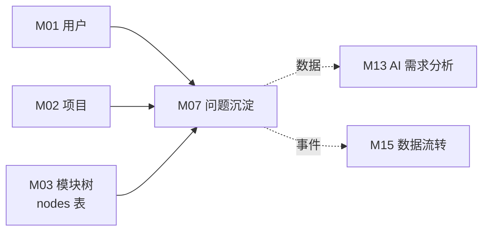
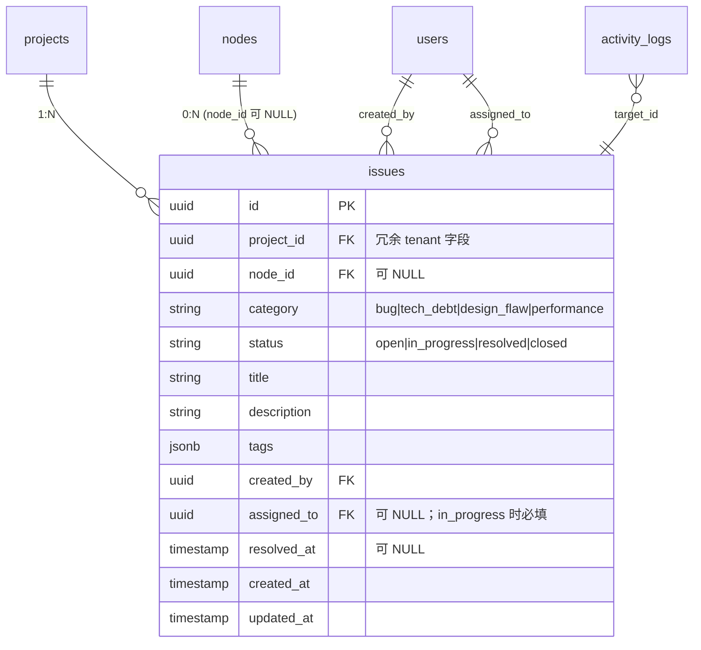
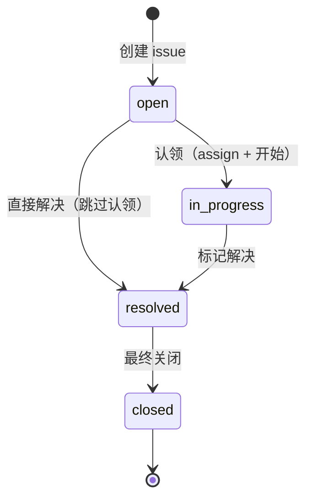

# M07 问题沉淀 - 详细设计

**协作约定**：
- ✅ 已定稿节：直接采用（来自架构规约 + 4 维标注）
- 🔗 关联到 A/B 档规约均给链接

---

## 1. 业务说明 + 职责边界

### 业务背景（引自 PRD / US）

根据 PRD Q3"内置测试沉淀能力——结构化沉淀测试文档"，问题沉淀负责将 bug / 技术债 / 设计缺陷归入功能模块。

**核心用户故事**：
- **US-B1.6**：作为编辑者，我想把 bug / 技术债 / 设计缺陷录入到对应功能项，这样问题不再散落

**设计背景**：issues 是独立实体，按 `category` 关联到对应维度（bug→测试分析 / tech_debt→工程经验 / design_flaw→设计决策 / performance→技术实现）；节点可软关联（`node_id` 允许 NULL，对应项目级问题）。该设计在 prism-0420 内部经 4 维评审确认。

### In scope（M07 负责）

- **问题记录 CRUD**：编辑者录入 / 查看 / 更新 / 删除 issue（含 category / description / tags / status）
- **按功能项聚合展示**：档案页内显示该节点的所有 issue 列表
- **按项目聚合展示**：项目级 issue 全量列表（含无 node 挂载的游离问题）
- **问题状态流转**：open → in_progress → resolved / closed（状态机见节 4）
- **标签管理**：issue 可打 tags（JSON 数组），支持按 tag 筛选

### Out of scope（其他模块负责）

| 不做的事 | 归属模块 |
|---------|---------|
| 需求分析中的问题维度使用 | M13（读 M07 数据） |
| 数据流转（操作日志展示）| M15（消费 activity_log） |
| 测试点生成 | M13 |
| issue 关联到外部 Jira / GitLab | 超出本期 scope（PRD 未提） |

### 边界灰区（显式说明）

- **node_id 可为 NULL**：支持游离问题（node_id 为 null，只挂在 project）——沿用 Prism 验证过的灵活设计，游离问题在项目层面是合法业务场景（CY 2026-04-21 ack）。
- **category 与维度的映射**：PRD 说 bug→测试分析维度，但 M07 本身不写维度记录——该映射是语义标注，供 M13 消费，不是 M07 的写操作。

---

## 2. 依赖模块图



**前置依赖**：M01 → M02 → M03（可选；node_id 非强依赖，游离 issue 不需要 node）

---

## 3. 数据模型（SQLAlchemy + Alembic 要点）

### 决策：`issues` 冗余 `project_id`（CY 2026-04-21 ack 批量统一冗余）

**理由**：DAO 强制 tenant 过滤策略一致性，直接 `WHERE project_id=?` 无需 JOIN nodes。
**一致性兜底**：service 层创建时强制 `issue.project_id = node.project_id`（若 node_id 非空）。

### SQLAlchemy 模型

```python
# api/models/issue.py
import enum
from sqlalchemy.orm import Mapped, mapped_column, relationship
from sqlalchemy import ForeignKey, CheckConstraint, Index, Text
from sqlalchemy.dialects.postgresql import UUID, JSONB
from datetime import datetime
from uuid import UUID as PyUUID, uuid4
from typing import Any
from .base import Base, TimestampMixin

class IssueStatus(str, enum.Enum):
    open = "open"
    in_progress = "in_progress"
    resolved = "resolved"
    closed = "closed"

class IssueCategory(str, enum.Enum):
    bug = "bug"
    tech_debt = "tech_debt"
    design_flaw = "design_flaw"
    performance = "performance"

class Issue(Base, TimestampMixin):
    __tablename__ = "issues"
    __table_args__ = (
        CheckConstraint(
            "status IN ('open', 'in_progress', 'resolved', 'closed')",
            name="ck_issue_status",
        ),
        CheckConstraint(
            "category IN ('bug', 'tech_debt', 'design_flaw', 'performance')",
            name="ck_issue_category",
        ),
        Index("ix_issue_project_status", "project_id", "status"),
        Index("ix_issue_node_project", "node_id", "project_id"),
        Index("ix_issue_project_category", "project_id", "category"),
        Index("ix_issue_created_by", "created_by"),
    )

    id: Mapped[PyUUID] = mapped_column(UUID(as_uuid=True), primary_key=True, default=uuid4)
    project_id: Mapped[PyUUID] = mapped_column(UUID(as_uuid=True), ForeignKey("projects.id", ondelete="CASCADE"), nullable=False)  # 冗余 tenant 字段
    node_id: Mapped[PyUUID | None] = mapped_column(UUID(as_uuid=True), ForeignKey("nodes.id", ondelete="SET NULL"), nullable=True)  # 允许游离问题
    category: Mapped[str] = mapped_column(Text, nullable=False)           # 使用 IssueCategory 枚举值
    status: Mapped[str] = mapped_column(Text, nullable=False, default="open")  # 使用 IssueStatus 枚举值
    title: Mapped[str] = mapped_column(Text, nullable=False)               # 问题标题（Prism 无此字段，补充；列表展示需要一句话摘要）
    description: Mapped[str] = mapped_column(Text, nullable=False)
    tags: Mapped[list[str] | None] = mapped_column(JSONB, nullable=True, default=list)
    created_by: Mapped[PyUUID | None] = mapped_column(UUID(as_uuid=True), ForeignKey("users.id"), nullable=True)
    assigned_to: Mapped[PyUUID | None] = mapped_column(UUID(as_uuid=True), ForeignKey("users.id"), nullable=True)  # 责任人；状态转 in_progress 时必填
    resolved_at: Mapped[datetime | None] = mapped_column(nullable=True)

    node = relationship("Node", back_populates="issues")
```

### ER 图



### Alembic 要点

- `node_id` 外键：`ON DELETE SET NULL`（节点删除后 issue 变游离，不级联删）
- 索引：
  - `(project_id, status)` 按项目+状态筛选
  - `(node_id, project_id)` 按功能项聚合
  - `(project_id, category)` 按分类筛选
  - `(created_by)` 按创建者查
- `status` CHECK 约束：`CHECK (status IN ('open', 'in_progress', 'resolved', 'closed'))`
- `category` CHECK 约束：`CHECK (category IN ('bug', 'tech_debt', 'design_flaw', 'performance'))`

---

## 4. 状态机

### 决策：保留 4 状态机（CY 2026-04-21 ack）

4 个状态：`open`（默认）/ `in_progress` / `resolved` / `closed`



### 允许的转换

| 当前状态 | 可转换到 | 触发操作 | 副作用 |
|---------|---------|---------|--------|
| `open` | `in_progress` | 认领（assign + 开始）| `assigned_to` 必须填写；activity_log `status_change` |
| `open` | `resolved` | 直接解决（跳过认领）| 写 `resolved_at`；activity_log `status_change` |
| `in_progress` | `resolved` | 标记解决 | 写 `resolved_at`；activity_log `status_change` |
| `resolved` | `closed` | 最终关闭 | activity_log `status_change` |

### 禁止的转换

| 禁止的转换 | 防护 |
|-----------|------|
| `open → closed`（必须经 in_progress 或 resolved，不能直接关闭）| Service 层抛 `InvalidTransitionError` |
| `closed → 任何状态`（关闭后不可重开；要重开必须新建 issue 引用旧的）| Service 层抛 `IssueClosedError` |

### `assigned_to` 字段

- 类型：`UUID FK to users`，`nullable=True`
- 状态变 `in_progress` 时**必填**（Service 层校验；无则抛 `IssueAssigneeRequiredError`）
- 其他状态可为 NULL

---

## 5. 多人架构 4 维必答

| 维度 | 答案 | 实现细节 |
|------|------|---------|
| **Tenant 隔离** | ✅ project_id | `issues` 直接带 project_id（冗余）；DAO 强制 `WHERE issues.project_id = ?` |
| **多表事务** | ✅ 必须（统一 M04 pilot 范式）| Service 层 `with db.begin():` 包裹：① UPDATE issues（CRUD 或状态转换）② 写 activity_log；任一失败回滚 |
| **异步处理** | ❌ N/A | 全同步，用户手动录入 |
| **并发控制** | ❌ N/A | 05-module-catalog 标注无并发；issue 是单一责任人顺序操作；状态转换防护见竞态分析表（无 DB 级唯一约束，仅 Service 层 SELECT FOR UPDATE） |

### 状态转换竞态分析（节 4 有状态时强制）

**[设计透明度声明]**：M07 issues 表 SQLAlchemy class 的 `__table_args__` **无 UniqueConstraint** 强制"单 issue 单 assignee"——这是状态层语义，不是 schema 层语义。下表"防护"列只描述 Service 层逻辑，不引用不存在的 DB 约束。

| 状态转换 | 是否存在竞态 | 防护（Service 层） |
|---------|-------------|------|
| open → in_progress | 极低概率竞态（双 user 同时认领同 issue，最终 assigned_to 取决于写入顺序） | Service 层 `SELECT ... FOR UPDATE` 锁定 issue 行 → 检查 status='open' → UPDATE status + assigned_to → COMMIT；并发请求被串行化 |
| open → resolved | ❌ 无（单 user 操作 + service 层 status 校验） | `SELECT FOR UPDATE` + status 校验 |
| in_progress → resolved | ❌ 无（assigned_to user 操作） | `SELECT FOR UPDATE` + status + assigned_to 一致性校验 |
| resolved → closed | ❌ 无（单 user 操作） | `SELECT FOR UPDATE` + status 校验 |
| open → closed（禁） | N/A | Service 层抛 `InvalidTransitionError`（状态校验） |
| closed → 任何（禁） | N/A | Service 层抛 `IssueClosedError`（状态校验） |

**接受的设计风险**（CY ack）：手动 issue 录入并发概率极低，不引入 DB UNIQUE 约束（避免 schema 层背业务语义债务）。所有状态转换走 Service 层 `SELECT FOR UPDATE` 行锁串行化即可。

### 约束清单逐项检查

| 清单项 | M07 是否触发 | 实现 |
|-------|-------------|------|
| 1. activity_log | ✅ 触发（issue CRUD + 状态变更）| 节 10 |
| 2. 乐观锁 version | ❌ 不触发（无并发场景）| N/A |
| 3. Queue payload tenant | ❌ 不触发（无 Queue）| N/A |
| 4. idempotency_key | ❌ 不触发（CY ack 无幂等需求）| 节 11 |
| 5. DAO tenant 过滤 | ✅ 触发 | 节 9 |

---

## 6. 分层职责表

| 层 | M07 涉及文件 | 该层职责 |
|----|------------|---------|
| **Page** | `web/src/app/projects/[pid]/nodes/[nid]/page.tsx`（档案页 issue 区块）<br>`web/src/app/projects/[pid]/issues/page.tsx`（项目级 issue 列表）| SSR 渲染 issue 列表 |
| **Component** | `web/src/components/business/issue-list.tsx`<br>`web/src/components/business/issue-card.tsx`<br>`web/src/components/business/issue-form.tsx`<br>`web/src/components/business/issue-status-badge.tsx` | issue 列表 / 卡片 / 表单 / 状态标签 |
| **Server Action** | `web/src/actions/issue.ts` | session 校验 / 参数校验 / fetch FastAPI |
| **Router** | `api/routers/issue_router.py` | 路由定义 / `Depends(check_project_access)` / Pydantic 校验 |
| **Service** | `api/services/issue_service.py` | 业务规则（状态机转换校验）/ tenant 校验 / 写 activity_log<br>**M18 baseline-patch（2026-04-26）新增**：① `get_for_embedding(db, issue_id, project_id) -> str \| None` 走 ADR-003 规则 1，拼接 `title + description`（M07 无 url，CY 决策 4 不影响）；② create/update commit 后尾调 `embedding_service.enqueue(target_type="issue", ..., enqueued_by="incremental")`；③ delete commit 后异步 enqueue_delete + SilentFailure + cleanup cron 兜底（CY 决策 5） |
| **DAO** | `api/dao/issue_dao.py` | SQL 构建 + 强制 tenant 过滤 |
| **Model** | `api/models/issue.py` | SQLAlchemy 模型 + Enum 定义 |
| **Schema** | `api/schemas/issue_schema.py` | Pydantic 请求/响应 |

**对外契约（R-X3，batch3 基线补丁补充；M13 pilot 2026-04-25 补登记）**：
- `IssueService.list_by_project(db: Session, project_id: UUID, *, node_id: UUID | None = None, category: str | None = None, status: str | None = None, tag: str | None = None, limit: int = 50) -> list[Issue]`——**M13 pilot 登记跨模块调用契约**。现有 DAO 已支持 `node_id` 过滤（见 §9 L372），Service 层 pass-through；M13 需求分析上下文聚合 `list_by_project(db, pid, node_id=N, limit=20)` 只取该 node 关联 issues 做 AI prompt context；本方法不写 activity_log、不开事务。**无代码改动，仅补登记**。

- `batch_create_in_transaction(db: Session, issues: list[IssueCreateData], project_id: UUID) -> list[Issue]`——M11/M17 orchestrator 调用；接受外部 db session，不调 `self.db.begin()` 另开事务；每条 issue 写独立 `create` activity_log 事件（R10-1）
- `orphan_by_node_id(db: Session, node_id: UUID, project_id: UUID) -> int`——M03 节点删除时调用；将该 node 下所有 issues 的 node_id 设为 NULL（游离化，与 FK `ON DELETE SET NULL` 语义一致——**issue 不被删除只变游离**）；接受外部 db session；每条受影响 issue 写独立 `orphan` activity_log 事件（R10-1）；返回受影响记录数
  > **命名说明**（batch3 基线补丁决策 4）：不沿用 M04/M06 的 `delete_by_node_id` 统一命名，改用 `orphan_by_node_id` 以对齐真实行为（SET NULL 而非 DELETE），避免调用方误以为 issue 被真删而遗漏后续处理

---

## 7. API 契约

### Endpoints

| 方法 | 路径 | 用途 | 入参 | 出参 |
|------|------|------|------|------|
| GET | `/api/projects/{project_id}/issues` | 拉取项目全部 issue（支持 category / status / node_id 过滤）| QueryParams | `IssueListResponse` |
| GET | `/api/projects/{project_id}/nodes/{node_id}/issues` | 拉取功能项下 issue | QueryParams | `IssueListResponse` |
| GET | `/api/projects/{project_id}/issues/{issue_id}` | 拉取单 issue 详情 | — | `IssueResponse` |
| POST | `/api/projects/{project_id}/issues` | 创建 issue | `IssueCreate` | `IssueResponse` |
| PUT | `/api/projects/{project_id}/issues/{issue_id}` | 更新 issue 内容（非状态）| `IssueUpdate` | `IssueResponse` |
| POST | `/api/projects/{project_id}/issues/{issue_id}/transition` | 状态流转（open→in_progress 等）| `IssueTransition` | `IssueResponse` |
| DELETE | `/api/projects/{project_id}/issues/{issue_id}` | 删除 issue | — | 204 |

### Pydantic schema 草案

```python
# api/schemas/issue_schema.py

class IssueCreate(BaseModel):
    node_id: UUID | None = None              # 可不关联节点（游离问题）
    category: Literal["bug", "tech_debt", "design_flaw", "performance"]
    title: str = Field(..., min_length=1, max_length=256)
    description: str = Field(..., min_length=1)
    tags: list[str] = []
    assigned_to: UUID | None = None

class IssueUpdate(BaseModel):
    title: str | None = Field(None, max_length=256)
    description: str | None = None
    tags: list[str] | None = None
    node_id: UUID | None = None              # 允许重新关联节点
    assigned_to: UUID | None = None

class IssueTransition(BaseModel):
    target_status: Literal["open", "in_progress", "resolved", "closed"]
    assigned_to: UUID | None = None          # open→in_progress 时必填
    note: str | None = None                  # 状态流转说明（可选）

class IssueResponse(BaseModel):
    id: UUID
    project_id: UUID
    node_id: UUID | None
    node_name: str | None                    # join 展示
    category: str
    status: str
    title: str
    description: str
    tags: list[str]
    created_by: UUID | None
    created_by_name: str | None
    assigned_to: UUID | None
    assigned_to_name: str | None
    resolved_at: datetime | None
    created_at: datetime
    updated_at: datetime

class IssueListResponse(BaseModel):
    items: list[IssueResponse]
    total: int

class IssueListQueryParams(BaseModel):
    """GET 查询参数"""
    category: str | None = None
    status: str | None = None
    node_id: UUID | None = None
    tag: str | None = None                   # JSONB 数组包含查询：tags @> [tag]
    page: int = 1
    page_size: int = 20
```

**tag 查询实现**：DAO 层用 `Issue.tags.contains([tag])` 映射为 PG `@>` JSONB 数组包含操作。

---

## 8. 权限三层防御

| 层 | 检查 | 实现 |
|----|------|------|
| **Server Action** | session 是否有效 | `getServerSession()`；无则 401 |
| **Router** | 用户对 project 权限 | GET 允许 viewer；POST/PUT/DELETE + transition 要求 editor；`Depends(check_project_access(project_id, role))` |
| **Service** | issue 是否属于该 project + 状态转换合法性 | `_check_issue_belongs_to_project(issue_id, project_id)`；状态机非法转换抛 `IssueTransitionInvalidError` / `IssueClosedError` |

**M07 无异步路径**，三层即覆盖。

---

## 9. DAO tenant 过滤策略

```python
# api/dao/issue_dao.py

class IssueDAO:
    def list_by_project(
        self, db: Session, project_id: UUID,
        category: str | None = None,
        status: str | None = None,
        node_id: UUID | None = None,
        tag: str | None = None,
    ) -> list[Issue]:
        q = db.query(Issue).filter(Issue.project_id == project_id)  # ← tenant 过滤
        if category:
            q = q.filter(Issue.category == category)
        if status:
            q = q.filter(Issue.status == status)
        if node_id:
            q = q.filter(Issue.node_id == node_id)
        if tag:
            q = q.filter(Issue.tags.contains([tag]))  # ← JSONB @> 包含查询
        return q.order_by(Issue.created_at.desc()).all()

    def get_one(self, db: Session, issue_id: UUID, project_id: UUID) -> Issue | None:
        return (
            db.query(Issue)
            .filter(
                Issue.id == issue_id,
                Issue.project_id == project_id,  # ← tenant 过滤
            )
            .first()
        )
```

### 豁免清单

无——M07 所有查询均在 project tenant 边界内。

---

## 10. activity_log 事件清单

### 决策：操作粒度 + metadata（CY 2026-04-21 ack 全模块统一）

**理由**：折中方案，metadata 留 hash/size 等扩展点供 M15/M13/M16 后续消费。

| action_type | target_type | target_id | summary | metadata |
|-------------|-------------|-----------|---------|----------|
| `create` | `issue` | `<issue_id>` | 创建问题：{title} | `{node_id, category, status}` |
| `update` | `issue` | `<issue_id>` | 更新问题：{title} | `{changed_fields}` |
| `status_change` | `issue` | `<issue_id>` | 状态变更：{old_status}→{new_status} | `{node_id, category, note, assigned_to}` |
| `delete` | `issue` | `<issue_id>` | 删除问题：{title} | `{node_id, category, final_status}` |

**R10-1 批量操作补充（batch3 基线补丁）**：`batch_create_in_transaction` 调用时每条 issue 写独立 `create` 事件；`orphan_by_node_id` 调用时每条受影响 issue 写独立 `orphan` 事件（action_type=`orphan`, target_type=`issue`, target_id=issue_id, metadata 含 `{old_node_id, reason: "cascade_from_node_delete"}`）。

**实现位置**：`api/services/issue_service.py` 每个操作方法内调 `self.activity.log(...)`。

---

## 11. idempotency_key 适用操作

### 决策：本模块无 idempotency 需求（CY 2026-04-21 ack 全模块统一）

**理由**：CRUD 走乐观锁/DB 唯一约束已防；删除天然幂等。具体：
- issue 无唯一约束，重复创建在业务上是合法的（可以记两条同类 bug）
- 状态机重复触发由 Service 层校验当前状态兜底
- 删除：天然幂等（重复 DELETE 返回 204）

显式声明（清单 4）：**M07 无 idempotency_key 操作**。

---

## 12. Queue payload schema

**N/A**——M07 无异步处理，无 Queue 任务。

显式声明（清单 3）：**M07 不投递 Queue 任务**。

---

## 13. ErrorCode 新增清单

```python
# api/errors/codes.py 新增（模块 M07）

class ErrorCode(str, Enum):
    # 模块 M07
    ISSUE_NOT_FOUND = "ISSUE_NOT_FOUND"
    ISSUE_TRANSITION_INVALID = "ISSUE_TRANSITION_INVALID"   # 状态机非法转换（如 open→closed）
    ISSUE_CLOSED_ERROR = "ISSUE_CLOSED_ERROR"               # closed 状态不可重开
    ISSUE_ASSIGNEE_REQUIRED = "ISSUE_ASSIGNEE_REQUIRED"     # in_progress 时 assigned_to 必填
    ISSUE_CATEGORY_INVALID = "ISSUE_CATEGORY_INVALID"       # category 非枚举值
    ISSUE_NODE_CROSS_PROJECT = "ISSUE_NODE_CROSS_PROJECT"   # node_id 属于其他项目
```

```python
# api/errors/exceptions.py 新增

class IssueNotFoundError(NotFoundError):
    code = ErrorCode.ISSUE_NOT_FOUND
    message = "Issue not found"

class IssueTransitionInvalidError(AppError):
    code = ErrorCode.ISSUE_TRANSITION_INVALID
    http_status = 422
    message = "Invalid status transition"

class IssueClosedError(AppError):
    code = ErrorCode.ISSUE_CLOSED_ERROR
    http_status = 422
    message = "Issue is closed and cannot be reopened; create a new issue instead"

class IssueAssigneeRequiredError(AppError):
    code = ErrorCode.ISSUE_ASSIGNEE_REQUIRED
    http_status = 422
    message = "assigned_to is required when transitioning to in_progress"

class IssueCategoryInvalidError(ValidationError):
    code = ErrorCode.ISSUE_CATEGORY_INVALID
    http_status = 422
    message = "Invalid issue category"

class IssueNodeCrossProjectError(AppError):
    code = ErrorCode.ISSUE_NODE_CROSS_PROJECT
    http_status = 422
    message = "The specified node does not belong to this project"
```

---

## 14. 测试场景大纲

详见 [`tests.md`](./tests.md)

- **golden path**：创建 issue / 读取列表 / 更新内容 / 状态流转 / 删除
- **边界**：空 title / 非法 category / 非法状态转换 / node_id 跨项目
- **并发**：无并发场景（05-catalog 标注❌）
- **tenant**：跨项目越权读 / 越权写 / DAO tenant 过滤
- **权限**：viewer 写 / 未登录读 / viewer 触发状态流转
- **错误处理**：非法状态转换 / issue 不存在 / 跨项目 node

---

## 15. 完成度判定 checklist

- [x] 节 1：职责边界 in/out scope 完整（引 US-B1.6）
- [x] 节 2：依赖图完整
- [x] 节 3：数据模型 ER 图 + Alembic 要点 + SQLAlchemy class + project_id 冗余（CY ack）
- [x] 节 4：状态机完整（4 状态 + 允许/禁止转换表 + assigned_to 字段）
- [x] 节 5：4 维必答 + 5 项清单逐项 + 状态转换竞态分析表
- [x] 节 6：分层文件路径明确（两个页面入口）
- [x] 节 7：7 个 API endpoint + schema 完整（含 tag 查询实现说明）
- [x] 节 8：权限三层（含状态机校验位置）
- [x] 节 9：DAO tenant 过滤 + 豁免清单（无）+ tag JSONB 查询示例
- [x] 节 10：activity_log 4 种事件 + 操作粒度+metadata（CY ack）
- [x] 节 11：idempotency 无（CY ack）
- [x] 节 12：Queue 显式 N/A
- [x] 节 13：ErrorCode 6 个新增
- [x] 节 14：tests.md 完整
- [x] 节 15：本 checklist 全勾过
- [ ] **🔴 第一轮 reviewer audit（完整性）通过**
- [ ] **🔴 第二轮 reviewer audit（边界场景）通过**
- [ ] **🔴 第三轮 reviewer audit（演进 / 模板可复用性）通过**
- [ ] CY 全文复审通过 → status 转 accepted

> ✅ 三轮 reviewer audit 已完成 2026-04-21（见 audit-report-batch1.md），但发现 9 条问题需 fix + CY 裁决，转 accepted 前还需 CY 复审。

---

## CY 决策记录（2026-04-21 批量统一）

| # | 节 | 决策点 | 决定 |
|---|----|-------|------|
| Q1 | 1/3 | node_id 是否允许 NULL（游离问题）| **A 允许**（沿用 Prism 验证过的设计） |
| Q2 | 3 | 是否新增 title 字段（Prism 无）| **A 加**（列表展示需要一句话摘要） |
| Q3 | 4 | 是否引入 status 字段 + 状态机 | **A 引入**（4 状态：open/in_progress/resolved/closed） |
| Q4 | 3 | 是否新增 assigned_to 字段 | **A 加**（in_progress 时必填，单 assignee 设计） |
| Q5 | 11 | idempotency 范围 | **A 无幂等**（统一） |

---

## 关联参考

- 上游：`design/00-architecture/04-layer-architecture.md` / `05-module-catalog.md` / `06-design-principles.md`
- 工程规约：`design/01-engineering/01-engineering-spec.md`
- Prism 对照：`/root/cy/prism/web/src/db/schema.ts`（issues，字段重新定义）
- 业务源：`/root/cy/prism/docs/product/feature-list-and-user-stories.md`（US-B1.6）
