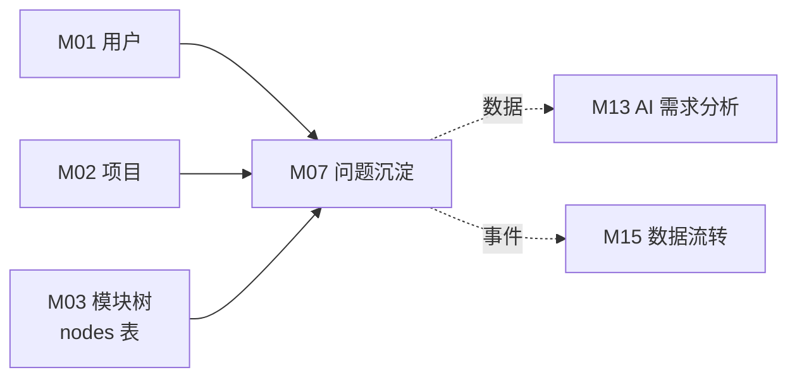
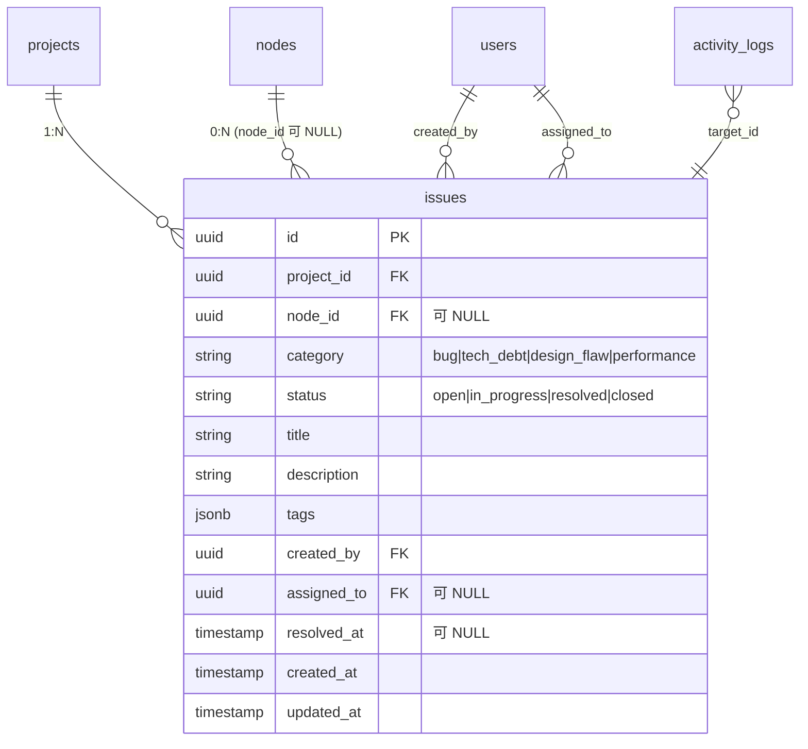
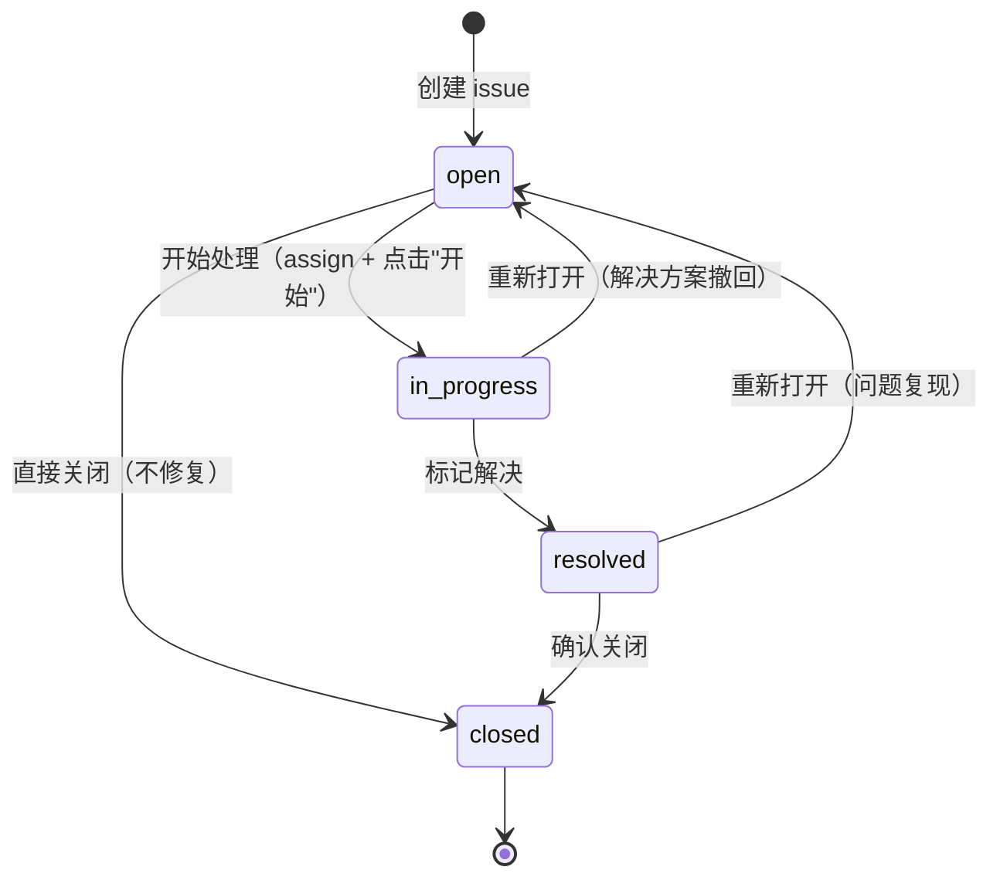

# M07 问题沉淀 - 详细设计

**协作约定**：
- ✅ 已定稿节：直接采用（来自架构规约 + 4 维标注）
- ⚠️ **待 CY 裁决**：AI 推断，给候选 + 我的倾向 + 你裁决
- 🔗 关联到 A/B 档规约均给链接

---

## 1. 业务说明 + 职责边界

### 业务背景（引自 PRD / US）

根据 PRD Q3"内置测试沉淀能力——结构化沉淀测试文档"，问题沉淀负责将 bug / 技术债 / 设计缺陷归入功能模块。

**核心用户故事**：
- **US-B1.6**：作为编辑者，我想把 bug / 技术债 / 设计缺陷录入到对应功能项，这样问题不再散落

**设计背景（Prism ADR-012）**：issues 是独立实体，按 `category` 关联到对应维度（bug→测试分析 / tech_debt→工程经验 / design_flaw→设计决策 / performance→技术实现）；节点可软关联（`node_id` 允许 NULL，对应项目级问题）。

### In scope（M07 负责）

- **问题记录 CRUD**：编辑者录入 / 查看 / 更新 / 删除 issue（含 category / description / tags / status）
- **按功能项聚合展示**：档案页内显示该节点的所有 issue 列表
- **按项目聚合展示**：项目级 issue 全量列表（含无 node 挂载的游离问题）
- **问题状态流转**：open → in_progress → resolved / closed（状态机见节 4）
- **标签管理**：issue 可打 tags（JSON 数组），支持按 tag 筛选

### Out of scope（其他模块负责）

| 不做的事 | 归属模块 |
|---------|---------|
| 需求分析中的问题维度使用 | M13（读 M07 数据） |
| 数据流转（操作日志展示）| M15（消费 activity_log） |
| 测试点生成 | M13 |
| issue 关联到外部 Jira / GitLab | 超出本期 scope（PRD 未提） |

### 边界灰区（显式说明）

- **node_id 可为 NULL**：Prism 支持游离问题（node_id 为 null，只挂在 project）。prism-0420 是否保留此设计？⚠️ 待 CY 裁决 Q1。
- **category 与维度的映射**：PRD / ADR-012 说 bug→测试分析维度，但 M07 本身不写维度记录——该映射是语义标注，供 M13 消费，不是 M07 的写操作。

---

## 2. 依赖模块图



**前置依赖**：M01 → M02 → M03（可选；node_id 非强依赖，游离 issue 不需要 node）

---

## 3. 数据模型（SQLAlchemy + Alembic 要点）

### SQLAlchemy 模型

```python
# api/models/issue.py

class IssueStatus(str, enum.Enum):
    open = "open"
    in_progress = "in_progress"
    resolved = "resolved"
    closed = "closed"

class IssueCategory(str, enum.Enum):
    bug = "bug"
    tech_debt = "tech_debt"
    design_flaw = "design_flaw"
    performance = "performance"

class Issue(Base):
    __tablename__ = "issues"

    id: uuid.UUID = Column(UUID(as_uuid=True), primary_key=True, default=uuid.uuid4)
    project_id: uuid.UUID = Column(UUID(as_uuid=True), ForeignKey("projects.id", ondelete="CASCADE"), nullable=False)
    node_id: uuid.UUID = Column(UUID(as_uuid=True), ForeignKey("nodes.id", ondelete="SET NULL"), nullable=True)  # 允许游离问题
    category: str = Column(Text, nullable=False)           # 使用 IssueCategory 枚举值
    status: str = Column(Text, nullable=False, default="open")  # 使用 IssueStatus 枚举值
    title: str = Column(Text, nullable=False)               # 问题标题（Prism 无此字段，补充）
    description: str = Column(Text, nullable=False)
    tags: list = Column(JSONB, nullable=True, default=[])
    created_by: uuid.UUID = Column(UUID(as_uuid=True), ForeignKey("users.id"), nullable=True)
    assigned_to: uuid.UUID = Column(UUID(as_uuid=True), ForeignKey("users.id"), nullable=True)  # 责任人
    resolved_at: datetime = Column(DateTime(timezone=True), nullable=True)
    created_at: datetime = Column(DateTime(timezone=True), nullable=False, default=func.now())
    updated_at: datetime = Column(DateTime(timezone=True), nullable=False, default=func.now(), onupdate=func.now())
```

> ⚠️ **AI 推断，CY 复审必改**：
> - Prism 原 `issues` 表无 `title` 字段，prism-0420 补充（一句话摘要，方便列表展示）——CY 需确认 Q2
> - `status` 字段是 prism-0420 新增（Prism 原无），支持问题状态流转——CY 需确认 Q3
> - `assigned_to` 字段是 prism-0420 新增（Prism 原无）——CY 需确认是否保留 Q4
> - `resolved_at` 在 status 转 resolved 时由 Service 层写入

### ⚠️ 待 CY 裁决 Q1：node_id 是否允许 NULL

| 候选 | 说明 |
|------|------|
| **A: 允许 NULL（推荐，沿用 Prism）** | 游离问题挂在项目级，灵活；但列表查询要处理 null 展示 |
| **B: 强制非 NULL** | 每个 issue 必须关联功能项；更结构化，但录入摩擦增加 |

**我倾向 A**——沿用 Prism ADR-012 设计；游离问题在项目层面是合法业务场景。

### ER 图



### Alembic 要点

- `node_id` 外键：`ON DELETE SET NULL`（节点删除后 issue 变游离，不级联删）
- 索引：
  - `(project_id, status)` 按项目+状态筛选
  - `(node_id, project_id)` 按功能项聚合
  - `(project_id, category)` 按分类筛选
  - `(created_by)` 按创建者查
- `status` CHECK 约束：`CHECK (status IN ('open', 'in_progress', 'resolved', 'closed'))`
- `category` CHECK 约束：`CHECK (category IN ('bug', 'tech_debt', 'design_flaw', 'performance'))`

---

## 4. 状态机

### issue.status 状态机



**合法转换表**：

| 当前状态 | 可转换到 | 触发操作 | 副作用 |
|---------|---------|---------|--------|
| `open` | `in_progress` | 指派 + 开始 | activity_log `status_change` |
| `open` | `closed` | 直接关闭 | activity_log `status_change` |
| `in_progress` | `resolved` | 标记解决 | 写 `resolved_at` + activity_log |
| `in_progress` | `open` | 重新打开 | 清空 `assigned_to`（可选）|
| `resolved` | `closed` | 确认关闭 | activity_log |
| `resolved` | `open` | 复现重开 | 清空 `resolved_at` + activity_log |

**非法转换**（Service 层拦截）：
- `closed → open/in_progress/resolved`：关闭后不可重开（需重新创建 issue）
- `open → resolved`：必须先经过 in_progress（确保有处理记录）

> ⚠️ **AI 推断，CY 复审必改**：状态机设计基于通用 bug 追踪惯例，Prism 原无 status 字段，需 CY 确认是否引入（Q3）。

---

## 5. 多人架构 4 维必答

| 维度 | 答案 | 实现细节 |
|------|------|---------|
| **Tenant 隔离** | ✅ project_id | `issues` 直接带 project_id；DAO 强制 `WHERE issues.project_id = ?` |
| **多表事务** | ❌ 不需要 | issue CRUD 只涉及 issues 单表；activity_log 写入在同 Service 方法内（无跨表原子写需求）|
| **异步处理** | ❌ N/A | 全同步，用户手动录入 |
| **并发控制** | ❌ N/A | 05-module-catalog 标注无并发；07-capability-matrix 标注"问题状态"🟡 有状态机但无并发锁需求 |

> ⚠️ **AI 推断，CY 复审必改**：并发标注参考 05-module-catalog（并发=❌）。若引入 assigned_to 多人协作场景，是否需要乐观锁——目前判断不需要（issue 是单一责任人顺序操作）。

### 约束清单逐项检查

| 清单项 | M07 是否触发 | 实现 |
|-------|-------------|------|
| 1. activity_log | ✅ 触发（issue CRUD + 状态变更）| 节 10 |
| 2. 乐观锁 version | ❌ 不触发（无并发场景）| N/A |
| 3. Queue payload tenant | ❌ 不触发（无 Queue）| N/A |
| 4. idempotency_key | ⚠️ 待裁决 | 节 11 |
| 5. DAO tenant 过滤 | ✅ 触发 | 节 9 |

---

## 6. 分层职责表

| 层 | M07 涉及文件 | 该层职责 |
|----|------------|---------|
| **Page** | `web/src/app/projects/[pid]/nodes/[nid]/page.tsx`（档案页 issue 区块）<br>`web/src/app/projects/[pid]/issues/page.tsx`（项目级 issue 列表）| SSR 渲染 issue 列表 |
| **Component** | `web/src/components/business/issue-list.tsx`<br>`web/src/components/business/issue-card.tsx`<br>`web/src/components/business/issue-form.tsx`<br>`web/src/components/business/issue-status-badge.tsx` | issue 列表 / 卡片 / 表单 / 状态标签 |
| **Server Action** | `web/src/actions/issue.ts` | session 校验 / 参数校验 / fetch FastAPI |
| **Router** | `api/routers/issue_router.py` | 路由定义 / `Depends(check_project_access)` / Pydantic 校验 |
| **Service** | `api/services/issue_service.py` | 业务规则（状态机转换校验）/ tenant 校验 / 写 activity_log |
| **DAO** | `api/dao/issue_dao.py` | SQL 构建 + 强制 tenant 过滤 |
| **Model** | `api/models/issue.py` | SQLAlchemy 模型 + Enum 定义 |
| **Schema** | `api/schemas/issue_schema.py` | Pydantic 请求/响应 |

---

## 7. API 契约

### Endpoints

| 方法 | 路径 | 用途 | 入参 | 出参 |
|------|------|------|------|------|
| GET | `/api/projects/{project_id}/issues` | 拉取项目全部 issue（支持 category / status / node_id 过滤）| QueryParams | `IssueListResponse` |
| GET | `/api/projects/{project_id}/nodes/{node_id}/issues` | 拉取功能项下 issue | QueryParams | `IssueListResponse` |
| GET | `/api/projects/{project_id}/issues/{issue_id}` | 拉取单 issue 详情 | — | `IssueResponse` |
| POST | `/api/projects/{project_id}/issues` | 创建 issue | `IssueCreate` | `IssueResponse` |
| PUT | `/api/projects/{project_id}/issues/{issue_id}` | 更新 issue 内容（非状态）| `IssueUpdate` | `IssueResponse` |
| POST | `/api/projects/{project_id}/issues/{issue_id}/transition` | 状态流转（open→in_progress 等）| `IssueTransition` | `IssueResponse` |
| DELETE | `/api/projects/{project_id}/issues/{issue_id}` | 删除 issue | — | 204 |

### Pydantic schema 草案

```python
# api/schemas/issue_schema.py

class IssueCreate(BaseModel):
    node_id: UUID | None = None              # 可不关联节点
    category: Literal["bug", "tech_debt", "design_flaw", "performance"]
    title: str = Field(..., min_length=1, max_length=256)
    description: str = Field(..., min_length=1)
    tags: list[str] = []
    assigned_to: UUID | None = None

class IssueUpdate(BaseModel):
    title: str | None = Field(None, max_length=256)
    description: str | None = None
    tags: list[str] | None = None
    node_id: UUID | None = None              # 允许重新关联节点
    assigned_to: UUID | None = None

class IssueTransition(BaseModel):
    target_status: Literal["open", "in_progress", "resolved", "closed"]
    note: str | None = None                  # 状态流转说明（可选）

class IssueResponse(BaseModel):
    id: UUID
    project_id: UUID
    node_id: UUID | None
    node_name: str | None                    # join 展示
    category: str
    status: str
    title: str
    description: str
    tags: list[str]
    created_by: UUID | None
    created_by_name: str | None
    assigned_to: UUID | None
    assigned_to_name: str | None
    resolved_at: datetime | None
    created_at: datetime
    updated_at: datetime

class IssueListResponse(BaseModel):
    items: list[IssueResponse]
    total: int

class IssueListQueryParams(BaseModel):
    """GET 查询参数"""
    category: str | None = None
    status: str | None = None
    node_id: UUID | None = None
    tag: str | None = None
    page: int = 1
    page_size: int = 20
```

⚠️ **AI 推断，CY 复审必改**：
- `node_id` 在 `IssueUpdate` 中是否允许修改（换挂节点）？候选 A: 允许；候选 B: 不允许（创建后固定）。我倾向 A。

---

## 8. 权限三层防御

| 层 | 检查 | 实现 |
|----|------|------|
| **Server Action** | session 是否有效 | `getServerSession()`；无则 401 |
| **Router** | 用户对 project 权限 | GET 允许 viewer；POST/PUT/DELETE + transition 要求 editor；`Depends(check_project_access(project_id, role))` |
| **Service** | issue 是否属于该 project + 状态转换合法性 | `_check_issue_belongs_to_project(issue_id, project_id)`；状态机非法转换抛 `IssueTransitionInvalidError` |

**M07 无异步路径**，三层即覆盖。

---

## 9. DAO tenant 过滤策略

```python
# api/dao/issue_dao.py

class IssueDAO:
    def list_by_project(
        self, db: Session, project_id: UUID,
        category: str | None = None,
        status: str | None = None,
        node_id: UUID | None = None,
    ) -> list[Issue]:
        q = db.query(Issue).filter(Issue.project_id == project_id)  # ← tenant 过滤
        if category:
            q = q.filter(Issue.category == category)
        if status:
            q = q.filter(Issue.status == status)
        if node_id:
            q = q.filter(Issue.node_id == node_id)
        return q.order_by(Issue.created_at.desc()).all()

    def get_one(self, db: Session, issue_id: UUID, project_id: UUID) -> Issue | None:
        return (
            db.query(Issue)
            .filter(
                Issue.id == issue_id,
                Issue.project_id == project_id,  # ← tenant 过滤
            )
            .first()
        )
```

### 豁免清单

无——M07 所有查询均在 project tenant 边界内。

---

## 10. activity_log 事件清单

| action_type | target_type | target_id | summary | metadata |
|-------------|-------------|-----------|---------|----------|
| `create` | `issue` | `<issue_id>` | 创建问题：{title} | `{node_id, category, status}` |
| `update` | `issue` | `<issue_id>` | 更新问题：{title} | `{changed_fields}` |
| `status_change` | `issue` | `<issue_id>` | 状态变更：{old_status}→{new_status} | `{node_id, category, note}` |
| `delete` | `issue` | `<issue_id>` | 删除问题：{title} | `{node_id, category, final_status}` |

**实现位置**：`api/services/issue_service.py` 每个操作方法内调 `self.activity.log(...)`。

---

## 11. idempotency_key 适用操作

### ⚠️ 待 CY 裁决 Q5：是否需要幂等

| 候选 | 理由 | 我的倾向 |
|------|------|---------|
| **A: 全无（推荐）** | issue 无唯一约束，重复创建在业务上是合法的（可以记两条同类 bug）；删除幂等天然成立 | ⭐ |
| **B: 状态转换加 idempotency_key** | 防止 transition 重复触发（如网络重试导致 resolved→open 重复执行）| 状态机会自然幂等（in_progress → in_progress 返回当前状态即可） |

**我倾向 A**——M07 无高风险幂等场景；状态机重复触发由 Service 层校验当前状态兜底。

显式声明（清单 4）：**M07 无 idempotency_key 操作**。

---

## 12. Queue payload schema

**N/A**——M07 无异步处理，无 Queue 任务。

显式声明（清单 3）：**M07 不投递 Queue 任务**。

---

## 13. ErrorCode 新增清单

```python
# api/errors/codes.py 新增（模块 M07）

class ErrorCode(str, Enum):
    # 模块 M07
    ISSUE_NOT_FOUND = "ISSUE_NOT_FOUND"
    ISSUE_TRANSITION_INVALID = "ISSUE_TRANSITION_INVALID"   # 状态机非法转换
    ISSUE_CATEGORY_INVALID = "ISSUE_CATEGORY_INVALID"       # category 非枚举值
    ISSUE_NODE_CROSS_PROJECT = "ISSUE_NODE_CROSS_PROJECT"   # node_id 属于其他项目
```

```python
# api/errors/exceptions.py 新增

class IssueNotFoundError(NotFoundError):
    code = ErrorCode.ISSUE_NOT_FOUND
    message = "Issue not found"

class IssueTransitionInvalidError(AppError):
    code = ErrorCode.ISSUE_TRANSITION_INVALID
    http_status = 422
    message = "Invalid status transition"

class IssueCategoryInvalidError(ValidationError):
    code = ErrorCode.ISSUE_CATEGORY_INVALID
    http_status = 422
    message = "Invalid issue category"

class IssueNodeCrossProjectError(AppError):
    code = ErrorCode.ISSUE_NODE_CROSS_PROJECT
    http_status = 422
    message = "The specified node does not belong to this project"
```

---

## 14. 测试场景大纲

详见 [`tests.md`](./tests.md)

- **golden path**：创建 issue / 读取列表 / 更新内容 / 状态流转 / 删除
- **边界**：空 title / 非法 category / 非法状态转换（closed→open）/ node_id 跨项目
- **并发**：无并发场景（05-catalog 标注❌）
- **tenant**：跨项目越权读 / 越权写 / DAO tenant 过滤
- **权限**：viewer 写 / 未登录读 / viewer 触发状态流转
- **错误处理**：非法状态转换 / issue 不存在 / 跨项目 node

---

## 15. 完成度判定 checklist + ⚠️ 待 CY 裁决项汇总

### Checklist

- [ ] 节 1：职责边界 in/out scope 完整（引 US-B1.6）
- [ ] 节 2：依赖图完整
- [ ] 节 3：数据模型 ER 图 + Alembic 要点 + ⚠️ 新增字段决策（title / status / assigned_to）
- [ ] 节 4：状态机完整（5 个状态 + 合法/非法转换表）
- [ ] 节 5：4 维必答 + 5 项清单逐项
- [ ] 节 6：分层文件路径明确（两个页面入口）
- [ ] 节 7：7 个 API endpoint + schema 完整
- [ ] 节 8：权限三层（含状态机校验位置）
- [ ] 节 9：DAO tenant 过滤 + 豁免清单（无）
- [ ] 节 10：activity_log 4 种事件
- [ ] 节 11：idempotency 显式 N/A
- [ ] 节 12：Queue 显式 N/A
- [ ] 节 13：ErrorCode 4 个新增
- [ ] 节 14：tests.md 完整
- [ ] CY 裁决 5 项全过 → status 转 accepted

### ⚠️ 待 CY 裁决项汇总

| # | 节 | 决策点 | 候选 | 我的倾向 |
|---|----|-------|------|---------|
| Q1 | 1/3 | node_id 是否允许 NULL（游离问题）| A 允许（沿用 Prism）/ B 强制非 NULL | **A** |
| Q2 | 3 | 是否新增 title 字段（Prism 无）| A 加 / B 不加（用 description 首行代替）| **A**（列表展示需要一句话摘要）|
| Q3 | 4 | 是否引入 status 字段 + 状态机（Prism 无）| A 引入（open/in_progress/resolved/closed）/ B 无 status（仅 category）| **A**（问题追踪核心价值）|
| Q4 | 3 | 是否新增 assigned_to 字段 | A 加 / B 不加（M07 无多人协作需求）| ⚠️ 不确定，CY 裁决 |
| Q5 | 11 | idempotency 范围 | A 全无 / B 状态转换加 key | **A** |

> ⚠️ **以上所有判断均为 AI 推断，CY 复审必改**

---

## 关联参考

- 上游：`design/00-architecture/04-layer-architecture.md` / `05-module-catalog.md` / `06-design-principles.md`
- 工程规约：`design/01-engineering/01-engineering-spec.md`
- Prism 对照：`/root/cy/prism/web/src/db/schema.ts`（issues，字段重新定义）
- Prism ADR-012：`/root/cy/prism/docs/adr/`（独立实体设计决策）
- 业务源：`/root/cy/prism/docs/product/feature-list-and-user-stories.md`（US-B1.6）
