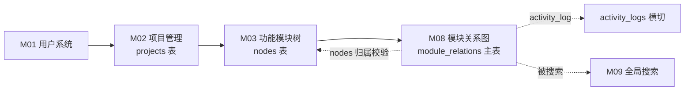
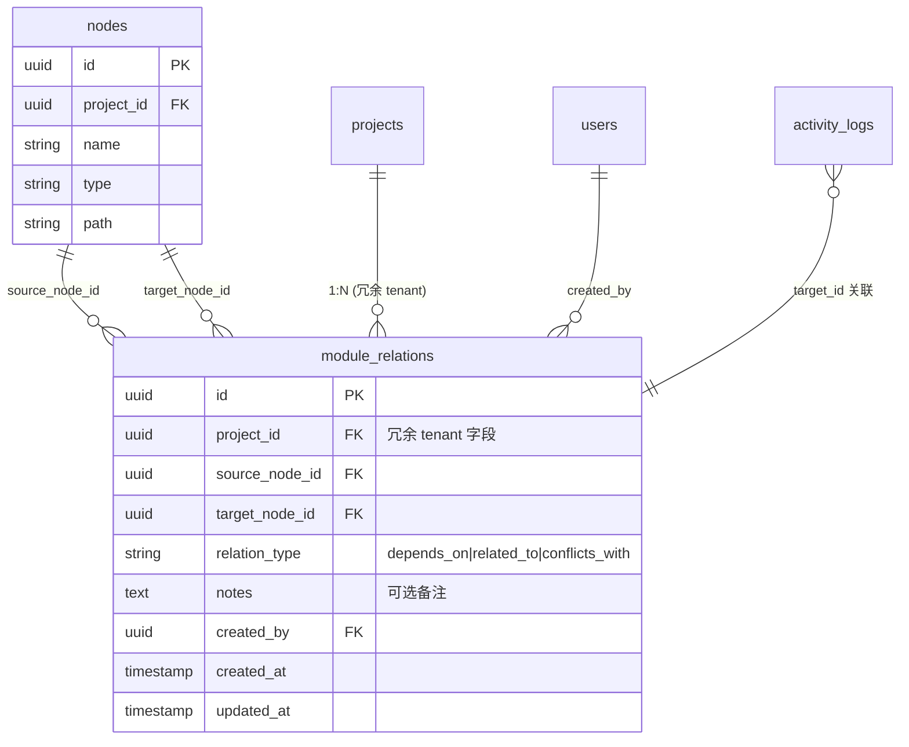

# M08 模块关系图 - 详细设计

> 对标 M04 同步 pilot 范本，Tenant ✅ / 事务 ✅ / 异步 ❌ / 并发 ❌。
> 业务节凡 ⚠️ 标记处须 CY 复审裁决。

---

## 1. 业务说明 + 职责边界

### 业务说明

M08 对应 Prism F8，为功能项之间提供**结构化关联关系**管理。关系图的可视化（React Flow 力导向图）属于前端渲染，后端仅管理关系数据模型与 CRUD。

引用用户故事：
- **US-B1.7**（`feature-list-and-user-stories.md`）：作为编辑者，我想手动创建模块间的关联（依赖/相关/冲突），这样关系网络可视
- **US-C1.2**（同文件）：作为查看者，我想在关系图中点击某个模块看到它的所有依赖，这样理解模块间的影响范围

引用 PRD Q3（`design/00-architecture/01-PRD.md`）：围绕"功能模块"组织，内置"产品评价"能力——影响范围分析需要依托模块关系数据。

### In scope（M08 负责）

- **关系 CRUD**：创建 / 读取 / 更新 notes / 删除模块间关联（`module_relations` 表）
- **关联类型管理**：`relation_type` 枚举（依赖 / 相关 / 冲突）
- **按节点查关联**：给定 `node_id` + `project_id`，拉取所有 source 或 target 为该节点的关联（US-C1.2 支撑）
- **节点归属校验**：创建关联前验证 source/target node 都属于同一 project（不跨 project）
- **activity_log**：创建 / 删除关联操作写审计日志

### Out of scope（其他模块负责）

| 不做的事 | 归属模块 |
|---------|---------|
| 关系图可视化渲染（React Flow 力导向图） | 前端 Component 层，不在后端 M08 scope |
| 节点 CRUD（nodes 表主权） | M03 |
| 节点的功能项内容（dimension_records） | M04 |
| 跨 project 关联（不支持） | 不在任何模块 scope |
| 语义搜索关联路径 | M18 |
| 全局搜索关系数据 | M09（可搜 notes 字段内容） |

### 边界灰区（显式说明）

- **relation_type 方向性**：⚠️ **AI 推断，CY 复审必改**——推断关联为**有向关系**（`source_node_id` → `target_node_id`），即"A 依赖 B"与"B 依赖 A"是不同记录；无向关系（如"相关"）由前端展示层对称显示，后端仅存有向。**候选**：A 有向（推断默认）/ B 无向（DB 层做 `min(src,tgt) + max(src,tgt)` 唯一约束）。

- **同一对节点多关联**：⚠️ **AI 推断，CY 复审必改**——推断允许同一对 `(source_node_id, target_node_id)` 存在不同 `relation_type`（如既"依赖"又"相关"），但禁止完全相同的三元组重复。**候选**：A 允许多类型（推断默认）/ B 不允许同对节点多关联（唯一约束仅 `(source,target)` 不含 type）。

- **节点删除时的关联清理**：M03 删除节点时需清理 `module_relations`。按 R-X2 规则，M03 Service 层必须显式调用 `ModuleRelationService.delete_by_node_id(node_id, project_id)` 而非依赖 DB CASCADE（否则 activity_log 不触发）。本模块提供该接口。

---

## 2. 依赖模块图



**前置依赖（必须先实现）**：M01 → M02 → M03 → M08

**依赖契约**：
- M03 提供：`NodeService.get_node(node_id, project_id)` 返回节点（含 project_id，用于归属校验）
- M03 消费 M08：删除节点时调 `ModuleRelationService.delete_by_node_id(node_id, project_id)`（R-X2）
- M08 对 M09 提供：`ModuleRelationDAO.search_by_keyword(query, project_id)` 接口（M09 ⚠️ 聚合方案确定后实现）

---

## 3. 数据模型

### ER 图



### 表说明

| 表 | 归属模块 | M08 操作 |
|----|---------|---------|
| `nodes` | M03 主 | 只读（校验 source/target 节点归属 project） |
| `module_relations` | **M08 主** | C/R/U(notes)/D |
| `activity_logs` | 横切 | W（create / delete 写审计） |

### 关键设计决策

**冗余 `project_id`**：按全模块统一规则（M04 pilot ack，R3-3），`module_relations` 冗余 `project_id` 字段——DAO 层 tenant 过滤无需 JOIN `nodes`，直接 `WHERE project_id = ?`。Service 层创建时强制 `relation.project_id = source_node.project_id`。

**`relation_type` 三重防护**（R3-2）：Python 类型注解 `Mapped[RelationTypeEnum]` + `mapped_column(String(32))` + `CheckConstraint` 枚举值列出。

### SQLAlchemy model

```python
# api/models/module_relation.py
from __future__ import annotations
from enum import Enum
from sqlalchemy.orm import Mapped, mapped_column, relationship
from sqlalchemy import (
    ForeignKey, String, Text, UniqueConstraint, CheckConstraint
)
from sqlalchemy.dialects.postgresql import UUID
from datetime import datetime
from uuid import UUID as PyUUID, uuid4
from .base import Base, TimestampMixin


class RelationTypeEnum(str, Enum):
    # ⚠️ AI 推断，CY 复审必改——候选：depends_on / related_to / conflicts_with
    # CY 可增减枚举值，但每次变更需同步 CheckConstraint + Alembic 迁移
    depends_on = "depends_on"
    related_to = "related_to"
    conflicts_with = "conflicts_with"


class ModuleRelation(Base, TimestampMixin):
    __tablename__ = "module_relations"
    __table_args__ = (
        # ⚠️ AI 推断，CY 复审必改——如选"同对节点+类型唯一"则用此约束
        # 候选 A（推断默认）：(source, target, type) 三元组唯一
        UniqueConstraint(
            "source_node_id", "target_node_id", "relation_type",
            name="uq_module_relation_src_tgt_type",
        ),
        # 候选 B：(source, target) 唯一（不含 type）—— CY 裁决后切换
        # UniqueConstraint("source_node_id", "target_node_id", name="uq_module_relation_src_tgt"),
        #
        # 三重防护 CheckConstraint（R3-2）
        CheckConstraint(
            "relation_type IN ('depends_on', 'related_to', 'conflicts_with')",
            name="ck_module_relation_type_valid",
        ),
        CheckConstraint(
            "source_node_id != target_node_id",
            name="ck_module_relation_no_self_loop",
        ),
        CheckConstraint(
            "project_id IS NOT NULL",
            name="ck_module_relation_project_id_not_null",
        ),
    )

    id: Mapped[PyUUID] = mapped_column(
        UUID(as_uuid=True), primary_key=True, default=uuid4
    )
    project_id: Mapped[PyUUID] = mapped_column(
        UUID(as_uuid=True),
        ForeignKey("projects.id", ondelete="CASCADE"),
        nullable=False,
        index=True,
    )  # 冗余 tenant 字段（R3-3）
    source_node_id: Mapped[PyUUID] = mapped_column(
        UUID(as_uuid=True),
        ForeignKey("nodes.id", ondelete="CASCADE"),
        nullable=False,
        index=True,
    )
    target_node_id: Mapped[PyUUID] = mapped_column(
        UUID(as_uuid=True),
        ForeignKey("nodes.id", ondelete="CASCADE"),
        nullable=False,
        index=True,
    )
    # 三重防护：Mapped[RelationTypeEnum] + String(32) + CheckConstraint
    relation_type: Mapped[RelationTypeEnum] = mapped_column(
        String(32), nullable=False
    )
    notes: Mapped[str | None] = mapped_column(Text, nullable=True)
    created_by: Mapped[PyUUID] = mapped_column(
        UUID(as_uuid=True), ForeignKey("users.id"), nullable=False
    )

    source_node = relationship("Node", foreign_keys=[source_node_id])
    target_node = relationship("Node", foreign_keys=[target_node_id])
```

### Alembic 要点

- 唯一约束：`UNIQUE(source_node_id, target_node_id, relation_type)`（候选 A 默认）
- 自环防护：`CHECK(source_node_id != target_node_id)`
- 索引：
  - `(project_id)` tenant 过滤
  - `(source_node_id, project_id)` 查某节点的出向关联
  - `(target_node_id, project_id)` 查某节点的入向关联

### ⚠️ 候选 B 改回成本（R3-4）

若 CY 选"关系有向改无向"或"唯一约束改 `(source,target)` 不含 type"：
- Alembic 迁移步数：1 步（DROP 旧约束 + ADD 新约束）
- 新增/删除表数：0（仅改约束）
- 受影响模块：M09（搜索聚合逻辑需同步）
- 数据迁移不可逆性：可逆（无数据丢失，仅约束变更；若现有数据违反新约束需清理重复行）

---

## 4. 状态机

### 声明

`module_relations` 实体**无 status 字段**，无状态机。

关联记录只有"存在"和"不存在"两种状态，通过硬删除（DELETE）处理，不需要状态流转。`notes` 字段可更新但不构成状态枚举。

显式声明（按原则 4）：**M08 无状态实体**——主表 `module_relations` 不维护状态字段；无乐观锁需求（关联更新场景极简，只改 notes 文本，并发冲突概率极低，且业务影响可接受 last-write-wins）。

---

## 5. 多人架构 4 维必答

按原则 5 + 约束清单逐项答。

| 维度 | 答案 | 实现细节 |
|------|------|---------|
| **Tenant 隔离** | ✅ project_id | DAO 强制 `WHERE module_relations.project_id = ?`；Service 创建时校验 `source_node.project_id == target_node.project_id == 入参 project_id` |
| **多表事务** | ✅ 必须 | Service 层 `with self.db.transaction():` 包：① INSERT module_relations ② log activity_log；任一失败回滚 |
| **异步处理** | ❌ N/A | M08 全同步——关系 CRUD 是用户即时操作，无后台任务、无 Queue、无流式 |
| **并发控制** | ❌ N/A | 无乐观锁——关联更新只改 notes（纯文本，last-write-wins 可接受）；唯一约束防重复插入（DB 层兜底） |

### 约束清单逐项检查

| 清单项 | M08 是否触发 | 实现 |
|-------|-------------|------|
| 1. activity_log | ✅ 触发（create / delete 变更） | 节 10 列清单 |
| 2. 乐观锁 version | ❌ 不触发（无并发冲突需求，CY ack 统一无乐观锁）| N/A |
| 3. Queue payload tenant | ❌ 不触发（无 Queue） | N/A |
| 4. idempotency_key | ❌ 不触发（唯一约束防重，无金钱/重计算代价）| 节 11 |
| 5. DAO tenant 过滤 | ✅ 触发 | 节 9 |

---

## 6. 分层职责表

| 层 | M08 涉及文件 | 该层职责 |
|----|------------|---------|
| **Page** | `web/src/app/projects/[pid]/relations/page.tsx` | 关系图页面 SSR；加载节点列表 + 关联数据；调 Server Action |
| **Component** | `web/src/components/business/relation-graph.tsx`<br>`web/src/components/business/relation-form.tsx` | React Flow 渲染关系图（前端可视化）；创建/删除关联表单 |
| **Server Action** | `web/src/actions/module-relation.ts` | session 校验 / zod 入参校验 / fetch FastAPI |
| **Router** | `api/routers/module_relation_router.py` | 路由定义 / `Depends(check_project_access)` / Pydantic schema |
| **Service** | `api/services/module_relation_service.py` | 业务规则（节点归属校验）/ 事务 / 写 activity_log |
| **DAO** | `api/dao/module_relation_dao.py` | SQL 构建 + 强制 tenant 过滤 |
| **Model** | `api/models/module_relation.py` | SQLAlchemy 模型（schema 真相源） |
| **Schema** | `api/schemas/module_relation_schema.py` | Pydantic 请求 / 响应 |

**禁止**：
- ❌ Router 直 `db.query(ModuleRelation)`
- ❌ M08 直接 INSERT/UPDATE `nodes` 表（R-X1）
- ❌ 依赖 DB CASCADE 触发下游 activity_log（R-X2）

---

## 7. API 契约

### Endpoints

| 方法 | 路径 | 用途 | Pydantic 入参 | 出参 |
|------|------|------|--------------|------|
| GET | `/api/projects/{project_id}/relations` | 拉取 project 全部关联（关系图渲染用） | — | `RelationListResponse` |
| GET | `/api/projects/{project_id}/nodes/{node_id}/relations` | 拉取单节点相关关联（US-C1.2） | — | `RelationListResponse` |
| POST | `/api/projects/{project_id}/relations` | 创建关联 | `RelationCreate` | `RelationResponse` |
| PATCH | `/api/projects/{project_id}/relations/{relation_id}` | 更新备注 | `RelationUpdate` | `RelationResponse` |
| DELETE | `/api/projects/{project_id}/relations/{relation_id}` | 删除关联 | — | 204 |
| DELETE | `/api/projects/{project_id}/nodes/{node_id}/relations` | 清除节点所有关联（M03 级联调用） | — | 204 |

### Pydantic schema 草案

```python
# api/schemas/module_relation_schema.py
from pydantic import BaseModel, UUID4, model_validator
from enum import Enum
from datetime import datetime


class RelationType(str, Enum):
    depends_on = "depends_on"
    related_to = "related_to"
    conflicts_with = "conflicts_with"


class RelationResponse(BaseModel):
    id: UUID4
    project_id: UUID4
    source_node_id: UUID4
    source_node_name: str      # join 出来便于前端渲染图节点标签
    target_node_id: UUID4
    target_node_name: str
    relation_type: RelationType
    notes: str | None
    created_by: UUID4
    created_by_name: str
    created_at: datetime
    updated_at: datetime


class RelationListResponse(BaseModel):
    items: list[RelationResponse]
    total: int


class RelationCreate(BaseModel):
    source_node_id: UUID4
    target_node_id: UUID4
    relation_type: RelationType
    notes: str | None = None

    @model_validator(mode="after")
    def check_no_self_loop(self) -> "RelationCreate":
        if self.source_node_id == self.target_node_id:
            raise ValueError("source_node_id and target_node_id must differ")
        return self


class RelationUpdate(BaseModel):
    notes: str | None = None
```

---

## 8. 权限三层防御点

| 层 | 检查 | 实现 |
|----|------|------|
| **Server Action** | session 是否有效 | `getServerSession()`；无则 401 |
| **Router** | 用户对 project 是否有权限 | `Depends(check_project_access(project_id, role="editor"))` 写操作；读操作允许 viewer |
| **Service** | source/target node 是否真的属于该 project | `_check_nodes_belong_to_project(source_node_id, target_node_id, project_id)`；不属于抛 `NodeNotFoundError`（不暴露 forbidden 信息） |

**异步路径**：M08 无异步，三层即足够（无需 Queue 消费者侧权限）。

---

## 9. DAO tenant 过滤策略

### 主查询模式（module_relations 冗余 project_id）

```python
# api/dao/module_relation_dao.py

class ModuleRelationDAO:
    def list_by_project(
        self, db: Session, project_id: UUID
    ) -> list[ModuleRelation]:
        return (
            db.query(ModuleRelation)
            .filter(ModuleRelation.project_id == project_id)  # tenant 过滤
            .all()
        )

    def list_by_node(
        self, db: Session, node_id: UUID, project_id: UUID
    ) -> list[ModuleRelation]:
        return (
            db.query(ModuleRelation)
            .filter(
                ModuleRelation.project_id == project_id,  # tenant 过滤
                (ModuleRelation.source_node_id == node_id)
                | (ModuleRelation.target_node_id == node_id),
            )
            .all()
        )

    def delete_by_node(
        self, db: Session, node_id: UUID, project_id: UUID
    ) -> int:
        """供 M03 Service 层调用（R-X2 规则）"""
        return (
            db.query(ModuleRelation)
            .filter(
                ModuleRelation.project_id == project_id,  # tenant 过滤
                (ModuleRelation.source_node_id == node_id)
                | (ModuleRelation.target_node_id == node_id),
            )
            .delete(synchronize_session=False)
        )

    def search_by_keyword(
        self, db: Session, query: str, project_id: UUID
    ) -> list[ModuleRelation]:
        """供 M09 聚合调用（候选 A 方案下由各模块 Service 提供）"""
        return (
            db.query(ModuleRelation)
            .filter(
                ModuleRelation.project_id == project_id,
                ModuleRelation.notes.ilike(f"%{query}%"),
            )
            .all()
        )
```

### 豁免清单

无——M08 所有查询都在 tenant 边界内。

---

## 10. activity_log 事件清单

| action_type | target_type | target_id | summary | metadata |
|-------------|-------------|-----------|---------|----------|
| `create` | `module_relation` | `<relation_id>` | 创建关联：{source_name} → {target_name} [{type}] | `{source_node_id, target_node_id, relation_type}` |
| `delete` | `module_relation` | `<relation_id>` | 删除关联：{source_name} → {target_name} | `{source_node_id, target_node_id, relation_type}` |
| `update` | `module_relation` | `<relation_id>` | 更新备注：{source_name} → {target_name} | `{relation_type, old_notes_length, new_notes_length}` |

> `notes` 字段更新（PATCH）写 `update` 事件；M03 级联删除节点时由 `ModuleRelationService.delete_by_node_id` 写 `delete` 事件（R-X2 要求）。

**实现位置**：Service 层 `module_relation_service.py`，每个 C/U/D 方法事务内调 `self.activity.log(...)`。

---

## 11. idempotency_key 适用清单

### 声明：M08 无 idempotency 需求

**理由**：
- 创建：DB 唯一约束 `(source_node_id, target_node_id, relation_type)` 防重复插入（409 返回已存在）
- 删除：天然幂等（重复 DELETE 返回 204 或 404）
- 更新 notes：last-write-wins 可接受，无金钱/重计算代价

显式声明（R11-1）：**M08 无 idempotency_key 操作**。

`project_id` 是否参与 key 计算（R11-2）：**不适用**——M08 无幂等键设计。

---

## 12. Queue payload schema

**N/A**——M08 无异步处理，无 Queue 任务。

显式声明（按原则 5 清单 3 要求）：**M08 不投递 Queue 任务**。

---

## 13. ErrorCode 新增清单

### 新增 ErrorCode（注册到 `api/errors/codes.py`）

```python
class ErrorCode(str, Enum):
    # ... 已有

    # M08 模块关系图
    RELATION_NOT_FOUND = "RELATION_NOT_FOUND"
    RELATION_DUPLICATE = "RELATION_DUPLICATE"          # 三元组唯一约束冲突
    RELATION_SELF_LOOP = "RELATION_SELF_LOOP"          # source == target
    RELATION_NODE_NOT_IN_PROJECT = "RELATION_NODE_NOT_IN_PROJECT"  # 节点不属于该 project
    RELATION_TYPE_INVALID = "RELATION_TYPE_INVALID"    # 非法 relation_type 枚举值（理论上 Pydantic 先拦）
```

### 新增 AppError 子类（`api/errors/exceptions.py`）

```python
class RelationNotFoundError(NotFoundError):
    code = ErrorCode.RELATION_NOT_FOUND
    message = "Module relation not found"


class RelationDuplicateError(AppError):
    code = ErrorCode.RELATION_DUPLICATE
    http_status = 409
    message = "This relation already exists between the two nodes with the same type"


class RelationSelfLoopError(AppError):
    code = ErrorCode.RELATION_SELF_LOOP
    http_status = 422
    message = "source_node_id and target_node_id must be different"


class RelationNodeNotInProjectError(AppError):
    code = ErrorCode.RELATION_NODE_NOT_IN_PROJECT
    http_status = 404
    message = "One or both nodes do not belong to the given project"


class RelationTypeInvalidError(AppError):
    code = ErrorCode.RELATION_TYPE_INVALID
    http_status = 422
    message = "Invalid relation_type value"
```

### 复用已有

- `PERMISSION_DENIED` / `UNAUTHENTICATED`——复用
- `NOT_FOUND`——节点不存在时复用（不暴露 forbidden 信息）

---

## 14. 测试场景

详见独立文件：[`tests.md`](./tests.md)

主文档大纲：
- **golden path**：创建关联 / 读项目所有关联 / 读节点关联 / 更新备注 / 删除关联
- **边界**：自环防护 / 重复关联 / 节点跨 project / relation_type 非法值 / notes 超长
- **并发**：无乐观锁（并发 DELETE 两次 → 幂等，第二次 404）
- **tenant**：跨 project 越权读 / 越权写 / DAO 过滤覆盖
- **权限**：viewer 写 / 未登录读 / router 拦截
- **错误处理**：DB 唯一冲突 / 节点不存在 / 节点被删后关联残留清理

---

## 15. 完成度判定 checklist

- [x] 节 1：业务说明引 US-B1.7 + US-C1.2 + PRD Q3；in/out scope 完整
- [x] 节 2：依赖图覆盖 M01→M02→M03→M08 + M09 反向
- [x] 节 3：ER 图 + SQLAlchemy class + project_id 冗余 + 三重防护（R3-2）+ 候选 B 改回成本（R3-4）
- [x] 节 4：状态机无状态显式声明
- [x] 节 5：4 维必答（无 ⚠️ 占位）+ 5 项清单逐项标
- [x] 节 6：分层职责表每层文件路径具体
- [x] 节 7：所有 endpoint + Pydantic schema + 强类型枚举（R7-2）
- [x] 节 8：三层防御 + 异步路径声明
- [x] 节 9：DAO 主查询 + 豁免清单（无）
- [x] 节 10：activity_log 事件清单（create/update/delete）
- [x] 节 11：idempotency 无（显式声明 + R11-2 回答）
- [x] 节 12：Queue 显式 N/A
- [x] 节 13：5 个 ErrorCode + 5 个 AppError 子类（R13-1 满足）
- [x] 节 14：tests.md 测试场景大纲写完
- [x] 节 15：本 checklist
- [ ] **🔴 第一轮 reviewer audit（完整性）通过**
- [ ] **🔴 第二轮 reviewer audit（边界场景）通过**
- [ ] **🔴 第三轮 reviewer audit（演进 / 模板可复用性）通过**
- [ ] CY 全文复审通过 → status 转 accepted

---

## ⚠️ 待 CY 裁决项汇总

| # | 节 | 决策点 | AI 默认值 | 候选 |
|---|----|-------|----------|------|
| Q1 | 3 | 关联方向性（有向 vs 无向） | **A 有向**（source→target 有意义） | B 无向（DB 层 min/max 唯一约束） |
| Q2 | 3 | 同对节点多关联类型（允许 vs 不允许） | **A 允许**（三元组唯一，含 type） | B 不允许（仅 (source,target) 唯一） |
| Q3 | 3 | relation_type 枚举值（3 个够吗） | **depends_on / related_to / conflicts_with** | CY 可增删，需同步 CheckConstraint |

---

## 关联参考

- 上游设计：
  - `design/00-architecture/04-layer-architecture.md`（5 层 / 三层权限 / 事务边界）
  - `design/00-architecture/05-module-catalog.md`（M08 4 维标注）
  - `design/00-architecture/06-design-principles.md`（原则 5 + 5 项清单）
  - `design/00-architecture/07-capability-matrix.md`（M08 能力定位）
- 工程规约：`design/01-engineering/01-engineering-spec.md`
- 依赖模块：`design/02-modules/M03-module-tree/00-design.md`（R-X2 跨模块删除规则）
- Prism 对照参考：`/root/cy/prism/web/src/db/schema.ts`（参考命名，不直接抄）
- 用户故事来源：`/root/cy/prism/docs/product/feature-list-and-user-stories.md`（US-B1.7 / US-C1.2）
