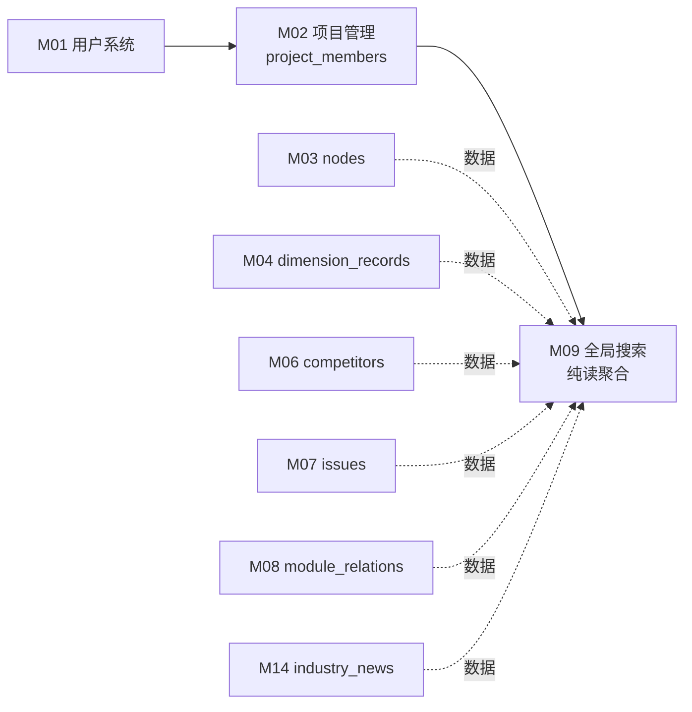

# M09 全局搜索 - 详细设计

> 对标 M04 同步 pilot 范本，纯读聚合模块。Tenant ✅ / 事务 ❌ / 异步 ❌ / 并发 ❌。
> **CY 2026-04-21 决策记录见 §15，业务决策已 accepted**

---

## 1. 业务说明 + 职责边界

### 业务说明

M09 对应 Prism F9，提供**关键词驱动的全局跨模块搜索**——跨 nodes / dimension_records / competitors / issues / industry_news / module_relations 多模块读取，按 project 边界过滤，仅返回用户有权访问的内容。

引用用户故事：
- **US-C1.3**（`/root/cy/prism/docs/product/feature-list-and-user-stories.md`）：作为查看者，我想搜索关键词快速找到相关功能项，搜索结果带上下文高亮，这样不用翻树逐个找
- **US-C2.2**（同文件）：作为查看者，我搜索时只能看到有权限的项目内容，这样不会越权

引用 PRD Q3（`design/00-architecture/01-PRD.md`）："围绕功能模块组织"——搜索必须能跨维度（功能描述、技术实现、测试分析等）找到功能项。

> **注意**：M09 是关键词搜索（ILIKE / PG 全文搜索），不是 M18 的语义搜索（pgvector）。两者独立，不同入口。

### In scope（M09 负责）

- **关键词搜索**：在用户有权访问的 project 范围内，跨多模块字段匹配关键词
- **权限过滤**：仅返回用户是成员的 project 内的内容（US-C2.2）
- **结果聚合**：将来自不同模块的结果合并，统一 result_type 区分
- **上下文摘要/高亮**：每条结果附带匹配片段（snippet），支持关键词高亮（US-C1.3）
- **分页**：结果分页返回（page / page_size）
- **搜索范围**：
  - `nodes`（M03）：节点名称
  - `dimension_records`（M04）：维度内容（JSONB text 字段）
  - `competitors`（M06）：竞品名称 + 备注
  - `issues`（M07）：问题标题 + 描述
  - `industry_news`（M14）：动态标题 + 摘要
  - `module_relations`（M08）：关联备注（notes 字段）

### Out of scope（其他模块负责）

| 不做的事 | 归属模块 |
|---------|---------|
| 语义搜索（向量相似度，pgvector） | M18 |
| 维度筛选（按维度类型过滤） | M09 扩展点，本期不实现（PRD 未提及，后续需求变更时追加）|
| 跨 project 搜索（无 project 边界） | 不在 scope（基于 US-C2.2 每条结果必须在有权限 project 内） |
| 搜索历史记录 | 不在 scope（PRD 未提及） |
| 写操作（搜索结果的 CRUD） | M09 纯读，所有写委托各自模块 |

### 边界灰区（显式说明）

- **搜索范围 project 边界**：**CY ack 候选 A 仅成员 project**——M09 只搜索用户有成员身份的 project（IN 过滤），不支持全平台搜索。§9 DAO 通过 `accessible_project_ids` IN 过滤实现。

- **搜索算法选型**：**CY ack 候选 A ILIKE**——使用 PostgreSQL `ILIKE '%query%'`，简单可靠。§3 + §9 明确 ILIKE 实现；`score: float | None` 字段在 ILIKE 下始终为 None（保留字段以防未来升级全文搜索）。

- **维度内容搜索**：**CY ack 候选 A JSONB::text ILIKE**——`dimension_records.content` 是 JSONB，搜索时通过 `content::text ILIKE` 转换。已 ack 接受边界：可能匹配到 JSON key 名（假阳性），实现简单。JSONB key 名假阳性场景见 tests.md。

---

## 2. 依赖模块图



**前置依赖（必须先实现）**：M01 → M02 → M03/M04/M06/M07/M08/M14（各自先实现）→ M09

**依赖契约**：
- M02 提供：`project_members` 查询用户有权访问的 project_id 列表
- M03 提供：`nodes` 表 `(id, project_id, name, type, path)`
- M04 提供：`dimension_records` 表 `(id, node_id, project_id, content::text)`
- M06 提供：`competitors` 表 `(id, node_id, project_id, name, notes)`
- M07 提供：`issues` 表 `(id, node_id, project_id, title, description)`
- M08 提供：`module_relations` 表 `(id, project_id, source_node_id, target_node_id, notes)`
- M14 提供：`industry_news` 表 `(id, title, summary)`（M14 为全局数据，无 project_id，见节 9 豁免声明）

---

## 3. 数据模型

### M09 无自有实体表

**本模块无自有实体表，§3 适用纯读聚合规范（R3-5），采纳 ADR-003 规则 1：通过上游 Service 接口读取。**

引用：[`adr/ADR-003-cross-module-read-strategy.md`](../../adr/ADR-003-cross-module-read-strategy.md)

M09 Service 层通过调用上游模块的 Service 接口获取数据，**不得**在自己的 DAO 层直接 `db.query(上游 Model)`。M09 无自有 DAO 层（无主表，无自有 SQL 查询）。

### 上游依赖表清单（访问方式 = Service 接口调用，ADR-003 规则 1）

| 上游表 | 归属模块 | 访问方式 |
|--------|---------|---------|
| `nodes` | M03 | M03 `NodeService.search_by_keyword(db, query, project_id, limit)` |
| `dimension_records` | M04 | M04 `DimensionService.search_by_keyword(db, query, project_id, limit)` |
| `competitors` | M06 | M06 `CompetitorService.search_by_keyword(db, query, project_id, limit)` |
| `issues` | M07 | M07 `IssueService.search_by_keyword(db, query, project_id, limit)` |
| `module_relations` | M08 | M08 `ModuleRelationService.search_by_keyword(db, query, project_id, limit)` |
| `industry_news` | M14 | M14 `IndustryNewsService.search_by_keyword(db, query, limit)`（无 project_id，ADR-003 M14 例外）|

> **M14 例外说明**：M14 是全局无 project_id 模块（catalog Tenant ❌），其 `search_by_keyword` 接口签名不含 `project_id`，M09 Service 调用时做分支处理（见 §9）。

> **基线补丁 TODO**：M03/M04/M06/M07/M14 各已 accepted 模块需追加 `search_by_keyword` Service 接口实现——见 README.md 末尾 TODO（ADR-003 引用方清单）。

### 历史候选方案（已决策，供参考）

| 候选 | 方案描述 | 推荐度 |
|------|---------|-------|
| **A：各模块 Service 提供 `search_by_keyword()` 接口，M09 聚合**（**已采纳，ADR-003 规则 1**）| M09 Service 依次调上游 Service 方法后合并结果 | ✅ 采纳 |
| **B：独立 search_view 物化视图** | 创建 PG 物化视图；需 REFRESH 策略；实时性弱 | ⭐⭐（演进备选）|
| **C：M09 DAO 直接 JOIN 多表** | 违反 R-X1；ADR-003 明确否决 | ❌ |

**搜索字段范围**：

| 模块 | 表 | 搜索字段 | result_type |
|------|-----|---------|------------|
| M03 | `nodes` | `name` | `node` |
| M04 | `dimension_records` | `content::text` | `dimension_record` |
| M06 | `competitors` | `name`, `notes` | `competitor` |
| M07 | `issues` | `title`, `description` | `issue` |
| M08 | `module_relations` | `notes` | `module_relation` |
| M14 | `industry_news` | `title`, `summary` | `industry_news` |

### 搜索结果虚拟模型（无 DB 持久化，仅 Pydantic）

```python
# api/schemas/search_schema.py
from pydantic import BaseModel, UUID4
from enum import Enum
from datetime import datetime


class SearchResultType(str, Enum):
    node = "node"
    dimension_record = "dimension_record"
    competitor = "competitor"
    issue = "issue"
    module_relation = "module_relation"
    industry_news = "industry_news"


class SearchResultItem(BaseModel):
    result_id: UUID4
    result_type: SearchResultType
    project_id: UUID4 | None       # industry_news 无 project_id，填 None
    project_name: str | None
    node_id: UUID4 | None          # 非节点类结果关联的 node
    node_name: str | None
    title: str                     # 主要展示文本
    snippet: str                   # 上下文摘要（含高亮标记）
    matched_field: str             # 哪个字段命中（用于前端区分展示）
    score: float | None            # ILIKE 下始终为 None（保留字段以防未来升级全文搜索，CY ack A-5）
    created_at: datetime


class SearchResponse(BaseModel):
    items: list[SearchResultItem]
    total: int
    page: int
    page_size: int
    query: str
```

> **注意**：M09 不自建表，`SearchResultItem` 是纯 Pydantic 聚合结构，无 SQLAlchemy model。

---

## 4. 状态机

### 声明

M09 是**纯读聚合模块，无任何写操作**，无任何实体有状态字段，无状态机。

显式声明（按原则 4）：**M09 无状态实体**——搜索结果是临时聚合结构，不持久化；所有被搜索数据的状态归属各自模块。

---

## 5. 多人架构 4 维必答

按原则 5 + 约束清单逐项答。

| 维度 | 答案 | 实现细节 |
|------|------|---------|
| **Tenant 隔离** | ✅ IN 过滤 | DAO/Service 层查询时限定 `project_id IN (<用户有权限的 project_id 列表>)`；M14 行业动态为全局数据（无 project_id），豁免声明见节 9 |
| **多表事务** | ❌ N/A | M09 纯读，无写操作，无需事务 |
| **异步处理** | ❌ N/A | M09 全同步——关键词搜索是即时查询 |
| **并发控制** | ❌ N/A | 纯读无并发写冲突场景 |

### 约束清单逐项检查

| 清单项 | M09 是否触发 | 实现 |
|-------|-------------|------|
| 1. activity_log | ❌ 不触发（纯读操作）| 节 10 显式声明 |
| 2. 乐观锁 version | ❌ 不触发（无写操作） | N/A |
| 3. Queue payload tenant | ❌ 不触发（无 Queue） | N/A |
| 4. idempotency_key | ❌ 不触发（只读操作天然无幂等需求）| 节 11 |
| 5. DAO tenant 过滤 | ✅ 触发（IN 过滤策略）| 节 9 |

---

## 6. 分层职责表

| 层 | M09 涉及文件 | 该层职责 |
|----|------------|---------|
| **Page** | `web/src/app/search/page.tsx` | 搜索页面 SSR（可 CSR）；输入框 + 结果列表渲染；高亮处理 |
| **Component** | `web/src/components/business/search-bar.tsx`<br>`web/src/components/business/search-result-list.tsx` | 搜索输入 debounce；结果分页展示；result_type 图标区分 |
| **Server Action** | `web/src/actions/search.ts` | session 校验 / zod 入参校验（query 长度 / page 范围）/ fetch FastAPI |
| **Router** | `api/routers/search_router.py` | 路由定义 / `Depends(get_current_user)` 获取用户身份 / Pydantic schema |
| **Service** | `api/services/search_service.py` | 查用户有权限 project_ids / 调各上游 Service.search_by_keyword / 聚合排序 / 权限过滤 / 分页 + snippet 生成（ADR-003 规则 1）|
| **DAO** | **M09 无 DAO 层**（Service 层直接调上游 Service，不构建自己的 SQL）| — |
| **Model** | 无（不新建表）| — |
| **Schema** | `api/schemas/search_schema.py` | Pydantic 请求 / 响应（SearchRequest / SearchResponse / SearchResultItem） |

**禁止**：
- ❌ M09 直接 `db.query(上游 Model)`——必须通过上游 Service 接口（ADR-003 规则 1，候选 C 直 JOIN 已明确否决）
- ❌ Router 直查 DB
- ❌ M09 写任何表（纯读模块）

---

## 7. API 契约

### Endpoints

| 方法 | 路径 | 用途 | Pydantic 入参 | 出参 |
|------|------|------|--------------|------|
| GET | `/api/search` | 全局关键词搜索（用户 IN 过滤） | `SearchRequest`（query params） | `SearchResponse` |
| GET | `/api/projects/{project_id}/search` | 指定 project 内关键词搜索 | `SearchRequest`（query params） | `SearchResponse` |

### Pydantic schema 草案

```python
# api/schemas/search_schema.py
from pydantic import BaseModel, UUID4, Field
from fastapi import Depends, Query
from enum import Enum
from datetime import datetime
from typing import Literal


class SearchResultType(str, Enum):
    node = "node"
    dimension_record = "dimension_record"
    competitor = "competitor"
    issue = "issue"
    module_relation = "module_relation"
    industry_news = "industry_news"


class SearchResultItem(BaseModel):
    result_id: UUID4
    result_type: SearchResultType
    project_id: UUID4 | None       # industry_news 无 project_id，填 None（全局内容）
    project_name: str | None
    node_id: UUID4 | None
    node_name: str | None
    title: str
    snippet: str                   # 含 <mark>keyword</mark> 标记的上下文片段
    matched_field: str             # 如 "name" / "content" / "title" / "notes"
    score: float | None            # ILIKE 下始终为 None（保留字段以防未来升级全文搜索，CY ack A-5）
    created_at: datetime


class SearchResponse(BaseModel):
    items: list[SearchResultItem]
    total: int    # 各模块命中数之和，不跨模块去重（CY ack C-1，候选 A）
    page: int
    page_size: int
    query: str


class SearchFilters(BaseModel):
    """
    query params 通过 Depends(SearchFilters) 解析，避免 FastAPI 默认将 BaseModel 解析为 request body。
    FastAPI 规则：GET endpoint 中 BaseModel 入参必须用 Depends() 包裹才能作为 query params 解析。
    """
    q: str = Field(..., min_length=1, max_length=200, description="搜索关键词")
    page: int = Field(default=1, ge=1)
    page_size: int = Field(default=20, ge=1, le=100)
    # result_types 过滤：本期不实现（PRD 未提及），预留扩展口
    # result_types: list[SearchResultType] | None = None


# Router 中使用方式（M09-F4 修正：Depends 包裹 BaseModel 作为 query params）：
# @router.get("/search")
# async def search(
#     filters: SearchFilters = Depends(),
#     current_user = Depends(get_current_user)
# ):
#     ...
```

---

## 8. 权限三层防御点

| 层 | 检查 | 实现 |
|----|------|------|
| **Server Action** | session 是否有效 | `getServerSession()`；无则 401 |
| **Router** | 用户是否登录（任意登录用户可搜索，无 project 级角色要求） | `Depends(get_current_user)`；未登录则 401 |
| **Service** | 搜索结果过滤到用户有权限的 project | `_get_accessible_project_ids(user_id)` 查 `project_members`；IN 过滤保证越权内容不出现在结果中（US-C2.2） |

> **指定 project 搜索时额外检查**：`/api/projects/{project_id}/search` 路由需在 Router 层增加 `Depends(check_project_access(project_id, role="viewer"))`，Service 层只搜该 project。

**异步路径**：M09 无异步，三层即足够（无需 Queue 消费者侧权限）。

---

## 9. DAO tenant 过滤策略

### Service 层权限过滤策略（ADR-003 规则 1）

M09 无 DAO 层（无主表）。Tenant 过滤通过 Service 层权限白名单实现：

```python
# api/services/search_service.py（ADR-003 规则 1 实现）

class SearchService:
    def search(self, db: Session, query: str, user_id: UUID, page: int, page_size: int) -> SearchResponse:
        # 第一步：获取用户可访问的 project_ids 白名单（仅成员 project，CY ack A-4）
        accessible_project_ids = self._get_accessible_project_ids(db, user_id)

        # D-4 短路处理：空白名单时直接返回（CY ack，M14 在此场景也跳过——无权限用户不返回 M14）
        if not accessible_project_ids:
            return SearchResponse(items=[], total=0, page=page, page_size=page_size, query=query)

        results = []

        # 第二步：调各上游 Service.search_by_keyword（ADR-003 规则 1）
        # ILIKE 实现（CY ack A-5）：各模块 search_by_keyword 内部用 ILIKE '%query%'
        for pid in accessible_project_ids:
            results += self.node_service.search_by_keyword(db, query, pid, limit=page_size)
            results += self.dimension_service.search_by_keyword(db, query, pid, limit=page_size)
            # dimension_records 用 content::text ILIKE（CY ack A-6，接受 JSONB key 名假阳性）
            results += self.competitor_service.search_by_keyword(db, query, pid, limit=page_size)
            results += self.issue_service.search_by_keyword(db, query, pid, limit=page_size)
            results += self.module_relation_service.search_by_keyword(db, query, pid, limit=page_size)

        # M14 分支处理：默认聚合 M14 结果，不提供 include_global 参数（CY ack C-3，候选 A）
        # ADR-003 M14 例外：调 M14 时不传 project_id；结果 project_id 字段为 null（表示全局）
        results += self.industry_news_service.search_by_keyword(db, query, limit=page_size)

        # _merge_and_paginate：按 created_at DESC + 模块类型分组排序（CY ack C-2，候选 A）
        # total 语义：各模块命中数之和，不跨模块去重（CY ack C-1，候选 A）
        return self._merge_and_paginate(results, query, page, page_size)

    def _merge_and_paginate(self, results, query, page, page_size) -> SearchResponse:
        """
        聚合排序：按 created_at DESC（最新优先）+ 模块类型分组（CY ack C-2）
        total：各模块命中数之和（len(results) 直接加总，不去重，CY ack C-1）
        """
        # 按 created_at 降序排列（ILIKE 无 score，用 created_at 作时间线锚点）
        sorted_results = sorted(results, key=lambda x: x.created_at, reverse=True)
        total = len(sorted_results)
        offset = (page - 1) * page_size
        page_items = sorted_results[offset: offset + page_size]
        return SearchResponse(items=page_items, total=total, page=page, page_size=page_size, query=query)
```

### 豁免清单

| 豁免项 | 原因 | 处理方式 |
|-------|------|---------|
| `industry_news`（M14） | 全局共享数据，无 `project_id` 字段（M14 catalog：Tenant ❌ 全局共享）；ADR-003 M14 签名例外 | M09 调 `IndustryNewsService.search_by_keyword(db, query, limit)` 时**不传 project_id**；结果 `project_id` 字段为 `null`（全局内容）|

### 防绕过纪律

- `_get_accessible_project_ids(user_id)` 查询结果不缓存（每次搜索实时查 project_members，防 role 降级后缓存残留）
- 观察项：若需要缓存优化，需评估 Redis TTL 与权限变更延迟的权衡（当前不实现）

---

## 10. activity_log 事件清单

**M09 是纯读聚合模块，无任何写操作，无 activity_log 事件。**

显式声明（按清单 1 豁免条件）：搜索是只读操作，不触发 activity_log。

---

## 11. idempotency_key 适用清单

**M09 无 idempotency 需求。**

**理由**：搜索是只读操作，GET 请求天然幂等（RFC 9110），无需 idempotency_key。

显式声明（R11-1）：**M09 无 idempotency_key 操作**。

`project_id` 是否参与 key 计算（R11-2）：**不适用**——M09 无幂等键设计。

---

## 12. Queue payload schema

**N/A**——M09 无异步处理，无 Queue 任务。

显式声明（按原则 5 清单 3 要求）：**M09 不投递 Queue 任务**。

---

## 13. ErrorCode 新增清单

### 新增 ErrorCode（注册到 `api/errors/codes.py`）

```python
class ErrorCode(str, Enum):
    # ... 已有

    # M09 全局搜索
    SEARCH_QUERY_TOO_SHORT = "SEARCH_QUERY_TOO_SHORT"   # 关键词长度 < 1（Pydantic 先拦，兜底）
    SEARCH_QUERY_TOO_LONG = "SEARCH_QUERY_TOO_LONG"     # 关键词长度 > 200
    SEARCH_PROJECT_ACCESS_DENIED = "SEARCH_PROJECT_ACCESS_DENIED"  # 指定 project 无权访问
```

### 新增 AppError 子类（`api/errors/exceptions.py`）

```python
class SearchQueryTooShortError(AppError):
    code = ErrorCode.SEARCH_QUERY_TOO_SHORT
    http_status = 422
    message = "Search query must be at least 1 character"


class SearchQueryTooLongError(AppError):
    code = ErrorCode.SEARCH_QUERY_TOO_LONG
    http_status = 422
    message = "Search query must be at most 200 characters"


class SearchProjectAccessDeniedError(AppError):
    code = ErrorCode.SEARCH_PROJECT_ACCESS_DENIED
    http_status = 403
    message = "You do not have access to the specified project"
```

### 复用已有

- `UNAUTHENTICATED`——未登录时复用
- `PERMISSION_DENIED`——通用权限拒绝（可复用，`SEARCH_PROJECT_ACCESS_DENIED` 是语义更精确的子类）
- `NOT_FOUND`——project 不存在时复用（不暴露 forbidden 信息）

---

## 14. 测试场景

详见独立文件：[`tests.md`](./tests.md)

主文档大纲：
- **golden path**：关键词命中节点 / 命中维度内容 / 命中竞品 / 命中问题 / 混合结果 + 分页
- **边界**：空关键词 / 超长关键词 / 无结果 / page 越界 / 特殊字符（SQL 注入防护）
- **并发**：纯读无并发场景（显式声明）
- **tenant**：跨 project 越权 / 结果仅含有权限 project / 全局数据不过滤
- **权限**：未登录 / 指定 project 无 viewer 权限 / viewer 可搜索
- **错误处理**：无结果不报错 / DB 错误 / 超时处理

---

## 15. 完成度判定 checklist

- [x] 节 1：业务说明引 US-C1.3 + US-C2.2 + PRD Q3；in/out scope 完整；M09 vs M18 区分明确
- [x] 节 2：依赖图覆盖全部上游模块（M03/M04/M06/M07/M08/M14）
- [x] 节 3：无自有表声明（R3-5）+ 上游 Service 接口清单 + ADR-003 规则 1 引用 + M14 例外说明（不得误勾 R3-1 "SQLAlchemy class 代码块"）
- [x] 节 4：无状态实体显式声明
- [x] 节 5：4 维必答（无 ⚠️ 占位）+ 5 项清单逐项标
- [x] 节 6：分层职责表每层文件路径具体
- [x] 节 7：2 个 endpoint + 完整 Pydantic schema + 强类型枚举
- [x] 节 8：三层防御 + 异步路径声明 + 指定 project 路由额外说明
- [x] 节 9：IN 过滤策略 + M14 豁免清单（显式声明）
- [x] 节 10：无 activity_log（纯读，显式声明）
- [x] 节 11：idempotency 无（显式声明 + R11-2 回答）
- [x] 节 12：Queue 显式 N/A
- [x] 节 13：3 个 ErrorCode + 3 个 AppError 子类（R13-1 满足）
- [x] 节 14：tests.md 测试场景大纲写完
- [x] 节 15：本 checklist
- [ ] **🔴 第一轮 reviewer audit（完整性）通过**
- [ ] **🔴 第二轮 reviewer audit（边界场景）通过**
- [ ] **🔴 第三轮 reviewer audit（演进 / 模板可复用性）通过**
- [ ] CY 全文复审通过 → status 转 accepted

---

## C 类决策补对比（2026-04-21）

> 以下 3 条 C 类决策补对比，CY 2026-04-21 已 ack（见底部）。候选 A/B/C 文字结构保留作历史记录。

---

### C-M09-1：SearchResponse.total 字段语义（C 类补对比，2026-04-21）

**当前状态**：`SearchResponse.total: int`，文档未说明语义——各模块命中数之和（不去重）vs 去重总数 vs 不提供 total。

**候选 A/B/C**（业务场景对比）：

| 候选 | 业务场景（CY 实际用法）| 实现影响 |
|------|---------------------|---------|
| **A：各模块命中数之和（不去重）** | CY 搜"支付"→ 看到 `total: 23`，即 M04 功能项 10 + M06 竞品 8 + M07 问题 5 等各模块 count 加总。同一业务实体若在多模块都命中，会被计为多次——但对 CY 来说这是"有多少条搜索结果"，直觉符合"结果列表有 23 条" | 各上游 Service.search_by_keyword() 返回结果数直接 `len()` 加总，无额外 JOIN；Service 层代码无变化 |
| **B：去重总数（同一实体只算 1）** | CY 搜"支付"→ 看到 `total: 18`（某些节点在 M03 节点名和 M04 内容里都命中，去重后唯一实体 18 个）。语义更"精确"，但 CY 的搜索场景里同一功能项在不同维度命中是合理现象，去重后数字反而不直观 | 需在 Service 层聚合后按 (result_type, result_id) 去重，增加一次 O(N) set 操作；SearchService._merge_and_paginate() 需改写；不涉及 Alembic 迁移 |
| **C：不提供 total，仅 has_more** | CY 搜"支付"→ 列表展示结果，底部显示"还有更多结果"按钮（无精确数字）。避免 COUNT 性能问题，但 CY 无法一眼知道结果规模，只知道"有没有更多" | SearchResponse 去掉 total 字段，加 has_more: bool；Pydantic schema 改字段；前端翻页逻辑简化（无需 total pages 计算）；不涉及 Alembic 迁移 |

**AI 倾向**：候选 A（和式，实现最简单）

**理由**：
1. 本项目单 project 几十到几百条数据，去重代价（跨模块聚合后 set 操作）大于收益
2. CY 用 Prism 搜索频次不高，每次搜"支付"看到 23 条结果比看到 18 条去重结果更直觉——她关心"找到多少条可看"，而非"有多少个唯一实体"
3. 候选 C 丢失数字维度，CY 半年后回看搜索结果想知道规模时无法获取
4. ILIKE 下各模块 count 加总 < 1ms，候选 B 的额外 set 操作对这个数据量无意义

**改回成本**：
- Alembic 迁移步数：0 步（total 语义是纯 Service/Schema 层决策，无 DB 变更）
- 受影响模块数：1 个（M09 自身 SearchService._merge_and_paginate + SearchResponse schema）
- 数据迁移不可逆性：无（无持久化数据）
- 代码改动量：A→B 约 1 小时（Service 层加去重逻辑 + schema 加注释）；A→C 约 30 分钟（去掉 total 字段，加 has_more）

**CY 2026-04-21 ack：候选 A**

---

### C-M09-2：搜索结果排序规则（C 类补对比，2026-04-21）

**当前状态**：§9 Service 层聚合代码 `_merge_and_paginate()` 有分页逻辑，但无显式 ORDER BY——ILIKE 无 score，排序规则未定义。

**候选 A/B/C**（业务场景对比）：

| 候选 | 业务场景（CY 实际用法）| 实现影响 |
|------|---------------------|---------|
| **A：按 created_at DESC（最新优先）+ 模块类型分组显示** | CY 搜"支付"→ 最近新建的功能项 / 竞品 / 问题优先出现，最早录入的沉底。CY"边改边查"的场景下，最新加的记录就是最需要关注的——符合"知识库随时间沉淀"的心智模型 | SearchResultItem 已有 created_at 字段；_merge_and_paginate 改为 sorted(results, key=lambda x: x.created_at, reverse=True)；纯内存排序，无 SQL 改动 |
| **B：按 updated_at DESC（最近更新优先）+ 模块类型分组** | CY 搜"支付"→ 最近被编辑的记录优先出现。但 M15 activity_log 每次小改都更新 updated_at——搜索结果会被近期编辑的记录"刷屏"，即使那条记录不是最相关的 | SearchResultItem 需增加 updated_at 字段（各上游 search_by_keyword 返回结果需带此字段）；各模块 Service 接口改动量 +5 个模块 |
| **C：按相关度降序（匹配位置 / 匹配次数，Service 层自算）** | CY 搜"支付"→ 标题就是"支付流程"的记录排第一，内容里只偶然提到"支付"的记录排后。"最匹配"直觉最好，但 ILIKE 无 tf-idf，需要 Service 层手写相关度算法（如：title 命中权重 > content 命中权重）| 需在 SearchService 里实现相关度评分函数（`matched_field == "name"/"title"` 加权），成本高且效果受 ILIKE 精度限制 |

**AI 倾向**：候选 A（created_at DESC）

**理由**：
1. created_at 是 CY 知识库的时间线锚点——"最新加的=最关注的"在个人知识库场景中高度成立
2. updated_at 在 M15 语义下每次任何小改都更新，会让搜索结果被最近活跃的记录污染（即使那条记录并不最相关）
3. 候选 C 的 ILIKE 相关度自算（非 ts_rank）成本高、效果不确定，对 CY 单用户几百条数据场景过度设计
4. 候选 A 纯内存 sorted() 调用，不增加任何 DB 查询

**改回成本**：
- Alembic 迁移步数：0 步（纯 ORDER BY / Python 排序逻辑，无 DB schema 变更）
- 受影响模块数：1 个（M09 自身 _merge_and_paginate）
- 数据迁移不可逆性：无（排序字段切换不影响存储数据）
- 代码改动量：A→B 约 2 小时（SearchResultItem 加 updated_at + 各上游 5 模块 Service 接口改动）；A→C 约 3-4 小时（Service 层相关度评分函数）

**CY 2026-04-21 ack：候选 A**

---

### C-M09-3：M14 行业动态默认出现 vs 显式勾选（C 类补对比，2026-04-21）

**当前状态**：§1 边界灰区提到"M14 全局数据，无 project_id"，§9 豁免清单说明 M14 调用不传 project_id，但未说明搜索时是否默认聚合 M14 结果、还是需用户显式选择。

**候选 A/B/C**（业务场景对比）：

| 候选 | 业务场景（CY 实际用法）| 实现影响 |
|------|---------------------|---------|
| **A：M14 结果默认出现（所有搜索自动聚合 M14）** | CY 搜"金融科技"→ 结果列表里同时出现 project 内的功能项记录 + M14 全局行业动态新闻。她看到的是"我知识库里关于金融科技的全部内容（含行业趋势）"——符合"全信息聚合"的直觉 | 当前 §9 实现已是此逻辑（results += industry_news_service.search_by_keyword(...)）；无需改动 |
| **B：M14 需用户显式勾选"包含全局资料"才出现** | CY 搜"金融科技"→ 默认只看到 project 内结果；需手动勾选"也搜行业动态"才出现 M14 内容。减少"噪音"，但多一步操作；CY 的个人知识库场景里她通常希望一次搜完，额外勾选是摩擦 | SearchFilters 加 include_global: bool = False；Router 透传参数；SearchService 分支处理 M14 调用；Pydantic schema 改动 |
| **C：M14 独立 tab 展示（project 结果 + 全局结果分 tab）** | CY 搜"金融科技"→ 看到两个 tab："项目内容"和"行业动态"，分开展示。最清晰，但 UI 复杂度增加；对于 CY 的单人知识库，分 tab 切换的认知负担可能超过收益 | 后端不变（M14 结果已带 result_type=industry_news 标识可分组）；前端需新增 tab 组件 + 分组渲染逻辑；API 不变 |

**AI 倾向**：候选 A（默认出现）

**理由**：
1. M14 是全局共享资源，设计初衷就是"对所有用户开放的行业知识底座"——默认聚合符合"搜索 = 全信息"直觉
2. CY 用 Prism 半年后回看时，"支付"相关的行业新闻和自己项目内的功能分析一起出现，正是"交叉印证"的核心价值
3. 候选 B 增加操作步骤，CY 的个人知识库场景几乎不需要"只看 project 内"的孤立搜索
4. 候选 C 的 UI 分 tab 复杂度高于收益，且后端实现与 A 等价

**改回成本**：
- Alembic 迁移步数：0 步
- 受影响模块数：A→B：1 个（M09 SearchService + SearchFilters schema + Router 参数）；A→C：0 个后端（纯前端重构）
- 数据迁移不可逆性：无
- 代码改动量：A→B 约 1 小时（加 include_global 参数透传）；A→C 约 0 后端 + 前端 tab 组件约 2-3 小时

**CY 2026-04-21 ack：候选 A**

---

## CY 决策记录（2026-04-21）

| # | 节 | 决策点 | 决定（候选 X）| 理由简述 |
|---|----|-------|--------------|---------|
| A-4 | 1 | 搜索范围 | **候选 A 仅成员 project**（IN 过滤）| 符合 US-C2.2 权限隔离 |
| A-5 | 1 | 搜索算法 | **候选 A ILIKE** | 简单可靠；score 字段保留备用 |
| A-6 | 1 | 维度内容搜索 | **候选 A JSONB::text ILIKE** | 接受 JSONB key 名假阳性边界 |
| C-1 | 7 | SearchResponse.total 语义 | **候选 A 各模块命中数之和** | 实现最简单；不去重符合"有多少条结果"直觉 |
| C-2 | 9 | 搜索结果排序 | **候选 A created_at DESC** | 最新优先符合知识库心智；纯内存排序 |
| C-3 | 9 | M14 默认出现 | **候选 A 默认聚合 M14** | 全信息聚合直觉；无需 include_global 参数 |

---

## 关联参考

- 上游设计：
  - `design/00-architecture/04-layer-architecture.md`（5 层 / 三层权限）
  - `design/00-architecture/05-module-catalog.md`（M09 4 维标注）
  - `design/00-architecture/06-design-principles.md`（原则 5 + 5 项清单）
  - `design/00-architecture/07-capability-matrix.md`（M09 能力定位）
- 工程规约：`design/01-engineering/01-engineering-spec.md`
- 被搜索模块：M03/M04/M06/M07/M08/M14 各自 00-design.md
- ADR 预警：若选候选 A，考虑起 `design/adr/ADR-003-cross-module-read.md`
- Prism 对照参考：`/root/cy/prism/web/src/db/schema.ts`（参考字段命名，不直接抄）
- 用户故事来源：`/root/cy/prism/docs/product/feature-list-and-user-stories.md`（US-C1.3 / US-C2.2）
