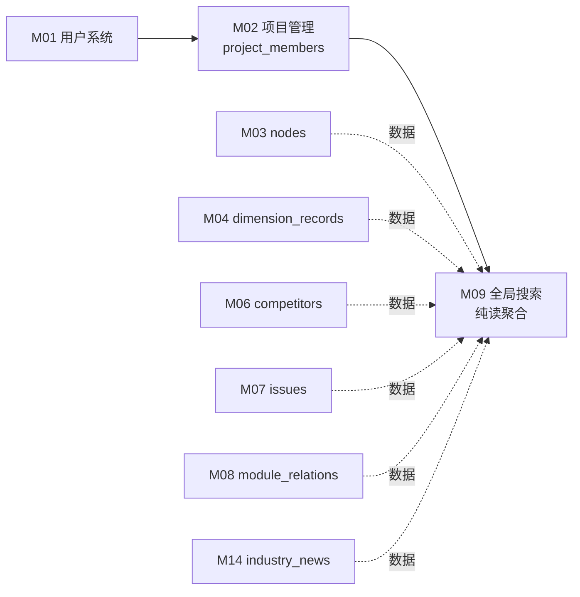

# M09 全局搜索 - 详细设计

> 对标 M04 同步 pilot 范本，纯读聚合模块。Tenant ✅ / 事务 ❌ / 异步 ❌ / 并发 ❌。
> 业务节凡 ⚠️ 标记处须 CY 复审裁决；M09 跨模块 Read 聚合方式强制标 ⚠️ 待主对话决策（见节 3）。

---

## 1. 业务说明 + 职责边界

### 业务说明

M09 对应 Prism F9，提供**关键词驱动的全局跨模块搜索**——跨 nodes / dimension_records / competitors / issues / industry_news / module_relations 多模块读取，按 project 边界过滤，仅返回用户有权访问的内容。

引用用户故事：
- **US-C1.3**（`feature-list-and-user-stories.md`）：作为查看者，我想搜索关键词快速找到相关功能项，搜索结果带上下文高亮，这样不用翻树逐个找
- **US-C2.2**（同文件）：作为查看者，我搜索时只能看到有权限的项目内容，这样不会越权

引用 PRD Q3（`design/00-architecture/01-PRD.md`）："围绕功能模块组织"——搜索必须能跨维度（功能描述、技术实现、测试分析等）找到功能项。

> **注意**：M09 是关键词搜索（ILIKE / PG 全文搜索），不是 M18 的语义搜索（pgvector）。两者独立，不同入口。

### In scope（M09 负责）

- **关键词搜索**：在用户有权访问的 project 范围内，跨多模块字段匹配关键词
- **权限过滤**：仅返回用户是成员的 project 内的内容（US-C2.2）
- **结果聚合**：将来自不同模块的结果合并，统一 result_type 区分
- **上下文摘要/高亮**：每条结果附带匹配片段（snippet），支持关键词高亮（US-C1.3）
- **分页**：结果分页返回（page / page_size）
- **搜索范围**：
  - `nodes`（M03）：节点名称
  - `dimension_records`（M04）：维度内容（JSONB text 字段）
  - `competitors`（M06）：竞品名称 + 备注
  - `issues`（M07）：问题标题 + 描述
  - `industry_news`（M14）：动态标题 + 摘要
  - `module_relations`（M08）：关联备注（notes 字段）

### Out of scope（其他模块负责）

| 不做的事 | 归属模块 |
|---------|---------|
| 语义搜索（向量相似度，pgvector） | M18 |
| 维度筛选（按维度类型过滤） | M09 扩展点，本期不实现（⚠️ 待 CY 确认是否本期） |
| 跨 project 搜索（无 project 边界） | 不在 scope（基于 US-C2.2 每条结果必须在有权限 project 内） |
| 搜索历史记录 | 不在 scope（PRD 未提及） |
| 写操作（搜索结果的 CRUD） | M09 纯读，所有写委托各自模块 |

### 边界灰区（显式说明）

- **搜索范围 project 边界**：⚠️ **AI 推断，CY 复审必改**——推断 M09 只搜索**用户有成员身份**的 project（IN 过滤），不支持全平台搜索。候选：A 仅成员 project（推断默认）/ B 用户提供 project_id 参数搜指定 project。

- **搜索算法选型**：⚠️ **AI 推断，CY 复审必改**——推断默认使用 PostgreSQL `ILIKE '%query%'`，简单可靠；PG 全文搜索（`tsvector`/`tsquery`）性能更好但需要额外迁移。候选：A ILIKE（推断默认）/ B PG 全文搜索（`to_tsquery`）。

- **维度内容搜索**：⚠️ **AI 推断，CY 复审必改**——`dimension_records.content` 是 JSONB，搜索时需转换为文本（`content::text ILIKE`）。此方式精度低（可能匹配到 JSON key 名），但实现简单。候选：A JSONB::text ILIKE（推断默认）/ B 专门对 content 建立 GIN 全文索引（性能好但迁移复杂）。

---

## 2. 依赖模块图



**前置依赖（必须先实现）**：M01 → M02 → M03/M04/M06/M07/M08/M14（各自先实现）→ M09

**依赖契约**：
- M02 提供：`project_members` 查询用户有权访问的 project_id 列表
- M03 提供：`nodes` 表 `(id, project_id, name, type, path)`
- M04 提供：`dimension_records` 表 `(id, node_id, project_id, content::text)`
- M06 提供：`competitors` 表 `(id, node_id, project_id, name, notes)`
- M07 提供：`issues` 表 `(id, node_id, project_id, title, description)`
- M08 提供：`module_relations` 表 `(id, project_id, source_node_id, target_node_id, notes)`
- M14 提供：`industry_news` 表 `(id, title, summary)`（M14 为全局数据，无 project_id，⚠️ 见节 9 豁免声明）

---

## 3. 数据模型

### M09 无主表

**M09 是纯读聚合模块，不拥有任何主表**——所有数据来自其他模块的表，M09 DAO 层只做 SELECT。

### ⚠️ 核心决策：跨模块 Read 聚合方式（待主对话决策是否起 ADR-003）

> **HARD-GATE 遵守**：本节不自行选定方案，仅列候选，留给 CY + 主对话决策（若涉及 ADR 起草则为 ADR-003）。

| 候选 | 方案描述 | 优点 | 缺点 | 推荐度 |
|------|---------|------|------|-------|
| **A：各模块 Service 提供 `search_by_keyword()` 接口，M09 聚合** | M03/M04/M06/M07/M08/M14 各自 Service 暴露 `search_by_keyword(query, project_id)` 方法；M09 Service 依次调用后合并结果 | 模块解耦，符合 R-X1 分层原则；各模块可独立优化搜索逻辑 | N 次 DB 查询（N = 搜索模块数）；分页 + 排序在内存层做聚合，性能有限 | ⭐⭐⭐（**推断倾向**，但最终由 CY 决定） |
| **B：独立 search_view 物化视图** | 创建 PG 物化视图聚合所有可搜索字段；M09 直查视图 | 单次 SQL，性能最优；关键词 + 全文索引可统一加 | 需维护视图刷新策略；每次上游表变更后 REFRESH MATERIALIZED VIEW（延迟或触发器） | ⭐⭐ |
| **C：M09 DAO 直接 JOIN 多表** | M09 DAO 层直接 JOIN nodes / dimension_records / competitors 等 | 实现最简 | **违反 R-X1**（跨模块直读其他模块表，破坏分层）；DAO 与所有上游表耦合，任一上游表变更影响 M09 | ❌ 不推荐 |

**当前状态**：⚠️ **待主对话评估是否起 ADR-003**，三个候选方案已列出，不自行拍板。

**搜索字段范围（各候选均适用）**：

| 模块 | 表 | 搜索字段 | result_type |
|------|-----|---------|------------|
| M03 | `nodes` | `name` | `node` |
| M04 | `dimension_records` | `content::text` | `dimension_record` |
| M06 | `competitors` | `name`, `notes` | `competitor` |
| M07 | `issues` | `title`, `description` | `issue` |
| M08 | `module_relations` | `notes` | `module_relation` |
| M14 | `industry_news` | `title`, `summary` | `industry_news` |

### 搜索结果虚拟模型（无 DB 持久化，仅 Pydantic）

```python
# api/schemas/search_schema.py
from pydantic import BaseModel, UUID4
from enum import Enum
from datetime import datetime


class SearchResultType(str, Enum):
    node = "node"
    dimension_record = "dimension_record"
    competitor = "competitor"
    issue = "issue"
    module_relation = "module_relation"
    industry_news = "industry_news"


class SearchResultItem(BaseModel):
    result_id: UUID4
    result_type: SearchResultType
    project_id: UUID4 | None       # industry_news 无 project_id，填 None
    project_name: str | None
    node_id: UUID4 | None          # 非节点类结果关联的 node
    node_name: str | None
    title: str                     # 主要展示文本
    snippet: str                   # 上下文摘要（含高亮标记）
    matched_field: str             # 哪个字段命中（用于前端区分展示）
    score: float | None            # 候选 B（全文搜索）时的相关度分数；ILIKE 时填 None
    created_at: datetime


class SearchResponse(BaseModel):
    items: list[SearchResultItem]
    total: int
    page: int
    page_size: int
    query: str
```

> **注意**：M09 不自建表，`SearchResultItem` 是纯 Pydantic 聚合结构，无 SQLAlchemy model。

---

## 4. 状态机

### 声明

M09 是**纯读聚合模块，无任何写操作**，无任何实体有状态字段，无状态机。

显式声明（按原则 4）：**M09 无状态实体**——搜索结果是临时聚合结构，不持久化；所有被搜索数据的状态归属各自模块。

---

## 5. 多人架构 4 维必答

按原则 5 + 约束清单逐项答。

| 维度 | 答案 | 实现细节 |
|------|------|---------|
| **Tenant 隔离** | ✅ IN 过滤 | DAO/Service 层查询时限定 `project_id IN (<用户有权限的 project_id 列表>)`；M14 行业动态为全局数据（无 project_id），豁免声明见节 9 |
| **多表事务** | ❌ N/A | M09 纯读，无写操作，无需事务 |
| **异步处理** | ❌ N/A | M09 全同步——关键词搜索是即时查询 |
| **并发控制** | ❌ N/A | 纯读无并发写冲突场景 |

### 约束清单逐项检查

| 清单项 | M09 是否触发 | 实现 |
|-------|-------------|------|
| 1. activity_log | ❌ 不触发（纯读操作）| 节 10 显式声明 |
| 2. 乐观锁 version | ❌ 不触发（无写操作） | N/A |
| 3. Queue payload tenant | ❌ 不触发（无 Queue） | N/A |
| 4. idempotency_key | ❌ 不触发（只读操作天然无幂等需求）| 节 11 |
| 5. DAO tenant 过滤 | ✅ 触发（IN 过滤策略）| 节 9 |

---

## 6. 分层职责表

| 层 | M09 涉及文件 | 该层职责 |
|----|------------|---------|
| **Page** | `web/src/app/search/page.tsx` | 搜索页面 SSR（可 CSR）；输入框 + 结果列表渲染；高亮处理 |
| **Component** | `web/src/components/business/search-bar.tsx`<br>`web/src/components/business/search-result-list.tsx` | 搜索输入 debounce；结果分页展示；result_type 图标区分 |
| **Server Action** | `web/src/actions/search.ts` | session 校验 / zod 入参校验（query 长度 / page 范围）/ fetch FastAPI |
| **Router** | `api/routers/search_router.py` | 路由定义 / `Depends(get_current_user)` 获取用户身份 / Pydantic schema |
| **Service** | `api/services/search_service.py` | 查用户有权限 project_ids / 聚合多模块搜索结果 / 分页 + snippet 生成 |
| **DAO** | `api/dao/search_dao.py`（候选 A 时为聚合入口；候选 B 时直查 search_view） | SQL 构建 + tenant IN 过滤 |
| **Model** | 无（不新建表）| — |
| **Schema** | `api/schemas/search_schema.py` | Pydantic 请求 / 响应（SearchRequest / SearchResponse / SearchResultItem） |

**禁止**：
- ❌ M09 DAO 直接 JOIN 其他模块表（候选 C 违反 R-X1）
- ❌ Router 直查 DB
- ❌ M09 写任何表（纯读模块）

---

## 7. API 契约

### Endpoints

| 方法 | 路径 | 用途 | Pydantic 入参 | 出参 |
|------|------|------|--------------|------|
| GET | `/api/search` | 全局关键词搜索（用户 IN 过滤） | `SearchRequest`（query params） | `SearchResponse` |
| GET | `/api/projects/{project_id}/search` | 指定 project 内关键词搜索 | `SearchRequest`（query params） | `SearchResponse` |

### Pydantic schema 草案

```python
# api/schemas/search_schema.py
from pydantic import BaseModel, UUID4, Field
from enum import Enum
from datetime import datetime
from typing import Literal


class SearchResultType(str, Enum):
    node = "node"
    dimension_record = "dimension_record"
    competitor = "competitor"
    issue = "issue"
    module_relation = "module_relation"
    industry_news = "industry_news"


class SearchResultItem(BaseModel):
    result_id: UUID4
    result_type: SearchResultType
    project_id: UUID4 | None       # industry_news 无 project_id
    project_name: str | None
    node_id: UUID4 | None
    node_name: str | None
    title: str
    snippet: str                   # 含 <mark>keyword</mark> 标记的上下文片段
    matched_field: str             # 如 "name" / "content" / "title" / "notes"
    score: float | None
    created_at: datetime


class SearchResponse(BaseModel):
    items: list[SearchResultItem]
    total: int
    page: int
    page_size: int
    query: str


class SearchRequest(BaseModel):
    """Query params（FastAPI 自动从 query string 解析）"""
    q: str = Field(..., min_length=1, max_length=200, description="搜索关键词")
    page: int = Field(default=1, ge=1)
    page_size: int = Field(default=20, ge=1, le=100)
    # ⚠️ AI 推断，CY 复审必改——是否支持 result_type 过滤
    # result_types: list[SearchResultType] | None = None
```

---

## 8. 权限三层防御点

| 层 | 检查 | 实现 |
|----|------|------|
| **Server Action** | session 是否有效 | `getServerSession()`；无则 401 |
| **Router** | 用户是否登录（任意登录用户可搜索，无 project 级角色要求） | `Depends(get_current_user)`；未登录则 401 |
| **Service** | 搜索结果过滤到用户有权限的 project | `_get_accessible_project_ids(user_id)` 查 `project_members`；IN 过滤保证越权内容不出现在结果中（US-C2.2） |

> **指定 project 搜索时额外检查**：`/api/projects/{project_id}/search` 路由需在 Router 层增加 `Depends(check_project_access(project_id, role="viewer"))`，Service 层只搜该 project。

**异步路径**：M09 无异步，三层即足够（无需 Queue 消费者侧权限）。

---

## 9. DAO tenant 过滤策略

### 主查询策略（IN 过滤）

M09 无主表，tenant 过滤通过限定搜索范围实现：

```python
# api/dao/search_dao.py（候选 A 方案示例）

class SearchDAO:
    def search_nodes(
        self, db: Session, query: str, project_ids: list[UUID]
    ) -> list[dict]:
        """搜索 nodes.name（候选 A：各模块 DAO 提供 search 方法）"""
        return (
            db.query(Node)
            .filter(
                Node.project_id.in_(project_ids),  # ← tenant IN 过滤
                Node.name.ilike(f"%{query}%"),
            )
            .all()
        )

    def search_issues(
        self, db: Session, query: str, project_ids: list[UUID]
    ) -> list[dict]:
        return (
            db.query(Issue)
            .filter(
                Issue.project_id.in_(project_ids),  # ← tenant IN 过滤
                (Issue.title.ilike(f"%{query}%"))
                | (Issue.description.ilike(f"%{query}%")),
            )
            .all()
        )
    # ... 其他模块类似
```

### 豁免清单

| 豁免项 | 原因 | 处理方式 |
|-------|------|---------|
| `industry_news`（M14） | 全局共享数据，无 `project_id` 字段（M14 catalog：Tenant ❌ 全局共享）| M09 搜索 industry_news 时**不加 project_id 过滤**；但展示时标注"全局内容"，不关联具体 project |

### 防绕过纪律

- `_get_accessible_project_ids(user_id)` 查询结果不缓存（每次搜索实时查 project_members，防 role 降级后缓存残留）
- ⚠️ **AI 推断，CY 复审必改**——若需要缓存优化，需评估 Redis TTL 与权限变更延迟的权衡

---

## 10. activity_log 事件清单

**M09 是纯读聚合模块，无任何写操作，无 activity_log 事件。**

显式声明（按清单 1 豁免条件）：搜索是只读操作，不触发 activity_log。

---

## 11. idempotency_key 适用清单

**M09 无 idempotency 需求。**

**理由**：搜索是只读操作，GET 请求天然幂等（RFC 9110），无需 idempotency_key。

显式声明（R11-1）：**M09 无 idempotency_key 操作**。

`project_id` 是否参与 key 计算（R11-2）：**不适用**——M09 无幂等键设计。

---

## 12. Queue payload schema

**N/A**——M09 无异步处理，无 Queue 任务。

显式声明（按原则 5 清单 3 要求）：**M09 不投递 Queue 任务**。

---

## 13. ErrorCode 新增清单

### 新增 ErrorCode（注册到 `api/errors/codes.py`）

```python
class ErrorCode(str, Enum):
    # ... 已有

    # M09 全局搜索
    SEARCH_QUERY_TOO_SHORT = "SEARCH_QUERY_TOO_SHORT"   # 关键词长度 < 1（Pydantic 先拦，兜底）
    SEARCH_QUERY_TOO_LONG = "SEARCH_QUERY_TOO_LONG"     # 关键词长度 > 200
    SEARCH_PROJECT_ACCESS_DENIED = "SEARCH_PROJECT_ACCESS_DENIED"  # 指定 project 无权访问
```

### 新增 AppError 子类（`api/errors/exceptions.py`）

```python
class SearchQueryTooShortError(AppError):
    code = ErrorCode.SEARCH_QUERY_TOO_SHORT
    http_status = 422
    message = "Search query must be at least 1 character"


class SearchQueryTooLongError(AppError):
    code = ErrorCode.SEARCH_QUERY_TOO_LONG
    http_status = 422
    message = "Search query must be at most 200 characters"


class SearchProjectAccessDeniedError(AppError):
    code = ErrorCode.SEARCH_PROJECT_ACCESS_DENIED
    http_status = 403
    message = "You do not have access to the specified project"
```

### 复用已有

- `UNAUTHENTICATED`——未登录时复用
- `PERMISSION_DENIED`——通用权限拒绝（可复用，`SEARCH_PROJECT_ACCESS_DENIED` 是语义更精确的子类）
- `NOT_FOUND`——project 不存在时复用（不暴露 forbidden 信息）

---

## 14. 测试场景

详见独立文件：[`tests.md`](./tests.md)

主文档大纲：
- **golden path**：关键词命中节点 / 命中维度内容 / 命中竞品 / 命中问题 / 混合结果 + 分页
- **边界**：空关键词 / 超长关键词 / 无结果 / page 越界 / 特殊字符（SQL 注入防护）
- **并发**：纯读无并发场景（显式声明）
- **tenant**：跨 project 越权 / 结果仅含有权限 project / 全局数据不过滤
- **权限**：未登录 / 指定 project 无 viewer 权限 / viewer 可搜索
- **错误处理**：无结果不报错 / DB 错误 / 超时处理

---

## 15. 完成度判定 checklist

- [x] 节 1：业务说明引 US-C1.3 + US-C2.2 + PRD Q3；in/out scope 完整；M09 vs M18 区分明确
- [x] 节 2：依赖图覆盖全部上游模块（M03/M04/M06/M07/M08/M14）
- [x] 节 3：无主表声明 + ⚠️ 跨模块 Read 聚合三候选完整列出 + 待 ADR-003 标记
- [x] 节 4：无状态实体显式声明
- [x] 节 5：4 维必答（无 ⚠️ 占位）+ 5 项清单逐项标
- [x] 节 6：分层职责表每层文件路径具体
- [x] 节 7：2 个 endpoint + 完整 Pydantic schema + 强类型枚举
- [x] 节 8：三层防御 + 异步路径声明 + 指定 project 路由额外说明
- [x] 节 9：IN 过滤策略 + M14 豁免清单（显式声明）
- [x] 节 10：无 activity_log（纯读，显式声明）
- [x] 节 11：idempotency 无（显式声明 + R11-2 回答）
- [x] 节 12：Queue 显式 N/A
- [x] 节 13：3 个 ErrorCode + 3 个 AppError 子类（R13-1 满足）
- [x] 节 14：tests.md 测试场景大纲写完
- [x] 节 15：本 checklist
- [ ] **🔴 第一轮 reviewer audit（完整性）通过**
- [ ] **🔴 第二轮 reviewer audit（边界场景）通过**
- [ ] **🔴 第三轮 reviewer audit（演进 / 模板可复用性）通过**
- [ ] CY 全文复审通过 → status 转 accepted

---

## ⚠️ 待 CY 裁决项汇总

| # | 节 | 决策点 | AI 默认值 | 候选 | ADR 触发 |
|---|----|-------|----------|------|---------|
| Q1 | 3 | 跨模块 Read 聚合方式 | **A 各模块 Service 提供 search_by_keyword()** | B 物化视图 / C 直 JOIN（不推荐）| ⚠️ **可能触发 ADR-003**，待主对话评估 |
| Q2 | 1 | 搜索算法：ILIKE vs PG 全文搜索 | **A ILIKE**（简单） | B `to_tsquery`（性能好，需迁移）| 无 ADR，但影响 M09 DAO 实现 |
| Q3 | 1 | dimension_records.content 搜索方式 | **A JSONB::text ILIKE** | B GIN 全文索引 | 无 ADR，但影响迁移 |
| Q4 | 1 | 搜索范围：所有可访问 project vs 指定 project | **A 用户所有可访问 project** | B 必须指定 project_id | 无 ADR |
| Q5 | 9 | industry_news tenant 豁免缓存 | **无缓存**（实时查）| 加 Redis TTL 缓存（需评估延迟） | 无 ADR |

---

## 关联参考

- 上游设计：
  - `design/00-architecture/04-layer-architecture.md`（5 层 / 三层权限）
  - `design/00-architecture/05-module-catalog.md`（M09 4 维标注）
  - `design/00-architecture/06-design-principles.md`（原则 5 + 5 项清单）
  - `design/00-architecture/07-capability-matrix.md`（M09 能力定位）
- 工程规约：`design/01-engineering/01-engineering-spec.md`
- 被搜索模块：M03/M04/M06/M07/M08/M14 各自 00-design.md
- ADR 预警：若选候选 A，考虑起 `design/adr/ADR-003-cross-module-read.md`
- Prism 对照参考：`/root/cy/prism/web/src/db/schema.ts`（参考字段命名，不直接抄）
- 用户故事来源：`/root/cy/prism/docs/product/feature-list-and-user-stories.md`（US-C1.3 / US-C2.2）
