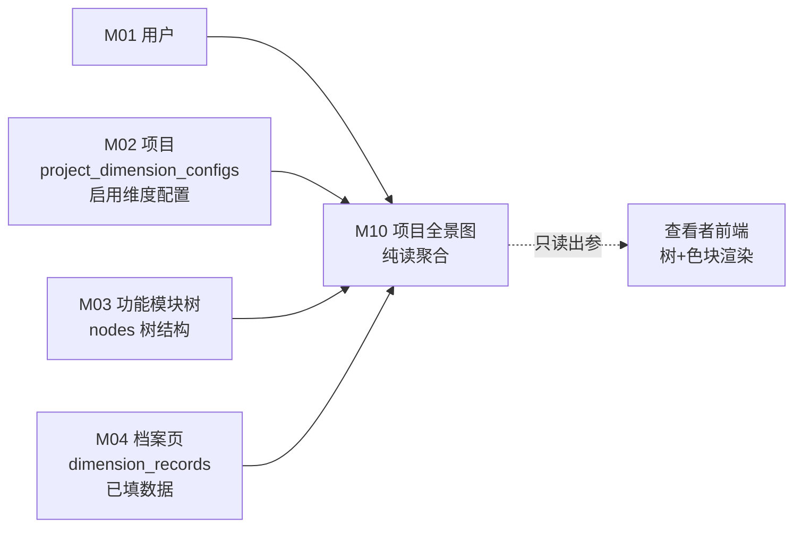

# M10 项目全景图 - 详细设计

> 纯读聚合模块——跨 M02/M03/M04 读，无自有写表（有选项添加缓存表，见 §3 决策点）。
> **CY 2026-04-21 决策记录见 §15，业务决策已 accepted**

---

## 1. 业务说明 + 职责边界

### 业务背景（引自 PRD / US）

**核心用户故事**：
- **US-C1.1**（`/root/cy/prism/docs/product/feature-list-and-user-stories.md`）：作为查看者，我想在项目全景图上看到所有模块的完善度色块，这样一眼知道哪些模块信息充分、哪些还缺。
- **PRD Q3**（`design/00-architecture/01-PRD.md`）：围绕"功能模块"组织——全景图是功能模块视角的汇总入口，让用户在不进入档案页的情况下掌握整体信息质量状态。
- **PRD Q3.1**：功能模块视角为进入项目后默认呈现（左侧模块树 + 右侧档案页）——全景图是这一默认视图的聚合摘要，位于 `/project/:id` 概览页。

**业务定位**：M10 是只读聚合视图。它以 M03 的 nodes 树为骨架，以 M02 的 dimension 配置为分母，以 M04 的 dimension_records 填充数量为分子，计算每个节点的"完善度"并以色块形式展示。

### In scope（M10 负责）

- **树形完善度展示**：按 M03 nodes 树结构，渲染每个节点的完善度色块（深色=高完善度，浅色/灰=低完善度）
- **完善度计算**：`completion_rate = 已填维度数 / 启用维度数`（启用维度数来自 M02 `project_dimension_configs`）
- **统计汇总**：项目整体完善度（所有节点均值）/ 已填完节点数 / 总节点数
- **节点列表读取**：基于 project_id 读取 M03 nodes 全树（含层级 / 排序 / path）
- **单节点完善度查询**：支持按 node_id 查单节点完善度（供 M04 档案页完善度进度条复用）

### Out of scope（其他模块负责）

| 不做的事 | 归属模块 |
|---------|---------|
| 节点 CRUD（增删改树结构）| M03 |
| 维度记录编辑 | M04 |
| 维度配置管理（启用/禁用）| M02 |
| 搜索（跨节点关键词）| M09 |
| 需求分析 AI | M13 |
| AI 快照生成 | M16 |

### 边界灰区（显式说明）

- **单 project vs 跨 project**：**CY ack 候选 A 单 project 视图**——US-C1.1 语境明确为单 project（路径 `/project/:id`），不跨 project。
- **完善度计算分母**：**CY ack 候选 A 按 project 启用维度**——分母为该 project 启用的维度数（M02 `project_dimension_configs`）；不同项目可启用不同维度子集。
- **folder 节点完善度**：**CY ack 候选 A 子节点均值**——folder 节点显示其子树 file 节点的均值完善度（汇总），file 节点显示自身完善度。算法见 §3 folder 均值计算说明。
- **跨模块 Read 聚合方式**：已采纳 ADR-003 规则 2（只读 import 上游 model 豁免），见 §3。

---

## 2. 依赖模块图



**前置依赖（必须先实现）**：M01 → M02 → M03 → M04

**依赖契约**（M10 假设上游提供）：
- M01：`current_user`（user_id / role）
- M02：`project_dimension_configs(project_id)` 返回启用维度列表（M10 用于计算分母）
- M03：`nodes(project_id)` 返回完整树（含 parent_id / depth / sort_order / path / type）
- M04：`dimension_records(project_id)` 返回该项目所有已填维度记录（M10 聚合分子）

**M10 对所有上游表仅执行只读操作，不写任何上游表。**

---

## 3. 数据模型（SQLAlchemy + Alembic 要点）

### 核心决策点（ADR-003 规则 2 已采纳）

M10 是纯读聚合模块，其数据全部来自 M02/M03/M04 跨表 JOIN。**跨模块 Read 聚合方式**：ADR-003 规则 2（只读 import 上游 model 豁免，方案 A 实时 JOIN）。

**三种候选方案**：

| 方案 | 描述 | 优点 | 缺点 | 是否起 ADR-003 |
|------|------|------|------|---------------|
| **A. 实时 JOIN** | 每次请求时 M10 DAO 直接 JOIN nodes + project_dimension_configs + dimension_records | 数据实时准确；无缓存失效问题；无额外表 | 项目节点数多时查询慢（N+1 风险）；跨模块 JOIN 可能违反分层 | 否（M10 独立 DAO 直查） |
| **B. 缓存快照表** | 维护 `overview_cache` 表，由 M04 写入时触发异步更新或定时刷新 | 查询 O(1)；前端响应快 | 引入缓存失效逻辑；数据有延迟；M04 需要感知 M10 | 可选（缓存更新方式影响是否需要 ADR） |
| **C. ADR-003 Read Model 统一层** | 建立跨模块 Read Model 服务，M10/M09/M15 统一走 Read 层 | 全局一致；解耦 | 新增一层架构复杂度；需主对话出 ADR-003 决策 | 是 |

**已采纳方案 A（实时 JOIN）**：ADR-003 规则 2 豁免，CY 2026-04-21 ack。若未来决策升级为方案 B/C，§3/§6/§7/§9 需联动修改（改回成本见下方）。

**候选 B/C 改回成本（R3-4）**：
- A→B：新增 1 张 `overview_cache` 表 + Alembic 迁移 2-3 步；M04 Service 需增 cache 更新调用（1 个模块联动）；历史数据需重建缓存（可脚本，可逆）
- A→C：起 ADR-003；新增 Read Model 层文件；M10/M09/M15 同步联动修改（3 个模块）；架构层面新增 1 层（影响分层架构文档）

---

### M10 无自有实体表（基线方案 A）

**本模块无自有实体表，§3 适用纯读聚合规范（R3-5），采纳 ADR-003 规则 2：只读 import 上游 model 豁免。**

引用：[`adr/ADR-003-cross-module-read-strategy.md`](../../adr/ADR-003-cross-module-read-strategy.md)

M10 在方案 A 下不创建任何新表。完善度数据通过查询以下上游表计算得出：

| 上游表 | 归属模块 | 访问方式 |
|--------|---------|---------|
| `nodes` | M03 主 | OverviewDAO 只读 import Node model + JOIN 查询（ADR-003 规则 2 豁免）|
| `project_dimension_configs` | M02 主 | OverviewDAO 只读 import ProjectDimensionConfig model + JOIN 查询（ADR-003 规则 2 豁免）|
| `dimension_records` | M04 主 | OverviewDAO 只读 import DimensionRecord model + JOIN 查询（ADR-003 规则 2 豁免）|
| `projects` | M02 主 | 只读（SELECT，校验 project 存在 + tenant 归属）|

### SQLAlchemy 视角（只读引用，无新 model 文件）

M10 不定义新的 SQLAlchemy model。DAO 层直接 import 并 query 上游模型（ADR-003 规则 2 豁免：可只读 import 上游 model，禁止 INSERT/UPDATE/DELETE）：

```python
# api/dao/overview_dao.py
# ADR-003 规则 2 豁免：本 DAO 只读 import 上游 model，禁止 INSERT/UPDATE/DELETE
# M10 只读 DAO——引用上游模型，不定义新实体

from sqlalchemy.orm import Session
from sqlalchemy import func, and_
from uuid import UUID as PyUUID

from api.models.node import Node                                    # M03 模型（只读 import，ADR-003 规则 2 豁免）
from api.models.project_dimension_config import ProjectDimensionConfig  # M02 模型（只读 import，ADR-003 规则 2 豁免）
from api.models.dimension_record import DimensionRecord             # M04 模型（只读 import，ADR-003 规则 2 豁免）


class OverviewDAO:
    """
    M10 只读 DAO。
    ADR-003 规则 2 豁免：只读 import 上游 model 做 JOIN 聚合，禁止 INSERT/UPDATE/DELETE。
    方案 A：实时 JOIN，不写任何表。
    # 方案 A 已采纳（ADR-003 规则 2 豁免）；若未来升级方案 B/C，此 DAO 需联动重写。
    """

    def count_enabled_dimensions(self, db: Session, project_id: PyUUID) -> int:
        """返回项目启用维度数（全局分母，不区分节点类型）"""
        return (
            db.query(func.count(ProjectDimensionConfig.id))
            .filter(
                ProjectDimensionConfig.project_id == project_id,  # tenant 过滤
                ProjectDimensionConfig.enabled == True,
            )
            .scalar()
        ) or 0

    def list_nodes_with_fill_count(
        self, db: Session, project_id: PyUUID
    ) -> list[dict]:
        """
        返回项目所有节点 + 每节点已填维度数。
        一条 SQL：nodes LEFT JOIN dimension_records GROUP BY node_id。
        # 两次查询（count_enabled_dimensions + list_nodes_with_fill_count）在同一 DB session 内执行
        # （同一请求生命周期），接受短窗口不一致（几毫秒级）；如需严格一致可升级 REPEATABLE READ 隔离级别。
        """
        rows = (
            db.query(
                Node.id,
                Node.parent_id,
                Node.name,
                Node.type,
                Node.depth,
                Node.sort_order,
                Node.path,
                func.count(DimensionRecord.id).label("filled_count"),
            )
            .outerjoin(
                DimensionRecord,
                and_(
                    DimensionRecord.node_id == Node.id,
                    DimensionRecord.project_id == project_id,  # tenant 过滤（冗余字段）
                ),
            )
            .filter(Node.project_id == project_id)             # tenant 过滤
            .group_by(Node.id)
            .order_by(Node.depth, Node.sort_order)
            .all()
        )
        return [row._asdict() for row in rows]
```

### Alembic 要点

- M10 方案 A：**无 Alembic 迁移**——不新增表，依赖上游已有表。
- 方案 B：需新增 `overview_cache` 表（待 CY 决策后补充）。

### folder 均值计算实现说明（M10-B2）

folder 节点的完善度 = 其子树 file 节点的均值 `completion_rate`。

实现方式：**迭代（bottom-up 后序遍历）**，非递归（CY ack D-1）。
- 选迭代非递归：避免深层树栈溢出（Python 默认递归栈深度 1000，深层树风险）
- 推荐用 `collections.deque` 从叶节点向根节点逐级计算，或基于 M03 `node.path` 前缀排序（深度大的先处理）实现迭代后序遍历
- M03 nodes 无 depth 硬限制，但实际 depth > 20 极罕见（CY 使用场景下）

### 分母=0 处理时机说明（M10-B3）

`Service.get_overview` 执行顺序：
1. 第一步：调 `OverviewDAO.count_enabled_dimensions(db, project_id)`
2. **若返回值 == 0，立即 raise `OverviewNoDimensionsError(422)`**，不进入节点聚合查询（不调 `list_nodes_with_fill_count`）
3. 若 > 0，继续调 `list_nodes_with_fill_count` 聚合计算

此设计确保"分母=0"时响应一致性——不会出现"部分节点已计算但最终 422 中断"的半成品状态。

---

## 4. 状态机（无状态显式说明）

M10 无自有实体表，无状态字段，无状态机。

显式声明（按原则 4）：**M10 无状态实体**。

M10 是纯读聚合，每次请求返回当前时刻的聚合快照；完善度数值不持久化为状态，由查询实时计算得出（方案 A）。

---

## 5. 多人架构 4 维必答

按原则 5 + 约束清单逐项答（即使是"不涉及"也显式写）。

| 维度 | 答案 | 实现细节 |
|------|------|---------|
| **Tenant 隔离** | ✅ project_id | DAO 层所有 SELECT 强制带 `WHERE nodes.project_id = ?` / `WHERE project_dimension_configs.project_id = ?` / `WHERE dimension_records.project_id = ?`；Service 层校验 project 归属用户 |
| **多表事务** | ❌ N/A | M10 纯读，无写操作，无事务需求 |
| **异步处理** | ❌ N/A | M10 全同步 GET——全景图是用户即时浏览，无后台任务、无 Queue、无流式 |
| **并发控制** | ❌ N/A | M10 纯读，无并发写冲突场景。多用户同时读全景图不产生冲突 |

### 约束清单逐项检查（呼应 06-design-principles 的 5 项清单）

| 清单项 | M10 是否触发 | 实现 |
|-------|-------------|------|
| 1. activity_log（所有变更操作必须写）| ❌ 不触发——M10 纯读，无变更操作 | 节 10 显式说明 |
| 2. 乐观锁 version | ❌ 不触发——纯读无并发写 | N/A |
| 3. Queue payload tenant | ❌ 不触发——无 Queue | N/A |
| 4. idempotency_key | ❌ 不触发——纯读 GET | 节 11 显式说明 |
| 5. DAO tenant 过滤 | ✅ 触发——三张上游表均需 tenant 过滤 | 节 9 列具体 DAO 实现 |

---

## 6. 分层职责表（呼应 04-layer-architecture）

| 层 | M10 涉及文件 | 该层职责 |
|----|------------|---------|
| **Page** | `web/src/app/projects/[pid]/page.tsx` | SSR 渲染项目概览页；包含全景图树 + 完善度色块 + 统计数字；调 Server Action 拿全景图数据 |
| **Component** | `web/src/components/business/overview-tree.tsx`<br>`web/src/components/business/completion-badge.tsx` | 树形结构渲染 + 色块着色逻辑（根据 completion_rate 映射颜色）；folder 节点展开/折叠 |
| **Server Action** | `web/src/actions/overview.ts` | session 校验 / 调 FastAPI GET 全景图 |
| **Router** | `api/routers/overview_router.py` | 路由定义 / `Depends(check_project_access)` / Pydantic schema 出参；纯 GET，无写操作 |
| **Service** | `api/services/overview_service.py` | 聚合逻辑：调 DAO 拿 nodes + fill_count + enabled_count → 计算每节点 completion_rate → 计算 folder 节点汇总均值；tenant 二次校验 |
| **DAO** | `api/dao/overview_dao.py` | 只读 SQL：nodes + dimension_records JOIN + project_dimension_configs 查询；强制 tenant 过滤 |
| **Model** | 无新 model 文件——引用 M02/M03/M04 的 `node.py` / `project_dimension_config.py` / `dimension_record.py` | 上游 SQLAlchemy 模型复用 |
| **Schema** | `api/schemas/overview_schema.py` | Pydantic 响应 schema（OverviewResponse / NodeOverview / OverviewStats）|

**禁止**（呼应规约）：
- ❌ Router 直 `db.query(Node)` 跳过 Service
- ❌ OverviewDAO 执行 INSERT / UPDATE / DELETE（违反 ADR-003 规则 2 豁免边界——只读 import 豁免仅限只读查询，写入必须走各模块自己的 Service）

---

## 7. API 契约（Pydantic + OpenAPI 路径表）

### Endpoints

| 方法 | 路径 | 用途 | Pydantic 入参 | 出参 |
|------|------|------|--------------|------|
| GET | `/api/projects/{project_id}/overview` | 项目全景图（全树 + 完善度）| — | `OverviewResponse` |
| GET | `/api/projects/{project_id}/overview/stats` | 项目整体统计数字 | — | `OverviewStatsResponse` |
| GET | `/api/projects/{project_id}/nodes/{node_id}/completion` | 单节点完善度（M04 档案页复用）| — | `NodeCompletionResponse` |

### Pydantic schema 草案

```python
# api/schemas/overview_schema.py
from pydantic import BaseModel, ConfigDict
from uuid import UUID
from enum import Enum


class NodeType(str, Enum):
    folder = "folder"
    file = "file"


class NodeOverview(BaseModel):
    """单节点完善度信息"""
    model_config = ConfigDict(from_attributes=True)

    id: UUID
    parent_id: UUID | None
    name: str
    type: NodeType
    depth: int
    sort_order: int
    path: str
    # 完善度字段
    filled_count: int            # 已填维度数（file 节点实际值；folder 节点为子树汇总）
    enabled_count: int           # 项目启用维度数（分母，全 project 一致）
    completion_rate: float       # 0.0 - 1.0
    # 子节点（嵌套展开，前端树渲染用）
    children: list["NodeOverview"] = []


NodeOverview.model_rebuild()  # Pydantic v2 自引用模型必须调用，否则运行时 PydanticUserError


class OverviewStats(BaseModel):
    """项目整体统计"""
    total_nodes: int             # 节点总数（含 folder + file）
    file_nodes: int              # file 节点数
    fully_complete_nodes: int    # completion_rate = 1.0 的 file 节点数
    empty_nodes: int             # completion_rate = 0.0 的 file 节点数
    avg_completion_rate: float   # 所有 file 节点均值
    enabled_dimension_count: int # 项目启用维度数


class OverviewResponse(BaseModel):
    """项目全景图完整响应"""
    project_id: UUID
    tree: list[NodeOverview]     # 顶层节点列表（含嵌套 children）
    stats: OverviewStats


class OverviewStatsResponse(BaseModel):
    """仅统计数字（轻量接口）"""
    project_id: UUID
    stats: OverviewStats


class NodeCompletionResponse(BaseModel):
    """单节点完善度（M04 档案页完善度进度条复用）"""
    node_id: UUID
    filled_count: int
    enabled_count: int
    completion_rate: float
```

**说明**：
- `NodeOverview.children` 嵌套结构由 Service 层在内存中组装（从 DAO flat list → 树形）
- 观察项：若节点数量极大（>1000），嵌套组装可能有性能问题——此为潜在优化点，初版不处理

**completion_level 前端色块阈值常量**（CY ack C-4，候选 A 严格 3 档）：
```typescript
// web/src/constants/overview.ts
// CY 2026-04-21 ack：3 档严格阈值（候选 A）
export const COMPLETION_THRESHOLDS = {
  RED: 0.3,    // completion_rate < 0.3 → 红色（待补充）
  GREEN: 0.7,  // completion_rate > 0.7 → 绿色（良好）
  // 0.3 ≤ completion_rate ≤ 0.7 → 黄色（部分完成）
} as const;
// 颜色映射：RED < 0.3 / YELLOW 0.3-0.7 / GREEN > 0.7
```

---

## 8. 权限三层防御点（呼应 04-layer-architecture Q4）

| 层 | 检查 | 实现 |
|----|------|------|
| **Server Action** | session 是否有效 | `getServerSession()`；无则 401 |
| **Router** | 用户对 project 是否有 ≥ viewer 权限 | `Depends(check_project_access(project_id, role="viewer"))`；全景图查看者权限即可访问 |
| **Service** | project_id 是否真实存在 + 用户真实有权限访问 | `_check_project_access(user_id, project_id)`；project 不存在或用户不在成员表抛 NotFoundError |

**异步路径**：M10 无异步，三层即足够（无 Queue 消费者侧权限）。

---

## 9. DAO tenant 过滤策略（呼应原则 5 清单 5）

### 三张上游表 tenant 过滤规则

| 上游表 | 过滤条件 | 字段来源 |
|--------|---------|---------|
| `nodes` | `WHERE nodes.project_id = :project_id` | M03 nodes 直接带 project_id |
| `dimension_records` | `WHERE dimension_records.project_id = :project_id` | M04 冗余 project_id 字段（批量统一规则）|
| `project_dimension_configs` | `WHERE project_dimension_configs.project_id = :project_id` | M02 直接带 project_id |

### 豁免清单

无——M10 所有查询都在单 project 边界内。

### 防绕过纪律

- OverviewDAO 所有方法**强制带 project_id 入参**，DAO 内部不从外部推断 project_id
- Router 层 project_id 来自 path 参数，Service 层二次校验用户是否真实有权
- M10 DAO 不接受无 project_id 的查询入参

---

## 10. activity_log 事件清单（呼应清单 1）

**M10 无 activity_log 事件**。

理由：
- M10 纯读聚合，无任何写操作（INSERT / UPDATE / DELETE）
- 约束清单 1 规定"所有变更操作必须写 activity_log"——M10 无变更操作，豁免
- 用户浏览全景图的行为（page view）**不写 activity_log**（当前不记录；若未来需要"谁查看了全景图"审计，可追加 view 事件——作为观察项留存）

---

## 11. idempotency_key 适用操作清单（呼应清单 4）

**M10 无 idempotency_key 操作**。

显式声明（按原则 5 清单 4 要求）：M10 全部为 GET 只读操作，天然幂等，无需 idempotency_key。

---

## 12. Queue payload schema（异步模块；同步 N/A）

**N/A**——M10 无异步处理，无 Queue 任务。

显式声明（按 §12 分支规则）：**M10 不投递 Queue 任务**。

---

## 13. ErrorCode 新增清单（呼应规约 7）

### 新增 ErrorCode（注册到 `api/errors/codes.py`）

```python
class ErrorCode(str, Enum):
    # ... 已有
    # 模块（M10）
    OVERVIEW_PROJECT_NOT_FOUND = "OVERVIEW_PROJECT_NOT_FOUND"    # project 不存在或无权限
    OVERVIEW_NODE_NOT_FOUND    = "OVERVIEW_NODE_NOT_FOUND"       # 单节点查询 node 不存在
    OVERVIEW_NO_DIMENSIONS     = "OVERVIEW_NO_DIMENSIONS"        # 项目未配置任何启用维度（分母=0，无法计算完善度）
```

### 新增 AppError 子类（`api/errors/exceptions.py`）

```python
class OverviewProjectNotFoundError(NotFoundError):
    code = ErrorCode.OVERVIEW_PROJECT_NOT_FOUND
    message = "Project not found or access denied"

class OverviewNodeNotFoundError(NotFoundError):
    code = ErrorCode.OVERVIEW_NODE_NOT_FOUND
    message = "Node not found in this project"

class OverviewNoDimensionsError(AppError):
    code = ErrorCode.OVERVIEW_NO_DIMENSIONS
    http_status = 422
    message = "Project has no enabled dimensions configured; completion rate cannot be calculated"
```

### 复用已有

- `PERMISSION_DENIED` / `UNAUTHENTICATED`——复用
- `NOT_FOUND`——上游表通用 404 复用；M10 特化为以上两个子类

---

## 14. 测试场景

详见独立文件：[`tests.md`](./tests.md)

主文档只列大纲：
- **golden path**：查询全景图树 + 统计 / 单节点完善度 / folder 节点汇总均值
- **边界**：空项目（无节点）/ 无启用维度 / 节点只有 folder 无 file / 所有节点完善度 0%
- **并发**：M10 纯读无并发场景（显式说明）
- **tenant**：跨项目越权读 / DAO 过滤覆盖
- **权限**：未登录读 / viewer 正常读 / 无成员读
- **错误处理**：project 不存在 / 无启用维度返回 422

---

## 15. 完成度判定 checklist + CY 决策记录

### checklist

- [x] 节 1：职责边界 in/out scope 完整；引 PRD Q3 / Q3.1 / US-C1.1
- [x] 节 2：依赖图覆盖所有上游模块（M01/M02/M03/M04）
- [x] 节 3：无自有表声明（R3-5）+ 上游 model 清单（访问方式列）+ ADR-003 规则 2 引用 + OverviewDAO 豁免注释 + 分母=0 处理时机（不得误勾 R3-1 "SQLAlchemy class 代码块"）
- [x] 节 4：无状态实体显式声明（按原则 4 要求）
- [x] 节 5：4 维必答（含"不涉及"显式说明）；5 项清单逐项标注；无 ⚠️ 占位（符合 R5-1）
- [x] 节 6：分层职责表完整（每层文件路径明确）
- [x] 节 7：3 个 API endpoint + Pydantic schema 草案（含枚举 NodeType）
- [x] 节 8：权限三层防御 + 异步路径声明（M10 无异步）
- [x] 节 9：三张上游表 tenant 过滤规则 + 豁免清单（无）
- [x] 节 10：activity_log 无事件显式说明
- [x] 节 11：idempotency 无显式声明
- [x] 节 12：Queue 显式 N/A
- [x] 节 13：3 个 ErrorCode + 对应 AppError 子类（R13-1 满足）
- [x] 节 14：tests.md 场景大纲
- [x] 节 15：CY 决策记录表（2026-04-21 ack）
- [ ] **🔴 第一轮 reviewer audit（完整性）通过**
- [ ] **🔴 第二轮 reviewer audit（边界场景）通过**
- [ ] **🔴 第三轮 reviewer audit（演进 / 模板可复用性）通过**
- [ ] CY 全文复审通过 → status 转 accepted

### C 类决策补对比（2026-04-21）

> C 类决策补对比，CY 2026-04-21 已 ack（见底部）。候选 A/B/C/D 文字结构保留作历史记录。

---

### C-M10-1：色块完善度阈值（C 类补对比，2026-04-21）

**当前状态**：M10 全景图节点按 completion_rate 显示色块（红/黄/绿），但文档未定义阈值分档规则——无任何数字界定。

**候选 A/B/C/D**（业务场景对比）：

| 候选 | 业务场景（CY 实际用法）| 实现影响 |
|------|---------------------|---------|
| **A：3 档严格（< 30% 红 / 30-70% 黄 / > 70% 绿）** | CY 打开全景图：维度只填了 1/4 的节点显示红色警告、填了一半显示黄色待完善、填了七成以上才绿。对于"个人知识库系统性建立行业知识"的 CY，维度缺失超 70% 就是"待补"——红色警告驱动力足，帮助她 locate 下一步该补什么。30% 作为红线符合"完成不到三成就是空的"直觉 | 纯前端 constants 文件 1 行配置：`const THRESHOLDS = {red: 0.3, green: 0.7}`；无后端影响 |
| **B：3 档宽松（< 50% 红 / 50-80% 黄 / > 80% 绿）** | CY 打开全景图：填了 40% 的节点显示红色（比候选 A 多），填了 60% 的节点显示黄色。"宽容"标准让"看起来还行"的节点更多保持黄色，可能让 CY 误以为知识库状态比实际好，错过真正需要补充的维度 | 同 A，纯前端 constants 配置，1 行改动 |
| **C：4 档（< 20% / 20-50% / 50-80% / > 80% 四色）** | CY 打开全景图：看到 4 种颜色（深红/浅红/黄/绿）——粒度更细，但视觉认知负载增加。个人知识库几十到几百节点的场景，4 色区分带来的信息增益有限，视觉干扰更大 | 前端增加第 4 种颜色定义 + CSS class；逻辑稍复杂但仍纯前端 constants |
| **D：不给阈值，直接 completion_rate 数字 + 渐变色（0% 全红渐变到 100% 全绿）** | CY 打开全景图：每个节点色块是连续渐变颜色，看不到"警戒线"锚点——最精确但无法一眼 locate"需要补"的节点，视觉差异细腻但"下一步补哪个"的行动导向弱 | 前端用 CSS linear-gradient 或 hsl() 函数；无阈值常量；实现稍复杂 |

**AI 倾向**：候选 A（3 档严格：< 30% 红 / 30-70% 黄 / > 70% 绿）

**理由**：
1. CY 用 Prism 是"建立系统性行业知识"——维度填完不到 30% 的节点本质就是"空壳待补"，红色警告符合 CY 作为 AI 质量工程师的"质量门禁"直觉（低于质量阈值 = 需要行动）
2. 候选 B 过宽松：填了 45% 的节点在 A 中是红色（驱动补充），在 B 中已是红色；但填了 35% 在 A 是红色，B 也是红——两者差异在 30-50% 区间，B 对这段节点"多宽容"反而让 CY 错过
3. 候选 C 4 档增加认知负载，个人知识库用 3 档已足够
4. 候选 D 渐变色缺乏"行动锚点"，CY 半年后回看无法快速 locate 需要补的节点
5. **阈值是纯前端配置，非 DB schema 决策**——无论 CY 选哪个，未来改回成本极低

**改回成本**：
- Alembic 迁移步数：0 步（纯前端 UI 配置，无 DB 变更）
- 受影响模块数：0 个后端模块（completion_rate 数值由 M10 API 返回，前端渲染规则不影响后端）
- 数据迁移不可逆性：无（任何时候可改前端 constants）
- 代码改动量：任意候选间切换约 5 分钟（修改前端 constants 文件中的 THRESHOLD 配置 1-2 行）

**CY 2026-04-21 ack：候选 A**

---

### CY 决策记录（2026-04-21）

| # | 节 | 决策点 | 决定（候选 X）| 理由简述 |
|---|----|-------|--------------|---------|
| A-7 | §1 | 全景图范围：单 project vs 跨 project | **候选 A 单 project** | US-C1.1 语境明确单 project |
| A-8 | §1/§3 | 完善度分母：project 启用维度 vs 全局维度 | **候选 A 按 project 启用维度** | 不同项目可启用不同维度子集 |
| A-9 | §1/§3/§7 | folder 节点完善度：子树均值 vs 不显示 vs 0% | **候选 A 子节点均值** | 均值显示更直观，符合汇总直觉 |
| C-4 | §7 | 色块完善度阈值 | **候选 A 严格 3 档**（<30% 红/30-70% 黄/>70% 绿）| 驱动力足；纯前端 constants 5 分钟可改 |

---

## 关联参考

- 上游设计：
  - `design/00-architecture/01-PRD.md`（Q3 / Q3.1）
  - `design/00-architecture/04-layer-architecture.md`（5 层 / 三层权限）
  - `design/00-architecture/05-module-catalog.md`（M10 4 维标注）
  - `design/00-architecture/06-design-principles.md`（原则 5 + 5 项清单）
- Prism 对照参考：
  - `/root/cy/prism/web/src/db/schema.ts`（nodes / dimension_records / project_dimension_configs 现状）
  - `/root/cy/prism/docs/product/feature-list-and-user-stories.md`（US-C1.1）
- 相关模块设计：
  - `design/02-modules/M03-module-tree/00-design.md`（nodes 树结构，M10 读取来源）
  - `design/02-modules/M04-feature-archive/00-design.md`（dimension_records，M10 读取来源）
  - `design/02-modules/M02-project/00-design.md`（project_dimension_configs，完善度分母来源）
