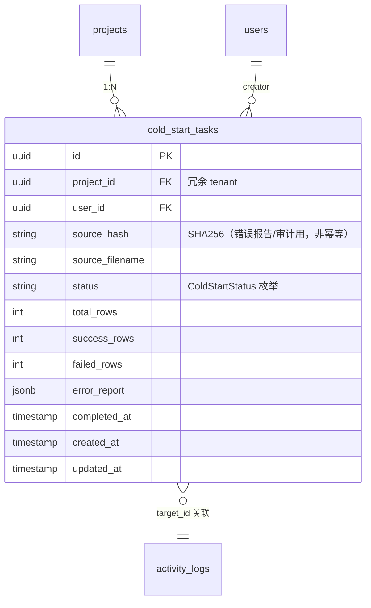
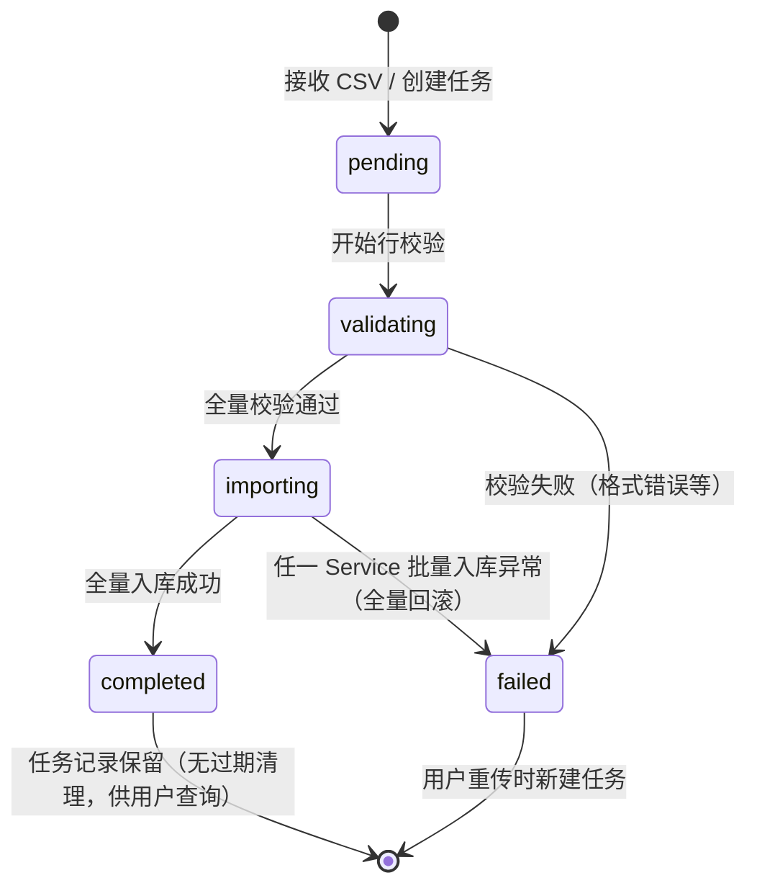

# M11 冷启动支持 - 详细设计

> **CY 2026-04-21 已批量 ack 8 组决策（G1/G2/G6）。业务 ⚠️ 已清零。详见节 15 CY 决策记录表。**

---

## 1. 业务说明 + 职责边界

### 业务背景（引自 PRD / US）

**核心用户故事**：
- **US-A1.5**：作为项目管理员，我想通过 CSV 批量导入功能项，这样不用逐个手动创建，快速搭建项目骨架（F11）
- **PRD Q3.1**：4 步向导（上传 → 预览 → 映射 → 确认）—— M11 是其中的"结构化 CSV 直入库"路径

**业务定位（与 M17 的区别）**：
- M11：用户提供**标准化 CSV 模板**（字段已 pre-defined），解析快 → 同步处理在 HTTP 请求内完成，无 AI
- M17：用户提供**非结构化 zip/git**（需 AI 拆分归类），耗时长 → 异步 Queue

M11 解决的是"新项目冷启动"场景：用户已有 Excel/CSV 格式的功能模块清单，希望一次性批量导入，无需逐个手动建树。

### In scope（M11 负责）

- **CSV 文件解析**：读取标准模板 CSV（字段：节点路径 / 维度内容 / 竞品 / 问题）
- **解析校验**：字段格式校验 + 错误行报告（哪行什么字段错）
- **批量入库（orchestrator 模式）**：M11 **不直接 INSERT 跨模块表**，调用：
  - `M03 NodeService.batch_create_in_transaction(db, nodes, project_id)` — 写节点树
  - `M04 DimensionService.batch_create_in_transaction(db, dimensions, project_id)` — 写维度记录
  - `M06 CompetitorService.batch_create_in_transaction(db, competitors, project_id)` — 写竞品
  - `M07 IssueService.batch_create_in_transaction(db, issues, project_id)` — 写问题
  - 四个 Service 共享同一 `db.begin()` 事务；任一失败全回滚
- **错误行报告**：返回包含错误行号 + 原因的汇总（部分校验失败时可选只导入成功行）
- **空状态引导**：项目首次进入时，若节点数=0，展示"上传 CSV 快速开始"引导入口

### Out of scope（其他模块负责）

| 不做的事 | 归属模块 |
|---------|---------|
| 非结构化 zip/git 导入（AI 拆分）| M17 |
| 单个节点手动创建/编辑 | M03 |
| 维度内容的单条编辑 | M04 |
| 竞品单条录入 | M06 |
| 问题单条录入 | M07 |
| Markdown 报告导出 | M19 |

### 边界灰区（显式说明）

- **与 M17 共享"batch_create_in_transaction" 接口**：M11 和 M17 都作为 orchestrator 调用 M03-M07 的批量 Service，但 M11 是同步调用（HTTP 请求内完成），M17 是 Queue worker 调用。
- **部分失败策略（G6）**：**全量事务回滚**——任一行失败全回滚；用户修 CSV 后重传。`partial_failed` 状态已从枚举中移除。
- **同步 vs 异步阈值（G6）**：CSV < 10MB / < 1000 行时同步处理；**超过阈值暂不升级 Queue，建议用户分批**；`cold_start_tasks` 表结构预留 Queue 升级兼容性（status/total_rows/success_rows 字段与 M17 模式兼容，未来升级只需加 Queue payload）。

---

## 2. 依赖模块图

```mermaid
flowchart LR
  M01[M01 用户] --> M11
  M02[M02 项目] --> M11
  M03[M03 模块树] --> M11

  M11[M11 冷启动<br/>CSV orchestrator] -.调 NodeService.batch_create.-> M03
  M11 -.调 DimensionService.batch_create.-> M04[M04 维度]
  M11 -.调 CompetitorService.batch_create.-> M06[M06 竞品]
  M11 -.调 IssueService.batch_create.-> M07[M07 问题]
  M11 -.事件.-> M15[M15 数据流转]
```

**前置依赖（必须先实现）**：M01 → M02 → M03 → M04 / M06 / M07（被写入的目标 Service）

**依赖契约**（M11 假设上游提供）：
- M01：`current_user`（user_id）
- M02：`project`（project_id + 状态校验：项目存在且用户有 editor 权限）
- M03：`NodeService.batch_create_in_transaction(db, nodes, project_id)`
- M04：`DimensionService.batch_create_in_transaction(db, dimensions, project_id)`
- M06：`CompetitorService.batch_create_in_transaction(db, competitors, project_id)`
- M07：`IssueService.batch_create_in_transaction(db, issues, project_id)`

---

## 3. 数据模型（SQLAlchemy + Alembic 要点）

### 决策（G6：B 有持久化 + 全量回滚 + 固定列 + 无 idempotency）

#### SQLAlchemy 模型

```python
# api/models/cold_start_task.py
import enum
from sqlalchemy.orm import Mapped, mapped_column, relationship
from sqlalchemy import ForeignKey, CheckConstraint, Index, Text, Integer, String
from sqlalchemy.dialects.postgresql import UUID, JSONB
from datetime import datetime
from uuid import UUID as PyUUID, uuid4
from typing import Any
from .base import Base, TimestampMixin

class ColdStartStatus(str, enum.Enum):
    pending = "pending"          # 已接收 CSV，等待处理
    validating = "validating"    # 校验行数据中
    importing = "importing"      # 批量入库中
    completed = "completed"      # 全量成功
    failed = "failed"            # 全量失败（校验不通过或入库异常）
    # G6 决策：移除 partial_failed（全量回滚语义下不存在部分失败状态）

class ColdStartTask(Base, TimestampMixin):
    __tablename__ = "cold_start_tasks"
    __table_args__ = (
        # G2/G6 决策：无 idempotency，移除 UNIQUE(user_id, project_id, source_hash)
        # G1 三重防护：CheckConstraint 枚举值显式列出（R3-2 合规：String(20)+CheckConstraint+Mapped[ColdStartStatus]）
        CheckConstraint(
            "status IN ('pending','validating','importing','completed','failed')",
            name="ck_cold_start_status",
        ),
        Index("ix_cold_start_project_status", "project_id", "status"),
        Index("ix_cold_start_user_created", "user_id", "created_at"),
    )

    id: Mapped[PyUUID] = mapped_column(UUID(as_uuid=True), primary_key=True, default=uuid4)
    project_id: Mapped[PyUUID] = mapped_column(
        UUID(as_uuid=True), ForeignKey("projects.id", ondelete="CASCADE"),
        nullable=False
    )  # 冗余 tenant 字段（R3-3）
    user_id: Mapped[PyUUID] = mapped_column(
        UUID(as_uuid=True), ForeignKey("users.id"),
        nullable=False
    )
    source_hash: Mapped[str] = mapped_column(Text, nullable=False)  # SHA256(CSV 文件内容)
    source_filename: Mapped[str] = mapped_column(Text, nullable=False)  # 原始文件名（展示用）
    status: Mapped[ColdStartStatus] = mapped_column(
        String(20), nullable=False, default=ColdStartStatus.pending
    )  # G1 三重防护：String(20) + CheckConstraint + Mapped[ColdStartStatus]（R3-2 合规）
    total_rows: Mapped[int] = mapped_column(Integer, nullable=False, default=0)
    success_rows: Mapped[int] = mapped_column(Integer, nullable=False, default=0)
    failed_rows: Mapped[int] = mapped_column(Integer, nullable=False, default=0)
    error_report: Mapped[dict[str, Any] | None] = mapped_column(
        JSONB, nullable=True
    )  # [{row: N, field: "xxx", message: "..."}]
    completed_at: Mapped[datetime | None] = mapped_column(nullable=True)
    # G2/G6 决策：移除 expires_at 字段——M11 无 idempotency 需求，任务同步完成即终态，无过期清理语义
```

### ER 图



### Alembic 要点

- 索引：`(project_id, status)` / `(user_id, created_at)`
- `error_report` JSONB：行级错误列表，结构 `[{row, field, message}]`
- `status` CHECK：`status IN ('pending','validating','importing','completed','failed')`（G1 三重防护；G6 移除 partial_failed）
- **G2/G6 决策**：移除 `UNIQUE(user_id, project_id, source_hash)` 幂等约束（无 idempotency）
- **G6 决策**：表结构预留 Queue 升级兼容性（status/total_rows/success_rows 字段与 M17 模式兼容）
- **G5 batch_create path 计算**：M11 调用 `NodeService.batch_create_in_transaction` 时，传入节点按拓扑排序（父节点先）；path 计算由 NodeService 处理（详见 M03 §3 path 计算策略）

---

## 4. 状态机

### 状态转换图

**决策（G6）**：全量回滚；移除 `partial_failed` 状态；终态只有 `completed` 和 `failed`。



### 允许的关键转换

| 当前 | → | 触发 | 副作用 |
|------|---|------|--------|
| `pending` | `validating` | Service 开始解析 CSV | 记录 total_rows |
| `validating` | `importing` | 全量校验通过 | 开启 db.begin() 事务 |
| `validating` | `failed` | 有行校验失败（全量模式）| 写 error_report + activity_log |
| `importing` | `completed` | 所有 Service.batch_create 成功 | activity_log + completed_at |
| `importing` | `failed` | 任一 Service 抛异常 | 事务回滚 + error_report |

### 禁止的转换（R4-2：终态数=2，至少列 3 条；每条格式：状态A → 状态B：原因 + ErrorCode）

| 禁止转换 | 原因 + ErrorCode |
|---------|----------------|
| `completed → 任意 状态` | completed 为终态不可变；抛 `ColdStartTaskFinalizedError`（`COLD_START_TASK_FINALIZED`，409） |
| `failed → 任意 状态` | failed 为终态不可变；用户需新建任务重传；抛 `ColdStartTaskFinalizedError`（`COLD_START_TASK_FINALIZED`，409） |
| `importing → validating`（逆向）| 状态只能前向流转；抛 `ColdStartInvalidStateTransitionError`（`COLD_START_INVALID_STATE_TRANSITION`，409） |
| `pending → importing`（跳过 validating）| 必须经过校验阶段；抛 `ColdStartInvalidStateTransitionError`（409） |

显式声明（R4-1）：`cold_start_tasks` 有 `status` 字段（`ColdStartStatus` 枚举），上图即全量状态机。M11 其他实体（nodes / dimension_records 等）的状态由各自归属模块（M03 / M04）管理，M11 不重复定义。

---

## 5. 多人架构 4 维必答

| 维度 | 答案 | 实现细节 |
|------|------|---------|
| **Tenant 隔离** | ✅ project_id | `cold_start_tasks.project_id` 冗余字段（R3-3）；DAO 强制 `WHERE project_id=?`；Service 层调各 batch_create_in_transaction 时传入 project_id |
| **多表事务** | ✅ 必须（批量入库阶段）| Service 层 `with db.begin():` 包外层事务，顺序调用 M03 NodeService / M04 DimensionService / M06 CompetitorService / M07 IssueService 的 batch_create_in_transaction；任一失败全回滚；**M11 不直 INSERT 跨模块表**（R-X1） |
| **异步处理** | ❌ N/A | CSV 量可控（< 10MB / < 1000 行），同步 HTTP 请求内完成；无 Queue / 无 Worker / 无 SSE |
| **并发控制** | ❌ N/A | M11 写操作为"导入批次"级别，同一用户重传同 CSV 创建新任务（G2/G6 无 idempotency）；多用户同时导入不同 CSV 互不影响；无乐观锁需求 |

### 约束清单逐项检查（06-design-principles 5 项）

| 清单项 | M11 是否触发 | 实现 |
|-------|-------------|------|
| 1. activity_log | ✅ 触发（导入批次 C/失败） | 节 10 |
| 2. 乐观锁 version | ❌ 不触发（无并发编辑场景）| N/A |
| 3. Queue payload tenant | ❌ 不触发（无 Queue）| N/A |
| 4. idempotency_key | ❌ 无幂等（G2/G6 统一规则）| 节 11 |
| 5. DAO tenant 过滤 | ✅ 触发 | 节 9 |

---

## 6. 分层职责表

> **关键原则**：M11 是 orchestrator——**不直 INSERT 跨模块表**，只调 M03/M04/M06/M07 的 `batch_create_in_transaction`（R-X1，参 M17 §1 同模式）。

| 层 | M11 涉及文件 | 该层职责 |
|----|------------|---------|
| **Page** | `web/src/app/projects/[pid]/cold-start/page.tsx` | 空状态引导 UI + CSV 上传向导 |
| **Component** | `web/src/components/business/csv-upload-wizard.tsx`<br>`web/src/components/business/import-error-report.tsx` | 文件上传 / 预览校验结果 / 错误行列表 |
| **Server Action** | `web/src/actions/cold-start.ts` | session 校验 / 文件暂存 / 调 FastAPI |
| **Router** | `api/routers/cold_start_router.py` | 路由定义 / `Depends(check_project_access)` / Pydantic 入参出参 |
| **Service** | `api/services/cold_start_service.py` | CSV 解析 + 行校验 + 状态管理 + orchestrator 事务调用 |
| **DAO** | `api/dao/cold_start_dao.py` | SQL 构建 + tenant 过滤（G2/G6：无 find_idempotent 方法）|
| **Model** | `api/models/cold_start_task.py` | SQLAlchemy 模型 |
| **Schema** | `api/schemas/cold_start_schema.py` | Pydantic 请求/响应 |

**禁止**：
- ❌ `cold_start_service.py` 直接 `db.execute(INSERT INTO nodes ...)` — 必须调 `NodeService.batch_create_in_transaction`
- ❌ `cold_start_service.py` 直接写 `dimension_records` / `competitors` / `issues` 表
- ❌ Router 直查 DB
- ❌ DAO 做业务校验（行格式检查放 Service）

---

## 7. API 契约（Pydantic + OpenAPI 路径表）

### Endpoints

| 方法 | 路径 | 用途 | Pydantic 入参 | 出参 |
|------|------|------|--------------|------|
| POST | `/api/projects/{project_id}/cold-start/upload` | 上传 CSV + 触发导入 | `multipart/form-data`（文件）+ `ColdStartCreateRequest` | `ColdStartTaskResponse` |
| GET | `/api/projects/{project_id}/cold-start` | 查询项目最近导入任务列表 | — | `ColdStartTaskListResponse` |
| GET | `/api/projects/{project_id}/cold-start/{task_id}` | 查询单任务详情（含错误报告）| — | `ColdStartTaskDetailResponse` |
| GET | `/api/projects/{project_id}/cold-start/template` | 下载 CSV 标准模板 | — | CSV 文件流 |

### Pydantic schema 草案

```python
# api/schemas/cold_start_schema.py
from pydantic import BaseModel, Field
from uuid import UUID
from datetime import datetime
from typing import Any
from enum import Enum

class ColdStartStatusEnum(str, Enum):
    pending = "pending"
    validating = "validating"
    importing = "importing"
    completed = "completed"
    failed = "failed"
    # G6 决策：移除 partial_failed（全量回滚语义）

class ColdStartCreateRequest(BaseModel):
    """CSV 上传请求（文件走 multipart，此 schema 含元信息）"""
    # 文件由 FastAPI UploadFile 接收，不在此 schema
    # G6 决策：固定模板列名（不支持自定义列映射）
    pass

class CsvRowError(BaseModel):
    row: int
    field: str
    message: str

class ColdStartTaskResponse(BaseModel):
    id: UUID
    project_id: UUID
    user_id: UUID
    source_filename: str
    status: ColdStartStatusEnum
    total_rows: int
    success_rows: int
    failed_rows: int
    created_at: datetime
    completed_at: datetime | None

class ColdStartTaskDetailResponse(ColdStartTaskResponse):
    error_report: list[CsvRowError] | None  # 错误行明细

class ColdStartTaskListResponse(BaseModel):
    items: list[ColdStartTaskResponse]
    total: int
```

---

## 8. 权限三层防御点

| 层 | 检查 | 实现 |
|----|------|------|
| **Server Action** | session 是否有效 | `getServerSession()`；无则 401 |
| **Router** | 用户对 project 是否有 ≥editor 权限（上传是写操作）| `Depends(check_project_access(project_id, role="editor"))` |
| **Service** | project 是否真属于该 user / cold_start_task 是否属于该 project | `_check_project_access(user_id, project_id)` + `_check_task_belongs_to_project(task_id, project_id)` |

**M11 无异步路径**（无 Queue / 无 WebSocket），三层即覆盖，无需 R8-2 / R8-3。

---

## 9. DAO tenant 过滤策略

```python
# api/dao/cold_start_dao.py

class ColdStartDAO:
    def list_by_project(
        self, db: Session, project_id: UUID, user_id: UUID, limit: int = 20
    ) -> list[ColdStartTask]:
        return (
            db.query(ColdStartTask)
            .filter(
                ColdStartTask.project_id == project_id,  # ← tenant 过滤
                ColdStartTask.user_id == user_id,
            )
            .order_by(ColdStartTask.created_at.desc())
            .limit(limit)
            .all()
        )

    def get_by_id(
        self, db: Session, task_id: UUID, project_id: UUID
    ) -> ColdStartTask | None:
        return (
            db.query(ColdStartTask)
            .filter(
                ColdStartTask.id == task_id,
                ColdStartTask.project_id == project_id,  # ← tenant 过滤
            )
            .first()
        )

    # G2/G6 决策：无 idempotency，find_idempotent 方法已移除
```

### 豁免清单

无——M11 所有查询均在 project + user 边界内。`GET /template` 下载模板文件无需 tenant 过滤（公共资源），但需要 session 校验（节 8 第一层）。

---

## 10. activity_log 事件清单

### 决策：操作粒度 + metadata（CY 2026-04-21 ack 全模块统一）

| action_type | target_type | target_id | summary | metadata |
|-------------|-------------|-----------|---------|----------|
| `cold_start.create` | `cold_start_task` | task_id | 创建冷启动导入任务 | `{source_hash, source_filename, total_rows}` |
| `cold_start.completed` | `cold_start_task` | task_id | 冷启动导入完成 | `{total_rows, success_rows, nodes_created, dimensions_created, competitors_created, issues_created}` |
| `cold_start.failed` | `cold_start_task` | task_id | 冷启动导入失败 | `{stage, failed_rows, error_code}` |

**实现位置**：`api/services/cold_start_service.py`，各状态转换后在事务内调 `self.activity.log(...)`。

---

## 11. idempotency_key 适用清单

### 决策（G2/G6）：M11 无 idempotency

**理由**：G2 横切统一规则——M11 CSV 导入不做 idempotency；每次上传都是新任务；DB 节点路径无唯一约束（G2/G5 M03 无 `UNIQUE(project_id, path)`），用户自行管理重复数据。

显式声明（R11-1）：**M11 无 idempotency_key 操作**。
显式声明（R11-2）：**project_id 不参与任何 key 计算**（因无 idempotency 操作）。

**并发导入同名节点（G7-M11-R2-08）**：同项目不同用户并发导入包含同名节点路径的 CSV——由于无 idempotency + M03 nodes 无 `UNIQUE(project_id, path)` 约束，会产生同名重复节点；**此为已知行为，用户自行解决重名**（由业务决策，不在技术层面约束）。

---

## 12. Queue payload schema

**N/A**——M11 无异步处理，无 Queue 任务。

显式声明（按 README §12 同步 N/A 范式）：**M11 不投递 Queue 任务**。CSV 量可控，同步处理在 HTTP 请求内完成。

---

## 13. ErrorCode 新增清单

```python
# api/errors/codes.py 新增（模块 M11）
class ErrorCode(str, Enum):
    # ... 已有

    # M11 冷启动
    COLD_START_TASK_NOT_FOUND = "COLD_START_TASK_NOT_FOUND"
    COLD_START_CSV_INVALID = "COLD_START_CSV_INVALID"             # CSV 格式无效（文件解析失败）
    COLD_START_ROW_VALIDATION_FAILED = "COLD_START_ROW_VALIDATION_FAILED"  # 行级校验失败（含行号）
    COLD_START_BATCH_INSERT_FAILED = "COLD_START_BATCH_INSERT_FAILED"      # 批量入库事务失败
    COLD_START_TASK_FINALIZED = "COLD_START_TASK_FINALIZED"       # 终态不可重操作
    COLD_START_INVALID_STATE_TRANSITION = "COLD_START_INVALID_STATE_TRANSITION"
    # G2/G6 决策：移除 COLD_START_DUPLICATE（无 idempotency）
    COLD_START_FILE_TOO_LARGE = "COLD_START_FILE_TOO_LARGE"       # 超过大小阈值
```

```python
# api/errors/exceptions.py 新增（R13-1：每个 ErrorCode 必有子类）

class ColdStartTaskNotFoundError(NotFoundError):
    code = ErrorCode.COLD_START_TASK_NOT_FOUND
    message = "Cold start task not found"

class ColdStartCsvInvalidError(AppError):
    code = ErrorCode.COLD_START_CSV_INVALID
    http_status = 422
    message = "CSV file is invalid or cannot be parsed"

class ColdStartRowValidationFailedError(AppError):
    code = ErrorCode.COLD_START_ROW_VALIDATION_FAILED
    http_status = 422
    message = "One or more rows failed validation; see error_report for details"

class ColdStartBatchInsertFailedError(AppError):
    code = ErrorCode.COLD_START_BATCH_INSERT_FAILED
    http_status = 500
    message = "Batch insert failed; transaction rolled back"

class ColdStartTaskFinalizedError(AppError):
    code = ErrorCode.COLD_START_TASK_FINALIZED
    http_status = 409
    message = "Cold start task is in final state and cannot be re-triggered"

class ColdStartInvalidStateTransitionError(AppError):
    code = ErrorCode.COLD_START_INVALID_STATE_TRANSITION
    http_status = 409
    message = "Invalid state transition for cold start task"

# G2/G6 决策：ColdStartDuplicateError 已移除（无 idempotency）

class ColdStartFileTooLargeError(AppError):
    code = ErrorCode.COLD_START_FILE_TOO_LARGE
    http_status = 413
    message = "CSV file exceeds maximum allowed size"
```

**复用已有**：`PERMISSION_DENIED` / `UNAUTHENTICATED` / `NOT_FOUND`

---

## 14. 测试场景大纲

详见独立文件：[`tests.md`](./tests.md)

主文档大纲：
- **golden path**：上传合法 CSV → 校验通过 → 批量入库 → 返回 completed + 统计
- **边界**：空 CSV / 超大文件 / 缺必填列 / 行数据格式错 / 特殊字符
- **并发**：同用户同项目重传同 CSV（G2/G6 无 idempotency，创建新任务）/ 不同用户同项目并发导入
- **tenant**：跨项目越权上传 / DAO tenant 过滤覆盖
- **权限**：viewer 上传 / 未登录上传
- **错误处理**：校验失败全量回滚 / 入库异常事务回滚 / batch_create 跨模块失败

---

## 15. 完成度判定 checklist

- [x] 节 1：职责边界 in/out scope 完整（引 US-A1.5 + PRD Q3.1；G6 Queue 预留兼容性说明）
- [x] 节 2：依赖图完整（orchestrator 调用箭头）
- [x] 节 3：SQLAlchemy class（G1 三重防护 String(20)+CheckConstraint+Mapped；G6 移除 partial_failed；G2/G6 移除唯一约束；G5 path 计算说明）
- [x] 节 4：状态机 mermaid + 禁止转换 4 条（R4-2 格式；终态 2 个各独立一条 G6/G7）
- [x] 节 5：4 维必答（idempotency 已决策 G2/G6）+ 5 项清单逐项标注
- [x] 节 6：分层职责表完整 + 跨模块禁止直 INSERT 声明（R-X1）
- [x] 节 7：所有 API endpoint + Pydantic schema（G6 移除 partial_failed）
- [x] 节 8：权限三层防御（无 Queue/WebSocket，3 层即可）
- [x] 节 9：DAO tenant 过滤代码（G2/G6 已移除 find_idempotent）+ 豁免清单
- [x] 节 10：activity_log 事件清单（G6 移除 cold_start.partial_failed）
- [x] 节 11：idempotency 无（G2/G6 决策；并发导入同名节点为已知行为 G7-M11-R2-08）
- [x] 节 12：Queue 显式 N/A
- [x] 节 13：ErrorCode（G2/G6 移除 COLD_START_DUPLICATE；7 个有效 ErrorCode + AppError 子类）
- [x] 节 14：测试场景大纲（详转 tests.md）
- [x] 节 15：本 checklist 全勾过
- [ ] **🔴 第一轮 reviewer audit（完整性）通过**
- [ ] **🔴 第二轮 reviewer audit（边界场景）通过**
- [ ] **🔴 第三轮 reviewer audit（演进 / 模板可复用性）通过**
- [ ] CY 全文复审通过 → status 转 accepted

---

## CY 决策记录（2026-04-21 批量 ack）

| # | 组 | 节 | 决策点 | 决定 |
|---|----|----|-------|------|
| Q1 | G6 | 1/3 | 持久化 cold_start_tasks 表 | **B 有持久化**（记录导入批次 + 错误行） |
| Q2 | G6 | 1/4 | 部分失败策略 | **A 全量事务回滚**（partial_failed 状态已移除） |
| Q3 | G6 | 1 | 同步阈值/Queue 升级 | **暂不升级 Queue**（预留表结构兼容性） |
| Q4 | G6 | 7 | CSV 列映射 | **A 固定模板列名** |
| Q5 | G2/G6 | 11 | CSV 重传 idempotency | **B 不做**（统一无幂等规则；移除 UNIQUE 约束） |
| Q6 | G1 | 3 | SA Enum 规则 | **B 不改代码**（String(20) 改为 String(20)+CheckConstraint+Mapped 三重防护合规；原 Text 改为 String(20)） |

---

## 关联参考

- 上游：`design/00-architecture/04-layer-architecture.md` / `05-module-catalog.md` / `06-design-principles.md`
- 工程规约：`design/01-engineering/01-engineering-spec.md`
- 关键教训：`design/02-modules/README.md`（R-X1 orchestrator 纪律）
- 异步 pilot 范本（orchestrator 模式）：`design/02-modules/M17-ai-import/00-design.md`（§1 in scope 最后一段）
- Prism 对照参考：`/root/cy/prism/web/src/db/schema.ts`（不直接复制命名）
- 业务故事：`/root/cy/prism/docs/product/feature-list-and-user-stories.md`（US-A1.5）
