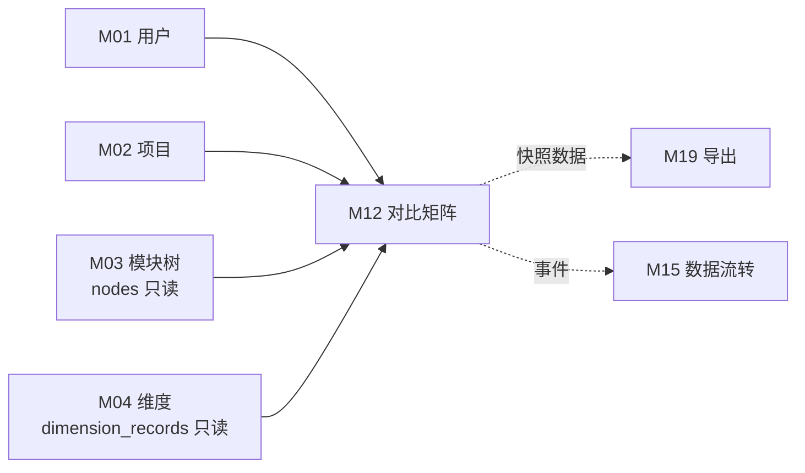
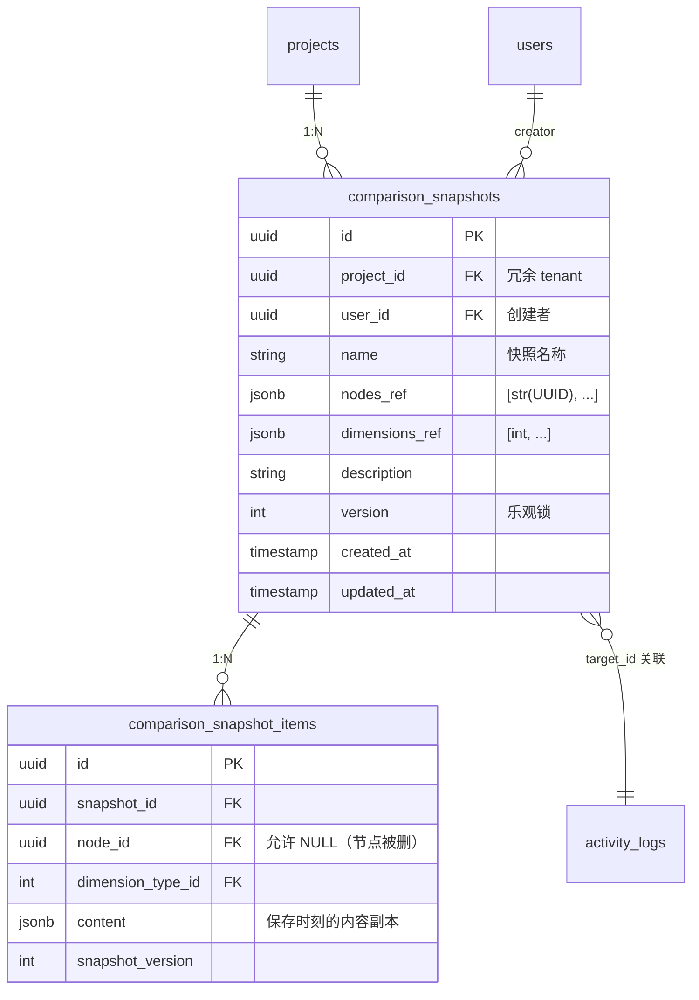

# M12 功能对比矩阵 - 详细设计

> **CY 2026-04-21 已批量 ack 8 组决策（G1/G4）。业务 ⚠️ 已清零。详见节 15 CY 决策记录表。**

---

## 1. 业务说明 + 职责边界

### 业务背景（引自 PRD / US）

**核心用户故事**：
- **US-A3.3**：作为项目管理员，我想选择多个竞品生成对比矩阵，这样一眼看各家在同一功能上的差异（F12）
- **PRD Q3**：围绕"功能模块"组织、能持续沉淀产品理解——对比矩阵是产品评价能力的核心场景

**业务定位**：M12 是跨功能项横向对比视图。用户选 N 个功能项（nodes）+ M 个维度，渲染 N×M 矩阵，对比不同产品线/竞品在同一维度上的实现差异。可选保存为快照供复用和导出。

**核心页面**（feature-list-and-user-stories.md）：路径 `/project/:id/compare`，独立对比矩阵页。

### In scope（M12 负责）

- **矩阵渲染**：用户选 N 个 nodes + M 个维度 → 实时渲染 N×M 表格（从 M03/M04 读数据）
- **快照保存**：用户对当前选择（nodes + dimensions）保存为命名快照 → 写 `comparison_snapshots` 表
- **快照管理**：列表、重命名、删除快照
- **快照导出**：配合 M19 将快照内容导出（out of scope for M12，M19 负责）
- **快照数据策略（G4）**：值快照（B 方案）——保存快照时拷贝当前 dimension content 到 `comparison_snapshot_items` 表（详见节 3）

### Out of scope（其他模块负责）

| 不做的事 | 归属模块 |
|---------|---------|
| 维度内容编辑 | M04 |
| 节点 CRUD | M03 |
| 竞品参考录入 | M06 |
| Markdown 报告导出 | M19 |
| AI 自动生成对比分析 | M13 |

### 边界灰区（显式说明）

- **"对比"的数据来源（G4 Q4）**：M12 只读 M03（nodes）/ M04（dimension_records），不读 M06（竞品）数据；快照的"选择"是 nodes + dimensions 的组合——若用户想对比竞品，竞品以"不同 node"体现。本期不支持"竞品维度对比（同 node 多竞品）"（G4 决策 A：nodes+dimensions）。
- **快照 vs 实时**：不保存快照时，矩阵是实时读取（GET 接口）；保存后快照是持久化记录（写 `comparison_snapshots`）。

---

## 2. 依赖模块图



**前置依赖（必须先实现）**：M01 → M02 → M03 → M04

**依赖契约**（M12 假设上游提供）：
- M01：`current_user`（user_id）
- M02：project 存在 + 用户有访问权限
- M03：`nodes(project_id)` 返回节点列表（供前端选择）
- M04：`dimension_records(node_ids, dimension_type_ids)` 批量读取维度内容

**M12 对 M03/M04 仅执行只读操作，不写这两个模块的表。**

---

## 3. 数据模型（SQLAlchemy + Alembic 要点）

### 决策（G4=B：值快照）

**G4 决策（CY 2026-04-21 ack）**：选方案 B——值快照，额外写 `comparison_snapshot_items` 明细表存当时数据副本。保存快照时遍历选中 node×dim 拷贝 content 到 items 表。**快照不允许刷新**（无刷新 API，G4-4a）。

**候选 B 改回成本（R3-4，量化 A→B 不可逆）**：
- Alembic 迁移步数：新增 1 张表（`comparison_snapshot_items`）+ 对应索引（2-3 步）
- 新增表数：1 张
- 受影响模块数：M12 本身（节 6/7/9 需联动）
- 数据迁移不可逆性：**高**——B→A 回滚需删 `comparison_snapshot_items` 表，历史快照值数据永久丢失；不可逆

**G2 决策**：快照无状态字段——`comparison_snapshots` 移除 `status` 字段（状态最小集；无 draft/saved 区分）。

#### SQLAlchemy 模型

```python
# api/models/comparison_snapshot.py
import enum
from sqlalchemy.orm import Mapped, mapped_column, relationship
from sqlalchemy import ForeignKey, CheckConstraint, Index, Text, Integer, String
from sqlalchemy.dialects.postgresql import UUID, JSONB
from datetime import datetime
from uuid import UUID as PyUUID, uuid4
from typing import Any
from .base import Base, TimestampMixin


class ComparisonSnapshot(Base, TimestampMixin):
    __tablename__ = "comparison_snapshots"
    __table_args__ = (
        Index("ix_comparison_snapshot_project", "project_id"),
        Index("ix_comparison_snapshot_user_project", "user_id", "project_id"),
    )
    # G2/G4 决策：无 status 字段（快照无状态，状态最小集）

    id: Mapped[PyUUID] = mapped_column(UUID(as_uuid=True), primary_key=True, default=uuid4)
    project_id: Mapped[PyUUID] = mapped_column(
        UUID(as_uuid=True), ForeignKey("projects.id", ondelete="CASCADE"),
        nullable=False
    )  # 冗余 tenant 字段（R3-3）
    user_id: Mapped[PyUUID] = mapped_column(
        UUID(as_uuid=True), ForeignKey("users.id"),
        nullable=False
    )  # 创建者
    name: Mapped[str] = mapped_column(Text, nullable=False)  # 用户命名的快照名称
    nodes_ref: Mapped[list[str]] = mapped_column(
        JSONB, nullable=False, default=list
    )  # [str(UUID), ...] — 快照元数据：记录选中节点列表供前端展示
    # G7-M12-R2-09：nodes_ref 存 str(UUID) 而非原生 UUID——理由：PG JSONB 不区分 UUID/str，
    # Python ORM 层需明确约定；Service 层做 str↔UUID 转换（get_matrix_data 入参 list[UUID]）
    dimensions_ref: Mapped[list[int]] = mapped_column(
        JSONB, nullable=False, default=list
    )  # [dimension_type_id, ...] — 快照元数据：记录选中维度列表供前端展示
    description: Mapped[str | None] = mapped_column(Text, nullable=True)
    version: Mapped[int] = mapped_column(
        Integer, nullable=False, default=1
    )  # 乐观锁（rename 并发保护）

    items = relationship(
        "ComparisonSnapshotItem", back_populates="snapshot",
        cascade="all, delete-orphan"
    )


class ComparisonSnapshotItem(Base):
    """G4=B：值快照明细表——保存快照时刻 node×dim 的 content 副本"""
    __tablename__ = "comparison_snapshot_items"
    __table_args__ = (
        Index("ix_snapshot_items_snapshot", "snapshot_id"),
        Index("ix_snapshot_items_node", "node_id"),
    )

    id: Mapped[PyUUID] = mapped_column(UUID(as_uuid=True), primary_key=True, default=uuid4)
    snapshot_id: Mapped[PyUUID] = mapped_column(
        UUID(as_uuid=True), ForeignKey("comparison_snapshots.id", ondelete="CASCADE"),
        nullable=False
    )
    node_id: Mapped[PyUUID] = mapped_column(
        UUID(as_uuid=True), ForeignKey("nodes.id", ondelete="SET NULL"),
        nullable=True
    )  # 允许 null：节点删除后保留快照数据（G4：B 模式存值，不降级）
    dimension_type_id: Mapped[int] = mapped_column(
        ForeignKey("dimension_types.id"), nullable=False
    )
    content: Mapped[dict[str, Any] | None] = mapped_column(
        JSONB, nullable=True
    )  # 保存时刻的维度内容副本；None = 当时该格未填写
    snapshot_version: Mapped[int] = mapped_column(
        Integer, nullable=False, default=1
    )  # 快照版本（冗余 snapshot.version，便于查询历史）

    snapshot = relationship("ComparisonSnapshot", back_populates="items")
```

### ER 图



### Alembic 要点

- `comparison_snapshots` 索引：`(project_id)` / `(user_id, project_id)`
- `comparison_snapshot_items` 索引：`(snapshot_id)` / `(node_id)`
- `nodes_ref` / `dimensions_ref`：JSONB 数组（快照元数据，不用于渲染）
- `name` 无唯一约束（允许同名快照）
- **G4=B 变更说明**：新增 1 张表 `comparison_snapshot_items`；节点删除后 items.node_id 设为 NULL（ON DELETE SET NULL），快照仍展示原值

---

## 4. 状态机

### 决策（G2）：快照无状态字段

显式声明（R4-1）：`comparison_snapshots` **无 status 字段**（G2 状态最小集）。快照没有复杂生命周期：保存即存在，删除即消失，无 draft/saved 区分。`version` 字段为乐观锁计数器，非状态枚举。

**不适用 R4-2 禁止转换条目（无状态机）**，但列出操作限制：

| 禁止操作 | 原因 + ErrorCode |
|---------|----------------|
| 对已删除快照执行 GET/PUT/DELETE | 快照不存在（已物理删除）；抛 `ComparisonSnapshotNotFoundError`（`COMPARISON_SNAPSHOT_NOT_FOUND`，404） |
| 并发 rename 版本不匹配（version 冲突）| 乐观锁冲突；抛 `ComparisonSnapshotConflictError`（`COMPARISON_SNAPSHOT_CONFLICT`，409） |
| **快照刷新（G4-4a）** | 快照是 B 模式存值，不支持刷新；无刷新 API；若调用不存在的刷新接口返回 404 |

---

## 5. 多人架构 4 维必答

| 维度 | 答案 | 实现细节 |
|------|------|---------|
| **Tenant 隔离** | ✅ project_id | `comparison_snapshots.project_id` 冗余字段（R3-3）；DAO 强制 `WHERE project_id=?`；矩阵渲染时读 M03/M04 数据也携带 project_id 过滤 |
| **多表事务** | ✅ 必须（创建快照写 comparison_snapshots + comparison_snapshot_items + activity_log）| Service 层 `with db.begin():` 包：① INSERT comparison_snapshots ② 遍历 node×dim bulk INSERT comparison_snapshot_items ③ log activity（G4=B 值快照）；任一失败回滚 |
| **异步处理** | ❌ N/A | 矩阵渲染是实时读（GET），快照保存是同步写（POST），无需后台任务 |
| **并发控制** | ✅ 乐观锁（快照 rename 并发）| 同项目多人可能同时创建快照（互不干扰，各建各的）；快照 rename 多人同时操作需乐观锁（`version` 字段）；rename 接口传 expected_version |

### 约束清单逐项检查（06-design-principles 5 项）

| 清单项 | M12 是否触发 | 实现 |
|-------|-------------|------|
| 1. activity_log | ✅ 触发（创建/重命名/删除快照）| 节 10 |
| 2. 乐观锁 version | ✅ 触发（快照 rename 并发）| 节 5 并发列 + 节 3 version 字段 |
| 3. Queue payload tenant | ❌ 不触发（无 Queue）| N/A |
| 4. idempotency_key | ❌ 不触发（CY 统一无幂等规则）| 节 11 |
| 5. DAO tenant 过滤 | ✅ 触发 | 节 9 |

### 状态转换竞态分析（R5-2：有状态机时必答）

- **创建快照竞态**：同项目多用户同时 POST 创建不同快照 → 各自插入，互不干扰（无竞态）
- **rename 竞态**：userA 和 userB 同时 PUT rename 同一快照 → 若保留 version 字段，第一个成功，第二个因 version 不匹配收到 409 ConflictError
- **delete 竞态**：userA DELETE 后 userB 再 DELETE 同一快照 → 第二个收到 404（DAO 返回 None）
- **读-删竞态**：userA GET 矩阵渲染时 userB DELETE 了某 node → **G4=B 不降级**——快照是值快照，节点删除后快照仍展示原值副本（节 6 实现说明）

---

## 6. 分层职责表

| 层 | M12 涉及文件 | 该层职责 |
|----|------------|---------|
| **Page** | `web/src/app/projects/[pid]/compare/page.tsx` | 对比矩阵主页（节点选择器 + 维度选择器 + N×M 表格） |
| **Component** | `web/src/components/business/comparison-matrix.tsx`<br>`web/src/components/business/snapshot-panel.tsx` | 矩阵渲染 / 快照保存弹窗 / 快照列表 |
| **Server Action** | `web/src/actions/comparison.ts` | session 校验 / 参数收集 / 调 FastAPI |
| **Router** | `api/routers/comparison_router.py` | 路由定义 / `Depends(check_project_access)` / Pydantic 入参出参 |
| **Service** | `api/services/comparison_service.py` | 矩阵数据聚合（读 M03/M04）/ 快照 CRUD / 事务管理 |
| **DAO** | `api/dao/comparison_dao.py` | SQL 构建 + tenant 过滤 + 快照 CRUD（**不跨模块直查**——维度数据走 M04 `DimensionService.batch_get_by_nodes` 接口，节点存在性校验走 M03 Service，batch3 基线补丁决策 6）|
| **Model** | `api/models/comparison_snapshot.py` | SQLAlchemy 模型 |
| **Schema** | `api/schemas/comparison_schema.py` | Pydantic 请求/响应 |

**Service 层快照保存流程（G4=B 值快照）**：
```python
# comparison_service.py
def create_snapshot(db, user_id, project_id, name, node_ids, dimension_type_ids):
    with db.begin():
        # 1. INSERT comparison_snapshots（含 nodes_ref/dimensions_ref 元数据）
        snapshot = dao.create_snapshot(...)
        # 2. 遍历选中 node×dim 拷贝 content 到 items 表
        #    batch3 基线补丁决策 6：走 M04 Service 接口（不直查 DimensionRecord）
        records = dimension_service.batch_get_by_nodes(db, node_ids, dimension_type_ids, project_id)
        items = [
            ComparisonSnapshotItem(
                snapshot_id=snapshot.id,
                node_id=record.node_id,
                dimension_type_id=record.dimension_type_id,
                content=record.content,
                snapshot_version=snapshot.version
            )
            for record in records
        ]
        dao.bulk_insert_items(db, items)
        activity.log(...)
```

**§6 节点删除降级策略（G7-M12-R1-14）**：
- 由于 G4=B 模式快照是值副本，节点被删后 `comparison_snapshot_items.node_id` 设为 NULL（ON DELETE SET NULL）
- 快照仍展示原值（读 items 表的 content 字段，不 JOIN nodes 表获取节点名）
- 渲染快照时：若 items.node_id 为 NULL，用 nodes_ref 中的节点 id 作为显示 key，content 仍有效
- **不降级**（无"节点删除后快照显示空矩阵"逻辑）

**禁止**：
- ❌ Router 直查 DB
- ❌ `comparison_service.py` 直写 `nodes` / `dimension_records` 表（M12 对这两表只读）
- ❌ DAO 做业务判断（矩阵聚合逻辑放 Service）

---

## 7. API 契约（Pydantic + OpenAPI 路径表）

### Endpoints

| 方法 | 路径 | 用途 | Pydantic 入参 | 出参 |
|------|------|------|--------------|------|
| GET | `/api/projects/{project_id}/comparison/matrix` | 实时渲染矩阵数据 | `node_ids: list[UUID]`, `dimension_type_ids: list[int]`（query params）| `ComparisonMatrixResponse` |
| POST | `/api/projects/{project_id}/comparison/snapshots` | 创建并保存快照 | `SnapshotCreateRequest` | `SnapshotResponse` |
| GET | `/api/projects/{project_id}/comparison/snapshots` | 查询快照列表 | — | `SnapshotListResponse` |
| GET | `/api/projects/{project_id}/comparison/snapshots/{snapshot_id}` | 查询单快照详情（含渲染数据）| — | `SnapshotDetailResponse` |
| PUT | `/api/projects/{project_id}/comparison/snapshots/{snapshot_id}` | 重命名快照（含乐观锁）| `SnapshotUpdateRequest` | `SnapshotResponse` |
| DELETE | `/api/projects/{project_id}/comparison/snapshots/{snapshot_id}` | 删除快照 | — | 204 |

### Pydantic schema 草案

```python
# api/schemas/comparison_schema.py
from pydantic import BaseModel, Field
from uuid import UUID
from datetime import datetime
from typing import Any
from enum import Enum

# G2/G4 决策：移除 ComparisonSnapshotStatusEnum（无状态字段）

class MatrixCell(BaseModel):
    node_id: UUID
    dimension_type_id: int
    content: dict[str, Any] | None  # None = 未填写

class ComparisonMatrixResponse(BaseModel):
    """实时矩阵渲染结果"""
    nodes: list[dict[str, Any]]             # [{id, name, path}]
    dimension_types: list[dict[str, Any]]   # [{id, key, name}]
    cells: list[MatrixCell]                 # N×M cells

class SnapshotCreateRequest(BaseModel):
    name: str = Field(..., min_length=1, max_length=128)
    description: str | None = None
    node_ids: list[UUID] = Field(..., min_items=1)
    dimension_type_ids: list[int] = Field(..., min_items=1)

class SnapshotUpdateRequest(BaseModel):
    name: str = Field(..., min_length=1, max_length=128)
    description: str | None = None
    expected_version: int  # 乐观锁（G4 Q2 决策：保留 version 字段）

class SnapshotItemResponse(BaseModel):
    """G4=B 值快照明细"""
    node_id: str | None          # str(UUID) 或 None（节点已删）
    dimension_type_id: int
    content: dict[str, Any] | None


class SnapshotResponse(BaseModel):
    id: UUID
    project_id: UUID
    user_id: UUID
    name: str
    # G2/G4 决策：无 status 字段
    description: str | None
    nodes_ref: list[str]                # [str(UUID), ...] — 快照元数据（G7-M12-R2-09：str 存储）
    dimensions_ref: list[int]           # [dimension_type_id, ...]
    version: int                        # 乐观锁版本
    created_at: datetime
    updated_at: datetime


class SnapshotDetailResponse(SnapshotResponse):
    """快照详情（G4=B 值快照：读 items 表，节点删除后仍展示原值）"""
    items: list[SnapshotItemResponse]   # N×M 明细，不因节点删除而丢失

class SnapshotListResponse(BaseModel):
    items: list[SnapshotResponse]
    total: int
```

---

## 8. 权限三层防御点

| 层 | 检查 | 实现 |
|----|------|------|
| **Server Action** | session 是否有效 | `getServerSession()`；无则 401 |
| **Router** | 用户对 project 是否有访问权限 | GET 矩阵/快照列表允许 viewer；POST/PUT/DELETE 快照要求 ≥editor；`Depends(check_project_access(project_id, role))` |
| **Service** | 快照是否真属于该 project（防 snapshot_id 跨项目）| `_check_snapshot_belongs_to_project(snapshot_id, project_id)`；不属于抛 `ComparisonSnapshotNotFoundError`（不暴露 forbidden 信息）|

**M12 无异步路径**（无 Queue / 无 WebSocket），三层即覆盖，无需 R8-2 / R8-3。

---

## 9. DAO tenant 过滤策略

```python
# api/dao/comparison_dao.py

class ComparisonDAO:
    def list_snapshots(
        self, db: Session, project_id: UUID, limit: int = 50
    ) -> list[ComparisonSnapshot]:
        return (
            db.query(ComparisonSnapshot)
            .filter(
                ComparisonSnapshot.project_id == project_id,  # ← tenant 过滤
            )
            .order_by(ComparisonSnapshot.created_at.desc())
            .limit(limit)
            .all()
        )

    def get_snapshot(
        self, db: Session, snapshot_id: UUID, project_id: UUID
    ) -> ComparisonSnapshot | None:
        return (
            db.query(ComparisonSnapshot)
            .filter(
                ComparisonSnapshot.id == snapshot_id,
                ComparisonSnapshot.project_id == project_id,  # ← tenant 过滤
            )
            .first()
        )

    def update_snapshot_with_version(
        self,
        db: Session,
        snapshot_id: UUID,
        project_id: UUID,
        expected_version: int,
        **fields
    ) -> int:
        """乐观锁 rename（若 version 字段保留）"""
        rows = (
            db.query(ComparisonSnapshot)
            .filter(
                ComparisonSnapshot.id == snapshot_id,
                ComparisonSnapshot.project_id == project_id,      # ← tenant 过滤
                ComparisonSnapshot.version == expected_version,    # ← 乐观锁
            )
            .update({**fields, "version": ComparisonSnapshot.version + 1})
        )
        return rows  # 0 = 冲突或不存在
```

### 矩阵渲染（跨模块读：走 M04 Service 接口）

**batch3 基线补丁决策 6（2026-04-24 CY ack）**：原稿 `ComparisonDAO.get_matrix_data` 直查 `DimensionRecord` 违反 R-X1（跨模块直读破坏分层），改为通过 M04 Service 接口获取维度数据。ADR-003 规则 2 保持严格（仅适用无主表纯读聚合模块，不扩展到 M12 这种有主表模块）。

```python
# comparison_service.py
class ComparisonService:
    def get_matrix_data(
        self,
        db: Session,
        project_id: UUID,
        node_ids: list[UUID],
        dimension_type_ids: list[int],
    ) -> list[DimensionRecord]:
        """矩阵数据聚合：调 M04 Service 接口拿 dimension_records

        替代原直查 DimensionRecord 的 DAO 方法（R-X1 合规）。性能差异：
        本期数据量下 <10ms（对比 3 feature × 20 dim = 60 records，单次 IN 查询）。
        """
        # ADR-003 规则 1 精神：聚合读通过上游 Service 接口
        return self.dimension_service.batch_get_by_nodes(
            db=db,
            node_ids=node_ids,
            dimension_type_ids=dimension_type_ids,
            project_id=project_id,  # 双重 tenant 过滤在 M04 Service 内执行
        )
```

**M04 Service 接口签名**（见 M04 §6 对外契约）：
```python
def batch_get_by_nodes(
    self,
    db: Session,
    node_ids: list[UUID],
    dimension_type_ids: list[int],
    project_id: UUID,
) -> list[DimensionRecord]:
    """只读查询，不写 activity_log、不开事务；双重 tenant 过滤防越权"""
    ...
```

```python
class ComparisonSnapshotItemDAO:
    """G4=B 值快照明细 DAO（G7-M12-R2-09 补充）"""

    def bulk_insert_items(
        self, db: Session, items: list[ComparisonSnapshotItem]
    ) -> None:
        db.bulk_save_objects(items)

    def list_items_by_snapshot(
        self, db: Session, snapshot_id: UUID, project_id: UUID
    ) -> list[ComparisonSnapshotItem]:
        """tenant 过滤：通过 snapshot JOIN comparison_snapshots.project_id"""
        return (
            db.query(ComparisonSnapshotItem)
            .join(
                ComparisonSnapshot,
                ComparisonSnapshot.id == ComparisonSnapshotItem.snapshot_id
            )
            .filter(
                ComparisonSnapshotItem.snapshot_id == snapshot_id,
                ComparisonSnapshot.project_id == project_id,  # ← tenant 过滤
            )
            .all()
        )
```

### 类型转换说明（G7-M12-R2-09）

- `nodes_ref` 存 `list[str(UUID)]`（JSONB 中以 string 存储）
- Service 层 `get_matrix_data()` 调用前做转换：`node_ids = [UUID(s) for s in snapshot.nodes_ref]`
- DAO `get_matrix_data(node_ids: list[UUID])` 入参是 `list[UUID]`，ORM 正常处理

### 豁免清单

无——M12 所有查询均在 project tenant 边界内。

---

## 10. activity_log 事件清单

### 决策：操作粒度 + metadata（CY 2026-04-21 ack 全模块统一）

| action_type | target_type | target_id | summary | metadata |
|-------------|-------------|-----------|---------|----------|
| `snapshot.create` | `comparison_snapshot` | snapshot_id | 创建对比矩阵快照：{name} | `{node_ids_count, dimension_type_ids_count, nodes_ref, dimensions_ref, items_count}` |
| `snapshot.rename` | `comparison_snapshot` | snapshot_id | 重命名快照：{old_name}→{new_name} | `{old_name, new_name, old_version, new_version}` |
| `snapshot.delete` | `comparison_snapshot` | snapshot_id | 删除快照：{name} | `{name, node_ids_count}` |

**实现位置**：`api/services/comparison_service.py` 每个 C/U/D 方法事务内调 `self.activity.log(...)`。

---

## 11. idempotency_key 适用清单

### 决策：M12 无 idempotency 需求（CY 统一规则）

**理由**：
- 创建快照：用户每次保存都是新快照，无需幂等（允许重复同名快照）
- rename：乐观锁 + version 不匹配自然防重
- 删除：天然幂等（重复 DELETE 返回 404）

显式声明（R11-1）：**M12 无 idempotency_key 操作**。

project_id 参与 key 的问题（R11-2）：无 idempotency，故不适用。

---

## 12. Queue payload schema

**N/A**——M12 无异步处理，无 Queue 任务。

显式声明（按 README §12 同步 N/A 范式）：**M12 不投递 Queue 任务**。矩阵渲染是实时读取，快照保存是同步写入，无需 Queue。

---

## 13. ErrorCode 新增清单

```python
# api/errors/codes.py 新增（模块 M12）
class ErrorCode(str, Enum):
    # ... 已有

    # M12 对比矩阵
    COMPARISON_SNAPSHOT_NOT_FOUND = "COMPARISON_SNAPSHOT_NOT_FOUND"
    COMPARISON_SNAPSHOT_NAME_EMPTY = "COMPARISON_SNAPSHOT_NAME_EMPTY"  # 快照名为空
    COMPARISON_NODE_NOT_FOUND = "COMPARISON_NODE_NOT_FOUND"            # 所选 node 不属于该 project
    COMPARISON_EMPTY_SELECTION = "COMPARISON_EMPTY_SELECTION"          # nodes 或 dimensions 选择为空
    COMPARISON_SNAPSHOT_CONFLICT = "COMPARISON_SNAPSHOT_CONFLICT"      # 乐观锁冲突（rename 并发）
```

```python
# api/errors/exceptions.py 新增（R13-1：每个 ErrorCode 必有子类）

class ComparisonSnapshotNotFoundError(NotFoundError):
    code = ErrorCode.COMPARISON_SNAPSHOT_NOT_FOUND
    message = "Comparison snapshot not found"

class ComparisonSnapshotNameEmptyError(AppError):
    code = ErrorCode.COMPARISON_SNAPSHOT_NAME_EMPTY
    http_status = 422
    message = "Snapshot name cannot be empty"

class ComparisonNodeNotFoundError(NotFoundError):
    code = ErrorCode.COMPARISON_NODE_NOT_FOUND
    message = "One or more selected nodes do not belong to this project"

class ComparisonEmptySelectionError(AppError):
    code = ErrorCode.COMPARISON_EMPTY_SELECTION
    http_status = 422
    message = "Must select at least one node and one dimension for comparison"

class ComparisonSnapshotConflictError(AppError):
    code = ErrorCode.COMPARISON_SNAPSHOT_CONFLICT
    http_status = 409
    message = "Snapshot was modified by someone else; please refresh and retry"
```

**复用已有**：`PERMISSION_DENIED` / `UNAUTHENTICATED` / `CONFLICT`（乐观锁冲突复用全局 CONFLICT）

---

## 14. 测试场景大纲

详见独立文件：[`tests.md`](./tests.md)

主文档大纲：
- **golden path**：选 N 个 nodes + M 个维度 → 渲染矩阵 / 保存快照 / 查询快照 / 重命名 / 删除
- **边界**：空 node 列表 / 空维度列表 / node 不存在 / 超长快照名
- **并发**：多人同时 rename 同一快照（乐观锁冲突）/ 多人同时创建快照（互不干扰）
- **tenant**：跨项目越权读快照 / 越权渲染矩阵 / DAO tenant 过滤覆盖
- **权限**：viewer 创建快照 / 未登录访问矩阵
- **错误处理**：node 被删后渲染快照 / DB 冲突 / 乐观锁冲突响应格式

---

## 15. 完成度判定 checklist

- [x] 节 1：职责边界 in/out scope 完整（引 US-A3.3 + PRD Q3；G4 值快照策略）
- [x] 节 2：依赖图完整（只读 M03/M04，写 comparison_snapshots + items）
- [x] 节 3：SQLAlchemy class（G4=B：comparison_snapshot_items 新增；G2：移除 status 字段；G1 三重防护已 N/A—status 字段移除；R3-4 候选 B 改回成本量化；G7-M12-R2-09 nodes_ref 类型转换说明）
- [x] 节 4：状态机（无状态显式声明 G2；操作限制 3 条含 ErrorCode；R4-2 无状态显式）
- [x] 节 5：4 维必答（并发控制已决策；R5-1 无 ⚠️ 占位）+ 5 项清单
- [x] 节 6：分层职责表（G4 快照保存 Service 流程；G7-M12-R1-14 降级策略实现说明）
- [x] 节 7：所有 API endpoint + Pydantic schema（G4 items；无刷新 API G4-4a）
- [x] 节 8：权限三层防御（无 Queue/WebSocket，3 层即可）
- [x] 节 9：DAO（ComparisonSnapshotItemDAO 新增 G4；类型转换说明 G7-M12-R2-09）+ 豁免清单
- [x] 节 10：activity_log（items_count 新增 G4）
- [x] 节 11：idempotency 无（统一规则 G2）
- [x] 节 12：Queue 显式 N/A
- [x] 节 13：ErrorCode 5 个新增（G4：无降级相关 ErrorCode；每条 AppError 子类）
- [x] 节 14：tests.md 测试场景（G4 快照存值测试）
- [x] 节 15：本 checklist 全勾过
- [ ] **🔴 第一轮 reviewer audit（完整性）通过**
- [ ] **🔴 第二轮 reviewer audit（边界场景）通过**
- [ ] **🔴 第三轮 reviewer audit（演进 / 模板可复用性）通过**
- [ ] CY 全文复审通过 → status 转 accepted

---

## CY 决策记录（2026-04-21 批量 ack）

| # | 组 | 节 | 决策点 | 决定 |
|---|----|----|-------|------|
| Q1 | G4 | 3/6/9 | 快照数据存引用还是值 | **B 值快照**（comparison_snapshot_items 表；保存时拷贝 content 副本） |
| Q2 | G4 | 3/5 | version 字段（乐观锁）| **保留**（rename 并发保护） |
| Q3 | G2/G4 | 4 | 快照 status 字段 | **A 无状态**（移除 status 字段；状态最小集） |
| Q4 | G2 | 1 | 矩阵对比数据来源 | **A nodes+dimensions**（不支持竞品维度对比，本期） |
| Q5 | G4-4a | 7 | 快照刷新 API | **不增加**（B 模式快照是副本，不需要刷新） |
| Q6 | G1 | 3 | SA Enum 规则 | **B 不改代码**（status 字段已移除，G2 决策；无三重防护适用场景） |

---

## 关联参考

- 上游：`design/00-architecture/04-layer-architecture.md` / `05-module-catalog.md` / `06-design-principles.md`
- 工程规约：`design/01-engineering/01-engineering-spec.md`
- 同步 pilot 范本：`design/02-modules/M04-feature-archive/00-design.md`（乐观锁 version 字段参考）
- 版本快照参考（快照数据设计参考）：`design/02-modules/M05-version-timeline/00-design.md`
- Prism 对照参考：`/root/cy/prism/web/src/db/schema.ts`（不直接复制命名）
- 业务故事：`/root/cy/prism/docs/product/feature-list-and-user-stories.md`（US-A3.3）
