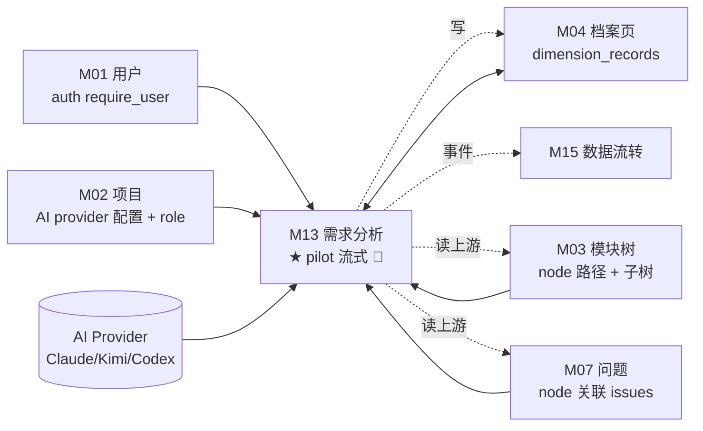
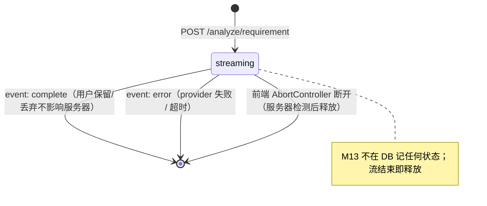

# M13 需求分析 - 详细设计

> **Pilot 角色**：第 4 个 pilot 模块，覆盖 §12A 流式 SSE 子模板首次实战。完成 + audit 后，流式子模板定稿，供 M16（🪷 后台异步）/ M18（🗂️ Queue）对照。
>
> **协作约定**：
> - ✅ 已根据 CY 2026-04-25 ack 8 个 Q 落定的节，直接采用
> - ⚠️ 本模块无"待 CY 裁决"项（brainstorming 阶段全部倾向 ack）
> - 🔗 关联 A/B 档规约 + ADR 均给链接

---

## 1. 业务说明 + 职责边界

### 用户场景（核心画面）

Editor 用户（以下简称"用户"）在 M04 某功能档案页（例：功能模块树里的"订单取消"节点），做需求评审/迭代思考：

1. 写一段需求描述：*"用户取消订单后退款 3 天到账，节假日顺延"*
2. 点 **"AI 分析"** 按钮，右侧开一个抽屉
3. 抽屉里**一个字一个字往外蹦分析结果**（流式）——通常 1-3 分钟吐完，包含：
   - 对当前 node 及关联 node 的影响范围
   - 需求完整性检查（缺的边界/异常/性能）
   - 改进建议
   - 潜在风险点
4. 吐完后抽屉底部出现 **"保存这份分析"** 按钮
5. 保存后：
   - 下次打开这个 node 的档案页，能在"历史分析"区块看到这份分析
   - **左侧关系图上，AI 分析里提到的受影响的其他节点会高亮**（视觉上看到影响面）

### 业务背景（引自 PRD / US）

- **核心用户故事**：
  - **US-B1.13**：作为 editor，我想对某个功能 node 写一段新需求描述，让 AI 帮我分析影响面 / 完整性 / 风险 / 改进建议，我盯着屏幕看结果逐字输出；满意就保存，保存后影响的节点在关系图上能被高亮。
  - **PRD F13 AC1-AC4**：
    - AC1：支持 L1/L2/L3 三档分析深度（用户选择）
    - AC2：流式响应（用户看着字逐个出来，不是等几分钟看完整结果）
    - AC3：分析结果可保存到 node 档案
    - AC4：保存时附带 `affected_node_ids`，供关系图高亮

### In scope（M13 负责）

- **1 个流式端点**：`POST /analyze/requirement` —— SSE 实时输出分析文本（见 §7）
- **1 个保存端点**：`POST /analyze/save` —— 保存分析结果 + 影响节点 ID 到 M04 dimension_records（`dimension_type_id = "requirement_analysis"`）
- **1 个查询端点**：`GET /analyze/affected-nodes` —— 返回某 node 最新一次分析的 affected_node_ids，供前端关系图高亮
- **Context 拼装**：分析前拉 M02（AI provider 配置）/ M03（node 路径 + 子树名字）/ M04（该 node 已有维度）/ M07（该 node 关联 issues）做 prompt context
- **超时兜底**：服务器侧 5 分钟硬超时（参 ADR-001 `TASK_TIMEOUTS["need_analysis"]`）
- **取消响应**：前端断开 fetch → 服务器停止 provider 流 + 释放资源
- **L1/L2/L3 分析深度**：作为 request 字段传入，由 prompt 模板区分（prompt 本身由 Service 层组装）

### Out of scope（其他模块负责）

| 不做的事 | 归属模块 |
|---------|---------|
| 测试点生成 / 保存（AI 基于分析结果生成测试点清单） | **不做**（外部已有 `requirements-to-testpoints` / `testpoint-generation-v2` skill 占位；Prism 实装的 `/analyze/generate-test-points` 不对齐到 M13，未来视业务需要新开模块） |
| AI provider 配置（Claude / Kimi / Codex / API key）| M02 |
| dimension_records 表的 CRUD 主权 | M04 |
| 关系图渲染 + 节点高亮 UI | M08 模块关系图 / M10 项目全景图 |
| 操作历史展示 | M15 数据流转 |
| 权限校验（project role / user 有效性） | M01 auth + M02 project role |

### 边界灰区（显式说明）

- **M13 vs M04**：M13 生成 / 保存"分析结果"这种内容，**但 dimension_records 表是 M04 own**。M13 通过 `M04.DimensionService.create_dimension_record()` Service 接口写入（参 R-X1 / ADR-003 规则 1），**不直写 dimension_records 表**。
- **M13 vs M08**：M13 只返回 `affected_node_ids`（node ID 清单），关系图怎么渲染高亮是 M08 的 UI 职责。
- **M13 vs M17**：都用 AI。M17 是"批量结构化导入"（多步 Queue + 落多表），M13 是"单需求即时分析"（一次流式 + 可选 save）。M17 异步 🗂️，M13 流式 🌊，两者共享 AI Provider 抽象（ADR-001 §4）但基础设施不共用。
- **M13 vs M16 / M18**：同属第四批 AI 异步类；M16 是🪷后台 fire-and-forget（用户不盯着看），M18 是🗂️ Queue 嵌入（批处理 embedding）。三者 §12 子模板不同（§12A / §12B / §12C）。
- **"分析"未保存的归属**：流式响应完成但用户没点保存 = 不写任何持久化（不写 activity_log，不写 dimension_records）。等于这次分析从未发生。

---

## 2. 依赖模块图



**前置依赖（必须先实现）**：
- M01（auth + require_user）
- M02（AI provider 配置 + role check）
- M03（node 查询 Service）
- M04（dimension_records 主表 + DimensionService）
- M07（IssueService 按 node_id 查询接口）

**外部依赖**：
- **AI Provider SDK**：anthropic / openai / kimi SDK 的**流式接口**（`stream=True` 或对应异步迭代器）
- **FastAPI StreamingResponse**：SSE 协议承载
- **fetch + ReadableStream**（前端）：POST body SSE 解析

**依赖契约**（M13 假设上游提供）：
- **M02**：`get_project_ai_config(project_id) -> {provider, api_key, model, base_url}`；`check_project_access(project_id, user_id, role=...)`
- **M03**：`get_node_with_path(project_id, node_id) -> Node`（带物化路径）；`get_subtree_names(project_id, node_id, depth=2) -> list[NodeSummary]`
- **M04**：
  - `list_dimension_records_for_node(project_id, node_id, dimension_type_key=None) -> list[DimensionRecord]`（读其他维度做 context）
  - `create_dimension_record(db, project_id, node_id, dimension_type_key, content, user_id) -> DimensionRecord`（save 阶段写入）
  - `get_latest_dimension_record(project_id, node_id, dimension_type_key) -> DimensionRecord | None`（affected-nodes 读最新）
  - **M04 侧必须登记 `dimension_type_key="requirement_analysis"`**（若不存在则 auto-create，首次写入时幂等创建）——这是 M13 对 M04 的契约扩展请求，M13 accept 后在 baseline-patch 或 M04 维护中补登记
- **M07**：`list_issues_by_node(project_id, node_id, limit=20) -> list[Issue]`

---

## 3. 数据模型（纯读聚合 + 通过 Service 写 M04）

### 纯读聚合声明（R3-5）

**本模块无自有实体表**，§3 适用**纯读聚合规范**（R3-5，引 [`ADR-003`](../../adr/ADR-003-cross-module-read-strategy.md)）。

M13 的持久化数据完全寄生在 M04 的 `dimension_records` 表，通过 `dimension_type_key = "requirement_analysis"` 标识。M13 不建任何自有表。

### 上游依赖表清单

| 表名 | 归属模块 | 访问方式 | ADR-003 规则 | 豁免规则 |
|------|---------|---------|--------------|---------|
| `projects` | M02 | Service 接口调用 `get_project_ai_config` | 规则 1 | — |
| `nodes` | M03 | Service 接口调用 `get_node_with_path` / `get_subtree_names` | 规则 1 | — |
| `dimension_records` | M04 | Service 接口调用（读 list/get_latest + 写 create）| 规则 1 | — |
| `issues` | M07 | Service 接口调用 `list_issues_by_node` | 规则 1 | — |
| `activity_log` | M15（横切表）| DAO 直写（横切豁免）| 规则 3 | 横切表 |

**禁止**：
- ❌ M13 直 JOIN `dimension_records` 或 `nodes`
- ❌ M13 直 INSERT `dimension_records`（必须经 M04 Service）
- ❌ M13 读 `issues` 表内部字段（只调 M07 Service 返回的 DTO）

### DAO 草案（仅 activity_log 横切写 + ephemeral context 聚合，无自有 model）

```python
# api/services/analyze_service.py（DAO 和 Service 合并，因无自有表）

class AnalyzeService:
    def __init__(
        self,
        db: Session,
        project_service,          # M02
        node_service,             # M03
        dimension_service,        # M04
        issue_service,            # M07
        activity_service,         # M15 横切
        ai_client,                # AI Provider 抽象
    ):
        self.db = db
        self.project = project_service
        self.node = node_service
        self.dimension = dimension_service
        self.issue = issue_service
        self.activity = activity_service
        self.ai = ai_client

    # Pydantic 聚合结构（无 SQLAlchemy model，本模块纯读 + 转手写）
    # — RequirementAnalysisContext：prompt 拼装前的上下文聚合，仅内存构造
    # — 见 §7 Pydantic schema
```

### Pydantic 聚合结构（显式标注无 SQLAlchemy model）

```python
# api/schemas/analyze_schema.py

class RequirementAnalysisContext(BaseModel):
    """分析前 M13 Service 层聚合上游数据的内存结构——无 SQLAlchemy model（本模块是纯读聚合 + 通过 M04 Service 写）"""
    node: NodeSummary                                     # 来自 M03
    node_path: list[str]                                  # 物化路径（面包屑名字）
    subtree_node_names: list[str]                         # 2 层子树名字（limit 20）
    existing_dimensions: list[DimensionRecordSummary]     # 该 node 已有的其他维度（来自 M04）
    related_issues: list[IssueSummary]                    # 该 node 关联 issues（来自 M07）
```

**无 ER 图**——M13 不拥有任何表，ER 图依附在 M03/M04/M07 各自的设计文档。

### 核心设计决策候选 B 改回成本（R3-4）

M13 无"⚠️ 核心设计决策"（分析结果存 M04 已在 brainstorming Q2 确定，非 pilot 期待决策点）。若未来 CY 反悔要建 M13 自有表，改回成本：

- Alembic 迁移步数：+2（新建 `requirement_analyses` 表 + 迁移现有 dimension_records 里的 requirement_analysis 类型到新表）
- 新增表数：1
- 受影响模块数：2（M04 删除 `requirement_analysis` dimension_type / M08 关系图 affected_nodes 数据源改接入 M13 新表）
- 数据不可逆性：可逆（dimension_records 里 requirement_analysis 记录可原地保留 + 查询改指向新表）

---

## 4. 状态机（无状态实体显式声明 R4-1）

### 决策：M13 自身无状态机

M13 流式请求是**一次性 HTTP 交互**，无持久化状态：
- 连接建立 → 流式响应 → 连接关闭 / 取消 / 超时 / 完成 —— 全过程服务器不写任何跟踪状态到 DB
- `save` 端点是一次性 INSERT（向 M04 写一行 dimension_record），不经过状态流转
- `affected-nodes` 端点是纯读

**持久化后的分析记录的"状态"**归属 M04（dimension_records 有自己的软删除 / version 等），不在 M13 职责。

### 禁止转换声明（R4-2 适用于持久化流的最小声明）

由于无状态机，R4-2"禁止转换至少 N 条"按**"生命周期阶段间不可跳跃"**精神给出以下声明：

| 禁止 | 触发 | 防护 |
|------|------|------|
| 未流完就调 `/analyze/save` | 前端错误调用（流未 complete 事件） | Service `save_analysis` 不做流状态检查——流是否完整对 save 透明（save 接受任意文本），但前端 SDK 封装只在收到 `event: complete` 后启用"保存"按钮 |
| 对同一流并发调 `/analyze/save` 多次（刷保存）| 用户/前端 bug | M04 `dimension_records` 写入无 upsert，会产生多条——**视为允许**（用户重复保存就是多条历史记录，不拦） |
| `/analyze/affected-nodes` 读到"save 未提交"数据 | 事务边界 | `save_analysis` 提交事务后返回前端；前端拿到 response 再跳转关系图，不存在脏读场景 |

### mermaid 状态图（形式占位，无实际状态）



---

## 5. 多人架构 4 维必答

| 维度 | 答案 | 实现细节 |
|------|------|---------|
| **Tenant 隔离** | ✅ project_id（URL 路径参数 + Service 层校验 node 归属）| 所有 3 个端点 URL 含 `{project_id}/{node_id}`；Service 入口统一调 `node_service.get_node_with_path(project_id, node_id, user_id)`——node 不存在 / 不属于该 project → 404；AI 分析 context 聚合严格限制在本 project 内 |
| **多表事务** | ❌ 不触发（save 只写 M04 dimension_records 1 行 + M15 activity_log 1 行）| save 阶段 Service 层 `with self.db.begin():` 包两次写（dimension_record + activity_log），单表事务语义；流式请求不写 DB 完全无事务 |
| **异步处理** | 🌊 **流式 SSE**（pilot 核心覆盖维度）| POST body + `StreamingResponse(media_type="text/event-stream")`；前端 fetch + ReadableStream 解析；**不走 arq Queue**（ADR-001 §4.1：交互式 AI 用 stream()）；详见 §12 |
| **并发控制** | ✅ 无 lock（CY Q4 ack）| 同一用户 / 同一 node 允许并发多个流式请求互不影响；save 端点无幂等（多次点保存 = 多条 dimension_record 历史记录）；不使用乐观锁 version（save 是 INSERT 非 UPDATE） |

### 约束清单逐项检查

| 清单项 | M13 是否触发 | 实现 |
|-------|-------------|------|
| 1. activity_log | ✅ 触发（仅 save 阶段 1 条）| §10 |
| 2. 乐观锁 version | ❌ 不触发（save 是 INSERT；流无持久化状态） | §5 并发列说明 |
| 3. Queue payload tenant | ❌ 不触发（M13 不走 Queue；流式走 HTTP header Bearer JWT，见 §8）| ADR-002 §横切影响里"M13 不覆盖"已 ack |
| 4. idempotency_key | ❌ 不触发（CY Q6 ack：save 多次 = 多条历史；流式每次分析结果可能不同，无幂等语义）| §11 显式声明 |
| 5. DAO tenant 过滤 | ✅ 触发（上游 Service 调用 + activity_log 直写）| §9 |

### 状态转换竞态分析（有状态机时必答——本模块无状态机显式 N/A）

M13 无状态机（§4 已声明），本行显式 N/A。M04 dimension_records 的状态变迁（软删 / version）由 M04 自身管理，不涉及 M13。

---

## 6. 分层职责表

| 层 | M13 涉及文件 | 该层职责 |
|----|------------|---------|
| **Page** | `web/src/app/projects/[pid]/nodes/[nid]/page.tsx` | M04 档案页——挂载 M13 分析抽屉 UI；"保存"按钮 + 关系图高亮触发 |
| **Component** | `web/src/components/business/analyze-drawer.tsx`<br>`web/src/components/business/analyze-sse-client.ts` | 流式抽屉 UI + fetch-based SSE 客户端（POST + ReadableStream 解析）+ AbortController 取消 |
| **Server Action** | `web/src/actions/analyze.ts` | session 校验 + 转发到 FastAPI `/analyze/save` 和 `/analyze/affected-nodes`（非流式端点）；流式端点**不走 Server Action**（浏览器直接 fetch FastAPI，见 §8 注释） |
| **Router** | `api/routers/analyze.py` | 3 个 endpoints + `Depends(require_user)` + project_id/node_id 路径参数 + role check |
| **Service** | `api/services/analyze_service.py` | prompt 组装 + 调 M02/M03/M04/M07 聚合 context + 调 AI Provider + 流式响应生成 + save / affected-nodes 业务逻辑 |
| **AI Client** | `api/clients/ai_client.py` | 多 provider 统一流式接口（`async def analyze(prompt, context) -> AsyncIterator[str]`）——与 M17 共享 |
| **Prompt Template** | `api/services/analyze_prompts.py` | L1/L2/L3 三档 prompt 模板 + context 注入 |
| **Schema** | `api/schemas/analyze_schema.py` | Pydantic Request / Response / SSE event schema |
| **（无 Model）** | — | M13 不拥有 SQLAlchemy model（R3-5 纯读聚合） |
| **（无 DAO）** | — | 持久化走 M04 Service；activity_log 横切写用 M15 ActivityService |

**禁止**：
- ❌ Router 直查任何 DB 表（全部走 Service）
- ❌ Service 直写 `dimension_records` 或直查其他模块表（走 Service 接口 / R-X1）
- ❌ Component 直接 `fetch('/api/...')` 绕过 AbortController 管理（取消机制会失效）
- ❌ Prompt 模板里硬编码 node 名称等业务数据（必须通过 context 结构注入）

---

## 7. API 契约（Pydantic + OpenAPI）

### REST Endpoints

| 方法 | 路径 | 用途 | Pydantic 入参 | 出参 | SSE |
|------|------|------|--------------|------|-----|
| POST | `/api/projects/{project_id}/nodes/{node_id}/analyze/requirement` | 启动流式分析 | `RequirementAnalysisRequest` | `text/event-stream`（见下方 SSE 事件）| ✅ |
| POST | `/api/projects/{project_id}/nodes/{node_id}/analyze/save` | 保存分析结果 | `SaveAnalysisRequest` | `SaveAnalysisResponse` | ❌ |
| GET | `/api/projects/{project_id}/nodes/{node_id}/analyze/affected-nodes` | 查最新分析的影响节点 | —（URL 参数）| `AffectedNodesResponse` | ❌ |

### Pydantic schema 草案

```python
# api/schemas/analyze_schema.py
from enum import Enum
from typing import Literal, Any
from uuid import UUID
from pydantic import BaseModel, Field

class AnalysisLevel(str, Enum):
    L1 = "L1"   # 快速影响面判断（~30s）
    L2 = "L2"   # 标准完整性 + 风险（~1-2min）
    L3 = "L3"   # 深度（含改进建议详述、~2-3min）

class RequirementAnalysisRequest(BaseModel):
    requirement_text: str = Field(..., min_length=1, max_length=5000)
    analysis_level: AnalysisLevel = AnalysisLevel.L2

class SaveAnalysisRequest(BaseModel):
    analysis_result: str = Field(..., min_length=1)                # 完整 markdown 文本
    analysis_level: AnalysisLevel
    affected_node_ids: list[UUID] = Field(default_factory=list)    # AI 识别出的受影响 node（可为空）
    ai_provider: str                                               # claude/kimi/codex/mock（来自流式 event: complete）
    ai_model: str
    analysis_time_ms: int
    requirement_text: str = Field(..., min_length=1, max_length=5000)  # 回传用于留痕（审计可回溯输入）

class SaveAnalysisResponse(BaseModel):
    dimension_record_id: UUID
    message: str = "分析结果已保存"

class AffectedNodesResponse(BaseModel):
    node_id: UUID
    affected_node_ids: list[UUID]
    analysis_record_id: UUID | None = None         # 无历史分析时为 null
    analysis_saved_at: str | None = None           # ISO 8601
```

### SSE Event Schema（§12A 子模板核心）

3 种事件：

```python
# 服务器 → 客户端 SSE 事件 schema（强类型 Pydantic，Router 层做序列化）

class SSEChunkEvent(BaseModel):
    """event: chunk ——一段增量分析文本"""
    text: str                          # 本 chunk 的文本片段
    level: AnalysisLevel               # 回传便于前端区分多 chunk
    source: Literal["ai"] = "ai"       # 未来扩展如 "template" / "system" 时区分

class SSECompleteEvent(BaseModel):
    """event: complete ——流式结束，含元数据给前端做 save payload"""
    full_result: str                   # 完整拼接文本（便于前端直接 save 不需自己拼）
    metadata: dict[str, Any]           # {ai_provider, ai_model, analysis_level, analysis_time_ms, matched_template_id}

class SSEErrorEvent(BaseModel):
    """event: error ——流式失败（provider / 超时 / 其他）"""
    error: str                         # 错误描述（面向用户）
    error_code: str                    # 业务错误码（§13 ErrorCode）
```

**SSE 传输格式**（符合 SSE 规范）：

```text
event: chunk
data: {"text": "需求分析如下...", "level": "L2", "source": "ai"}

event: chunk
data: {"text": "1. 影响范围：", "level": "L2", "source": "ai"}

event: complete
data: {"full_result": "需求分析如下...1. 影响范围：...", "metadata": {...}}

```

或错误结束：

```text
event: chunk
data: {"text": "部分结果", "level": "L2", "source": "ai"}

event: error
data: {"error": "AI Provider 调用失败", "error_code": "ANALYSIS_PROVIDER_ERROR"}

```

**客户端消费策略**：
- 收到 `chunk` → append 到展示区
- 收到 `complete` → 展示区内容定稿 + 启用"保存"按钮；save 时用 `complete.full_result` + `complete.metadata` 构造 `SaveAnalysisRequest`
- 收到 `error` → 展示已累积 chunks + 显示错误提示；**保留"保存已收到部分"按钮**（用户可选择保存不完整结果）
- 用户点"取消"按钮 → `AbortController.abort()`，连接断开；服务器侧 §8 detect

---

## 8. 权限三层防御点

| 层 | 检查 | 实现 | 凭据路径（ADR-004）|
|----|------|------|-------------------|
| **Server Action**（save / affected-nodes） | session 是否有效 | `getServerSession()`；无则 401 | — |
| **Server Action**（流式）| **不经过 Server Action**（见下方说明）| — | — |
| **Router** | 用户对 project ≥editor（流式 + save）/ ≥viewer（affected-nodes） | `Depends(require_user)` + `check_project_access(project_id, role="editor")` / `role="viewer"` | **P1 Bearer JWT**（优先）+ P2 Internal HMAC（兜底）|
| **Service** | node 确实属于该 project | `self.node.get_node_with_path(project_id, node_id, user_id)`——跨项目越权抛 `NotFoundError`（不泄露存在性） | — |

### 流式端点的 auth 特殊说明（Q1 ack：走 P1，不扩 ADR-004）

**浏览器直接 fetch FastAPI**（不经 Next.js Server Action）的原因：Server Action 是普通 JSON response，不支持 SSE `ReadableStream` 转发；若强行让 Server Action 转发流，会把整个流缓冲成单个 response。

**凭据传输**：
- 前端从登录 session 拿 JWT（via `next-auth` 的 `getSession()` 或同等），手动塞入 fetch header
- `fetch('/api/.../analyze/requirement', { headers: { Authorization: 'Bearer <jwt>' }, method: 'POST', body: JSON.stringify(req), signal: abortController.signal })`
- FastAPI `Depends(require_user)` 自动解析 Bearer（ADR-004 P1）

**为什么不扩展 ADR-004 加"P8 SSE 凭据路径"**（CY Q1 倾向 A）：
- Prism F13 实装用 POST + fetch，天然支持 Authorization header，不触碰 EventSource 的 "只 GET 无 custom header" 限制
- 本期所有 AI 流式场景（M13 / M16-若流式 / M18-若流式）均为 POST 交互式，无 GET 订阅型 SSE
- 等真出现 GET 流式场景（实时通知订阅 / 系统日志推流等）再扩 P8，未来扩展成本：ADR-004 加一个段落 + 引用方清单更新

**ADR-002 §横切影响遗留**："M13 不覆盖本 ADR——设计时另起 ADR 或扩展本 ADR" → M13 结论为 **"不扩不起，ADR-002 脚注一句话说明'M13 pilot 结论：流式 SSE 鉴权走 ADR-004 P1 + fetch header，本期无 chunk 级鉴权需求（连接级已覆盖）'"**。该脚注在 M13 accepted 后由主对话补充到 ADR-002。

### 流式期间的连接级 auth 一致性

- JWT 在流开启时验证（`Depends(require_user)` 入口）
- 5 分钟硬超时内流活跃，JWT 即使中途过期不影响已建立的 HTTP/1.1 长连接（HTTP 语义不做中途校验）
- 若用户在其他地方被管理员禁用（ADR-004 §5 token_invalidated_at 更新），当前流继续跑完——**接受此脱节**（最大 5 分钟暴露窗口），tests.md 有 1 条场景记录此行为（非 bug）

### 无 chunk 级鉴权需求

- 每个 chunk 是单向服务器 → 客户端，无客户端命令（对比 M17 WebSocket 的"每命令重校 task_id"）
- 流内无用户操作接口，攻击面最小
- 取消通过 TCP 层断开（fetch AbortController），不经业务协议

---

## 9. DAO tenant 过滤策略

### 无自有 DAO（纯读聚合）

M13 不拥有自有表，故不存在"M13 DAO"。tenant 过滤由上游 Service 承担：

- **M02 Service**：`get_project_ai_config(project_id)` 内部过滤 `WHERE project_id = ?`
- **M03 Service**：`get_node_with_path(project_id, node_id, user_id)` 内部 `WHERE project_id = ? AND id = ?`——跨项目拿 node 返回 None
- **M04 Service**：`list_dimension_records_for_node(project_id, node_id, ...)` / `create_dimension_record` 内部强制 `WHERE project_id = ?`
- **M07 Service**：`list_issues_by_node(project_id, node_id)` 内部过滤

### 横切表（M15 activity_log）

M13 Service 调 `ActivityService.log(...)` 时显式传 `project_id`，ActivityService DAO 直写 activity_log（横切豁免 ADR-003 规则 3）。

### 豁免清单

- **豁免**：activity_log 写入（ADR-003 规则 3 横切表）
- **豁免**：无（M13 无自有查询）

---

## 10. activity_log 事件清单

### 决策：Q6 ack A ——仅 save 写 1 条，流式启动 / 完成 / 取消不写

| action_type | target_type | target_id | summary | metadata |
|-------------|-------------|-----------|---------|----------|
| `requirement_analysis.save` | `node` | node_id | 保存需求分析到 {node_name} | `{analysis_record_id, analysis_level, affected_node_count, ai_provider, ai_model, analysis_time_ms, requirement_text_hash}` |

**只 1 条的理由**（Q6 ack）：
- activity_log 语义 = "数据变更审计"（R10-2），未持久化的流不算变更
- 用户操作历史展示 M15 不被"启动分析但没保存"这种噪音刷屏
- 若未来需要 AI usage tracking（统计 token 消耗 / 谁用得多），另起 `ai_usage_log` 专用表，不复用 activity_log

### metadata 字段说明

- `analysis_record_id`：新建的 dimension_record UUID（便于从 activity_log 反查"这次 save 存到了哪条记录"）
- `analysis_level`：L1/L2/L3
- `affected_node_count`：`len(affected_node_ids)`，不存 ID 数组（避免 metadata 膨胀）
- `ai_provider` / `ai_model`：便于按 provider 统计使用分布
- `analysis_time_ms`：供未来成本归因
- `requirement_text_hash`：SHA256(requirement_text)——留审计锚点但不存明文（5000 字 metadata 过大），未来如需查"这条分析对应什么需求"可用 hash 反查

### R10-1 批量合规性

本模块无批量操作（save 是单条 INSERT），R10-1 自然满足。

### R10-2 action_type / target_type 回写 M15

- 新增 `action_type = "requirement_analysis.save"` → 回写 M15 的 `ActionType` 枚举（M13 accept 后执行）
- `target_type = "node"` 已存在 M15 枚举（M03 / M04 已用），无需新增
- 若 M15 启用 CHECK constraint，需新 Alembic 迁移

### target_type = "node" 而非 "dimension_record" 的理由

Reviewer 可能质疑"save 写的是 dimension_record，target_id 应该是 record_id"。选 `target_type = "node"` 的理由：
- 用户心智模型：这条 activity 属于"对 XX 功能做了分析"，不是"创建了 XX 记录"
- M15 时间线展示按 node 折叠时自然归组到 node 下
- `analysis_record_id` 放在 metadata 仍可查

---

## 11. idempotency_key 适用操作清单

### 决策：M13 三端点均**不使用** idempotency key（Q6 ack 精神延伸）

| 端点 | 是否需要 idempotency | 理由 |
|------|---------------------|------|
| `POST /analyze/requirement` | ❌ | 每次分析结果可能不同（AI 非确定性）；幂等 = 缓存即命中，违背"用户想重新分析"的语义 |
| `POST /analyze/save` | ❌ | 用户重复点保存 = 多条历史记录是合法产物（Q6 业务决策）；加 idempotency 会隐式去重让用户困惑 |
| `GET /analyze/affected-nodes` | N/A | GET 本身幂等，无需应用层 key |

### R11-2 "project_id 是否参与 key 计算" 必答

显式回答：**M13 无 idempotency_key，project_id 不参与 key 计算（因不存在 key）**。若未来需要加 idempotency（如按 `SHA256(requirement_text + analysis_level)` 7 天复用），按 R11-3 要求 key 必含 project_id —— 已在 M17 教训中确认。

---

## 12. §12 异步形态 = 🌊 流式 SSE（§12A 子模板首次实战）

### §12A 流式 SSE 子模板（M13 pilot 产出 7 字段）

Q7 ack A：7 字段对齐 §12C Queue schema 的详细度。M13 accepted 后，本节结构成为 §12A 子模板供 M16 / M18（若选流式）照抄。

#### 字段 ①：SSE 端点路径

```
POST /api/projects/{project_id}/nodes/{node_id}/analyze/requirement
Content-Type: application/json
Accept: text/event-stream
Authorization: Bearer <jwt>    # ADR-004 P1
```

#### 字段 ②：SSE event 类型枚举

| event | 触发 | 频率 |
|-------|------|------|
| `chunk` | provider stream 每次 yield | 高频（每秒 5-50 次，取决 provider）|
| `complete` | provider stream 正常结束 | 恰好 1 次 / 流 |
| `error` | provider 抛异常 / 超时 / 其他服务器错误 | 0 或 1 次 / 流（与 complete 互斥）|

**未来扩展预留**：`event: progress`（标记"当前分析到第 N 节"），本期不用。

#### 字段 ③：每个 event 的 data payload schema

见 §7 `SSEChunkEvent / SSECompleteEvent / SSEErrorEvent`。强制用 Pydantic BaseModel 序列化（R7-1 强类型），不裸 dict。

#### 字段 ④：鉴权路径

**ADR-004 P1**（Bearer JWT via fetch Authorization header）——见 §8。

**chunk 级鉴权**：无（连接级 Auth 已覆盖；无客户端→服务器命令通道）。

#### 字段 ⑤：超时策略

- **服务器硬超时**：`asyncio.timeout(300)` 包住 `async for chunk in provider.analyze(...)`（参 ADR-001 `TASK_TIMEOUTS["need_analysis"] = 300s`）
- 超时触发：发 `event: error` with `{error: "分析超时，请重试", error_code: "ANALYSIS_TIMEOUT"}`，关闭 stream + provider 流（`aclose()`）
- **客户端超时**：前端不自己做超时（靠服务器兜底 + AbortController 用户手动）

#### 字段 ⑥：取消机制

- **前端**：`AbortController.abort()` —— 用户点"取消"按钮触发
- **服务器检测**：FastAPI 的 `Request.is_disconnected()` 在 StreamingResponse 生成器每次 yield 后检查；断开时：
  1. 停止 `async for chunk in provider.analyze(...)` 循环
  2. 调 `provider.aclose()` 释放 AI SDK 流资源（避免 SDK 后台继续拉取）
  3. 不发任何 SSE event（连接已断）
- **副作用**：接受 AI token 浪费（已发请求的部分 token 已扣费）——对齐 M17 Q5 精神

#### 字段 ⑦：断线重连策略

**不支持续传**（Q3 ack A）：
- 前端检测到连接断开（fetch promise reject / reader 结束）→ UI 提示"连接中断，请重新分析"
- 用户点"再分析"按钮 = 重新发 POST 请求（全新流，全新 token 消耗）
- **不使用** SSE `Last-Event-ID` header（避免服务器缓存 partial chunks 的基础设施复杂度）

### 与 §12B 后台（M16 待补完）/ §12C Queue（M17 已定）的对比

| 维度 | §12A 流式（M13 pilot）| §12B 后台 fire-and-forget（M16 待）| §12C Queue 持久化（M17）|
|------|---------------------|----------------------------------|------------------------|
| 用户是否盯着看 | ✅ 盯着 | ❌ 不盯 | ❌ 不盯 |
| 持久化 | ❌ 流无状态（save 是另外的 REST）| ✅ 任务表（pending/done/failed）| ✅ 任务表 + items 表 |
| 失败重试 | ❌ 用户手动重发起 | 🟡 视 M16 定 | ✅ 3 次指数退避 + 死信 |
| 鉴权路径 | ADR-004 P1（连接级）| ADR-004 P1 + 任务表 user_id 校验 | ADR-004 P7（TaskPayload）|
| 取消 | fetch AbortController | 任务表状态改 cancel | WebSocket 命令 + WS 重校 |
| 浪费代价 | token 浪费（user 可接受）| 任务残留（可清理）| 任务数据 + token 双浪费 |

---

## 13. ErrorCode 新增清单

```python
# api/errors/codes.py
class ErrorCode(str, Enum):
    # ... 已有

    # 模块（M13）
    ANALYSIS_NODE_NOT_FOUND = "ANALYSIS_NODE_NOT_FOUND"           # node 不存在 / 跨项目越权
    ANALYSIS_PROVIDER_ERROR = "ANALYSIS_PROVIDER_ERROR"           # AI provider 调用失败
    ANALYSIS_TIMEOUT = "ANALYSIS_TIMEOUT"                         # 5 分钟硬超时
    ANALYSIS_QUOTA_EXCEEDED = "ANALYSIS_QUOTA_EXCEEDED"           # 用户 / 项目 AI 配额超限
    ANALYSIS_SAVE_FAILED = "ANALYSIS_SAVE_FAILED"                 # save 阶段写 dimension_record 失败
    ANALYSIS_INVALID_LEVEL = "ANALYSIS_INVALID_LEVEL"             # L1/L2/L3 以外（理论上 Pydantic Enum 拦住，预留）
```

```python
# api/errors/exceptions.py
class AnalysisNodeNotFoundError(NotFoundError):
    code = ErrorCode.ANALYSIS_NODE_NOT_FOUND
    message = "Node not found or not in project"

class AnalysisProviderError(AppError):
    code = ErrorCode.ANALYSIS_PROVIDER_ERROR
    http_status = 503
    message = "AI provider call failed"

class AnalysisTimeoutError(AppError):
    code = ErrorCode.ANALYSIS_TIMEOUT
    http_status = 504
    message = "Analysis exceeded server timeout (5min)"

class AnalysisQuotaExceededError(AppError):
    code = ErrorCode.ANALYSIS_QUOTA_EXCEEDED
    http_status = 429
    message = "AI quota exceeded"

class AnalysisSaveFailedError(AppError):
    code = ErrorCode.ANALYSIS_SAVE_FAILED
    http_status = 500
    message = "Failed to save analysis result"

class AnalysisInvalidLevelError(AppError):
    code = ErrorCode.ANALYSIS_INVALID_LEVEL
    http_status = 422
    message = "Invalid analysis level (must be L1/L2/L3)"
```

**R13-1 合规**：6 个 ErrorCode 各有对应 AppError 子类（无缺失）。

**R13-2 跨模块错误 wrap**：
- M04 `create_dimension_record` 失败 → M13 wrap 为 `AnalysisSaveFailedError`（不直接 raise M04 的 DimensionWriteError）
- M02 `get_project_ai_config` 找不到 config → M13 wrap 为 `AnalysisProviderError`（指引用户"先配置 AI provider"）
- M03 `get_node_with_path` 找不到 → M13 wrap 为 `AnalysisNodeNotFoundError`

---

## 14. 测试场景

详见独立文件：[`tests.md`](./tests.md)

主文档大纲：
- **golden path**：L1/L2/L3 三档各跑通一次完整分析 + 保存 + 关系图高亮
- **边界**：需求文本 0 字符 / 5000 字符 / 超长截断；affected_node_ids 为空 / 50+
- **并发**：同 node 并发 3 个流 / 同 user 并发多 node 分析 / 保存同一结果 3 次（产生 3 条历史）
- **tenant**：跨 project 分析 → 404；跨 project save → 404；affected-nodes 跨项目 → 404
- **权限**：viewer 发起分析 → 403；未登录发起 → 401；editor 可分析可保存 + viewer 只能读 affected-nodes
- **错误处理**：provider 瞬时失败 → error event；5 分钟超时；provider quota 耗尽；save 时 M04 写入失败
- **流式特化**：chunk 顺序；complete 后前端能正确 save；error 后用户可保存已累积内容；AbortController 取消 server 真停（含 provider.aclose 调用验证）
- **JWT 中途过期**：流开始时有效，跑到一半 JWT 过期 → 流继续跑完（接受 §8 声明的窗口）；新 save 请求 401
- **关系图联动**：save 后 GET /affected-nodes 立即可读（无缓存延迟）；无历史分析时返回空数组

---

## 15. 完成度判定 checklist

- [x] 节 0：frontmatter 12 字段（status=draft 待 accepted）
- [x] 节 1：业务说明 + 用户场景画面 + US-B1.13 + PRD F13 AC1-AC4 + in/out scope + 边界灰区
- [x] 节 2：依赖模块图（含外部 AI Provider SDK + fetch + FastAPI StreamingResponse）+ 5 模块 Service 契约
- [x] 节 3：**R3-5 纯读聚合声明 + 上游依赖表（5 表）+ Service 合并 DAO + Pydantic 聚合结构 + ADR-003 规则 1 引用**（无 SQLAlchemy class 因无主表）
- [x] 节 4：**R4-1 无状态机显式声明** + mermaid 形式占位 + "生命周期阶段不可跳跃"精神的 3 条禁止
- [x] 节 5：4 维必答（异步 ✅ 流式🌊核心覆盖）+ 5 项清单 + **R5-2 无状态机时 N/A 显式**
- [x] 节 6：分层职责表（含 AI Client / Prompt Template / 无 Model / 无 DAO 显式）
- [x] 节 7：3 endpoints + Pydantic Request/Response + SSE Event Schema 3 类 + 传输格式样例 + 客户端消费策略
- [x] 节 8：三层防御 + **流式端点 auth 特殊说明**（绕过 Server Action 的理由 + 连接级 auth 一致性 + 无 chunk 级鉴权需求）+ ADR-004 P1 引用
- [x] 节 9：DAO tenant 过滤（无自有 DAO 显式）+ 横切豁免（activity_log）
- [x] 节 10：activity_log 1 类事件 + **R10-1 批量合规 + R10-2 回写 M15 + metadata 7 字段 + target_type 选择理由**
- [x] 节 11：**R11-2 project_id 必答**（三端点均无 idempotency 显式声明）+ 未来升级路径
- [x] 节 12：**§12A 流式 SSE 子模板 7 字段**（pilot 产出核心）+ 与 §12B/§12C 对比表
- [x] 节 13：6 个 ErrorCode + AppError 子类 + R13-1 / R13-2 合规（跨模块 wrap 3 类）
- [x] 节 14：测试场景大纲（详情转 tests.md）
- [x] 节 15：本 checklist 全勾过
- [ ] **🔴 第一轮 reviewer audit（完整性）通过**
- [ ] **🔴 第二轮 reviewer audit（边界场景 + 流式特化）通过**
- [ ] **🔴 第三轮 reviewer audit（§12A 子模板可复用性 / 未来 M16/M18 对照）通过**
- [ ] CY 全文复审通过 → status 转 accepted
- [ ] accepted 后的横切补丁：
  - [ ] M04 登记 `dimension_type_key = "requirement_analysis"`（baseline-patch）
  - [ ] M15 ActionType 枚举加 `requirement_analysis.save`（Alembic + schema）
  - [ ] ADR-002 脚注补 M13 pilot 结论（"流式 SSE 不扩 ADR-004"）

---

## CY 决策记录（2026-04-25 brainstorming）

| Q | 决策点 | 决定 |
|---|-------|------|
| Q0 | M13 业务范围 | **C** 流式分析 + save + affected-nodes（不含 test-points） |
| Q1 | SSE 鉴权路径 | **A** 走 ADR-004 P1 Bearer JWT，不扩 ADR-004 |
| Q2 | 持久化策略 | **A** 存 M04 dimension_records（`requirement_analysis` 类型），走 M04 Service |
| Q3 | 断线重连 | **A** 不支持续传，用户重新发起 |
| Q4 | 并发 + 超时 | 并发 **A**（允许）+ 超时 **A**（server 5 分钟 asyncio.timeout）|
| Q5 | 取消机制 | **A** fetch AbortController → is_disconnected → provider.aclose() |
| Q6 | activity_log 粒度 | **A** 仅 save 写 1 条 |
| Q7 | §12A 子模板字段 | **A** 7 字段（端点/event 类型/data schema/鉴权/超时/取消/断线）|

---

## 关联参考

- 上游设计：
  - [`design/00-architecture/04-layer-architecture.md`](../../00-architecture/04-layer-architecture.md)（Q5 事务边界 / Q6 AI 任务 tenant 隔离）
  - [`design/00-architecture/05-module-catalog.md`](../../00-architecture/05-module-catalog.md)（M13 4 维 🌊 流式 + 🔴 高复杂度）
  - [`design/00-architecture/06-design-principles.md`](../../00-architecture/06-design-principles.md)（原则 5 + 5 项清单）
  - [`design/00-architecture/07-capability-matrix.md`](../../00-architecture/07-capability-matrix.md)
- ADR：
  - [`ADR-001`](../../adr/ADR-001-shadow-prism.md)（§4.1 AI Provider stream() 接口）
  - [`ADR-002`](../../adr/ADR-002-queue-consumer-tenant-permission.md)（§横切影响里"M13 不覆盖"待 M13 accept 后补脚注）
  - [`ADR-003`](../../adr/ADR-003-cross-module-read-strategy.md)（规则 1 上游 Service 接口）
  - [`ADR-004`](../../adr/ADR-004-auth-cross-cutting.md)（P1 Bearer JWT）
- 同 pilot：
  - [`M04-feature-archive/00-design.md`](../M04-feature-archive/00-design.md)（同步 pilot 范本）
  - [`M17-ai-import/00-design.md`](../M17-ai-import/00-design.md)（异步 Queue pilot 范本）
  - [`M01-user-account/00-design.md`](../M01-user-account/00-design.md)（auth pilot 范本）
- Prism 对照：
  - `/root/prism/api/routers/analyze.py`（F13 SSE 现状实装）
  - `/root/prism/api/services/ai_provider.py`（`analyze() -> AsyncIterator[str]` 流式接口）
  - `/root/prism/docs/adr/004-ai-service-layer.md`（Prism AI Provider 抽象）
  - `/root/prism/docs/adr/005-auth-strategy.md`（Prism Auth.js + JWT）
- 业务故事：
  - `/root/prism/docs/product/PRD.md` F13 AC1-AC4
- 方法论：
  - `/root/cy/ai-quality-engineering/02-技术/AI工具与工作流/Powerskill流水线-四段式实战与提示词模板.md`
