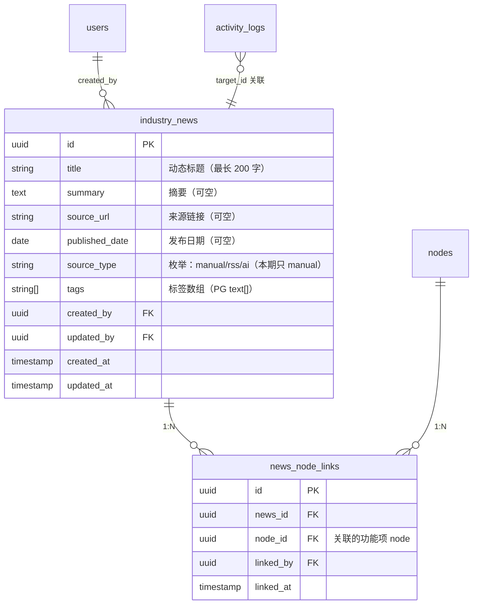

# M14 行业动态 - 详细设计

> **特殊说明**：M14 是全局共享数据模块，无 tenant 隔离（05-catalog Q3.1 / 07-capability-matrix 明确）。
> DAO 层 tenant 过滤执行全局豁免，但必须显式声明（见节 9）。

**协作约定**：
- ✅ 已定稿节：直接采用（4 维机械推导已确定）
- ⚠️ **待 CY 裁决**：给候选 + 我的倾向 + 你裁决
- 🔗 关联到 A/B 档规约的均给链接

---

## 0. Frontmatter 快速索引

| 字段 | 值 |
|------|-----|
| 模块 | M14 行业动态 |
| PRD 关联 | F14（v0.2 - 能分析、能对比、能追踪） |
| 用户故事 | US-B2.4（编辑者录入动态并关联功能项） |
| 复杂度分层 | 🟢 低复杂度（全局数据 / 基础 CRUD） |
| 4 维 | Tenant ❌全局 / 事务 ❌ / 异步 ❌ / 并发 ❌ |
| 前端形态 | 信息流（列表卡片 + 关联功能项 tag） |
| 模板版本 | C 档 v1（基于 M04 pilot 模板） |

---

## 1. 职责边界（in scope / out of scope）

### In scope（M14 负责）

> ⚠️ **AI 推断，CY 复审必改**——以下业务边界基于 US-B2.4 + F14 推断，PRD 业务细节未完整描述。

- **行业动态录入**：编辑者录入一条行业动态（标题 / 摘要 / 来源链接 / 发布日期 / 标签）（US-B2.4）
- **动态列表展示**：所有用户查看全局动态信息流（时间倒序分页）
- **关联功能项**：将一条动态关联到一个或多个功能项 node（US-B2.4 "关联到具体功能项"）
- **动态删除**：录入者或管理员删除一条动态
- **动态编辑**：录入者或管理员修改已录入的动态内容

### Out of scope（其他模块负责）

| 不做的事 | 归属模块 |
|---------|---------|
| RSS / 第三方 API 自动抓取动态 | 本期不实现（见节 1 灰区） |
| AI 自动分类 / 摘要生成 | 本期不实现（见节 1 灰区） |
| 功能项信息录入 / CRUD | M03 / M04 |
| 操作日志展示（数据流转） | M15（消费 activity_log） |

### 边界灰区（显式说明）

> ⚠️ **AI 推断，CY 复审必改**——数据来源是本设计最大的未确认点，PRD（01-PRD.md）未明说。

#### 灰区 1：数据来源（最关键决策）

| 候选 | 含义 | 优 | 劣 | 我的倾向 |
|------|------|----|----|---------|
| **A: 手动录入（推荐）** | 编辑者手动填写标题/摘要/来源链接 | 本期范围最小；实现最简；CY 能控制质量 | 信息量受限于人工 | ⭐ |
| **B: 第三方 RSS 拉取** | 配置 RSS 源后定时 pull | 信息自动化 | 需要 arq Queue + 定时任务；RSS 源管理；去重 | 超出 M14 🟢 低复杂度定位 |
| **C: AI 自动抓取** | 调 LLM 或爬虫定期获取热点 | 信息最丰富 | 最复杂；成本高；本期无此规划 | 超出范围 |

**我倾向 A：本期手动录入**——07-capability-matrix 将 M14 列为 AI ❓（低置信），PRD Q3.1 未提 M14 有异步/AI 能力；保持 🟢 低复杂度定位一致。B/C 候选预留扩展口（`source_type` 字段枚举值预留）。

#### 灰区 2：动态可见范围

> ⚠️ **AI 推断，CY 复审必改**

M14 是全局数据——所有已登录用户均可见，还是需要限定某种条件？

| 候选 | 含义 | 我的倾向 |
|------|------|---------|
| **A: 所有已登录用户可见** | 全局信息流，无项目限制 | ⭐ |
| **B: 仅项目成员可见（按项目过滤）** | 动态归属某项目 | 违背"全局共享"定位（05-catalog 明确 Tenant ❌） |

**我倾向 A**：全局可见，无 tenant 过滤，与 05-catalog 一致。

---

## 2. 依赖模块图（M? → M?）

```mermaid
flowchart LR
  M01[M01 用户<br/>登录态] --> M14
  M03[M03 功能模块树<br/>nodes 表] -.关联目标.-> M14

  M14[M14 行业动态<br/>全局共享] -.事件.-> M15[M15 数据流转<br/>消费 activity_log]

  subgraph 全局数据（无 tenant）
    M14
  end
```

**前置依赖（必须先实现）**：M01（用户鉴权）

**依赖契约（M14 假设上游提供）**：
- M01：`current_user` 可拿到 `user_id` + `role`
- M03：`nodes(node_id)` 存在校验（关联功能项时校验 node 存在，但不过滤 project）

**独立性说明**：M14 不依赖 M02 / M04，可独立实现（全局数据，无项目上下文）。

---

## 3. 数据模型（SQLAlchemy + Alembic 要点）

> ⚠️ **AI 推断，CY 复审必改**——字段设计基于 US-B2.4 + 灰区 1 候选 A（手动录入）推断，细节待 CY 确认。

### ⚠️ 待 CY 裁决：`source_type` 枚举是否本期就定义

| 候选 | 优 | 劣 |
|------|----|----|
| **A: source_type 列预留**（推荐） | 本期只有 `manual`；后期 RSS / AI 无需 schema 变更 | 代码里 if-else 提前写但本期只走 manual 分支 |
| **B: 无 source_type 字段** | 更简单，本期确实只有 manual | 后期加字段需 Alembic 迁移 |

**我倾向 A**：预留字段成本极低，避免后期迁移。

### ER 图（候选 A，手动录入 + source_type 预留）



### SQLAlchemy 模型

```python
# api/models/industry_news.py
from sqlalchemy.orm import Mapped, mapped_column, relationship
from sqlalchemy import ForeignKey, UniqueConstraint, Index, Text, Date
from sqlalchemy.dialects.postgresql import UUID, ARRAY
from sqlalchemy import String
from datetime import date, datetime
from uuid import UUID as PyUUID, uuid4
from .base import Base, TimestampMixin

class IndustryNews(Base, TimestampMixin):
    """行业动态全局实体（无 project_id —— M14 全局无 tenant）"""
    __tablename__ = "industry_news"
    __table_args__ = (
        # 注意：M14 全局数据，无 project_id 约束
        Index("ix_industry_news_created_at", "created_at"),
        Index("ix_industry_news_created_by", "created_by"),
        Index("ix_industry_news_tags", "tags", postgresql_using="gin"),
    )

    id: Mapped[PyUUID] = mapped_column(UUID(as_uuid=True), primary_key=True, default=uuid4)
    title: Mapped[str] = mapped_column(Text, nullable=False)           # 动态标题（最长 200 字）
    summary: Mapped[str | None] = mapped_column(Text, nullable=True)   # 摘要（可空）
    source_url: Mapped[str | None] = mapped_column(Text, nullable=True)  # 来源链接（可空）
    published_date: Mapped[date | None] = mapped_column(Date, nullable=True)  # 发布日期（可空）
    source_type: Mapped[str] = mapped_column(Text, nullable=False, default="manual")  # 枚举：manual/rss/ai（本期只 manual）
    tags: Mapped[list[str]] = mapped_column(ARRAY(String), nullable=False, default=list)  # 标签数组（PG text[]）
    created_by: Mapped[PyUUID] = mapped_column(UUID(as_uuid=True), ForeignKey("users.id"), nullable=False)
    updated_by: Mapped[PyUUID] = mapped_column(UUID(as_uuid=True), ForeignKey("users.id"), nullable=False)

    node_links = relationship("NewsNodeLink", back_populates="news", cascade="all, delete-orphan")


# api/models/news_node_link.py
class NewsNodeLink(Base):
    """行业动态与功能项 node 的关联表"""
    __tablename__ = "news_node_links"
    __table_args__ = (
        UniqueConstraint("news_id", "node_id", name="uq_news_node_link"),
        Index("ix_news_node_link_node", "node_id"),
    )

    id: Mapped[PyUUID] = mapped_column(UUID(as_uuid=True), primary_key=True, default=uuid4)
    news_id: Mapped[PyUUID] = mapped_column(UUID(as_uuid=True), ForeignKey("industry_news.id", ondelete="CASCADE"), nullable=False)
    node_id: Mapped[PyUUID] = mapped_column(UUID(as_uuid=True), ForeignKey("nodes.id", ondelete="CASCADE"), nullable=False)
    linked_by: Mapped[PyUUID] = mapped_column(UUID(as_uuid=True), ForeignKey("users.id"), nullable=False)
    linked_at: Mapped[datetime] = mapped_column(nullable=False)

    news = relationship("IndustryNews", back_populates="node_links")
```

> ⚠️ **AI 推断，CY 复审必改**——字段设计基于 US-B2.4 + 灰区 1 候选 A（手动录入）推断，细节待 CY 确认。`tags` 使用 PG `text[]` 数组（ARRAY(String)），GIN 索引支持数组检索。

### 表说明

| 表 | 归属模块 | M14 操作 |
|----|---------|---------|
| `industry_news` | **M14 主** | CRUD |
| `news_node_links` | **M14 主** | C/D（建立/解除关联） |
| `nodes` | M03 主 | 只读（校验 node 存在） |
| `activity_logs` | 横切 | W（每次 C/U/D 都写） |

### Alembic 要点

- `industry_news.source_type` 默认值 `'manual'`
- `news_node_links` 唯一约束：`UNIQUE(news_id, node_id)`（防重复关联）
- 索引：
  - `(created_at DESC)` 时间倒序分页
  - `(created_by)` 用户录入历史
  - `(tags)` GIN 索引（数组检索）
  - `news_node_links.(node_id)` 反查某功能项的相关动态

---

## 4. 状态机（无状态 / 有状态显式说明）

**显式声明（按原则 4）**：**M14 无状态实体**

`industry_news` 和 `news_node_links` 均无 `status` 字段，无状态机。

> ⚠️ **AI 推断，CY 复审必改**——若 CY 需要"草稿/已发布"区分（如内部草稿不对所有人可见），需补充 status 字段和状态机。

### ⚠️ 待 CY 裁决：是否需要 status 字段

| 候选 | 状态 | 何时用 | 我的倾向 |
|------|------|--------|---------|
| **A: 无状态（推荐）** | 无 status | PRD 未说"草稿/发布"区分；全局动态直接可见 | ⭐ |
| **B: draft / published** | 录入后为草稿，审核后发布 | 若需要内容审核机制 | PRD 无此需求，过度设计 |

**我倾向 A**：无状态，直接可见，最简实现。

---

## 5. 多人架构 4 维必答

按原则 5 + 约束清单逐项答。

| 维度 | 答案 | 实现细节 |
|------|------|---------|
| **Tenant 隔离** | ❌ 全局豁免 | industry_news 是全局共享数据；DAO 层**无** project_id 过滤；豁免显式声明（见节 9） |
| **多表事务** | ❌ N/A | M14 写操作仅单表（industry_news）或两表非原子（news_node_links 关联可独立重试）；不涉及必须原子的跨表写 |
| **异步处理** | ❌ N/A | M14 全同步——手动录入是即时 CRUD，无后台任务、无 Queue、无流式 |
| **并发控制** | ❌ N/A | 行业动态无多人同时编辑场景（全局信息流，录入者各管各的），无乐观锁需求 |

### 约束清单逐项检查（呼应 06-design-principles 的 5 项清单）

| 清单项 | M14 是否触发 | 实现 |
|-------|-------------|------|
| 1. activity_log | ✅ 触发（变更操作：创建/编辑/删除动态 + 建立/解除关联） | 见节 10 |
| 2. 乐观锁 version | ❌ 不触发（无并发编辑场景） | N/A |
| 3. Queue payload tenant | ❌ 不触发（无 Queue） | N/A |
| 4. idempotency_key | ❌ 不触发（见节 11） | N/A |
| 5. DAO tenant 过滤 | **豁免**（全局数据） | 节 9 显式声明豁免 |

---

## 6. 分层职责表（呼应 04-layer-architecture）

| 层 | M14 涉及文件 | 该层职责 |
|----|------------|---------|
| **Page** | `web/src/app/industry-news/page.tsx` | 渲染动态列表页 SSR；调 Server Action 拿初始数据 |
| **Component** | `web/src/components/business/news-card.tsx`<br>`web/src/components/business/news-form.tsx`<br>`web/src/components/business/node-link-picker.tsx` | 动态卡片 / 录入表单 / 关联功能项 picker |
| **Server Action** | `web/src/actions/industry-news.ts` | session 校验 / zod 入参校验 / fetch FastAPI |
| **Router** | `api/routers/industry_news_router.py` | 路由定义 / `Depends(get_current_user)` / Pydantic schema 入参出参 |
| **Service** | `api/services/industry_news_service.py` | 业务规则 / node 存在校验 / 写 activity_log |
| **DAO** | `api/dao/industry_news_dao.py` | SQL 构建 + **全局查询（无 tenant 过滤，显式豁免注释）** |
| **Model** | `api/models/industry_news.py`<br>`api/models/news_node_link.py` | SQLAlchemy 模型（schema 真相源） |
| **Schema** | `api/schemas/industry_news_schema.py` | Pydantic 请求 / 响应 |

**禁止**（呼应分层原则）：
- ❌ Router 直 `db.query(IndustryNews)`
- ❌ DAO 内 `if news.source_type == 'rss': ...` 业务判断

---

## 7. API 契约（Pydantic + OpenAPI 路径表）

> ⚠️ **AI 推断，CY 复审必改**——路径命名和字段设计待 CY 确认。

### Endpoints

| 方法 | 路径 | 用途 | Pydantic 入参 | 出参 |
|------|------|------|--------------|------|
| GET | `/api/news` | 动态列表（全局，分页） | `?page=&page_size=&tag=` | `NewsListResponse` |
| GET | `/api/news/{news_id}` | 动态详情 | — | `NewsResponse` |
| POST | `/api/news` | 创建动态 | `NewsCreate` | `NewsResponse` |
| PUT | `/api/news/{news_id}` | 更新动态 | `NewsUpdate` | `NewsResponse` |
| DELETE | `/api/news/{news_id}` | 删除动态 | — | 204 |
| POST | `/api/news/{news_id}/links` | 关联功能项 | `NewsNodeLinkCreate` | `NewsNodeLinkResponse` |
| DELETE | `/api/news/{news_id}/links/{node_id}` | 解除关联 | — | 204 |
| GET | `/api/nodes/{node_id}/news` | 某功能项的相关动态 | — | `NewsListResponse` |

### Pydantic schema 草案

```python
# api/schemas/industry_news_schema.py

class NewsCreate(BaseModel):
    title: str = Field(..., max_length=200)
    summary: str | None = None
    source_url: str | None = None
    published_date: date | None = None
    tags: list[str] = Field(default_factory=list)
    # source_type 固定为 'manual'，不暴露给用户

class NewsUpdate(BaseModel):
    title: str | None = Field(None, max_length=200)
    summary: str | None = None
    source_url: str | None = None
    published_date: date | None = None
    tags: list[str] | None = None

class NewsResponse(BaseModel):
    id: UUID
    title: str
    summary: str | None
    source_url: str | None
    published_date: date | None
    source_type: str
    tags: list[str]
    linked_nodes: list[NodeRef]    # join 关联功能项简要信息
    created_by: UUID
    created_by_name: str
    created_at: datetime
    updated_at: datetime

class NewsListResponse(BaseModel):
    items: list[NewsResponse]
    total: int
    page: int
    page_size: int

class NewsNodeLinkCreate(BaseModel):
    node_id: UUID

class NewsNodeLinkResponse(BaseModel):
    news_id: UUID
    node_id: UUID
    node_name: str    # join 出来
    linked_by: UUID
    linked_at: datetime
```

---

## 8. 权限三层防御点（呼应 04-layer-architecture Q4）

> ⚠️ **AI 推断，CY 复审必改**——权限规则基于 M14 全局数据推断。

| 层 | 检查 | 实现 |
|----|------|------|
| **Server Action** | session 是否有效 | `getServerSession()`；无则 401 |
| **Router** | 已登录即可读；写操作需 editor 及以上角色 | `Depends(get_current_user)` 读；写接口加 `Depends(require_editor)` |
| **Service** | 删除/编辑：校验 `created_by == current_user.id` OR 平台管理员 | Service 层 `_check_news_owner_or_admin()` |

### ⚠️ 待 CY 裁决：写权限粒度

| 候选 | 规则 | 我的倾向 |
|------|------|---------|
| **A: 已登录即可写（推荐）** | 任何已登录用户都能录入动态 | ⭐（行业动态是全局共享，录入门槛低） |
| **B: 仅 editor 及以上** | 需要有某个项目的 editor 角色 | 与全局数据定位略矛盾（M14 无项目隔离） |
| **C: 仅平台管理员** | 只有平台级管理员能录入 | 使用门槛太高，不符合 US-B2.4（编辑者录入） |

**我倾向 A**：已登录即可录入，删除/编辑仅限本人或平台管理员。

**异步路径**：M14 无异步，三层即足够。

---

## 9. DAO tenant 过滤策略（呼应原则 5 清单 5）

### 全局豁免显式声明

```python
# api/dao/industry_news_dao.py

class IndustryNewsDAO:
    """
    ⚠️ GLOBAL DATA — NO TENANT FILTER
    M14 行业动态是全局共享数据（见 05-module-catalog.md Q3.1）。
    本 DAO 所有查询均无 project_id / user_id 过滤（访问控制在 Service 层）。
    豁免理由：06-design-principles 清单 5 豁免条件 — 全局数据无 tenant 概念。
    """

    def list_all(
        self, db: Session, page: int = 1, page_size: int = 20,
        tag: str | None = None
    ) -> tuple[list[IndustryNews], int]:
        q = db.query(IndustryNews)
        if tag:
            q = q.filter(IndustryNews.tags.contains([tag]))
        total = q.count()
        items = q.order_by(IndustryNews.created_at.desc()) \
                 .offset((page - 1) * page_size).limit(page_size).all()
        return items, total

    def get_one(self, db: Session, news_id: UUID) -> IndustryNews | None:
        # 全局数据，无 tenant 过滤
        return db.query(IndustryNews).filter(IndustryNews.id == news_id).first()
```

### 豁免清单

| 豁免项 | 理由 | 清单 5 豁免条件 |
|--------|------|----------------|
| `IndustryNewsDAO` 所有查询 | 全局共享数据，无 project_id 概念 | "全局数据：全局行业动态" |

---

## 10. activity_log 事件清单（呼应清单 1）

| action_type | target_type | target_id | summary | metadata |
|-------------|-------------|-----------|---------|----------|
| `create` | `industry_news` | `<news_id>` | 录入行业动态：{title} | `{source_type, tags_count}` |
| `update` | `industry_news` | `<news_id>` | 更新行业动态：{title} | `{updated_fields: [...]}` |
| `delete` | `industry_news` | `<news_id>` | 删除行业动态：{title} | `{title}` |
| `link` | `news_node_link` | `<news_id>` | 关联功能项：{node_name} | `{node_id}` |
| `unlink` | `news_node_link` | `<news_id>` | 解除关联：{node_name} | `{node_id}` |

**实现位置**：Service 层每个 C/U/D 操作后调 `self.activity.log(...)`（非事务——M14 无多表事务，activity_log 写失败不回滚主操作）。

---

## 11. idempotency_key 适用操作清单（呼应清单 4）

**显式声明（按原则 5 清单 4 要求）**：**M14 无 idempotency_key 操作**。

理由：
- 创建：`title` + `created_by` + `published_date` 组合无 DB 唯一约束（允许录入相同标题的不同动态）；重复提交风险可接受
- 删除：天然幂等（重复 DELETE 返回 204）
- 关联：`UNIQUE(news_id, node_id)` DB 约束防重

> ⚠️ **AI 推断，CY 复审必改**——若 CY 认为创建动态需要防重复提交，可加 idempotency_key。

---

## 12. Queue payload schema（异步模块；同步 N/A）

**N/A**——M14 无异步处理，无 Queue 任务。

显式声明（按原则 5 清单 3 要求）：**M14 不投递 Queue 任务**。

> ⚠️ **AI 推断，CY 复审必改**——若 CY 决定采用灰区 1 候选 B（RSS 自动拉取），需补充 arq Queue 任务设计。

---

## 13. ErrorCode 新增清单（呼应规约 7）

### 新增 ErrorCode（注册到 `api/errors/codes.py`）

```python
class ErrorCode(str, Enum):
    # ... 已有

    # M14 行业动态
    NEWS_NOT_FOUND = "NEWS_NOT_FOUND"
    NEWS_LINK_DUPLICATE = "NEWS_LINK_DUPLICATE"     # (news_id, node_id) 重复关联
    NEWS_LINK_NOT_FOUND = "NEWS_LINK_NOT_FOUND"
    NEWS_FORBIDDEN = "NEWS_FORBIDDEN"               # 非本人/非管理员尝试删除/编辑
```

### 新增 AppError 子类（`api/errors/exceptions.py`）

```python
class NewsNotFoundError(NotFoundError):
    code = ErrorCode.NEWS_NOT_FOUND
    message = "Industry news not found"

class NewsLinkDuplicateError(AppError):
    code = ErrorCode.NEWS_LINK_DUPLICATE
    http_status = 409
    message = "This node is already linked to the news"

class NewsLinkNotFoundError(NotFoundError):
    code = ErrorCode.NEWS_LINK_NOT_FOUND
    message = "News-node link not found"

class NewsForbiddenError(AppError):
    code = ErrorCode.NEWS_FORBIDDEN
    http_status = 403
    message = "Only the creator or platform admin can modify this news"
```

### 复用已有

- `UNAUTHENTICATED`——未登录
- `NOT_FOUND`——node_id 找不到时（关联时校验 node 存在）

---

## 14. 测试场景

详见独立文件：[`tests.md`](./tests.md)

主文档只列大纲：
- **golden path**：创建动态 / 列表读取 / 编辑 / 删除 / 关联功能项 / 解除关联
- **边界**：标题超长 / 空列表 / 无关联 node / 分页边界
- **并发**：M14 无乐观锁，仅测同时删除幂等
- **Tenant（全局豁免验证）**：确认所有已登录用户均可读全局列表；确认无 project 过滤
- **权限**：未登录读 / 非本人删除 / 平台管理员删除他人动态
- **错误处理**：重复关联 / node_id 不存在 / news_id 不存在

---

## 15. 完成度判定 checklist

定稿前必须全部勾过：

- [ ] 节 1：职责边界 in/out scope 完整；灰区 1 数据来源 ⚠️ 待 CY 裁决
- [ ] 节 2：依赖图覆盖所有上下游
- [ ] 节 3：数据模型 ER 图 + Alembic 要点完整；⚠️ source_type 字段决策已定
- [ ] 节 4：状态机无状态显式声明；⚠️ status 字段决策已定
- [ ] 节 5：4 维必答 + 5 项清单逐项标注
- [ ] 节 6：分层职责表完整（每层文件路径明确）
- [ ] 节 7：所有 API endpoint + Pydantic schema 列全
- [ ] 节 8：权限三层防御；⚠️ 写权限粒度决策已定
- [ ] 节 9：DAO 全局豁免显式声明（含注释代码示例）
- [ ] 节 10：activity_log 事件清单
- [ ] 节 11：idempotency 无，显式说明
- [ ] 节 12：Queue N/A 显式声明
- [ ] 节 13：ErrorCode 新增清单
- [ ] 节 14：tests.md 测试场景写完
- [ ] 节 15：本 checklist 全勾过
- [ ] **🔴 第一轮 reviewer audit（完整性）通过**
- [ ] **🔴 第二轮 reviewer audit（边界场景）通过**
- [ ] **🔴 第三轮 reviewer audit（演进 / 模板可复用性）通过**
- [ ] CY 全文复审通过 → status 转 accepted

> ✅ 三轮 reviewer audit 已完成 2026-04-21（见 audit-report-batch1.md），但发现 7 条问题需 fix + CY 裁决，转 accepted 前还需 CY 复审。

---

## 待 CY 裁决项汇总（一次过）

| # | 节 | 决策点 | 候选 | 我的倾向 |
|---|----|-------|------|---------|
| Q1 | 1 灰区 1 | 数据来源 | A 手动录入 / B RSS 拉取 / C AI 抓取 | **A 手动录入** |
| Q2 | 1 灰区 2 | 动态可见范围 | A 所有已登录 / B 按项目 | **A 全局可见** |
| Q3 | 3 | source_type 字段是否预留 | A 预留 / B 不预留 | **A 预留** |
| Q4 | 4 | status 字段 | A 无 / B draft+published | **A 无状态** |
| Q5 | 8 | 写权限粒度 | A 已登录即可 / B editor+ / C 平台管理员 | **A 已登录即可** |

---

## 关联参考

- 上游设计：
  - `design/00-architecture/04-layer-architecture.md`（5 层 / 三层权限 / 事务边界）
  - `design/00-architecture/05-module-catalog.md`（4 维标注 / Q3.1 全局无 tenant）
  - `design/00-architecture/06-design-principles.md`（原则 5 + 5 项清单 / 清单 5 豁免条件）
  - `design/00-architecture/07-capability-matrix.md`（M14 能力定位）
- 工程规约：
  - `design/01-engineering/01-engineering-spec.md` 规约 1 / 5 / 7 / 11 / 12
- 用户故事来源：
  - `feature-list-and-user-stories.md` US-B2.4（编辑者录入动态并关联功能项）
  - F14（v0.2 行业动态）
