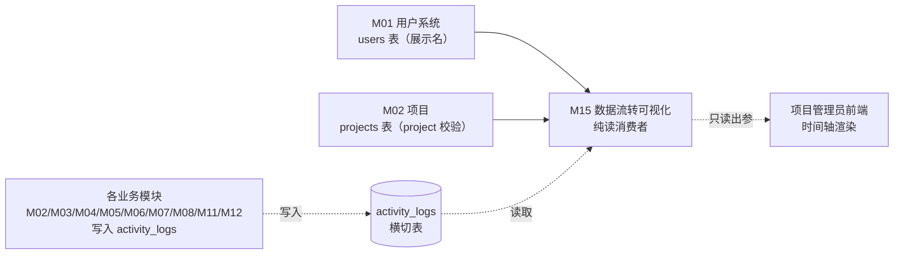

# M15 数据流转可视化 - 详细设计

> 纯读聚合模块——消费横切 `activity_logs` 表，自身无写表。
> 业务节标注 ⚠️ 的项为 AI 推断，CY 复审必改。

---

## 1. 业务说明 + 职责边界

### 业务背景（引自 PRD / US）

**核心用户故事**：
- **US-A2.2**（`/root/cy/prism/docs/product/feature-list-and-user-stories.md`）：作为项目管理员，我想看到所有成员的变更记录，这样知道谁在什么时间改了什么。
- **PRD Q3**（`design/00-architecture/01-PRD.md`）：内置"产品评价"能力——评价新需求时能看到"修改涉及哪些模块"；数据流转可视化是这一能力的追踪基础，也是多人协作审计的核心工具。
- **PRD Q4**：架构按多人协作场景设计——activity_log 是多人环境下"谁做了什么"的唯一可信来源，M15 是其唯一展示消费者。

**业务定位**：M15 是 `activity_logs` 横切表的展示层。各业务模块（M02/M03/M04/...）在 Service 层写入 activity_log；M15 负责读取、过滤、展示，呈现时间轴式的操作历史。

### In scope（M15 负责）

- **操作日志列表**：按 project_id 查询 activity_logs，分页返回（时间降序）
- **多维过滤**：支持按 user_id / action_type / target_type / 时间范围过滤
- **用户名 JOIN**：返回操作者的 name（JOIN users 表展示，而非仅 user_id）
- **目标摘要**：每条日志显示 action_type + target_type + summary 字段
- **时间轴渲染**（前端）：按日期分组的时间流 UI（前端 Component 层实现，后端只返回结构化数据）

### Out of scope（其他模块负责）

| 不做的事 | 归属模块 |
|---------|---------|
| activity_log 的写入（各业务事件的记录）| M02/M03/M04/M05/M06/M07/M08/... 各业务模块 |
| 节点名称 / 维度类型名称的完整 JOIN 展示 | ⚠️ AI 推断是否 in scope，见灰区说明 |
| AI 分析操作的流式事件 | M13（流式 SSE，不走 activity_log 实时推送）|
| 跨 project 的操作汇总 | 不在 US-A2.2 范围内 |

### 边界灰区（显式说明）

- **⚠️ 查询范围：单 project 还是跨 project**（AI 推断，CY 复审必改）：US-A2.2 描述"项目管理员"查看"所有成员的变更记录"，语境明确是单 project 内。推断：单 project 视图（路径 `/project/:id/activity`）。候选：A 单 project（默认），B 按 user 维度跨 project 日志（需新设计）。AI 默认 A。
- **⚠️ 目标详情（target name）展示**（AI 推断，CY 复审必改）：activity_log 只存 `target_id`（UUID），不存目标的名称。如果要显示"更新了节点『登录流程』"，需要 JOIN nodes / dimension_records 等表取名字。推断：M15 不做跨表 JOIN 取目标名，仅显示 summary 字段（各模块写入时已包含可读摘要）。候选：A 仅显示 summary（默认），B JOIN 取目标 name（需联查多表）。AI 默认 A（避免 M15 和所有上游模块的表耦合）。
- **⚠️ 与 ADR-003 Read Model 的关系**（待主对话决策）：M15 目前计划直查 `activity_logs` 横切表，与 M10 共同面对"是否起 ADR-003 统一 Read Model 层"的决策。详见 §3。
- **M15 自身是否写 activity_log**（CY 怀疑点，显式说明）：M15 是纯读模块，自身不写 activity_log 事件。"查看操作日志"是只读浏览行为，不产生新的审计事件。M15 的"写入动作"（如果存在）——如用户点击展开某条日志——属于 UI 交互，**不写 activity_log**。故 M15 事务维度 ❌，与 catalog 一致。
- **是否需要实时推送**（WebSocket/SSE）：US-A2.2 无实时需求，推断为普通分页 GET 列表；不引入 WebSocket 或 SSE。⚠️ AI 推断，CY 复审必改。

---

## 2. 依赖模块图



**前置依赖（必须先实现）**：M01 → M02（+ 有数据的业务模块，如 M04，才有日志可展示）

**依赖契约**（M15 假设上游提供）：
- M01：`users(user_id)` 可拿到用户 name（JOIN 展示用）
- M02：project 存在 + 当前用户是项目管理员
- `activity_logs` 表：已按 `(project_id, created_at)` 索引（M15 主查询路径）

**M15 对所有上游表仅执行只读操作，不写任何表。**

---

## 3. 数据模型（SQLAlchemy + Alembic 要点）

### 核心决策点 ⚠️（待主对话决策是否起 ADR-003）

M15 直接消费 `activity_logs` 横切表。与 M10 类似，面对"跨模块 Read 聚合方式"决策：

**两种候选方案**：

| 方案 | 描述 | 优点 | 缺点 | ADR-003 相关 |
|------|------|------|------|-------------|
| **A. M15 独立 DAO 直查 activity_logs** | M15 单独实现 `activity_stream_dao.py`，直接 SELECT activity_logs + JOIN users | 最简单；M15 是 activity_logs 的唯一展示消费者，不需要共享层 | 若其他模块也需展示日志，会出现重复逻辑 | 否 |
| **B. ADR-003 Read Model 统一层** | 建立跨模块 Read Model 服务，M10/M15 统一走 Read 层 | 全局一致；M10 和 M15 共用读取基础设施 | 新增架构层；M15 是 activity_logs 的专有消费者，复用价值有限 | 是 |

**M15 与 M10 的差异**：M10 的聚合来自 3 个不同模块的表（nodes/dimension_records/project_dimension_configs），ADR-003 对 M10 价值更高；M15 只消费 `activity_logs` 单一横切表，ADR-003 对 M15 价值较低。但为了架构一致性，若主对话决策起 ADR-003，M15 也应随之迁移。

⚠️ **AI 推断，CY 复审必改**：AI 暂时以方案 A（M15 独立 DAO 直查）为基线写后续节。若主对话决策选 B，§3/§6/§7/§9 需联动修改。

**候选 A→B 改回成本（R3-4）**：
- Alembic 迁移步数：无（仅改代码结构，不改 DB schema）
- 新增/删除表数：0
- 受影响模块数：M15（+ M10 同步协调）
- 数据迁移不可逆性：无（纯代码重构）

---

### M15 无自有实体表（只读上游）

**M15 无自有实体表——只读上游**

M15 消费 `activity_logs` 横切表，不创建任何新表：

| 上游表 | 归属模块 | M15 操作 | 用途 |
|--------|---------|---------|------|
| `activity_logs` | 横切（各模块写入）| 只读（SELECT + 过滤 + 分页）| 主数据源：操作历史 |
| `users` | M01 主 | 只读（JOIN 取 name）| 展示操作者名称 |
| `projects` | M02 主 | 只读（SELECT 校验 project 存在 + tenant）| tenant 校验 |

### activity_logs 表结构（基于 Prism schema.ts 对照 + prism-0420 规约）

M15 消费的横切表字段（SQLAlchemy 只读视角，M15 不定义此表 model——由各模块共享）：

```python
# api/models/activity_log.py  ← 横切共享 model，M15 只 import，不是 owner
from sqlalchemy.orm import Mapped, mapped_column
from sqlalchemy import ForeignKey, Index, Text, String
from sqlalchemy.dialects.postgresql import UUID, JSONB
from datetime import datetime
from uuid import UUID as PyUUID, uuid4
from typing import Any
from .base import Base, TimestampMixin


class ActivityLog(Base, TimestampMixin):
    """
    横切表——所有业务模块写入此表，M15 是唯一展示消费者。
    定义归属：独立共享 model（非 M15 所有，M15 只读）。
    TimestampMixin 只含 created_at（不含 updated_at——日志不可修改）。
    """
    __tablename__ = "activity_logs"
    __table_args__ = (
        Index("ix_activity_log_project_created", "project_id", "created_at"),  # M15 主查询路径
        Index("ix_activity_log_user_project", "user_id", "project_id"),        # 按用户过滤
        Index("ix_activity_log_target", "target_type", "target_id"),           # 按目标关联
    )

    id: Mapped[PyUUID] = mapped_column(UUID(as_uuid=True), primary_key=True, default=uuid4)
    project_id: Mapped[PyUUID] = mapped_column(
        UUID(as_uuid=True), ForeignKey("projects.id", ondelete="CASCADE"),
        nullable=False, index=True
    )
    user_id: Mapped[PyUUID] = mapped_column(
        UUID(as_uuid=True), ForeignKey("users.id"),
        nullable=False
    )
    action_type: Mapped[str] = mapped_column(
        String(50), nullable=False
        # 取值：'create' | 'update' | 'delete' | 'import' | 'analyze' | 'archive'
        # ⚠️ 未用 SAEnum——统一规则（batch2 audit 沉淀：String + CheckConstraint）
    )
    target_type: Mapped[str] = mapped_column(
        String(50), nullable=False
        # 取值：'node' | 'dimension_record' | 'version_record' | 'competitor' |
        #        'issue' | 'relation' | 'project' | 'project_member' | ...
    )
    target_id: Mapped[str] = mapped_column(Text, nullable=False)  # UUID str（兼容各模块 id 类型）
    summary: Mapped[str] = mapped_column(Text, nullable=False)    # 人可读摘要，各模块写入时提供
    metadata: Mapped[dict[str, Any] | None] = mapped_column(JSONB, nullable=True)
    # created_at 继承自 TimestampMixin（activity_log 不含 updated_at，日志不可修改）
```

### M15 只读 DAO（不定义新 model，仅查上游）

```python
# api/dao/activity_stream_dao.py
from sqlalchemy.orm import Session
from sqlalchemy import and_, desc
from uuid import UUID as PyUUID
from datetime import datetime
from typing import Optional

from api.models.activity_log import ActivityLog
from api.models.user import User   # M01 users 表（JOIN 取 name）


class ActivityStreamDAO:
    """
    M15 只读 DAO。
    方案 A：直查 activity_logs + JOIN users。
    ⚠️ 若主对话决策选方案 B（ADR-003），此 DAO 迁移到 Read Model 层。
    """

    def list_stream(
        self,
        db: Session,
        project_id: PyUUID,
        *,
        page: int = 1,
        page_size: int = 50,
        user_id: Optional[PyUUID] = None,
        action_type: Optional[str] = None,
        target_type: Optional[str] = None,
        from_dt: Optional[datetime] = None,
        to_dt: Optional[datetime] = None,
    ) -> tuple[list[tuple[ActivityLog, str]], int]:
        """
        返回 (records, total_count)。
        records: [(ActivityLog, user_name)] JOIN users。
        """
        q = (
            db.query(ActivityLog, User.name.label("user_name"))
            .join(User, User.id == ActivityLog.user_id)
            .filter(ActivityLog.project_id == project_id)   # tenant 过滤（必须）
        )
        if user_id:
            q = q.filter(ActivityLog.user_id == user_id)
        if action_type:
            q = q.filter(ActivityLog.action_type == action_type)
        if target_type:
            q = q.filter(ActivityLog.target_type == target_type)
        if from_dt:
            q = q.filter(ActivityLog.created_at >= from_dt)
        if to_dt:
            q = q.filter(ActivityLog.created_at <= to_dt)

        total = q.count()
        records = (
            q.order_by(desc(ActivityLog.created_at))
            .offset((page - 1) * page_size)
            .limit(page_size)
            .all()
        )
        return records, total
```

### Alembic 要点

- M15 **无 Alembic 迁移**——不新增表，依赖上游 `activity_logs` 已有表。
- `activity_logs` 表上的索引应由 ActivityLog model 声明（见上方 `__table_args__`），但实际迁移由"横切表 owner"维护（可考虑独立 migration 文件）。

---

## 4. 状态机（无状态显式说明）

M15 无自有实体表，无状态字段，无状态机。

显式声明（按原则 4）：**M15 无状态实体**。

- `activity_logs` 表本身无 status 字段——日志是不可变追加写（immutable append-only）
- M15 作为消费者，无状态维护义务

---

## 5. 多人架构 4 维必答

按原则 5 + 约束清单逐项答（即使是"不涉及"也显式写）。

| 维度 | 答案 | 实现细节 |
|------|------|---------|
| **Tenant 隔离** | ✅ project_id | DAO 层所有 SELECT 强制带 `WHERE activity_logs.project_id = ?`；不允许跨 project 查询；Service 层校验 project 归属用户 |
| **多表事务** | ❌ N/A | M15 纯读，无写操作，无事务需求。**事务 ❌ 的理由**：M15 不拥有任何写操作——写入 activity_log 的动作归属各业务模块（M02/M03/M04 等）的 Service 层事务，M15 仅消费已写入的数据。此为 catalog 中"❌（只读）"的正确解读。 |
| **异步处理** | ❌ N/A | M15 全同步 GET——操作日志展示是用户即时浏览，无后台任务、无 Queue、无流式 SSE |
| **并发控制** | ❌ N/A | M15 纯读，无并发写冲突场景。多用户同时读操作日志不产生冲突 |

### 约束清单逐项检查（呼应 06-design-principles 的 5 项清单）

| 清单项 | M15 是否触发 | 实现 |
|-------|-------------|------|
| 1. activity_log（所有变更操作必须写）| ❌ 不触发——M15 纯读，无变更操作。M15 **消费** activity_log，但**不写入** activity_log | 节 10 显式说明 |
| 2. 乐观锁 version | ❌ 不触发——纯读无并发写 | N/A |
| 3. Queue payload tenant | ❌ 不触发——无 Queue | N/A |
| 4. idempotency_key | ❌ 不触发——纯读 GET | 节 11 显式说明 |
| 5. DAO tenant 过滤 | ✅ 触发——activity_logs 必须按 project_id 过滤 | 节 9 列具体实现 |

---

## 6. 分层职责表（呼应 04-layer-architecture）

| 层 | M15 涉及文件 | 该层职责 |
|----|------------|---------|
| **Page** | `web/src/app/projects/[pid]/activity/page.tsx` | SSR 渲染数据流转页；调 Server Action 拿日志列表；渲染时间轴组件 |
| **Component** | `web/src/components/business/activity-timeline.tsx`<br>`web/src/components/business/activity-filter-bar.tsx` | 按日期分组的时间流渲染；过滤器 UI（用户/操作类型/时间范围）|
| **Server Action** | `web/src/actions/activity_stream.ts` | session 校验 / 拼接过滤参数 / 调 FastAPI GET 日志列表 |
| **Router** | `api/routers/activity_stream_router.py` | 路由定义 / `Depends(check_project_access(role="admin"))`（管理员专属）/ Pydantic schema 出参；纯 GET，无写操作 |
| **Service** | `api/services/activity_stream_service.py` | tenant 二次校验；调 DAO；将 (ActivityLog, user_name) flat list 整形为 `ActivityStreamResponse` |
| **DAO** | `api/dao/activity_stream_dao.py` | 只读 SQL：activity_logs JOIN users；强制 project_id tenant 过滤；分页 + 过滤条件构建 |
| **Model** | 无新 model 文件——引用横切 `api/models/activity_log.py` + M01 `api/models/user.py` | 上游模型复用 |
| **Schema** | `api/schemas/activity_stream_schema.py` | Pydantic 响应 schema（ActivityStreamResponse / ActivityLogItem / ActivityStreamFilter）|

**禁止**：
- ❌ M15 DAO 内写任何 INSERT / UPDATE / DELETE 到 activity_logs 或任何表
- ❌ M15 Service 调其他模块 Service（应通过 DAO 直读横切表）
- ❌ Router 直 `db.query(ActivityLog)` 跳过 Service

---

## 7. API 契约（Pydantic + OpenAPI 路径表）

### Endpoints

| 方法 | 路径 | 用途 | Pydantic 入参 | 出参 |
|------|------|------|--------------|------|
| GET | `/api/projects/{project_id}/activity-stream` | 项目操作日志列表（分页 + 过滤）| `ActivityStreamFilter`（query params）| `ActivityStreamResponse` |

### Pydantic schema 草案

```python
# api/schemas/activity_stream_schema.py
from pydantic import BaseModel, ConfigDict, Field
from uuid import UUID
from datetime import datetime
from typing import Optional, Any
from enum import Enum


class ActionType(str, Enum):
    create  = "create"
    update  = "update"
    delete  = "delete"
    import_ = "import"
    analyze = "analyze"
    archive = "archive"
    # ⚠️ AI 推断——完整 action_type 枚举需与各业务模块 activity_log 事件清单对齐


class TargetType(str, Enum):
    node              = "node"
    dimension_record  = "dimension_record"
    version_record    = "version_record"
    competitor        = "competitor"
    issue             = "issue"
    relation          = "relation"
    project           = "project"
    project_member    = "project_member"
    # ⚠️ AI 推断——完整 target_type 枚举需与各业务模块 activity_log 事件清单对齐


class ActivityStreamFilter(BaseModel):
    """GET 查询参数（query string）"""
    page: int = Field(default=1, ge=1)
    page_size: int = Field(default=50, ge=1, le=200)
    user_id: Optional[UUID] = None        # 按操作人过滤
    action_type: Optional[ActionType] = None
    target_type: Optional[TargetType] = None
    from_dt: Optional[datetime] = None    # 时间范围开始
    to_dt: Optional[datetime] = None      # 时间范围结束


class ActivityLogItem(BaseModel):
    """单条操作日志"""
    model_config = ConfigDict(from_attributes=True)

    id: UUID
    user_id: UUID
    user_name: str               # JOIN users.name
    action_type: ActionType
    target_type: TargetType
    target_id: str               # 目标资源 UUID（str 形式）
    summary: str                 # 可读摘要（由各模块写入时提供）
    metadata: dict[str, Any] | None
    created_at: datetime


class ActivityStreamResponse(BaseModel):
    """项目操作日志分页响应"""
    project_id: UUID
    items: list[ActivityLogItem]
    total: int
    page: int
    page_size: int
    has_more: bool               # total > page * page_size
```

---

## 8. 权限三层防御点（呼应 04-layer-architecture Q4）

| 层 | 检查 | 实现 |
|----|------|------|
| **Server Action** | session 是否有效 | `getServerSession()`；无则 401 |
| **Router** | 用户对 project 是否是 admin 角色 | `Depends(check_project_access(project_id, role="admin"))`；US-A2.2 明确是"项目管理员"功能——非 admin 403 |
| **Service** | project_id 是否真实存在 + 用户真实是 admin | `_check_project_admin(user_id, project_id)`；project 不存在或用户非 admin 抛对应错误 |

**异步路径**：M15 无异步，三层即足够（无 Queue 消费者侧权限）。

---

## 9. DAO tenant 过滤策略（呼应原则 5 清单 5）

### 主查询模式

| 查询表 | 过滤条件 | 说明 |
|--------|---------|------|
| `activity_logs` | `WHERE activity_logs.project_id = :project_id` | **必须**：防止跨 project 日志泄露 |
| `users`（JOIN）| 跟随 activity_logs.user_id JOIN，无独立 tenant 过滤 | users 是全局表，但通过 JOIN 限定只返回有操作记录的用户 name |

### 豁免清单

- `users` 表全局共享（M01 非 tenant 数据）——JOIN 读取仅用于显示 name，豁免 project_id 过滤。此豁免符合"全局数据"豁免条件（设计原则清单 5）。

### 防绕过纪律

- `ActivityStreamDAO.list_stream()` 强制第一个过滤条件为 `activity_logs.project_id = project_id`，此条件不得省略
- Router 的 project_id 来自 path 参数；Service 层二次校验用户真实有 admin 权限

---

## 10. activity_log 事件清单（呼应清单 1）

**M15 无 activity_log 事件**。

理由（详细说明，回应 CY 原怀疑点）：

- M15 是 activity_logs 的**唯一展示消费者**——负责展示其他模块写入的日志
- M15 自身**不产生任何变更操作**，无需写 activity_log
- 写入 activity_log 的动作归属于各业务模块：
  - M02 Service：写 `create_project` / `archive_project` / `invite_member` 等事件
  - M03 Service：写 `create_node` / `delete_node` / `move_node` 等事件
  - M04 Service：写 `create_dimension_record` / `update_dimension_record` 等事件
  - 其他模块同理
- "用户点击 M15 查看日志"属于只读浏览行为，不记录 activity_log（⚠️ AI 推断，CY 复审必改：若需要"谁查看了操作日志"的审计，追加 view_activity_stream 事件）
- 约束清单 1 规定"所有变更操作必须写 activity_log"——M15 无变更操作，豁免

---

## 11. idempotency_key 适用操作清单（呼应清单 4）

**M15 无 idempotency_key 操作**。

显式声明（按原则 5 清单 4 要求）：M15 全部为 GET 只读操作，天然幂等，无需 idempotency_key。

---

## 12. Queue payload schema（异步模块；同步 N/A）

**N/A**——M15 无异步处理，无 Queue 任务。

显式声明（按 §12 分支规则）：**M15 不投递 Queue 任务**。

---

## 13. ErrorCode 新增清单（呼应规约 7）

### 新增 ErrorCode（注册到 `api/errors/codes.py`）

```python
class ErrorCode(str, Enum):
    # ... 已有
    # 模块（M15）
    ACTIVITY_STREAM_PROJECT_NOT_FOUND = "ACTIVITY_STREAM_PROJECT_NOT_FOUND"  # project 不存在或无权限
    ACTIVITY_STREAM_FORBIDDEN         = "ACTIVITY_STREAM_FORBIDDEN"          # 非 admin 角色访问
    ACTIVITY_STREAM_INVALID_FILTER    = "ACTIVITY_STREAM_INVALID_FILTER"     # 过滤参数不合法（如 from_dt > to_dt）
```

### 新增 AppError 子类（`api/errors/exceptions.py`）

```python
class ActivityStreamProjectNotFoundError(NotFoundError):
    code = ErrorCode.ACTIVITY_STREAM_PROJECT_NOT_FOUND
    message = "Project not found or access denied"


class ActivityStreamForbiddenError(AppError):
    code = ErrorCode.ACTIVITY_STREAM_FORBIDDEN
    http_status = 403
    message = "Only project admin can view activity stream"


class ActivityStreamInvalidFilterError(ValidationError):
    code = ErrorCode.ACTIVITY_STREAM_INVALID_FILTER
    message = "Invalid filter parameters: from_dt must be before to_dt"
```

### 复用已有

- `PERMISSION_DENIED` / `UNAUTHENTICATED`——Router 层粗粒度权限复用
- `NOT_FOUND`——上游通用 404 复用；M15 特化为 ActivityStreamProjectNotFoundError

---

## 14. 测试场景

详见独立文件：[`tests.md`](./tests.md)

主文档只列大纲：
- **golden path**：查询操作日志列表（分页）/ 按 user 过滤 / 按 action_type 过滤 / 时间范围过滤
- **边界**：空日志（无操作）/ page 超出范围 / 时间范围 from > to / 过滤条件全不匹配
- **并发**：M15 纯读无并发场景（显式说明）
- **tenant**：跨项目越权读 / DAO project_id 过滤覆盖
- **权限**：未登录 / viewer 访问（403）/ editor 访问（403）/ admin 正常读
- **错误处理**：project 不存在 / filter 参数非法 / user_id 不存在（filter 无效过滤）

---

## 15. 完成度判定 checklist + ⚠️ 待 CY 裁决项

### checklist

- [x] 节 1：职责边界 in/out scope 完整；引 PRD Q3 / Q4 / US-A2.2；显式说明"M15 不写 activity_log"（回应 CY 怀疑点）
- [x] 节 2：依赖图覆盖上游（M01/M02/横切表 activity_logs）+ 写入模块示意
- [x] 节 3：无自有表显式声明；两候选方案（A/B）给完整对比；activity_logs model 草案；ActivityStreamDAO 草案；改回成本（R3-4）
- [x] 节 4：无状态实体显式声明（按原则 4 要求）
- [x] 节 5：4 维必答（含"不涉及"显式说明）；**事务 ❌ 原因详细解释**（回应 CY 怀疑：M15 不写 activity_log，故事务 ❌ 与 catalog 一致）；5 项清单逐项标注；⚠️ 不出现在 4 维表格（符合 R5-1）
- [x] 节 6：分层职责表完整（每层文件路径明确）
- [x] 节 7：1 个 API endpoint + Pydantic schema 草案（含枚举 ActionType/TargetType）
- [x] 节 8：权限三层防御 + 异步路径声明（M15 无异步）；明确 admin-only
- [x] 节 9：activity_logs tenant 过滤 + users 豁免说明
- [x] 节 10：无 activity_log 事件显式说明 + 详细理由（回应 CY 怀疑点）
- [x] 节 11：idempotency 无显式声明
- [x] 节 12：Queue 显式 N/A
- [x] 节 13：3 个 ErrorCode + 对应 AppError 子类（R13-1 满足）
- [x] 节 14：tests.md 场景大纲
- [x] 节 15：⚠️ 待 CY 裁决项汇总表
- [ ] **🔴 第一轮 reviewer audit（完整性）通过**
- [ ] **🔴 第二轮 reviewer audit（边界场景）通过**
- [ ] **🔴 第三轮 reviewer audit（演进 / 模板可复用性）通过**
- [ ] CY 全文复审通过 → status 转 accepted

### ⚠️ 待 CY 裁决项汇总表

| # | 节 | 裁决点 | AI 推断默认值 | 候选 | 影响范围 |
|---|-----|-------|------------|------|---------|
| D1 | §1 | 查询范围：单 project vs 跨 project（按 user 维度）| A 单 project | A 单 project / B 按 user 跨 project | 若选 B：需新增路径 `/api/users/{uid}/activity-stream`；Router 权限逻辑变化 |
| D2 | §1/§7 | 目标名展示：仅 summary vs JOIN 取 target name | A 仅 summary | A 仅 summary（避免多表耦合）/ B JOIN nodes/dimension_records 取 name | 若选 B：DAO 需根据 target_type 动态 JOIN 不同表（复杂度增加）|
| D3 | §3 | 跨模块 Read 聚合方式 | A M15 独立 DAO 直查 activity_logs | A 独立 DAO / B ADR-003 Read Model 统一层 | **与 M10 D4 联动**：主对话统一决策是否起 ADR-003 |
| D4 | §1 | 是否引入实时推送（WebSocket/SSE）| 不引入，普通分页 GET | 不引入（默认）/ 引入 WebSocket（需 M17 Queue 消费者配合）| 若引入：complexity 升为 high；需 catalog 更新异步维度标注 |
| D5 | §10 | 是否记录"用户查看操作日志"的 view 事件 | 不记录 | 不记录 / 记录 view_activity_stream 事件 | 若记录：M15 从"纯读"变为"有写入"，事务维度需补 ✅ |
| D6 | §7 | ActionType / TargetType 枚举完整性 | 草案列举常见值 | 需与各业务模块 activity_log 事件清单（M02/M03/M04/...）逐一对齐 | 影响 Pydantic schema + 前端过滤器选项；待各模块 accepted 后汇总 |

---

## 关联参考

- 上游设计：
  - `design/00-architecture/01-PRD.md`（Q3 / Q4）
  - `design/00-architecture/04-layer-architecture.md`（5 层 / 三层权限）
  - `design/00-architecture/05-module-catalog.md`（M15 4 维标注）
  - `design/00-architecture/06-design-principles.md`（原则 5 + 5 项清单）
- Prism 对照参考：
  - `/root/cy/prism/web/src/db/schema.ts`（activityLogs 表现状：projectId/userId/actionType/targetType/targetId/summary/metadata）
  - `/root/cy/prism/docs/product/feature-list-and-user-stories.md`（US-A2.2）
- 相关模块设计：
  - `design/02-modules/M04-feature-archive/00-design.md`（activity_log 写入模式，M15 消费的事件来源之一）
  - `design/02-modules/M02-project/00-design.md`（另一主要事件来源）
  - `design/02-modules/M12-comparison/00-design.md`（M15 同为只读聚合，设计参考）
