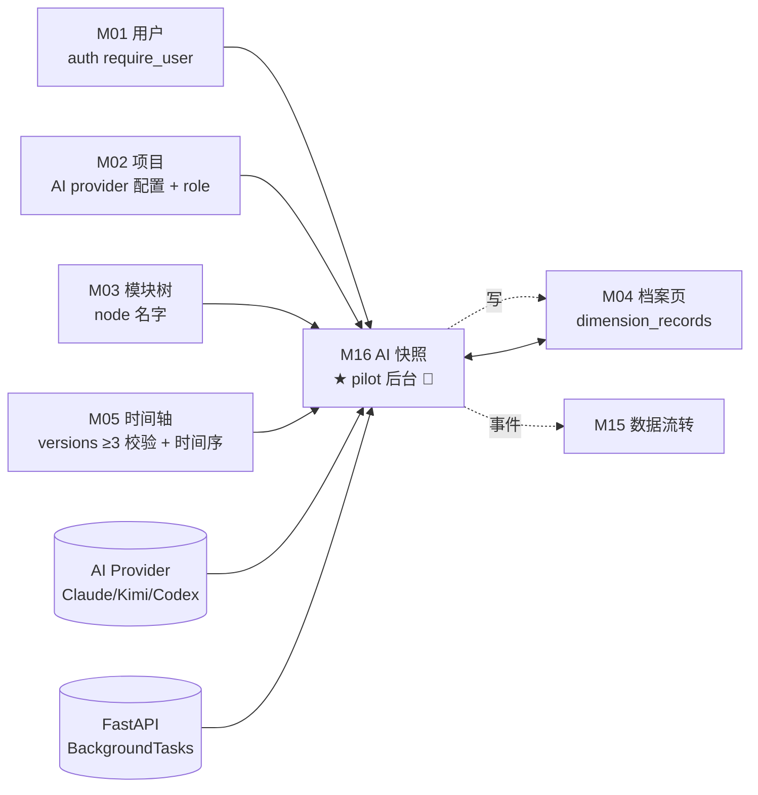
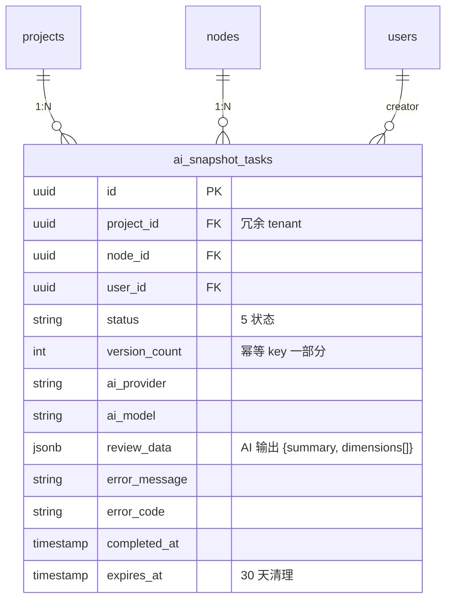
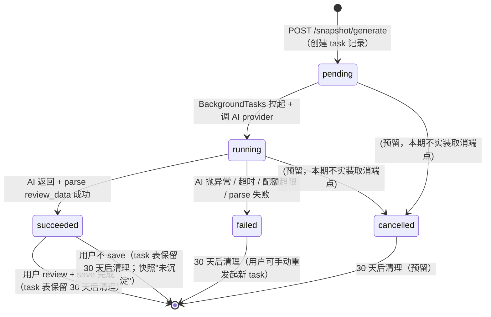

# M16 AI 快照 - 详细设计

> **Pilot 角色**：第 5 个 pilot 模块，覆盖 §12B 后台 fire-and-forget 子模板首次实战。完成 + audit 后，§12B 后台子模板定稿，与 §12A（流式 SSE，M13 已定稿）/ §12C（Queue 持久化，M17 已定稿）共同覆盖 3 种异步形态。
>
> **统一心智**：M16 = M13 的后台变体（纯读聚合 + M04 追加 + 不重试 + 轻量任务表，唯一差别 🌊→🪷）。
>
> **协作约定**：
> - ✅ 已根据 CY 2026-04-25 brainstorming 落定的 10 个决策（Q0–Q7 含子项），直接采用
> - ⚠️ 本模块无"待 CY 裁决"项（brainstorming 阶段全部锁定）
> - 🔗 关联 ADR-001 §4.1 / ADR-003 规则 1 / ADR-004 P1+P2 均给链接

---

## 1. 业务说明 + 职责边界

### 用户场景（核心画面）

Editor 用户在 M04 某功能档案页（例：功能模块树里的"订单取消"节点），该 node 已经积累 ≥3 条版本演进记录（来自 M05 timeline）：

1. 点 **"AI 生成快照"** 按钮
2. 前端立即拿到 task_id + status=pending（**不等结果**，按钮恢复成"生成中…"徽标），用户可以离开页面去做别的事
3. 后台 ~30s–3min 跑 AI provider 把版本历史 + 当前维度内容合成两部分输出：
   - **一句话概要**（自由文本，"当前订单取消功能支持节假日顺延，已对接 3 个支付通道，最近一次迭代加了风控阈值"）
   - **按维度结构化输出**（功能描述 / 技术实现 / 用户场景 等维度的最新状态）
4. 前端**轮询** `GET /snapshot-tasks/{task_id}`（每 3-5s 一次）；状态切到 `succeeded` 时：
   - 弹 toast："订单取消的快照已生成，点击 review"
   - 档案页该 node 的徽标从"生成中…"变成红点提示
5. 用户点 review → 看到 AI 输出 → 选择性勾选要保存的维度 → 调 save 端点
6. save：
   - 一句话概要 → 写一条 `dimension_records`（dimension_type_key=`snapshot_summary`，**追加新行不更新旧行**——M04 §6 既有 `create_dimension_record` 语义；前端按 created_at DESC 取最新即赢）
   - 选中维度 → 各自走 `M04.create_dimension_record(dimension_type_key=<原维度 key>)` 追加新行，前端按 created_at DESC 即赢

### 业务背景（引自 PRD / US）

- **核心 PRD**：`/root/prism/docs/product/PRD.md` L510 F16
- **PRD F16 AC1-AC3**：
  - AC1：功能项有 3+ 条版本演进记录时，可点击"生成当前快照"
  - AC2：AI 基于历史版本记录生成两部分：（1）一句话概要（自由文本）；（2）按维度结构化输出各维度的最新状态
  - AC3：用户 review 后，一句话概要保存为功能项摘要，结构化部分可按维度选择性覆盖/更新对应维度卡片内容
- **业务定位**：把"零散的版本演进记录"通过 AI 合成出"功能当前状态全貌"，闭环 M05 timeline → M16 snapshot → M04 dimension_records 的"积累→合成→沉淀"链路。

### In scope（M16 负责）

- **3 个 endpoint**：
  - `POST /api/projects/{pid}/nodes/{nid}/snapshot/generate` —— 创建后台任务（202 Accepted + task_id；fire-and-forget，**不等结果**）
  - `GET /api/snapshot-tasks/{task_id}` —— 查询任务状态 / 拿 review 数据（**独立路径，不嵌套 project/node**——Q7 子 ack A，便于前端通用轮询组件）
  - `POST /api/projects/{pid}/nodes/{nid}/snapshot/save` —— 用户 review 后追加 dimension_records
- **1 张自有表**：`ai_snapshot_tasks`（轻量任务表，Q4 ack C）—— 任务状态机 + AI 输出 review_data
- **后台执行**：用 FastAPI `BackgroundTasks`（**不走 arq Queue**——见 §6 BackgroundTasks vs arq 边界）
- **Context 拼装**：分析前拉 M02（AI provider 配置）/ M03（node 名字）/ M04（该 node 当前所有 dimension_records）/ M05（versions ≥3 条校验 + 时间序）做 prompt context
- **超时兜底**：服务器侧 10 分钟硬超时（参 ADR-001 `TASK_TIMEOUTS["ai_snapshot"] = 600s`）
- **不重试**（Q5 ack A）：失败后任务 status=`failed`，前端弹 toast 提示用户手动点"重新生成"
- **幂等**（Q6 ack Y）：5 分钟内同 `(user_id, project_id, node_id, version_count)` 复用上次任务（防用户连点）
- **保存语义**（Q2.1+Q2.2+Q2.3）：concept "新维度类型 `snapshot_summary` + 追加+最新赢"——save 阶段每个维度都**新建一条 dimension_record**（不 upsert 旧的），前端读取 `dimension_records` 时按 `(node_id, dimension_type_key)` 取 created_at 最新一条作为"当前值"

### Out of scope（其他模块负责）

| 不做的事 | 归属模块 |
|---------|---------|
| 版本演进记录的创建（M05 timeline 自己 own）| M05 |
| dimension_records 表的 CRUD 主权 | M04 |
| 维度卡片 UI 渲染 / 历史 dimension_record 切换 | M04 档案页 UI |
| 关系图节点高亮 | M08 |
| 操作历史展示 | M15 |
| 权限校验（project role / user 有效性）| M01 auth + M02 project role |
| AI Provider 调用本身 | M02（已 own ai_client 抽象）|
| 流式 SSE 输出 | M13（M16 不流式：用户不盯着看，按钮一点就走开）|
| Queue 持久化任务 + 失败重试 + 死信 | M17（M16 不进 Queue：任务可丢失，重发成本低）|

### 边界灰区（显式说明）

- **M16 vs M04**：M16 生成 / save 内容，**但 dimension_records 表是 M04 own**。M16 通过 `M04.DimensionService.create_dimension_record()` Service 接口写入（参 ADR-003 规则 1），**不直写 dimension_records 表**。同 M13 范式。
- **M16 vs M05**：M16 读 M05 versions 做 context（≥3 条校验 + 时间序），不写 M05；M05 不感知 M16。
- **M16 vs M13 / M17 / M18**：4 个 AI 模块，异步形态各异。
  - **M13** 🌊 流式 SSE（用户盯着看）—— §12A
  - **M16** 🪷 后台 fire-and-forget（用户不盯，前端轮询）—— §12B
  - **M17** 🗂️ Queue 持久化（任务有金钱代价，必须重试 + 死信）—— §12C
  - **M18** 🗂️ Queue 持久化（embedding 计算，可复用 M17 §12C 范式）
- **新维度类型 `snapshot_summary` 的归属**：该 dimension_type_key 由 **M04 Service 在首次调用时 upsert** 到 `dimension_types` 表（M04 §6 已实现的幂等逻辑），无新 Alembic 迁移。
- **任务表为什么独立**（Q4=C 而不是复用 M17 import_tasks）：M16 任务字段（version_count / review_data 结构 / 不需要 items 子表）跟 M17 import_tasks 不重合；强行复用会导致 M17 表多个空字段、状态机膨胀。轻量独立反而清晰。
- **未 save 的快照归属**：`succeeded` 但用户没点 save 的任务 = task 表保留 30 天后清理；不写 `dimension_records`。等于这次快照"未沉淀"。

---

## 2. 依赖模块图



**前置依赖（必须先实现）**：
- M01（auth + require_user）
- M02（AI provider 配置 + role check）
- M03（node 查询 Service）
- M04（dimension_records 主表 + DimensionService—— **复用 M13 pilot 已补丁的 `create_dimension_record` + `get_latest`**，**M16 不需要追加新方法**）
- M05（VersionService 按 node_id 查询 + 计数接口）

**外部依赖**：
- **AI Provider SDK**：anthropic / openai / kimi 的**非流式接口**（`generate(prompt) -> str`，参 ADR-001 §4.1）
- **FastAPI BackgroundTasks**：fire-and-forget 后台执行（参 §6 边界讨论）

**依赖契约**（M16 调用上游已登记的 Service 接口）：

- **M02**（已有接口，M13 已用）：
  - `ProjectService.get_by_id_for_user(db, project_id, user_id) -> Project`
  - `check_project_access(project_id, user_id, role="editor"|"viewer")`
- **M03**（已有接口，M13 已用）：
  - `NodeService.get_by_id(db, node_id, project_id) -> Node`——读 `.name`
- **M04**（已有接口，M13 pilot 已补丁，M16 直接复用）：
  - `DimensionService.list_by_node(db, node_id, project_id) -> list[DimensionRecord]`——读该 node 所有维度做 context（generate 阶段）
  - `DimensionService.create_dimension_record(db, *, project_id, node_id, dimension_type_key, content, user_id, extra_activity_metadata) -> DimensionRecord`——save 阶段单条写入
- **M05**（**M16 pilot 基线补丁追加 1 个方法**）：
  - `VersionService.list_by_node(db, node_id, project_id, limit=50) -> list[VersionRecord]`——拉版本演进记录，按 created_at ASC 排序（已存在的话直接复用）；M16 自己 split content 解析
  - `VersionService.count_by_node(db, node_id, project_id) -> int`（**新增**）——AC1 ≥3 条校验 + 幂等 key 计算
- **M15 activity_log 横切写**：复用 M13 范式——save 阶段事件由 **M04 Service** 在 `create_dimension_record` 内代写；M16 任务表的状态变迁事件**M16 自己写**（Service 调 `ActivityService.log()`，参 §10）

### Phase 2 Prism → prism-0420 迁移成本

Prism 实装（`/root/prism/api/routers/snapshot.py`）与 M16 设计的关键差异：

| 差异点 | Prism 现状 | M16 设计 | 迁移成本（Phase 2 实装时）|
|-------|-----------|---------|--------------------------|
| 异步形态 | **同步** generate 卡住请求等 AI（可达 2-3min） | 🪷 后台 fire-and-forget + 轮询 | 拆 generate 为创建任务 + 后台执行；新增 GET /snapshot-tasks/{id} + 前端轮询。预计：~4 文件 / ~150-200 行 |
| 任务表 | 无（generate 不持久化） | `ai_snapshot_tasks` 主表 | 新建 SQLAlchemy model + Alembic 迁移。预计：~80 行 |
| URL 形态 | 扁平 `POST /snapshot/generate`（project_id / node_id 在 body）| 嵌套 `POST /api/projects/{pid}/nodes/{nid}/snapshot/generate` + 独立 `GET /snapshot-tasks/{id}` | URL 改写。预计：~30 行 |
| save 写入 | Router 直 `db.add + db.commit`；**upsert 旧行 + version+1**（违反 M04 主权 + 偏离 Q2.2 决策） | Service 经 M04 `create_dimension_record` 追加新行 | 重构 save endpoint。预计：~80 行 |
| dimension_type 注册 | Router 内 inline `db.add(DimensionType)` | M04 Service 内 upsert 幂等逻辑（M13 pilot 已实现） | 删除 Router 直建逻辑。预计：~20 行 |
| 鉴权 | 无 `Depends(require_user)`（_get_project 内部 check） | 走 ADR-004 P1+P2 + `check_project_access` | 同 M13 迁移成本。预计：~10 行 |

总预估 Phase 2 迁移：约 350-400 行前后端代码改动，含轮询逻辑 + 任务表迁移 + 测试 fixture。比 M13 高（多了任务表 + 状态机）。

---

## 3. 数据模型（SQLAlchemy + 纯读聚合 + 通过 Service 写 M04）

### 决策：**部分自有 + 部分纯读聚合**（Q4 ack C）

| 数据 | 归属 | 访问方式 |
|------|------|---------|
| **任务状态 + AI 输出 review_data** | M16 自有：`ai_snapshot_tasks` 表 | M16 直接 SQLAlchemy + DAO |
| **快照沉淀（一句话概要 + 各维度内容）** | M04 own：`dimension_records` | 走 M04 Service `create_dimension_record`（追加，Q2.2/Q2.3）|
| **版本演进记录（context 来源）** | M05 own：`version_records` | 走 M05 Service `list_by_node` / `count_by_node`（纯读，ADR-003 规则 1）|
| **node 名字 / 项目 AI 配置 / 当前维度内容** | M03 / M02 / M04 | 走各自 Service（ADR-003 规则 1）|

### 上游依赖表清单

| 表名 | 归属模块 | 访问方式 | ADR-003 规则 | 豁免规则 |
|------|---------|---------|--------------|---------|
| `projects` | M02 | Service `get_by_id_for_user` | 规则 1 | — |
| `nodes` | M03 | Service `get_by_id` | 规则 1 | — |
| `dimension_records` | M04 | Service `list_by_node` / `create_dimension_record` | 规则 1 | — |
| `version_records` | M05 | Service `list_by_node` / `count_by_node`（新增）| 规则 1 | — |
| `activity_log` | M15（横切表）| **任务事件**：M16 Service 直写（横切豁免）；**dimension_record 事件**：由 M04 Service 代写 | 规则 3 | 横切表 |

**禁止**：
- ❌ M16 直 JOIN `dimension_records` / `version_records` / `nodes`
- ❌ M16 直 INSERT `dimension_records`（必须经 M04 Service）
- ❌ M16 直读 `version_records` 表内部字段（只调 M05 Service 返回的 DTO）

### SQLAlchemy 模型（M16 自有 1 张表）

```python
# api/models/ai_snapshot_task.py
import enum
from sqlalchemy.orm import Mapped, mapped_column, relationship
from sqlalchemy import ForeignKey, CheckConstraint, Index, UniqueConstraint, Text, Integer
from sqlalchemy.dialects.postgresql import UUID, JSONB
from datetime import datetime
from uuid import UUID as PyUUID, uuid4
from typing import Any
from .base import Base, TimestampMixin


class AISnapshotTaskStatus(str, enum.Enum):
    pending = "pending"        # 已创建，待 BackgroundTasks 拉起
    running = "running"        # AI provider 正在生成
    succeeded = "succeeded"    # AI 生成完成，等待用户 review + save（review_data 已填）
    failed = "failed"          # 生成失败（provider 异常 / 超时 / 配额超限）
    cancelled = "cancelled"    # 用户主动取消（本期不实装取消，预留状态——见 §4 状态机）


class AISnapshotTask(Base, TimestampMixin):
    __tablename__ = "ai_snapshot_tasks"
    __table_args__ = (
        # idempotency 策略说明（audit B1 修复后）：
        # 不用永久 UniqueConstraint—— 因为"5min 窗口 + failed 不复用"是时间 / 状态条件，DB 永久约束做不到（PG partial index 谓词必须 immutable，NOW() 不可用）。
        # 幂等防御 = ORM 层 find_idempotent + 同事务 PG advisory lock 防并发 get-or-create（§11 实现 + §9 DAO）。
        # 接受最坏情况：高并发竞态可能多跑 1 次任务（多花 1 次 AI token）；用户感知不到，金钱代价 < $0.05/次。
        CheckConstraint(
            "status IN ('pending','running','succeeded','failed','cancelled')",
            name="ck_ai_snapshot_status",
        ),
        Index("ix_ai_snapshot_node_status", "node_id", "status"),
        Index("ix_ai_snapshot_user_created", "user_id", "created_at"),
        Index("ix_ai_snapshot_expires", "expires_at"),
        Index("ix_ai_snapshot_status_created", "status", "created_at"),  # zombie cron 用（audit m2 修复）
        Index("ix_ai_snapshot_idem_lookup", "user_id", "project_id", "node_id", "version_count", "created_at"),  # find_idempotent 用
    )

    id: Mapped[PyUUID] = mapped_column(UUID(as_uuid=True), primary_key=True, default=uuid4)
    project_id: Mapped[PyUUID] = mapped_column(UUID(as_uuid=True), ForeignKey("projects.id", ondelete="CASCADE"), nullable=False)
    node_id: Mapped[PyUUID] = mapped_column(UUID(as_uuid=True), ForeignKey("nodes.id", ondelete="CASCADE"), nullable=False)
    user_id: Mapped[PyUUID] = mapped_column(UUID(as_uuid=True), ForeignKey("users.id"), nullable=False)
    status: Mapped[str] = mapped_column(Text, nullable=False, default="pending")
    version_count: Mapped[int] = mapped_column(Integer, nullable=False)        # 创建任务时该 node 的 version 总数（≥3 校验 + 幂等 key）
    ai_provider: Mapped[str] = mapped_column(Text, nullable=False)             # claude/codex/kimi/mock，从 M02 项目配置快照
    ai_model: Mapped[str] = mapped_column(Text, nullable=False)
    review_data: Mapped[dict[str, Any] | None] = mapped_column(JSONB, nullable=True)  # AI 输出 {summary: str, dimensions: [{key, name, content}]}
    error_message: Mapped[str | None] = mapped_column(Text, nullable=True)
    error_code: Mapped[str | None] = mapped_column(Text, nullable=True)        # ErrorCode 枚举值（§13）
    completed_at: Mapped[datetime | None] = mapped_column(nullable=True)
    expires_at: Mapped[datetime | None] = mapped_column(nullable=True)         # 30 天后自动清理
```

### ER 图



### Alembic 要点

- **不**建 UniqueConstraint（audit B1 修复——见上方 `__table_args__` 注释；幂等走 ORM + advisory lock）
- `expires_at` 字段：`succeeded` / `failed` 任务保留 30 天供查询 + 审计；后台清理任务每日 0 点扫 `expires_at < NOW()` 删除
- `review_data` JSONB 大字段（典型 5-30KB，少数情况 > 100KB）：PG TOAST 自动压缩
- 无新 ENUM 类型（status 用 Text + CheckConstraint，对齐 M17 风格）

### Pydantic 聚合结构（context 拼装内存结构）

```python
# api/schemas/ai_snapshot_schema.py

class AISnapshotContext(BaseModel):
    """AI 生成前 M16 Service 层聚合上游数据的内存结构"""
    node_name: str                                        # 来自 M03
    versions: list[VersionRecordSummary]                  # 来自 M05（≥3 条，按 created_at ASC）
    current_dimensions: list[DimensionRecordSummary]      # 该 node 当前所有维度（来自 M04）
    dimension_keys: list[str]                             # 当前 node 的维度 key 清单（让 AI 按维度结构化输出）
```

### R3-4 改回成本（候选 B：复用 M17 import_tasks 改回成本）

CY Q4 ack C 决定独立轻量表，下方为反悔成本留痕：

- Alembic 迁移步数：+2（删 ai_snapshot_tasks 表 + 在 import_tasks 加 source_type='ai_snapshot' 扩展枚举）
- 新增表数：-1（合并到 import_tasks）
- 受影响模块数：3（M16 / M17 表 schema 扩 / 状态机扩 7→14 状态）
- 数据不可逆性：可逆（已存任务可数据迁移）
- 估时：≥4 小时迁移 + 测试

---

## 4. 状态机

### 决策：5 状态机（pending → running → succeeded / failed，cancelled 预留）



### 允许的关键转换

| 当前 | → | 触发 | 副作用 |
|------|---|------|--------|
| `pending` | `running` | BackgroundTasks 拉起 | 写 activity_log `ai_snapshot.start` |
| `pending` | `failed` | zombie cron 兜底（pending > 2min 仍未起跑——`add_task` 异常 / OOM / 进程崩溃前未拉起；audit m1+m6 修复）| 写 activity_log `ai_snapshot.failed` + `error_code=SNAPSHOT_ZOMBIE` + `expires_at = NOW + 30d` |
| `running` | `succeeded` | AI provider 返回成功 + review_data 可 parse | 写 activity_log `ai_snapshot.complete` + `completed_at` 填值 + `expires_at = NOW + 30d` |
| `running` | `failed` | AI provider 抛异常 / asyncio.timeout 触发 / response 不可 parse / zombie cron（running > 11min）| 写 activity_log `ai_snapshot.failed` + `error_message` + `error_code` + `expires_at = NOW + 30d` |

### 禁止的转换（R4-2）

| 禁止 | 防护 |
|------|------|
| `succeeded → 任意 / failed → 任意 / cancelled → 任意` | Service 层抛 `SnapshotTaskFinalizedError`（终态不可变；用户重发起 = 新 task） |
| `pending → succeeded`（跳过 running）| Service 层校验 status 顺序，抛 `SnapshotInvalidStateTransitionError` |
| `running → pending` / `任意 → pending`（pending 仅创建时） | 同上 |

### 注：M16 不主动支持取消（cancelled 状态预留但不实装端点）

Q5 ack A "不重试 + 手动重发"语境下，"取消"也对齐"用户感觉慢就别盯着它，30 秒后再来轮一次 / 算了不要这次结果就关掉抽屉" —— 不需要主动取消端点。`cancelled` 状态留在状态机但**本期不暴露 endpoint**，未来如果需要（例：后台 task 队列堆积想批量清理 pending）再补 `POST /snapshot-tasks/{id}/cancel`。

---

## 5. 多人架构 4 维必答

| 维度 | 答案 | 实现细节 |
|------|------|---------|
| **Tenant 隔离** | ✅ project_id（URL 路径 + 任务表冗余 + Service 层校验 node 归属）| `POST /snapshot/generate` URL 含 `{project_id}/{node_id}`；DAO `WHERE project_id = ?`；任务表 `project_id` 冗余字段；`GET /snapshot-tasks/{task_id}` 虽然 URL 不含 project_id 但 Service 层强制 `task.project_id ∈ user.accessible_projects`（双重校验，见 §8）|
| **多表事务** | ✅ 触发（save 阶段：N 条 dimension_records + activity_log 由 M04 代写；任务表状态变迁是单表）| save 阶段 M16 Service 层 `with self.db.begin():` 包住 N 次 `M04.create_dimension_record(db, ...)` 调用——M04 在此事务内每次写一条 dimension_record + 一条 activity_log；**全部 N 个维度共享同一事务**，任一失败回滚（用户体验：一键 review 全保存 = 原子）。任务表状态变迁是单表 UPDATE，不需多表事务 |
| **异步处理** | 🪷 **后台 fire-and-forget**（pilot 核心覆盖维度）| FastAPI `BackgroundTasks` + `asyncio.timeout(600)`；**不走 arq Queue**（§6 边界讨论给理由）；详见 §12 |
| **并发控制** | ✅ 幂等防连点（Q6 ack Y），无乐观锁 | 同 user 同 node 同 version_count 5 分钟内只跑一个 task（DB UniqueConstraint 强制）；不同 user 对同 node 可并发跑（每个 user 自己的 task；最终都追加 dimension_records 不冲突）；save 端点无幂等（用户重复点 save = 重复追加，按 Q2.3 "M04 多条历史记录"语义合法）。**不使用乐观锁 version**（save 是 INSERT 非 UPDATE）|

### 约束清单逐项检查

| 清单项 | M16 是否触发 | 实现 |
|-------|-------------|------|
| 1. activity_log | ✅ 触发（任务 3 类事件 + save 阶段 N 条 dimension_record create）| §10 |
| 2. 乐观锁 version | ❌ 不触发（save 是 INSERT；任务状态变迁是单 user 单 task 串行）| §5 并发列说明 |
| 3. Queue payload tenant | ❌ 不触发（M16 不走 Queue；BackgroundTasks 共享 request 内存上下文，user_id/project_id 直接通过函数参数传，无序列化跨进程边界）| §12 §6 |
| 4. idempotency_key | ✅ 触发（Q6 ack）| §11 |
| 5. DAO tenant 过滤 | ✅ 触发（任务表查询）| §9 |

### 状态转换竞态分析（audit B3 修复——更正 BackgroundTasks 心智模型）

**FastAPI BackgroundTasks 行为澄清**：
- BackgroundTasks 在 response 发回客户端**之后**、同一 worker 进程的 asyncio 事件循环里串行执行
- 请求级 `Depends(get_db)` session 在 response 之前已 `db.close()`——background runner **必须自起新 session**（`with SessionLocal() as db: ...`，参 §6 Background Task 层代码示例）
- 同 worker 进程内 asyncio 单线程串行——无跨请求竞态

**真正竞态：zombie cron（独立进程）vs background runner（worker 进程）**：
- 场景：runner 在 `running` 时即将 commit `succeeded`，此时另一进程 cron 检测到 `created_at < NOW-11min` 也准备 commit `failed/SNAPSHOT_ZOMBIE`
- 防御 = **CAS 风格 UPDATE**（不用 SELECT FOR UPDATE 多步事务）：
  - runner 完成时：`UPDATE ai_snapshot_tasks SET status='succeeded', review_data=:rd, completed_at=NOW(), expires_at=NOW()+'30d' WHERE id=:tid AND status='running'` —— affected rows = 1 → 真完成；= 0 → 已被 cron 抢先转 failed，runner 丢弃结果（review_data 不写）
  - cron zombie 检测：`UPDATE ai_snapshot_tasks SET status='failed', error_code='SNAPSHOT_ZOMBIE', error_message='任务执行异常退出', completed_at=NOW(), expires_at=NOW()+'30d' WHERE status='running' AND created_at < NOW()-INTERVAL '11 minutes' RETURNING id` —— RETURNING 拿到的 id 是真转换的 zombie

**BackgroundTasks worker 跑到一半进程崩溃**（fire-and-forget 致命缺陷）：
- task 永远卡 `running` 直到 zombie cron 转 `failed/SNAPSHOT_ZOMBIE`
- **trade-off 显式声明**：Q5 ack A "不重试 + 手动重发" + Q4 ack C "轻量任务表" + 不引 arq 的代价；**承担丢任务风险换不引基础设施**

**zombie 兜底 cron 设计**（audit M4 修复——降延迟）：
- 跑频率：每 5 分钟一次（不是 1 小时——子模板要求频率 ≤ 阈值/2，见 §12 字段⑦）
- 阈值：`status='running' AND created_at < NOW-11min`（10min 硬超时 + 1min commit buffer）+ `status='pending' AND created_at < NOW-2min`（pending 兜底，audit m1+m6 修复——`add_task` 失败 / OOM 时孤儿 pending 也被抓）
- 用户感知失败延迟最坏 ≤16min（5min cron 间隔 + 11min 阈值），前端"温柔放手"30 次轮询后用户 5min 后回看就能拿到 failed 状态

---

## 6. 分层职责表

| 层 | M16 涉及文件 | 该层职责 |
|----|------------|---------|
| **Page** | `web/src/app/projects/[pid]/nodes/[nid]/page.tsx` | M04 档案页——挂"AI 生成快照"按钮 + 徽标 + review 抽屉 |
| **Component** | `web/src/components/business/snapshot-button.tsx`<br>`web/src/components/business/snapshot-poller.ts`<br>`web/src/components/business/snapshot-review-drawer.tsx` | 按钮（一点 → 拿 task_id → 立即变徽标）+ 轮询器（3-5s 一次拉 GET /snapshot-tasks/{id}）+ review 抽屉 UI |
| **Server Action** | `web/src/actions/snapshot.ts` | session 校验 + 转发到 FastAPI 3 个端点 |
| **Router** | `api/routers/ai_snapshot.py` | 3 个 endpoints + `Depends(require_user)` + project_id/node_id 路径参数 + role check |
| **Service** | `api/services/ai_snapshot_service.py` | 任务编排 / 状态转换 / 调 AI Provider / save 逻辑 |
| **DAO** | `api/dao/ai_snapshot_task_dao.py` | SQL + tenant 过滤 + 幂等查询 |
| **Background Task** | `api/services/ai_snapshot_runner.py` | runner：自起 session + CAS UPDATE 起跑 + 失败分支也走 CAS（详代码示例见下方）|
| **AI Client** | `api/clients/ai_client.py` | 多 provider 统一非流式接口（`generate(prompt) -> str`）——与 M13 / M17 共享 |
| **Prompt Template** | `api/services/ai_snapshot_prompts.py` | 单档 prompt 模板（含一句话概要 + 维度结构化输出 JSON 格式约束）|
| **Model** | `api/models/ai_snapshot_task.py` | SQLAlchemy 模型（§3）|
| **Schema** | `api/schemas/ai_snapshot_schema.py` | Pydantic Request / Response / context 聚合 |

**禁止**：
- ❌ Router 直查 ai_snapshot_tasks 表（全部走 Service / DAO）
- ❌ Service 直写 `dimension_records` 或直查其他模块表（走 Service 接口）
- ❌ BackgroundTasks 函数内直接写业务逻辑（必须调 Service）
- ❌ Component 直接 setInterval 不带 cleanup（轮询器必须 useEffect cleanup 防泄漏）
- ❌ Prompt 模板里硬编码 node 名称等业务数据（必须通过 context 注入）
- ❌ Service 层事务内调 DAO `cas_*` / `cas_zombie_transition`（这些方法内部 commit，会破坏外层事务；仅供 runner / cron 顶层调用）
- ❌ runner 失败分支用 `task.status = 'failed'; db.commit()` 直写（必须用 `cas_complete(status='failed', ...)`，否则与 zombie cron 双写）

### Background runner 代码示例（audit B3 + verify 补强——session + CAS + 失败分支统一）

```python
# api/services/ai_snapshot_runner.py
import asyncio, logging
from api.db import SessionLocal     # 全局 sessionmaker
from api.errors.codes import ErrorCode

async def run_snapshot_task(task_id: UUID) -> None:
    """FastAPI BackgroundTasks 拉起入口。请求级 Depends(get_db) session 已关闭，必须自起新 session。"""
    with SessionLocal() as db:
        # 1. CAS 拿任务起跑权（防 cron 已抢先转 failed）
        ok = AISnapshotTaskDAO().cas_start_running(db, task_id=task_id)
        if not ok:
            logging.info("snapshot task %s already finalized; runner exit", task_id)
            return
        task = AISnapshotTaskDAO().get_by_id(db, task_id)  # 拿到刚转 running 的 task

        # 2. 写 ai_snapshot.start activity_log（与 CAS 同事务由 cas_start_running 内部写，保证原子；
        #    日志/CAS 顺序：先 CAS UPDATE 成功才写 log，避免 log 写了但 CAS 输给 cron 的反向幻象）
        try:
            # 3. 跑 AI provider（asyncio.timeout 600s 硬超时）
            async with asyncio.timeout(600):
                review_data = await AISnapshotService(db).execute_generate(task)
            # 4. 成功 CAS（affected=0 表示已被 cron 抢先转 failed，丢弃）
            written = AISnapshotTaskDAO().cas_complete(
                db, task_id=task_id, review_data=review_data, status="succeeded",
            )
            if written:
                ActivityService(db).log("ai_snapshot.complete", target_id=task_id, metadata={...})
        except asyncio.TimeoutError:
            AISnapshotTaskDAO().cas_complete(
                db, task_id=task_id, review_data=None, status="failed",
                error_code=ErrorCode.SNAPSHOT_TIMEOUT.value, error_message="Analysis timeout",
            )
            # cas_complete affected=0 时不写 ai_snapshot.failed log，避免与 zombie cron 重复写
        except (ProviderError, ParseError) as e:
            written = AISnapshotTaskDAO().cas_complete(
                db, task_id=task_id, review_data=None, status="failed",
                error_code=e.code.value, error_message=str(e)[:500],
            )
            if written:
                ActivityService(db).log("ai_snapshot.failed", target_id=task_id, metadata={...})
```

**关键纪律**：
- runner 任何路径（成功 / timeout / provider 抛错）**都**走 `cas_complete`，不直 UPDATE
- activity_log 写入**条件式**（CAS affected=1 才写），保证与 zombie cron 不双写终态事件
- 自起 session 用 `with SessionLocal() as db`，与 FastAPI Depends(get_db) 的请求级 session 完全隔离

### Service 层事务边界纪律（verify 新引入风险防御）

- `Service.create_task` / `Service.save_snapshot` 用 `with self.db.begin():` 包业务事务，**依赖 Depends(get_db) 提供的 session 不开外层事务**（FastAPI 默认行为）
- 若未来 `get_db` 改为预开事务（如 SQLAlchemy 2.x autobegin），M16 Service 层 `with db.begin()` 会抛 InvalidRequestError —— 需要降级为 `with db.begin_nested()` 或显式 SAVEPOINT；该风险列入 Phase 2 实装时的 contract 校验
- DAO 层 `cas_*` 方法内部 `db.commit()` 是反事务设计，仅服务于 runner / cron 顶层调用——已在"禁止"清单标红 + 各 cas_* 方法 docstring 必须写"do not call inside Service 事务上下文"

### BackgroundTasks vs arq Queue 边界（M16 选 BackgroundTasks 的理由）

| 维度 | FastAPI BackgroundTasks（M16 选）| arq Queue（M17 选）|
|------|----------------------------------|--------------------|
| 持久化 | ❌ 进程内内存，崩溃丢任务 | ✅ Redis 持久化 |
| 重试 | ❌ 无原生重试 | ✅ 指数退避 + 死信 |
| 跨进程 | ❌ 任务必须跑在收请求的 worker 内 | ✅ 多 worker 并行消费 |
| 序列化开销 | ❌ 共享内存对象直接传 | ✅ JSON 序列化 |
| 引入成本 | 🟢 已是 FastAPI 内置，零成本 | 🟡 需 Redis + worker 进程 + 部署 |
| 失败代价 | 🟡 用户重新点（无金钱代价 / 30s-3min 时间）| 🔴 重做 = 重花 AI token + 数据丢失 |

**M16 决定 BackgroundTasks 的核心理由**：
1. **失败代价低** —— Q5 ack A 已接受"不重试 + 手动重发"，用户可承受重做（M17 因为 zip 上传 + 多步 AI 累计成本可达数美元，无法承受重做）
2. **引入成本零** —— Phase 2 实装时不需要部署 Redis worker
3. **无跨进程需求** —— 用户场景就是档案页一点等几分钟，请求和后台 task 同 process 即可

**未来反悔触发器 + 监测路径**（audit M3 修复——指标可操作）：

| 指标 | 计算 | 阈值 | 监测方式 |
|------|------|------|---------|
| zombie 率 | `count(error_code='SNAPSHOT_ZOMBIE')` / `count(status IN ('succeeded','failed'))` | ≥1% | 每周 cron 算一次写入 metrics 表（或 Prometheus counter `m16_zombie_total` / `m16_completed_total`）|
| 单次成本 | `avg(activity_log.metadata.estimated_cost_usd)` 取 `action_type='ai_snapshot.complete'` | ≥ $0.5 / 次 | 同上每周 cron 算一次 |

任一阈值超标 → 主对话评估迁移到 arq。**迁移成本**：把 `run_snapshot_task` 加 `@arq.task` 装饰 + payload 序列化为 dict + Service 层 `background_tasks.add_task` 改 `arq_pool.enqueue_job` ≈ 50 行 + 部署 Redis worker。

**指标 owner**：Phase 2 落地时由 M16 owner（CY）负责将上述 cron 接入 metrics 表 + 加告警；本期设计阶段仅声明字段（§10 metadata.estimated_cost_usd 已加）。

---

## 7. API 契约（Pydantic + OpenAPI）

### REST Endpoints

| 方法 | 路径 | 用途 | Pydantic 入参 | 出参 |
|------|------|------|--------------|------|
| POST | `/api/projects/{project_id}/nodes/{node_id}/snapshot/generate` | 创建后台快照任务（202 Accepted）| —（URL 参数即可）| `SnapshotTaskCreatedResponse` |
| GET | `/api/snapshot-tasks/{task_id}` | 查任务状态 + review_data（**独立路径**，Q7 子 ack A）| —（URL 参数）| `SnapshotTaskDetailResponse` |
| POST | `/api/projects/{project_id}/nodes/{node_id}/snapshot/save` | 用户 review 后追加 dimension_records | `SnapshotSaveRequest` | `SnapshotSaveResponse` |

**为什么 GET 独立路径**（Q7 子 ack A）：
- 前端轮询组件可通用化（不需要每次拼 project_id/node_id）
- 任务表已含 project_id，Service 层可二次校验 user 对该 project 的访问权（§8 详述）
- 与"任务态"语义对齐：任务是首要资源，不是 node 的属性
- 避免前端 navigate 离开 node 页后丢 project_id 上下文

### Pydantic schema 草案

```python
# api/schemas/ai_snapshot_schema.py
from typing import Any
from uuid import UUID
from pydantic import BaseModel, Field
from datetime import datetime
from .ai_snapshot_task import AISnapshotTaskStatus    # 见 §3

class SnapshotTaskCreatedResponse(BaseModel):
    """POST /generate 立即返回的 202 响应"""
    task_id: UUID
    status: AISnapshotTaskStatus              # 通常是 pending；幂等命中时可能是 running/succeeded
    is_idempotent_hit: bool                   # true = 复用已有任务（5min 内 + 同 version_count）
    poll_url: str                             # 例：/api/snapshot-tasks/{task_id}
    estimated_duration_seconds: int = 60      # 给前端 UX 提示用（实际 30s-3min）

class DimensionSnapshotItem(BaseModel):
    """一个维度的快照内容（review_data 数组元素）。content 是 dict 与 M04 dimension_records.content JSONB 列契约一致（audit B2 修复）"""
    dimension_type_key: str                   # 例：feature_description / tech_implementation / snapshot_summary
    dimension_name: str
    content: dict[str, Any]                   # AI 生成的该维度最新状态——dict 形态，至少含 {"text": "..."}；prompt 模板强制 AI 输出此结构（§6 Prompt Template）；snapshot_summary 维度 = {"summary": "..."}

class SnapshotReviewData(BaseModel):
    """AI 生成完成后 task.review_data 的强类型反序列化"""
    summary: str                              # 一句话概要
    dimensions: list[DimensionSnapshotItem]   # 按维度结构化输出
    metadata: dict[str, Any]                  # {ai_provider, ai_model, generation_time_ms, version_count_at_gen}

class SnapshotTaskDetailResponse(BaseModel):
    """GET /snapshot-tasks/{task_id} 返回"""
    task_id: UUID
    project_id: UUID
    node_id: UUID
    status: AISnapshotTaskStatus
    version_count: int
    review_data: SnapshotReviewData | None    # status=succeeded 时有值
    error_message: str | None
    error_code: str | None                    # ErrorCode 枚举值（§13）
    created_at: datetime
    completed_at: datetime | None

class SnapshotSaveRequest(BaseModel):
    """用户 review 后选择性 save——任务 ID + 用户勾选保存的维度（含 summary）"""
    task_id: UUID                             # 关联到 task review_data 做权威性校验（防前端篡改 content）
    save_summary: bool = True                 # 是否保存一句话概要为 snapshot_summary 维度
    selected_dimension_keys: list[str] = Field(default_factory=list)  # 用户勾选要保存的维度 key（**必须是 review_data.dimensions 中的子集**）

class SnapshotSaveResponse(BaseModel):
    saved_dimension_record_ids: list[UUID]    # 新建的 dimension_record id 列表（含 summary 那一条）
    saved_count: int
    summary_saved: bool
    message: str = "快照已保存"
```

**save 端点的篡改防御**（audit B2 + M5 修复）：
- 前端只传 `task_id + selected_dimension_keys`（不传 content）
- Service 层从 task.review_data 读取实际 content（dict 形态）—— 用户无法在 save 阶段修改 AI 输出
- **path / task 一致性校验**（audit M5 修复——防跨 node 攻击）：Service.save 入口断言 `task.project_id == path_project_id AND task.node_id == path_node_id`，否则 422 `SNAPSHOT_TASK_PATH_MISMATCH`。攻击场景：user_X 在 node_A 有 task_X，调 `POST /projects/{p}/nodes/{node_B}/snapshot/save` body 填 task_X.id —— 没有此校验则 task_X 内容会写到 node_B 上
- 如果未来需求允许"用户编辑后再 save"，加 `content_overrides: dict[str, dict]` 字段（**本期不做**，符合 PRD AC3 "选择性覆盖/更新"语义——选择是粒度选择，不是文本编辑）

---

## 8. 权限三层防御点

| 层 | 检查 | 实现 | 凭据路径（ADR-004）|
|----|------|------|-------------------|
| **Server Action** | session 是否有效 + 转发到 FastAPI 时注入 P2 凭据 | `getServerSession()` 拿 user_id；`fetch(FastAPI_URL, { headers: HMAC + X-User-Id + ... })`（ADR-004 §3.2 签名材料）| **P2 Internal HMAC** |
| **Router**（POST /generate / POST /save）| `require_user` (P1+P2) + 用户对 project ≥editor | `Depends(require_user)` + `Depends(check_project_access(role="editor"))` | P1 Bearer / P2 HMAC |
| **Router**（GET /snapshot-tasks/{task_id}）| `require_user` 后 Service 层做"task→project→user accessibility"反查（URL 不含 project_id 是设计选择）| `Depends(require_user)`；Service 内 `task = dao.get_by_id(task_id); project = projectService.get_by_id_for_user(task.project_id, user.id)`，project 不可访问 → 404 | P1 Bearer / P2 HMAC |
| **Service**（generate）| node 确实属于该 project + version_count ≥ 3 | `node_service.get_by_id(db, node_id, project_id)`；`version_count = version_service.count_by_node(db, node_id, project_id)`，<3 抛 `SnapshotInsufficientVersionsError` | — |
| **Service**（save）| 任务必须属于当前 user + status=succeeded | `task = dao.get_by_id(task_id, user_id=current_user.id)`；非 succeeded → `SnapshotNotReadyError`（409）| — |

### 独立 GET endpoint 的访问控制详解（Q7 子 ack A 关键风险点；audit B4 修复）

`GET /api/snapshot-tasks/{task_id}` URL 不含 project_id，是**已知反模式**（违背"路径要透出资源所有权"）。补偿措施（**两层强制校验，缺一不可**）：

```python
def get_task_for_user(self, task_id: UUID, current_user_id: UUID) -> AISnapshotTask:
    task = self.dao.get_by_id(self.db, task_id)
    if task is None:
        raise SnapshotTaskNotFoundError()
    # ★ 第一层（audit B4 修复）：必须先校验 creator——
    # 同 project 同事拿到 task_id（截屏/链接复制）也不能读他人 review_data。
    # 文字承诺与代码契约对齐，不留"未来扩展"灰区。
    if task.user_id != current_user_id:
        raise SnapshotTaskNotFoundError()  # 打码，不区分"不存在 / 不是 creator"
    # ★ 第二层：user 对该 project 仍有 viewer 权（防被踢出 project 后还能读自己旧 task）
    project = self.project_service.get_by_id_for_user(self.db, task.project_id, current_user_id)
    if project is None:
        raise SnapshotTaskNotFoundError()
    return task
```

**为什么默认仅 creator**：M16 review_data 含 AI 生成的当前快照草稿（含 user 私下迭代的内容），未发布前等同私人草稿；同 project 编辑互看是未来需求，不是默认。

**未来放宽路径**：若产品确定"同 project editor 互看任务列表"，第一层校验改为"`task.user_id == current_user_id OR ≥editor on task.project_id`"，且 §10 必须新增 `ai_snapshot.read` 审计事件（敏感读）。

**错误信息打码**：所有 404 统一 `SnapshotTaskNotFoundError`——不分别说"不存在 / 不是 creator / project 没了"。

### Brute force 风险

UUIDv4 task_id 空间 2^122，攻击者枚举不可行；不需要额外 rate limit。

---

## 9. DAO tenant 过滤策略

### 主查询模式（ai_snapshot_tasks 冗余 project_id）

```python
# api/dao/ai_snapshot_task_dao.py

class AISnapshotTaskDAO:
    def get_by_id(
        self, db: Session, task_id: UUID, user_id: UUID | None = None
    ) -> AISnapshotTask | None:
        """拿单个 task；user_id 可选——传时强制 task.user_id == user_id（save 端点用）；
        不传时由 Service 层做 project accessibility 反查（GET endpoint 用）"""
        q = db.query(AISnapshotTask).filter(AISnapshotTask.id == task_id)
        if user_id is not None:
            q = q.filter(AISnapshotTask.user_id == user_id)
        return q.first()

    def find_idempotent(
        self, db: Session, *, user_id: UUID, project_id: UUID, node_id: UUID, version_count: int
    ) -> AISnapshotTask | None:
        """5 分钟内同 (user, project, node, version_count) 复用；status 限制 pending/running/succeeded（failed/cancelled 不复用——用户能立刻重发）。
        ★ 与 §11 advisory_xact_lock 配合使用避免并发 get-or-create 多跑（audit B1+M6 修复——不再依赖 DB UniqueConstraint）"""
        from datetime import datetime, timedelta
        return (
            db.query(AISnapshotTask)
            .filter(
                AISnapshotTask.user_id == user_id,
                AISnapshotTask.project_id == project_id,
                AISnapshotTask.node_id == node_id,
                AISnapshotTask.version_count == version_count,
                AISnapshotTask.created_at > datetime.utcnow() - timedelta(minutes=5),
                AISnapshotTask.status.in_(["pending", "running", "succeeded"]),
            )
            .order_by(AISnapshotTask.created_at.desc())
            .first()
        )

    def cas_zombie_transition(
        self, db: Session, *, running_threshold_min: int = 11, pending_threshold_min: int = 2
    ) -> list[UUID]:
        """zombie cron 用：单条 CAS UPDATE 直接转 failed + 返回 id 清单（audit B3+M4+m6 修复——避免读-改-写两步竞态 + 覆盖 pending 兜底）
        ⚠️ 内部 commit，禁止在 Service 事务上下文调用（仅供 cron 顶层）；zombie 转换的 activity_log 写入由 cron 入口在拿到 RETURNING ids 后批量补写"""
        from sqlalchemy import text
        result = db.execute(
            text("""
                UPDATE ai_snapshot_tasks
                SET status='failed',
                    error_code='SNAPSHOT_ZOMBIE',
                    error_message='任务执行异常退出',
                    completed_at=NOW(),
                    expires_at=NOW() + INTERVAL '30 days'
                WHERE (status='running' AND created_at < NOW() - make_interval(mins := :rt))
                   OR (status='pending' AND created_at < NOW() - make_interval(mins := :pt))
                RETURNING id
            """),
            {"rt": running_threshold_min, "pt": pending_threshold_min},
        )
        db.commit()
        return [row[0] for row in result]

    def cas_start_running(self, db: Session, *, task_id: UUID) -> bool:
        """runner 起跑时 CAS UPDATE：仅当 status='pending' 才转 running；返回 True=拿到起跑权 / False=已被 cron 抢先转 failed
        ⚠️ 内部 commit，禁止在 Service 事务上下文调用（仅供 runner 顶层）"""
        from sqlalchemy import text
        result = db.execute(
            text("""
                UPDATE ai_snapshot_tasks SET status='running' WHERE id=:tid AND status='pending'
            """),
            {"tid": task_id},
        )
        if result.rowcount == 1:
            # 同事务写 ai_snapshot.start activity_log（避免 CAS 成功但 log 漏写）
            db.execute(text("INSERT INTO activity_log (action_type, target_type, target_id, ...) VALUES ('ai_snapshot.start', 'ai_snapshot_task', :tid, ...)"), {"tid": task_id})
        db.commit()
        return result.rowcount == 1

    def cas_complete(
        self, db: Session, *, task_id: UUID, review_data: dict | None, status: str = "succeeded",
        error_code: str | None = None, error_message: str | None = None,
    ) -> bool:
        """runner 完成时 CAS UPDATE：仅当 status='running' 才转换；返回 True=真完成 / False=已被 cron 抢先转 failed，runner 应丢弃 activity_log 写入避免双写
        ⚠️ 内部 commit，禁止在 Service 事务上下文调用（仅供 runner 顶层）"""
        from sqlalchemy import text
        result = db.execute(
            text("""
                UPDATE ai_snapshot_tasks
                SET status=:status, review_data=:rd, error_code=:ec, error_message=:em,
                    completed_at=NOW(), expires_at=NOW() + INTERVAL '30 days'
                WHERE id=:tid AND status='running'
            """),
            {"status": status, "rd": review_data, "ec": error_code, "em": error_message, "tid": task_id},
        )
        db.commit()
        return result.rowcount == 1
```

### 豁免清单

- **豁免**：`get_by_id(task_id)` 在 GET endpoint 不传 user_id（由 Service 层做 project accessibility 反查代替 DAO tenant 过滤）—— 见 §8 风险讨论
- **豁免**：M02/M03/M04/M05 的纯读聚合（ADR-003 规则 1）

---

## 10. activity_log 事件清单

### 决策：M16 Service 自写 3 类任务事件 + save 阶段由 M04 代写 N 条 dimension_record 事件

| action_type | target_type | target_id | summary | metadata | 写入方 |
|-------------|-------------|-----------|---------|---------|--------|
| `ai_snapshot.start` | `ai_snapshot_task` | task_id | 启动 AI 快照任务 | `{node_id, version_count, ai_provider, ai_model}` | M16 Service（任务转 running 时）|
| `ai_snapshot.complete` | `ai_snapshot_task` | task_id | AI 快照生成完成 | `{node_id, version_count, ai_provider, ai_model, generation_time_ms, dimensions_count, estimated_cost_usd}` | M16 Service（任务转 succeeded 时）|
| `ai_snapshot.failed` | `ai_snapshot_task` | task_id | AI 快照生成失败 | `{node_id, version_count, ai_provider, error_code, error_message_short}` | M16 Service（任务转 failed 时）|
| `create` | `dimension_record` | <新建 dim_record_id> | 创建维度：快照概要/{维度名} | `{node_id, type_id, content_size, dimension_type_key, source: "ai_snapshot", task_id}` | M04 Service（save 阶段每个维度 1 条）|

### 实现位置

- 任务事件：`ai_snapshot_service.py` 内 `with self.db.begin():` 块内 ActivityService.log()，与 task 状态 UPDATE 同事务
- dimension_record 事件：M04 `create_dimension_record(extra_activity_metadata={source: "ai_snapshot", task_id: <id>})` 自写

### estimated_cost_usd 字段（audit M3 修复——反悔触发器需要的指标）

`ai_snapshot.complete` metadata 必须含 `estimated_cost_usd: float`，由 AI Provider 调用层填——provider SDK 返回 `usage` token 数后按各 provider 单价表（claude $3/1Mi prompt + $15/1Mi completion / kimi 0.012¥/1k 等）算估算成本。Phase 2 实装时由 `api/clients/ai_client.py` 在 generate() 后封装计算。本字段**用于反悔触发器统计**（§6 BackgroundTasks vs arq 监测路径）。

### 为什么 M16 自写任务事件、不复用 M04 模式

- M04 模式（M13 范式）= "M13 没有自有表，所以借用 M04 事件"
- M16 **有自有表 ai_snapshot_tasks**，任务生命周期事件天然归属 M16，自写更直观
- 对齐 M17 范式（M17 import_tasks 事件由 M17 Service 自写）

### R10-1 批量合规性

save 阶段 N 条 dimension_record 创建在同一事务内串行写 N 条 activity_log（每个 dimension_record 一条）——R10-1 要求"批量操作必须每条单独写 activity_log"，已满足。

### R10-2 action_type / target_type 回写 M15

- **新增 action_type**：`ai_snapshot.start` / `ai_snapshot.complete` / `ai_snapshot.failed`（3 个）
- **新增 target_type**：`ai_snapshot_task`（1 个）
- **M15 CHECK 枚举扩展**：需要 Alembic 迁移在 M15 activity_log 的 CHECK constraint 加上述 3+1 个枚举值
- M15 UI 侧需要理解 `metadata.task_id` 字段以在时间线展示"AI 快照"图标 / 标签

---

## 11. idempotency_key 适用操作清单

### 决策：M16 三端点中 `POST /generate` **使用** idempotency（Q6 ack Y）

| 端点 | 是否需要 idempotency | 理由 |
|------|---------------------|------|
| `POST /snapshot/generate` | ✅ key = `(user_id, project_id, node_id, version_count)`，5 min 窗口 | 防用户连点按钮（焦虑/网络抖动）多次触发 AI 调用浪费 token；version_count 相同 = 数据没变，复用上次结果是合理的 |
| `GET /snapshot-tasks/{id}` | N/A | GET 本身幂等 |
| `POST /snapshot/save` | ❌ | 用户重复点 save = 多条 dimension_records 历史（合法，对齐 Q2.3 M04 多条历史语义）|

### R11-2 "project_id 是否参与 key 计算" 必答

显式回答：**✅ project_id 是 idempotency key 的一部分**——`(user_id, project_id, node_id, version_count)`。**理由**：跨 project 不可能命中（不同 project 同 node_id 在 nodes 表 UniqueConstraint(project_id, ...) 下不可能存在；但 key 包含 project_id 是 R11-3 强制要求 + 防御性编程，对齐 M17 audit B1 修复教训）。

### Idempotency 命中行为（含并发 get-or-create 防御，audit M6 修复）

```python
# api/services/ai_snapshot_service.py
from sqlalchemy import text

def create_task(self, user_id, project_id, node_id) -> tuple[AISnapshotTask, bool]:
    # 1. 校验前置（不持锁，快速失败）
    self.node_service.get_by_id(self.db, node_id, project_id)  # 404 → SnapshotNodeNotFoundError
    version_count = self.version_service.count_by_node(self.db, node_id, project_id)
    if version_count < 3:
        raise SnapshotInsufficientVersionsError(actual=version_count)

    # 2. ★ PG advisory lock（事务级，commit 后自动释放）防并发 get-or-create——
    # key = hash(user_id, project_id, node_id) 64-bit，同 user 同 node 串行进入 find→create
    with self.db.begin():
        lock_key = self._advisory_key(user_id, project_id, node_id)
        self.db.execute(text("SELECT pg_advisory_xact_lock(:k)"), {"k": lock_key})

        # 3. 检查幂等
        existing = self.dao.find_idempotent(
            self.db, user_id=user_id, project_id=project_id, node_id=node_id, version_count=version_count
        )
        if existing:
            return existing, True

        # 4. 新建任务
        project = self.project_service.get_by_id_for_user(self.db, project_id, user_id)
        task = self.dao.create(
            user_id=user_id, project_id=project_id, node_id=node_id,
            version_count=version_count,
            ai_provider=project.ai_provider or "mock",
            ai_model=project.ai_model or "default",
            status="pending",
        )
    # 5. 事务 commit 后再排 BackgroundTasks（避免 task 还没落库 runner 拉空）
    self.background_tasks.add_task(run_snapshot_task, task_id=task.id)
    return task, False

def _advisory_key(self, user_id, project_id, node_id) -> int:
    """64-bit key = bigint(hashlib.blake2b(uuids, digest_size=8))"""
    import hashlib
    h = hashlib.blake2b(f"{user_id}:{project_id}:{node_id}".encode(), digest_size=8)
    return int.from_bytes(h.digest(), "big", signed=True)
```

**为什么 advisory_xact_lock 而非 ON CONFLICT**：
- 没有 DB UniqueConstraint（B1 修复后取消）→ ON CONFLICT 没目标
- advisory lock 与表无关，不污染索引；事务级锁自动释放，无泄漏风险
- 性能：同 user 同 node 高并发约束，但 user-level 并发足够（同 user 5min 连点 3 次按串行处理）

**save 端点的 path 校验**（audit M5 修复）：

```python
def save_snapshot(self, *, task_id: UUID, path_project_id: UUID, path_node_id: UUID,
                  current_user_id: UUID, save_summary: bool, selected_dimension_keys: list[str]) -> SnapshotSaveResponse:
    # 1. 拿 task + 校验属于当前 user（DAO get_by_id 带 user_id 过滤）
    task = self.dao.get_by_id(self.db, task_id, user_id=current_user_id)
    if task is None:
        raise SnapshotTaskNotFoundError()
    # 2. ★ path / task 一致性校验（audit M5 修复——防跨 node 攻击）
    if task.project_id != path_project_id or task.node_id != path_node_id:
        raise SnapshotTaskPathMismatchError()
    # 3. 状态校验
    if task.status != "succeeded":
        raise SnapshotNotReadyError()
    # 4. selected keys 必须是 review_data.dimensions 子集
    review = SnapshotReviewData(**task.review_data)
    valid_keys = {d.dimension_type_key for d in review.dimensions}
    invalid = set(selected_dimension_keys) - valid_keys
    if invalid:
        raise SnapshotInvalidDimensionKeyError(invalid=sorted(invalid))
    # 5. 事务内 N+? 次 M04.create_dimension_record（M04 内自写 activity_log）
    saved_ids: list[UUID] = []
    with self.db.begin():
        if save_summary:
            rec = self.dimension_service.create_dimension_record(
                self.db,
                project_id=task.project_id, node_id=task.node_id,
                dimension_type_key="snapshot_summary",
                content={"summary": review.summary},
                user_id=current_user_id,
                extra_activity_metadata={"source": "ai_snapshot", "task_id": str(task.id)},
            )
            saved_ids.append(rec.id)
        for dim in review.dimensions:
            if dim.dimension_type_key in selected_dimension_keys:
                rec = self.dimension_service.create_dimension_record(
                    self.db,
                    project_id=task.project_id, node_id=task.node_id,
                    dimension_type_key=dim.dimension_type_key,
                    content=dim.content,  # dict, audit B2 修复
                    user_id=current_user_id,
                    extra_activity_metadata={"source": "ai_snapshot", "task_id": str(task.id)},
                )
                saved_ids.append(rec.id)
    return SnapshotSaveResponse(
        saved_dimension_record_ids=saved_ids,
        saved_count=len(saved_ids),
        summary_saved=save_summary,
    )
```

**幂等命中时的语义**：直接返回 existing task（`is_idempotent_hit=True`），前端用同一 task_id 继续轮询。如果 existing 是 `succeeded`，前端立即拿到 review_data，体验上"秒出结果"。

---

## 12. §12 异步形态 = 🪷 后台 fire-and-forget（§12B 子模板首次实战）

> **§12B 适用范围（决策 2 ack Y，2026-04-25）**：本 7 字段子模板**仅服务 🪷 后台 fire-and-forget 场景**。字段位次与 §12A 流式 / §12C Queue **均为 7 字段，但字段位次不语义对等**（audit M7 修复——避免照抄者按位次错位映射）。

### §12 三形态字段位次 mapping（audit M7 修复——明确字段不通用）

| 位次 | §12A 流式 SSE（M13）| §12B 后台 fire-and-forget（M16） | §12C Queue 持久化（M17）|
|------|---------------------|----------------------------------|------------------------|
| ① | 端点路径 | 任务表 schema（核心字段）| TaskPayload 基类 schema |
| ② | SSE event 类型枚举 | 任务状态机 | Queue 任务清单 + 重试策略 |
| ③ | event data payload schema | 任务创建 + 查询 endpoint 风格 | 消费者入口校验 |
| ④ | 鉴权路径（连接级）| 鉴权路径（请求级 + Service 反查）| 鉴权路径（P7 TaskPayload）|
| ⑤ | 超时策略 | 超时策略 | 超时策略（按任务类型）|
| ⑥ | 取消机制 | 失败 / 重试策略 | 失败 / 重试 / 死信策略 |
| ⑦ | 断线重连策略 | 任务清理 + zombie 兜底 | 死信清理（30 天保留）|

**强制纪律**：未来新场景**必须**对照 catalog emoji（🌊 / 🪷 / 🗂️）选定 §12 子模板，**不得**按位次混抄字段（例：把 §12B 字段⑥"不重试"误抄到 §12C 位次）。

### §12B 后台 fire-and-forget 子模板（M16 pilot 产出 7 字段）

M16 accepted 后，本节结构成为 §12B 子模板供未来后台 fire-and-forget 模块（若出现）照抄。M13 / M17 / M18 **不照抄** §12B，各自填自己的 §12A / §12C。

#### 字段 ①：任务表 schema（核心字段）

```python
class AISnapshotTask(Base, TimestampMixin):
    id: UUID PK
    project_id: UUID                        # tenant 冗余字段
    node_id: UUID                           # 业务关联（按 node 粒度）
    user_id: UUID                           # task creator
    status: Text                            # 5 状态枚举（§4）
    version_count: int                      # 业务"输入快照"——幂等 key 一部分
    ai_provider: Text
    ai_model: Text
    review_data: JSONB | None               # AI 输出（succeeded 时填）
    error_message: Text | None
    error_code: Text | None
    completed_at: timestamp | None
    expires_at: timestamp | None            # 30 天清理
    # ★ 不建 DB UniqueConstraint（audit B1 修复 + verify 残留修复）——
    # 幂等条件含时间窗口（5min）和 status 子集，PG partial index 谓词必须 immutable，做不到。
    # 幂等 = ORM 层 find_idempotent + 同事务 advisory_xact_lock（§9 / §11）。
```

**未来后台模块照抄要点**：
- 必有：`id / project_id / status / created_at / expires_at`
- 幂等：用 ORM 层 find + advisory_xact_lock 模式（**不**建 DB UniqueConstraint，因业务幂等含时间/status 条件 PG immutable 不支持）
- 可选：`node_id / 业务输入快照字段 / review_data / error_*` —— 按业务调整
- 不要：FK 到 user/project 必须 `ondelete=CASCADE` 否则任务表会有孤儿数据

#### 字段 ②：任务状态机

5 状态：`pending → running → (succeeded | failed | cancelled)`，详见 §4。

**未来后台模块照抄要点**：
- 终态不可变（`succeeded / failed / cancelled` → 任意均禁止）
- `cancelled` 可预留状态不实装端点（M16 本期就是这样）
- 必须有 zombie 兜底：cron 扫超时 running → 自动转 failed

#### 字段 ③：任务创建 + 查询 endpoint 风格

| 端点 | 路径 | 说明 |
|------|------|------|
| 创建 | `POST /api/projects/{pid}/{资源}/{rid}/{业务动作}` | 嵌套于业务资源下，URL 透出 tenant + 资源所有权 |
| 查询 | `GET /api/{任务类型}-tasks/{task_id}` | **独立路径**（Q7 子 ack A）—— 便于前端通用轮询组件；Service 层做 project accessibility 反查防越权 |
| 操作（save / cancel）| `POST /api/projects/{pid}/{资源}/{rid}/{业务动作}/{操作}` | 嵌套，与创建对称 |

**未来后台模块照抄要点**：
- 创建端点返回 202 Accepted + task_id + poll_url + estimated_duration_seconds
- 查询端点返回 task 全状态（含 review_data 或 error_*）
- 不要把"等任务结果"做成同步响应（违背 fire-and-forget 精神）

#### 字段 ④：鉴权路径

**ADR-004 P1 + P2**（Bearer JWT 浏览器直连 + Internal HMAC for Server Action）—— 见 §8。

**特殊点**：
- 独立 GET endpoint URL 不含 project_id —— Service 层强制 task → project_id → user accessibility 反查
- 错误信息打码：404 统一返回"任务不存在或无权限"

**未来后台模块照抄要点**：
- 创建端点必须 `check_project_access(role="editor")`（写操作）
- 查询端点必须 `check_project_access(role="viewer")` via Service 反查（读操作）
- save / 操作类端点必须额外校验 `task.user_id == current_user.id`（默认仅 creator 可操作）

#### 字段 ⑤：超时策略

- **服务器硬超时**：`asyncio.timeout(N)` 包住 BackgroundTasks runner 内的 AI provider 调用（M16 = `TASK_TIMEOUTS["ai_snapshot"] = 600s`，参 ADR-001 §4.2）
- **超时触发**：runner 抛 `asyncio.TimeoutError` → Service 转 task `status=failed` + `error_code=SNAPSHOT_TIMEOUT`，**不重试**（Q5 ack A）
- **客户端轮询超时**：前端轮询 N 次（例 30 次 × 5s = 2.5min）后还没 succeeded → 弹 toast "生成时间较长，请稍后回来查看"，停轮（用户离开后任务继续跑，回来拉一次 GET 即可拿到结果）；超过服务器硬超时仍 running → cron zombie 转 failed（§5）

**未来后台模块照抄要点**：
- 服务器硬超时必须比"用户耐心轮询窗口"宽 1-3 倍（避免用户因为前端不轮就以为任务挂了）
- 客户端轮询有"温柔放手"机制（不强制等结果）

#### 字段 ⑥：失败 / 重试策略

**不重试**（Q5 ack A）：
- AI provider 失败 / 超时 / 配额超限 → task 直接转 `failed`
- 前端轮询拿到 `failed` 后弹 toast：「{error_message}，点这里重新生成」
- 用户点重新生成 → 调 POST /generate 创建**新 task**（旧 failed task 烂在那 30 天清理）

**未来后台模块照抄要点**：
- 接受失败代价是后台 fire-and-forget 的核心 trade-off（如果不能接受，去用 §12C Queue）
- 失败必须留 `error_message + error_code` 给用户感知 + 自助恢复
- **不要**自动转 pending 重发——等于偷偷重试，违背"显式重发"语义

#### 字段 ⑦：任务清理策略 + zombie 兜底（audit B3+M4+m6 修复）

- **清理 cron**：每日 0 点扫 `expires_at < NOW()` 的任务 → 物理删除（不软删，task 表无审计价值）
- **zombie 兜底 cron**：**每 5 分钟**跑一次（频率 ≤ 阈值 / 2，否则用户感知失败延迟过长——audit M4），单条 CAS UPDATE（§9 `cas_zombie_transition`）：
  - `status='running' AND created_at < NOW - 11min` → 转 `failed/SNAPSHOT_ZOMBIE`（10min 硬超时 + 1min commit buffer）
  - `status='pending' AND created_at < NOW - 2min` → 转 `failed/SNAPSHOT_ZOMBIE`（pending 兜底，audit m1+m6——`add_task` 失败 / OOM 时孤儿 pending 也被抓）
  - 用户感知失败延迟最坏 ≤ 5min cron 间隔 + 11min 阈值 = 16min
- **expires_at 设值时机**：仅在终态转换时设 `NOW + 30d`（含 zombie cron 路径）；pending/running 任务不设 expires_at（防过早清理活跃任务）—— pending 兜底由 zombie cron 转 failed 后顺带设 expires_at，进入 30d 清理流程

**未来后台模块照抄要点**：
- 每个后台任务表必须有 expires_at + cron 清理（防表无限膨胀）
- 必须有 zombie 兜底（fire-and-forget 的代价就是任务可能永远 running 或 pending，必须用兜底转死）—— pending **也**要被 zombie 兜底，不能只看 running
- zombie 阈值 = 服务器硬超时 + commit buffer（M16 = 10min + 1min）
- zombie cron 跑频率 ≤ 阈值 / 2（M16 = 5min ≤ 11min/2），否则用户感知失败延迟过长
- 用单条 CAS UPDATE（不读-改-写两步），避免 cron 与正常 runner 双写

### 与 §12A 流式（M13）/ §12C Queue（M17）的对比

| 维度 | §12A 流式（M13）| §12B 后台（M16 pilot）| §12C Queue（M17）|
|------|---------------------|----------------------|------------------------|
| 用户是否盯着看 | ✅ 盯着 | ❌ 前端轮询 | ❌ 前端轮询 + WebSocket |
| 持久化 | ❌ 流无状态 | ✅ 任务表（5 状态）| ✅ 任务表 + items 表（11 状态）|
| 失败重试 | ❌ 用户手动重发起 | ❌ 用户手动重发起（Q5 ack A）| ✅ 3 次指数退避 + 死信 |
| 鉴权路径 | ADR-004 P1（连接级）| ADR-004 P1+P2（请求级 + Service 反查）| ADR-004 P7 TaskPayload + WS 重校 |
| 取消 | fetch AbortController | （本期不支持，预留）| WebSocket 命令 + WS 重校 |
| 浪费代价 | token 浪费（user 可接受）| 任务残留 + token 浪费（30 天清理）| 任务数据 + token 双浪费 |
| 跨进程 | ❌ 同 worker 内流 | ❌ 同 worker 内 BackgroundTasks | ✅ arq Redis Queue 多 worker |
| 引入成本 | 🟢 FastAPI StreamingResponse 内置 | 🟢 FastAPI BackgroundTasks 内置 | 🟡 Redis + arq worker 部署 |
| 适用场景 | 用户秒级感知（30s-3min）| 用户分钟级回看（30s-3min）| 用户分钟到小时级（任务可数十分钟）|

---

## 13. ErrorCode 新增清单

```python
# api/errors/codes.py
class ErrorCode(str, Enum):
    # ... 已有

    # 模块（M16）
    SNAPSHOT_NODE_NOT_FOUND = "SNAPSHOT_NODE_NOT_FOUND"               # node 不存在 / 跨项目越权
    SNAPSHOT_INSUFFICIENT_VERSIONS = "SNAPSHOT_INSUFFICIENT_VERSIONS" # 版本数 < 3，AC1 兜底
    SNAPSHOT_PROVIDER_NOT_CONFIGURED = "SNAPSHOT_PROVIDER_NOT_CONFIGURED"  # 项目未配置 AI provider
    SNAPSHOT_PROVIDER_ERROR = "SNAPSHOT_PROVIDER_ERROR"               # AI provider 调用失败
    SNAPSHOT_TIMEOUT = "SNAPSHOT_TIMEOUT"                             # 10 分钟硬超时
    SNAPSHOT_QUOTA_EXCEEDED = "SNAPSHOT_QUOTA_EXCEEDED"               # 用户 / 项目 AI 配额超限
    SNAPSHOT_SAVE_FAILED = "SNAPSHOT_SAVE_FAILED"                     # save 阶段写 dimension_record 失败
    SNAPSHOT_TASK_NOT_FOUND = "SNAPSHOT_TASK_NOT_FOUND"               # task_id 不存在 / 越权
    SNAPSHOT_NOT_READY = "SNAPSHOT_NOT_READY"                         # save 时任务还未 succeeded
    SNAPSHOT_TASK_FINALIZED = "SNAPSHOT_TASK_FINALIZED"               # 状态机非法转换（终态不可变）
    SNAPSHOT_INVALID_STATE_TRANSITION = "SNAPSHOT_INVALID_STATE_TRANSITION"
    SNAPSHOT_ZOMBIE = "SNAPSHOT_ZOMBIE"                               # cron 兜底标记的 zombie task
    SNAPSHOT_PARSE_FAILED = "SNAPSHOT_PARSE_FAILED"                   # AI 输出 JSON parse 失败
    SNAPSHOT_INVALID_DIMENSION_KEY = "SNAPSHOT_INVALID_DIMENSION_KEY" # save 时 selected_dimension_keys 不在 review_data 中
    SNAPSHOT_TASK_PATH_MISMATCH = "SNAPSHOT_TASK_PATH_MISMATCH"       # save 时 task.project_id/node_id 与 URL path 不一致（audit M5 修复）
```

```python
# api/errors/exceptions.py
class SnapshotNodeNotFoundError(NotFoundError):
    code = ErrorCode.SNAPSHOT_NODE_NOT_FOUND
    message = "Node not found or not in project"

class SnapshotInsufficientVersionsError(AppError):
    code = ErrorCode.SNAPSHOT_INSUFFICIENT_VERSIONS
    http_status = 422
    message = "At least 3 version records required to generate snapshot"

    def __init__(self, actual: int):
        super().__init__(detail={"actual": actual, "required": 3})

class SnapshotProviderNotConfiguredError(AppError):
    code = ErrorCode.SNAPSHOT_PROVIDER_NOT_CONFIGURED
    http_status = 422
    message = "AI provider is not configured for this project"

class SnapshotProviderError(AppError):
    code = ErrorCode.SNAPSHOT_PROVIDER_ERROR
    http_status = 503
    message = "AI provider call failed"

class SnapshotTimeoutError(AppError):
    code = ErrorCode.SNAPSHOT_TIMEOUT
    http_status = 504
    message = "Snapshot generation exceeded server timeout (10min)"

class SnapshotQuotaExceededError(AppError):
    code = ErrorCode.SNAPSHOT_QUOTA_EXCEEDED
    http_status = 429
    message = "AI quota exceeded"

class SnapshotSaveFailedError(AppError):
    code = ErrorCode.SNAPSHOT_SAVE_FAILED
    http_status = 500
    message = "Failed to save snapshot to dimension records"

class SnapshotTaskNotFoundError(NotFoundError):
    code = ErrorCode.SNAPSHOT_TASK_NOT_FOUND
    message = "Snapshot task not found or not accessible"

class SnapshotNotReadyError(AppError):
    code = ErrorCode.SNAPSHOT_NOT_READY
    http_status = 409
    message = "Snapshot task is not ready for save (status != succeeded)"

class SnapshotTaskFinalizedError(AppError):
    code = ErrorCode.SNAPSHOT_TASK_FINALIZED
    http_status = 409
    message = "Snapshot task is in final state and cannot be modified"

class SnapshotInvalidStateTransitionError(AppError):
    code = ErrorCode.SNAPSHOT_INVALID_STATE_TRANSITION
    http_status = 409
    message = "Invalid state transition"

class SnapshotParseFailedError(AppError):
    code = ErrorCode.SNAPSHOT_PARSE_FAILED
    http_status = 502
    message = "AI output cannot be parsed as expected JSON schema"

class SnapshotInvalidDimensionKeyError(AppError):
    code = ErrorCode.SNAPSHOT_INVALID_DIMENSION_KEY
    http_status = 422
    message = "selected_dimension_keys contains key not in task review_data"

class SnapshotTaskPathMismatchError(AppError):
    """audit M5 修复——防跨 node 攻击"""
    code = ErrorCode.SNAPSHOT_TASK_PATH_MISMATCH
    http_status = 422
    message = "task does not belong to the project/node in URL path"

class SnapshotZombieError(AppError):
    """audit M2 修复——cron 持有此类型即使不实际 raise；前端通过 error_code='SNAPSHOT_ZOMBIE' 区分用户文案"""
    code = ErrorCode.SNAPSHOT_ZOMBIE
    http_status = 504
    message = "Task abnormally exited (zombie); please retry"
```

**R13-1 合规**：14 个 ErrorCode 各有对应 AppError 子类（含 `SnapshotZombieError`——audit M2 修复后不再例外）。

**R13-2 跨模块错误 wrap**：
- M04 `create_dimension_record` 失败 → M16 wrap 为 `SnapshotSaveFailedError`
- M02 Project 上 `.ai_provider` 为空 → M16 wrap 为 `SnapshotProviderNotConfiguredError`
- AI SDK 调用异常 → M16 wrap 为 `SnapshotProviderError`
- M05 `count_by_node` 返回 < 3 → M16 wrap 为 `SnapshotInsufficientVersionsError`
- M03 `get_by_id` 返回 None → M16 wrap 为 `SnapshotNodeNotFoundError`

---

## 14. 测试场景

详见独立文件：[`tests.md`](./tests.md)

主文档大纲：
- **golden path**：node 有 5 条版本 → 生成 → 轮询拿到 succeeded → save 全 + summary → 档案页可见 N 条新 dimension_records
- **AC1 边界**：版本数 0 / 1 / 2 / 3 / 4（< 3 必须 422，= 3 必须放行）
- **幂等**：5 分钟内连点 3 次（同 user/project/node/version_count）→ 同一 task_id；version_count 变化（中间新增了一条 version）→ 新 task；不同 user 同 node → 各自独立 task
- **状态机**：pending → running → succeeded 全路径；pending → running → failed（provider 报错）；succeeded 后再调 generate（version_count 没变） → 幂等命中复用；succeeded → save → save 重复点（每次 N 条新 dimension_records）
- **后台特化（fire-and-forget 关键）**：BackgroundTasks 起跑后断开请求 → task 仍跑完；进程崩溃模拟（kill -9 后启）→ task 卡 running → cron 转 zombie/failed；轮询 GET 端点拿 review_data 的强类型 schema 校验
- **tenant**：跨 project 调 generate → 404；GET /snapshot-tasks/{id} 越权（用户 A 拿用户 B 的 task_id）→ 404；save 越权（task 不属于当前 user）→ 404
- **权限**：viewer 调 generate → 403；未登录 → 401；editor generate / save 通过；viewer 可 GET（轮询查任务状态等同读）
- **错误处理**：provider 瞬时失败 → failed + error_code；10 分钟超时 → failed + SNAPSHOT_TIMEOUT；provider quota 耗尽 → SNAPSHOT_QUOTA_EXCEEDED；AI 输出非 JSON → SNAPSHOT_PARSE_FAILED；M04 save 失败 → SNAPSHOT_SAVE_FAILED + 事务回滚
- **save 防篡改**：前端传 `selected_dimension_keys` 含 review_data 没有的 key → 422；前端不传 task_id 或传错 → 404
- **AC2 / AC3 内容验证**：AI 输出 review_data.summary 有内容 + dimensions 长度 = 当前 node 维度数；save 部分维度勾选 vs 全勾选 vs 仅 summary 勾选三种组合
- **expires_at + 清理**：手工把 task expires_at 改到过去 → cron 清理后 task 物理删除；zombie 模拟（手工把 status 改 running + created_at 改 30 分钟前）→ cron 转 failed + SNAPSHOT_ZOMBIE

---

## 15. 完成度判定 checklist

- [x] 节 0：frontmatter 12 字段（status=draft 待 accepted）
- [x] 节 1：业务说明 + 用户场景画面 + PRD F16 AC1-AC3 + in/out scope + 边界灰区
- [x] 节 2：依赖模块图（含 BackgroundTasks 外部）+ 5 模块 Service 契约 + Phase 2 迁移成本
- [x] 节 3：**部分自有 + 部分纯读聚合（Q4 ack C）+ 上游依赖表 + ai_snapshot_tasks SQLAlchemy class + ER 图 + R3-4 改回成本**
- [x] 节 4：5 状态机 mermaid + 允许 / 禁止转换表 + cancelled 预留说明
- [x] 节 5：4 维必答（异步 ✅ 后台 🪷 核心覆盖）+ 5 项清单 + 状态转换竞态分析（zombie 兜底）
- [x] 节 6：分层职责表（含 Background Task / AI Client / Prompt Template）+ **BackgroundTasks vs arq 边界讨论**
- [x] 节 7：3 endpoints + Pydantic Request/Response + 独立 GET 路径理由 + save 篡改防御
- [x] 节 8：三层防御 + **独立 GET endpoint 访问控制详解** + brute force 风险 + ADR-004 P1+P2 引用
- [x] 节 9：DAO tenant 过滤（任务表 + 幂等查询 + zombie 查询）+ 豁免清单
- [x] 节 10：activity_log 4 类事件（3 任务 + 1 dimension_record 由 M04 代写）+ R10-1 / R10-2 + M15 CHECK 枚举扩展
- [x] 节 11：**R11-2 project_id 必答**（generate 端点 idempotency + 幂等命中行为）
- [x] 节 12：**§12B 后台 fire-and-forget 子模板 7 字段**（pilot 产出核心）+ 与 §12A/§12C 对比表
- [x] 节 13：13 个 ErrorCode + AppError 子类 + R13-1 / R13-2 合规（跨模块 wrap 5 类）
- [x] 节 14：测试场景大纲（详情转 tests.md）
- [x] 节 15：本 checklist 全勾过
- [x] **第一轮 reviewer audit（完整性）**（2026-04-25，opus-reviewer-agent；4 Blocker / 9 Major / 6 Minor；见 [`audit-report.md`](./audit-report.md)）
- [x] **第二轮 reviewer audit（边界场景 + 后台 fire-and-forget 特化）**（同上报告）
- [x] **第三轮 reviewer audit（§12B 子模板可复用性 / 未来照抄性）**（同上报告）
- [x] 主对话精修 4 Blocker + 9 Major + 5 Minor（2026-04-25）
- [x] **verify agent 独立复审 fix 质量**（2026-04-25，opus-verify-agent；2 必修残留补完——§12B UniqueConstraint 残留删 + tests R11-2 重写；4 建议落地——runner 代码示例 / cas_start_running / DAO docstring 反事务纪律 / Service 事务边界文档；见 [`audit-verify.md`](./audit-verify.md)）
- [x] CY 全文复审通过 → status 转 accepted（2026-04-25）

### accept **前置条件**（全部完成）

- [x] **M05 baseline-patch**（audit M9 修复——展开签名细节；2026-04-25 落到 M05 §6 对外契约段）：M05 §6 对外契约追加：
  ```
  VersionService.count_by_node(db: Session, node_id: UUID, project_id: UUID) -> int
  - 双 tenant 过滤（WHERE project_id = ? AND node_id = ?）
  - 接受外部 db session（R-X3）；不开事务；不写 activity_log
  - 复用现有 ix_version_records_node_created 索引（M05 §3）；count(*) 性能验收 < 5ms p95（typical node ≤100 versions）
  ```
- [ ] **M15 Alembic 迁移**（audit m5 修复——补文件命名；Phase 2 实装时落地）：activity_log CHECK 枚举扩 `ai_snapshot.start` / `ai_snapshot.complete` / `ai_snapshot.failed` 3 个 action_type + `ai_snapshot_task` 1 个 target_type；Alembic 文件 `<rev>_M16_extend_activity_log_action_target.py`，含 upgrade（ALTER TABLE activity_log DROP CONSTRAINT ck_... + ADD CONSTRAINT ... 含新枚举）+ downgrade（回旧枚举）；revision 与 M16 实装 PR 同期合并
- [x] **M04 契约锁定**（audit M1 修复；M13 pilot 已落，M16 引用）：本期 M16 依赖 M04 `create_dimension_record(db: Session, *, project_id: UUID, node_id: UUID, dimension_type_key: str, content: dict, user_id: UUID, extra_activity_metadata: dict | None = None) -> DimensionRecord` + `get_latest(db: Session, *, project_id, node_id, dimension_type_key) -> DimensionRecord | None` 签名（M13 pilot 2026-04-25 accepted 后状态）；M16 setup tests 含 contract test 校验签名稳定，签名调整必须 M16 同期联动更新
- [x] **ADR-002 §横切影响新增脚注**（audit M8 修复；2026-04-25 已替换 ADR-002 L117 M16 行）："M16（AI 快照）：BackgroundTasks fire-and-forget，**不**走 Queue。决策依据 + 反悔触发器（zombie 率 ≥1% / 单次成本 ≥$0.5）见 M16 §6 BackgroundTasks vs arq 边界。"
- [x] **README §12 异步形态分支表**（2026-04-25 已更新 §12B 行为定稿 + 7 字段摘要 + 位次警告）
- [x] **02-modules/README.md 总进度**（2026-04-25 已加 Pilot 5 行 + 累计完成清单 + 剩余 2 个）
- **M02 / M03 / M04 无需 baseline-patch（仅签名锁定见上 M04 契约锁定）**：
  - M02：用既有 `get_by_id_for_user`
  - M03：用既有 `get_by_id`

### accepted **同期补丁**（Phase 2 实装时落地，非设计阶段任务）

- [ ] M04 Service 在首次 `create_dimension_record(dimension_type_key="snapshot_summary")` 时 upsert `dimension_types` 表登记 `key="snapshot_summary"`（M13 pilot 已实现的幂等逻辑直接复用）—— Phase 2 代码落地时做
- [ ] M15 UI 侧理解 `metadata.task_id` + `dimension_type_key="snapshot_summary"` 字段，在时间线展示"AI 快照"图标 / 标签 —— Phase 2 代码落地时做
- [ ] 部署 cron job：每日 0 点清理 expires_at；每小时 zombie 兜底（运维 / Phase 2 落地）

---

## CY 决策记录（2026-04-25 brainstorming）

| Q | 决策点 | 决定 |
|---|-------|------|
| Q0 | M16 异步形态 | **b** 🪷 后台 fire-and-forget |
| Q1 | 快照粒度 | **A** 按 node（每 node 一次生成一个快照）|
| Q2.1 | dimension_records 类型 | **B** 新维度类型 `snapshot_summary`（不复用现有维度类型）|
| Q2.2 | 同 dimension_type 多次 save 的合并语义 | **D** 追加+最新赢（不 upsert，按 created_at DESC 取最新）|
| Q2.3 | 历史 dimension_records 处置 | 追加（允许多条历史记录，对齐 M04 既有语义）|
| Q3 | 前端反馈机制 | **A** 前端轮询 + 徽标 + toast（不引 WebSocket）|
| Q4 | 任务表设计 | **C** 轻量独立 `ai_snapshot_tasks` 表（不复用 import_tasks）|
| Q5 | 失败重试 | **A** 不重试 + 手动重发（不引重试基础设施）|
| Q6 | 幂等 | **Y** key = (user_id, project_id, node_id, version_count)，5min 窗口 |
| Q7 | §12B 子模板字段 | **Y** 7 字段（任务表/状态机/endpoint风格/鉴权/超时/失败/清理+zombie）|
| Q7 子 | GET 任务详情 endpoint 风格 | **A** 独立 `/snapshot-tasks/{id}`（不嵌套 project/node）|

---

## 关联参考

- 上游设计：
  - [`design/00-architecture/04-layer-architecture.md`](../../00-architecture/04-layer-architecture.md)
  - [`design/00-architecture/05-module-catalog.md`](../../00-architecture/05-module-catalog.md)（M16 4 维 🪷 后台 + 🟡 中复杂度）
  - [`design/00-architecture/06-design-principles.md`](../../00-architecture/06-design-principles.md)
- ADR：
  - [`ADR-001`](../../adr/ADR-001-shadow-prism.md)（§4.1 AI Provider generate() 接口 + §4.2 重试策略 + §5.3 `TASK_TIMEOUTS["ai_snapshot"]=600s`）
  - [`ADR-002`](../../adr/ADR-002-queue-consumer-tenant-permission.md)（§横切影响：M16 不覆盖——M16 不走 Queue，本 ADR 不适用；本期不扩 ADR-002）
  - [`ADR-003`](../../adr/ADR-003-cross-module-read-strategy.md)（规则 1 上游 Service 接口）
  - [`ADR-004`](../../adr/ADR-004-auth-cross-cutting.md)（P1 Bearer JWT + P2 Internal HMAC + 独立 GET endpoint 反查模式）
- 同 pilot：
  - [`M13-requirement-analysis/00-design.md`](../M13-requirement-analysis/00-design.md)（流式 SSE pilot 范本，§12A）
  - [`M17-ai-import/00-design.md`](../M17-ai-import/00-design.md)（Queue pilot 范本，§12C；任务表 + 状态机风格参考）
  - [`M04-feature-archive/00-design.md`](../M04-feature-archive/00-design.md)（M16 复用 `create_dimension_record` + `get_latest`）
- Prism 对照：
  - `/root/prism/api/routers/snapshot.py`（F16 同步实装现状）
  - `/root/prism/api/services/ai_provider.py`（`generate() -> str` 非流式接口）
  - `/root/prism/docs/product/PRD.md` L510 F16 AC1-AC3
- 业务故事：
  - PRD F16 AC1-AC3
- 方法论：
  - `/root/cy/ai-quality-engineering/02-技术/AI工具与工作流/Powerskill流水线-四段式实战与提示词模板.md`
