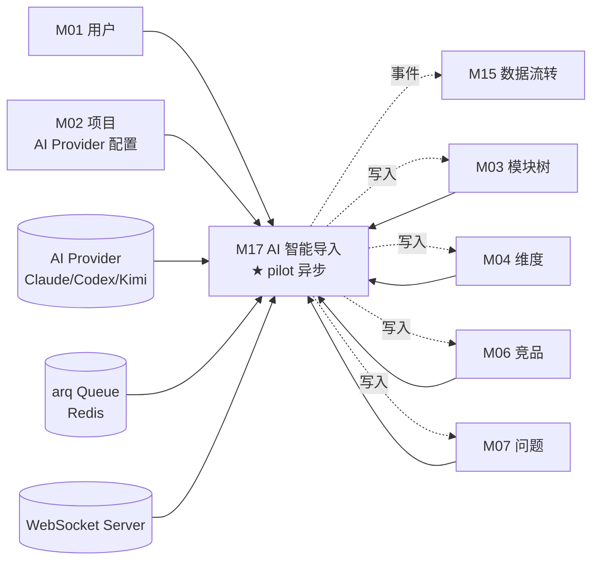
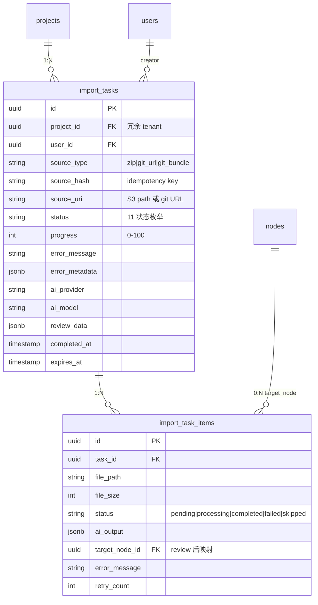
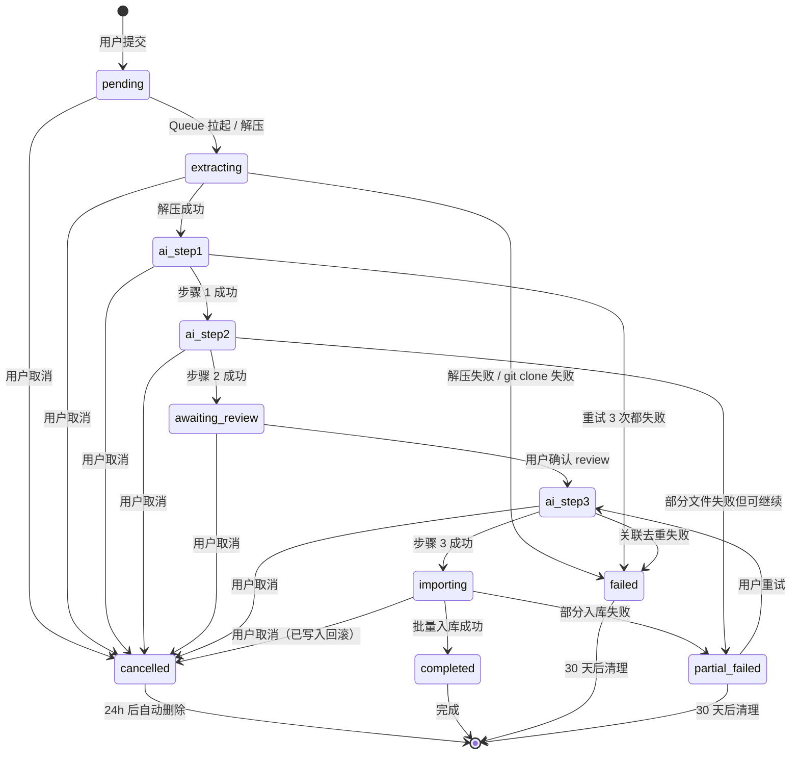

# M17 AI 智能导入 - 详细设计

> **Pilot 角色**：第 2 个 pilot 模块，覆盖 4 维中 M04 缺失的"异步"维度（Queue + 批量事务 + AI 调用 + 失败重试 + WebSocket 进度）。完成 + audit 后，模板异步字段定稿。

**协作约定**：
- ✅ 已根据 CY 2026-04-21 ack 5 个 Q 落定的节，直接采用
- ⚠️ **你拍板**：仍需 CY 1 句话定的关键决策点
- 🔗 关联 A/B 档规约均给链接

---

## 1. 业务说明 + 职责边界

### 业务背景（引自 PRD / US）

**核心用户故事**：
- **US-B1.8**：作为编辑者，我想上传知识库 zip 文件，AI 自动读取内容做拆分/归类/提取/补全/关联/去重/差异标注，我 review 映射关系后批量导入，这样整个知识库一次性结构化入库
- **PRD Q3.1**：4 步向导（上传 → 预览 → 映射 → 确认）；新增 git URL clone + 本地 .git 包导入入口（Prism 设计了未实现）

**业务定位**：M17 是 prism-0420 vs Prism 的核心差异化能力——把"散落的知识库（zip/git repo）"通过 AI 自动结构化为"功能模块树 + 维度内容 + 竞品 + 版本"等结构化数据。

### In scope（M17 负责）

- **3 种输入形态**（CY ack: Q1 选 C）：
  - zip 上传（PRD 主流）
  - git URL clone（远程 GitHub/GitLab 等公开 repo）
  - .git 包上传（用户从内网 git 服务器导出的本地 .git 目录打包）
- **3 步 AI 流水线**（CY ack: Q2 选 C 合并）：
  - 步骤 1：拆分 + 归类（结构识别）
  - 步骤 2：提取 + 补全（内容生成）
  - 步骤 3：关联 + 去重 + 差异标注（关系处理）
- **4 步用户向导**：上传 → 预览 → 映射 review → 确认入库
- **Queue 异步任务**：3 步 AI 都走 arq Queue（持久化 + 失败可重试）
- **WebSocket 进度推送**（CY ack: Q4 选 c）：用户实时看任务进度 + 中途取消按钮
- **失败 / 重试 / 死信**（CY ack: Q3 全按倾向）：单步 3 次指数退避；整任务失败 status=partial_failed 保留；死信 30 天保留
- **idempotency**：用户重复传同一 zip（zip_hash + user_id），7 天内复用上次结果
- **取消即删**（CY ack: Q5 选 a）：用户取消任意阶段 → 删除任务 + 已写入数据回滚 + 接受 AI token 浪费

### Out of scope（其他模块负责）

| 不做的事 | 归属模块 |
|---------|---------|
| CSV 批量导入（结构化数据直接入库，无 AI 处理） | M11（冷启动） |
| Markdown 报告导出 | M19 |
| 单功能项档案页编辑维度 | M04 |
| AI 评价新需求（用 LLM 分析） | M13 |
| AI 生成版本快照（基于已有数据生成） | M16 |
| 语义搜索的 embedding 计算 | M18 |

### 边界灰区（显式说明）

- **M17 vs M11**：M11 处理"标准化 CSV"（用户已结构化），M17 处理"非结构化 zip/git"（需 AI 拆分）
- **M17 vs M13**：都用 AI，但 M17 是"批量结构化导入"（写多表），M13 是"单需求分析"（流式输出）
- **M17 vs M16**：都用 AI，M17 是"用户主动导入"（异步 Queue），M16 是"系统触发快照生成"（后台异步）
- **AI Provider 配置来源**：使用项目级配置（M02 提供，每个项目可独立选 Claude/Codex/Kimi）
- **取消时已花 AI token**：CY ack 接受浪费——不退款 / 不缓存中间结果（取消即删）

---

## 2. 依赖模块图



**前置依赖（必须先实现）**：M01 → M02（AI Provider 配置）→ M03 / M04 / M06 / M07（被写入的目标实体）

**外部依赖**：
- **arq**（Redis Queue）：异步任务持久化 + 重试
- **WebSocket**：实时进度推送
- **AI Provider SDK**：anthropic / openai / kimi 等
- **git**（系统命令）：clone 远程 repo
- **存储**：S3 / MinIO 暂存上传文件

**依赖契约**（M17 假设上游提供）：
- M02：`get_project_ai_config(project_id)` 返回 `{provider, api_key, model, base_url}`
- M03/M04/M06/M07：service 层提供"批量创建 with idempotency"接口

---

## 3. 数据模型（SQLAlchemy + Alembic 要点）

### 决策：`import_tasks` 主表 + `import_task_items` 明细表

**理由**：M17 业务核心是"用户视角的导入任务" + "AI 处理粒度的 item"，分两表清晰。

### SQLAlchemy 模型

```python
# api/models/import_task.py
import enum
from sqlalchemy.orm import Mapped, mapped_column, relationship
from sqlalchemy import ForeignKey, CheckConstraint, Index, UniqueConstraint, Text, Integer
from sqlalchemy.dialects.postgresql import UUID, JSONB
from datetime import datetime
from uuid import UUID as PyUUID, uuid4
from typing import Any
from .base import Base, TimestampMixin

class ImportTaskStatus(str, enum.Enum):
    pending = "pending"          # 队列中等待
    extracting = "extracting"    # 解压 / clone 中
    ai_step1 = "ai_step1"        # AI 步骤 1 拆分+归类
    ai_step2 = "ai_step2"        # AI 步骤 2 提取+补全
    ai_step3 = "ai_step3"        # AI 步骤 3 关联+去重+差异标注
    awaiting_review = "awaiting_review"  # 等用户在 review 阶段操作
    importing = "importing"      # 用户确认后批量入库
    completed = "completed"      # 全成功
    partial_failed = "partial_failed"  # 部分失败，可恢复
    failed = "failed"            # 整任务失败
    cancelled = "cancelled"      # 用户取消（=任务删除前的最终状态）

class ImportSourceType(str, enum.Enum):
    zip = "zip"
    git_url = "git_url"
    git_bundle = "git_bundle"    # .git 包

class ImportTask(Base, TimestampMixin):
    __tablename__ = "import_tasks"
    __table_args__ = (
        # idempotency：7 天内同 user + 同 source_hash 复用
        UniqueConstraint("user_id", "source_hash", name="uq_import_user_hash"),
        CheckConstraint(
            "status IN ('pending','extracting','ai_step1','ai_step2','ai_step3',"
            "'awaiting_review','importing','completed','partial_failed','failed','cancelled')",
            name="ck_import_task_status",
        ),
        CheckConstraint(
            "source_type IN ('zip', 'git_url', 'git_bundle')",
            name="ck_import_source_type",
        ),
        Index("ix_import_project_status", "project_id", "status"),
        Index("ix_import_user_created", "user_id", "created_at"),
    )

    id: Mapped[PyUUID] = mapped_column(UUID(as_uuid=True), primary_key=True, default=uuid4)
    project_id: Mapped[PyUUID] = mapped_column(UUID(as_uuid=True), ForeignKey("projects.id", ondelete="CASCADE"), nullable=False)  # 冗余 tenant 字段
    user_id: Mapped[PyUUID] = mapped_column(UUID(as_uuid=True), ForeignKey("users.id"), nullable=False)
    source_type: Mapped[str] = mapped_column(Text, nullable=False)  # zip|git_url|git_bundle
    source_hash: Mapped[str] = mapped_column(Text, nullable=False)  # zip 文件 SHA256 / git URL+ref hash / .git 包 hash
    source_uri: Mapped[str] = mapped_column(Text, nullable=False)   # S3 path 或 git URL
    status: Mapped[str] = mapped_column(Text, nullable=False, default="pending")
    progress: Mapped[int] = mapped_column(Integer, nullable=False, default=0)  # 0-100
    error_message: Mapped[str | None] = mapped_column(Text, nullable=True)
    error_metadata: Mapped[dict[str, Any] | None] = mapped_column(JSONB, nullable=True)  # {step, retry_count, dead_letter}
    ai_provider: Mapped[str] = mapped_column(Text, nullable=False)  # claude|codex|kimi
    ai_model: Mapped[str] = mapped_column(Text, nullable=False)
    review_data: Mapped[dict[str, Any] | None] = mapped_column(JSONB, nullable=True)  # AI 步骤 1+2 输出，待用户 review
    completed_at: Mapped[datetime | None] = mapped_column(nullable=True)
    expires_at: Mapped[datetime | None] = mapped_column(nullable=True)  # idempotency 7 天过期 / 死信 30 天

    items = relationship("ImportTaskItem", back_populates="task", cascade="all, delete-orphan")


class ImportTaskItem(Base, TimestampMixin):
    """每个 zip 内 file / git repo 内 file 一条记录，便于细粒度重试 + 部分失败追踪"""
    __tablename__ = "import_task_items"
    __table_args__ = (
        CheckConstraint(
            "status IN ('pending','processing','completed','failed','skipped')",
            name="ck_import_item_status",
        ),
        Index("ix_import_item_task_status", "task_id", "status"),
    )

    id: Mapped[PyUUID] = mapped_column(UUID(as_uuid=True), primary_key=True, default=uuid4)
    task_id: Mapped[PyUUID] = mapped_column(UUID(as_uuid=True), ForeignKey("import_tasks.id", ondelete="CASCADE"), nullable=False)
    file_path: Mapped[str] = mapped_column(Text, nullable=False)
    file_size: Mapped[int] = mapped_column(Integer, nullable=False)
    status: Mapped[str] = mapped_column(Text, nullable=False, default="pending")
    ai_output: Mapped[dict[str, Any] | None] = mapped_column(JSONB, nullable=True)  # AI 处理结果
    target_node_id: Mapped[PyUUID | None] = mapped_column(UUID(as_uuid=True), ForeignKey("nodes.id", ondelete="SET NULL"), nullable=True)  # review 后映射的目标 node
    error_message: Mapped[str | None] = mapped_column(Text, nullable=True)
    retry_count: Mapped[int] = mapped_column(Integer, nullable=False, default=0)

    task = relationship("ImportTask", back_populates="items")
```

### ER 图



### Alembic 要点

- `import_tasks.source_hash` 唯一约束：`UNIQUE(user_id, source_hash)`——idempotency 实现
- `expires_at` 字段含义双用：① idempotency 7 天 ② 死信 30 天（按 status 区分）
- 后台清理任务：每天 0 点扫 `expires_at < NOW()` 的任务删除
- `review_data` JSONB 大字段（可能 MB 级）：单独建 PG TOAST 自动压缩

---

## 4. 状态机

### 决策：11 状态机（CY ack: 异步 pilot 必须显式状态）



### 允许的关键转换

| 当前 | → | 触发 | 副作用 |
|------|---|------|--------|
| `pending` | `extracting` | Queue worker 拉取 | 创建 import_task_items |
| `extracting` | `ai_step1` | zip 解压 / git clone 完成 | 写 items 状态 |
| `ai_step1` | `ai_step2` | 拆分+归类完成 | 更新 review_data |
| `ai_step2` | `awaiting_review` | 提取+补全完成 | WebSocket 推 review_ready 事件 |
| `awaiting_review` | `ai_step3` | 用户在 UI 确认 review 结果 | 触发关联+去重+差异标注 Queue |
| `ai_step3` | `importing` | 关联完成 | 批量写 nodes/dimensions/competitors/issues |
| `importing` | `completed` | 全部 item 入库成功 | activity_log + WebSocket 推 done |
| `importing` | `partial_failed` | 部分 item 失败 | activity_log + WebSocket 推 partial |
| 任意非终态 | `cancelled` | 用户点取消 | **回滚已写入数据** + 删暂存 + activity_log |

### 禁止的转换

| 禁止 | 防护 |
|------|------|
| `cancelled / completed / failed → 任意` | Service 层抛 `TaskFinalizedError`（终态不可变） |
| 跳步（如 `pending → ai_step3`）| Service 层校验 status 顺序 |

---

## 5. 多人架构 4 维必答 ★ pilot 异步覆盖

| 维度 | 答案 | 实现细节 |
|------|------|---------|
| **Tenant 隔离** | ✅ project_id | `import_tasks.project_id` 冗余字段；DAO 强制 `WHERE project_id=?`；**Queue payload 强制带 user_id + project_id**（清单 3）|
| **多表事务** | ✅ 必须（批量入库阶段）| `importing` 阶段 Service 层 `with db.begin():` 包：① 批量 INSERT nodes ② 批量 INSERT dimension_records ③ 批量 INSERT competitors ④ 批量 INSERT issues ⑤ 写 activity_log；任一失败回滚 + 整任务标 `partial_failed` |
| **异步处理** | 🗂️ Queue（arq + Redis）| 3 步 AI + 解压 + 批量入库都走 Queue；**Queue payload 必带 user_id + project_id + task_id**；消费者入口校验 |
| **并发控制** | ❌ N/A | import_tasks 单 user 不会自己并发改同一任务；用 `idempotency_key (user_id, source_hash)` 防同 zip 重复提交（7 天内复用） |

### 约束清单逐项检查

| 清单项 | M17 是否触发 | 实现 |
|-------|-------------|------|
| 1. activity_log | ✅ 触发（任务状态转换 + 入库结果）| 节 10 |
| 2. 乐观锁 version | ❌ 不触发（无并发编辑场景）| N/A |
| 3. **Queue payload tenant** | ✅ **强触发**（pilot 异步核心）| 节 12 详细 |
| 4. idempotency_key | ✅ 触发（用户重复传同 zip）| 节 11 |
| 5. DAO tenant 过滤 | ✅ 触发 | 节 9 |

---

## 6. 分层职责表

| 层 | M17 涉及文件 | 该层职责 |
|----|------------|---------|
| **Page** | `web/src/app/projects/[pid]/import/page.tsx` | 4 步向导 UI（上传 / 预览 / 映射 / 确认） |
| **Component** | `web/src/components/business/import-wizard.tsx`<br>`web/src/components/business/import-progress.tsx`<br>`web/src/components/business/review-mapping.tsx` | 文件上传 / 进度条 / 映射 UI / WebSocket 客户端 |
| **Server Action** | `web/src/actions/import.ts` | session 校验 / 文件上传到 S3 / 调 FastAPI 提交任务 |
| **Router** | `api/routers/import_router.py` | REST endpoints + WebSocket endpoint + 权限 |
| **Service** | `api/services/import_service.py`<br>`api/services/ai_orchestration_service.py` | 任务编排 / 状态转换 / 调 AI / 调 Queue |
| **DAO** | `api/dao/import_task_dao.py` | SQL + tenant 过滤 |
| **Queue Tasks** | `api/queue/import_tasks.py` | arq @task 函数：extract / ai_step1 / ai_step2 / ai_step3 / batch_insert |
| **Queue Base** | `api/queue/base.py` | TaskPayload 基类强制 user_id + project_id（呼应 04-layer Q6） |
| **AI Client** | `api/clients/ai_client.py` | 多 provider 统一接口（Claude / Codex / Kimi） |
| **Storage** | `api/clients/storage_client.py` | S3 / MinIO 暂存文件 |
| **WebSocket Server** | `api/ws/import_progress.py` | 任务进度实时推送 |
| **Model** | `api/models/import_task.py` | SQLAlchemy 模型 |
| **Schema** | `api/schemas/import_schema.py` | Pydantic 请求/响应 |

**禁止**：
- ❌ Router 直查 import_tasks 表
- ❌ Service 直接 `requests.post()` 调 AI（必须经 ai_client）
- ❌ Queue task 内业务逻辑（task 体应调 service）

---

## 7. API 契约（Pydantic + OpenAPI 路径表）

### REST Endpoints

| 方法 | 路径 | 用途 | Pydantic 入参 | 出参 |
|------|------|------|--------------|------|
| POST | `/api/projects/{project_id}/imports` | 提交导入任务（含文件上传 multipart 或 git URL） | `ImportCreateRequest` | `ImportTaskResponse` |
| GET | `/api/projects/{project_id}/imports` | 查项目下任务列表 | — | `ImportTaskListResponse` |
| GET | `/api/projects/{project_id}/imports/{task_id}` | 查单任务详情 | — | `ImportTaskDetailResponse` |
| GET | `/api/projects/{project_id}/imports/{task_id}/review` | 拉取 review 阶段数据（AI 步骤 1+2 输出）| — | `ReviewDataResponse` |
| POST | `/api/projects/{project_id}/imports/{task_id}/confirm` | 用户确认 review，触发步骤 3 + 入库 | `ReviewConfirmRequest`（用户调整后的映射）| `ImportTaskResponse` |
| POST | `/api/projects/{project_id}/imports/{task_id}/cancel` | 用户取消任务 | — | 204 |
| POST | `/api/projects/{project_id}/imports/{task_id}/retry` | partial_failed 状态时重试 | — | `ImportTaskResponse` |

### WebSocket Endpoint

| 路径 | 方向 | 协议 |
|------|------|------|
| `WS /api/projects/{project_id}/imports/{task_id}/progress` | 服务器→客户端 + 客户端→服务器 | 服务器推 `progress_update` / `status_change` / `error` 事件；客户端可发 `cancel` 命令 |

### Pydantic schema 草案

```python
# api/schemas/import_schema.py

class ImportCreateRequest(BaseModel):
    source_type: ImportSourceType                    # zip | git_url | git_bundle
    git_url: str | None = None                       # 仅 git_url 类型
    git_ref: str | None = None                       # 默认 main/master
    # zip / git_bundle 文件走 multipart/form-data 上传，不在 schema

class ImportTaskResponse(BaseModel):
    id: UUID
    project_id: UUID
    user_id: UUID
    source_type: ImportSourceType
    status: ImportTaskStatus
    progress: int                                    # 0-100
    error_message: str | None
    created_at: datetime
    expires_at: datetime | None

class ReviewDataResponse(BaseModel):
    """AI 步骤 1+2 输出，待用户 review"""
    proposed_nodes: list[ProposedNode]               # AI 拆分出的功能模块
    proposed_dimensions: dict[UUID, list[ProposedDimension]]  # 每个 node 的维度
    proposed_competitors: list[ProposedCompetitor]
    proposed_issues: list[ProposedIssue]
    confidence_scores: dict[str, float]              # AI 自评置信度

class ReviewConfirmRequest(BaseModel):
    """用户调整后的最终映射"""
    nodes: list[ConfirmedNode]                       # 用户可改名/重新归属/删除
    dimensions: dict[UUID, list[ConfirmedDimension]]
    competitors: list[ConfirmedCompetitor]
    issues: list[ConfirmedIssue]
    skip_items: list[UUID]                           # 用户决定跳过的 item
```

### WebSocket 事件 schema

```python
# 服务器 → 客户端
class ProgressEvent(BaseModel):
    type: Literal["progress_update", "status_change", "error", "review_ready", "completed"]
    task_id: UUID
    progress: int                                    # 0-100
    status: ImportTaskStatus
    message: str
    metadata: dict[str, Any] | None                  # 如失败时含 step + retry_count

# 客户端 → 服务器
class ClientCommand(BaseModel):
    type: Literal["cancel", "ping"]
    task_id: UUID
```

---

## 8. 权限三层防御点

| 层 | 检查 | 实现 |
|----|------|------|
| **Server Action** | session 是否有效 | `getServerSession()`；无则 401 |
| **Router** | 用户对 project ≥editor | `Depends(check_project_access(project_id, role="editor"))` |
| **Service** | 任务是否真属于该 project + user | `_check_task_belongs_to_user_and_project(task_id, user_id, project_id)` |
| **WebSocket connect** | 同 Router + 校验 task_id 归属 | WebSocket 握手时 + 每个事件入口 |
| **Queue 消费者**（关键 - 异步路径）| **payload 校验 + Service 层二次 tenant 检查** | `TaskPayload` 基类强制 user_id + project_id；worker 入口校验 + Service 层 `_check_access` |

**异步路径权限**（呼应 04-layer Q4）：
- Queue 消费者**不经过 HTTP Router**——若仅 Router 权限 = 越权风险
- M17 必须在 Service 层做权限检查 + Queue payload 强制带 tenant 字段
- 任何 Queue task 第一行：`payload = TaskPayload.parse(raw)` → `service.check_access(payload.user_id, payload.project_id, payload.task_id)`

---

## 9. DAO tenant 过滤策略

```python
# api/dao/import_task_dao.py

class ImportTaskDAO:
    def get_by_id(
        self, db: Session, task_id: UUID, project_id: UUID, user_id: UUID
    ) -> ImportTask | None:
        return (
            db.query(ImportTask)
            .filter(
                ImportTask.id == task_id,
                ImportTask.project_id == project_id,    # tenant 过滤
                ImportTask.user_id == user_id,           # 进一步限定 owner
            )
            .first()
        )

    def list_by_project(
        self, db: Session, project_id: UUID, user_id: UUID, limit: int = 50
    ) -> list[ImportTask]:
        return (
            db.query(ImportTask)
            .filter(
                ImportTask.project_id == project_id,
                ImportTask.user_id == user_id,
            )
            .order_by(ImportTask.created_at.desc())
            .limit(limit)
            .all()
        )

    def find_idempotent(
        self, db: Session, user_id: UUID, source_hash: str
    ) -> ImportTask | None:
        """idempotency: 7 天内同 user + 同 source_hash 复用"""
        from datetime import datetime, timedelta
        return (
            db.query(ImportTask)
            .filter(
                ImportTask.user_id == user_id,
                ImportTask.source_hash == source_hash,
                ImportTask.created_at > datetime.utcnow() - timedelta(days=7),
                ImportTask.status.in_(["completed", "awaiting_review", "partial_failed"]),  # 失败/取消的不复用
            )
            .first()
        )
```

### 豁免清单

无——M17 所有查询均在 tenant + user 边界内。

---

## 10. activity_log 事件清单

### 决策：操作粒度 + metadata（CY 2026-04-21 ack 全模块统一）

### 事件清单

| action_type | target_type | target_id | summary | metadata |
|-------------|-------------|-----------|---------|----------|
| `import.create` | `import_task` | task_id | 创建导入任务（{source_type}） | `{source_hash, source_uri_hash, file_size}` |
| `import.status_change` | `import_task` | task_id | 任务状态：{old}→{new} | `{old_status, new_status, progress}` |
| `import.ai_step_complete` | `import_task` | task_id | AI 步骤 {n} 完成 | `{step, items_processed, ai_tokens_used, cost}` |
| `import.review_confirmed` | `import_task` | task_id | 用户确认 review | `{nodes_count, skip_count, modified_count}` |
| `import.batch_insert` | `import_task` | task_id | 批量入库完成 | `{nodes, dimensions, competitors, issues}` |
| `import.cancel` | `import_task` | task_id | 用户取消任务 | `{at_status, cleanup_count}` |
| `import.failed` | `import_task` | task_id | 任务失败 | `{step, error_code, retry_count}` |
| `import.partial_failed` | `import_task` | task_id | 部分失败 | `{success_count, failed_count, failed_items}` |

### 实现位置

Service 层 `import_service.py` + Queue tasks 内调 `self.activity.log(...)`，事务内写。

---

## 11. idempotency_key 适用操作清单

### 决策：idempotency 仅用于"重复提交同 zip"（独立设计，非 CY ack 第 2 组的"全无"范围）

⚠️ **你拍板**：M17 是否例外（其他 5 模块都"全无"，M17 异步任务有真实重复提交需求）？

| 候选 | 范围 | 说明 |
|------|------|------|
| **A 例外**（推荐）| `(user_id, source_hash)` 7 天内复用上次任务 | 防用户重复传同 zip 浪费 AI token；DB UNIQUE 实现 |
| **B 不例外** | M17 也无 idempotency | 用户重复传 = 重新跑 AI（每次几美元）；体验差 |

**我倾向 A**——AI 调用真有钱成本（每次 zip 处理 ~$0.5-5），不能让用户重复点浪费。技术上用 DB UNIQUE 实现，service 层 `find_idempotent` 命中则返回上次 task。

### Idempotency 实现细节

```python
# import_service.py
def submit_import(self, user_id, project_id, source_type, source_data) -> ImportTask:
    source_hash = self._compute_hash(source_data)

    # 1. 检查 idempotency
    existing = self.dao.find_idempotent(self.db, user_id, source_hash)
    if existing:
        return existing  # 复用：直接返回上次 task（无论当前在哪个 status）

    # 2. 新建任务
    task = self.dao.create(...)
    self.queue.enqueue("import_extract", task_id=task.id, user_id=user_id, project_id=project_id)
    return task
```

---

## 12. Queue payload schema ★ pilot 异步核心

### TaskPayload 基类（强制 tenant 字段）

```python
# api/queue/base.py
from pydantic import BaseModel
from uuid import UUID

class TaskPayload(BaseModel):
    """所有 Queue task payload 必须继承——强制带 user_id + project_id"""
    user_id: UUID
    project_id: UUID
    idempotency_key: str | None = None    # 任务去重

class ImportExtractPayload(TaskPayload):
    task_id: UUID
    source_type: str

class ImportAIStepPayload(TaskPayload):
    task_id: UUID
    step: int                              # 1 / 2 / 3
    chunk_id: UUID | None = None           # 大 zip 分 chunk 时

class ImportBatchInsertPayload(TaskPayload):
    task_id: UUID
    confirmed_data: dict                   # 用户 review 后的最终数据
```

### Queue 消费者入口校验

```python
# api/queue/import_tasks.py
from arq.connections import ArqRedis

async def import_extract(ctx, raw_payload: dict):
    payload = ImportExtractPayload.parse_obj(raw_payload)  # ① pydantic 校验

    # ② 二次权限校验（Service 层）
    service = get_import_service(ctx)
    service.check_access(payload.user_id, payload.project_id, payload.task_id)

    # ③ 业务逻辑
    await service.extract(payload.task_id)
```

### Queue 任务清单

| 任务名 | Payload | 触发 | 重试策略 |
|--------|---------|------|---------|
| `import_extract` | `ImportExtractPayload` | 用户提交后 | 3 次指数退避 1s/4s/16s |
| `import_ai_step1` | `ImportAIStepPayload(step=1)` | extract 完成后 | 同上 |
| `import_ai_step2` | `ImportAIStepPayload(step=2)` | step1 完成后 | 同上 |
| `import_ai_step3` | `ImportAIStepPayload(step=3)` | 用户确认 review 后 | 同上 |
| `import_batch_insert` | `ImportBatchInsertPayload` | step3 完成后 | 同上 |
| `import_cleanup_dead_letter` | `TaskPayload` | 死信任务 30 天后 | cron daily |

### 失败 / 重试 / 死信策略

- **重试**：单步 3 次指数退避（1s / 4s / 16s）
- **达到重试上限**：标记任务 `failed` + 记录 `error_metadata.dead_letter=true`
- **死信处理**：通知用户（WebSocket + email TBD）+ 30 天保留后自动清理（cron）
- **整任务失败**：已写入数据保留 + status=`partial_failed`，用户可点"重试"从失败步骤继续

---

## 13. ErrorCode 新增清单

```python
# api/errors/codes.py
class ErrorCode(str, Enum):
    # ... 已有

    # 模块（M17）
    IMPORT_TASK_NOT_FOUND = "IMPORT_TASK_NOT_FOUND"
    IMPORT_TASK_FINALIZED = "IMPORT_TASK_FINALIZED"           # 终态不可变
    IMPORT_INVALID_SOURCE = "IMPORT_INVALID_SOURCE"           # zip 损坏 / git URL 无效
    IMPORT_AI_PROVIDER_ERROR = "IMPORT_AI_PROVIDER_ERROR"     # AI 调用失败（重试用尽）
    IMPORT_BATCH_INSERT_FAILED = "IMPORT_BATCH_INSERT_FAILED" # 入库阶段失败
    IMPORT_QUOTA_EXCEEDED = "IMPORT_QUOTA_EXCEEDED"           # 用户 / 项目 AI 配额超限
    IMPORT_TASK_DUPLICATE = "IMPORT_TASK_DUPLICATE"           # idempotency 命中（非错误，但需特殊响应）
    IMPORT_INVALID_STATE_TRANSITION = "IMPORT_INVALID_STATE_TRANSITION"  # 状态机非法转换
```

```python
# api/errors/exceptions.py
class ImportTaskNotFoundError(NotFoundError):
    code = ErrorCode.IMPORT_TASK_NOT_FOUND
    message = "Import task not found"

class ImportTaskFinalizedError(AppError):
    code = ErrorCode.IMPORT_TASK_FINALIZED
    http_status = 409
    message = "Import task is in final state and cannot be modified"

class ImportInvalidSourceError(AppError):
    code = ErrorCode.IMPORT_INVALID_SOURCE
    http_status = 422
    message = "Import source is invalid (corrupted zip / unreachable git URL)"

class ImportAIProviderError(AppError):
    code = ErrorCode.IMPORT_AI_PROVIDER_ERROR
    http_status = 503
    message = "AI provider call failed after retries"

class ImportInvalidStateTransitionError(AppError):
    code = ErrorCode.IMPORT_INVALID_STATE_TRANSITION
    http_status = 409
    message = "Invalid state transition"
```

---

## 14. 测试场景

详见独立文件：[`tests.md`](./tests.md)

主文档大纲：
- **golden path**：3 输入形态各跑通完整 4 步向导
- **边界**：超大 zip / 损坏 zip / git URL 不可达 / .git 包格式错
- **并发**：用户重复提交同 zip（idempotency 命中）/ 多用户同时提交（Queue 隔离）
- **tenant**：跨项目越权 / Queue payload 篡改 user_id
- **权限**：viewer 提交 / 未登录提交 / WebSocket 越权连接
- **错误处理 + 重试**：AI 调用失败 1/2/3 次 / 死信 / 部分失败重试
- **状态机**：禁止转换 / 取消所有阶段 / cancelled 后不可重启

---

## 15. 完成度判定 checklist

- [x] 节 1：业务说明 + 引 PRD US-B1.8 + Q3.1 + in/out scope + 边界灰区
- [x] 节 2：依赖图（含外部依赖 arq/WebSocket/AI）
- [x] 节 3：SQLAlchemy class（双表 + 11 状态 + 5 状态枚举 item）+ ER 图
- [x] 节 4：11 状态机 mermaid + 允许/禁止转换表
- [x] 节 5：4 维必答（异步 ✅ 真用上）+ 5 项清单（清单 3 强触发）
- [x] 节 6：分层职责表（含 Queue tasks / Queue base / WebSocket Server / AI Client）
- [x] 节 7：REST + WebSocket endpoints + Pydantic schema 草案
- [x] 节 8：三层防御 + **Queue 消费者侧权限**（异步路径补完）
- [x] 节 9：DAO tenant 过滤 + idempotency 查询
- [x] 节 10：activity_log 8 类事件
- [x] 节 11：idempotency_key 适用清单（M17 例外说明）⚠️ 你拍板
- [x] 节 12：**Queue payload schema 详细**（pilot 异步核心）+ 任务清单 + 重试策略
- [x] 节 13：ErrorCode 8 个 + AppError 子类
- [x] 节 14：测试场景大纲（详情转 tests.md）
- [x] 节 15：本 checklist 全勾过
- [ ] **🔴 第一轮 reviewer audit（完整性）通过**
- [ ] **🔴 第二轮 reviewer audit（边界场景）通过**
- [ ] **🔴 第三轮 reviewer audit（演进 / 模板异步字段可复用性）通过**
- [ ] CY 全文复审通过 → status 转 accepted

---

## CY 决策记录（2026-04-21 brainstorming）

| Q | 决策点 | 决定 |
|---|-------|------|
| Q1 | 输入形态范围 | **C zip + git URL + .git 包**（全 PRD 形态） |
| Q2 | AI 步骤合并 | **C 3 步合并**（拆+归 / 提+补 / 关+去+标） |
| Q3 | 失败重试策略 | 全按 AI 倾向：3 次指数退避 / partial_failed 保留 / 死信 30 天 / idempotency 7 天 |
| Q4 | 进度反馈 | **C WebSocket**（双向，可中途取消命令） |
| Q5 | 取消时已花 token | **a 取消即删**（接受 AI token 浪费） |

### ⚠️ 仍需你 1 句话拍板（节 11）

- **M17 是否打破"全模块无 idempotency"统一规则**：M17 用 `(user_id, source_hash)` 7 天内复用上次任务（防 AI token 浪费）。其他 5 模块仍无幂等。
  - [ ] 同意例外（A 推荐）
  - [ ] 不同意，M17 也无幂等
  - [ ] 改用其他范围

---

## 关联参考

- 上游设计：
  - `design/00-architecture/04-layer-architecture.md`（Q5 事务边界 / Q6 AI 任务 tenant 隔离）
  - `design/00-architecture/05-module-catalog.md`（M17 4 维 🔴 高复杂度）
  - `design/00-architecture/06-design-principles.md`（原则 5 + 5 项清单，特别是清单 3 Queue payload）
  - `design/00-architecture/07-capability-matrix.md`（M17 唯一 Queue + 批量事务）
- 工程规约：
  - `design/01-engineering/01-engineering-spec.md` 规约 1 / 5 / 7 / 11 / 12
- 同 pilot：
  - `design/02-modules/M04-feature-archive/00-design.md`（同步 pilot 范本）
- Prism 对照：
  - `/root/cy/prism/docs/business-design/gemini-import-plan.md`（Prism F17 业务设计）
  - `/root/cy/prism/web/src/db/schema.ts`（如有 ImportTask 等表）
- 业务故事：
  - `/root/cy/prism/docs/product/feature-list-and-user-stories.md`（US-B1.8）
- 方法论：
  - `/root/cy/ai-quality-engineering/02-技术/AI工具与工作流/Powerskill流水线-四段式实战与提示词模板.md`
