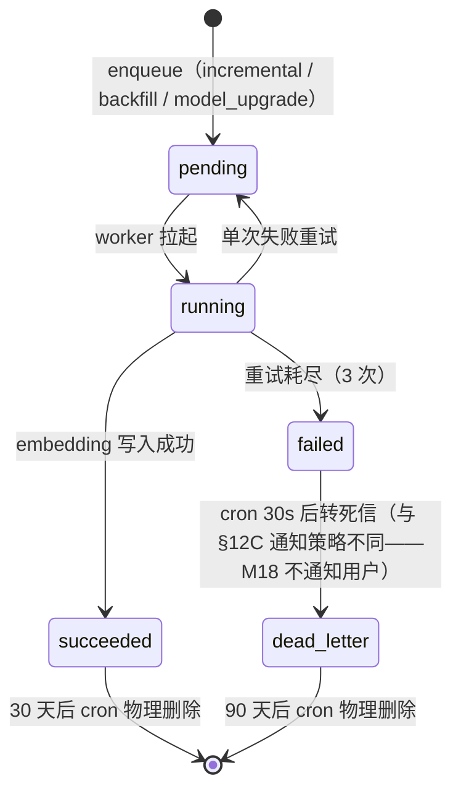

# M18 语义搜索 - 详细设计

> **Pilot 角色**：第 6 个 pilot 模块——**§12D embedding 持久化子模板首次实战**。覆盖 §12C 未覆盖的 4 维度：增量+backfill 双路触发链 / 模型版本升级回填 / 跨模读双路豁免（规则 1+规则 2 类）/ 派生数据失败容忍（vs M17 业务数据死信通知）。完成 + audit 后，§12D 子模板定稿（README §12 表扩为 4 行）。
>
> **CY 决策来源**：2026-04-25 brainstorming 12 决策（Q0=C / Q1=D / Q2=B / Q3=A / Q4=C / Q5=B / Q6=C / Q7=C / Q8=D / Q9=B / Q10=D / Q11=A）。

---

## 1. 业务说明 + 职责边界

### 业务背景（引自 PRD / US）

**核心用户故事**：
- **US-B1.5**：作为编辑者，搜"配额管理"应能同时返回包含"额度限制""quota""资源上限"等语义相关的功能项 / 维度记录 / 竞品 / 问题，而不是只匹配字面词
- **US-B1.6**：搜索框不变（用户无感），后端自动混合关键词 + 语义；pgvector 不可用时降级为纯关键词不阻塞
- **PRD F18 AC1-AC5**：BM25 + pgvector + RRF 融合 / 不替代不并存升级 F9 / 保留 F9 全部能力（权限 / 面包屑 / 项目维度问题筛选）

**业务定位**：M18 是 prism-0420 v0.4 的 AI 增强搜索能力——通过 embedding 把"非字面相似"的内容召回给用户，解决"用户不记得原作者用了哪个词"的痛点。

### In scope（M18 负责）

- **embedding 计算管道**（CY ack: Q1=D）：
  - 增量路径：M03/M04/M06/M07 写入时由对应 Service 调 M18 enqueue
  - Backfill 路径：服务启动 + 部署后 cron 扫漏补齐 + 模型升级时跑全量回填
- **embedding provider 抽象**（CY ack: Q2=B）：OpenAI text-embedding-3-small / 本地 bge-small-zh-v1.5 / Mock 三实现，启动时 env 静态选
- **混合搜索**（CY ack: Q11=A）：升级 M09 接管 search 路由——同搜索框，后端自动 BM25 + pgvector + RRF 融合 + project filter + 关键词 fallback
- **模型版本回填**（CY ack: Q3=A）：embeddings 表带 `model_version` 列，查询按"当前默认 model"过滤；切新 model 时旧 model embedding 进入回填队列
- **query embedding 短缓存**（CY ack: Q4=C）：搜索时同步算 query embedding，Redis 5min (query+model→vector) 缓存
- **idempotency**（CY ack: Q8=D）：enqueue 时 Redis SET 标记同 (target_type, target_id) pending（debounce），worker 内 content_hash 兜底
- **失败容忍 + 监控**（CY ack: Q7=C）：embedding 失败 3 次后留 NULL 不死信不通知用户；写 `embedding_failures` 表 + cron 阈值（>5%/h）报警 CY
- **跨模读双路**（CY ack: Q10=D）：增量单条走 ADR-003 规则 1（调上游 Service.get_for_embedding）；backfill 批量走规则 4（embedding 专用豁免，只读 import 上游 model）
- **参数化 RRF**（CY ack: Q6=C）：M02 ProjectSettings 加 `rrf_k` + `similarity_threshold` 字段（baseline-patch-m18），M18 search 按 project 取参

### Out of scope（其他模块负责）

| 不做的事 | 归属模块 |
|---------|---------|
| 关键词搜索算法本身（BM25 / ILIKE） | 算法库（M09 superseded 后归 M18 内部） |
| M14 全局新闻搜索（无 project_id） | M14 自身 search_by_keyword（M18 不接） |
| Embedding 写入 M03/M04/M06/M07 业务表的 trigger | 各模块 Service 层调 M18 enqueue |
| 用户搜索历史 / 推荐 | v0.5+ 未规划 |
| 图片 / 音频 embedding | v0.5+ 路线，§12D 首次实战为它们铺路 |
| 维度内容编辑 | M04 |
| AI 评价 / 流式输出 | M13 |

### 边界灰区（显式说明）

- **M18 vs M09**：**升级关系**（CY ack: Q11=A）。M09 status 改 `superseded_by=M18`；M18 接管 `/api/projects/{pid}/search` 路由；M09 设计文档归档作历史；M09 batch3 沉淀的 `search_by_keyword` 接口体系**继续有效**——M18 复用（增量路径调 `get_for_embedding`，backfill 不调）
- **M18 vs M14**：M14 全局无 project_id（catalog Tenant ❌）。M18 search 路由**不接 M14**——M14 在自己的"行业动态"页内搜，避免跨域权限混乱（与 ADR-003 L149 M14 例外保持一致）
- **M18 vs M17**：M17 是用户主动批量导入业务数据（§12C），失败死信 + 通知；M18 是系统派生 embedding，失败容忍（§12D），失败用户无感。两者都用 arq Queue 但失败语义反向
- **M18 vs M16**：M16 是 fire-and-forget AI 快照（§12B），用户主动触发等结果；M18 是被动派生，用户不知道 embedding 何时算
- **embedding 写入触发权**：归 M18 own（enqueue API + worker），但**触发时机**由各业务模块 Service 层在写入 commit 后调用 `M18EmbeddingService.enqueue(target_type, target_id, project_id)` 决定（业务模块自己判断"哪些字段值得 embedding"——例如 M04 dimension_records.content 的具体子字段）
- **AI Provider 配置来源**：M18 用**全局** embedding provider（env 选）+ 项目级 RRF 参数（M02 ProjectSettings）。**不**做项目级 embedding provider（Q2 反方理由：维度不同需重算，是运维操作不是配置）

---

## 2. 依赖模块图

```mermaid
flowchart TB
    User([用户])

    subgraph M18["M18 语义搜索（升级 supersedes M09）"]
        SearchAPI[search 路由<br/>POST /search]
        EmbedSvc[EmbeddingService<br/>enqueue + worker]
        BackfillCron[backfill cron]
        FailureMonitor[failure 监控 cron]
    end

    M02[M02 项目<br/>ProjectSettings.rrf_k / threshold]
    M03[M03 nodes]
    M04[M04 dimension_records]
    M06[M06 competitors]
    M07[M07 issues]
    M14[M14 industry_news<br/>不接入]

    Queue[(arq Queue)]
    DB[(PostgreSQL<br/>+ pgvector)]
    Redis[(Redis<br/>cache + debounce)]
    OpenAI[OpenAI API<br/>or 本地 bge]

    User -->|搜索| SearchAPI
    SearchAPI -->|读 RRF 参数| M02
    SearchAPI -->|关键词路径调 search_by_keyword| M03 & M04 & M06 & M07
    SearchAPI -->|向量路径| DB
    SearchAPI -->|query embedding 缓存| Redis
    SearchAPI -->|cache miss| OpenAI

    M03 & M04 & M06 & M07 -->|写入后 enqueue| EmbedSvc
    EmbedSvc -->|debounce 标记| Redis
    EmbedSvc -->|task 入队| Queue
    Queue -->|worker 增量路径调 get_for_embedding| M03 & M04 & M06 & M07
    Queue -->|调 OpenAI/bge| OpenAI
    Queue -->|写 embedding| DB
    Queue -->|失败计数| DB

    BackfillCron -->|只读 import 批量扫| DB
    BackfillCron -->|enqueue 缺失项| Queue

    FailureMonitor -->|读 embedding_failures| DB
    FailureMonitor -.->|>5%/h 报警| CY([CY])

    M14 -.x.->|不接入<br/>M14 自己搜| SearchAPI

    style M18 fill:#e1f5e1
    style M14 fill:#ffe1e1
```

**依赖说明**：
- **新增上游依赖**：M02 ProjectSettings（rrf_k / similarity_threshold）—— 走 baseline-patch-m18
- **接管 M09 上游接口**：M03/M04/M06/M07 已 batch3 加的 `search_by_keyword` 接口，M18 直接复用，**额外要求加 `get_for_embedding(target_id, project_id) -> str` 单条接口**（增量路径用）
- **新基础设施依赖**：Redis（query embedding 5min 缓存 + enqueue debounce SET）—— arq 已经依赖 Redis，复用同实例
- **不依赖 M15 activity_log**：search 操作不写 activity_log（高频低价值）；embedding 失败不进 activity_log（写自有 `embedding_failures` 表，R10-2 例外）

---

## 3. 数据模型（SQLAlchemy + Alembic 要点）

### 适用 ADR-003 规则混合（R3-5 + 规则 4 新增）

**M18 §3 双重声明**：
1. **聚合读部分**（search 路由的关键词路径）：适用 [`ADR-003`](../../adr/ADR-003-cross-module-read-strategy.md) **规则 1**（调上游 Service.search_by_keyword）。无自有"待搜索内容"主表，§3 这部分走 R3-5 纯读聚合规范
2. **自有写部分**（embedding 持久化 + 失败计数 + task 跟踪）：M18 own 三张自有表，§3 含 SQLAlchemy class（满足 R3-1）
3. **跨模读 backfill 部分**：本 ADR 拟新增**规则 4**（embedding/索引专用豁免）—— 详见 §9，等本设计 accepted 时同步扩 ADR-003

### 上游依赖表清单（聚合读部分，R3-5）

| 表名 | 归属模块 | 访问方式 | 用途 |
|------|---------|---------|------|
| nodes | M03 | Service.search_by_keyword（规则 1）+ Service.get_for_embedding（规则 1，新加）+ 只读 import（规则 4，backfill）| 关键词搜 + embedding 写入触发源 |
| dimension_records | M04 | 同上 | 同上 |
| competitors | M06 | 同上 | 同上 |
| issues | M07 | 同上 | 同上 |
| project_settings | M02 | Service.get_search_config（M02 baseline-patch 加）| 取 RRF 参数 |
| industry_news | M14 | **不读** | M14 不接入 M18 |

### 自有表 1：embeddings（向量持久化）

```python
# api/models/embeddings.py
from sqlalchemy import CheckConstraint, ForeignKey, Index, Text, text
from sqlalchemy.dialects.postgresql import UUID
from sqlalchemy.orm import Mapped, mapped_column
from pgvector.sqlalchemy import Vector

class Embedding(Base, TimestampMixin):
    __tablename__ = "embeddings"

    # 6 字段复合主键（audit B4 修复：加 modality + provider 字段拆分 model_version）
    # 决策来源：
    #   - Q5=B project_id 冗余 + Q3=A 多版本共存
    #   - audit B4 R3 升级：缺 modality/dim/provider 是结构性死局（图片/音频/双 provider 演进）
    #   - audit C3=C 部署期固定 provider，运行时不切（迁移=重大运维事件）
    # 字符串约定：provider/model_name/version 三段式（如 openai/text-embedding-3-small/v1）
    project_id: Mapped[UUID] = mapped_column(
        UUID(as_uuid=True),
        ForeignKey("projects.id", ondelete="CASCADE"),
        primary_key=True,
    )
    modality: Mapped[str] = mapped_column(VARCHAR(16), default="text", primary_key=True)   # ★ B4 新增
    target_type: Mapped[str] = mapped_column(Text, primary_key=True)
    target_id: Mapped[UUID] = mapped_column(UUID(as_uuid=True), primary_key=True)
    provider: Mapped[str] = mapped_column(VARCHAR(32), primary_key=True)   # ★ B4 新增（如 'openai' / 'bge' / 'mock'）
    model_version: Mapped[str] = mapped_column(Text, primary_key=True)     # 业务版本号（如 'v1'）

    # 向量维度显式记录（B4 新增）
    dim: Mapped[int] = mapped_column(nullable=False)         # 1536 / 512 / 384 / 768 / ...

    # 向量主体（维度由 provider+model 决定，env 部署期固定）
    # 注：pgvector Vector 类型本身不强制运行时维度——迁移期间双 provider 不同 dim 可共存
    embedding: Mapped[list[float]] = mapped_column(Vector(1536))   # 物理上限 1536（OpenAI 主流），bge 等小维度填零或专用列演进

    # 内容哈希（CY ack: Q8=D worker 内兜底）
    content_hash: Mapped[str] = mapped_column(Text, nullable=False)

    __table_args__ = (
        # R3-2 三重防护——modality + target_type + provider 各自 CHECK
        CheckConstraint(
            "modality IN ('text', 'image', 'audio')",
            name="ck_embeddings_modality",
        ),
        CheckConstraint(
            "target_type IN ('node', 'dimension_record', 'competitor', 'issue')",
            name="ck_embeddings_target_type",
        ),
        CheckConstraint(
            "provider IN ('openai', 'bge', 'mock')",
            name="ck_embeddings_provider",
        ),
        CheckConstraint("dim > 0 AND dim <= 1536", name="ck_embeddings_dim_range"),
        # ivfflat 索引（lists 从 ORM 移到 env，audit M9 修复——Phase 2 实施时按 IVFFLAT_LISTS=os.getenv 注入）
        Index(
            "ix_embeddings_vector",
            "embedding",
            postgresql_using="ivfflat",
            postgresql_ops={"embedding": "vector_cosine_ops"},
            postgresql_with={"lists": 100},   # 默认 100，配置见 §6 env 表
        ),
        # project filter 索引（Q5=B 选型核心收益）
        Index("ix_embeddings_project_provider_model", "project_id", "provider", "model_version"),
    )
```

**StatusEnum**（audit m1 修复——满足 R3-2 第 1 重防护）：

```python
class EmbeddingTaskStatus(str, Enum):
    PENDING = "pending"
    RUNNING = "running"
    SUCCEEDED = "succeeded"
    FAILED = "failed"
    DEAD_LETTER = "dead_letter"
```

**TargetType 枚举**（M03/M04/M06/M07 各对应一个）：

```python
class EmbeddingTargetType(str, Enum):
    NODE = "node"
    DIMENSION_RECORD = "dimension_record"
    COMPETITOR = "competitor"
    ISSUE = "issue"
```

**关键设计点**：
- **6 字段复合主键** (project_id, modality, target_type, target_id, provider, model_version)——audit B4 修复后的 schema，预留多模态/多 provider 演进空间
- **modality + provider + dim 显式分离**（audit B4 R3 升级）：避免未来加图片/音频时回填全表 + 重建 ivfflat 索引（结构性死局规避）
- **embedding 列物理维度上限 1536**（OpenAI 主流维度）—— bge-small (384/512) 等小维度可放入；未来 text-embedding-3-large (3072) 需要单独的 embedding_3072 列或新表（见「provider 切换路径」段）
- **model_version 是 PK 字段**——查询按 (provider, current_model_version) filter，多版本物理共存（Q3=A 渐进回填）
- **content_hash 必填**——同 PK 已有 embedding 时比对 hash 跳过 Provider 调用（Q8 兜底）
- **多版本占用代价**：5 万条 × 1536 维 × float32 ≈ 300MB / (provider, model_version)；回填期间双倍 600MB → 30 天宽限回收

### Provider 切换路径（audit B2 / C3=C 明文化）

**承诺级别**：M18 EmbeddingProvider 抽象（§6）的"3 provider 实现"是**接口预留 + 部署期可选**，**不承诺运行时切换**。

| 切换场景 | 路径 | 服务影响 |
|---------|------|---------|
| 启动期一次性选定（CY 部署时改 env `EMBEDDING_PROVIDER=openai/bge/mock`）| 启动 EmbeddingProvider 抽象层按 env 加载 | 无 |
| 运行期切 provider（同维度，如 bge-v1 → bge-v2）| 改 env + 重启 + 触发 model_upgrade 回填 cron | 重启窗口（秒级） |
| 运行期切 provider（**不同维度**，如 OpenAI 1536 → bge 384）| **不支持**——必须走"全量数据迁移"运维事件：① drop 旧 provider 所有 embeddings 行；② 改 env；③ 重启；④ 跑全量 backfill 重建 | 数小时停服 + 数据丢失（旧 embedding 全删） |
| 双 provider 并行（如同时跑 OpenAI + bge）| **本期不支持**——PK schema 物理支持（多 provider 行共存），但 §6 EmbeddingProvider 抽象只允许单 instance；演进退路见 R3 演进 audit E6 |

**reviewer 承诺**：本期承诺 (1) + (2)，明示否决 (3) 的"零停机"和 (4) 的并行模式。CY 若未来需要 (3) 必须申请运维窗口；(4) 必须重新设计 §6 ProviderRegistry。

### 自有表 2：embedding_failures（失败计数 + 监控源）

```python
# api/models/embedding_failures.py
class EmbeddingFailure(Base, TimestampMixin):
    """
    M18 own 横切表——R10-2 例外（auth_audit_log 类）。
    适用三条件全满足：
      1. 仅服务 M18 embedding 失败审计
      2. 高频系统级（潜在 100+/h）进 M15 activity_log 会淹没业务时间线
      3. 系统级事件无用户主动操作语义
    """
    __tablename__ = "embedding_failures"

    id: Mapped[UUID] = mapped_column(UUID(as_uuid=True), primary_key=True, server_default=text("gen_random_uuid()"))
    project_id: Mapped[UUID] = mapped_column(UUID(as_uuid=True), ForeignKey("projects.id", ondelete="CASCADE"), nullable=False)
    target_type: Mapped[str] = mapped_column(Text, nullable=False)
    target_id: Mapped[UUID] = mapped_column(UUID(as_uuid=True), nullable=False)
    model_version: Mapped[str] = mapped_column(Text, nullable=False)
    error_code: Mapped[str] = mapped_column(Text, nullable=False)        # ErrorCode 字符串
    error_message: Mapped[str] = mapped_column(Text, nullable=False)
    retry_count: Mapped[int] = mapped_column(default=0)
    failed_at: Mapped[datetime] = mapped_column(server_default=text("NOW()"))

    __table_args__ = (
        CheckConstraint(
            "target_type IN ('node', 'dimension_record', 'competitor', 'issue')",
            name="ck_embedding_failures_target_type",
        ),
        Index("ix_embedding_failures_failed_at", "failed_at"),       # cron 监控走时间窗口扫
        Index("ix_embedding_failures_project_target", "project_id", "target_type", "target_id"),
    )
```

**保留策略**：90 天后物理删除（cron）——失败记录无审计价值，仅用于"近期失败率"监控

### 自有表 3：embedding_tasks（task 跟踪 + zombie 兜底锚点）

```python
class EmbeddingTask(Base, TimestampMixin):
    __tablename__ = "embedding_tasks"

    id: Mapped[UUID] = mapped_column(UUID(as_uuid=True), primary_key=True, server_default=text("gen_random_uuid()"))
    project_id: Mapped[UUID] = mapped_column(UUID(as_uuid=True), ForeignKey("projects.id", ondelete="CASCADE"), nullable=False)
    target_type: Mapped[str] = mapped_column(Text, nullable=False)
    target_id: Mapped[UUID] = mapped_column(UUID(as_uuid=True), nullable=False)
    model_version: Mapped[str] = mapped_column(Text, nullable=False)
    status: Mapped[EmbeddingTaskStatus] = mapped_column(Text, nullable=False, default="pending")    # audit m1 修复：从裸 Mapped[str] 改 Mapped[StatusEnum] 满足 R3-2 第 1 重防护
    retry_count: Mapped[int] = mapped_column(default=0)
    enqueued_by: Mapped[str] = mapped_column(Text, nullable=False)       # 'incremental' | 'backfill' | 'model_upgrade'
    error_code: Mapped[str | None] = mapped_column(Text, nullable=True)
    error_message: Mapped[str | None] = mapped_column(Text, nullable=True)
    completed_at: Mapped[datetime | None] = mapped_column(nullable=True)
    expires_at: Mapped[datetime | None] = mapped_column(nullable=True)   # 终态后 30 天清理

    __table_args__ = (
        CheckConstraint(
            "status IN ('pending', 'running', 'succeeded', 'failed', 'dead_letter')",
            name="ck_embedding_tasks_status",
        ),
        CheckConstraint(
            "target_type IN ('node', 'dimension_record', 'competitor', 'issue')",
            name="ck_embedding_tasks_target_type",
        ),
        CheckConstraint(
            "enqueued_by IN ('incremental', 'backfill', 'model_upgrade')",
            name="ck_embedding_tasks_enqueued_by",
        ),
        Index("ix_embedding_tasks_status_created", "status", "created_at"),  # zombie 兜底用
        Index("ix_embedding_tasks_project_target", "project_id", "target_type", "target_id"),
    )
```

### 自有表 4：search_evaluation_log（audit M13 修复 - 1% 采样离线评估）

```python
class SearchEvaluationLog(Base, TimestampMixin):
    """audit M13 修复：1% 采样记录三模式（keyword/semantic/hybrid）top5 + 用户点击，
    用于半年后离线分析"RRF k=60 是否真的优于 k=80"等调优问题。
    PRD F18 没"质量评估"机制——这是补盲点。"""
    __tablename__ = "search_evaluation_log"

    id: Mapped[UUID] = mapped_column(UUID(as_uuid=True), primary_key=True, server_default=text("gen_random_uuid()"))
    project_id: Mapped[UUID] = mapped_column(UUID(as_uuid=True), ForeignKey("projects.id", ondelete="CASCADE"), nullable=False)
    user_id: Mapped[UUID] = mapped_column(UUID(as_uuid=True), nullable=False)
    query: Mapped[str] = mapped_column(Text, nullable=False)
    keyword_top5: Mapped[list[dict]] = mapped_column(JSONB, nullable=False)    # [{target_type, target_id, score}]
    semantic_top5: Mapped[list[dict]] = mapped_column(JSONB, nullable=False)
    hybrid_top5: Mapped[list[dict]] = mapped_column(JSONB, nullable=False)
    user_clicked_target_type: Mapped[str | None] = mapped_column(Text, nullable=True)
    user_clicked_target_id: Mapped[UUID | None] = mapped_column(UUID(as_uuid=True), nullable=True)
    rrf_k: Mapped[int] = mapped_column(nullable=False)             # 当时 project 配置
    similarity_threshold: Mapped[float] = mapped_column(nullable=False)
    sampled_at: Mapped[datetime] = mapped_column(server_default=text("NOW()"))

    __table_args__ = (
        Index("ix_search_eval_sampled_at", "sampled_at"),
        Index("ix_search_eval_project_query", "project_id", "query"),
    )
```

**采样逻辑**：search 路由按 env `SEARCH_EVAL_SAMPLE_RATE=0.01` (1%) 采样写入。点击事件由前端独立 endpoint 上报 `POST /api/search-eval/{eval_id}/click`。

**保留策略**：1 年保留（评估目的），cron 清理。

### Alembic 要点

- 启用扩展：`CREATE EXTENSION IF NOT EXISTS vector;`（与 Prism 一致）
- 四表一次迁移上线（embeddings + embedding_tasks + embedding_failures + search_evaluation_log）
- pgvector 不可用时降级处理：FastAPI 启动时探测扩展存在性，不存在则 search 路由全程 keyword-only（PRD AC4）+ embedding 写入直接 noop（不报错只静默 + 写一条 `embedding_failures` 记录 error_code=PGVECTOR_UNAVAILABLE）

### 候选 B 改回成本块（R3-4：embedding 表加 project_id 列方案）

如果未来证实 Q5=B 选错（实际多 project 场景下 ivfflat 加 project filter 反而比纯 (target_type, target_id) 慢——pgvector 7.0+ 改进 ivfflat 后可能发生），改回方案 A（无 project_id 冗余）的成本：

| 维度 | 成本 |
|------|------|
| Alembic 迁移步数 | 3 步（移除 project_id 列 / 重建主键 / 重建索引） |
| 数据迁移不可逆性 | 中——project_id 可从 nodes/dimension_records 等业务表反查回填，但删主键索引时存在窗口 |
| 受影响模块数 | 1（M18 自身）—— project_id 仅 M18 用，业务表不依赖 |
| 删表数 | 0（只改列） |

### 候选 B 改回成本块 #2（R3-4 audit m5：PK 含 model_version 改回方案）

如果未来证实 Q3=A 选错（多版本共存的 600MB/300MB-per-version 占用在大规模下不可接受），改回 PK 不含 model_version（覆盖式更新，放弃回滚能力）的成本：

| 维度 | 成本 |
|------|------|
| Alembic 迁移步数 | 4 步（清理非 current_model 行 / 移除 model_version PK / 改 model_version 为普通列 / 重建索引）|
| 数据迁移不可逆性 | 高——清理旧版本 embedding 不可恢复，**回滚能力永久丢失** |
| 受影响模块数 | 1（M18 自身）+ §6 model_upgrade 端点改语义（不再有"渐进回填"，直接覆盖）|
| 删表数 | 0（只改列+索引） |
| 业务影响 | 模型升级路径变成"全停服重算"，与 §12D 字段⑦ 冲突需重新设计 |

---

## 4. 状态机

### embedding_task 状态机（5 状态）



**禁止转换**（N=4：终态 succeeded/failed/dead_letter + 兜底）：
1. `succeeded → 任意 状态`：原因 = 终态不可变 / 对应 ErrorCode `EMBEDDING_TASK_TERMINAL_VIOLATION`
2. `failed → succeeded`：原因 = 失败已落 embedding_failures，重新成功要走新 task / 对应 ErrorCode `EMBEDDING_TASK_TERMINAL_VIOLATION`
3. `dead_letter → 任意 状态`：原因 = 死信终态 / 对应 ErrorCode `EMBEDDING_TASK_TERMINAL_VIOLATION`
4. `pending → succeeded` 跳过 running：原因 = 必须经过 worker / 对应 ErrorCode `EMBEDDING_TASK_INVALID_TRANSITION`

### embedding 行级状态（隐式）

`embeddings` 表自身**无 status 字段**——存在性 + model_version 即为状态：
- 不存在 → 未算 / 失败 / 删除
- 存在 + model_version=current → 可参与召回
- 存在 + model_version!=current → 旧版本（回填中），不参与召回但保留以防回滚

**回滚场景**：模型升级后发现新 model 召回质量下降 → CY 改 env `DEFAULT_EMBEDDING_MODEL` 回旧 model + 重启 → 旧 embedding 立即恢复参与召回（无需重算）

---

## 5. 多人架构 4 维必答 ★ pilot §12D 异步覆盖

### 4 维表格

| 维度 | M18 取值 | 候选说明 |
|------|---------|---------|
| **Tenant** | ✅ project-scoped | embeddings.project_id 冗余 + ivfflat 召回前 filter |
| **事务** | 单 task 单事务（ORM advisory_xact_lock 防并发重算）| 候选 B：跨多 task 大事务（否——锁等待长） |
| **异步** | 🗂️ §12D Queue 持久化（embedding 增量+backfill 双路）| 候选 B：纯 §12C（否——双路覆盖不全，模型升级回填语义缺失） |
| **并发** | enqueue Redis SET debounce + worker advisory_xact_lock + content_hash 兜底（三层防重）| 候选 B：纯哈希去重（否——hot-path 用户连改 5 次仍 5 次 OpenAI）|

### 5 项清单

| # | 项目 | M18 取值 |
|---|------|---------|
| 1 | activity_log | ❌ 不写——search 高频 / embedding 派生（CY ack: Q7=C，写 embedding_failures 自有表） |
| 2 | 乐观锁 version | ❌ 不需要——embedding 行覆盖式更新，不存在并发改同一行的"协作场景"（worker 互斥用 advisory_xact_lock） |
| 3 | Queue payload tenant | ✅ §12D Payload 强制带 user_id + project_id（继承 TaskPayload 基类）|
| 4 | idempotency_key | ✅ enqueue 阶段 = `embedding:debounce:{project_id}:{target_type}:{target_id}`（Redis SET TTL 60s）；worker 阶段 = (project_id, target_type, target_id, model_version, content_hash) 比对 |
| 5 | DAO tenant 过滤 | 三类查询（见 §9）：搜索时 project_id IN (...)；增量 worker 单 task project_id；backfill 按 project 分批 |

### 状态转换竞态分析（R5-2）

| 竞态场景 | 防护机制 |
|---------|---------|
| **同 (project_id, target_type, target_id) 两个 task 并发 worker 跑**（debounce 过期时） | worker 入口 `pg_advisory_xact_lock(hashtext(target_id))` —— 一个 commit 后另一个查 content_hash 跳过 |
| **enqueue 时 task 已 pending（用户连改）** | Redis SET 标记 `embedding:debounce:{...}` TTL 60s，存在则 enqueue 跳过；过期后允许新 task（防 worker 永不跑被卡死） |
| **worker 跑到一半 model_version 被 env 改了**（模型升级期间） | worker 入口读一次 `current_model_version`，全程用这个；commit 时按这个版本写——若 env 又改了，下次 backfill cron 会再触发回填 |
| **embedding 写入 commit 后业务表 target_id 被删** | 业务表删除 CASCADE 通过 ondelete='CASCADE' 删 embeddings 行（embeddings.project_id FK→projects + 业务表 FK 通过软关联，不在 DB 层强制——见 §9 删除策略）|
| **backfill cron 与增量 worker 并发** | backfill 只 enqueue 不直写；entry advisory_xact_lock 互斥 |

---

## 6. 分层职责表

| 层 | 文件 | 职责 |
|----|------|------|
| **Server Action** | `web/src/actions/search.ts` | 接收 search 表单 → 校验 query 非空 → 调 FastAPI `/api/projects/{pid}/search` → 渲染结果 |
| **Server Action** | `web/src/actions/projectSettings.ts`（M02 baseline-patch 扩） | 编辑 rrf_k / similarity_threshold（管理员 UI） |
| **Router** | `api/routers/search.py` | `POST /api/projects/{pid}/search` —— Bearer JWT auth + project access check + 调 SearchService |
| **Router** | `api/routers/embedding_admin.py`（CY 内部用，platform_admin 限定） | `POST /api/admin/embedding/backfill` 手动触发 / `POST /api/admin/embedding/model-upgrade` 触发回填 |
| **Service** | `api/services/search.py` (M18 接管 M09) | `SearchService.hybrid_search(db, query, project_id, user_id)` —— 入口读 env `SEARCH_MODE`（hybrid / keyword_only / semantic_only，audit B5 kill switch）+ 调上游 search_by_keyword + 调 EmbeddingService.embed_query + RRF 融合 + filter + 超时事件埋点（audit M12） |
| **Service** | `api/services/embedding.py` | `EmbeddingService.enqueue / get_or_compute_embedding / embed_query / batch_backfill` |
| **Service** | `api/services/embedding_provider.py` | `EmbeddingProvider` 基类 + OpenAI / bge / Mock 实现（仿 ADR-001 §4 LLM provider 抽象） |
| **Queue Worker** | `api/queue/embedding_tasks.py` | `embed_single` task —— 入口校验 payload + advisory_xact_lock + content_hash 比对 + Provider 调用 + 写 embeddings or embedding_failures |
| **Cron** | `api/cron/embedding_backfill.py` | 每日 0 点扫 backfill / 每 5min 扫 zombie / 每小时扫 failures 阈值 |
| **DAO** | `api/dao/embedding.py` | `find_by_target / upsert_embedding / find_failures_by_window / find_zombie_tasks` |
| **DAO** | `api/dao/embedding_backfill.py`（规则 4 豁免） | 只读 import M03/M04/M06/M07 model 跑批量 SELECT，找出"业务表有但 embeddings 表无 / model_version 旧"的 (target_type, target_id) 列表 |
| **Schema** | `api/schemas/search.py` | `SearchRequest / SearchResult / SearchResponse` Pydantic |
| **Schema** | `api/schemas/embedding.py` | `EmbedSinglePayload(TaskPayload)` |
| **Errors** | `api/errors/codes.py` | M18 ErrorCode + AppError 子类（§13） |

### env 配置清单（audit B5 / M9 / M10 / M12 修复）

| env 变量 | 默认 | 用途 | audit 来源 |
|---------|------|------|-----------|
| `EMBEDDING_PROVIDER` | `openai` | 部署期固定，三选一 `openai` / `bge` / `mock` | C3=C 明文化 |
| `DEFAULT_EMBEDDING_MODEL` | `text-embedding-3-small` | 当前默认 model name（搜索 filter 用） | Q3=A |
| `EMBEDDING_MODEL_VERSION` | `v1` | 当前 model 业务版本号 | B4 三段式拆分 |
| `SEARCH_MODE` | `hybrid` | kill switch 三档 `hybrid` / `keyword_only` / `semantic_only` | **B5 kill switch** |
| `IVFFLAT_LISTS` | `100` | ivfflat 索引 lists 参数（演进锚点：行数 > 50 万 时调到 sqrt(N) ~ 700） | **M9 演进锚点** |
| `EMBEDDING_FAILURE_THRESHOLD_ABS` | `100` | 单小时绝对失败数告警 | M10 三维 |
| `EMBEDDING_FAILURE_THRESHOLD_PCT` | `5` | 单小时失败率 % 告警 | M10 三维 |
| `EMBEDDING_FAILURE_THRESHOLD_PER_PROJECT` | `100` | 单 project 单小时绝对失败数告警 | M10 三维 |
| `QUERY_EMBEDDING_TIMEOUT_MS` | `1000` | query embedding 超时（**M5 修复：从 2s 改 1s** 留更多预算给 RRF + DB） | M5 边界修复 |
| `EMBEDDING_TASK_TIMEOUT_S` | `60` | 单 embedding task 超时 | §12D ⑤ |
| `BACKFILL_BATCH_TIMEOUT_S` | `900` | batch backfill 整批超时（对齐 ADR-001 §4.2 ai_embedding=15min） | §12D ⑤ |
| `SEARCH_EVAL_SAMPLE_RATE` | `0.01` | search 路由 1% 采样写 search_evaluation_log（M13 离线评估） | **M13 新增** |

---

## 7. API 契约（Pydantic + OpenAPI 路径表）

### Endpoints

| 方法 | 路径 | 用途 | 权限 | 同步/异步 |
|------|------|------|------|---------|
| POST | `/api/projects/{project_id}/search` | 混合搜索（接管 M09）| viewer | 同步 ≤3s（PRD 6.1）|
| POST | `/api/admin/embedding/backfill` | 手动触发 backfill（platform_admin only）| platform_admin | 异步（202） |
| POST | `/api/admin/embedding/model-upgrade` | 触发模型升级回填 | platform_admin | 异步（202） |
| GET | `/api/admin/embedding/stats` | 看 failure 率 / pending task 数 / model_version 分布 | platform_admin | 同步 |

**关键不暴露**：embedding CRUD 不对外（用户视角看不见 embedding）；embedding_failures 仅 admin 看。

### Pydantic schema（核心）

```python
# api/schemas/search.py
class SearchRequest(BaseModel):
    query: str = Field(..., min_length=1, max_length=200)
    target_types: list[EmbeddingTargetType] | None = None    # None 表示全部 4 类
    limit: int = Field(20, ge=1, le=100)

class SearchResultItem(BaseModel):
    target_type: EmbeddingTargetType
    target_id: UUID
    title: str
    snippet: str               # 关键词高亮 or 语义摘要
    score: float               # RRF 融合分
    matched_by: list[Literal["keyword", "semantic"]]    # 哪条路径命中（透明给用户/CY 调试）
    breadcrumb: list[str]      # 复用 M09 已有

class SearchResponse(BaseModel):
    results: list[SearchResultItem]
    total: int
    search_mode: Literal["hybrid", "keyword_only"]    # pgvector 不可用时降级（PRD AC4）
    query_embedding_cached: bool                       # 调试用：query embedding 是否缓存命中

# api/schemas/embedding.py
class EmbedSinglePayload(TaskPayload):
    """§12D Queue payload（继承 TaskPayload 基类强制 user_id + project_id）"""
    target_type: EmbeddingTargetType                  # ★ 枚举非 str
    target_id: UUID
    model_version: str                                # 调度时锁定的 model 版本
    enqueued_by: Literal["incremental", "backfill", "model_upgrade"]    # ★ 限定取值
    # 注意：source_text 不放 payload（防大 zip 任务塞爆 Redis）——worker 内调上游 Service 拉取
```

### OpenAPI 关键约束

- search 路由 4xx/5xx 必返 `error: {code, message}` 结构
- pgvector 不可用时返 `search_mode="keyword_only"` + 200（不报错——AC4）
- query 超 200 char 返 400 / `INVALID_QUERY_LENGTH`
- 项目无 access 返 403 / `PROJECT_FORBIDDEN`

---

## 8. 权限三层防御点

| 层 | 路径 | 防御点 |
|----|------|--------|
| **L1 Server Action** | `actions/search.ts` | `auth()` 取 session → 不存在 redirect login |
| **L1 Server Action** | `actions/projectSettings.ts` | `auth()` + `assertProjectRole(project_id, "admin")` 才能改 RRF 参数 |
| **L2 Router** | `routers/search.py` | `Depends(require_user)` Bearer JWT |
| **L2 Router** | `routers/embedding_admin.py` | `Depends(require_platform_admin)` |
| **L3 Service** | `services/search.py` | `check_project_access(user_id, project_id, role="viewer")` —— 拒绝跨 project 搜 |
| **L3 Service** | `services/embedding.py` enqueue | **不做 project access check**（仅由信任的业务模块 Service 内部调用，不对外暴露 enqueue endpoint）|
| **L4 Queue 消费者侧** | `queue/embedding_tasks.py` | ① `EmbedSinglePayload.parse_obj(raw)` ② `embedding_service.check_payload_consistency(payload)`（target_id 仍存在 + project_id 与业务表实际归属一致）③ 业务逻辑 |

**ADR-002 + ADR-004 引用**：
- Queue 消费者强制带 user_id + project_id 来自 ADR-002 §横切
- L1+L2 鉴权路径来自 ADR-004 P1 (JWT 浏览器直连) + P2 (HMAC server action)

**特殊点**：
- **search 路由不暴露 admin 端点的搜索全 project**（CY ack: Q9=B 同 project user 共享 embedding，但跨 project 仍隔离）
- **embedding worker 不信任 enqueue 时的 project_id**——业务表反查校验（防 enqueue 调用方 bug 串 project）

---

## 9. DAO tenant 过滤策略

### 三类查询的 tenant 处理

| 查询类型 | DAO 函数 | tenant 过滤模式 | 适用 ADR-003 规则 |
|---------|---------|---------------|-----------------|
| **搜索关键词路径** | `SearchService` 调上游 `search_by_keyword(query, project_id, limit)` | 上游负责 project_id filter（M09 已 batch3 沉淀） | **规则 1** 主规则 |
| **搜索向量路径** | `EmbeddingDAO.vector_search(db, query_vector, project_id, model_version, limit)` | DAO 内 SQL `WHERE project_id = :pid AND model_version = :mv` + ivfflat ORDER BY | M18 自有表，无规则适用 |
| **增量 worker 单条 embedding** | 调上游 `Service.get_for_embedding(target_id, project_id)` | 上游负责 project access | **规则 1** 主规则 |
| **Backfill 批量扫描** | `EmbeddingBackfillDAO.list_pending_by_project(project_id, limit)` —— 只读 import M03/M04/M06/M07 model 跑 LEFT JOIN embeddings | DAO 内 `WHERE project_id = :pid AND embeddings.id IS NULL` | **规则 4 新增** embedding/索引专用豁免 |
| **Failure 监控扫描** | `EmbeddingFailureDAO.count_in_window(window_minutes, project_id=None)` | 全局或按 project | M18 自有表 |

### 规则 4 全文嵌入（audit B3 修复 - 不依赖 ADR-003 时序）

> **B3 修复说明**：原稿引用"规则 4"作为 backfill DAO 合规依据，但 ADR-003 尚未扩条（baseline-patch 实施顺序第 1 步）。本节按 audit 决策 **全文嵌入规则 4**——M18 自身定义自身遵守，accepted 时与 ADR-003 修订**同步**生效。

**规则 4：embedding/索引派生模块的批量 backfill 豁免**

**适用条件**（必须全部满足）：
- 模块定位是"为业务表生成派生索引数据"（embedding / 全文索引 / 物化统计），而非"展示业务内容"
- **仅 backfill 路径**走规则 4（baseline-patch 决策 1 收紧）；增量单条 / search 关键词路径仍走规则 1
- 批量回填的性能要求使规则 1 不可行（5 万条调 5 万次 Service 接口，本项目场景 ≥ 1h 不可接受）
- 仅做**只读 SELECT**（含 LEFT JOIN），禁止 UPDATE/DELETE（写入仍走自有表）

**豁免内容**：
- backfill DAO 可以 `from api.models.nodes import Node` 等只读 import 上游 SQLAlchemy model
- 跑 LEFT JOIN 自有表 + WHERE project_id 等批量 SELECT
- 严禁在豁免 DAO 中 INSERT/UPDATE/DELETE 上游表

**与规则 2 的区别**：规则 2 适用"DB 层聚合计算"（M10 完善度，GROUP BY/aggregate）；规则 4 适用"派生索引批量构建"（M18 backfill，LEFT JOIN 找差异）。两者不重叠，避免规则 2 边界稀释。

**M18 自身适用声明**：
- §6 已分文件：`api/dao/embedding.py`（增量，规则 1）/ `api/dao/embedding_backfill.py`（backfill，规则 4）
- 只读 import 上游 model 清单：`Node` (M03) / `DimensionRecord` (M04) / `Competitor` (M06) / `Issue` (M07)
- M14 不列入（M14 不接入 M18，见 §1 边界灰区）

**ADR-003 修订同步要求**：M18 accepted commit 时一并修订 ADR-003 §Decision 加规则 4 全文（baseline-patch 第 1 步），文字与本节保持一致。

**示例**：

```python
# ✅ 规则 4 豁免：backfill DAO 只读 import + LEFT JOIN
class EmbeddingBackfillDAO:
    def list_pending_node_ids(self, db: Session, project_id: UUID, model_version: str, limit: int):
        # 只读 import Node
        return (
            db.query(Node.id, Node.name)
            .outerjoin(
                Embedding,
                (Embedding.target_type == "node")
                & (Embedding.target_id == Node.id)
                & (Embedding.model_version == model_version),
            )
            .filter(Node.project_id == project_id)
            .filter(Embedding.target_id.is_(None))
            .limit(limit)
            .all()
        )

# ✅ 规则 1 严格：增量 worker 调上游 Service
class EmbeddingService:
    def embed_single(self, db, payload: EmbedSinglePayload):
        # 调上游 Service 拉内容（不直 import Node model）
        if payload.target_type == "node":
            content = self.node_service.get_for_embedding(db, payload.target_id, payload.project_id)
        elif payload.target_type == "dimension_record":
            content = self.dimension_service.get_for_embedding(db, payload.target_id, payload.project_id)
        # ...
        if content is None:
            return  # 业务表已删，noop
        ...
```

### 删除策略（audit B1 修复 = C2=A commit 后异步 enqueue）

> **B1 修复说明**：原稿"业务模块 Service 内显式调 + 共享 session（R-X3）"与 baseline-patch 决策 5"失败不阻塞业务删除"事务模型矛盾。按 audit C2=A 决策——**删除清理走 commit 后异步 enqueue 模式**，与"派生数据失败容忍"哲学一致；放弃"共享外部 session"的 R-X3 严格性，但用 zombie/cleanup cron 兜底保证最终一致性。

| 触发 | 行为 |
|------|------|
| `projects` 删除 | embeddings / embedding_tasks / embedding_failures CASCADE（FK ondelete='CASCADE'）—— 这条不变 |
| `nodes` / `dimension_records` / `competitors` / `issues` 删除 | **业务模块 Service `with db.begin()` commit 后**调 `EmbeddingService.enqueue_delete(target_type, target_id, project_id)` 入 Queue 异步清理。enqueue 失败仅 logger.warning + 写 embedding_failures `EMBEDDING_DELETE_FAILED`，**不影响业务删除主路径** |
| 不依赖 DB CASCADE 跨表 | embeddings 不直接 FK 业务表（target_id 是 polymorphic），DB 无法 CASCADE，必须异步清理 + cleanup cron 兜底 |
| 兜底机制 | M18 cleanup cron（每周一次）扫"target_id 不在业务表的 embeddings 行" → 物理删除（90 天宽限）—— 防 enqueue 失败导致的孤儿 embedding |

**新加 Service 接口**（baseline-patch 一并 - **修订**）：
- M03/M04/M06/M07 `delete_by_id` Service 在 `with db.begin()` **commit 后**（非 `with` block 内）调 `embedding_service.enqueue_delete(...)`
- enqueue_delete 内部走 arq Queue（与 embed_single 同 Queue 不同 task type）
- worker 跑 `delete_embedding` task：DELETE FROM embeddings WHERE (target_type, target_id, project_id) = (...)

**事务模型对比**（明示放弃 R-X3 严格性的代价）：

| 选项 | 优 | 缺 | 是否选 |
|------|---|---|-------|
| 共享 session 严格 R-X3 | 强一致 | delete embeddings 失败 = 业务删除回滚（违反决策 5）| ❌ |
| **commit 后异步 enqueue（C2=A）** | **业务删除独立成功，符合决策 5；失败容忍 + cron 兜底** | enqueue 与 cron 间窗口存在孤儿 embedding（无害——search 走 INNER JOIN 自然 filter）| ✅ |

**search 路径相容性**：search 路由的关键词路径走上游 Service.search_by_keyword（拿不到已删 target），向量路径 SQL 不 JOIN 业务表（仅按 project_id + model 过滤后返回 (target_type, target_id)，前端再 fetch 详情时拿 404 跳过）—— 孤儿 embedding 不会污染搜索结果。

### current_model sanity check（audit M6 修复）

启动时 `EmbeddingService` 检查：
```python
def _validate_current_model_on_startup(self, db: Session):
    """audit M6 修复：current_model 不在 embeddings 已有 (provider, model_version) 集合中时
    启动 warn + 自动 fallback 最近 model_version，防"启动成功但搜索全 miss"。"""
    current = (settings.EMBEDDING_PROVIDER, settings.EMBEDDING_MODEL_VERSION)
    existing = db.query(distinct(Embedding.provider, Embedding.model_version)).all()
    if existing and current not in existing:
        logger.warning(f"current_model {current} not in embeddings table; falling back to latest")
        # search 路由临时按 latest model_version filter 直到 backfill 完成
        self._effective_model_for_search = self._latest_model_in_db(db, existing)
    else:
        self._effective_model_for_search = current
```

启动时 logger.warning 给 CY 看到；search 自动降级到现存 model（避免无脑全 miss）。

---

## 10. activity_log 事件清单

| 操作 | action_type | target_type | metadata | 写不写？ |
|------|-------------|-------------|----------|---------|
| 用户搜索 | — | — | — | ❌ **不写**——高频低价值（search 操作每用户每天可能 50+ 次，进 M15 时间线噪音过大）|
| embedding 计算成功 | — | — | — | ❌ **不写**——派生数据系统行为，用户无感 |
| embedding 计算失败 | — | — | — | ❌ **不写 M15 activity_log**——写自有 `embedding_failures` 表（R10-2 例外，三条件全满足）|
| 模型升级触发回填 | `ActionType.EMBEDDING_MODEL_UPGRADE_TRIGGERED` | `TargetType.PROJECT` | `{old_model, new_model, affected_count}` | ✅ **写一条**（CY 主动运维操作，admin 端点触发，少量低噪）|
| 手动 backfill 触发 | `ActionType.EMBEDDING_BACKFILL_TRIGGERED` | `TargetType.PROJECT` | `{trigger_reason, affected_count}` | ✅ **写一条**（admin 主动操作） |

**audit M1 修复说明**：表格中 action_type / target_type 用枚举成员名而非裸字符串，避免与下方"M15 schema 扩枚举"段不一致。Phase 2 实施时引用 `ActionType.EMBEDDING_MODEL_UPGRADE_TRIGGERED` 而非裸 `"embedding_model_upgrade_triggered"`。

### M15 schema 扩枚举（baseline-patch 一并）

```python
# M15 ActionType 加 2 个：
class ActionType(str, Enum):
    # ... existing
    EMBEDDING_MODEL_UPGRADE_TRIGGERED = "embedding_model_upgrade_triggered"
    EMBEDDING_BACKFILL_TRIGGERED = "embedding_backfill_triggered"

# TargetType 不需扩（复用 'project'）
```

### R10-2 例外声明（embedding_failures）

M18 引用 [`README R10-2 例外`](../README.md#§10-activity_log-事件)（M01 auth_audit_log 同模式），三条件验证：

| 条件 | 满足情况 |
|------|---------|
| 1. 表仅服务单一模块的审计职责 | ✅ embedding_failures 仅服务 M18 失败监控 |
| 2. 事件高频（100+/用户/天）进 M15 会淹没业务时间线 | ✅ 单 project 千条业务记录 + 模型升级时回填，潜在 1000+/h 失败可能 |
| 3. 事件主体是**系统行为**而非**业务行为** | ✅ embedding 失败是 worker 后台计算行为（系统行为）；M01 auth 校验也是系统行为（auth 子系统判 token/session 有效性，非用户业务 CRUD）。**audit M7 修复**：原修订草案"用户无主动操作语义"被 reviewer 反例驳回（M01 login_attempt 显然有用户主动操作语义），最终采用"系统行为 vs 业务行为"区分——业务行为 = 创建/编辑/删除业务实体（CRUD），系统行为 = auth 校验/embedding 计算/cron 维护等。|

**R10-2 文字修订**（audit M7 最终版）：README §10 R10-2 例外条件 3 改为：

> 3. 事件主体是**系统行为**（auth 校验 / embedding 计算 / cron 维护等），而非**业务行为**（CRUD 业务实体）。是否带 project_id 仅为索引/分析需要，不影响判定。

baseline-patch-m18.md README 修订段一并改。

### 跨表查询预案

若未来出现"查某 project 全 embedding 失败 + 搜索行为"场景，可建 PG view 或 UNION ALL（参 M01 §10 末段）。**本期不做**。

---

## 11. idempotency_key 适用操作清单

### 三层幂等策略（CY ack: Q8=D）

| 层 | 机制 | key 计算 | 防什么 |
|----|------|---------|--------|
| **enqueue 时（debounce）** | Redis SET TTL 60s | `embedding:debounce:{project_id}:{target_type}:{target_id}` | 用户连续编辑同一条 5 次 → 60s 窗口内只 enqueue 1 个 task |
| **worker 入口（advisory lock）** | `pg_advisory_xact_lock(hashtext('m18_text_embedding'), hashtext(target_id::text))` —— **audit M4 修复**：双 key namespace 防御（图片/音频未来用 `m18_image_embedding` / `m18_audio_embedding`，避免跨域互锁）| (namespace, target_id) 双 key | 同 (project_id, target_type, target_id) 两个 task 并发跑（debounce 过期边界） |
| **worker 内（content_hash 兜底）** | SELECT 已有 embedding，比对 content_hash | `(project_id, target_type, target_id, model_version, content_hash)` | 同内容重算（用户改格式不改内容 / backfill 重跑） |

### project_id 是否参与 key 计算（R11-2 必答）

**全部三层都参与**——理由：
- enqueue debounce key 必含 project_id（防跨 project 串 task）
- worker advisory lock key 用**双 key 形式** `(hashtext('m18_text_embedding'), hashtext(target_id::text))`（audit M4 修复，防未来 modality 跨域互锁）—— project_id 不入 key 因为 UUID 全局唯一概率论上无冲突
- content_hash key 必含 project_id

### task 表 unique 约束

**不建 unique** —— 与 M16 §12B 字段①同结论：业务幂等条件含时间窗口（debounce 60s）+ 终态过滤，PG partial index 谓词必须 immutable，做不到。幂等靠 ORM 层 + advisory_lock 模式。

---

## 12. §12 异步形态 = 🗂️ §12D embedding 持久化（首次实战）

> **§12D 子模板适用范围（CY ack: Q0=C，2026-04-25）**：本 7 字段子模板**仅服务 🗂️ embedding/索引持久化场景**。与 §12C Queue 持久化的 7 字段位次**不语义对等**——核心区别：
> - §12C 单触发链（用户主动→Queue），§12D **双触发链**（增量+backfill）
> - §12C 失败死信通知用户，§12D **失败容忍不通知**（派生数据语义）
> - §12C 无模型版本概念，§12D **必须 model_version 回填路径**
> - §12C 单条业务数据 1:1 任务，§12D **跨模读双路豁免**（规则 1 + 规则 4）
>
> **未来后果触发器**（README §12 表加）：2026-10-25 回看本子模板——若半年内 §12D 仅 M18 一个实例使用，且 §12C 与 §12D 字段⑥/⑦ 高度重合，**评估降级为 §12C 扩展段落 + 删 §12D 行**（防止模板膨胀）

### §12 四形态字段位次 mapping（README 同步扩）

| 位次 | §12A 流式（M13）| §12B 后台（M16）| §12C Queue（M17）| §12D embedding 持久化（M18）|
|------|---------------|----------------|------------------|----------------------------|
| ① | 端点路径 | 任务表 schema | TaskPayload 基类 | **双触发链** + Payload schema |
| ② | SSE event 类型 | 任务状态机 | Queue 任务清单 + 重试 | **embeddings 表 + model_version + content_hash** |
| ③ | event data payload | 创建+查询 endpoint | 消费者入口校验 | **跨模读双路豁免**（规则 1 + 规则 4） |
| ④ | 鉴权路径 | 鉴权路径 | 鉴权路径 P7 | 鉴权路径（无用户端 endpoint，admin only） |
| ⑤ | 超时策略 | 超时策略 | 超时策略 | 超时（15min/任务，参 ADR-001 §4.2 ai_embedding） |
| ⑥ | 取消机制 | 失败/重试 | 失败/重试/死信 | **失败容忍 + monitor**（不通知用户）|
| ⑦ | 断线重连 | 任务清理 + zombie | 死信清理 30 天 | **模型升级回填路径** + zombie + 90 天 |

**强制纪律**（README §12 表更新）：未来 embedding/索引类模块必须按 emoji 🗂️（embedding 子类）选 §12D；持久化任务但非 embedding（用户主动业务）走 §12C；不得按位次混抄。

### §12D 子模板（M18 pilot 产出 7 字段）

#### 字段 ①：双触发链 + Payload schema

**双触发链**（CY ack: Q1=D）：

```
[增量路径]
M03/M04/M06/M07 Service.create / update commit
       ↓
EmbeddingService.enqueue(project_id, target_type, target_id, enqueued_by="incremental")
       ↓
Redis SET debounce 标记（60s TTL）—— 已存在则 skip
       ↓
arq Queue → embed_single task

[Backfill 路径]
启动时 + 每日 0 点 cron + admin 手动触发
       ↓
EmbeddingBackfillService.scan_pending(project_id, model_version)
       ↓
按 project 分批 enqueue（同上 enqueue 流程，enqueued_by="backfill" or "model_upgrade"）
       ↓
arq Queue → embed_single task（同一 worker 入口，路径汇聚）
```

**Payload schema**（继承 §12C TaskPayload 基类，CY ack: Q5+Q9）：

```python
class EmbedSinglePayload(TaskPayload):
    target_type: EmbeddingTargetType                 # 强类型枚举
    target_id: UUID
    model_version: str
    enqueued_by: Literal["incremental", "backfill", "model_upgrade"]
    # 不放 source_text—— worker 内调上游拉取，避免大 payload 塞爆 Redis
```

**未来 embedding 类模块照抄要点**：
- 必有：双触发链（仅一条会出现 backfill 漏算）
- 必有：enqueued_by 字段区分来源（监控/告警按来源分桶）
- 不要：把 source_text 塞 payload（图片/音频更不能）

#### 字段 ②：embeddings 表 + model_version + content_hash

**核心字段**（CY ack: Q3+Q5+Q8）：

```python
class Embedding:
    project_id: UUID PK              # tenant 冗余（Q5=B）
    target_type: str PK              # 4 类枚举 + CHECK
    target_id: UUID PK
    embedding: Vector(N)             # 维度由 provider 决定
    model_version: str               # 必填，查询时 filter（Q3=A 增量回填）
    content_hash: str                # worker 内填，幂等兜底（Q8=D）
```

**未来 embedding 模块照抄要点**：
- 必有：(project_id, target_type, target_id) 复合主键（缺 project_id 多租户场景召回精度降）
- 必有：model_version 字段（缺则模型升级时永远脏）
- 必有：content_hash（缺则用户改格式重算）
- 索引：ivfflat + (project_id, model_version) 联合索引

#### 字段 ③：跨模读双路豁免（规则 1 + 规则 4）

**双路设计**（CY ack: Q10=D）：

| 路径 | DAO 模式 | ADR-003 规则 |
|------|---------|-------------|
| 增量单条 | 调上游 `Service.get_for_embedding(target_id, project_id)` | 规则 1 主规则（保持分层） |
| Backfill 批量 | 只读 import 上游 model + LEFT JOIN embeddings 跑批 SELECT | **规则 4 新增** embedding/索引专用豁免 |

**ADR-003 扩条要求**（M18 accepted 时同步 ADR-003 修订）：
- 规则 4 适用条件：派生索引模块 + 仅只读 SELECT + 仅批量回填路径
- 与规则 2 的边界：规则 2 = DB 层聚合（M10）/ 规则 4 = 派生索引批量构建（M18）

**未来 embedding 模块照抄要点**：
- 增量必走规则 1，绝不走规则 4（增量低频，性能不是问题，分层重要）
- backfill 必走规则 4，绝不走规则 1（5 万条调 5 万次 Service 必超时）
- 双路 DAO 实现要分文件（`embedding.py` 走规则 1 / `embedding_backfill.py` 走规则 4），避免代码混淆

#### 字段 ④：鉴权路径

- **无用户端 endpoint**（embedding CRUD 不暴露）
- **admin endpoints**：ADR-004 P1 (Bearer JWT) + `require_platform_admin`
- **enqueue 内部接口**：信任调用方（业务模块 Service 层），不做 project access check（业务模块自己已 check）
- **Queue 消费者侧**：ADR-002 强制带 user_id + project_id，worker 入口反查 target 仍存在 + project_id 一致

**未来 embedding 模块照抄要点**：
- 不要给 embedding 暴露用户端 CRUD（用户不该知道 embedding 存在）
- enqueue 内部接口仅信任业务模块 Service 层（不暴露 HTTP）
- Queue 消费者必反查（防 enqueue 调用方串 project_id bug）

#### 字段 ⑤：超时策略（audit M5 修复）

- **embedding 单 task 超时**：`asyncio.timeout(EMBEDDING_TASK_TIMEOUT_S=60)` 包住 OpenAI/bge 调用
- **batch backfill 整批超时**：每批 100 条，整批 `asyncio.timeout(BACKFILL_BATCH_TIMEOUT_S=900)`（15min，对齐 ADR-001 §4.2 `ai_embedding`）
- **query embedding 超时**（**audit M5 修复**：从 2s 改 1s）：search 路由内 `asyncio.timeout(QUERY_EMBEDDING_TIMEOUT_MS/1000=1)`—— OpenAI P99 ≈ 1.5-2s，2s 阈值 50% 概率破 PRD ≤3s SLA；改 1s 后超时 fallback keyword_only，留 2s 给 RRF + 上游 search_by_keyword + DB
- **超时即降级声明**（M5 + M12）：query embedding 超时**不计入** SLA（fallback 路径 keyword_only 仍 < 3s），但单独埋点指标 `query_embedding_timeout_total`（Prometheus counter），M12 演进可观测性基础

**未来 embedding 模块照抄要点**：
- 单 task 超时按"单次模型调用 P99 × 5"算
- 批量超时对齐 ADR-001 任务类型表
- query 路径超时必须 < 用户感知阈值 / 2（M18 = 1s ≤ 3s/2，留缓冲）

#### 字段 ⑥：失败容忍 + monitor（核心区别于 §12C，audit m4 + M10 修复）

**用户边界明示**（audit m4 修复）：
- 用户 = 终端用户（viewer / editor / admin），打开 Prism 用搜索的人
- CY = 单人运维 = 系统侧 owner，不算"用户"——CY 收到的告警属系统监控不属用户通知

**失败容忍**（CY ack: Q7=C）：
- 单 task 重试 3 次（指数退避 1s/4s/16s）—— 复用 §12C 重试范式
- 重试耗尽 → task `status=failed` + 写 `embedding_failures` 一条记录
- 30s 后 cron 转 `dead_letter` —— **不通知用户**（embedding 是派生数据，用户搜不到刚写的会自然 fallback 到关键词路径）
- 90 天后 dead_letter 物理清理

**monitor cron 三维告警**（audit M10 修复 - 替代原 5%/h 单维）：
- 每小时跑：`SELECT project_id, error_code, COUNT(*) FROM embedding_failures WHERE failed_at > NOW() - INTERVAL '1 hour' GROUP BY project_id, error_code`
- 三维独立阈值，**任一超过即告警 CY**（不是用户）：
  - **绝对值阈值** `EMBEDDING_FAILURE_THRESHOLD_ABS=100`：单小时全局失败 ≥ 100 条
  - **百分比阈值** `EMBEDDING_FAILURE_THRESHOLD_PCT=5`：单小时失败率 ≥ 5%
  - **单 project 阈值** `EMBEDDING_FAILURE_THRESHOLD_PER_PROJECT=100`：任一 project 单小时失败 ≥ 100 条
- 三维设计避免"5%/h 单维死参数"在规模化时失效（CY 单人 5% = 1 条 vs 50 用户 5% = 100+ 条/h 告警风暴的 R3 E2 风险）
- 告警通道：本期 logger.error + bulletin（CY 已有 OpenClaw 机制）；未来扩 webhook / email（TBD）

**未来 embedding 模块照抄要点**：
- 重试策略复用 §12C（1s/4s/16s 指数退避）
- 失败处置 = 静默 + 写自有 failures 表（**不**走 §12C 死信通知用户路径）
- monitor 必须三维（绝对+百分比+单 project），单维阈值在规模化时必然炸

#### 字段 ⑦：模型升级回填路径 + zombie + partition 演进（audit M11 + C1=B 修复）

**字段⑦适用性条件**（audit C1=B 决策——给后续 modality 模块明文 escape hatch）：
- 适用：**文本类高频迭代 model**（OpenAI text-embedding 半年级换代是常态）
- 不适用：图片类低频迭代 model（CLIP-v1 升 v2 多年频率，可不实现 model_upgrade 端点）
- 音频类介于两者之间，按届时模块自决
- §12D 字段⑦ 是 **opt-in 字段**——未来 modality 模块若 model 迭代频率低，可在自身 §12 节声明"字段⑦ N/A，不实现 model_upgrade 路径"

**模型升级回填路径**（CY ack: Q3=A）：
- CY 改 env `EMBEDDING_PROVIDER` + `EMBEDDING_MODEL_VERSION` + 调 `POST /api/admin/embedding/model-upgrade`
- 端点逻辑：扫所有 `embeddings WHERE (provider, model_version) != current` → 按 project 分批 enqueue（enqueued_by="model_upgrade"）
- worker 写新 embedding 时**保留旧**——embeddings 表 PK 含 (provider, model_version)（§3 audit B4 后），同 (target_type, target_id) 不同 (provider, model_version) 物理共存
- 查询时 `WHERE provider=current AND model_version=current` 过滤，回填期间旧 model 不参与召回但保留以防回滚（含 audit M6 sanity check fallback 路径）
- 回填完成后 cleanup cron 每周扫一次，清理"非 current 且 created_at < NOW - 30d"的旧行（30 天宽限期保留回滚能力）
- 空间代价：每 (provider, model_version) 占 ~300MB（5 万条 × 1536 维 × float32），回填期双倍 600MB，30 天后回收

**zombie 兜底**（M11 演进锚点）：
- 每 5min cron 扫 `status='running' AND created_at < NOW - 2min`（embedding 单 task 60s 超时 + commit buffer 60s = 2min）
- 转 `failed` + error_code=`EMBEDDING_ZOMBIE`
- 同 M16 §12B 字段⑦ CAS UPDATE 模式
- **演进锚点 R3 E3**：50 万行规模时 5min cron 扫表压力大——**触发条件**：embedding_tasks 行数 > 50万 时评估按时间 partition（如按月分表 `embedding_tasks_2026_05` / `embedding_tasks_2026_06`）或终态行立即归档表 `embedding_tasks_archive`。本期不实施（§15 加锚点条目）

**清理策略**：
- succeeded task 30 天后清理 embedding_tasks（embedding 本体保留）
- failed/dead_letter task 90 天清理（同 embedding_failures 保留期）
- 删除 embedding 异步清理（audit B1 修复）：业务 commit 后 enqueue `delete_embedding` task；orphan 兜底 cleanup cron 每周扫"target 不在业务表"

**未来 embedding 模块照抄要点**：
- 字段⑦ 是 opt-in（C1=B 决策），低频迭代 model 类可声明 N/A
- model_version 升级路径必有（如果适用）
- PK 含 (provider, model_version) 多行共存（回滚需要）
- zombie 阈值 = 单 task 超时 + commit buffer
- monitor + zombie 是 fire-and-forget 的代价，必须有
- 50 万行规模时评估 partition / 归档表演进路径

### 与 §12A/B/C 的对比

| 维度 | §12A 流式 | §12B 后台 | §12C Queue | §12D embedding（M18 pilot）|
|------|----------|----------|-----------|--------------------------|
| 用户感知 | ✅ 盯着流 | ❌ 主动等结果 | ❌ 主动等通知 | **❌ 完全无感（派生数据）** |
| 持久化 | ❌ | ✅ 任务表 | ✅ 任务表+items | ✅ embeddings 主表 + tasks 跟踪 |
| 触发链 | 单链（用户请求） | 单链（用户请求） | 单链（用户请求） | **双链（业务写入 + 系统 backfill）** |
| 失败处置 | 用户手动重试 | 用户手动重发 | 死信 + 通知用户 | **静默 + 监控 cron**（用户无感） |
| 模型升级 | 无概念 | 无概念 | 无概念 | **必有回填路径** |
| 跨模读 | 无 | 无 | 无 | **双路豁免**（规则 1 + 规则 4） |
| 引入成本 | 🟢 内置 | 🟢 内置 | 🟡 Redis+arq | 🟡 + pgvector + provider 抽象 |
| 适用场景 | 用户秒级感知 | 用户分钟级回看 | 用户分钟到小时级 | **系统派生索引（用户不知存在）** |

---

## 13. ErrorCode 新增清单

```python
# api/errors/codes.py
class ErrorCode(str, Enum):
    # ... existing

    # M18 search
    INVALID_QUERY_LENGTH = "INVALID_QUERY_LENGTH"
    SEARCH_TIMEOUT = "SEARCH_TIMEOUT"
    PGVECTOR_UNAVAILABLE = "PGVECTOR_UNAVAILABLE"     # 降级为 keyword_only 时不抛错，仅写日志/embedding_failures

    # M18 embedding worker
    EMBEDDING_PROVIDER_FAILED = "EMBEDDING_PROVIDER_FAILED"        # OpenAI/bge 调用失败
    EMBEDDING_PROVIDER_TIMEOUT = "EMBEDDING_PROVIDER_TIMEOUT"
    EMBEDDING_TARGET_NOT_FOUND = "EMBEDDING_TARGET_NOT_FOUND"      # 业务表已删（noop 不算失败）
    EMBEDDING_ZOMBIE = "EMBEDDING_ZOMBIE"                          # zombie cron 兜底
    EMBEDDING_TASK_TERMINAL_VIOLATION = "EMBEDDING_TASK_TERMINAL_VIOLATION"
    EMBEDDING_TASK_INVALID_TRANSITION = "EMBEDDING_TASK_INVALID_TRANSITION"

    # M18 admin
    EMBEDDING_BACKFILL_ALREADY_RUNNING = "EMBEDDING_BACKFILL_ALREADY_RUNNING"   # 防并发触发
    EMBEDDING_MODEL_UPGRADE_INVALID = "EMBEDDING_MODEL_UPGRADE_INVALID"          # 切到不存在的 model

    # M18 删除一致性（baseline-patch 决策 5）
    EMBEDDING_DELETE_FAILED = "EMBEDDING_DELETE_FAILED"                          # delete_by_target 失败不阻塞，写 failures
```

### AppError 子类（R13-1 每 ErrorCode 必有子类）

```python
class InvalidQueryLengthError(AppError):
    code = ErrorCode.INVALID_QUERY_LENGTH
    http_status = 400

class SearchTimeoutError(AppError):
    code = ErrorCode.SEARCH_TIMEOUT
    http_status = 504

class PgvectorUnavailableError(AppError):
    """不抛 HTTP，仅记录——search 路由捕获后降级 keyword_only 返 200"""
    code = ErrorCode.PGVECTOR_UNAVAILABLE

class EmbeddingProviderFailedError(AppError):
    code = ErrorCode.EMBEDDING_PROVIDER_FAILED
    http_status = 503

class EmbeddingProviderTimeoutError(AppError):
    code = ErrorCode.EMBEDDING_PROVIDER_TIMEOUT
    http_status = 504

class EmbeddingTargetNotFoundError(AppError):
    """noop 路径——worker 内捕获后跳过，不写 failures"""
    code = ErrorCode.EMBEDDING_TARGET_NOT_FOUND

class EmbeddingZombieError(AppError):
    code = ErrorCode.EMBEDDING_ZOMBIE

class EmbeddingTaskTerminalViolationError(AppError):
    code = ErrorCode.EMBEDDING_TASK_TERMINAL_VIOLATION
    http_status = 500

class EmbeddingTaskInvalidTransitionError(AppError):
    code = ErrorCode.EMBEDDING_TASK_INVALID_TRANSITION
    http_status = 500

class EmbeddingBackfillAlreadyRunningError(AppError):
    code = ErrorCode.EMBEDDING_BACKFILL_ALREADY_RUNNING
    http_status = 409

class EmbeddingModelUpgradeInvalidError(AppError):
    code = ErrorCode.EMBEDDING_MODEL_UPGRADE_INVALID
    http_status = 400

class SilentFailure(BaseException):
    """audit m6 修复：非 AppError 内部失败基类——不应被 try/except AppError 捕获/误判
    使用场景：业务删除尾调 enqueue_delete 失败、cleanup cron 局部失败等"内部不阻塞"路径"""
    def __init__(self, code: ErrorCode, message: str, **metadata):
        self.code = code
        self.message = message
        self.metadata = metadata


class EmbeddingDeleteFailedError(SilentFailure):
    """audit m6 修复：从 AppError 移到 SilentFailure 基类，避免被通用 AppError 捕获误判
    使用场景：业务删除 commit 后 enqueue_delete 失败 → logger.warning + 写 embedding_failures + 不抛 HTTP"""
    def __init__(self, target_type: str, target_id: UUID, project_id: UUID, **kw):
        super().__init__(
            code=ErrorCode.EMBEDDING_DELETE_FAILED,
            message=f"failed to enqueue delete for {target_type}:{target_id}",
            target_type=target_type, target_id=target_id, project_id=project_id, **kw,
        )
```

### 跨模块错误 wrap（R13-2）

- worker 调上游 `Service.get_for_embedding` 抛 `NodeNotFoundError` 等 → wrap 为 `EmbeddingTargetNotFoundError`（noop 不算失败）
- search 路由调上游 `search_by_keyword` 抛 → **明示豁免 R13-2 wrap，采用透传模式**（audit M2 修复）。理由：
  - search 是聚合操作，上游 ErrorCode（如 M03 的 `NodeAccessDeniedError`）对用户感知更直接，wrap 成 `SearchUpstreamError` 反而丢失上下文
  - 上游模块本身已遵守 ErrorCode 规范（每个 ErrorCode 有 AppError 子类），透传不破坏分层契约
  - 替代防御：search 路由顶层 `try/except AppError` 捕获后**保留 ErrorCode 但加 source 标记** `error.metadata['from_module'] = 'M03'`，便于 CY 调试时定位上游
  - 与 M07 IssueService 的 wrap 模式区别：M07 是写操作 orchestrator 必须 wrap；M18 search 是只读聚合可透传

---

## 14. 测试场景

详见独立 [`tests.md`](./tests.md)（本会话不写，作为 Task #2）。

6 类必覆盖：
- Golden：增量路径成功 / backfill 路径成功 / 混合搜索关键词+语义命中 / 模型升级回填 / RRF 项目级参数生效
- 边界：query 空字符串 / query 200char / pgvector 不可用降级 / OpenAI 超时 fallback / embedding 维度不匹配
- 并发：同一 target 5 次连续编辑（debounce 验证）/ 同一 target 跨 worker 并发（advisory lock）/ backfill 与增量并发
- Tenant：跨 project 不召回 / project 删除 CASCADE 清理 / Queue payload 串 project_id 被反查抓出
- 权限：未登录 search 返 401 / 跨 project search 返 403 / admin endpoint 非 platform_admin 返 403 / Queue 消费者 payload tenant 校验
- 错误：worker 失败 3 次写 failures / monitor cron 阈值告警 / zombie cron 转 failed / 死信 90 天清理

---

## 15. 完成度判定 checklist

### §0-15 完整性
- [ ] §0 frontmatter 12 字段（含 supersedes=[M09]）
- [ ] §1 业务说明引 PRD F18 + US-B1.5/B1.6 + 6 个 out-of-scope + 5 个边界灰区
- [ ] §2 依赖模块图（含 M14 不接入红色节点 + Redis 新增依赖标注）
- [ ] §3 三表 SQLAlchemy class 满足 R3-1（embeddings + embedding_tasks + embedding_failures）+ R3-2 三重防护（target_type CHECK）+ R3-3 project_id 冗余 + R3-4 候选 B 改回成本块 + R3-5 聚合读部分双重声明
- [ ] §4 状态机 mermaid + 4 条禁止转换（含 ErrorCode）
- [ ] §5 4 维表格无 ⚠️ 占位 + 5 项清单 + 状态转换竞态分析
- [ ] §6 分层职责表每层文件路径具体
- [ ] §7 endpoints 表 + Pydantic schema 强类型（EmbeddingTargetType 枚举 + Literal）
- [ ] §8 三层 + Queue 消费者侧第 4 行（ADR-002 引用）
- [ ] §9 三类查询 tenant 过滤 + 规则 4 提案 + 删除策略
- [ ] §10 不写 activity_log 显式声明 + 2 个新 action_type 回写 M15 schema + R10-2 例外三条件验证（含条件 3 challenge 点）
- [ ] §11 三层幂等 + project_id 是否参与 key 计算（R11-2）
- [ ] §12 §12D 7 字段定稿 + 与 §12A/B/C 对比 + 半年回看触发器
- [ ] §13 11 个 ErrorCode + 11 个 AppError 子类
- [ ] §14 tests.md 6 类
- [ ] §15 本 checklist

### 三轮 reviewer audit
- [x] **Round 1 完整性 audit (Sonnet)** —— 0 Blocker / 2 Major / 3 Minor（2026-04-25）
- [x] **Round 2 边界 audit (Opus)** —— 3 Blocker / 6 Major / 4 Minor / 3 CY 决策（2026-04-25）
- [x] **Round 3 演进 audit (Opus)** —— 12 风险 / 7 退路 / 半衰期 9-12 月（2026-04-25）
- [x] **CY 决策 C1=B / C2=A / C3=C ack**（2026-04-25）
- [x] **audit fix v1**：5 Blocker + 13 Major 主对话修复（2026-04-25）
- [ ] verify Agent 独立审 fix（防自报告撒谎）
- [ ] 主对话精修剩余 → status=accepted

### Baseline-patch 配套
- [x] M02 加 rrf_k + similarity_threshold 字段（baseline-patch-m18.md）
- [x] M03/M04/M06/M07 各加 `get_for_embedding(target_id, project_id) -> str` Service 接口
- [x] M03/M04/M06/M07 删除路径**改为 commit 后 enqueue_delete 异步**（audit B1 + C2=A）
- [x] M09 status 改 superseded_by=M18 + 文档归档说明
- [x] M15 ActionType 加 2 个枚举（EMBEDDING_MODEL_UPGRADE_TRIGGERED / EMBEDDING_BACKFILL_TRIGGERED）+ Alembic 迁移
- [x] ADR-003 扩规则 4（**audit B3 修复**：M18 §9 全文嵌入，accepted 时与 ADR-003 同步生效）
- [x] README §10 R10-2 例外条件 3 文字精修（**audit M7**："系统行为 vs 业务行为"取代"用户主动操作"）
- [ ] M11 batch_create_in_transaction 路径走 backfill 模式（audit M3，新增 enqueued_by="batch_import"）

### 配套文档更新
- [x] design/02-modules/README.md §12 表加 §12D 行
- [ ] design/02-modules/README.md M18 行 status draft→accepted
- [x] design/02-modules/README.md 加 2026-10-25 §12D 合并评估触发器
- [ ] design/00-architecture/07-capability-matrix.md M18 状态更新

### 演进锚点（audit Round 3 落地，§15 不闭合，CY 周期性核查）
- [ ] **embedding_tasks 行数 > 50万** 时评估 partition / 归档表演进（audit M11 / R3 E3）
- [ ] **embeddings 行数 > 50万** 时评估 ivfflat lists 调到 sqrt(N)~700（audit M9 / R3 E1）
- [ ] **2026-10-25** §12D 复用度复盘（半年回看触发器，挂 OpenClaw bulletin cron——audit R5）
- [ ] **search_evaluation_log 1 年后** 离线分析 RRF 参数 / cache hit ratio / matched_by 路径占比（audit M13）
- [ ] **多 modality 模块（图片/音频）引入时** 评估 §12D 字段⑦ N/A 声明（audit C1=B）
- [ ] **双 provider 并行需求出现时** §6 EmbeddingProvider 抽象升级 ProviderRegistry（audit R3 E6）

---

## CY 决策记录（2026-04-25 brainstorming）

| Q | 决策 | 落地 |
|---|------|------|
| Q0 | C 新增 §12D | §12 子模板 + README 扩 4 行 + 半年回看触发器 |
| Q1 | D 增量 + backfill 双路 | §12D 字段① 双触发链 |
| Q2 | B 3 provider 抽象 | §6 embedding_provider.py + §3 embedding 维度按 provider |
| Q3 | A 增量回填 | §3 model_version 字段 + §4 行级状态 + §12D 字段⑦ + §3 PK 含 model_version（修正） |
| Q4 | C 同步 + 短缓存 | §6 search.py 内 Redis cache + §12D 字段⑤ query 超时 2s |
| Q5 | B 单独表 + project_id 冗余 | §3 复合主键 + §9 vector_search filter |
| Q6 | C 项目级配置 | §6 取 M02 ProjectSettings + baseline-patch M02 加 2 字段 |
| Q7 | C 容忍 + 监控 | §3 embedding_failures 表 + §10 R10-2 例外 + §12D 字段⑥ monitor cron |
| Q8 | D debounce + hash 兜底 | §11 三层幂等（Redis SET / advisory lock / content_hash） |
| Q9 | B project 共享 | §3 不带 user_id + §9 search 按 accessible_project_ids |
| Q10 | D 双路 | §9 + §12D 字段③ + 待扩 ADR-003 规则 4 |
| Q11 | A M18 升级 superseded M09 | §0 supersedes=[M09] + baseline-patch M09 status |

---

## 关联参考

- **PRD**：[`/root/prism/docs/product/PRD.md` F18](file:///root/prism/docs/product/PRD.md) AC1-AC5 + 6.1 性能 + 5.5 v0.4 路线
- **Prism 实装参考**：`/root/prism/api/services/hybrid_search.py` / `embedding.py` / `search.py`（**注意 Prism 增量路径未接入**——M18 必须接入；**注意 Prism 模型升级不重算**——M18 必须支持回填）
- **ADR**：
  - [`ADR-001`](../../adr/ADR-001-shadow-prism.md) §4 LLM provider 抽象（M18 embedding provider 仿此）+ §4.2 任务超时 ai_embedding=15min
  - [`ADR-002`](../../adr/ADR-002-queue-consumer-tenant-permission.md) Queue 消费者侧权限（M18 §8 L4）
  - [`ADR-003`](../../adr/ADR-003-cross-module-read-strategy.md) 规则 1（增量路径）+ **规则 4 待扩**（backfill 路径）
  - [`ADR-004`](../../adr/ADR-004-auth-cross-cutting.md) P1 (Bearer JWT search 路由) + admin endpoint require_platform_admin
- **§12 子模板对照**：
  - [`M13 §12A 流式`](../M13-requirement-analysis/00-design.md)（不照抄）
  - [`M16 §12B 后台`](../M16-ai-snapshot/00-design.md)（不照抄）
  - [`M17 §12C Queue`](../M17-ai-import/00-design.md)（继承 TaskPayload 基类 + 重试范式）
- **Baseline-patch**：`baseline-patch-m18.md`（待 Task #4 写）—— M02 + M09 + M03/M04/M06/M07 + M15 + ADR-003
- **Brainstorming 报告**：本对话 Q0-Q11 + 业务表格汇总
- **README 模板硬规则**：[`README.md`](../README.md) §3 R3-1~R3-5 / §10 R10-2 例外 / §11 R11-2 / §12 异步形态分支表（待扩 §12D） / §15 三轮 audit
