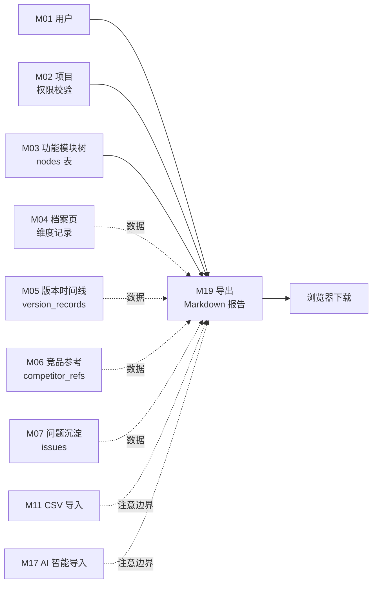

# M19 导入/导出 - 详细设计

> **模块边界关键声明**：
> - **M19 = 导出**：Markdown 分析报告下载（US-C1.6）
> - **M11 = CSV 批量导入**（US-A1.5）——不在 M19
> - **M17 = AI zip 智能导入**（US-B1.8）——不在 M19
>
> M19 本期只实现"导出 Markdown 报告"，无导入逻辑。

**协作约定**：
- ✅ 已定稿节：直接采用（4 维机械推导已确定）
- ⚠️ **待 CY 裁决**：给候选 + 我的倾向 + 你裁决
- 🔗 关联到 A/B 档规约的均给链接

---

## 0. Frontmatter 快速索引

| 字段 | 值 |
|------|-----|
| 模块 | M19 导入/导出 |
| PRD 关联 | F19（v0.3 AI 增强） |
| 用户故事 | US-C1.6（查看者导出模块分析报告 Markdown） |
| 复杂度分层 | 🟢 低复杂度（Tenant + 只读导出） |
| 4 维 | Tenant ✅ / 事务 ❌（只读）/ 异步 ❌（同步报告导出）/ 并发 ❌ |
| 前端形态 | 文件下载（按钮触发，浏览器 download） |
| 模板版本 | C 档 v1（基于 M04 pilot 模板） |

---

## 1. 职责边界（in scope / out of scope）

### In scope（M19 负责）

> ⚠️ **AI 推断，CY 复审必改**——以下基于 US-C1.6 + F19 推断，报告内容细节待 CY 确认。

- **Markdown 报告导出**：选择一个或多个功能项 node，生成 Markdown 格式分析报告并下载（US-C1.6）
- **报告内容聚合**：将目标 node 的维度记录 / 版本时间线 / 竞品参考 / 问题沉淀等信息汇总为 Markdown 文档
- **多 node 批量导出**：选择多个 node 导出为单一 Markdown 文件（含目录）

### Out of scope（其他模块负责）

| 不做的事 | 归属模块 |
|---------|---------|
| CSV 批量导入功能项 | M11（US-A1.5） |
| AI zip 智能导入 | M17（US-B1.8） |
| 异步导出任务 / 大文件后台生成 | 本期不实现（见节 1 灰区） |
| 导出格式：PDF / Excel / JSON | 本期不实现（见节 1 灰区） |
| 导出历史记录管理 | 本期不实现 |
| 维度/版本/竞品内容的 CRUD | M04 / M05 / M06 |

### 边界灰区（显式说明）

> ⚠️ **AI 推断，CY 复审必改**——以下灰区是业务未确认点。

#### 灰区 1：导出范围粒度

| 候选 | 含义 | 我的倾向 |
|------|------|---------|
| **A: 单 node 导出（推荐）** | 每次导出一个功能项的完整档案 | ⭐ 最简；US-C1.6 说"某几个模块"，多选可多次 |
| **B: 多 node 批量导出** | 勾选多个 node，合并为一个 Markdown | 实现稍复杂，但 US-C1.6 明确说"某几个"，需要 |
| **C: 整个项目导出** | 一键导出项目下所有 node | 文件可能极大，本期不做 |

**我倾向 B（单次多选）**：US-C1.6 原文是"某几个模块"，暗示多选；单次 HTTP 同步响应（节 12 异步 N/A），文件大小控制在合理范围（节 7 限制 node 数量）。

#### 灰区 2：报告内容范围

> ⚠️ **AI 推断，CY 复审必改**——报告包含哪些维度信息？

| 候选 | 内容 | 我的倾向 |
|------|------|---------|
| **A: 仅维度记录（推荐）** | 每个 node 的所有已填维度卡片内容 | ⭐ 核心内容 |
| **B: 维度 + 版本时间线** | 含版本演进历史 | 可能使报告过长，视 CY 需要 |
| **C: 维度 + 版本 + 竞品 + 问题** | 完整档案页所有信息 | 最完整，文件大；但 US-C1.6 说"分析报告"，可能指这个 |

**我倾向 C**：US-C1.6 说"分析报告"，应包含完整档案内容；文件大小通过 node 数量限制控制（见节 7 入参限制）。

#### 灰区 3：同步 vs 异步导出

**本设计明确选择同步**（与 05-catalog 异步 ❌ 一致）：
- 报告生成是只读聚合，不涉及 AI 计算
- 控制 node 数量上限（⚠️ 待裁决），响应时间可控
- 异步导出是 M17 的职责，M19 保持同步简单路径

---

## 2. 依赖模块图（M? → M?）



**前置依赖（必须先实现）**：M01 → M02 → M03 → M04

**依赖契约（M19 假设上游提供）**：
- M01：`current_user` 可拿到 `user_id`
- M02：`check_project_access(project_id, user_id)` 返回 role
- M03：`nodes(node_id)` 返回节点（含 project_id）
- M04：`dimension_records(node_id, project_id)` 返回所有维度记录
- M05：`version_records(node_id)` 返回版本时间线
- M06：`competitor_refs(node_id)` 返回竞品参考
- M07：`issues(node_id)` 返回问题沉淀

**M19 是纯只读聚合**：不写任何上游表；所有数据均为读取。

---

## 3. 数据模型（SQLAlchemy + Alembic 要点）

### M19 无主表

M19 是**只读聚合导出**，不需要新建主数据表。仅读取上游模块的数据。

**复用模型列表（SQLAlchemy 唯一真相源，无新增 class）**：

```python
# M19 不新建 SQLAlchemy model，复用以下上游模型（只读）
# 引用路径示例（export_service.py 中）：
from api.models.node import Node                          # M03
from api.models.dimension_record import DimensionRecord   # M04
from api.models.dimension_type import DimensionType       # M02（只读）
from api.models.version_record import VersionRecord       # M05
from api.models.competitor import Competitor, CompetitorRef  # M06
from api.models.issue import Issue                         # M07

# 所有查询均通过上游各模块 DAO 发起（候选 A），不直接写 SQL
# 示例（复用 DimensionDAO）：
# dimension_records = dimension_dao.list_by_node(db, node_id=node_id, project_id=project_id)
```

> ⚠️ **AI 推断，CY 复审必改**——以下可选表仅在需要"导出历史记录"功能时才加。

### ⚠️ 待 CY 裁决：是否记录导出历史

| 候选 | 优 | 劣 |
|------|----|----|
| **A: 不记录（推荐）** | 无需新建表；M19 极简；导出是一次性下载操作 | 无法审计"谁在什么时候导出了什么" |
| **B: 记录导出日志（export_logs 表）** | 审计可追溯；可查"最近导出记录" | 多一张表；本期 PRD 无此需求 |

**我倾向 A**：本期不记录导出历史；activity_log 记录导出事件已满足基本审计（见节 10）。

### 依赖表（只读）

| 表 | 归属模块 | M19 操作 |
|----|---------|---------|
| `nodes` | M03 主 | 只读（校验 + 拿 name/path） |
| `dimension_records` | M04 主 | 只读（拿内容） |
| `dimension_types` | M02 主 | 只读（拿 key/name 用于 Markdown 章节标题） |
| `version_records` | M05 主 | 只读（版本历史） |
| `competitor_refs` | M06 主 | 只读（竞品参考） |
| `issues` | M07 主 | 只读（问题沉淀） |
| `activity_logs` | 横切 | W（每次导出写一条 export 事件） |

---

## 4. 状态机（无状态 / 有状态显式说明）

**显式声明（按原则 4）**：**M19 无状态实体**

M19 是无状态的只读导出操作，不维护任何有状态实体，无状态机。

---

## 5. 多人架构 4 维必答

按原则 5 + 约束清单逐项答。

| 维度 | 答案 | 实现细节 |
|------|------|---------|
| **Tenant 隔离** | ✅ project_id | 导出前校验 `node.project_id == request.project_id`；DAO 查询带 `project_id` 过滤；Service 层 `check_project_access` |
| **多表事务** | ❌ N/A | M19 全只读，不涉及写操作，无事务需求 |
| **异步处理** | ❌ N/A | 同步生成 Markdown 文本并在 HTTP 响应中直接返回（Content-Disposition: attachment）；异步导出是 M17 职责 |
| **并发控制** | ❌ N/A | 只读操作无并发编辑冲突；无乐观锁需求 |

### 约束清单逐项检查（呼应 06-design-principles 的 5 项清单）

| 清单项 | M19 是否触发 | 实现 |
|-------|-------------|------|
| 1. activity_log | ✅ 触发（导出是有意义的操作） | 见节 10 |
| 2. 乐观锁 version | ❌ 不触发（只读） | N/A |
| 3. Queue payload tenant | ❌ 不触发（无 Queue） | N/A |
| 4. idempotency_key | ❌ 不触发（见节 11） | N/A |
| 5. DAO tenant 过滤 | ✅ 触发 | 所有 DAO 查询带 project_id 过滤（见节 9） |

---

## 6. 分层职责表（呼应 04-layer-architecture）

| 层 | M19 涉及文件 | 该层职责 |
|----|------------|---------|
| **Page** | `web/src/app/projects/[pid]/nodes/[nid]/page.tsx`（复用档案页）| 档案页右上角"导出报告"按钮触发下载 |
| **Component** | `web/src/components/business/export-button.tsx`<br>`web/src/components/business/node-selector.tsx` | 导出按钮（单 node）/ 多 node 选择器 |
| **Server Action** | `web/src/actions/export.ts` | session 校验 / zod 入参校验 / fetch FastAPI / 处理 blob 下载 |
| **Router** | `api/routers/export_router.py` | 路由定义 / `Depends(check_project_access)` / Pydantic schema 入参 / 返回 `StreamingResponse` |
| **Service** | `api/services/export_service.py` | tenant 校验 / 聚合多来源数据 / Markdown 文本生成逻辑 |
| **DAO** | `api/dao/export_dao.py`（或复用各模块 DAO） | 只读查询各上游表（含 tenant 过滤） |
| **Model** | 复用 M03/M04/M05/M06/M07 模型 | 不新建 Model |
| **Schema** | `api/schemas/export_schema.py` | Pydantic 请求 schema |

**禁止**：
- ❌ Service 直接拼 SQL（必须调 DAO）
- ❌ M19 写任何业务表（activity_log 除外）

> ⚠️ **AI 推断，CY 复审必改**——`export_dao.py` 是独立 DAO 还是复用各模块 DAO？

### ⚠️ 待 CY 裁决：DAO 复用策略

| 候选 | 实现 | 我的倾向 |
|------|------|---------|
| **A: 复用各模块 DAO（推荐）** | `export_service` 依赖注入 `DimensionDAO / VersionDAO / CompetitorDAO / IssueDAO`，各自带 tenant 过滤 | ⭐ 不重复写查询；分层清晰 |
| **B: 独立 export_dao** | 新建 `export_dao.py` 统一写跨表只读查询 | 统一读路径但造成代码重复 |

**我倾向 A**：复用各模块 DAO，避免跨模块 SQL 重复，Service 层聚合即可。

---

## 7. API 契约（Pydantic + OpenAPI 路径表）

> ⚠️ **AI 推断，CY 复审必改**——路径和字段待 CY 确认。

### Endpoints

| 方法 | 路径 | 用途 | Pydantic 入参 | 出参 |
|------|------|------|--------------|------|
| POST | `/api/projects/{project_id}/export` | 导出选定 node 的 Markdown 报告 | `ExportRequest` | `StreamingResponse (text/markdown)` |

> 单接口设计理由：导出是一次性操作，GET 不适合（body 参数），POST 语义更准确。

### Pydantic schema 草案

```python
# api/schemas/export_schema.py

class ExportRequest(BaseModel):
    node_ids: list[UUID] = Field(..., min_length=1, max_length=20)
    # ⚠️ 待 CY 裁决：max_length 上限（20 是 AI 推断）
    include_sections: ExportSections = Field(default_factory=ExportSections)

class ExportSections(BaseModel):
    """控制报告包含哪些章节"""
    dimensions: bool = True       # 维度记录（必含）
    version_timeline: bool = True # 版本时间线
    competitors: bool = True      # 竞品参考
    issues: bool = True           # 问题沉淀

# 响应：StreamingResponse，Content-Type: text/markdown
# Content-Disposition: attachment; filename="report-{project_name}-{timestamp}.md"
```

### Markdown 报告结构（草案）

> ⚠️ **AI 推断，CY 复审必改**——报告内容结构待 CY 确认。

```markdown
# 分析报告 — {project_name}
> 生成时间：{datetime}  导出者：{user_name}

---

## {node_name}

> 路径：{node_path}

### 维度信息

#### {dimension_type_name}
{dimension_content}

...（所有已填维度）

### 版本时间线
| 版本号 | 变更类型 | 描述 | 日期 |
|--------|---------|------|------|
| {version} | {type} | {desc} | {date} |

### 竞品参考
| 竞品名称 | 版本 | 覆盖情况 | 优劣势 |
|---------|------|---------|-------|
...

### 问题沉淀
| 类型 | 标题 | 状态 |
|------|------|------|
...

---

## {next_node_name}
...
```

### ⚠️ 待 CY 裁决：node_ids 最大数量上限

| 候选 | 上限 | 理由 | 我的倾向 |
|------|------|------|---------|
| **A: 20 个** | 20 | 同步响应下不超时；单文件不超 1MB | ⭐ |
| **B: 10 个** | 10 | 更保守 | 过于保守 |
| **C: 无上限** | — | 最灵活 | 大项目可能超时 |

---

## 8. 权限三层防御点（呼应 04-layer-architecture Q4）

| 层 | 检查 | 实现 |
|----|------|------|
| **Server Action** | session 是否有效 | `getServerSession()`；无则 401 |
| **Router** | 用户对 project 是否有 ≥viewer 权限 | `Depends(check_project_access(project_id, role="viewer"))`（查看者即可导出） |
| **Service** | 每个 node_id 是否真的属于该 project | `_check_nodes_belong_to_project(node_ids, project_id)`；有任一不符合抛 `NotFoundError` |

**只读操作**——权限检查通过即可导出，无需 editor 角色。

**异步路径**：M19 无异步，三层即足够。

---

## 9. DAO tenant 过滤策略（呼应原则 5 清单 5）

### 主查询模式

```python
# api/dao/export_dao.py（或复用各模块 DAO）

# 所有读取查询都带 project_id 过滤
# 示例：读取 dimension_records

def get_dimensions_for_export(
    self, db: Session, node_ids: list[UUID], project_id: UUID
) -> dict[UUID, list[DimensionRecord]]:
    records = (
        db.query(DimensionRecord)
        .filter(
            DimensionRecord.node_id.in_(node_ids),
            DimensionRecord.project_id == project_id,  # ← tenant 过滤
        )
        .all()
    )
    # 按 node_id 分组返回
    result = {}
    for r in records:
        result.setdefault(r.node_id, []).append(r)
    return result
```

### 豁免清单

无——M19 所有查询都在 tenant 边界内（通过 project_id 过滤）。

---

## 10. activity_log 事件清单（呼应清单 1）

> 导出是有意义的用户行为，记录 activity_log 用于审计。

| action_type | target_type | target_id | summary | metadata |
|-------------|-------------|-----------|---------|----------|
| `export` | `project` | `<project_id>` | 导出 Markdown 报告（{node_count} 个模块） | `{node_ids: [...], node_count, sections: {...}, file_size_bytes}` |

**实现位置**：Service 层导出完成后调 `self.activity.log(...)`（非事务——导出无写操作，activity_log 写失败不影响导出）。

---

## 11. idempotency_key 适用操作清单（呼应清单 4）

**显式声明（按原则 5 清单 4 要求）**：**M19 无 idempotency_key 操作**。

理由：
- 导出是只读操作，重复请求只是重复生成相同文件，天然幂等
- 无写操作，无需防重复提交

---

## 12. Queue payload schema（异步模块；同步 N/A）

**N/A**——M19 无异步处理，无 Queue 任务。

显式声明（按原则 5 清单 3 要求）：**M19 不投递 Queue 任务**。

> ⚠️ **AI 推断，CY 复审必改**——若 CY 决定大文件异步生成（灰区 1 候选 C 整个项目导出），需补充 arq Queue 设计。但该功能不在本期范围。

---

## 13. ErrorCode 新增清单（呼应规约 7）

### 新增 ErrorCode（注册到 `api/errors/codes.py`）

```python
class ErrorCode(str, Enum):
    # ... 已有

    # M19 导出
    EXPORT_NODE_LIMIT_EXCEEDED = "EXPORT_NODE_LIMIT_EXCEEDED"  # node_ids 数量超上限
    EXPORT_NODE_NOT_IN_PROJECT = "EXPORT_NODE_NOT_IN_PROJECT"  # node 不属于该 project
    EXPORT_EMPTY_CONTENT = "EXPORT_EMPTY_CONTENT"              # 所有 node 均无维度内容
```

### 新增 AppError 子类（`api/errors/exceptions.py`）

```python
class ExportNodeLimitExceededError(AppError):
    code = ErrorCode.EXPORT_NODE_LIMIT_EXCEEDED
    http_status = 422
    message = "Too many nodes selected for export (max 20)"

class ExportNodeNotInProjectError(NotFoundError):
    code = ErrorCode.EXPORT_NODE_NOT_IN_PROJECT
    message = "One or more nodes do not belong to this project"

class ExportEmptyContentError(AppError):
    code = ErrorCode.EXPORT_EMPTY_CONTENT
    http_status = 422
    message = "No content found for the selected nodes"
```

### 复用已有

- `PERMISSION_DENIED` / `UNAUTHENTICATED`——权限校验失败
- `NOT_FOUND`——project_id 不存在

---

## 14. 测试场景

详见独立文件：[`tests.md`](./tests.md)

主文档只列大纲：
- **golden path**：单 node 导出 / 多 node 导出 / 含全部章节导出 / 部分章节导出
- **边界**：node_ids 超上限 / 空维度 node / 只有部分 node 有内容
- **并发**：M19 只读，测并发导出无死锁
- **Tenant**：跨项目越权导出 / DAO 过滤覆盖测试
- **权限**：未登录 / viewer 可导出 / 不在项目内的用户尝试导出
- **错误处理**：node_id 不存在 / 超限 / 无内容

---

## 15. 完成度判定 checklist

定稿前必须全部勾过：

- [ ] 节 1：职责边界 in/out scope 完整；M11 / M17 / M19 三边界清晰说明
- [ ] 节 2：依赖图覆盖所有上下游数据源
- [ ] 节 3：确认无主表；⚠️ 是否记录导出历史决策已定
- [ ] 节 4：状态机无状态显式声明
- [ ] 节 5：4 维必答 + 5 项清单逐项标注
- [ ] 节 6：分层职责表完整；⚠️ DAO 复用策略决策已定
- [ ] 节 7：API endpoint + Pydantic schema + Markdown 结构；⚠️ node 上限决策已定；⚠️ 报告内容范围决策已定
- [ ] 节 8：权限三层防御（viewer 即可导出）
- [ ] 节 9：DAO tenant 过滤 + 豁免清单（无）
- [ ] 节 10：activity_log export 事件
- [ ] 节 11：idempotency N/A 显式声明
- [ ] 节 12：Queue N/A 显式声明
- [ ] 节 13：ErrorCode 新增清单
- [ ] 节 14：tests.md 写完
- [ ] 节 15：本 checklist 全勾过
- [ ] **🔴 第一轮 reviewer audit（完整性）通过**
- [ ] **🔴 第二轮 reviewer audit（边界场景）通过**
- [ ] **🔴 第三轮 reviewer audit（演进 / 模板可复用性）通过**
- [ ] CY 全文复审通过 → status 转 accepted

> ✅ 三轮 reviewer audit 已完成 2026-04-21（见 audit-report-batch1.md），但发现 8 条问题需 fix + CY 裁决，转 accepted 前还需 CY 复审。

---

## 待 CY 裁决项汇总（一次过）

| # | 节 | 决策点 | 候选 | 我的倾向 |
|---|----|-------|------|---------|
| Q1 | 1 灰区 1 | 导出范围粒度 | A 单 node / B 多选 / C 整项目 | **B 多选（≤20）** |
| Q2 | 1 灰区 2 | 报告内容范围 | A 仅维度 / B 维度+版本 / C 维度+版本+竞品+问题 | **C 完整档案** |
| Q3 | 3 | 是否记录导出历史 | A 不记录 / B export_logs 表 | **A 不记录** |
| Q4 | 6 | DAO 复用策略 | A 复用各模块 DAO / B 独立 export_dao | **A 复用** |
| Q5 | 7 | node_ids 最大数量 | A 20 / B 10 / C 无上限 | **A 20** |

---

## 关联参考

- 上游设计：
  - `design/00-architecture/04-layer-architecture.md`（5 层 / 三层权限）
  - `design/00-architecture/05-module-catalog.md`（4 维标注）
  - `design/00-architecture/06-design-principles.md`（原则 5 + 5 项清单）
  - `design/00-architecture/07-capability-matrix.md`（M19 能力定位）
- 工程规约：
  - `design/01-engineering/01-engineering-spec.md` 规约 1 / 5 / 7 / 11 / 12
- 用户故事来源：
  - `feature-list-and-user-stories.md` US-C1.6（查看者导出模块分析报告）
  - F19（v0.3 导入/导出）
- 模块边界对照：
  - M11 设计（CSV 导入）/ M17 设计（AI zip 导入）
