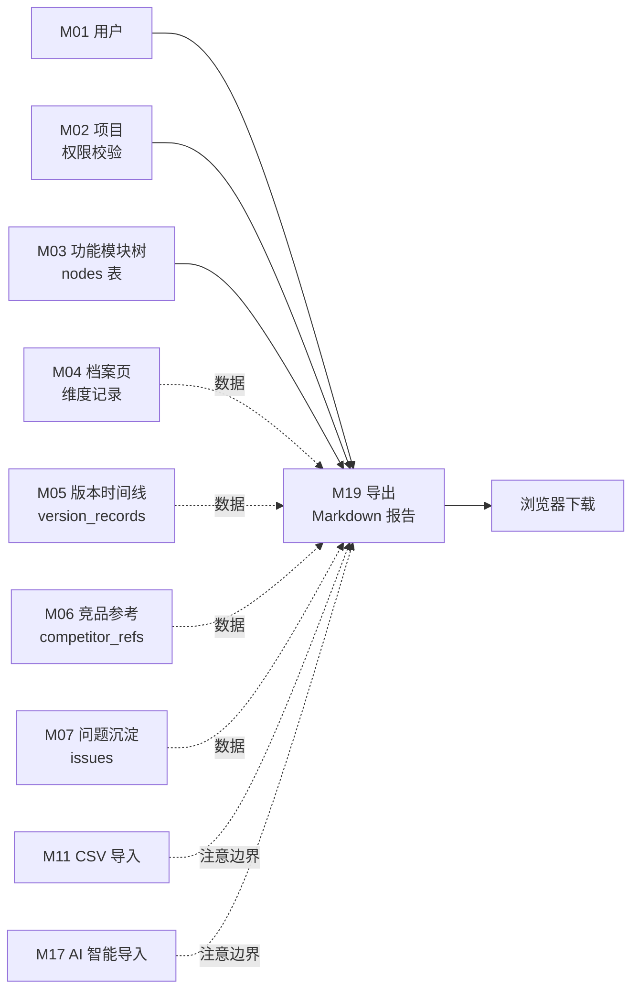

# M19 导入/导出 - 详细设计

> **模块边界关键声明**：
> - **M19 = 导出**：Markdown 分析报告下载（US-C1.6）
> - **M11 = CSV 批量导入**（US-A1.5）——不在 M19
> - **M17 = AI zip 智能导入**（US-B1.8）——不在 M19
>
> M19 本期只实现"导出 Markdown 报告"，无导入逻辑。

**协作约定**：
- ✅ 已定稿节：直接采用（4 维机械推导已确定）
- 🔗 关联到 A/B 档规约的均给链接

---

## 0. Frontmatter 快速索引

| 字段 | 值 |
|------|-----|
| 模块 | M19 导入/导出 |
| PRD 关联 | F19（导入/导出，US-C1.6 多节点导出报告） |
| 用户故事 | US-C1.6（查看者导出模块分析报告 Markdown） |
| 复杂度分层 | 🟢 低复杂度（Tenant + 只读导出） |
| 4 维 | Tenant ✅ / 事务 ❌（只读）/ 异步 ❌（同步报告导出）/ 并发 ❌ |
| 前端形态 | 文件下载（按钮触发，浏览器 download） |
| 模板版本 | C 档 v1（基于 M04 pilot 模板） |

---

## 1. 职责边界（in scope / out of scope）

### In scope（M19 负责）

**决策：AB 共存**（CY 2026-04-21 ack）。两入口共享 ExportService，单 node 走 B（一键），多 node 走 A（上限 20）。

- **入口 A（多 node 选择）**：用户在模块树 / 全景图多选节点后点击"导出报告"——生成包含所有选中 node 的 Markdown 报告（US-C1.6 "某几个模块"）；场景：评审 / 汇报
- **入口 B（单 node）**：用户在 node 档案页右上角点击"导出"——一键导出当前 node 报告；场景：单点交付 / 写在 PR 里
- **报告内容聚合**：将目标 node 的维度记录 / 版本时间线 / 竞品参考 / 问题沉淀等信息汇总为 Markdown 文档（完整档案，US-C1.6 "分析报告"）
- **node 数量上限**：入口 A 最多 20 个 node（超出提示用 zip 异步导出 = M17 链路，本期不实现）

### Out of scope（其他模块负责）

| 不做的事 | 归属模块 |
|---------|---------|
| CSV 批量导入功能项 | M11（US-A1.5） |
| AI zip 智能导入 | M17（US-B1.8） |
| 异步导出任务 / 大文件后台生成 | 本期不实现（本期同步） |
| 导出格式：PDF / Excel / JSON | 本期不实现 |
| 导出历史记录管理 | 本期不实现 |
| 维度/版本/竞品内容的 CRUD | M04 / M05 / M06 |

### 边界灰区（显式说明）

#### 灰区 3：同步 vs 异步导出

**决策：本期同步**（与 05-catalog 异步 ❌ 一致）：
- 报告生成是只读聚合，不涉及 AI 计算
- 控制 node 数量上限 20 个，响应时间可控
- 异步导出是 M17 的职责，M19 保持同步简单路径

---

## 2. 依赖模块图（M? → M?）



**前置依赖（必须先实现）**：M01 → M02 → M03 → M04

**依赖契约（M19 假设上游提供）**：
- M01：`current_user` 可拿到 `user_id`
- M02：`check_project_access(project_id, user_id)` 返回 role
- M03：`nodes(node_id)` 返回节点（含 project_id）
- M04：`dimension_records(node_id, project_id)` 返回所有维度记录
- M05：`version_records(node_id)` 返回版本时间线
- M06：`competitor_refs(node_id)` 返回竞品参考
- M07：`issues(node_id)` 返回问题沉淀

**M19 是纯只读聚合**：不写任何上游表；所有数据均为读取。

---

## 3. 数据模型（SQLAlchemy + Alembic 要点）

### M19 无主表（决策：不记录导出历史，CY 2026-04-21 ack）

M19 是**只读聚合导出**，不需要新建主数据表。仅读取上游模块的数据。activity_log 记录导出事件已满足基本审计。

**复用模型列表（SQLAlchemy 唯一真相源，无新增 class）**：

```python
# M19 不新建 SQLAlchemy model，复用以下上游模型（只读）
# export_service.py 中通过各模块 DAO 发起查询（候选 A 复用策略）：
from api.models.node import Node                          # M03
from api.models.dimension_record import DimensionRecord   # M04
from api.models.dimension_type import DimensionType       # M02（只读）
from api.models.version_record import VersionRecord       # M05
from api.models.competitor import Competitor, CompetitorRef  # M06
from api.models.issue import Issue                         # M07

# 所有查询均通过上游各模块 DAO 发起（决策：复用各模块 DAO，CY ack）
# 示例（复用 DimensionDAO）：
# dimension_records = dimension_dao.list_by_node(db, node_id=node_id, project_id=project_id)
```

**DAO 复用合规说明**：`export_service` 依赖注入各模块 DAO；import 路径遵循 importlinter 规则（export_service → dimension_dao 是 Service→DAO 跨模块只读调用，符合 06-design-principles 原则 2 分层规约，只读复用不构成跨层调用违规）。

### 依赖表（只读）

| 表 | 归属模块 | M19 操作 |
|----|---------|---------|
| `nodes` | M03 主 | 只读（校验 + 拿 name/path） |
| `dimension_records` | M04 主 | 只读（拿内容） |
| `dimension_types` | M02 主 | 只读（拿 key/name 用于 Markdown 章节标题） |
| `version_records` | M05 主 | 只读（版本历史） |
| `competitor_refs` | M06 主 | 只读（竞品参考） |
| `issues` | M07 主 | 只读（问题沉淀） |
| `activity_logs` | 横切 | W（每次导出写一条 export 事件） |

---

## 4. 状态机（无状态 / 有状态显式说明）

**显式声明（按原则 4）**：**M19 无状态实体**

M19 是无状态的只读导出操作，不维护任何有状态实体，无状态机。

---

## 5. 多人架构 4 维必答

按原则 5 + 约束清单逐项答。

| 维度 | 答案 | 实现细节 |
|------|------|---------|
| **Tenant 隔离** | ✅ project_id | 导出前校验 `node.project_id == request.project_id`；DAO 查询带 `project_id` 过滤；Service 层 `check_project_access` |
| **多表事务** | ❌ N/A | M19 全只读，不涉及写操作，无事务需求 |
| **异步处理** | ❌ N/A | 同步生成 Markdown 文本并在 HTTP 响应中直接返回（Content-Disposition: attachment）；异步导出是 M17 职责 |
| **并发控制** | ❌ N/A | 只读操作无并发编辑冲突；无乐观锁需求 |

### 约束清单逐项检查（呼应 06-design-principles 的 5 项清单）

| 清单项 | M19 是否触发 | 实现 |
|-------|-------------|------|
| 1. activity_log | ✅ 触发（导出是有意义的操作） | 见节 10 |
| 2. 乐观锁 version | ❌ 不触发（只读） | N/A |
| 3. Queue payload tenant | ❌ 不触发（无 Queue） | N/A |
| 4. idempotency_key | ❌ 不触发（见节 11） | N/A |
| 5. DAO tenant 过滤 | ✅ 触发 | 所有 DAO 查询带 project_id 过滤（复用各模块 DAO，各自已有 tenant 过滤） |

---

## 6. 分层职责表（呼应 04-layer-architecture）

**决策：DAO 复用各模块 DAO**（CY 2026-04-21 ack）。`export_service` 依赖注入 `DimensionDAO / VersionDAO / CompetitorDAO / IssueDAO`，各自带 tenant 过滤，不重复写查询。

| 层 | M19 涉及文件 | 该层职责 |
|----|------------|---------|
| **Page** | `web/src/app/projects/[pid]/nodes/[nid]/page.tsx`（B 入口：档案页右上角"导出"）<br>`web/src/app/projects/[pid]/page.tsx`（A 入口：多选后"导出报告"）| B 入口档案页导出按钮；A 入口树 / 全景图多选导出 |
| **Component** | `web/src/components/business/export-button.tsx`<br>`web/src/components/business/node-selector.tsx` | 导出按钮（B 入口单 node）/ 多 node 选择器（A 入口） |
| **Server Action** | `web/src/actions/export.ts` | session 校验 / zod 入参校验 / fetch FastAPI / 处理 blob 下载 |
| **Router** | `api/routers/export_router.py` | 两个路由定义 / `Depends(check_project_access)` / Pydantic schema 入参 / 返回 `Response(text/markdown)` |
| **Service** | `api/services/export_service.py` | tenant 校验 / 聚合多来源数据 / Markdown 文本生成逻辑；`generate_markdown(project_id, node_ids, include) -> bytes` 两入口共享 |
| **DAO** | 复用 `api/dao/dimension_dao.py` / `version_dao.py` / `competitor_dao.py` / `issue_dao.py` | 只读查询各上游表（含 tenant 过滤），无新建 export_dao.py |
| **Model** | 复用 M03/M04/M05/M06/M07 模型 | 不新建 Model |
| **Schema** | `api/schemas/export_schema.py` | Pydantic 请求 schema |

**禁止**：
- ❌ Service 直接拼 SQL（必须调 DAO）
- ❌ M19 写任何业务表（activity_log 除外）

**dogfooding sprint 2026-05-13 实证（design vs UI 漂移）**：
- design §6 声称 Component 层 `export-button.tsx` / `node-selector.tsx` 独立组件，但 frontend 实装为 workspace.tsx 内联按钮（无独立组件文件）
  - file 视图："导出 Markdown" 按钮（workspace.tsx L999-1004，对应入口 B handleExportNode）
  - folder 视图："导出模块" 按钮（workspace.tsx L1224-1233，对应入口 A handleExportModule）
- A 入口"多 node 多选导出报告"（node-selector.tsx）在 workspace.tsx 未实装；folder 视图实装为单 module 导出
- design §7 入口 B 路径声称 `POST /nodes/{nid}/export`，实际 workspace.tsx handleExportNode 调 `exportNodes(projectId, [nodeData.node.id])`（入口 A endpoint `POST /exports` 单元素数组）—— 两入口 DOM 层面走同一 backend 路径
- backend export_router AB 共存 endpoints 均已实装并通过 P3 executor 验证（multipart md + Content-Disposition + tenant 过滤全 PASS）
- punt at Phase 2.x M19-frontend 实装 sprint（补 export-button.tsx + node-selector.tsx 独立组件 + folder 视图多选 UI）
- 详 `_handoff/dogfooding/04-bug-fixes/punt-frontend-gap-phase2x/PUNT-REPORT.md`

---

## 7. API 契约（Pydantic + OpenAPI 路径表）

**决策：AB 共存**（CY 2026-04-21 ack）。两个 endpoint 共存，共享 `ExportService.generate_markdown`。

### Endpoints

| 方法 | 路径 | 用途 | Pydantic 入参 | 出参 |
|------|------|------|--------------|------|
| POST | `/api/projects/{project_id}/exports` | **入口 A：多 node 选择导出** | `MultiNodeExportRequest` | `200 OK + Content-Disposition: attachment; filename="prism-export-{timestamp}.md"` + `text/markdown` body |
| POST | `/api/projects/{project_id}/nodes/{node_id}/export` | **入口 B：单 node 导出** | `SingleNodeExportRequest` | 同上 |

#### 入口 A 说明
- 位置：模块树 / 全景图右键 / 多选后"导出报告"按钮
- 上限：20 个 node（超过提示用 zip 异步导出 = M17 链路，本期不实现）
- 场景：评审 / 汇报（US-C1.6 "某几个模块"）

#### 入口 B 说明
- 位置：node 档案页右上角"导出"按钮
- 等价于入口 A 传 `node_ids=[node_id]`（service 内部复用同一逻辑）
- 场景：单点交付 / 写在 PR 里

### Pydantic schema 草案

```python
# api/schemas/export_schema.py

class ExportIncludeOptions(BaseModel):
    dimensions: bool = True       # 含 M04 维度
    versions: bool = True         # 含 M05 版本时间线
    competitors: bool = False     # 含 M06 竞品
    issues: bool = True           # 含 M07 问题

class MultiNodeExportRequest(BaseModel):
    node_ids: list[UUID] = Field(..., min_length=1, max_length=20)
    include: ExportIncludeOptions = Field(default_factory=ExportIncludeOptions)

class SingleNodeExportRequest(BaseModel):
    include: ExportIncludeOptions = Field(default_factory=ExportIncludeOptions)

# 响应：200 OK
# Content-Type: text/markdown
# Content-Disposition: attachment; filename="prism-export-{timestamp}.md"
```

**ExportService 核心接口**：

```python
# api/services/export_service.py（接口草案）
class ExportService:
    def generate_markdown(
        self,
        db: Session,
        project_id: UUID,
        node_ids: list[UUID],
        include: ExportIncludeOptions,
        user_id: UUID,
    ) -> bytes:
        """
        两入口（A/B）共享此方法。
        入口 B：传入 node_ids=[node_id]，内部逻辑完全复用。
        """
        ...
```

### Markdown 报告结构（草案）

```markdown
# 分析报告 — {project_name}
> 生成时间：{datetime}  导出者：{user_name}

---

## {node_name}

> 路径：{node_path}

### 维度信息

#### {dimension_type_name}
{dimension_content}

...（所有已填维度）

### 版本时间线
| 版本号 | 变更类型 | 描述 | 日期 |
|--------|---------|------|------|
| {version} | {type} | {desc} | {date} |

### 竞品参考
| 竞品名称 | 版本 | 覆盖情况 | 优劣势 |
|---------|------|---------|-------|
...

### 问题沉淀
| 类型 | 标题 | 状态 |
|------|------|------|
...

---

## {next_node_name}
...
```

---

## 8. 权限三层防御点（呼应 04-layer-architecture Q4）

| 层 | 检查 | 实现 |
|----|------|------|
| **Server Action** | session 是否有效 | `getServerSession()`；无则 401 |
| **Router** | 用户对 project 是否有 ≥viewer 权限 | `Depends(check_project_access(project_id, role="viewer"))`（查看者即可导出） |
| **Service** | 每个 node_id 是否真的属于该 project | `_check_nodes_belong_to_project(node_ids, project_id)`；有任一不符合抛 `NotFoundError` |

**只读操作**——权限检查通过即可导出，无需 editor 角色。

**异步路径**：M19 无异步，三层即足够。

---

## 9. DAO tenant 过滤策略（呼应原则 5 清单 5）

**决策：复用各模块 DAO**（CY 2026-04-21 ack）。ExportService 依赖注入各模块 DAO，各自已内置 project_id tenant 过滤。

### 主查询模式（复用各模块 DAO）

```python
# api/services/export_service.py（节选）—— 复用各模块 DAO，无独立 export_dao

class ExportService:
    def __init__(
        self,
        dimension_dao: DimensionDAO,
        version_dao: VersionDAO,
        competitor_dao: CompetitorDAO,
        issue_dao: IssueDAO,
        node_dao: NodeDAO,
    ):
        ...

    def _fetch_node_data(self, db: Session, node_id: UUID, project_id: UUID, include: ExportIncludeOptions):
        data = {}
        if include.dimensions:
            data["dimensions"] = self.dimension_dao.list_by_node(db, node_id=node_id, project_id=project_id)
            # ↑ DimensionDAO 内已有 WHERE project_id = ? tenant 过滤
        if include.versions:
            data["versions"] = self.version_dao.list_by_node(db, node_id=node_id, project_id=project_id)
        if include.competitors:
            data["competitors"] = self.competitor_dao.list_refs_by_node(db, node_id=node_id, project_id=project_id)
        if include.issues:
            data["issues"] = self.issue_dao.list_by_project(db, project_id=project_id, node_id=node_id)
        return data
```

### 豁免清单

无——M19 所有查询都在 tenant 边界内（通过复用各模块 DAO 的 project_id 过滤）。

---

## 10. activity_log 事件清单（呼应清单 1）

### 决策：操作粒度 + metadata（CY 2026-04-21 ack 全模块统一）

**理由**：折中方案，metadata 留 hash/size 等扩展点供 M15/M13/M16 后续消费。

| action_type | target_type | target_id | summary | metadata |
|-------------|-------------|-----------|---------|----------|
| `exported` | `node` | `<node_ids[0]>`（多 node 时记录第一个） | 导出 Markdown 报告（{node_count} 个模块） | `{node_ids: [...], node_count, sections: {...}, file_size_bytes}` |
（R1 立修 disambiguation：M16 R14 立规精神过去式 + snake_case；design accepted 2026-04-21 时 R14 未立 / sprint 子片 1 R1 立修对齐 "export" → "exported"）

**实现位置**：Service 层导出完成后调 `self.activity.log(...)`（非事务——导出无写操作，activity_log 写失败不影响导出）。

**target_type 说明**：使用 `node` 而非 `project`，让 M15 数据流转能精确定位导出了哪些 node。

---

## 11. idempotency_key 适用操作清单（呼应清单 4）

### 决策：本模块无 idempotency 需求（CY 2026-04-21 ack 全模块统一）

**理由**：CRUD 走乐观锁/DB 唯一约束已防；删除天然幂等。导出是只读操作，重复请求只是重复生成相同文件，天然幂等；无写操作，无需防重复提交。

**显式声明（按原则 5 清单 4 要求）**：**M19 无 idempotency_key 操作**。

---

## 12. Queue payload schema（异步模块；同步 N/A）

**N/A**——M19 无异步处理，无 Queue 任务。

显式声明（按原则 5 清单 3 要求）：**M19 不投递 Queue 任务**。

> 若 CY 决定大文件异步生成（整个项目导出），需补充 arq Queue 设计。但该功能不在本期范围。

---

## 13. ErrorCode 新增清单（呼应规约 7）

### 新增 ErrorCode（注册到 `api/errors/codes.py`）

```python
class ErrorCode(str, Enum):
    # ... 已有

    # M19 导出
    EXPORT_NODE_LIMIT_EXCEEDED = "export_node_limit_exceeded"  # node_ids 数量超上限
    EXPORT_NODE_NOT_IN_PROJECT = "export_node_not_in_project"  # node 不属于该 project
    EXPORT_EMPTY_CONTENT = "export_empty_content"              # 所有 node 均无内容（422）
```

### 新增 AppError 子类（`api/errors/exceptions.py`）

```python
class ExportNodeLimitExceededError(AppError):
    code = ErrorCode.EXPORT_NODE_LIMIT_EXCEEDED
    http_status = 422
    message = "Too many nodes selected for export (max 20)"

class ExportNodeNotInProjectError(NotFoundError):
    code = ErrorCode.EXPORT_NODE_NOT_IN_PROJECT
    message = "One or more nodes do not belong to this project"

class ExportEmptyContentError(AppError):
    code = ErrorCode.EXPORT_EMPTY_CONTENT
    http_status = 422
    message = "No content found for the selected nodes"
```

### 复用已有

- `PERMISSION_DENIED` / `UNAUTHENTICATED`——权限校验失败
- `NOT_FOUND`——project_id 不存在

---

## 14. 测试场景

详见独立文件：[`tests.md`](./tests.md)

主文档只列大纲：
- **golden path**：单 node 导出（入口 B）/ 多 node 导出（入口 A）/ 含全部章节导出 / 部分章节导出
- **边界**：node_ids 超上限 / 空维度 node / 只有部分 node 有内容
- **并发**：M19 只读，测并发导出无死锁
- **Tenant**：跨项目越权导出 / DAO 过滤覆盖测试
- **权限**：未登录 / viewer 可导出 / 不在项目内的用户尝试导出
- **错误处理**：node_id 不存在 / 超限 / 无内容

---

## 15. 完成度判定 checklist

定稿前必须全部勾过：

- [x] 节 1：职责边界 in/out scope 完整；M11 / M17 / M19 三边界清晰说明；AB 共存（CY ack）
- [x] 节 2：依赖图覆盖所有上下游数据源
- [x] 节 3：确认无主表；不记录导出历史（CY ack）；DAO 复用策略（CY ack）
- [x] 节 4：状态机无状态显式声明
- [x] 节 5：4 维必答 + 5 项清单逐项标注
- [x] 节 6：分层职责表完整；DAO 复用策略决策已定（CY ack）；两入口文件路径明确
- [x] 节 7：两个 API endpoint（入口 A + 入口 B）+ Pydantic schema + Markdown 结构；node 上限 20（CY ack）
- [x] 节 8：权限三层防御（viewer 即可导出）
- [x] 节 9：DAO tenant 过滤 + 豁免清单（无）；复用各模块 DAO 代码示例
- [x] 节 10：activity_log export 事件（target_type=node）
- [x] 节 11：idempotency N/A 显式声明（CY ack）
- [x] 节 12：Queue N/A 显式声明
- [x] 节 13：ErrorCode 新增清单
- [x] 节 14：tests.md 写完
- [x] 节 15：本 checklist 全勾过
- [ ] **🔴 第一轮 reviewer audit（完整性）通过**
- [ ] **🔴 第二轮 reviewer audit（边界场景）通过**
- [ ] **🔴 第三轮 reviewer audit（演进 / 模板可复用性）通过**
- [ ] CY 全文复审通过 → status 转 accepted

> ✅ 三轮 reviewer audit 已完成 2026-04-21（见 audit-report-batch1.md），但发现 8 条问题需 fix + CY 裁决，转 accepted 前还需 CY 复审。

---

## 14.5 Sprint Review 拆分计划（闸门 3.4 L1 总则强制段 / 2026-05-09 启动期立）

> 闸门 3.4 L1 总则要求每业务模块 design 必有「Sprint Review 拆分计划」段，
> 声明本 sprint 拆 N 次 review、每次覆盖哪些子片、合并子片的 SKIP 比例理由。

### 拆分总览（5+ 子片 / R1=3 subagent 并行 + R2=1 合并 Opus / complexity=low）

| 子片 | 范围 | 行数 / 文件数预估 | Review 形态 |
|------|------|---------------|-----------|
| 0 prep | §14.5 + scaffold 简化 4 字段注释 + bypass log #2 配套验收 + cross-sprint punt 池本 sprint 命中检查 | ~80 / ~3 | self-审（启动期范畴） |
| 1 | Alembic ALTER CHECK + ActionType+1（"exported" / R1 过去式立规对齐）4 处同步（model tuple + schema StrEnum + CHECK constraint + Alembic）+ ci-lint R14 验证 + tests | ~150 / ~4 | **R1 = 3 subagent 并行**（spec+quality Opus / reuse Sonnet / quality+efficiency Sonnet）合并审 子片 1+2+3 |
| 2 | DAO 复用接通验证（DimensionDAO/VersionDAO/CompetitorDAO/IssueDAO/NodeDAO ADR-003 规则 1 / 全部上游已存在 / 本子片可能无新代码 / 仅 import + DI 接通） | ~50 / ~1 | 同上（合并 R1） |
| 3 | ExportService（generate_markdown 两入口共享）+ ExportSchema + 3 ErrorCode + 3 AppError 子类 + Markdown 渲染 + activity_log target_type=node 写入 + service unit + schema unit | ~500 / ~5 | 同上（合并 R1） |
| 4 | Router 2 endpoints（POST /api/projects/{pid}/exports + POST /api/projects/{pid}/nodes/{nid}/export）+ e2e（元教训 18 类 actionable 主动复制 + N/A 显式声明）+ Content-Disposition + filename sanitize（M11+M17 范式复用 / 第三 multipart-style 实例不触发 — 非文件上传输入 / 输出 Content-Disposition filename sanitize 必字面验） | ~400 / ~3 | **R2 = 1 合并 Opus subagent**（endpoint 单审） |
| 5 | 关闸（design 回写 + audit/m19-pilot-template-validation.md 元贡献沉淀 + handoff §0 + roadmap M19 + Phase 2.1 90→95% + cross-sprint punt 池接通 + 评估 #20 require_platform_admin 是否触发） | ~150 / ~5 | 主对话总结 |

### SKIP 例外段（L1 总则触发例外条款 a/b/c）

- **a 子片 1（alembic ALTER CHECK + 枚举字面同步）**：simplify 22 条 SKIP ≥ 80%（无 frontend / 无 Server Action / 无契约漂移 / 无 LLM hot path / 仅枚举字面 + 1 行 ALTER），合并到子片 4 e2e 一次跑（提前声明，非临时合并）。
- **b context budget pressure**：M18 sprint bypass log #2 配套验收已最终 ✅（M16 bypass + M17 恢复 + M18 继续 = 2 次累计不复位 / 第 3 次触发闸门 3.4 L1 review）。M19 必继续 R1=3 subagent 并行 + R2=1 合并 Opus 真跑，不再降级。
- **c 临时合并**：禁。如 sprint 中临时合并 → bypass log 第 3 次累计触发对闸门规则本身的 review。

### 范式复用清单（M02-M18 沉淀 / M19 主动复制不等抓）

- **viewer 写所有写端点 403** N/A 显式声明：M19 design §8 字面 viewer 即可导出（POST 但语义只读 + activity_log 副作用不算"业务写"）→ 对应"读权限 403"范式（M15 立 / 但 M19 viewer 通过非 403）/ 主动复制 = 不在项目内 user 403 + 跨 project 404
- **write_event 异常传播测试 e2e 字面验**（M16 立 / M19 export 写 activity_log 路径必测 monkeypatch raise + e2e 字面验）
- **cross-tenant 404 + cross-project node 422**（R1-B P1-1 立修：M06/M08/M12 ValidationError 范式 / cross-project node → 422 EXPORT_NODE_NOT_IN_PROJECT；URL-level cross-tenant → Router check_project_access 404）
- **IntegrityError 区分约束名**（M05 立 / M19 全只读 / N/A 显式声明）
- **R-X1 失败补偿 commit boundary**（M11 立 / M17 helper / M19 同步只读 / N/A 显式声明）
- **文件上传 file.size + sanitize**（M11 立 / M17 第二实例 / M19 输入无 multipart / 输出 Content-Disposition filename sanitize 必字面验：UTF-8 兼容 + 控制字符 strip + 长度截断）
- **SSE 形态特殊不免除契约纪律**（M13 立 / M19 同步路由 / N/A 显式声明）
- **metadata 字段集每条 e2e 字面验**（M14 立 / M19 export 事件 metadata = `{node_ids, node_count, sections, file_size_bytes}` 必逐字段验）
- **endpoint 形态特殊不免除契约纪律**（M14 立 / M19 Markdown 二进制响应特殊 / 主动复制 = Content-Type=text/markdown 字面验 + Content-Disposition filename 字面验）
- **N/A 元教训显式声明范式**（M14 立 / M19 §14.5 + tests.md docstring 双重显式）
- **横切表 owner enum 4 处同步**（M15 立 / M19 ActionType+1 必同步 4 处：model tuple + schema StrEnum + CHECK constraint + Alembic）
- **R14 ci-lint 守护**（M16 立 / M19 service write_event(action_type="exported") 字面 _ACTION_TYPES 枚举 / 不漂移 / R1 过去式立规对齐）
- **§12B 后台 fire-and-forget 子模板**（M16 立 / M19 同步导出无 BackgroundTasks / N/A 显式声明）
- **R-X1 第二实例 compensation_session helper**（M17 立 / M19 不触发补偿形态 / N/A 显式声明）
- **idempotency 含 project_id**（M17 立 / M19 无幂等需求 / N/A 显式声明）
- **WS endpoint 5-test 矩阵**（M17 立 / M19 无 WS endpoint / N/A 显式声明）
- **EmbeddingProvider 抽象 / pgvector ARRAY 占位三层降级**（M18 立 / M19 不触发 embedding 路径 / N/A 显式声明）
- **占位 metadata _stub:True**（M18 立 / M19 export metadata 全真实数据 / N/A 显式声明）
- **测试反模式 assert True / 永真 in 元组**（M18 立 / M19 全测试有意义断言）

### L3 子选项留空待实证（R-X5 风格）

- "M19 纯只读导出（无 model / 无 DAO 新增）模块的 R1=3 subagent 命中分布" — sprint 实证后回写 audit/m19-pilot-template-validation.md
- "Markdown 渲染逻辑（service 层纯 Python 字符串拼接 + 模板）的 R1-A spec+quality 命中区域是否聚焦在 design §7 Markdown 结构契约一致性" — sprint 实证
- "Content-Disposition filename sanitize 输出端首发是否触发 horizontal 化（M17 立的 filename sanitize 第三实例触发条件）" — sprint 实证；M19 是输出端 sanitize 首发，与 M11+M17 输入端不同根源 → 评估是否合并到 api/utils/upload_helpers.py 还是新建 api/utils/download_helpers.py

---

## CY 决策记录（2026-04-21 批量统一）

| # | 节 | 决策点 | 决定 |
|---|----|-------|------|
| Q1 | 1 / 7 | 导出入口设计 | **AB 共存**：入口 A 多 node（≤20），入口 B 单 node；共享 ExportService |
| Q2 | 1 灰区 2 | 报告内容范围 | **C 完整档案**（维度+版本+竞品+问题，include 选项可控） |
| Q3 | 3 | 是否记录导出历史 | **A 不记录**（activity_log 已满足基本审计） |
| Q4 | 6 / 9 | DAO 复用策略 | **A 复用各模块 DAO**（不重复写查询，分层合规） |
| Q5 | 7 | node_ids 最大数量 | **A 20 个**（同步响应下不超时） |
| Q6 | 11 | idempotency 范围 | **A 无幂等**（统一） |

---

## 关联参考

- 上游设计：
  - `design/00-architecture/04-layer-architecture.md`（5 层 / 三层权限）
  - `design/00-architecture/05-module-catalog.md`（4 维标注）
  - `design/00-architecture/06-design-principles.md`（原则 5 + 5 项清单）
  - `design/00-architecture/07-capability-matrix.md`（M19 能力定位）
- 工程规约：
  - `design/01-engineering/01-engineering-spec.md` 规约 1 / 5 / 7 / 11 / 12
- 用户故事来源：
  - `feature-list-and-user-stories.md` US-C1.6（查看者导出模块分析报告）
- 模块边界对照：
  - M11 设计（CSV 导入）/ M17 设计（AI zip 导入）
