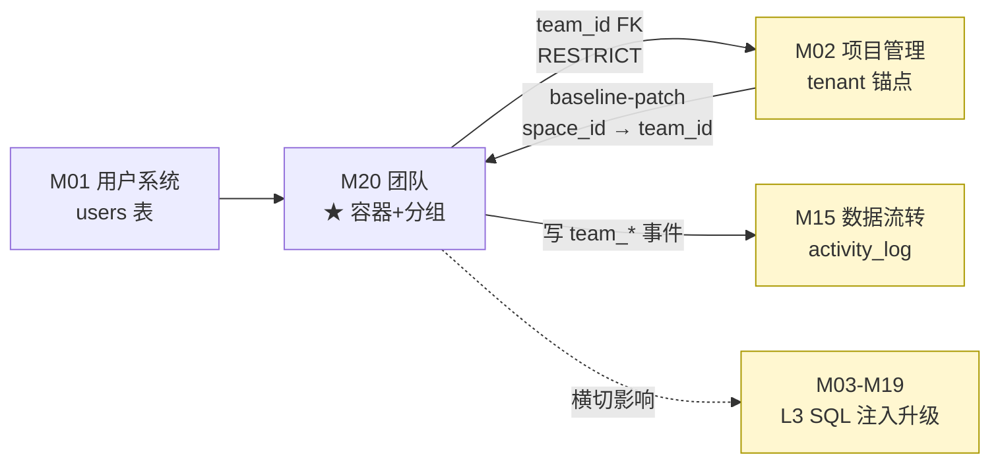
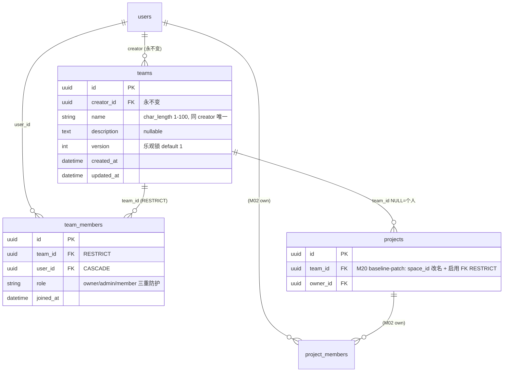
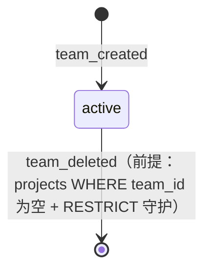
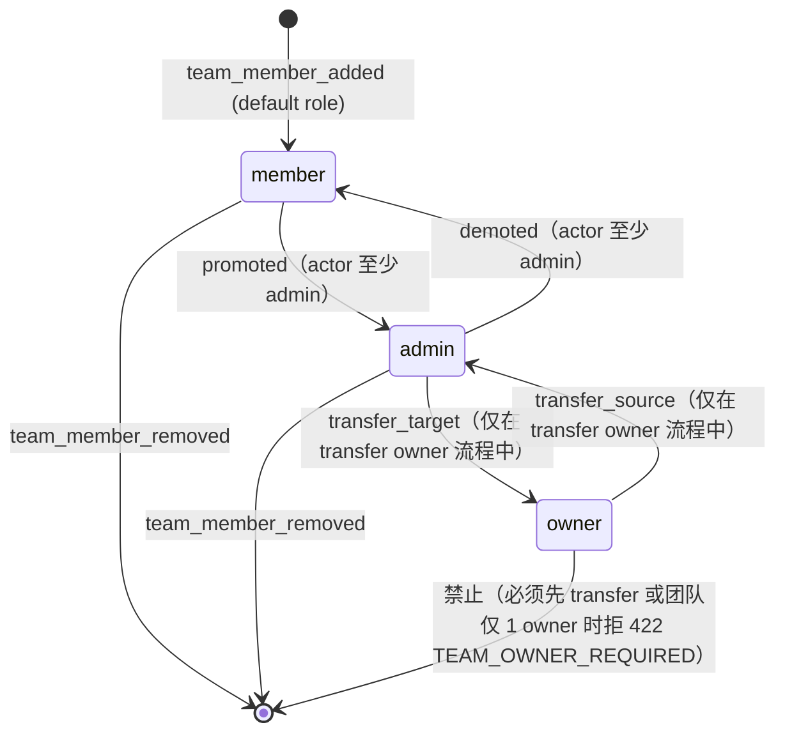

# M20 团队 - 详细设计

> **决策来源**：CY 2026-04-26 brainstorming Q0-Q15 + 子点（Q10.1 / Q13.1）。完整决策对照表见 [`../../adr/ADR-005-team-extension.md`](../../adr/ADR-005-team-extension.md) §Decision。
> **核心定位**：team 是 project 的容器（人的集合 + 分组标签），不升级 tenant 锚点；权限走「team baseline + ProjectMember 提权」嵌套式 max。

---

## 1. 业务说明 + 职责边界

### 业务说明

M20 引入「团队」（team）概念，作为 project 的可选容器。对应 PRD F20（`/root/prism/docs/product/PRD.md §5.5`）：

- **AC1**：创建团队后可将项目归入团队
- **AC2**：现有个人项目可一键迁移到团队
- **AC3**：团队成员可查看项目（复用 F1 权限模型，等价 ProjectMember 三角色）

PRD 设计决策原文：「团队化做最小实现——分组+权限复用 F1。不做评论、通知、协作编辑等重协作功能。核心是『万一有人想看』的预留，不是多人协作平台」。

### In scope（M20 负责）

- **team CRUD**：创建 / 读取 / 更新 name + description / 删除
- **team_members 管理**：邀请成员（直接写入）/ 变更角色（owner/admin/member）/ 移除成员
- **team owner 转让**：原 owner → admin + 新 owner ↑ owner，单事务原子操作
- **project 归属变更**：individual ↔ team（仅支持，不支持 team A → team B 直跳）
- **权限并集解析**：`max(team_role_mapped, project_member_role)` 落 Service 层
- **L3 SQL tenant 注入升级**：M03-M19 DAO 引用 `user_accessible_project_ids_subquery` 公共 helper（baseline-patch 范围）

### Out of scope（M20 不做）

> 完整 15 项 out-of-scope 显式清单（Q15=A 决策）。按场景分组：

**A. 跨 team / 删 team 行为约束**
1. 跨 team 直接迁移（Q7）—— 必须先移回个人再加入新 team
2. 删 team 时级联删 project（Q8）—— 必须前置迁出（拒 422）

**B. 协作功能（PRD「非协作平台」）**
3. 团队邀请邮件 / 通知 —— 直接写入 team_members 表
4. 团队邀请审批流（pending / approved 状态）—— 直接 added
5. 评论 / 协作编辑 / 实时同步
6. team 离开后通知原 owner

**C. team 配置扩展**
7. team 头像 / 主题色 / 自定义品牌 —— 仅 name + description
8. team 公开 / 私密设置 —— 仅靠 team_members 隐式私密
9. team 角色自定义 —— 仅 owner/admin/member 三档锁死（Q2）

**D. 结构扩展**
10. 嵌套 team（team 下含子 team）—— PRD 单层
11. 跨实例 / 多组织（organization 概念）—— Q0 不引入
12. team 模板 / 复制 team

**E. 批量操作 / 数据流**
13. AC2 一键迁移的批量后端 API —— 前端循环单 API（Q6）
14. team 数据导出 / 备份 —— 属 M16/M19 范围

**F. 安全升级**
15. P4 一次性确认 token 保护删 team —— 仅靠 UI 二次确认（Q11）

### 边界灰区（显式说明）

- **个人 project 语义**：`projects.team_id IS NULL` = 个人 project（不为每个用户建影子 team，YAGNI）
- **transfer 后 creator 语义**：`teams.creator_id` 是创建者只读（永不变），当前 owner 由 `team_members WHERE role='owner'` 单独查询；UI 显示 team 列表附 creator 名缓解 transfer 后语义偏（T4 trade-off）
- **删 team 时 team_members 处置**：`ondelete=RESTRICT`，必须 Service 层显式 5 步删除（先迁出 project + 写 N+1 条 activity_log + 单事务删 team_members + teams）
- **移 team_member 不级联清 ProjectMember**：U 仍以 ProjectMember 身份保留对相关 project 的访问权，前端做提醒（Q3 软切断）

---

## 2. 依赖模块图



**依赖声明**（Q14=C）：
```yaml
requires:
  - M01-user-account     # 用户身份 + auth (P1 require_user)
  - M02-project          # projects.team_id FK
  - M15-activity-log     # action_type 扩 + ErrorCode 注册
extends:
  - M02-project          # baseline-patch space_id → team_id 重命名 + FK 启用
  - M15-activity-log     # baseline-patch action_type CHECK 扩 10 + ErrorCode 表扩 8
extended_by: []
```

横切影响 M03-M19 的 L3 SQL 注入升级清单见 [`../../adr/ADR-005-team-extension.md`](../../adr/ADR-005-team-extension.md) §3.2。

---

## 3. 数据模型（SQLAlchemy + Alembic）

### 3.1 ER 图



### 3.2 SQLAlchemy class（R3-1 + R3-2 三重防护）

```python
# api/models/teams.py（M20 own）
import uuid
from datetime import datetime
from enum import Enum as PyEnum
from typing import Optional
from uuid import UUID as PyUUID

from sqlalchemy import (
    UUID, ForeignKey, Integer, String, Text,
    UniqueConstraint, CheckConstraint, Index, DateTime,
)
from sqlalchemy.orm import Mapped, mapped_column, relationship
from sqlalchemy.sql import func

from api.models.base import Base


class TeamRole(str, PyEnum):
    OWNER = "owner"
    ADMIN = "admin"
    MEMBER = "member"


class Team(Base):
    __tablename__ = "teams"
    __table_args__ = (
        # Q13.1 ① 同 creator 下唯一（不同 creator 可同名）
        UniqueConstraint("creator_id", "name", name="uq_teams_creator_name"),
        # name 长度约束
        CheckConstraint(
            "char_length(name) >= 1 AND char_length(name) <= 100",
            name="ck_teams_name_length",
        ),
        # version 非负
        CheckConstraint("version >= 1", name="ck_teams_version_positive"),
    )

    id: Mapped[PyUUID] = mapped_column(
        UUID(as_uuid=True), primary_key=True, default=uuid.uuid4
    )
    # Q13=C creator_id 永不变（创建者只读，与当前 owner 分离）
    creator_id: Mapped[PyUUID] = mapped_column(
        UUID(as_uuid=True),
        ForeignKey("users.id", ondelete="RESTRICT"),
        nullable=False,
        index=True,
    )
    name: Mapped[str] = mapped_column(String(100), nullable=False)
    description: Mapped[Optional[str]] = mapped_column(Text, nullable=True)
    # Q9=A 乐观锁
    version: Mapped[int] = mapped_column(Integer, nullable=False, default=1)
    created_at: Mapped[datetime] = mapped_column(
        DateTime(timezone=True), nullable=False, server_default=func.now()
    )
    updated_at: Mapped[datetime] = mapped_column(
        DateTime(timezone=True),
        nullable=False,
        server_default=func.now(),
        onupdate=func.now(),
    )

    # Q13.1 ② RESTRICT：删 team 必须先手动清 team_members + 前置迁出 project
    members = relationship(
        "TeamMember", back_populates="team",
        # 不级联 delete-orphan —— RESTRICT 强制 Service 层显式
    )


class TeamMember(Base):
    __tablename__ = "team_members"
    __table_args__ = (
        UniqueConstraint("team_id", "user_id", name="uq_team_members_team_user"),
        # R3-2 三重防护：role 枚举 CheckConstraint
        CheckConstraint(
            "role IN ('owner','admin','member')",
            name="ck_team_members_role_valid",
        ),
        # 反向索引：高频「U 所在所有 team」查询（L1 require_team_access + L3 注入子查询）
        Index("ix_team_members_user_team", "user_id", "team_id"),
    )

    id: Mapped[PyUUID] = mapped_column(
        UUID(as_uuid=True), primary_key=True, default=uuid.uuid4
    )
    # Q13.1 ② RESTRICT：删 teams 行前 Service 必须先 DELETE team_members
    team_id: Mapped[PyUUID] = mapped_column(
        UUID(as_uuid=True),
        ForeignKey("teams.id", ondelete="RESTRICT"),
        nullable=False,
        index=True,
    )
    # 删用户时自动清其所有 team_members 行（与 M01 用户删除范式对齐）
    user_id: Mapped[PyUUID] = mapped_column(
        UUID(as_uuid=True),
        ForeignKey("users.id", ondelete="CASCADE"),
        nullable=False,
        index=True,
    )
    # R3-2 三重防护：Mapped[TeamRole] + String(20) + CheckConstraint
    role: Mapped[TeamRole] = mapped_column(String(20), nullable=False)
    joined_at: Mapped[datetime] = mapped_column(
        DateTime(timezone=True), nullable=False, server_default=func.now()
    )

    team = relationship("Team", back_populates="members")
```

### 3.3 M02 baseline-patch（projects.space_id → team_id）

```python
# api/models/projects.py（M02 own，M20 baseline-patch）
class Project(Base):
    # ... existing fields
    # M20 baseline-patch（2026-04-26）：space_id 重命名 team_id + 启用 FK RESTRICT
    # 原 ADR-001 §预设 3「无 FK」放弃，M20 后正式 FK；nullable 保留个人 project 语义
    team_id: Mapped[PyUUID | None] = mapped_column(
        UUID(as_uuid=True),
        ForeignKey("teams.id", ondelete="RESTRICT"),  # Q8 强制前置迁出
        nullable=True,
        index=True,
    )
```

### 3.4 Alembic 迁移（M20 own + M02/M15 baseline-patch）

**M20 own（2 步）**：
1. `CREATE TABLE teams` + 索引 + UniqueConstraint + CheckConstraint
2. `CREATE TABLE team_members` + 索引 + UniqueConstraint + CheckConstraint

**M02 baseline-patch（2 步）**：
1. `ALTER TABLE projects RENAME COLUMN space_id TO team_id`
2. `ALTER TABLE projects ADD CONSTRAINT fk_projects_team FOREIGN KEY (team_id) REFERENCES teams(id) ON DELETE RESTRICT`

**M15 baseline-patch（2 步，与 M16/M18 已积压枚举合并执行）**：
1. ALTER CONSTRAINT ck_activity_log_action_type CHECK 扩 10 个枚举
2. ALTER CONSTRAINT ck_activity_log_target_type CHECK 扩 1 个（"team"）

### 3.5 R3-4 候选 B 改回成本（核心决策反悔代价）

| 决策 | 反悔到 | Alembic 步数 | 受影响模块 | 不可逆性 |
|------|--------|-------------|-----------|---------|
| Q0=B Team 命名 → A Space | 字段 + 表全 RENAME | 6+ | M02 + M20 + 文档全改 | 中（数据保留，仅命名变） |
| Q4=A 单 tenant → B 双 tenant | 17 模块衍生表全加 team_id 列 + 索引 | 50+ | M03-M19 全部 | 高（数据补填 + 三层防御重写） |
| Q8=B 强制前置迁出 → A 孤儿化 | API 校验逻辑 + Service 层删 team 流程改 | 0（仅代码） | M20 | 低 |
| Q13=C creator_id → A owner_id | RENAME 字段 + 语义重定义 | 1 | M20 + 文档 | 低（语义可重新约定） |

---

## 4. 状态机

### 4.1 teams 实体（无显式状态字段，但有「存在/不存在」隐式状态）



**禁止转换**（R4-2 终态数 0 + 1 = 1，最少 1 条）：
- `active → [*]：team_deleted` 必须先满足 `COUNT(projects WHERE team_id=X)=0`，否则 422 `TEAM_HAS_PROJECTS`（不算状态转换失败，是前置校验失败）
- 注：teams 表无 status 字段，删除 = 物理删除（与 M02 项目归档软删除不同 —— team 是分组标签，无独立业务价值需保留）

### 4.2 team_members.role 状态机



**禁止转换**（R4-2 终态数 1 + 1 = 2，至少 2 条）：
- `owner → [*]：team_member_removed` —— 拒 422 `TEAM_OWNER_REQUIRED`（detail: reason="last_owner_remove"）；除非有其他 owner 存在
- `member → owner` —— 禁止跨级直升，必须 member → admin → owner 两步（或走 transfer 流程）；拒 422 `TEAM_PERMISSION_DENIED`（detail: required_role="admin"）

---

## 5. 多人架构 4 维必答

### 5.1 5 项清单（CY 出骨架，AI 默认值）

| 维度 | M20 决策 | 来源 |
|------|---------|------|
| 1. activity_log | 写 10 类 team_* / project_*_team 事件，走 R10-2 主规则（M15 own） | Q10=B + Q10.1 全 B |
| 2. 乐观锁 version | teams 加 / team_members 不加 | Q9=A |
| 3. Queue payload tenant | N/A（M20 无异步任务，§12 = 同步） | Q6=A |
| 4. idempotency_key | N/A（M20 无重放敏感场景，§11 显式声明） | 见 §11 |
| 5. DAO 层 tenant 过滤 | Q5 三层防御 + L3 SQL 自动注入 user_accessible_project_ids（横切升级 M03-M19） | Q5=A |

### 5.2 4 维必答（R5-1 + R5-2）

| 维度 | AI 默认值 | 候选说明 | CY 决策 |
|------|----------|---------|---------|
| **Tenant 隔离** | project_id 单 tenant，team 仅分组标签；M03-M19 衍生表 schema 不动 | A 单 tenant ✅ / B 双 tenant (team_id, project_id) | Q4=A |
| **事务边界** | Service 层；删 team 5 步事务（前置校验 + 查 members + 写 N+1 log + 删 members + 删 team） | A Service 层（默认） / B DAO 层 | A（默认） |
| **异步形态** | 同步 CRUD，无 Queue / SSE / 后台 | A 同步 ✅ / B Queue（批量 AC2） / C 批量同步事务 | Q6=A |
| **并发控制** | teams 乐观锁 version；team_members 最后写入获胜（与 M02 范式一致） | A teams 加 / team_members 不加 ✅ / B 全加 | Q9=A |

### 5.3 状态转换竞态分析（R5-2，4.2 状态机有时必答）

| 场景 | 竞态描述 | 防护 |
|------|---------|------|
| 同时 transfer owner | A 把 owner 转给 U1，B 同时转给 U2 | teams.version 乐观锁守护（transfer 流程改 teams.updated_at + 检查 version） |
| 同时 demote 最后 owner | A demote owner，B 也 demote owner | Service 层 `assert_team_has_owner()` 在事务内 SELECT FOR UPDATE team_members WHERE team_id=X AND role='owner' |
| 删 team 与加 member 并发 | A 删 team，B 同时加 member | RESTRICT FK + Service 5 步流程在单事务内串行（B 加 member 在 A 事务持锁期间被阻塞） |
| 同时 promote 同一 user | A promote U → admin，B promote U → admin | UniqueConstraint(team_id, user_id) 守护，最后写入获胜（最终一致） |
| 跨 team 移动 project 与删 team A 并发 | A 把 project 移出 team T，B 同时删 team T | RESTRICT FK 守护：删 team T 时 SELECT projects WHERE team_id=T 必须为空，A 已解绑则 B 删成功；A 未解绑则 B 拒 422 |

---

## 6. 分层职责表

| 层 | 文件路径 | 职责 |
|----|---------|------|
| Server Action | `app/actions/teams.ts` | session 校验（Next.js 层）→ 转 require_user |
| Router | `api/routers/teams.py` | `Depends(require_user)` + L1 require_team_access(min_role) 粗校验 |
| Service | `api/services/teams.py` | L2 `assert_team_role(user, team, required)` 精校验 + 事务边界 + 写 activity_log |
| DAO | `api/dao/teams.py` | tenant 过滤（team_members.user_id 校验）+ 乐观锁 version 检查 |
| Auth helper | `api/auth/tenant_filter.py` | M20 新增 `user_accessible_project_ids_subquery` 公共 helper（M03-M19 横切引用） |
| Schema | `api/schemas/teams.py` | Pydantic 强类型（R7-1 + R7-2） |
| Model | `api/models/teams.py` | SQLAlchemy class（R3-1 + R3-2 三重防护） |

---

## 7. API 契约

### 7.1 Endpoint 表

| Method | Path | 用途 | 权限 | ErrorCode |
|--------|------|------|------|-----------|
| POST | `/api/teams` | 创建 team | require_user（任何登录用户） | TEAM_NAME_DUPLICATE |
| GET | `/api/teams` | 列出 U 所在所有 team | require_user | — |
| GET | `/api/teams/{tid}` | 获取 team 详情（含 members 列表） | L1 require_team_access(min_role=member) | TEAM_NOT_FOUND |
| PATCH | `/api/teams/{tid}` | 改 name / description（带 version 乐观锁） | L2 assert_team_role(admin) | TEAM_NOT_FOUND / TEAM_NAME_DUPLICATE / CONFLICT |
| DELETE | `/api/teams/{tid}` | 删 team（前置校验 projects 空 + members 清理） | L2 assert_team_role(owner) | TEAM_NOT_FOUND / TEAM_HAS_PROJECTS |
| POST | `/api/teams/{tid}/members` | 加成员（直接写入，无邀请流程） | L2 assert_team_role(admin) | TEAM_MEMBER_DUPLICATE / TEAM_NOT_FOUND |
| PATCH | `/api/teams/{tid}/members/{uid}` | 改成员 role（promote / demote） | L2 assert_team_role(admin) | TEAM_MEMBER_NOT_FOUND / TEAM_OWNER_REQUIRED / TEAM_PERMISSION_DENIED |
| DELETE | `/api/teams/{tid}/members/{uid}` | 软切断移除（响应附残留 ProjectMember 列表） | L2 assert_team_role(admin) | TEAM_MEMBER_NOT_FOUND / TEAM_OWNER_REQUIRED |
| POST | `/api/teams/{tid}/transfer-ownership` | 转让 owner（原 owner→admin + 新 owner↑owner 单事务原子） | L2 assert_team_role(owner) | TEAM_OWNER_REQUIRED / TEAM_MEMBER_NOT_FOUND |
| PATCH | `/api/projects/{pid}` (M02 own，M20 扩) | 改 team_id（null ↔ team_id，禁 team A → team B） | L2 assert_project_role(owner) + assert_team_role(target, admin) | CROSS_TEAM_MOVE_FORBIDDEN |

### 7.2 Pydantic Schema 草案

```python
# api/schemas/teams.py
from pydantic import BaseModel, Field
from typing import Literal
from uuid import UUID
from datetime import datetime


class TeamCreate(BaseModel):
    name: str = Field(..., min_length=1, max_length=100)
    description: str | None = None


class TeamUpdate(BaseModel):
    name: str | None = Field(None, min_length=1, max_length=100)
    description: str | None = None
    version: int = Field(..., ge=1)  # 乐观锁


class TeamMemberAdd(BaseModel):
    user_id: UUID
    role: Literal["admin", "member"] = "member"  # 加成员不能直接给 owner


class TeamMemberRoleUpdate(BaseModel):
    role: Literal["admin", "member"]   # 不能直接改成 owner（必须走 transfer 流程）


class TeamTransferOwnership(BaseModel):
    new_owner_id: UUID  # 必须已是 team_members 行（否则 422 TEAM_OWNER_REQUIRED detail: reason="transfer_target_not_member"）


class ProjectMoveTeam(BaseModel):
    """M02 PATCH /api/projects/{pid} 的 team_id 字段"""
    team_id: UUID | None  # null = 移回个人；非 null = 加入 team（前提当前 team_id IS NULL）


# Response schemas
class TeamRead(BaseModel):
    id: UUID
    creator_id: UUID
    name: str
    description: str | None
    version: int
    created_at: datetime
    updated_at: datetime
    member_count: int   # 聚合字段（COUNT(team_members)）


class TeamMemberRemoveResponse(BaseModel):
    """Q3 软切断：移除成员后附残留 ProjectMember 列表供前端提醒"""
    removed_user_id: UUID
    residual_project_members: list[UUID]    # 该 user 在该 team 下 project 的残留 ProjectMember project_id 列表
    residual_count: int
```

### 7.3 R7-3 Queue payload Literal —— N/A

M20 §12 = 同步，无 Queue payload。

---

## 8. 权限三层防御点

### 8.1 三层防御表（R8-1）

| 层 | 校验内容 | 实现 |
|----|---------|------|
| **L1 Server Action / Router 粗粒度** | session 有效 + U 通过 team_members 或 project_members 任一可触达 team/project | `Depends(require_user)` + `Depends(require_team_access(tid, min_role="member"))` 或 `require_project_access(pid, min_role="viewer")` |
| **L2 Service 细粒度** | 精确 role 校验：算 `max(team_role_mapped, project_member_role)` 与 required 比较 | Service 层 `assert_team_role(user, team_id, required: TeamRole)` / `assert_project_role(user, project_id, required: ProjectRole)` |
| **L3 SQL 兜底** | 自动注入 `WHERE project_id IN user_accessible_project_ids_subquery(uid)` | SQLAlchemy event listener + `api/auth/tenant_filter.py` helper |

### 8.2 异步路径声明（R8-1）

M20 = 同步模块，无异步路径。

### 8.3 Queue 消费者侧权限（R8-2）—— N/A

M20 不投递 Queue 任务。

### 8.4 WebSocket 重校（R8-3）—— N/A

M20 无 WebSocket。

### 8.5 Q11=A 决策注解

所有 M20 endpoint 走 ADR-004 P1 用户态（Bearer JWT + require_user 合并入口）。token_invalidated_at 失效触发事件不扩展 —— 移出 team / 删 team 不触发 token 失效，权限实时算（每请求重算 `max(team_role, project_member_role)`）。

危险操作（删 team / 转让 owner）防误依赖 UI 二次确认 + Q8 强制前置迁出 —— 不引入 P4 一次性确认 token。

### 8.6 权限并集解析伪代码（Q1=B 嵌套式 + Q2=B 三角色映射）

```python
# api/services/permission.py
def resolve_project_role(user_id: UUID, project_id: UUID, db: Session) -> ProjectRole | None:
    """
    Q1=B 嵌套式 + Q2=B 三角色映射：max(team_role_mapped, project_member_role)
    返回 None 表示无访问权
    """
    # 1) project_member 直接 role
    pm_role = db.query(ProjectMember.role).filter(
        ProjectMember.project_id == project_id,
        ProjectMember.user_id == user_id,
    ).scalar()  # owner / editor / viewer / None

    # 2) team baseline role（仅当 project 归属 team）
    team_role_mapped = None
    project = db.query(Project).filter(Project.id == project_id).first()
    if project and project.team_id:
        tm_role = db.query(TeamMember.role).filter(
            TeamMember.team_id == project.team_id,
            TeamMember.user_id == user_id,
        ).scalar()  # owner / admin / member / None
        # Q2=B 映射
        team_role_mapped = {
            TeamRole.OWNER: ProjectRole.OWNER,
            TeamRole.ADMIN: ProjectRole.EDITOR,
            TeamRole.MEMBER: ProjectRole.VIEWER,
        }.get(tm_role)

    # 3) max（按 owner > editor > viewer 排序）
    role_priority = {ProjectRole.OWNER: 3, ProjectRole.EDITOR: 2, ProjectRole.VIEWER: 1}
    candidates = [r for r in (pm_role, team_role_mapped) if r is not None]
    if not candidates:
        return None
    return max(candidates, key=lambda r: role_priority[r])
```

---

## 9. DAO tenant 过滤策略

### 9.1 M20 自身（teams + team_members）

| DAO 方法 | tenant 过滤 |
|---------|------------|
| TeamDAO.get_by_id(tid, user_id) | `WHERE id=tid AND id IN (SELECT team_id FROM team_members WHERE user_id=:uid)` |
| TeamDAO.list_for_user(user_id) | `JOIN team_members ON teams.id = team_members.team_id WHERE team_members.user_id=:uid` |
| TeamMemberDAO.list_for_team(tid, user_id) | L1 已校验 user 是 team 成员后才进 DAO；DAO 仅 `WHERE team_id=:tid` |

### 9.2 M20 引入的横切 helper（M03-M19 引用）

```python
# api/auth/tenant_filter.py（M20 新增）
def user_accessible_project_ids_subquery(db: Session, user_id: UUID):
    """
    返回 user 可访问的 project_id 子查询（并集来源）：
      1. project_members WHERE user_id = X
      2. projects WHERE team_id IN (SELECT team_id FROM team_members WHERE user_id = X)

    M03-M19 DAO 在 list/get/search 入口引用此 helper 做 L3 SQL 兜底注入。
    豁免：M18 embedding backfill DAO 走 ADR-003 规则 4，不引用本 helper（无用户上下文）。
    """
    from api.models.projects import Project
    from api.models.project_members import ProjectMember
    from api.models.teams import TeamMember

    return (
        db.query(ProjectMember.project_id).filter(ProjectMember.user_id == user_id)
        .union(
            db.query(Project.id).filter(
                Project.team_id.in_(
                    db.query(TeamMember.team_id).filter(TeamMember.user_id == user_id)
                )
            )
        )
    ).subquery()
```

### 9.3 豁免清单

- **M18 embedding backfill / monitor cron DAO**：无用户上下文（系统级操作），不引用 helper，走 ADR-003 规则 4（embedding 派生模块批量豁免）
- **M15 activity_log 自身写入**：write 路径不走 tenant 过滤（M15 own 表，写入由各模块 Service 层主动调用，非用户查询入口）
- **M20 自身**：teams / team_members 操作走 team_members 子查询而非 user_accessible_project_ids（语义不同）

---

## 10. activity_log 事件清单

### 10.1 事件表（Q10=B 细粒度 + Q10.1 全 B）

| action_type | target_type | actor | target_id | metadata (jsonb detail) |
|-------------|-------------|-------|-----------|------------------------|
| team_created | team | 创建者 | team_id | `{name, description}` |
| team_renamed | team | actor | team_id | `{from_name, to_name}` |
| team_description_changed | team | actor | team_id | `{from_description, to_description}` |
| team_deleted | team | actor | team_id | `{name, member_count}` |
| team_member_added | team | actor | team_id | `{user_id, role}` |
| team_member_removed | team | actor | team_id | `{user_id, reason: "manual" \| "team_deleted"}` |
| team_member_promoted_admin | team | actor | team_id | `{user_id, from_role, to_role}` ※ to_role 含 "admin" 或 "owner"（含 transfer 中升 owner） |
| team_member_demoted_member | team | actor | team_id | `{user_id, from_role, to_role}` ※ to_role 含 "member" 或 "admin"（含 transfer 中降 admin） |
| project_joined_team | project | actor | project_id | `{team_id}` |
| project_left_team | project | actor | project_id | `{from_team_id}` |

**说明**：
- 所有事件归 M15 own（R10-2 主规则），M20 在自身设计内枚举字符串值，accepted 后回写 M15 ActionType / TargetType + Alembic 迁移
- 转让 owner 触发 2 条事件（demoted + promoted），同事务原子写（Q10.1 ① B）
- 删 team 触发 1 条 team_deleted + N 条 team_member_removed (reason="team_deleted")，同事务 N+1 条原子写（Q10.1 ③ B）
- R10-1 批量独立事件：删 team 时 N 个成员各写一条独立事件，不汇总

### 10.2 R10-2 主规则确认

M20 不申请 R10-2 例外（不是横切专用审计表 own，复用 M15 activity_log）。

---

## 11. idempotency_key 适用清单

### 11.1 显式声明：M20 不需要 idempotency_key

**理由**（R11-1 要求显式声明）：
- M20 所有操作都是用户主动同步 CRUD，无 Queue 重投递场景
- 创建 team：用户连点两次 → 第二次因 UniqueConstraint(creator_id, name) 拒 409，UX 上等价幂等
- 加成员：UniqueConstraint(team_id, user_id) 守护，重复加拒 409
- 删 team：第二次拒 404 / 422 TEAM_HAS_PROJECTS
- transfer owner：第二次因「new_owner 已是 owner」自然失败（assert 检查）

### 11.2 R11-2 必答：project_id 是否参与 key 计算 —— N/A

M20 无 idempotency key。

---

## 12. Queue payload schema —— §12 N/A（同步模块）

**显式声明（R5-1）**：
> 本模块不投递 Queue 任务。所有操作走请求-响应同步路径。
>
> 决策来源：Q6=A 纯同步 CRUD（M20 brainstorming 2026-04-26）。
>
> AC2「一键迁移」由前端循环调 `PATCH /api/projects/{pid}` N 次，进度条与失败重试由前端维护，后端不做事务原子回滚。

不适用 §12A（流式 SSE）/ §12B（后台 fire-and-forget）/ §12C（Queue 持久化）/ §12D（embedding 持久化）任一子模板。

---

## 13. ErrorCode 新增清单

### 13.1 ErrorCode 表（Q12=A 粗粒度 8 个）

| ErrorCode | HTTP | 触发场景 | detail schema |
|-----------|------|---------|--------------|
| TEAM_NOT_FOUND | 404 | team 不存在或无访问权 | `{}` |
| TEAM_NAME_DUPLICATE | 409 | 同 creator 下 team name 重复 | `{name, creator_id}` |
| TEAM_HAS_PROJECTS | 422 | 删 team 前 projects 非空（Q8） | `{project_count, project_ids: list[UUID][:10]}` |
| TEAM_OWNER_REQUIRED | 422 | 不变量守护 | `{reason: "last_owner_demote" \| "last_owner_remove" \| "transfer_target_not_member"}` |
| TEAM_MEMBER_NOT_FOUND | 404 | team_member 不存在 | `{team_id, user_id}` |
| TEAM_MEMBER_DUPLICATE | 409 | 同 user 重复加同 team | `{team_id, user_id}` |
| TEAM_PERMISSION_DENIED | 403 | team 操作 role 不足（含跨级直升 member→owner） | `{required_role, current_role}` |
| CROSS_TEAM_MOVE_FORBIDDEN | 422 | 跨 team 直跳被拒（Q7） | `{current_team_id, target_team_id}` |

### 13.2 复用全局 ErrorCode

- `CONFLICT`（409）—— teams 乐观锁 version 冲突（PATCH /teams/{tid} 影响行数 0）
- `VALIDATION_ERROR`（422）—— Pydantic 入参校验失败

### 13.3 AppError 子类草案（R13-x 教训：每个 ErrorCode 必有对应子类）

```python
# api/errors/teams.py
from api.errors.base import AppError

class TeamNotFoundError(AppError):
    code = "TEAM_NOT_FOUND"
    http_status = 404

class TeamNameDuplicateError(AppError):
    code = "TEAM_NAME_DUPLICATE"
    http_status = 409

class TeamHasProjectsError(AppError):
    code = "TEAM_HAS_PROJECTS"
    http_status = 422

class TeamOwnerRequiredError(AppError):
    code = "TEAM_OWNER_REQUIRED"
    http_status = 422

class TeamMemberNotFoundError(AppError):
    code = "TEAM_MEMBER_NOT_FOUND"
    http_status = 404

class TeamMemberDuplicateError(AppError):
    code = "TEAM_MEMBER_DUPLICATE"
    http_status = 409

class TeamPermissionDeniedError(AppError):
    code = "TEAM_PERMISSION_DENIED"
    http_status = 403

class CrossTeamMoveForbiddenError(AppError):
    code = "CROSS_TEAM_MOVE_FORBIDDEN"
    http_status = 422
```

---

## 14. 测试场景

详见同目录 [`tests.md`](./tests.md)（6 类：Golden / 边界 / 并发 / Tenant / 权限 / 错误）。

---

## 15. 完成度判定 checklist

### 设计文档完整性

- [x] §0 frontmatter 12 字段（R0-1）
- [x] §1 业务说明 + in/out scope（PRD F20 引用 + AC1-AC3 + 15 项 out-of-scope）
- [x] §2 依赖模块图（mermaid + requires/extends 声明）
- [x] §3 SQLAlchemy class（R3-1）+ 三重防护（R3-2，team_members.role）+ tenant 字段（R3-3 N/A，M20 不属于 project tenant）+ R3-4 改回成本表
- [x] §4 状态机（R4-1 隐式状态显式 + R4-2 至少 N+1 条禁止转换 + R4-3 mermaid stateDiagram-v2）
- [x] §5 4 维必答（R5-1 5 项清单 + 4 维表无 ⚠️ + R5-2 状态转换竞态分析 5 场景）
- [x] §6 分层职责表（每层文件路径具体）
- [x] §7 API 契约（Pydantic 强类型 R7-1 + Literal 枚举 R7-2 + R7-3 N/A）
- [x] §8 权限三层（L1+L2+L3 + R8-2/R8-3 N/A 显式 + Q11=A 决策注解 + 并集解析伪代码）
- [x] §9 DAO tenant 过滤（M20 自身 + 横切 helper + 豁免清单）
- [x] §10 activity_log（10 事件表 + R10-1 批量独立 + R10-2 主规则）
- [x] §11 idempotency 显式声明 N/A（R11-1 + R11-2）
- [x] §12 同步模块显式声明 N/A
- [x] §13 ErrorCode 8 新增 + AppError 子类
- [x] §14 测试 → tests.md
- [x] §15 完成度 checklist

### 关联产出

- [x] [`../../adr/ADR-005-team-extension.md`](../../adr/ADR-005-team-extension.md) supersede ADR-001 §预设 3 命名部分
- [x] [`../baseline-patch-m20.md`](../baseline-patch-m20.md) M02 + M15 + M03-M19 横切清单
- [ ] M02 §3 schema 块更新（space_id → team_id）+ §1 out of scope 表第 5 行 —— Phase 2 实施前补
- [ ] M15 §3 ActionType / TargetType 枚举表加行 + §13 ErrorCode 全局表加 8 行 —— Phase 2 实施前补
- [ ] README §10 R10-2 / §13 等如需 —— 本 baseline 不涉及

### 三轮 reviewer audit（Phase 1 收尾）

- [ ] Round 1：完整性（16 节齐全 + Q0-Q15 决策落地 + R3-1/R3-2/R5-1/R10-2 等硬规则）
- [ ] Round 2：边界（in/out scope 对齐 PRD + 异步形态选 §12 N/A 是否合理 + 跨 team / 删 team / 软切断 边界）
- [ ] Round 3：演进（横切 L3 注入升级路径 + 未来加 organization 层 + 性能监控 + Phase 2 实施顺序）

---

## CY 决策记录表（Q0-Q15 + 子决策）

| # | 决策点 | 选项 | 日期 |
|---|--------|------|------|
| Q0 | 核心概念 | B 纯 Team | 2026-04-26 |
| Q1 | Team 与 ProjectMember 衔接 | B 嵌套式 | 2026-04-26 |
| Q2 | Team role 映射 | B 三角色 owner/admin/member → owner/editor/viewer | 2026-04-26 |
| Q3 | 删 team_member 是否级联 | A 软切断 | 2026-04-26 |
| Q4 | Tenant 边界 | A 单 tenant | 2026-04-26 |
| Q5 | 三层防御层数 | A L1+L2+L3 全做 | 2026-04-26 |
| Q6 | §12 异步形态 | A 纯同步 | 2026-04-26 |
| Q7 | 跨 team 操作 | A 仅个人 ↔ team | 2026-04-26 |
| Q8 | 删 team 时 project | B 强制前置迁出 | 2026-04-26 |
| Q9 | 乐观锁 version | A teams 加 / team_members 不加 | 2026-04-26 |
| Q10 | 事件粒度 | B 细粒度 10+ | 2026-04-26 |
| Q10.1 ① | 转让 owner 事件 | B 2 条 | 2026-04-26 |
| Q10.1 ② | team 改字段事件 | B 拆分 | 2026-04-26 |
| Q10.1 ③ | 删 team 是否级联 N 条 member_removed | B 写 1+N | 2026-04-26 |
| Q11 | Auth 路径 | A 全 P1 | 2026-04-26 |
| Q12 | ErrorCode 粒度 | A 粗粒度 8 个 | 2026-04-26 |
| Q13 | teams owner 字段 | C creator_id（创建者只读） | 2026-04-26 |
| Q13.1 ① | team name 唯一约束 | A 同 creator 下唯一 | 2026-04-26 |
| Q13.1 ② | team_members FK | B RESTRICT | 2026-04-26 |
| Q13.1 ③ | teams 通用字段 | A 完全照搬 M02 范式 | 2026-04-26 |
| Q14 | 模块依赖声明 | C 标准依赖 + ADR-005 横切 | 2026-04-26 |
| Q15 | Out of scope | A 完整 15 项 | 2026-04-26 |
